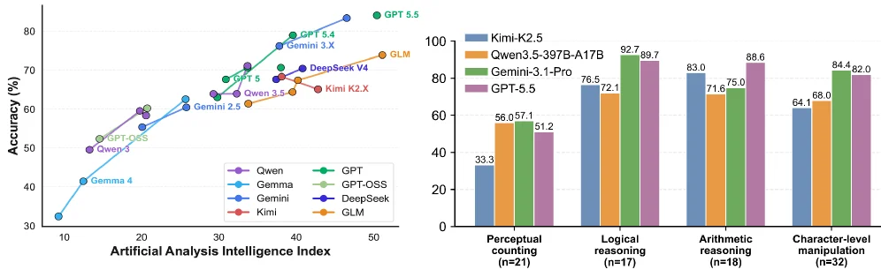
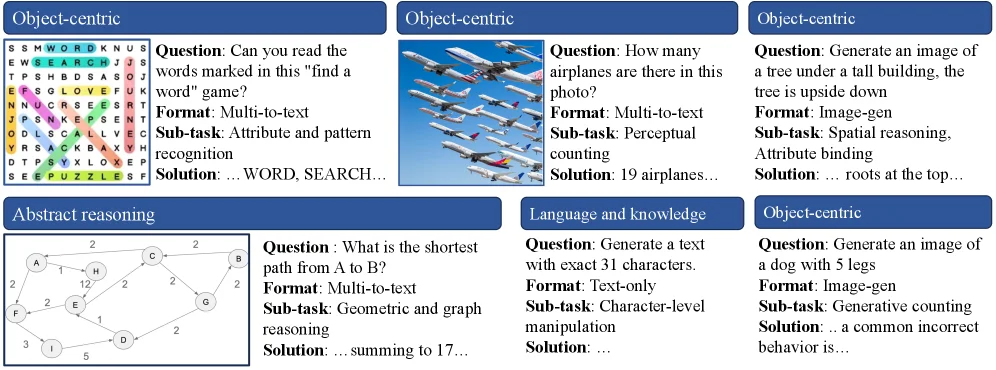
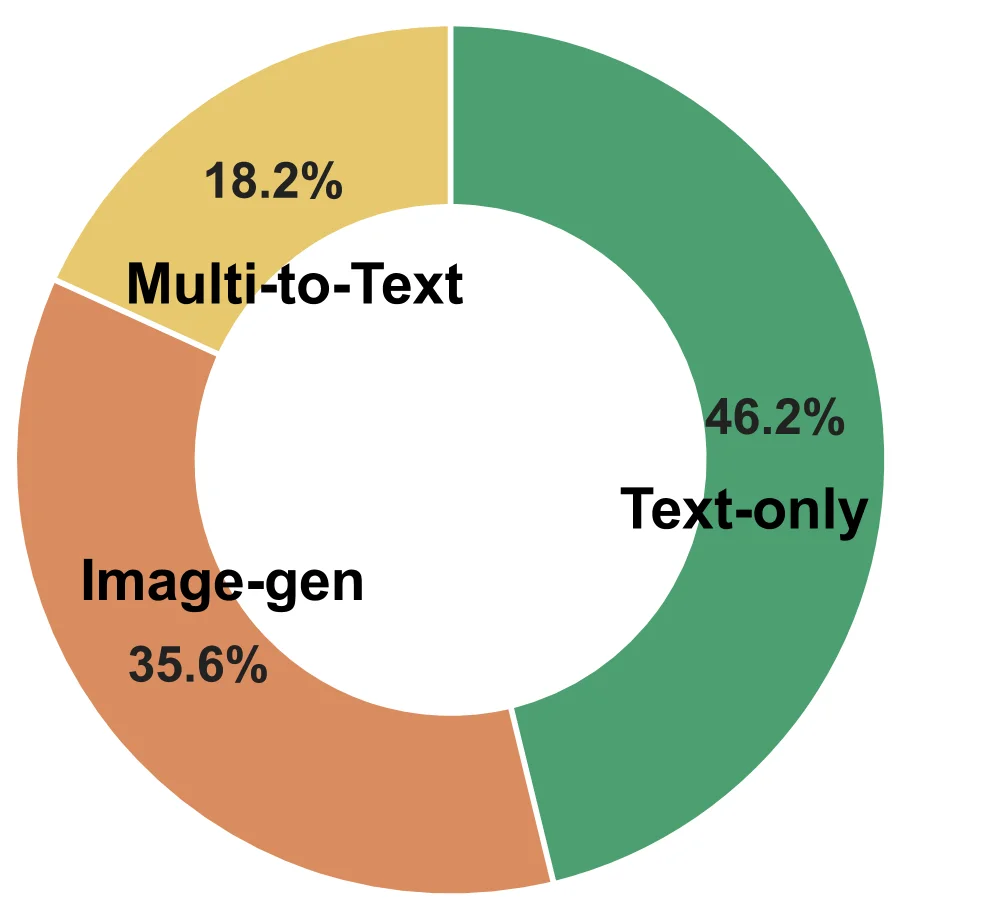
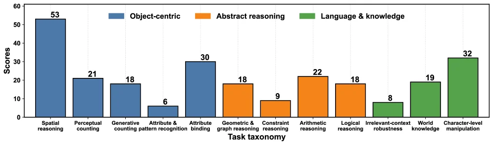
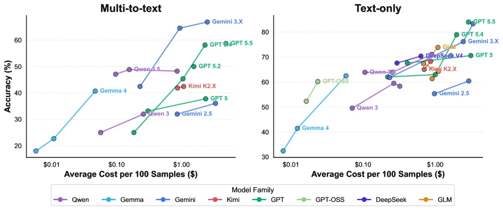
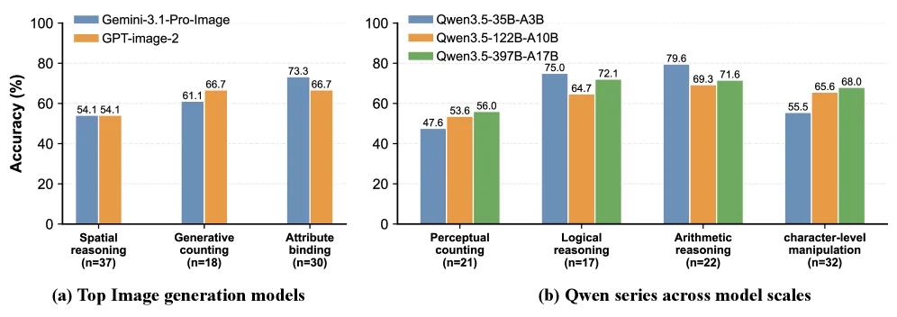
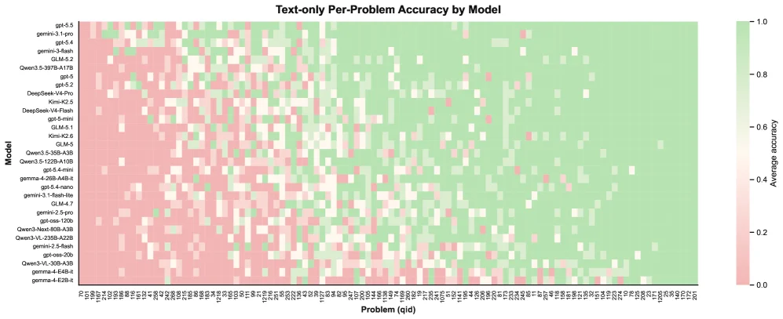
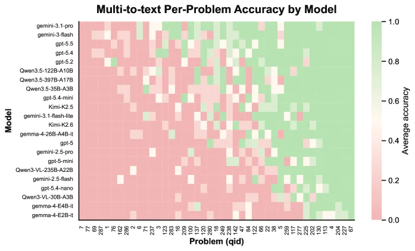
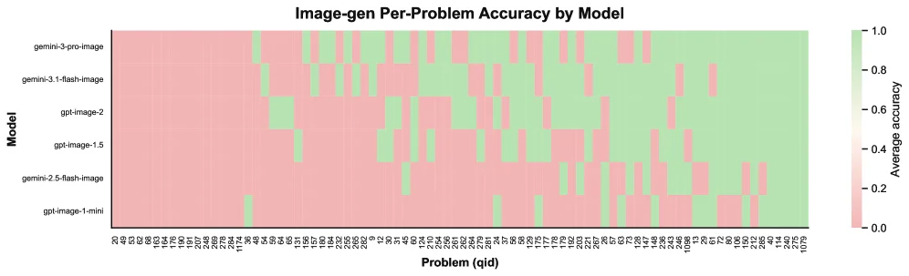

# Blind-Spots-Bench: Evaluating Blind Spots in Multimodal Models

[arXiv](https://arxiv.org/abs/2607.08317) · [HuggingFace](https://huggingface.co/papers/2607.08317) · ▲31

## 摘要（原文）

> Modern AI models achieve strong performance on many established benchmarks, yet they still fail on tasks that humans find almost trivial, such as manipulating a string or drawing a dog with five legs. These examples suggest that existing benchmarks may under-measure persistent blind spots in current systems. We introduce blind-spots-bench, a benchmark designed to expose such blind spots through tasks that appear simple for humans but remain challenging for modern AI. We collect raw questions from students in an AI course, clean and annotate them with structured reference solutions, and propose a task taxonomy tailored to the resulting dataset of 235 samples. We further develop an automated grading pipeline to evaluate a wide range of models, including open-weight and closed-source language, vision-language, and image-generation models. Our analysis on blind-spots-bench reveals that closed-source frontier models can substantially outperform open-weight models with even approx10% gap, even when they attain comparable performance on existing benchmarks. A more fine-grained analysis shows that no single model dominates across all task types, and that some tasks remain challenging for all evaluated models. These results highlight the value of blind-spots-bench as a diagnostic stress test for identifying concrete weaknesses in current modern models.

## 摘要（中译）

现代人工智能模型在许多已建立的基准测试中取得了强劲的性能，但它们仍然在人类认为几乎微不足道的任务上失败，例如操作字符串或画一只五条腿的狗。这些例子表明，现有的基准测试可能低估了当前系统中持久的盲点。我们引入了blind-spots-bench，这是一个旨在通过看似对人类简单但对现代人工智能仍具有挑战性的任务来揭示这些盲点的基准测试。我们从人工智能课程的学生中收集原始问题，清理并用结构化参考解决方案进行注释，并针对包含235个样本的数据集提出了一个任务分类法。我们进一步开发了一个自动评分管道，以评估广泛的模型，包括开放权重和封闭源语言、视觉-语言和图像生成模型。我们对blind-spots-bench的分析表明，即使在与现有基准测试相当的性能下，封闭源前沿模型也可以大幅超越开放权重模型，甚至差距达到approx10%。更细致的分析表明，没有单一模型在所有任务类型中都占主导地位，而且有些任务对所有评估的模型仍然具有挑战性。这些结果突显了blind-spots-bench作为诊断压力测试的价值，用于识别当前现代模型中的具体弱点。

## 背景剖析

### 背景剖析  

**1. 技术背景**  
近年来，大型语言模型（LLMs）和多模态模型（如视觉-语言模型、图像生成模型）在数学推理、代码生成、视觉理解等任务中表现出色，广泛应用于教育、医疗、内容创作等领域。例如，它们可以辅助学生解决复杂的数学问题，帮助医生分析医学影像，或生成高质量的图像和文本。然而，这些模型在处理一些对人类来说非常简单的任务时却屡屡失败，比如生成指定长度的字符串、绘制特定细节的图像（如五只腿的狗）或解决基础数独。这种“人类易如反掌，AI却困难重重”的现象表明，现有模型在某些核心能力上仍存在“盲点”，例如空间推理、逻辑一致性和字符级操作等。  

**2. 之前的问题**  
尽管现有基准测试（如MMLU、ImageNet）显示模型性能接近或超越人类水平，但这些测试往往侧重于评估模型在特定领域的整体表现，而忽略了那些看似简单但实际需要精细操作的场景。例如，传统基准可能测试模型是否能识别一只猫，但不会测试它能否生成一只“四条腿、两只眼睛”的猫（而人类可以轻松做到）。此外，许多基准依赖于自动化评分，难以捕捉模型在开放性任务中的真实能力缺陷。因此，研究者需要一种更细致的方法来暴露这些“隐藏的弱点”。  

**3. 本文的解法**  
为了解决这一问题，本文提出了一个名为“Blind-Spots-Bench”的基准测试。该基准通过收集学生在AI课程中提出的“AI无法正确回答的问题”，构建了一个包含235个任务的数据库。这些问题覆盖了三类核心能力：对象中心任务（如计数、空间推理）、抽象推理任务（如数学逻辑）和语言知识任务（如语言理解）。每个任务都附有结构化的参考答案，并设计了一个自动评分管道，用于评估包括开源和闭源模型在内的38种前沿模型。这种方法不仅能量化模型的弱点，还能揭示不同模型在特定任务类型上的优劣。  

**4. 切入角度**  
与以往工作相比，本文的关键差异在于：  
- **任务设计**：聚焦于“人类易、AI难”的场景，而非传统的“AI擅长、人类也擅长”的任务。  
- **评估方法**：结合自动评分和手动审计，确保评估的可靠性。  
- **任务分类**：提出了一套细粒度任务分类法，能够更精确地分析模型在不同子任务上的表现。  
- **模型覆盖**：同时评估了开源和闭源模型，揭示了两者在性能上的显著差异（例如，闭源模型在某些任务上比开源模型高出约10%）。  

通过这种方法，本文为理解和改进多模态模型的“盲点”提供了一个系统性的工具。

## 方法图解

> Figure 1 : Left : Accuracy on blind-spots-bench vs. Artificial Analysis Intelligence Index score for text-only problems. Right: Performance of four VLM models on several sub-tasks.

这张图来自论文《Blind-Spots-Bench: Evaluating Blind Spots in Multimodal Models》，分为左右两个部分，旨在展示所提出的“盲点基准测试”（blind-spots-bench）在评估现代AI模型能力方面的发现。

**左侧图表：文本问题的准确率与分析智能指数**

*   **图表类型与目的**：这是一个散点图（或折线图，因为数据点似乎按趋势连接），用于展示模型在“盲点基准测试”中针对纯文本问题的准确率与其“人工分析智能指数”之间的关系。
*   **X轴**：标记为“Artificial Analysis Intelligence Index”（人工分析智能指数），数值范围从10到50。这个指数可能是一个衡量模型处理需要人类分析能力任务的综合指标，数值越高表示模型在这方面越强。
*   **Y轴**：标记为“Accuracy (%)”（准确率，百分比），数值范围从30%到80%。这表示模型在“盲点基准测试”的文本问题上的正确回答比例。
*   **数据系列与趋势**：
    *   图中包含多个数据系列，每个系列用不同颜色和形状的点表示不同的模型，如GPT系列（绿色）、Gemini系列（蓝色）、GPT-OSS（浅绿色）、DeepSeek（紫色）、Qwen（粉色）、Kimi（红色）和GLM（橙色）。
    *   数据点大致沿着一条从左下到右上的趋势线分布，表明模型的“人工分析智能指数”越高，其在“盲点基准测试”文本问题上的准确率也越高。例如，GPT 5.5（绿色点）在X轴接近50时，Y轴准确率接近80%；而Gemma 4（蓝色点）在X轴约10时，Y轴准确率约为30%。
*   **信息流动**：读者首先观察X轴和Y轴的定义，然后识别不同颜色代表的模型。通过追踪每个模型的数据点，可以理解其“人工分析智能指数”与“盲点基准测试”准确率之间的正相关关系。结论是，在“盲点基准测试”中，模型的“人工分析智能指数”越高，其表现越好。

**右侧图表：四种视觉语言模型在子任务上的表现**

*   **图表类型与目的**：这是一个柱状图，用于比较四种特定视觉语言模型（VLM）在四个不同子任务上的性能。
*   **X轴**：代表四个不同的子任务，分别是：
    *   Perceptual counting (n=21)：感知计数，样本数为21。
    *   Logical reasoning (n=17)：逻辑推理，样本数为17。
    *   Arithmetic reasoning (n=18)：算术推理，样本数为18。
    *   Character-level manipulation (n=32)：字符级操作，样本数为32。
*   **Y轴**：标记为“Performance”，数值范围从0到100（或更高，如逻辑推理中的92.7和89.7）。这表示模型在每个子任务上的性能得分，具体度量方式未明确说明，但通常可能是准确率或某种评分。
*   **数据系列与对比**：
    *   图中有四种颜色的柱子，分别代表四个模型：
        *   蓝色：Kimi-K2.5
        *   橙色：Qwen3.5-397B-A17B
        *   绿色：Gemini-3.1-Pro
        *   紫色：GPT-5.5
    *   对于每个子任务，这四个模型的性能被并列展示，便于直接比较。
        *   在“Perceptual counting”任务中，GPT-5.5（紫色，51.2）略高于Gemini-3.1-Pro（绿色，51.2？或50.71？图中标注可能略有模糊，但GPT-5.5看起来最高），Qwen3.5-397B-A17B（橙色，56.05）次之，Kimi-K2.5（蓝色，33.3）最低。
        *   在“Logical reasoning”任务中，Gemini-3.1-Pro（绿色，92.7）和GPT-5.5（紫色，89.7）表现最佳，Qwen3.5-397B-A17B（橙色，76.5）次之，Kimi-K2.5（蓝色，72.1）再次之。
        *   在“Arithmetic reasoning”任务中，GPT-5.5（紫色，88.6）表现最佳，Gemini-3.1-Pro（绿色，76.0）次之，Qwen3.5-397B-A17B（橙色，71.6）再次之，Kimi-K2.5（蓝色，83.0？或76.0？图中标注可能需要仔细辨认，但GPT-5.5看起来最高）。
        *   在“Character-level manipulation”任务中，GPT-5.5（紫色，82.0）和Gemini-3.1-Pro（绿色，84.4）表现最佳，Qwen3.5-397B-A17B（橙色，68.0）次之，Kimi-K2.5（蓝色，64.1）再次之。
*   **信息流动**：读者首先识别X轴上的子任务和Y轴上的性能度量。然后，通过观察不同颜色柱子的高度，比较四种模型在每个子任务上的表现。结论是，不同模型在不同子任务上的表现存在差异，没有单一模型在所有子任务上都占据绝对优势。例如，GPT-5.5在多个任务上表现良好，但在“Character-level manipulation”上略逊于Gemini-3.1-Pro；Kimi-K2.5在多数任务上表现相对较弱。

**整体方法与结论（基于图和摘要）**：

这张图展示了“盲点基准测试”的应用。左侧图表显示了模型在“人工分析智能指数”与“盲点基准测试”文本问题准确率之间的正相关关系，暗示了该指数可能是一个有用的评估维度。右侧图表则具体比较了四种VLM在四个不同子任务上的表现，揭示了模型间的性能差异和特定任务的挑战性。

结合论文摘要，这种方法（即使用“盲点基准测试”）旨在暴露现代AI模型在看似简单但对人类来说很直观的任务上的弱点。结果显示，即使是封闭源代码的前沿模型（如GPT-5.5、Gemini-3.1-Pro）在与开放权重模型（如Qwen、Kimi）在现有基准测试上表现相当时，也可能在“盲点基准测试”上表现出显著优势（约10%的差距）。更细致的分析表明，没有一个模型能在所有任务类型上占据主导地位，并且某些任务对所有评估的模型都仍然具有挑战性。这些结果突显了“盲点基准测试”作为诊断压力测试的价值，用于识别当前现代模型的具体弱点。

---

> Figure 2 : Representative examples from the dataset. While these tasks are generally easy for human, we find that they remain challenging for frontier models. Each example is annotated with its solution (an abbreviated version here), question format, task and sub-task categories, illustrating the diversity of skills evaluated in the benchmark. Full taxonomy and additional examples in Appendix A .

这张图来自论文《Blind - Spots - Bench: Evaluating Blind Spots in Multimodal Models》，展示了该基准测试数据集中的代表性示例，目的是说明这些对人类来说通常很简单的任务，对前沿模型而言仍具有挑战性。

首先看各个板块：
- 左上角的“Object - centric”板块：左侧是一个类似找单词游戏的网格（包含字母和颜色标记），右侧是问题（“Can you read the words marked in this 'find a word' game?”）、格式（Multi - to - text）、子任务（Attribute and pattern recognition）以及部分解决方案（“... WORD, SEARCH...”）。这里的数据呈现是从视觉输入（网格）到问题，再到任务的分类和解决方案的展示，体现了从视觉任务输入到输出的流程，用于评估模型的属性和模式识别能力。
- 中上部的“Object - centric”板块：左侧是一张飞机的图片，右侧是问题（“How many airplanes are there in this photo?”）、格式（Multi - to - text）、子任务（Perceptual counting, Attribute binding）以及部分解决方案（“19 airplanes...”）。流程是从图像输入（飞机图）到问题，再到任务分类和解决方案，用于评估模型的感知计数和属性绑定能力。
- 右上角的“Object - centric”板块：问题是“Generate an image of a tree under a tall building, the tree is upside down”，格式是Image - gen，子任务是Spatial reasoning, Attribute binding，解决方案部分显示“... roots at the top...”。这里是文本输入（问题描述）到图像生成任务的流程，评估模型的空间推理和属性绑定能力来生成符合要求的图像。
- 左下角的“Abstract reasoning”板块：左侧是一个几何图形（包含节点和边的图结构，有数字标记），右侧是问题（“What is the shortest path from A to B?”）、格式（Multi - to - text）、子任务（Geometric and graph reasoning）以及部分解决方案（“... summing to 17...”）。流程是从图结构输入到问题，再到任务分类和解决方案，用于评估模型的几何和图推理能力。
- 中下部的“Language and knowledge”板块：问题是“Generate a text with exact 31 characters.”，格式是Text - only，子任务是Character - level manipulation，解决方案部分显示“...”。这里是文本输入（问题）到文本生成任务的流程，评估模型的字符级操作能力。
- 右下角的“Object - centric”板块：问题是“Generate an image of a dog with 5 legs”，格式是Image - gen，子任务是Generative counting，解决方案部分显示“... a common incorrect behavior is...”。这里是文本输入到图像生成任务的流程，评估模型的生成计数能力（生成有5条腿的狗的图像）。

这张图的方法展示逻辑是：通过收集不同类型的任务（包括视觉任务、抽象推理任务、语言知识任务等），每个任务都有对应的问题、输入格式（如多模态到文本、仅文本、图像生成等）、子任务类别（如属性和模式识别、感知计数、空间推理等）以及解决方案（部分展示），来体现基准测试的多样性。这些任务的设计目的是找出当前现代模型（包括开源和闭源的语言、视觉 - 语言、图像生成模型）在看似简单但对人类容易的任务上的弱点。

从结果角度（虽然图中主要是示例而非传统结果图，但能推断出方法的评估逻辑）：这些示例展示了不同任务类型，后续通过对各种模型（开源和闭源）在这些任务上的表现进行自动评分，发现闭源前沿模型在性能上可能比开源权重模型有显著优势（即使现有基准测试中性能相当），并且没有单一模型能在所有任务类型上占主导，有些任务对所有评估模型都仍有挑战。这体现了blind - spots - bench作为诊断压力测试的价值，用于识别当前现代模型的具体弱点。

总结来说，这张图通过展示不同类型的任务示例（包括输入、问题、格式、子任务、解决方案），说明了blind - spots - bench数据集的多样性，以及如何通过这些任务来评估模型的弱点，为后续的模型评估和分析提供了直观的任务示例基础。

---

> Figure 3 : Left: Question format composition. Right: Task category composition. Some questions (about 15) involve multiple subtask categories; for these cases, we count one occurrence for each applicable subtask. The bar chart reports the total number of occurrences for each fine-grained task category, grouped into three major categories.

这张图（图3的右侧部分，根据原始caption推断）是一个环形图（或称为饼图的一种变体），用于展示“任务类别构成”（Task category composition）。它清晰地将收集到的问题（总共235个样本）按照其主要的任务类型进行了分类，并以百分比的形式表示每种类型所占的比例。

图中的主要组件包括三个不同颜色的扇形区域，每个区域代表一种主要的任务类别：

1.  **绿色扇形区域**：这个区域占据了图表的最大部分，标注为“Text-only”，并显示了46.2%的百分比。这表示在所有问题中，有46.2%的问题属于“仅文本”类型。这类任务可能主要涉及文本处理、文本理解或文本生成，而不需要图像输入或输出。

2.  **橙色扇形区域**：这个区域标注为“Image-gen”，并显示了35.6%的百分比。这表示有35.6%的问题属于“图像生成”类型。这类任务要求模型生成新的图像，例如根据文本描述创建图像。

3.  **黄色扇形区域**：这个区域标注为“Multi-to-Text”，并显示了18.2%的百分比。这表示有18.2%的问题属于“多模态到文本”类型。这类任务可能涉及从多种输入模态（如图像和文本）中提取信息，并以文本形式输出结果。

根据原始caption的解释，这些数据是基于对235个样本的精细任务类别进行分组后得到的三个主要类别。caption还提到，有些问题（大约15个）涉及多个子任务类别；在这种情况下，对于这些问题的每一次出现，都会为每个适用的子任务计数一次。这意味着图中的百分比是基于这种计数方式得到的总出现次数比例。

这张图揭示了Blind-Spots-Bench数据集中任务的构成情况。它展示了不同类型任务在数据集中的分布，其中“仅文本”任务占比最高，其次是“图像生成”任务，最后是“多模态到文本”任务。这种分布信息对于理解基准测试的重点以及模型在不同类型任务上的表现至关重要。例如，如果一个模型在“仅文本”任务上表现良好，但在“图像生成”或“多模态到文本”任务上表现不佳，那么这可能表明该模型在这些特定类型的任务上存在盲点。

图中的信息流动是从具体的问题实例到其所属的任务类别，然后将这些类别汇总为三个主要类别，并以百分比的形式可视化展示。读者通过观察不同颜色区域的大小和对应的百分比，可以快速理解不同任务类型在数据集中的相对重要性。

---

> Figure 3 : Left: Question format composition. Right: Task category composition. Some questions (about 15) involve multiple subtask categories; for these cases, we count one occurrence for each applicable subtask. The bar chart reports the total number of occurrences for each fine-grained task category, grouped into three major categories.

这张图是论文《Blind-Spots-Bench: Evaluating Blind Spots in Multimodal Models》中的Figure 3的右侧部分，标题为“Task category composition”（任务类别构成）。它旨在展示基准测试中收集到的235个样本任务在不同细粒度任务类别上的分布情况，并将这些细粒度类别归入三个主要的大类中。

首先，我们来看图的结构：
- **X轴（横轴）**：代表“Task taxonomy”（任务分类），列出了具体的细粒度任务类别。从左到右依次是：Spatial reasoning（空间推理）、Perceptual counting（感知计数）、Generative counting（生成计数）、Attribute & pattern recognition（属性与模式识别）、Attribute binding（属性绑定）、Geometric & graph reasoning（几何与图推理）、Constraint reasoning（约束推理）、Arithmetic reasoning（算术推理）、Logical reasoning（逻辑推理）、Irrelevant-context robustness（无关上下文鲁棒性）、World knowledge（世界知识）和Character-level manipulation（字符级操作）。
- **Y轴（纵轴）**：代表“Scores”（分数或数量），但根据caption的解释，这里实际上是“total number of occurrences”（出现的总次数），即每个任务类别在基准测试中被记录的次数。
- **图例**：位于图表上方，定义了三种颜色的含义：
    - 蓝色（Object-centric）：以对象为中心的任务。
    - 橙色（Abstract reasoning）：抽象推理任务。
    - 绿色（Language & knowledge）：语言与知识任务。
- **数据条**：每个任务类别对应一个或多个数据条，颜色代表其所属的主要类别。数据条的高度表示该任务类别出现的次数。

根据caption的说明：“Some questions (about 15) involve multiple subtask categories; for these cases, we count one occurrence for each applicable subtask. The bar chart reports the total number of occurrences for each fine-grained task category, grouped into three major categories.” 这意味着：
1.  数据收集：基准测试包含235个样本任务。
2.  任务分类：每个任务可能属于一个或多个细粒度子任务类别。
3.  计数方法：如果一个问题涉及多个子任务类别，则对每个适用的子任务类别都计一次数。因此，图中的总数是所有任务在各个细粒度类别中的累计出现次数，这可能大于235。
4.  分组展示：这些细粒度类别被进一步归入三个主要的大类（以对象为中心、抽象推理、语言与知识）。

现在我们来分析图中的具体数据和信息流动：
-   **以对象为中心（蓝色）**：
    -   Spatial reasoning (空间推理)：53次，是所有类别中出现次数最多的。
    -   Perceptual counting (感知计数)：21次。
    -   Generative counting (生成计数)：18次。
    -   Attribute & pattern recognition (属性与模式识别)：6次。
    -   Attribute binding (属性绑定)：30次。
    -   这些任务主要涉及对物体的感知、计数、生成和属性绑定等。
-   **抽象推理（橙色）**：
    -   Geometric & graph reasoning (几何与图推理)：18次。
    -   Constraint reasoning (约束推理)：9次。
    -   Arithmetic reasoning (算术推理)：22次。
    -   Logical reasoning (逻辑推理)：18次。
    -   这些任务主要涉及逻辑、算术、几何等抽象思维能力。
-   **语言与知识（绿色）**：
    -   Irrelevant-context robustness (无关上下文鲁棒性)：8次。
    -   World knowledge (世界知识)：19次。
    -   Character-level manipulation (字符级操作)：32次，是绿色类别中出现次数最多的。
    -   这些任务主要涉及语言理解、知识应用和字符操作等。

信息的流动是从具体的任务实例（X轴上的每个类别）到其出现的频率（Y轴上的数值），并通过颜色归类到更高级别的任务大类。这张图揭示了Blind-Spots-Bench基准测试中任务的构成情况，显示了不同类型任务在基准中的分布。例如，以对象为中心的任务（如空间推理）在数量上占据主导地位，而字符级操作任务在语言与知识类别中也很突出。这张图帮助我们理解基准测试的重点和覆盖范围，为后续分析模型在不同任务类型上的表现提供了基础。

结论：这张图通过统计不同细粒度任务类别的出现次数，并将其归类到三个主要大类，清晰地展示了Blind-Spots-Bench基准测试的任务构成。它揭示了哪些类型的任务在该基准中更为常见，从而为评估模型在这些潜在盲点任务上的性能提供了依据。

---

> Figure 4 : Accuracy on blind-spots-bench vs. average cost for 100 samples. Colors distinguish model families; models of the same version but different sizes are connected.

这张图（图4）来自论文《Blind-Spots-Bench: Evaluating Blind Spots in Multimodal Models》，它展示了不同AI模型在“blind-spots-bench”这个基准测试上的准确率与处理100个样本的平均成本之间的关系。

首先，我们来看这张图的结构。它由两个并列的子图组成，分别位于左右两侧。左侧子图的标题是“Multi-to-text”，右侧子图的标题是“Text-only”。这两个子图分别代表了两种不同类型的任务或评估场景：“多模态转文本”（Multi-to-text）和“仅文本”（Text-only）。这种划分有助于我们理解模型在不同类型任务上的表现差异。

每个子图的横轴（X轴）都表示“Average Cost per 100 Samples ($)”，即处理100个样本的平均成本，单位是美元。这个轴从左到右数值增加，意味着成本从低到高。纵轴（Y轴）表示“Accuracy (%)”，即模型在该基准测试上的准确率，以百分比形式呈现，数值从下到上增加，意味着准确率从低到高。

图中的数据点用不同颜色的圆圈表示，每种颜色代表一个不同的“Model Family”（模型家族）。在图的底部有一个图例，清晰地列出了颜色与模型家族的对应关系：
- 紫色代表 Qwen（如 Qwen 3, Qwen 4.5）
- 蓝色（浅蓝）代表 Gemma（如 Gemma 4, Gemma 2.5）
- 蓝色（深蓝）代表 Gemini（如 Gemini 3.X, Gemini 2.5）
- 红色代表 Kimi（如 Kimi K2.X）
- 绿色代表 GPT（如 GPT 5, GPT 5.2, GPT 5.5）
- 浅绿色代表 GPT-OSS
- 深蓝色（另一种色调）代表 DeepSeek（如 DeepSeek V4）
- 橙色代表 GLM

图中还有一条重要的信息：同一版本但不同大小的模型（例如，可能是指参数量不同的同一系列模型）是用线段连接起来的。这使得我们可以观察到同一模型家族内，不同规模的模型在成本和准确率上的权衡。

现在我们来分析这张图揭示的方法和结果：

1.  **数据收集与评估流程**：
    *   这张图是基于“blind-spots-bench”基准测试的结果。该基准测试旨在评估现代AI模型在那些对人类来说看似简单但对AI仍有挑战性的任务上的表现。
    *   方法的核心是：收集问题（来自AI课程学生），清理并注释参考答案，然后使用自动化评分管道来评估各种模型的性能。
    *   图中的每个数据点代表一个特定模型在“blind-spots-bench”上的准确率，以及运行该模型处理100个样本的平均成本。

2.  **结果解读**：
    *   **成本与准确率的关系**：一般来说，随着处理成本的增加（向右移动），模型的准确率也倾向于提高（向上移动）。这表明更强大或更复杂的模型（通常成本更高）在这些基准测试上表现更好。
    *   **模型家族间的对比**：
        *   在“Multi-to-text”子图中，我们可以看到 Gemini 3.X 模型在较高的成本（约 $1.00）下达到了最高的准确率（超过60%）。GPT系列模型（如 GPT 5.5, GPT 5.2）也表现出色，尤其是在较高成本时。Qwen 4.5 和 Kimi K2.X 在中等成本范围内有不错的表现。
        *   在“Text-only”子图中，GPT 5.5 和 GPT 5.4 在较高的成本（约 $1.00 以上）下达到了最高的准确率（超过80%）。其他模型如 GLM、DeepSeek V4、Kimi K2.X 也在较高成本时表现出较好的准确率。
    *   **同一模型家族内的权衡**：例如，在“Multi-to-text”子图中，GPT系列的不同版本（GPT 5, GPT 5.2, GPT 5.5）通过连线展示出来，我们可以看到随着成本的增加，准确率也在提升。同样，Gemma系列（Gemma 4 vs Gemma 2.5）和 Qwen系列（Qwen 3 vs Qwen 4.5）也表现出类似的成本-准确率权衡。
    *   **关键结论**：
        *   **成本与性能的权衡**：图中清楚地显示了成本和准确率之间的正相关关系。更高的计算或资源成本通常带来更高的准确率。
        *   **模型家族的性能差异**：不同的模型家族在成本和准确率的表现上存在显著差异。例如，在某些成本区间，GPT系列模型可能比其他模型（如 Gemma 或 Qwen 的某些版本）表现更好。
        *   **没有单一的最优模型**：从图中可以看出，没有一个模型家族在所有成本水平和所有任务类型中都占据绝对优势。不同的模型在不同成本和不同任务类型（Multi-to-text vs Text-only）下可能表现更优。
        *   **任务的挑战性**：即使对于表现最好的模型，达到非常高的准确率也需要一定的成本投入，这暗示了这些“盲点”任务本身的挑战性。

总结来说，这张图通过可视化不同模型在“blind-spots-bench”上的准确率与其成本之间的关系，揭示了现代AI模型在处理特定类型“盲点”任务时的性能表现和成本效益。它表明，虽然更强大的模型通常能取得更好的准确率，但不同模型家族在不同成本和任务类型上的表现各不相同，并且没有单一模型能在所有方面都表现最佳。这种方法通过提供一个清晰的成本-性能对比，帮助研究人员和开发者理解不同模型的优势和劣势，从而为特定应用场景选择合适的模型。

---

> Figure 5 : Performance comparison of leading image generation and VLM models on the largest-sample subtasks within each model type.

这张图来自论文《Blind-Spots-Bench: Evaluating Blind Spots in Multimodal Models》，展示了不同模型在特定子任务上的性能比较。我们可以将其分为两个主要部分来详细解读：

首先，我们看到图的左侧部分，标记为(a) "Top Image generation models"（顶级图像生成模型）。这部分通过柱状图比较了两种图像生成模型在不同子任务上的准确率（以百分比表示）。横轴代表不同的子任务，包括“Spatial reasoning”（空间推理，样本数n=37）、“Generative counting”（生成计数，样本数n=18）和“Attribute binding”（属性绑定，样本数n=30）。纵轴表示准确率（%）。每种子任务下都有两根柱子，分别代表“Gemini-3.1-Pro-Image”（蓝色）和“GPT-image-2”（橙色）的性能。例如，在“Spatial reasoning”任务中，两个模型的准确率均为54.1%；在“Generative counting”任务中，“Gemini-3.1-Pro-Image”的准确率为61.1%，而“GPT-image-2”为66.7%。这个部分展示了顶级图像生成模型在不同类型任务上的表现差异。

接着，图的右侧部分，标记为(b) "Qwen series across model scales"（不同规模的Qwen系列模型）。这部分同样使用柱状图，但比较了同一系列（Qwen）中不同规模模型在各种子任务上的性能。横轴列出了不同的子任务，如“Perceptual counting”（感知计数，样本数n=21）、“Logical reasoning”（逻辑推理，样本数n=17）、“Arithmetic reasoning”（算术推理，样本数n=22）和“character-level manipulation”（字符级操作，样本数n=32）。纵轴依然是准确率（%）。每种子任务下有三根柱子，分别代表“Qwen3.5-35B-A3B”（蓝色）、“Qwen3.5-122B-A10B”（橙色）和“Qwen3.5-397B-A17B”（绿色）的性能。例如，在“Perceptual counting”任务中，这三个模型的准确率分别为47.6%、53.6%和56.0%。这个部分揭示了即使在同一系列中，模型规模的变化也会影响其在不同任务上的表现。

从整体来看，这张图揭示了以下方法和结论：
1. **方法**：该图展示了如何在特定的基准测试（blind-spots-bench）上评估不同类型的模型（图像生成模型和语言模型）。通过选择每个模型类型中表现最佳的模型，并在基准测试的最大样本子任务上进行比较，可以清晰地展示模型的性能差异。
2. **结论**：
   - 不同的图像生成模型在不同子任务上的表现存在差异。例如，“GPT-image-2”在“Generative counting”任务上优于“Gemini-3.1-Pro-Image”，而在“Spatial reasoning”任务上两者表现相同。
   - 同一系列的不同规模模型在各种子任务上的性能也有所不同。通常，较大的模型在某些任务上表现更好，但并非所有任务都如此。例如，“Qwen3.5-397B-A17B”在“Logical reasoning”和“Arithmetic reasoning”任务上表现最佳，但在“character-level manipulation”任务上，“Qwen3.5-122B-A10B”的表现优于其他两个模型。
   - 这些结果表明，没有单一模型在所有任务类型上都占主导地位，某些任务对所有评估模型来说仍然具有挑战性。这突显了blind-spots-bench作为诊断压力测试的价值，用于识别当前现代模型的具体弱点。

总之，这张图通过详细的性能比较，展示了不同模型在特定子任务上的表现差异，帮助我们理解模型的优势和不足。

---

> Figure 6 : Average accuracy for each model on each task, on text-only problems.

这张图（图6）展示了在“仅文本”问题（text-only problems）上，各个模型对每个任务的平均准确率。它是一个热力图（heatmap），通过颜色编码来直观地展示不同模型在不同任务上的表现。

首先，我们来看图的各个组成部分：

1.  **标题 (Title)**：“Text-only Per-Problem Accuracy by Model” 明确指出，这张图展示的是在仅文本问题上，每个模型的逐个问题准确率。
2.  **Y轴 (纵轴) - Model**：左侧的Y轴列出了参与评估的各种模型。这些模型按照某种顺序排列（可能是按整体表现、名称或其他标准），从上到下依次是 `gpt-4-5`、`gemma-31-pro`、`gpt-5-4`、`gpt-4-flash`、`GLM-4-2` 等。每个模型名称代表一个独立的AI模型。
3.  **X轴 (横轴) - Problem (qid)**：底部的X轴代表不同的问题或任务。每个位置对应一个特定的问题，用 `qid`（问题ID）标识。问题从左到右排列。
4.  **颜色条 (Color Bar) - 右侧**：右侧的颜色条是颜色编码的图例。它显示了颜色与“平均准确率 (Average accuracy)”之间的对应关系。颜色从红色（或粉红色）到绿色渐变：
    *   **红色/粉红色**：代表较低的准确率，接近0.0。
    *   **白色**：代表中等准确率，大约在0.4到0.6之间（根据颜色条的刻度推断）。
    *   **绿色**：代表较高的准确率，接近1.0。
    颜色越偏绿，表示模型在该问题上的表现越好；颜色越偏红，表示表现越差。
5.  **数据单元格 (Data Cells)**：图中的每个小方格（像素）代表一个特定模型在特定问题上的平均准确率。方格的颜色根据上述颜色条进行着色。例如，如果一个方格是深绿色，说明对应的模型在该问题上具有很高的准确率；如果是红色，则说明准确率很低。

**方法运作的揭示（如何得到这个结果）**：

这张图是基于“Blind-Spots-Bench”基准测试的结果。该基准测试旨在评估现代AI模型在那些对人类来说看似简单但对AI仍有挑战性的任务上的表现。具体到这张图：

1.  **数据收集与标注**：研究人员从AI课程的学生那里收集了原始问题，然后对这些进行了清理和注释，并提供了结构化的参考解决方案。
2.  **任务分类**：他们为这些数据集（共235个样本）开发了一个任务分类法。
3.  **自动化评分管道**：为了评估各种模型（包括开源和闭源的语言模型、视觉-语言模型和图像生成模型），他们开发了一个自动化评分管道。
4.  **评估**：这个自动化管道被用来评估每个模型在“仅文本”问题上的表现。对于每个模型和每个问题，系统会计算其平均准确率。
5.  **可视化**：最后，将这些平均准确率数据以热力图的形式呈现出来，其中Y轴是模型，X轴是问题，颜色表示准确率。

**坐标、对比对象和结论**：

*   **坐标**：
    *   Y轴坐标是不同的模型名称。
    *   X轴坐标是不同的问题ID（qid）。
    *   颜色坐标对应平均准确率（从0.0到1.0）。
*   **对比对象**：
    *   不同模型之间的对比：通过比较同一行（同一问题）上不同颜色方格的深浅，可以判断哪个模型在该问题上表现更好。
    *   同一模型在不同问题上的对比：通过比较同一列（同一模型）上不同颜色方格的深浅，可以判断该模型在不同问题上的表现差异。
*   **结论（从图中可以直观得出）**：
    *   **模型性能差异显著**：不同的模型在相同问题上的表现差异很大。有些模型在大多数问题上呈现绿色（高准确率），而有些模型则更多地呈现红色或白色（低或中等准确率）。
    *   **任务难度差异**：某些问题（即某些X轴位置）对于几乎所有模型来说都呈现红色或白色，这表明这些任务对当前AI模型来说普遍具有挑战性。
    *   **没有“全能”模型**：没有一个模型在所有问题上都呈现绿色。这说明不同的模型在不同的任务类型上各有优势和劣势。
    *   **整体趋势**：从图的右侧（可能代表更简单或更常见的任务）到左侧（可能代表更难或更特殊的任务），模型的整体准确率似乎有所下降，或者说红色区域增多。不过，更准确的解读是，不同模型在不同问题上的表现差异很大。

总而言之，这张热力图清晰地展示了在“仅文本”任务上，不同AI模型的性能分布情况，揭示了某些任务对所有模型都是挑战，同时也显示了模型之间的性能差异。这与论文摘要中提到的发现一致，即没有单一模型在所有任务类型上占据主导地位，且某些任务对所有评估模型都仍然具有挑战性。

---

> Figure 7 : Average accuracy for each model on each task, on multi-to-text problems.

这张图（图7）来自论文《Blind-Spots-Bench: Evaluating Blind Spots in Multimodal Models》，其核心是展示不同模型在“多模态到文本”（multi-to-text）问题上的平均准确率。我们可以从以下几个方面来详细解读这张图：

首先，我们来理解图的结构和各个组件的含义：

1.  **标题**：“Multi-to-text Per-Problem Accuracy by Model” 明确指出，这张图展示的是针对每个问题（Per-Problem），不同模型（by Model）在“多模态到文本”任务上的平均准确率（Accuracy）。

2.  **Y轴（纵轴）**：标记为“Model”，列出了参与评估的各种模型。这些模型按照一定的顺序排列，从上到下依次是：
    *   gemini-3.1-pro
    *   gemini-3-flash
    *   gpt-5.5
    *   gpt-5.4
    *   gpt-5.2
    *   Qwen3.5-122B-A10B
    *   Qwen3.5-3B7B-A17B
    *   Qwen3.5-35B-A3B
    *   gpt-5.4-mini
    *   Kimi-K2.5
    *   gemini-3.1-flash-lite
    *   Kimi-K2.6
    *   gemma-4-268B-A4B-it
    *   gpt-5
    *   gemini-2.5-pro
    *   gpt-5-mini
    *   Qwen3-VL-235B-A22B
    *   gemini-2.5-flash
    *   gpt-5.4-nano
    *   Qwen3-VL-30B-A3B
    *   gemma-4-E4B-it
    *   gemma-4-E2B-it
    这个列表展示了评估的模型范围，包括了不同厂商、不同规模、不同类型（如语言模型、视觉语言模型）的模型。

3.  **X轴（横轴）**：标记为“Problem (qid)”，表示不同的问题。每个问题都有一个唯一的标识符（qid），例如图中的“7/7”、“8/7”、“9/7”等，一直到“277”。这些qid代表了“Blind-Spots-Bench”基准测试中的235个样本问题（根据论文摘要）。问题从左到右排列。

4.  **颜色编码（热力图）**：图中的每个单元格（由模型和问题交叉形成）的颜色代表了该模型在解决对应问题时的平均准确率。颜色条（Color Bar）位于图的右侧，显示了颜色与准确率的对应关系：
    *   **绿色**：代表高准确率，接近1.0（即100%）。
    *   **红色**：代表低准确率，接近0.0（即0%）。
    *   **白色或浅色**：代表中等准确率（大约在0.4到0.6之间）。
    颜色的深浅变化直观地展示了模型在不同问题上的表现差异。

5.  **数据流动与信息解读**：
    *   **行方向（按模型）**：如果我们沿着某一行（即固定一个模型，横向看），我们可以看到该模型在所有问题上的表现。例如，我们可以观察到某个模型在某些问题上表现很好（绿色区域多），而在其他问题上表现较差（红色区域多）。
    *   **列方向（按问题）**：如果我们沿着某一列（即固定一个问题，纵向看），我们可以比较不同模型在解决这个特定问题时的表现。这有助于我们识别哪些模型擅长解决这类问题，哪些模型存在困难。
    *   **整体模式**：通过观察整个热力图，我们可以识别出一些整体模式，例如：
        *   某些模型在大多数问题上都表现较好（整体偏绿色）。
        *   某些模型在大多数问题上都表现较差（整体偏红色）。
        *   是否存在某些问题（列）对所有模型来说都很困难（整列颜色偏红）。
        *   是否存在某些问题（列）对所有模型来说都很容易（整列颜色偏绿）。

接下来，我们分析这张图揭示的方法运作方式和结果：

*   **方法运作方式**：这张图是基于“Blind-Spots-Bench”基准测试的结果。该基准测试收集了来自AI课程学生的问题，经过清理和注释，并提出了一个任务分类法。然后，开发了一个自动化评分管道来评估各种模型在这些任务上的表现。这张图正是这个评估过程的结果可视化，它将每个模型在每个问题上的平均准确率以热力图的形式呈现出来。

*   **对比对象**：这张图的对比对象是不同的AI模型。它允许我们直接比较同一问题上不同模型的表现，或者同一模型在不同问题上的表现。

*   **结论**：虽然这张图的caption已经指出这是“multi-to-text problems”的平均准确率，但从图本身我们可以推断出以下结论（结合论文摘要）：
    1.  **模型间存在显著差异**：从图中颜色的分布可以看出，不同模型在相同问题上的准确率差异很大。有些模型在很多问题上呈现绿色（高准确率），而有些模型则呈现较多的红色（低准确率）。这与论文摘要中提到的“closed-source frontier models can substantially outperform open-weight models with even approx 10% gap”（闭源前沿模型可以显著优于开源模型，差距甚至约为10%）相吻合。
    2.  **任务的挑战性**：图中存在一些红色区域，表明即使对于最先进的模型，某些任务仍然具有挑战性。这与论文摘要中提到的“some tasks remain challenging for all evaluated models”（某些任务对所有评估的模型来说仍然具有挑战性）一致。
    3.  **没有单一的“最佳”模型**：从图中可以看出，没有一个模型在所有问题上都表现最好（即没有一行完全是绿色）。这支持了论文摘要中的观点“no single model dominates across all task types”（没有单一模型在所有任务类型上都占主导地位）。
    4.  **暴露盲点**：这张图作为一个诊断工具，能够暴露出现有模型在某些特定任务上的弱点（即“盲点”）。这些弱点可能在现有的基准测试中没有被充分衡量，但这些任务对人类来说可能很简单。

总结来说，这张热力图通过颜色编码的方式，清晰地展示了不同模型在“Blind-Spots-Bench”基准测试中235个“多模态到文本”问题上的平均准确率。它不仅允许我们比较不同模型的性能，还能识别出模型在特定任务上的优势和劣势，从而揭示了现有AI模型在处理某些看似简单但对人类容易的任务时存在的“盲点”。

---

> Figure 8 : Average accuracy for each model on each task, on image-generation problems.

这张图（图8）来自论文《Blind-Spots-Bench: Evaluating Blind Spots in Multimodal Models》，它展示了不同模型在图像生成任务上的平均准确率。让我们详细解读这张图：

首先，这张图的核心是评估各种模型在处理特定图像生成问题时的表现。图的标题“Image-gen Per-Problem Accuracy by Model”明确指出了这一点。

**图的组成部分：**

1.  **Y轴（纵轴） - Model（模型）：**
    *   这个轴列出了被评估的不同模型。从上到下依次是：
        *   `gemini-3-pro-image`
        *   `gemini-3.1-flash-image`
        *   `gpt-image-2`
        *   `gpt-image-1.5`
        *   `gemini-2.5-flash-image`
        *   `gpt-image-1-mini`
    *   这些模型代表了不同类型或版本的多模态模型，特别是专注于图像生成的模型。

2.  **X轴（横轴） - Problem (qid)（问题）：**
    *   这个轴代表了图像生成任务中的各个独立问题。每个位置对应一个特定的问题，用“qid”（问题ID）标识。由于问题数量较多，具体的问题内容被简化为一系列标签。

3.  **颜色编码 - 平均准确率：**
    *   图中的每个单元格（由模型和问题的交叉点形成）都用颜色来表示该模型在解决对应问题时的平均准确率。
    *   右侧的色标（color bar）解释了颜色的含义：
        *   颜色越偏向绿色（接近1.0），表示准确率越高。
        *   颜色越偏向红色（接近0.0），表示准确率越低。
    *   这种可视化方式让我们能够快速识别出哪些模型在哪些问题上表现得好或差。

**数据或信息的流动与解读：**

*   这张图通过比较不同模型在同一问题上的颜色深浅，以及同一模型在不同问题上的颜色变化，来展示模型的性能差异。
*   例如，我们可以观察`gemini-3-pro-image`模型（最上面的模型）在大多数问题上显示为绿色，表明它在这些图像生成任务上通常具有较高的准确率。相比之下，`gpt-image-1-mini`模型（最下面的模型）在许多问题上显示为红色或橙色，表明其准确率较低。
*   同样，我们可以看到某些问题（即X轴上的某些位置）对于所有模型来说都呈现较深的红色，这表明这些问题对所有评估的模型都具有挑战性。
*   反之，某些问题可能对于大多数模型来说呈现绿色，表明这些问题相对容易解决。

**方法与结果的关联（基于论文摘要）：**

*   这张图是论文中介绍的“blind-spots-bench”基准测试的一部分。该基准测试旨在通过设计一些对人类来说看似简单但对现代AI模型具有挑战性的任务来揭示模型的“盲点”。
*   论文中提到，他们收集了来自AI课程学生的问题，经过清理和注释，并开发了一个自动评分管道来评估各种模型。
*   这张图正是这个自动评分管道的输出结果之一，它量化了每个模型在每个图像生成问题上的准确率。

**结论（从图中可以看出的信息）：**

*   **模型性能差异显著：** 不同模型在相同问题上的表现差异很大。一些模型（如`gemini-3-pro-image`）在多数问题上表现优异，而其他模型（如`gpt-image-1-mini`）则表现较差。
*   **任务的难度分布：** 某些问题对所有模型都很难（大量红色区域），而其他问题则相对容易（大量绿色区域）。这表明“blind-spots-bench”确实包含了一些对当前模型具有挑战性的任务。
*   **没有单一的“最佳”模型：** 图中没有显示任何一个模型在所有问题上都始终表现最好。这说明不同的模型可能擅长不同类型的任务，或者在处理不同类型的“盲点”时有不同的能力。
*   **支持论文发现：** 这张图支持了论文的发现，即封闭源代码的前沿模型可能在现有基准测试上表现出色，但在暴露特定“盲点”的基准测试（如blind-spots-bench）上，与开源模型之间存在显著的性能差距（如摘要中提到的约10%的差距）。虽然这张图本身没有直接比较开源和封闭模型的整体差距，但它展示了不同模型在特定任务集合上的性能分布，这与论文的发现一致。

总而言之，这张图通过颜色编码的平均准确率矩阵，清晰地展示了多种图像生成模型在一系列特定任务上的性能表现，从而帮助我们理解模型的优势和劣势，以及基准测试中任务的难度分布。它是评估模型在非传统但人类认为简单的任务上表现的有力工具。
