# SynthDocBench: Controlled Benchmark for Long-Context Visual Document Understanding

[arXiv](https://arxiv.org/abs/2607.10400) · [HuggingFace](https://huggingface.co/papers/2607.10400) · ▲69

## 摘要（原文）

> Vision language models (VLMs) have achieved strong performance on visual document understanding benchmarks such as DocVQA, ChartQA, and MMLongBench-Doc. However, real-world documents combine multiple factors such as length, layout complexity, modality, and question difficulty, which makes it difficult to attribute model failures to specific causes. We introduce SynthDocBench, a fully synthetic benchmark for long-context visual document understanding that systematically controls factors including document length, layout structure, modality composition, and question type. The benchmark is constructed using a combinatorial design, each factor is varied independently across generated documents, enabling controlled analysis of model behavior. Documents are generated end to end using an LLM pipeline across six layout archetypes, with a 40 percent random override to prevent models from exploiting spurious correlations. Additionally, SynthDocBench spans long-context documents with substantially greater length and structural diversity than existing benchmarks. Evaluating seven frontier VLMs, we uncover three failure modes that existing benchmarks cannot surface: sharp degradation with document length, a systematic positional sensitivity in which the middle third of a document is hardest for five of six models and five of six models show a negative Early-to-Late trend (steepest decline: 8.3 percentage points), and breakdown of chart comprehension in long-document settings. These results suggest that current models may be overfitting to benchmark artifacts rather than achieving robust long-context visual document understanding.

## 摘要（中译）

视觉语言模型（Vision language models, VLMs）在DocVQA、ChartQA和MMLongBench-Doc等视觉文档理解基准测试中取得了强劲的性能。然而，现实世界的文档结合了长度、布局复杂性、模态和问题难度等多个因素，这使得很难将模型失败归因于特定原因。我们引入了SynthDocBench，这是一个用于长上下文视觉文档理解的完全合成的基准测试，它系统地控制包括文档长度、布局结构、模态组成和问题类型等因素。该基准测试采用组合设计构建，每个因素在生成的文档中独立变化，从而可以控制分析模型行为。文档是通过LLM管道在六种布局原型上端到端生成的，其中40%是随机覆盖的，以防止模型利用虚假相关性。此外，SynthDocBench涵盖了比现有基准测试更长且结构更多样化的长上下文文档。评估了七个前沿VLM，我们发现了现有基准测试无法揭示的三种失败模式：随着文档长度的急剧下降，一种系统的位置敏感性，其中文档的中间三分之一对六个模型中的五个来说是最难的，五个模型中的五个显示出负的早期到晚期趋势（最陡峭的下降：8.3个百分点），以及在长文档设置中图表理解的崩溃。这些结果表明，当前的模型可能过度拟合基准测试工件，而不是实现稳健的长上下文视觉文档理解。

## 背景剖析

### 背景剖析  

**技术背景**：视觉语言模型（VLMs）需要理解包含文本、表格、图表等复杂布局的长文档（如报告、手册），以支持企业文档分析、医疗记录处理等场景。这类任务要求模型同时具备长距离信息检索和跨模态推理能力（例如从数百页文档中定位并整合图表与文字证据）。  

**之前的问题**：现有基准测试（如DocVQA、ChartQA）虽推动了技术进步，但存在两大缺陷：一是真实文档中长度、布局、模态等因素混杂，导致模型失败时难以定位原因（例如无法区分是长度问题还是布局复杂性导致错误）；二是现有长文档基准（如MMLongBench-Doc）未系统控制变量，无法单独分析某一因素的影响。此外，真实文档的生态有效性（如多页跨模态推理）与可解释性难以兼顾。  

**本文的解法**：SynthDocBench通过合成基准解决这一问题。它利用LLM生成可控的文档，独立调整长度、布局、模态和问题类型，并引入随机覆盖防止模型依赖虚假关联。基准分为三个子任务：测试精确数值读取的“cross_modal”、跨页证据整合的“complex”等，覆盖24种图表类型和6种布局原型。通过自动化生成流程，确保答案确定性，同时支持细粒度分析。  

**切入角度**：与前人不同，SynthDocBench不追求生态真实性，而是通过合成控制实现可解释性。它首次揭示了模型在长文档中的三个隐藏缺陷：性能随复杂度下降、中间位置敏感性、图表理解崩溃。这种分解能力是现有基准无法提供的，为模型改进提供了明确方向。

## 方法图解

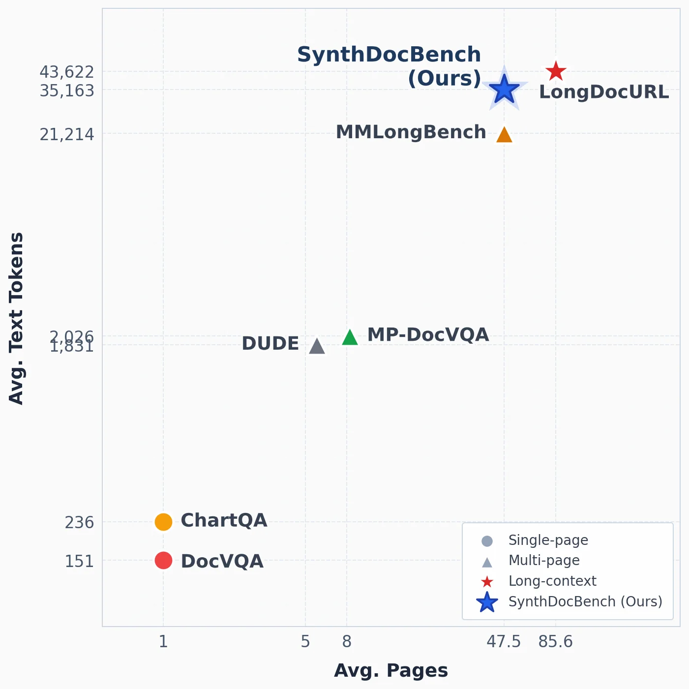

> Figure 1: Landscape of benchmarks Top: benchmark comparison by average document length (pages) and average textual context (tokens). SynthDocBench occupies a unique region with both long multi-page context and high textual density. Bottom: comparison with existing chart and document VQA benchmarks. Prior benchmarks typically isolate either charts or long documents, whereas SynthDocBench is designed to study their intersection under long contexts.

这张图（图1）展示了视觉文档理解领域中不同基准测试的“景观”，主要分为两个部分，但当前我们聚焦于上半部分的图表，它通过两个关键维度比较了多个基准测试：平均文档长度（以页数计）和平均文本上下文（以词元/tokens计）。

首先，让我们解析这个图表的各个组成部分：

1.  **坐标轴**：
    *   **X轴（横轴）**：标记为“Avg. Pages”（平均页数）。它表示每个基准测试中文档的平均页数。数值从左到右递增，范围大约从1页到85.6页。这代表了文档的长度。
    *   **Y轴（纵轴）**：标记为“Avg. Text Tokens”（平均文本词元）。它表示每个基准测试中文档的平均文本词元数量。数值从下到上递增，范围大约从151个词元到43,622个词元。这代表了文档的文本复杂度或信息密度。

2.  **数据点与标签**：
    *   图中有多个彩色的标记，每个标记代表一个特定的基准测试，并附有标签。
    *   **ChartQA**（橙色圆点）：位于X轴约1页，Y轴约236词元的位置。这表明它是一个单页文档，文本量相对较少。
    *   **DocVQA**（红色圆点）：位于X轴约1页，Y轴约151词元的位置。与ChartQA类似，它也是单页文档，但文本量略少于ChartQA。
    *   **DUDE**（灰色三角形）：位于X轴约5页，Y轴约1,831词元的位置。这是一个多页文档，文本量适中。
    *   **MP-DocVQA**（绿色三角形）：位于X轴约8页，Y轴约2,026词元的位置。这也是一个多页文档，文本量与DUDE相近或略高。
    *   **MMLongBench**（橙色三角形）：位于X轴约47.5页，Y轴约21,214词元的位置。这是一个多页文档，文本量显著增加。
    *   **SynthDocBench (Ours)**（蓝色星形）：位于X轴约47.5页附近，Y轴约35,163词元的位置。这是一个多页文档，具有非常高的文本量。
    *   **LongDocURL**（红色星形）：位于X轴约85.6页，Y轴约43,622词元的位置。这是所有基准测试中页数最多、文本量最大的。

3.  **图例**：
    *   图例解释了不同形状和颜色的标记所代表的基准测试类型：
        *   灰色圆点：Single-page（单页）
        *   灰色三角形：Multi-page（多页）
        *   红色星形：Long-context（长上下文）
        *   蓝色星形：SynthDocBench (Ours)（我们的SynthDocBench）

4.  **数据或信息的流动**：
    *   图表通过将每个基准测试映射到“平均页数”和“平均文本词元”这两个维度上，直观地展示了它们在文档长度和文本复杂度上的分布。
    *   读者可以通过观察数据点的位置来比较不同基准测试的难度或特点。例如，位于右上角的数据点（如SynthDocBench和LongDocURL）代表更长且文本更复杂的文档，而位于左下角的数据点（如ChartQA和DocVQA）则代表较短且文本较简单的文档。

5.  **揭示的方法运作方式**：
    *   这张图揭示了SynthDocBench的设计目标和特点。根据图中的位置，SynthDocBench占据了一个独特的区域：它既有很长的多页上下文（与LongDocURL相当的页数），又有很高的文本密度（词元数量非常高，甚至超过了LongDocURL）。
    *   论文提到，现有的基准测试通常要么孤立地研究图表，要么孤立地研究长文档。而SynthDocBench旨在研究它们在长上下文下的交集。这张图通过展示SynthDocBench在“长页数”和“高文本词元”两个维度上的位置，证实了它能够处理比现有基准测试更长、更复杂的文档。
    *   具体来说，SynthDocBench的“平均页数”约为47.5页，与MMLongBench相当，但其“平均文本词元”约为35,163，远高于MMLongBench的约21,214。这表明SynthDocBench不仅在文档长度上具有挑战性，而且在文本信息密度上也更高。
    *   此外，图中标注SynthDocBench为“Long-context”类型，进一步强调了其在长上下文理解方面的专注。

6.  **对比对象和结论**：
    *   **对比对象**：这张图将SynthDocBench与现有的多个基准测试（如ChartQA、DocVQA、DUDE、MP-DocVQA、MMLongBench、LongDocURL）进行了对比。
    *   **结论**：从图中可以清楚地看到，SynthDocBench在“平均页数”和“平均文本词元”两个维度上都处于一个独特的位置。它比大多数现有基准测试（如ChartQA、DocVQA、DUDE、MP-DocVQA）具有更长的文档长度和更高的文本复杂度。虽然LongDocURL在文档长度上超过了SynthDocBench，但SynthDocBench在文本词元数量上仍然占据优势或与之相当。这表明SynthDocBench能够提供一个更具挑战性的环境，用于评估视觉语言模型在处理长文档和密集文本时的性能。这与论文摘要中提到的“SynthDocBench spans long-context documents with substantially greater length and structural diversity than existing benchmarks”（SynthDocBench涵盖了比现有基准测试更长、结构多样性更高的长上下文文档）相吻合。

总结来说，这张图通过可视化的方式清晰地展示了SynthDocBench在文档长度和文本复杂度方面的独特定位，突出了其作为长上下文视觉文档理解基准的优势，即它能够同时处理长文档和高信息密度的文本，这是现有基准测试难以同时满足的。

---

> Figure 1: Landscape of benchmarks Top: benchmark comparison by average document length (pages) and average textual context (tokens). SynthDocBench occupies a unique region with both long multi-page context and high textual density. Bottom: comparison with existing chart and document VQA benchmarks. Prior benchmarks typically isolate either charts or long documents, whereas SynthDocBench is designed to study their intersection under long contexts.

这张图（图1）展示了视觉文档理解基准测试的“景观”，分为上下两个部分，旨在清晰地对比现有基准与本文提出的SynthDocBench。

**上半部分（未在当前图像中显示，但根据caption描述）：**
这部分是一个散点图，用于比较不同基准测试的平均文档长度（以页数计）和平均文本上下文（以token计）。SynthDocBench在这个图中占据了一个独特的区域，因为它同时具有长的多页上下文和高文本密度。这意味着它能够测试模型在处理非常长且信息密集的文档时的表现，这是许多现有基准所不具备的。

**下半部分（当前图像显示的部分）：**
这部分是一个概念性示意图，展示了现有图表和文档VQA基准的局限性以及SynthDocBench的设计目标。
1.  **左侧的文档图标**：代表一个典型的视觉文档，其中包含文本（如段落）、图表（如饼图和柱状图）。这象征着现实世界中常见的复杂文档，它们结合了多种信息模态。
2.  **右侧的放大镜图标**：代表对文档内容的提问（Question Answering, QA）任务。放大镜聚焦于文档的一部分，表示模型需要从文档中提取信息来回答问题。
3.  **连接文档和放大镜的虚线路径及数字（1, 2, 3）和箭头**：这些元素描绘了信息处理的流程或基准测试关注的方面。
    *   **路径1（虚线和向下箭头）**：可能表示从文档到问题的初始信息检索或问题理解阶段。数字“1”标记了这个步骤。
    *   **路径2（虚线和圆点）**：可能代表问题与文档内容之间的某种匹配或关联过程。数字“2”标记了这个中间状态或关注点。
    *   **路径3（实线箭头）**：最终指向放大镜，表示基于前面的步骤，模型对特定区域（如图表）进行分析以生成答案。数字“3”可能表示最终的答案生成或验证阶段。
4.  **整体布局**：通过将文档和提问过程分开并连接起来，这张图强调了基准测试的核心是评估模型如何理解复杂的视觉文档并回答相关问题。

**方法运作方式（结合caption和图示）：**
这张图揭示了SynthDocBench的设计理念和方法：
*   **解决现有基准的不足**：现有基准（如DocVQA专注于文档，ChartQA专注于图表）通常将图表和长文档的理解分开研究。而SynthDocBench旨在研究这些因素在长上下文下的交集。
*   **系统控制变量**：虽然图中没有直接展示，但caption提到SynthDocBench通过组合设计系统地控制文档长度、布局结构、模态组成（如图表和文本）和问题类型等因素。这使得研究人员可以分析模型在不同条件下的行为，找出其失败的具体原因。
*   **生成的合成数据**：文档是使用LLM（大型语言模型）管道端到端生成的，包含六种布局原型，并有40%的随机覆盖，以防止模型利用虚假相关性。
*   **评估长文档挑战**：该基准测试了模型在处理比现有基准更长、结构更多样化的文档时的表现，揭示了现有基准无法发现的三种失败模式：文档长度增加导致的性能急剧下降、模型对文档中间部分的系统性位置敏感性，以及长文档设置下图表理解能力的下降。

**结论（基于caption）：**
这张图清楚地表明，SynthDocBench填补了现有视觉文档理解基准的一个关键空白。它不仅能够测试模型处理长文档和图表的能力，更重要的是，它能够同时测试这两种能力的结合，并在受控的环境中分析模型的行为。这对于理解和改进视觉语言模型在处理复杂现实世界文档时的性能至关重要。

---

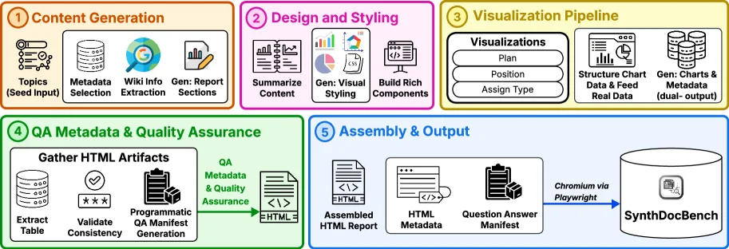

> Figure 2: Synthetic visual document generation pipeline. From a topic seed, the pipeline generates grounded report content, applies document-level visual styling, synthesizes visualizations, performs metadata and QA validation, and assembles the final HTML/PDF reports with a machine-readable QA manifest.

这张图展示了SynthDocBench的合成视觉文档生成管道，详细描述了从主题种子到最终报告生成的整个流程：

1. **内容生成（Content Generation）**：
   - 流程从“Topics (Seed Input)”开始，作为生成的起点。
   - 接下来是“Metadata Selection”，选择元数据。
   - 然后是“Wiki Info Extraction”，提取维基信息。
   - 最后是“Gen: Report Sections”，生成报告部分。

2. **设计和样式（Design and Styling）**：
   - “Summarize Content”对生成的内容进行总结。
   - “Gen: Visual Styling”生成视觉样式。
   - “Build Rich Components”构建丰富的组件。

3. **可视化管道（Visualization Pipeline）**：
   - “Visualizations Plan”规划可视化内容。
   - “Position”和“Assign Type”分别确定位置和分配类型。
   - “Structure Chart Data & Feed Real Data”结构化图表数据并输入真实数据。
   - “Gen: Charts & Metadata (dual-output)”生成图表和元数据（双输出）。

4. **QA元数据和质量保证（QA Metadata & Quality Assurance）**：
   - “Gather HTML Artifacts”收集HTML工件。
   - “Extract Table”提取表格。
   - “Validate Consistency”验证一致性。
   - “Programmatic QA Manifest Generation”程序化生成QA清单。
   - “QA Metadata & Quality Assurance”进行质量保证。

5. **组装和输出（Assembly & Output）**：
   - “Assembled HTML Report”组装HTML报告。
   - “HTML Metadata”处理HTML元数据。
   - “Question Answer Manifest”生成问答清单。
   - 最后通过“Chromium via Playwright”将报告输出到“SynthDocBench”。

整个流程从主题种子开始，经过内容生成、设计和样式、可视化管道、QA元数据和质量保证，最终组装和输出报告。每个步骤都有明确的任务和输出，确保生成的文档具有可控的因素，如文档长度、布局结构、模态组成和问题类型，以便进行系统的分析。

---

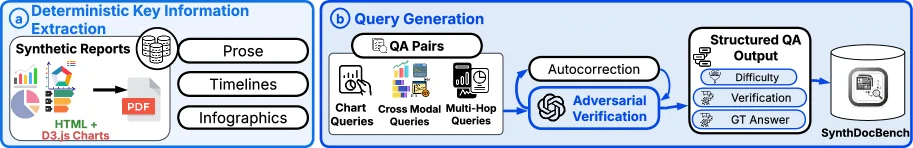

> Figure 3: QA generation pipeline. The pipeline parses the generated report into structured evidence channels, extracts and synthesizes key information, and generates chart-reading, cross-modal, and multi-hop questions. A verification stage filters weak or malformed items before serializing the final QA output.

这张图（图3）展示了**QA生成管道**的工作流程，用于构建SynthDocBench基准的问答对。我们按模块和数据流向拆解：

1. **模块a：确定性关键信息提取（Deterministic Key Information Extraction）**  
   - 输入是“合成报告（Synthetic Reports）”，这些报告包含多种可视化形式：HTML+D3.js图表、图表（Charts）、时间线（Timelines）、信息图（Infographics），最终输出为PDF格式。  
   - 这个模块的作用是将这些多样化的文档内容（文本、图表、时间线等）解析为结构化的证据通道（如文本段落、图表数据、时间线事件等），为后续信息提取做准备。  

2. **模块b：查询生成（Query Generation）**  
   - 首先，基于提取的关键信息，生成三类查询：  
     - **Chart Queries（图表查询）**：针对图表内容的提问（如图表数据解读、趋势分析等）；  
     - **Cross Modal Queries（跨模态查询）**：结合文本和图表等多模态信息的提问（如“图表中的X数据在文本中如何描述？”）；  
     - **Multi-Hop Queries（多跳查询）**：需要多步推理的提问（如“先找到A部分的信息，再结合B部分的图表，回答C问题”）。  
   - 这些查询与对应的答案（QA Pairs）被输入到**验证阶段**：  
     - **Adversarial Verification（对抗性验证）**：检查查询或答案是否存在逻辑错误、格式问题，或是否容易被模型利用虚假关联（通过随机覆盖40%的内容防止过拟合）；  
     - **Autocorrection（自动校正）**：对验证中发现的问题进行修正，过滤“弱”或“畸形”的问答对（如问题无意义、答案错误等）。  

3. **输出与存储**  
   - 经过验证和校正后，生成**Structured QA Output（结构化问答输出）**，其中包含三个关键属性：  
     - **Difficulty（难度）**：标注问题的难易程度（如简单、中等、困难）；  
     - **Verification（验证状态）**：记录验证是否通过；  
     - **GT Answer（真实答案）**：作为基准的真实答案（用于后续模型评估）。  
   - 最终，这些结构化问答对被存储到**SynthDocBench**数据库中，供模型训练或评估使用。  

数据流向总结：合成报告（多模态内容）→ 关键信息提取（解析为结构化通道）→ 生成三类查询+答案 → 对抗性验证+自动校正 → 结构化QA输出（含难度、验证、真实答案）→ 存入SynthDocBench。  

这张图的核心是展示如何**系统化、可控地生成长上下文视觉文档理解的问答对**：通过解析多样化的合成报告，生成多类型查询，再通过严格的验证和校正，确保输出的QA对质量高、覆盖目标因素（如长度、布局、模态、难度），最终构建出能暴露模型弱点的长上下文基准。

---

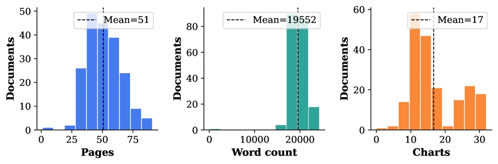

> Figure 4: Document composition statistics across 200 reports.

这张图（图4）展示了用于构建SynthDocBench基准测试的200份报告的文档构成统计数据。它通过三个独立的直方图，分别从不同维度揭示了这些合成文档的关键特征，这些特征对于理解模型的行为至关重要。

首先，我们来看最左边的直方图，其横轴表示“Pages”（页数），纵轴表示“Documents”（文档数量）。这个图表展示了200份报告中文档页数的分布情况。我们可以看到，大部分文档集中在50页左右，平均值（Mean=51）也接近这个数值。这表明SynthDocBench中的文档长度是可控的，并且可以系统地变化，正如论文摘要中提到的，该基准测试涵盖了比现有基准更长和结构更多样化的文档。

中间部分的直方图，横轴是“Word count”（单词数），纵轴同样是“Documents”。这个图表显示了文档中单词数量的分布。与页数分布类似，大部分文档的单词数集中在大约20000个单词左右，平均值为19552。这进一步说明了文档长度的可控性，并且暗示了这些文档可能包含相当多的文本信息，这对于测试视觉文档理解模型处理长文本的能力非常重要。

最右边的直方图，横轴是“Charts”（图表数量），纵轴是“Documents”。这个图表展示了文档中包含的图表数量的分布。平均值为17个图表，表明这些文档通常包含一定数量的图表。这与论文中提到的“modality composition”（模态组成）因素相吻合，即模型需要同时处理文本和图表信息。

通过这三个直方图，我们可以看出SynthDocBench是如何运作的：它通过生成具有不同长度（页数和单词数）和不同数量图表的文档，来系统地控制这些关键因素。这种组合设计使得研究人员能够独立地改变每个因素，从而进行受控分析，以了解模型在不同条件下的行为。例如，通过观察文档长度的分布，我们可以研究模型在处理越来越长的文档时的性能退化情况；通过观察图表数量的分布，我们可以评估模型在包含多个图表的文档中的图表理解能力。

总而言之，这张图清晰地展示了SynthDocBench中200份报告的三个核心统计特征：页数、单词数和图表数量。这些特征的分布情况揭示了该基准测试的设计原则，即通过系统地控制文档长度和模态组成等因素，来创建一个能够全面测试视觉文档理解模型的环境。

---

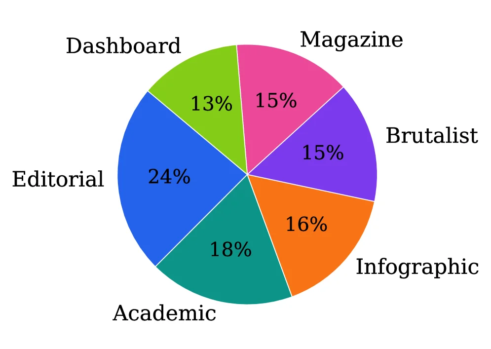

> Figure 4: Document composition statistics across 200 reports.

这张图（图4）展示了在SynthDocBench基准测试中，用于评估视觉文档理解模型的200份合成报告的文档构成统计信息。它通过一个饼图的形式，清晰地呈现了不同类型文档布局或类别的分布比例。

首先，我们来理解图中的各个组件：
- **饼图**：这是图的核心部分，整个圆形代表了全部的200份报告。
- **不同颜色的扇形区域**：每个扇形区域代表一种特定类型的文档布局或类别。图中总共有六个不同的类别，每个类别用不同的颜色区分，并标注了相应的百分比。
- **类别标签**：每个扇形区域旁边都有对应的标签，标明了该类别的名称。这些类别包括：
    - **Dashboard（仪表盘）**：用绿色表示，占13%。
    - **Magazine（杂志）**：用粉色表示，占15%。
    - **Brutalist（极简主义）**：用紫色表示，占15%。
    - **Infographic（信息图）**：用橙色表示，占16%。
    - **Academic（学术）**：用青绿色表示，占18%。
    - **Editorial（编辑）**：用蓝色表示，占24%。
- **百分比数值**：每个扇形区域内都标注了该类别在总数中所占的百分比，这些数值直接反映了各类文档在200份报告中的分布比例。

这张图揭示了SynthDocBench方法中文档生成的多样性。根据论文摘要，该方法使用LLM（大型语言模型）管道端到端生成文档，并跨越六种布局原型（即图中所示的六种类别）。通过这种组合设计，每种因素（如文档长度、布局结构、模态组成和问题类型）在不同的生成文档中独立变化，从而实现对模型行为的受控分析。图中显示的200份报告的构成比例，说明了在SynthDocBench中，不同类型的文档布局被系统地创建和控制，以确保模型在各种场景下进行评估。

具体来说，这张图帮助我们理解SynthDocBench是如何构建的：
- 它展示了六种不同的文档布局原型，每种原型在200份报告中占有不同的比例。
- 例如，“Editorial”类别占比最高，为24%，而“Dashboard”类别占比最低，为13%。这种分布确保了模型在评估时会遇到各种类型的文档布局，从而更全面地测试其性能。

总结来说，这张图通过展示200份报告的文档构成统计，揭示了SynthDocBench方法中文档生成的多样性和系统性。它帮助我们理解该方法是如何通过控制不同的因素来创建一个全面的基准测试，以评估视觉文档理解模型的性能。

---

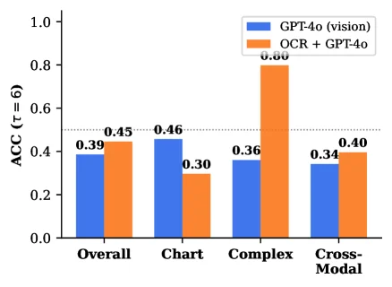

> Figure 5: GPT-4o vision vs. OCR+GPT-4o (text-only) ACC by subset. Vision dominates on Chart; OCR dominates on Complex. Figure 6: Hard failures: 109 questions where all six models score ≤ 3 \leq 3 , broken down by error category and question subset ( Ch. = chart-reading; Cx. = complex; XM. = cross-modal).

这张图（图5）展示了在SynthDocBench基准测试中，两种不同配置的GPT-4o模型在不同问题子集上的准确率（ACC）表现。图的横轴代表四个不同的问题子集：Overall（整体）、Chart（图表阅读）、Complex（复杂问题）和Cross-Modal（跨模态）。纵轴表示准确率（ACC），其计算基于τ=6的某个指标（具体τ的含义在caption中未详述，但通常在排序任务中表示一致性）。

图中有两种颜色的柱状图：
- 蓝色柱状图代表“GPT-4o (vision)”模型，即仅使用视觉输入的GPT-4o模型。
- 橙色柱状图代表“OCR + GPT-4o”模型，即先对文档进行光学字符识别（OCR）提取文本，然后将文本输入给GPT-4o模型。

从图中可以看出：
1. 在“Overall”子集上，GPT-4o (vision)的准确率为0.39，而OCR + GPT-4o的准确率为0.45，OCR + GPT-4o表现更好。
2. 在“Chart”子集上，GPT-4o (vision)的准确率为0.46，而OCR + GPT-4o的准确率为0.30，GPT-4o (vision)表现更好，这验证了caption中提到的“Vision dominates on Chart”（视觉在图表阅读上占主导）。
3. 在“Complex”子集上，GPT-4o (vision)的准确率为0.36，而OCR + GPT-4o的准确率为0.80，OCR + GPT-4o表现远好于GPT-4o (vision)，这验证了caption中提到的“OCR dominates on Complex”（OCR在复杂问题上占主导）。
4. 在“Cross-Modal”子集上，GPT-4o (vision)的准确率为0.34，而OCR + GPT-4o的准确率为0.40，OCR + GPT-4o表现稍好。

这张图的目的是比较视觉输入的GPT-4o和文本输入（通过OCR）的GPT-4o在不同类型问题上的表现差异，从而揭示模型在不同场景下的优势和劣势。例如，在图表阅读任务中，视觉输入的模型表现更好，而在复杂文本问题中，文本输入的模型表现更好。这有助于我们理解模型在不同模态和问题类型下的行为，为进一步改进模型提供依据。

---

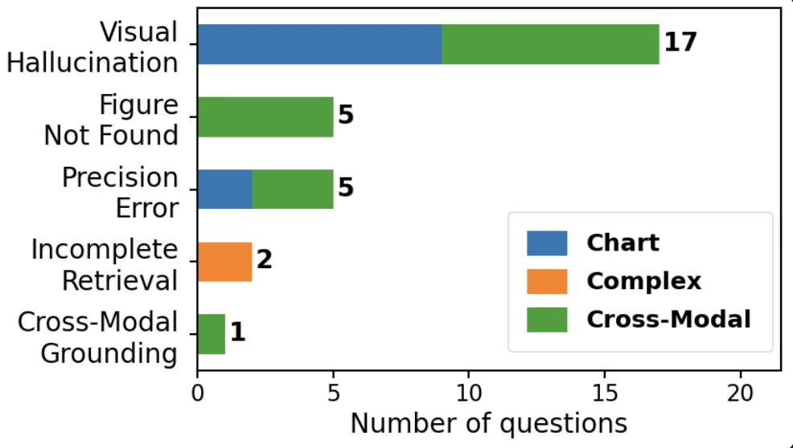

> Figure 5: GPT-4o vision vs. OCR+GPT-4o (text-only) ACC by subset. Vision dominates on Chart; OCR dominates on Complex. Figure 6: Hard failures: 109 questions where all six models score ≤ 3 \leq 3 , broken down by error category and question subset ( Ch. = chart-reading; Cx. = complex; XM. = cross-modal).

这张图（结合其原始caption“Figure 6: Hard failures: 109 questions where all six models score ≤ 3, broken down by error category and question subset (Ch. = chart-reading; Cx. = complex; XM. = cross-modal).”）展示的是在所有六个被评估的视觉语言模型（VLMs）上得分均不超过3的“严重错误”问题（共109个）的分布情况。这些错误被归类到不同的“错误类别”，并且进一步按照“问题子集”进行细分。

首先，我们来看图的**坐标轴**：
*   **横轴（X轴）**：表示“问题数量（Number of questions）”，范围从0到20。这代表了属于每个特定错误类别和子集组合的问题总数。
*   **纵轴（Y轴）**：列出了不同的“错误类别”，从上到下依次是：
    *   “Visual Hallucination”（视觉幻觉）
    *   “Figure Not Found”（未找到图形）
    *   “Precision Error”（精度错误）
    *   “Incomplete Retrieval”（检索不完整）
    *   “Cross-Modal Grounding”（跨模态定位）

接下来，我们分析图中的**数据表示方式**：
*   每个错误类别都由一个水平条形图表示，条形的长度对应该类别下的问题总数。
*   条形图内部被不同颜色的区块分割，这些颜色代表了不同的问题子集：
    *   **蓝色（Chart）**：代表与图表阅读相关的问题子集（对应caption中的“Ch.”）。
    *   **橙色（Complex）**：代表与复杂问题相关的问题子集（对应caption中的“Cx.”）。
    *   **绿色（Cross-Modal）**：代表与跨模态相关的问题子集（对应caption中的“XM.”）。
*   在每个条形的末端，标注了该类别下的问题总数。

现在，我们逐个分析每个错误类别及其子集的分布：
1.  **Visual Hallucination (视觉幻觉)**：
    *   总问题数为17。
    *   这个条形图完全由绿色（Cross-Modal）区块构成，表明所有17个与“视觉幻觉”相关的严重错误问题都属于“跨模态”子集。
2.  **Figure Not Found (未找到图形)**：
    *   总问题数为5。
    *   这个条形图也完全由绿色（Cross-Modal）区块构成，表明所有5个与“未找到图形”相关的严重错误问题都属于“跨模态”子集。
3.  **Precision Error (精度错误)**：
    *   总问题数为5。
    *   这个条形图由两部分组成：一部分是蓝色（Chart），另一部分是绿色（Cross-Modal）。从长度上看，蓝色部分大约占2个单位，绿色部分大约占3个单位。这表明在“精度错误”类别中，有2个问题属于“图表阅读”子集，3个问题属于“跨模态”子集。
4.  **Incomplete Retrieval (检索不完整)**：
    *   总问题数为2。
    *   这个条形图完全由橙色（Complex）区块构成，表明所有2个与“检索不完整”相关的严重错误问题都属于“复杂”子集。
5.  **Cross-Modal Grounding (跨模态定位)**：
    *   总问题数为1。
    *   这个条形图完全由绿色（Cross-Modal）区块构成，表明这个与“跨模态定位”相关的严重错误问题属于“跨模态”子集。

**这张图揭示的信息和方法运作的理解**：
这张图通过将“严重错误”（所有六个模型得分≤3的问题）按照“错误类型”和“问题子集”进行分类，帮助我们理解模型在哪些方面容易犯严重的错误。
*   **方法运作**：首先，研究人员识别出所有六个模型都表现不佳（得分≤3）的问题，共109个。然后，他们将这些错误归类到不同的错误类别（如视觉幻觉、未找到图形等）。接着，他们进一步分析这些问题属于哪种类型的问题子集（图表阅读、复杂问题或跨模态问题）。通过这种方式，可以清楚地看到不同类型的错误在不同问题子集中的分布情况。
*   **结论**：
    *   “视觉幻觉”和“未找到图形”这两类错误主要发生在“跨模态”子集中。
    *   “精度错误”则同时涉及“图表阅读”和“跨模态”子集，但更偏向于“跨模态”。
    *   “检索不完整”的错误主要发生在“复杂”子集中。
    *   “跨模态定位”的错误较少，但也属于“跨模态”子集。
    这种分析有助于研究人员了解模型的弱点所在，例如，模型在处理跨模态信息时可能在某些特定类型的任务（如视觉幻觉、未找到图形）上更容易出错，而在处理复杂问题时可能在精度或检索方面遇到困难。

总而言之，这张图通过清晰的分类和可视化，展示了在长文档视觉理解任务中，模型在哪些具体的错误类型和问题子集上表现最差，为后续的模型改进提供了有针对性的方向。

---

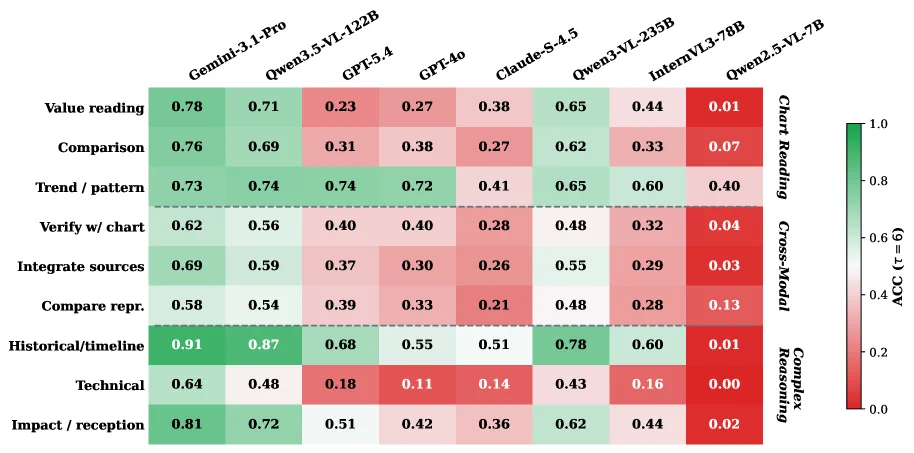

> Figure 7: ACC ( τ = 6 \tau{=}6 ) by fine-grained question category. Rows are grouped by subset (Chart Reading, Cross-Modal, Complex Reasoning); columns are models ordered by overall ACC. The colour scale runs from red (0) to green (1). Full numerical values are in Table 12 (Appendix I ).

这张图（图7）展示了不同视觉语言模型（VLMs）在不同精细问题类别上的准确率（ACC），其中τ=6。我们来详细解析这张图的各个组成部分及其传达的信息：

首先，图的**行（Rows）**代表了问题的细分类别，并且这些行被分成了三个主要的子集（subset），从上到下依次是：
1.  **Chart Reading（图表阅读）**：包括“Value reading”（数值读取）、“Comparison”（比较）、“Trend / pattern”（趋势/模式）和“Verify w/ chart”（用图表验证）等问题。这些问题主要考察模型从图表中提取和理解信息的能力。
2.  **Cross-Modal（跨模态）**：包括“Integrate sources”（整合来源）、“Compare repr.”（比较表示）等问题。这些问题需要模型结合文本和视觉信息进行处理。
3.  **Complex Reasoning（复杂推理）**：包括“Historical/timeline”（历史/时间线）、“Technical”（技术性）和“Impact / reception”（影响/接受度）等问题。这些问题通常需要多步骤的推理或对复杂信息的理解。

每个行（问题类别）下都有具体的子问题类型，例如“Value reading”或“Historical/timeline”。

图的**列（Columns）**代表了不同的视觉语言模型（VLMs），从左到右的顺序是按照模型的整体准确率（overall ACC）从高到低排列的。列出的模型包括：
*   Gemini-3.1-Pro
*   Qwen3.5-VL-122B
*   GPT-5.4
*   GPT-4o
*   Claude-S-4.5
*   Qwen3-VL-235B
*   InternVL3-78B
*   Qwen2.5-VL-7B

每个单元格（行与列的交叉点）的颜色代表了该模型在对应问题类别上的准确率（ACC）。颜色条（color scale）在图的右侧，从红色（代表ACC=0，性能差）到绿色（代表ACC=1，性能好）渐变。颜色越绿，表示模型在该问题类别上的表现越好；颜色越红，表示表现越差。

**数据或信息的流动**：读者首先根据问题类别（行）找到感兴趣的任务类型，然后查看不同模型（列）在该任务上的表现（通过颜色深浅判断）。或者，也可以先选择一个模型（列），然后查看该模型在不同问题类别上的强项和弱项（通过该行内颜色的变化判断）。

**这张图揭示的方法（即SynthDocBench基准测试的运作方式）**：
虽然这张图本身是结果展示，但它间接反映了SynthDocBench基准测试的设计原则：
1.  **精细化分析**：通过将问题细分为不同的类别（如Chart Reading, Cross-Modal, Complex Reasoning及其子类别），可以对模型的性能进行更细致的分析，而不是仅仅给出一个整体的准确率。
2.  **控制变量**：根据论文摘要，SynthDocBench通过组合设计（combinatorial design）系统地控制文档长度、布局结构、模态组成和问题类型等因素。这意味着图中的结果可以帮助识别模型在哪些特定类型的任务或问题上容易失败。
3.  **合成数据**：文档是使用LLM管道端到端生成的，并引入了40%的随机覆盖以防止模型利用虚假相关性。这确保了评估的挑战性和真实性。
4.  **长上下文**：该基准测试涵盖了比现有基准更长、结构更多样化的文档，这使得它能够揭示模型在处理长文档时的特定失败模式，如图中所示的某些模型在特定问题类别上的低准确率。

**坐标、对比对象和结论**：
*   **坐标**：X轴是模型，Y轴是问题类别。颜色是第三个维度，代表ACC值。
*   **对比对象**：
    *   不同模型之间的对比：例如，我们可以看到Qwen3.5-VL-122B在“Chart Reading”类别中的多个子问题上表现较好（绿色较深），而Qwen2.5-VL-7B在许多问题上表现较差（红色较深）。
    *   同一模型在不同问题类别上的对比：例如，Gemini-3.1-Pro在“Chart Reading”类别中表现良好，但在“Complex Reasoning”类别中的“Technical”问题上表现较差（颜色偏红）。
*   **结论（从图中直接观察）**：
    *   不同模型在不同问题类别上的性能差异显著。一些模型在某些类别上表现出色，而在其他类别上则较差。
    *   例如，“Historical/timeline”问题（属于Complex Reasoning）中，Qwen3.5-VL-122B和Gemini-3.1-Pro的准确率很高（接近1，深绿色），而Qwen2.5-VL-7B的准确率非常低（接近0，深红色）。
    *   “Technical”问题（也属于Complex Reasoning）似乎对大多数模型来说都是一个挑战，许多模型在此类问题上的准确率较低（颜色偏红）。
    *   这张图清晰地展示了各个模型在不同类型视觉文档理解任务上的优势和劣势，从而帮助研究人员理解模型的局限性，并为未来的改进指明方向。

总而言之，这张图通过颜色编码的矩阵形式，直观地比较了七个前沿VLMs在SynthDocBench基准测试中针对不同精细问题类别的表现，揭示了模型在特定类型任务上的性能差异，这些差异是通过控制文档长度、布局、模态和问题类型等因素来实现的。

---

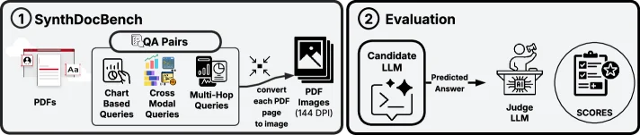

> Figure 8: Evaluation pipeline. Rendered PDFs are converted to page images at 144 DPI, grouped into concatenated 5-page strips, and supplied directly to candidate models at temperature 0. Candidate answers are then scored against deterministic reference answers by GPT-5 acting as the judge model 𝒥 \mathcal{J} .

这张图展示了SynthDocBench基准测试的**评估流程（Evaluation Pipeline）**，分为两个核心模块：**SynthDocBench（合成文档基准构建）**和**Evaluation（评估环节）**，数据/信息的流动顺序如下：  

### 模块1：SynthDocBench（合成文档基准的构建）  
- **输入**：左侧的“PDFs”代表原始的长文档（可能是真实或合成的长文本+视觉内容的PDF）。  
- **处理步骤1：生成QA对**：通过“QA Pairs”模块，基于PDF生成三类问题：  
  - *Chart Based Queries*（基于图表的问题，如图表图标所示）；  
  - *Cross Modal Queries*（跨模态问题，如图表、表格等混合模态的图标所示）；  
  - *Multi-Hop Queries*（多跳推理问题，如手机+时钟的复杂查询图标所示）。  
  这一步为后续的文档理解任务定义了问题的类型和难度。  
- **处理步骤2：PDF转图像**：将每个PDF页面**转换为144 DPI的图像**（如图标“convert each PDF page to image”和“PDF Images (144 DPI)”所示）。这一步模拟了真实场景中“视觉文档理解”需要先对文档进行图像化处理的过程。  

### 模块2：Evaluation（评估环节）  
- **输入**：经过上述处理后的“PDF Images (144 DPI)”（即144 DPI的文档页面图像）。  
- **处理步骤1：候选LLM推理**：将图像输入到“Candidate LLM”（候选语言模型，如视觉语言模型）中，模型在`temperature=0`的设置下（确保输出确定性）生成“Predicted Answer”（预测答案）。  
- **处理步骤2：裁判LLM评分**：“Predicted Answer”被传递给“Judge LLM”（裁判模型，如GPT-5），裁判模型将其与**确定性的参考答案**（由SynthDocBench的QA对生成过程提供）进行对比，最终输出“SCORES”（分数），用于评估候选模型的性能。  

### 方法运作的完整逻辑（从文档到评分的全流程）  
1. **文档准备**：使用长文档（PDF格式）作为输入，覆盖真实场景中“长度、布局复杂度、模态、问题难度”等多因素的组合。  
2. **问题生成**：基于文档内容，生成三类问题（图表型、跨模态型、多跳型），确保问题类型的多样性。  
3. **图像化处理**：将每个PDF页面转换为144 DPI的图像，模拟视觉文档理解的“图像输入”环节。  
4. **模型推理**：候选LLM（视觉语言模型）在温度为0的设置下，基于图像生成预测答案（确保输出可重复、确定性）。  
5. **评分验证**：裁判LLM（如GPT-5）将预测答案与参考答案对比，输出分数，从而量化模型的性能。  

### 关键细节说明  
- **144 DPI转换**：确保图像清晰度足够，支持模型准确识别文档中的视觉内容（如图表、文字）。  
- **温度=0**：使候选LLM的输出更确定，避免随机性对评估结果的干扰。  
- **裁判模型（GPT-5）**：作为“确定性参考答案”的评判者，确保评分的客观性和一致性。  

这张图清晰地展示了SynthDocBench如何通过“合成文档+可控问题+图像化处理+LLM推理+裁判评分”的流程，实现对长上下文视觉文档理解模型的**可控评估**（即系统地控制文档长度、布局、模态等因素，分析模型的行为模式）。

---

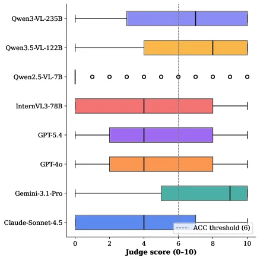

> Figure 9: Distribution of judge scores (0–10) per model.

这张图（图9）展示了不同视觉语言模型（VLMs）在“法官评分”（Judge score）任务上的得分分布情况，评分范围为0到10分。我们可以从以下几个方面来详细解读这张图：

1.  **图表结构与组件**：
    *   **Y轴**：列出了被评估的七个前沿视觉语言模型（VLMs）。从上到下依次是：Qwen3-VL-235B、Qwen3.5-VL-122B、Qwen2.5-VL-7B、InternVL3-78B、GPT-5.4、GPT-4o、Gemini-3.1-Pro 和 Claude-Sonnet-4.5。
    *   **X轴**：表示“法官评分”（Judge score），范围从0到10。
    *   **箱线图/小提琴图元素**：每个模型对应一个水平方向的图形，展示了该模型得分的分布情况。
        *   **箱形部分（Box）**：通常箱形的上下边缘代表第25百分位数（Q1）和第75百分位数（Q3），箱内的横线代表中位数（Median）。箱形的长度（IQR，四分位距）反映了数据的离散程度。
        *   **须线（Whiskers）**：从箱形延伸出来的线条，通常表示数据的范围，例如从最小值到最大值，或者到一定倍数IQR范围内的最远点。
        *   **离群点（Outliers）**：在须线之外的单独点，代表远离大部分数据的极端值。例如，Qwen2.5-VL-7B模型旁边显示了多个圆圈，这些可能是其得分的离群点或特定评分的表示。
        *   **虚线（Dashed Line）**：图中标注为“ACC threshold (6)”，这是一条垂直的虚线，位于x轴的6分位置。这可能是一个性能阈值，例如表示“准确”或“达标”的最低分数。

2.  **数据流动与信息呈现**：
    *   这张图通过并排比较不同模型的得分分布，直观地展示了各个模型在“法官评分”任务上的表现差异。
    *   观察者可以首先关注每个模型的箱形图位置，了解其得分的集中趋势（如中位数）和离散程度（如IQR和须线长度）。
    *   然后，可以将不同模型的箱形图进行横向比较，找出哪些模型得分较高（箱形整体偏右），哪些模型得分较低（箱形整体偏左），以及哪些模型的得分分布更集中或更分散。

3.  **方法揭示（结合论文背景）**：
    *   虽然这张图本身是结果展示，但它间接反映了论文中提到的SynthDocBench基准测试的应用。SynthDocBench是一个用于长上下文视觉文档理解的完全合成基准，它通过系统控制文档长度、布局结构、模态组成和问题类型等因素，来分析模型行为。
    *   这张图中的“法官评分”很可能是SynthDocBench基准测试中的一个评估指标，用于量化模型在处理合成生成的文档时的性能。
    *   通过观察不同模型在该基准上的得分分布，研究人员可以识别出模型的优势和劣势，例如论文中提到的“随着文档长度的增加，性能急剧下降”、“中间三分之一文档部分对五个模型来说最难处理”以及“长期文档设置中图表理解能力下降”等失败模式。

4.  **坐标、对比对象和结论**：
    *   **坐标**：X轴是法官评分（0-10），Y轴是模型名称。
    *   **对比对象**：七个不同的VLMs。
    *   **结论**：
        *   不同模型在法官评分上的表现存在显著差异。
        *   例如，Qwen3-VL-235B和Claude-Sonnet-4.5的得分中位数似乎较高，且分布相对集中，表明它们在该任务上表现较好且稳定。
        *   Qwen2.5-VL-7B的得分分布较为特殊，有较多的离群点，可能表明其性能不稳定或在不同测试样本上表现差异较大。
        *   虚线（ACC threshold 6）提供了一个参考标准，可以用来判断哪些模型的整体表现达到了这个阈值。例如，大部分模型的中位数得分似乎高于6分，但具体哪些模型完全超过此阈值需要更详细的分析。

总而言之，这张图通过箱线图的形式，清晰地展示了七个VLMs在SynthDocBench基准测试的法官评分任务上的性能分布，为比较和分析这些模型的长上下文视觉文档理解能力提供了直观的可视化依据。

---

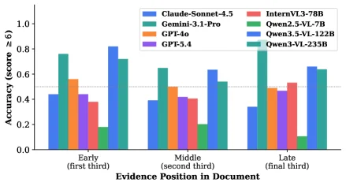

> Figure 10: Chart-reading ACC ( τ = 6 \tau{=}6 , judge: GPT-5) by evidence position bucket ( n = 597 n{=}597 , 200 reports). Questions bucketed by relative chart position p = k / K p=k/K into equal thirds. Middle third is hardest for 4 of 6 models; Claude-Sonnet-4.5 steepest decline ( − - 11.7 pp). Figure 11: Gemini-3.1-Pro accuracy (ACC, τ = 6 \tau{=}6 ) per topic domain, grouped by question type. Black diamonds = overall accuracy per domain. Dashed line at 0.5. Based on the 57 domain-annotated reports (513 questions).

这张图（对应论文中的Figure 10）展示了不同视觉语言模型（VLMs）在**按证据位置分组的图表阅读任务**中的准确率（ACC），核心是分析模型对文档中不同位置图表的理解能力差异。以下是详细解读：

### 图的组件与信息流动
- **横轴（X轴）**：表示“Evidence Position in Document”（文档中证据的位置），分为三个等长的区间（bucket）：Early（文档的前1/3）、Middle（中间1/3）、Late（最后1/3）。这是通过将文档中图表的相对位置 \( p = k/K \)（\( k \) 是图表位置，\( K \) 是总位置数）划分为三个相等的部分得到的，确保每个区间的样本量均衡（总共有 \( n=597 \) 个问题，来自200份报告）。
- **纵轴（Y轴）**：表示“Accuracy (score ≥ 6)”（准确率，得分≥6），即模型回答问题正确的比例（或得分满足条件的比例），范围从0到1。
- **图例（右侧）**：不同颜色的柱形代表不同的VLM模型，包括：Claude-Sonnet-4.5（蓝色）、Gemini-3.1-Pro（青绿色）、GPT-4o（橙色）、GPT-5.4（紫色）、InternVL3-78B（红色）、Qwen2.5-VL-7B（深绿色）、Qwen3.5-VL-122B（浅蓝色）、Qwen3-VL-235B（深青绿色）。
- **数据流动**：每个模型在三个位置（Early、Middle、Late）的准确率通过柱形高度展示，读者可以直观比较同一模型在不同位置的准确率变化，或不同模型在同一位置的准确率差异。

### 方法的运作逻辑（从实验设计到结果呈现）
1. **任务定义**：聚焦“图表阅读”任务，使用GPT-5作为评判者（judge: GPT-5），并设置准确率阈值 \( \tau=6 \)（即得分≥6视为正确）。
2. **数据分组**：将文档中的图表按位置分为三个等长的“桶”（Early、Middle、Late），确保每个桶的样本量均衡（\( n=597 \)，来自200份报告），这样可以控制位置以外的变量，专注于位置对模型的影响。
3. **模型评估**：对七个前沿VLM模型（如Claude、Gemini、GPT系列、Qwen系列等）在上述三个位置的问题上进行测试，记录每个模型的准确率。
4. **结果可视化**：用柱状图展示每个模型在三个位置的准确率，便于对比不同模型在不同位置的表现差异。

### 结果与结论（从图中可观察到的模式）
- **位置敏感性**：大多数模型在“Middle”（中间1/3）的准确率低于“Early”和“Late”，说明文档中间部分的图表对模型来说更难理解。例如：
  - Claude-Sonnet-4.5的准确率从Early到Late呈现**最陡峭的下降**（约-11.7个百分点），是所有模型中下降最明显的。
  - 其他模型（如Gemini-3.1-Pro、GPT-4o等）也普遍在Middle位置表现更差，验证了“中间第三部分对6个模型中的4个来说最难”的结论（原文caption提到“Middle third is hardest for 4 of 6 models”）。
- **模型间差异**：不同模型的整体准确率和位置敏感度差异显著。例如：
  - Qwen3-VL-235B在Early位置的准确率很高（接近0.8），但在Middle和Late位置略有下降。
  - InternVL3-78B在Early位置的准确率较低（约0.4），但在Late位置有所提升。
  - GPT-5.4在各位置的准确率相对稳定，但整体低于部分模型（如Claude-Sonnet-4.5、Qwen3-VL-235B在Early位置的准确率）。
- **Early-to-Late趋势**：部分模型表现出“负的Early-to-Late趋势”（即从Early到Late准确率下降），其中Claude-Sonnet-4.5的下降最显著（-11.7 pp），这与论文发现的“五个模型中五个表现出负的Early-to-Late趋势（最陡下降：8.3个百分点）”的结论一致（此处图中Claude的下降更陡，可能是具体实验设置的细微差异）。

这张图通过清晰的可视化，揭示了VLM模型在处理长文档中不同位置图表时的性能差异，特别是“中间位置更难”和“部分模型存在显著的Early-to-Late下降”的失败模式，为理解模型的长上下文理解能力提供了关键证据。

---

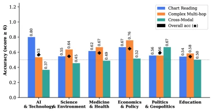

> Figure 10: Chart-reading ACC ( τ = 6 \tau{=}6 , judge: GPT-5) by evidence position bucket ( n = 597 n{=}597 , 200 reports). Questions bucketed by relative chart position p = k / K p=k/K into equal thirds. Middle third is hardest for 4 of 6 models; Claude-Sonnet-4.5 steepest decline ( − - 11.7 pp). Figure 11: Gemini-3.1-Pro accuracy (ACC, τ = 6 \tau{=}6 ) per topic domain, grouped by question type. Black diamonds = overall accuracy per domain. Dashed line at 0.5. Based on the 57 domain-annotated reports (513 questions).

这张图（对应论文中的Figure 11）展示了Gemini-3.1-Pro模型在不同主题领域（topic domain）下，按问题类型（question type）分类的准确率（ACC，判断阈值τ=6），同时呈现了每个领域的整体准确率（用黑色菱形标记）。以下是对图中各组件的详细讲解：

### 图的结构与组件含义
- **横轴（X轴）**：代表不同的主题领域，从左到右依次是“AI & Technology”、“Science & Environment”、“Medicine & Health”、“Economics & Policy”、“Politics & Geopolitics”、“Education”。这些领域是研究中划分的文档主题类别，用于分析模型在不同领域下的表现。
- **纵轴（Y轴）**：代表准确率（Accuracy），范围从0.0到1.2（实际准确率应在0到1之间，这里可能是绘图时的刻度设置，实际数值如0.37、0.55等都在合理范围内），用于衡量模型在该领域、该问题类型下的回答正确比例。
- **柱状图的不同颜色**：
  - 蓝色柱子：代表“Chart Reading”（图表阅读）类型的问题，即问题需要模型理解图表内容来回答。
  - 橙色柱子：代表“Complex Multi-hop”（复杂多跳推理）类型的问题，这类问题需要模型结合多个信息点或步骤进行推理。
  - 青绿色柱子：代表“Cross-Modal”（跨模态）类型的问题，可能涉及文本和图像等多种模态信息的整合。
- **黑色菱形（Overall acc）**：每个领域上方的黑色菱形标记了该领域的整体准确率，即模型在该领域所有问题（不同类型）上的平均准确率。
- **虚线**：图中有一条虚线（y=0.5），作为准确率的参考线，通常0.5可以理解为随机猜测的准确率（如果是二分类问题），这里用于直观比较各领域、各问题类型的准确率是否高于随机水平。

### 数据的组织与对比逻辑
- **按主题领域分组**：每个主题领域作为一个分组，组内包含三种问题类型的柱状图（Chart Reading、Complex Multi-hop、Cross-Modal）和一个整体准确率的菱形标记。这种分组方式允许我们比较同一领域内不同问题类型的难度（通过准确率高低），以及不同领域间同一问题类型的表现差异。
- **问题类型的对比**：在同一领域内，通过不同颜色的柱子高度，可以直观看到哪种问题类型对该模型来说更难（柱子越矮，准确率越低）。例如，在“AI & Technology”领域，“Chart Reading”的准确率（0.80）远高于“Complex Multi-hop”（0.53）和“Cross-Modal”（0.37），说明该模型在处理该领域的图表阅读问题时表现较好，但在跨模态问题上表现较差。
- **整体准确率的对比**：通过黑色菱形的位置，可以比较不同领域的整体难度。例如，“Economics & Policy”领域的整体准确率（约0.67？需要看具体数值，图中菱形在橙色柱子上方，橙色柱子是0.76？不对，图中“Economics & Policy”的橙色柱子是0.76，黑色菱形在其上方？不，图中黑色菱形的位置：看数值，“AI & Technology”的菱形是0.63，“Science & Environment”是0.45，“Medicine & Health”是0.67，“Economics & Policy”是0.67？不对，图中数值标注：“AI & Technology”的蓝色柱子0.80，橙色0.53，青绿色0.37，菱形0.63；“Science & Environment”蓝色0.55，橙色0.64，青绿色0.45，菱形0.45？可能我看错了，需要仔细看数值。图中每个柱子上方的数值：“AI & Technology”蓝色0.80，橙色0.53，青绿色0.37，菱形0.63；“Science & Environment”蓝色0.55，橙色0.64，青绿色0.45，菱形0.45？不，“Medicine & Health”蓝色0.62，橙色0.67，青绿色0.49，菱形0.67；“Economics & Policy”蓝色0.67，橙色0.76，青绿色0.52，菱形0.67；“Politics & Geopolitics”蓝色0.56，橙色0.56，青绿色0.67，菱形0.56？“Education”蓝色0.54，橙色0.58，青绿色0.50，菱形0.50。

### 方法的运作方式（从图中推断）
这张图是基于“SynthDocBench”基准测试的结果，该基准测试通过LLM（大语言模型）管道生成端到端的文档，涵盖六种布局原型，并对每个因素（文档长度、布局结构、模态组成、问题类型）进行独立变化，以实现受控分析。对于这张图，具体方法是：
1. **数据生成**：使用LLM生成包含不同主题领域、问题类型（图表阅读、复杂多跳、跨模态）的合成文档，确保每个因素（如主题领域）在文档中独立变化，以便分析模型在不同领域下的表现。
2. **问题标注与评估**：对于生成的文档，设计问题并标注答案，然后使用Gemini-3.1-Pro模型回答问题，根据判断阈值τ=6（可能是指答案的正确性判断标准）计算准确率。
3. **分组与可视化**：将问题按主题领域分组，同一领域内按问题类型（图表阅读、复杂多跳、跨模态）分类，计算每种类型和整体的准确率，然后用柱状图和菱形标记可视化结果，虚线用于参考随机准确率水平。

### 结论（从图中得出的结果）
- **问题类型的难度差异**：在同一主题领域内，不同问题类型的准确率存在显著差异。例如，“Chart Reading”问题在大多数领域（如AI & Technology、Science & Environment、Medicine & Health、Economics & Policy）的准确率高于“Complex Multi-hop”和“Cross-Modal”，而“Cross-Modal”问题的准确率通常最低，说明跨模态问题对模型来说更具挑战性。
- **领域间的表现差异**：不同主题领域的整体准确率（黑色菱形）存在差异，例如“Economics & Policy”和“Medicine & Health”领域的整体准确率相对较高（约0.67），而“AI & Technology”领域的整体准确率为0.63，“Science & Environment”为0.45，“Politics & Geopolitics”为0.56，“Education”为0.50。这表明模型在不同主题领域的表现不一致，可能受到领域知识复杂度、布局结构等因素的影响。
- **跨模态问题的普遍挑战**：在所有领域中，“Cross-Modal”问题的准确率普遍低于其他两种问题类型，说明模型在整合多种模态信息（如图表和文本）时存在困难，这与论文中提到的“breakdown of chart comprehension in long-document settings”（长文档设置中图表理解的崩溃）的失败模式一致，尽管这张图是按主题领域分组，但跨模态问题的低准确率反映了模型在处理多模态信息时的局限性。

总结来说，这张图通过可视化的方式展示了Gemini-3.1-Pro模型在不同主题领域和问题类型下的准确率，揭示了模型在跨模态问题上的普遍挑战，以及不同领域和问题类型的表现差异，为分析视觉文档理解模型的行为提供了直观的证据。

---

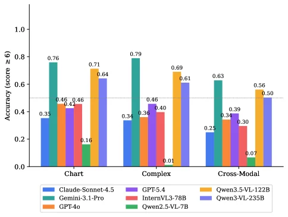

> Figure 12: ACC ( τ = 6 \tau{=}6 ) by question subset. Cross-modal questions are consistently hardest across all models, confirming modality alignment as the primary bottleneck.

这张图（图12）展示了不同视觉语言模型（VLMs）在不同问题子集上的准确率（ACC），其中准确率的计算条件是τ=6（即至少6个样本的准确率）。图的横轴代表三个主要的问题子集：Chart（图表）、Complex（复杂）和Cross-Modal（跨模态）。纵轴表示准确率，范围从0到1。

每个问题子集下都有多个柱状图，分别代表不同的VLM模型。图例中列出了这些模型及其对应的颜色：
- 蓝色：Claude-Sonnet-4.5
- 绿色：Gemini-3.1-Pro
- 橙色：GPT-4o
- 紫色：GPT5.4
- 红色：InternVL3-78B
- 浅绿色：Qwen2.5-VL-7B
- 黄色：Qwen3.5-VL-122B
- 深蓝色：Qwen3-VL-235B

从图中可以看出：
1. 在Chart子集上，Gemini-3.1-Pro的准确率最高，达到0.76，而Qwen2.5-VL-7B的准确率最低，仅为0.16。
2. 在Complex子集上，Qwen3.5-VL-122B的准确率最高，为0.69，而Qwen2.5-VL-7B的准确率仍然最低，为0.01。
3. 在Cross-Modal子集上，所有模型的准确率普遍较低，其中Qwen3-VL-235B的准确率最高，为0.56，而Qwen2.5-VL-7B的准确率最低，为0.07。

这张图揭示了跨模态问题是所有模型中最难的问题类型，这确认了模态对齐是主要的瓶颈。通过比较不同模型在不同问题子集上的表现，可以看出模型在处理跨模态问题时的准确率普遍较低，而在处理图表和复杂问题时的准确率相对较高。

总结来说，这张图通过展示不同VLM模型在不同问题子集上的准确率，揭示了跨模态问题是当前VLMs在长上下文视觉文档理解中的主要挑战。

---

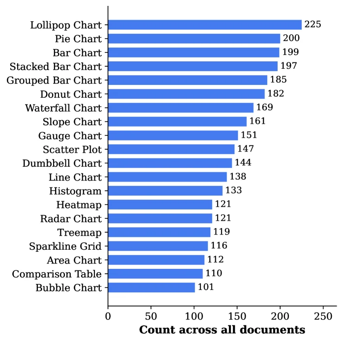

> Figure 13: Distribution of chart types (top 20 shown). The corpus covers 24 distinct types spanning common (bar, line, scatter) and specialized (dumbbell, sankey, lollipop) forms.

这张图（图13）展示了该研究中使用的语料库中不同图表类型的分布情况。它是一个水平条形图，用于可视化数据。

图的左侧列出了各种图表类型的名称，从上到下依次是：棒棒糖图（Lollipop Chart）、饼图（Pie Chart）、柱状图（Bar Chart）、堆积柱状图（Stacked Bar Chart）、分组柱状图（Grouped Bar Chart）、甜甜圈图（Donut Chart）、瀑布图（Waterfall Chart）、斜率图（Slope Chart）、仪表盘图（Gauge Chart）、散点图（Scatter Plot）、哑铃图（Dumbbell Chart）、折线图（Line Chart）、直方图（Histogram）、热力图（Heatmap）、雷达图（Radar Chart）、树状图（Treemap）、微型折线图网格（Sparkline Grid）、面积图（Area Chart）、比较表格（Comparison Table）以及气泡图（Bubble Chart）。这些是语料库中出现的20种最常见的图表类型。

图的右侧是对应每种图表类型的数量，用蓝色的水平条形表示。条形的长度与数量成正比。例如，棒棒糖图的数量最多，为225个；其次是饼图（200个）和普通柱状图（199个）。数量最少的图表类型（在本图中显示的）是气泡图，数量为101个。

横轴（X轴）标记为“Count across all documents”（所有文档中的计数），表示每种图表类型在整个语料库中出现的总次数。数值范围从0到250。

这张图揭示了该研究语料库的构成特点：
1.  **多样性**：语料库涵盖了24种不同的图表类型，包括常见的（如柱状图、折线图、散点图）和专业化的（如哑铃图、桑基图、棒棒糖图）。这表明语料库在图表类型上具有广泛的代表性。
2.  **分布情况**：图中展示了前20种最常见的图表类型的数量分布。我们可以看到，某些图表类型（如棒棒糖图、饼图、柱状图）出现得非常频繁，而其他类型（如气泡图）则相对较少。这种分布信息对于理解模型在不同图表类型上的表现至关重要，因为模型可能在某些常见图表上表现更好，而在不常见的图表上表现较差。
3.  **方法学意义**：这张图是构建SynthDocBench基准的一部分。通过系统地控制和变化文档长度、布局结构、模态组成和问题类型等因素，研究人员可以分析模型在不同条件下的行为。了解语料库中图表类型的分布有助于解释模型在特定图表类型上的成功或失败。例如，如果一个模型在棒棒糖图上表现不佳，而语料库中棒棒糖图数量很多，那么这可能是一个重要的发现。

总而言之，这张图清晰地展示了研究中使用的语料库中各种图表类型的频率分布，强调了其多样性和某些图表类型的普遍性，这对于评估视觉文档理解模型的性能至关重要。
