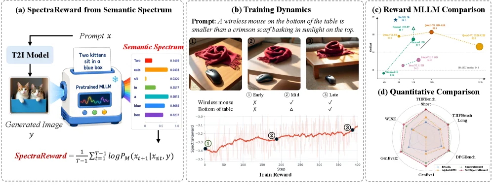
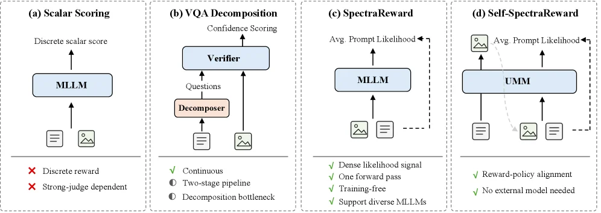
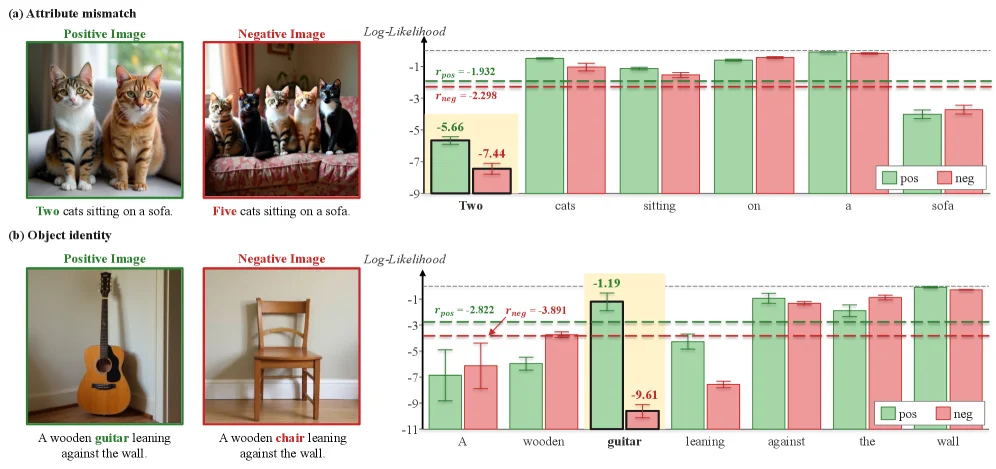
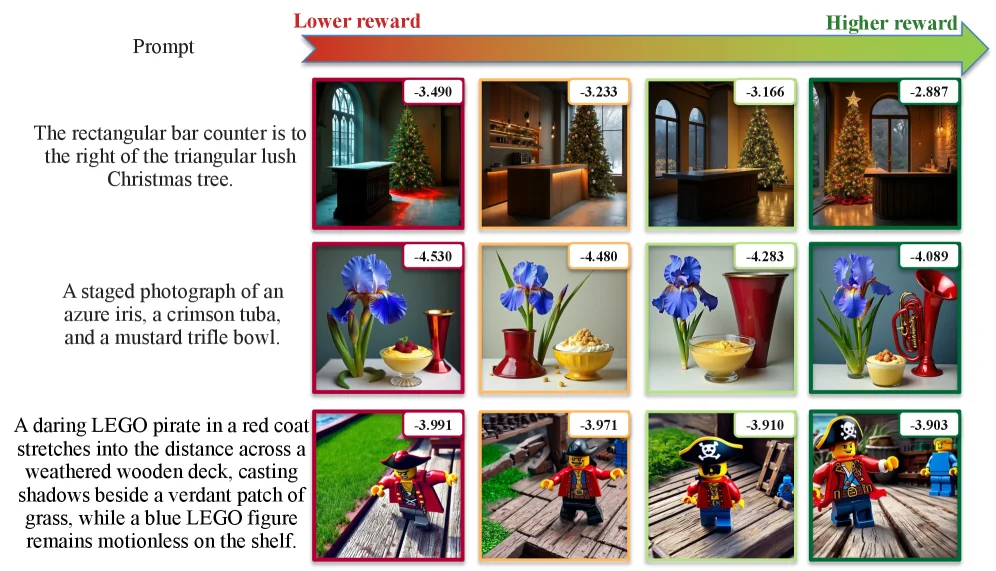
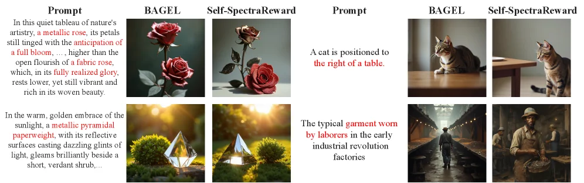
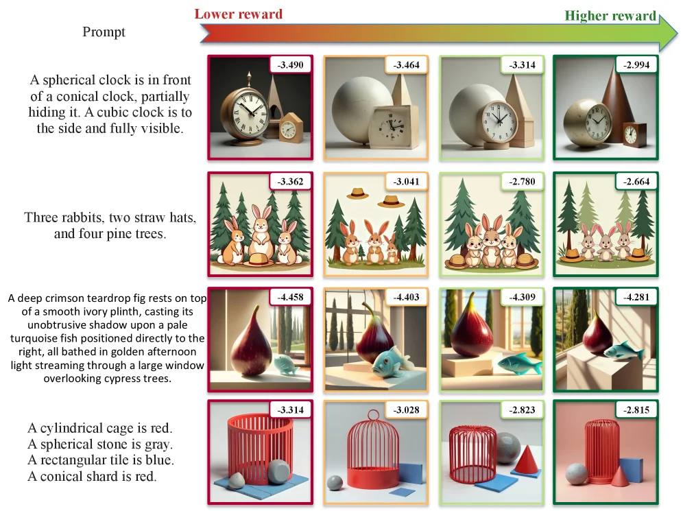
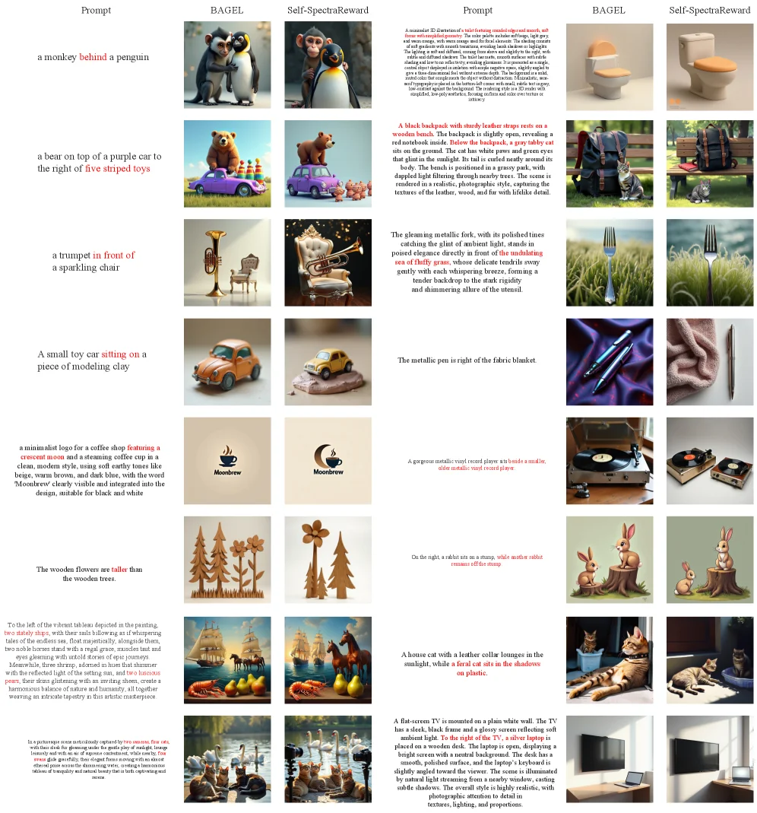

# Read It Back: Pretrained MLLMs Are Zero-Shot Reward Models for Text-to-Image Generation

[arXiv](https://arxiv.org/abs/2607.11886) · [HuggingFace](https://huggingface.co/papers/2607.11886) · ▲82

## Abstract (verbatim)

> In this paper, we propose SpectraReward, a training-free reward function that turns pretrained MLLMs into off-the-shelf reward models for image-generation reinforcement learning. Instead of asking the MLLM to judge a generated image or answer decomposed verification questions, SpectraReward measures how well the original prompt can be recovered from the generated image through a single image-conditioned, teacher-forced forward pass. We use the average image-conditioned prompt log-likelihood as the reward, directly reusing the MLLM's pretrained image-text alignment ability without preference labels, reward-model fine-tuning. We further introduce Self-SpectraReward, a special case for unified multimodal models where the policy's own understanding branch serves as the reward model for its generation branch, forming a closed-loop self-improving framework without external reward models or external knowledge. Extensive experiments validate SpectraReward through a broad image-generation RL study covering two diffusion models, three RL algorithms, nine reward MLLM backbones from four MLLM families spanning 4B to 235B parameters, and five out-of-distribution text-to-image benchmarks. Results show that both SpectraReward and Self-SpectraReward significantly and consistently improve generation performance and outperform prior MLLM-derived reward training methods. Further analysis reveals that larger reward MLLMs are not always better, while Self-SpectraReward can match or surpass much larger external reward models, suggesting that reward-policy alignment is a key factor for effective image-generation RL. Project Page: https://huangrh99.github.io/SpectraReward/

## Background

**Background Analysis**

Image generation technology has advanced rapidly in recent years, evolving from specialized text-to-image models to unified multimodal models (UMMs) that integrate visual understanding and generation capabilities. Reinforcement learning (RL) has emerged as a powerful post-training technique to enhance compositional fidelity and instruction-following, but its effectiveness hinges on two critical components: the optimization algorithm and the reward model. The reward model, in particular, determines the upper limit of the policy's performance, yet designing an efficient and reliable one remains challenging.

Previous approaches fall into two categories: those relying on human preference annotations, which are expensive to collect and iterate, and those repurposing pretrained multimodal large models (MLLMs) as zero-shot reward sources. While the latter avoids training costs, it suffers from issues like reward calibration sensitivity and scoring noise, or introduces complex engineering workflows for question decomposition. Existing methods thus fail to meet the need for a reward model that is simultaneously preference-label-free, training-free, and ready-to-use.

This paper proposes SpectraReward, which repurposes pretrained MLLMs as reward models by measuring how well generated images can "read back" the original prompts—specifically by computing the average log-likelihood of the prompt tokens conditioned on the image. For unified multimodal models, it introduces Self-SpectraReward, where the model's own understanding branch provides rewards for its generation branch, forming a closed-loop self-improvement framework without external dependencies.

Key differences from prior work include: 1) Instead of asking MLLMs to judge image quality or answer decomposed questions, SpectraReward uses a single forward pass to compute prompt recovery; 2) Self-SpectraReward leverages the model's internal architecture for reward-policy alignment, unlike previous methods relying on external models; 3) Experiments show that reward-policy distribution alignment matters more than sheer model scale, challenging conventional wisdom. This approach achieves better performance while maintaining efficiency.

## Method, Figure by Figure

> Figure 1 : Overview of SpectraReward. (a) Pretrained MLLMs naturally induce a semantic spectrum that measures how well a generated image aligns with the prompt. SpectraReward aggregates this into a reward for T2I RL. (b) During RL training, SpectraReward steadily increases together with visible improvements in complex scene generation. (c) We study nine reward MLLM backbones from four MLLM families, with external reward MLLMs spanning three families and 4B to 235B parameters. Scaling the reward MLLM backbones brings non-monotonic gains. Qwen3-VL-30B-A3B achieves the best performance among external MLLMs, while Self-SpectraReward, using BAGEL’s own understanding branch as the reward model, outperforms all external MLLMs. (d) Both SpectraReward and Self-SpectraReward bring significant and consistent improvements across all six downstream benchmarks compared to the baselines.

This figure is the core schematic of the paper "Read It Back: Pretrained MLLMs Are Zero - Shot Reward Models for Text - to - Image Generation", divided into four parts (a - d). We analyze them one by one:

### Part (a): Source of SpectraReward's Semantic Spectrum
- **Process and Components**: First, a T2I (Text - to - Image) model takes a prompt \( x \) (the example prompt here is "Two kittens sit in a blue box") and generates an image \( y \) (the image of two kittens in a blue box in the figure). Then, a pretrained Multimodal Large Language Model (MLLM) processes this generated image \( y \) and outputs a "Semantic Spectrum". The semantic spectrum uses different colors and values to represent the alignment scores of various semantic elements (such as "kitten", "cats", "sit", "in", "blue", "box") in the prompt (for example, the score of "kitten" here is 0.1469, and the score of "box" is 0.8237, etc.). Finally, the SpectraReward is calculated by aggregating the semantic spectrum through the formula \( \text{SpectraReward} = \frac{1}{T}\sum_{t = 1}^{T - 1}\log P_M(x_{t + 1}|x_{\leq t}, y) \) (there is no need to worry about the formula derivation, just understand that it uses the log - likelihood of the prompt under the image condition to calculate the reward) as the reward for T2I Reinforcement Learning (RL). The flow of data/information is: Prompt \( x \) → T2I model generates image \( y \) → Pretrained MLLM processes \( y \) to get the semantic spectrum → Calculate SpectraReward as the reward.

### Part (b): Training Dynamics
- **Process and Components**: The prompt is "A wireless mouse on the bottom of the table is smaller than a crimson scarf basking in sunlight on the top." (The wireless mouse at the bottom of the table is smaller than the crimson scarf basking in the sunlight on the top). Then, three training stages (Early, Mid, Late) of images are shown: ① In the Early - stage image, the positional relationship between the mouse and the scarf may not be accurate enough; ② It is improved in the Mid - stage; ③ It is more in line with the prompt description in the Late - stage. The table below records the satisfaction of key elements ( "Wireless mouse", "Bottom of table") in the prompt at each stage (X means not satisfied, △ means partially satisfied, √ means satisfied). At the same time, the "Train Reward" curve below shows the change of the reward during the training process. As the training steps (Step) increase, the reward gradually rises from about - 3.5 to close to 0, which shows that with the progress of training, the generated image is getting more and more in line with the prompt, and the feedback of the reward model (SpectraReward) makes the training move in the right direction. This part shows how SpectraReward stably increases with the increase of training steps during the RL training process, and the generation of complex scenes (such as the positional relationship between the mouse and the scarf) is also significantly improved.

### Part (c): Comparison of Reward MLLMs
- **Chart Type and Content**: This is a line chart (or a combination of a scatter plot and a line chart). The horizontal axis may be different reward MLLM models (or model size, family, etc.), and the vertical axis is a certain performance indicator (such as reward score or task performance). The figure shows nine reward MLLM backbones from four MLLM families (including external reward MLLMs and Self - SpectraReward), among which the external reward MLLMs span three families, and the parameters range from 4B to 235B. From the figure, we can see that the performance improvement of the reward MLLM is non - monotonic (that is, the larger the model, the better the performance is not necessarily). For example, Qwen3 - VL - 30B - A3B performs the best among external MLLMs, while Self - SpectraReward (using BAGEL's own understanding branch as the reward model) outperforms all external MLLMs. The comparison objects here are different reward MLLMs (including external and Self - SpectraReward), and the conclusion is that the performance improvement of the reward MLLM does not increase monotonically with the model size, and Self - SpectraReward is better than all external MLLMs.

### Part (d): Quantitative Comparison
- **Chart Type and Content**: This is a radar chart (or spider chart), which is used to compare the performance of SpectraReward and Self - SpectraReward with baselines on six downstream benchmark tests (such as WISE, TID2013 Bench Short, TID2013 Bench Long, GenEval2, DPGenBench, GenEval1). Each axis represents a benchmark test, and the farther the point on the axis is, the better the performance. From the figure, we can see that the performance of SpectraReward and Self - SpectraReward is farther out than that of the baselines on all six downstream benchmark tests, which shows that they bring significant and consistent performance improvement. The comparison objects are SpectraReward, Self - SpectraReward and various baselines, and the conclusion is that both methods significantly and consistently outperform the baselines on all downstream benchmark tests.

To summarize the working method of this figure: SpectraReward uses the image - text alignment ability of the pretrained MLLM to generate a reward for T2I RL by calculating the log - likelihood of the prompt under the image condition. During the training process, this reward increases with the increase of training steps, making the generated image more and more in line with the prompt. By comparing different reward MLLMs (including external and Self - SpectraReward), it is found that Self - SpectraReward has better performance and has significant improvement on all downstream benchmark tests.

---

> Figure 2 : Comparison of MLLM-based reward functions. (a) Scalar scoring directly asks an MLLM to assign a discrete image-text alignment score, making the reward sensitive to judge calibration and scoring noise. (b) VQA decomposition converts the prompt into atomic questions and aggregates verifier confidence, but introduces a two-stage pipeline and depends on the quality of question decomposition. (c) SpectraReward computes the image-conditioned prompt likelihood through a single teacher-forced forward pass. The resulting token-level likelihoods form a semantic spectrum, whose average is used as the scalar reward. (d) Self-SpectraReward instantiates the same prompt-likelihood reward within a unified multimodal model by using the policy’s own understanding branch, removing the need for an external reward MLLM and improving reward-policy alignment.

This figure (Figure 2) compares reward functions based on Multimodal Large Language Models (MLLMs), divided into four subfigures (a–d) from left to right. Each subfigure explains a different method, its workflow, and its characteristics:  

### Subfigure (a): Scalar Scoring  
- **Components & Flow**: Text (document icon) and image (image icon) inputs at the bottom feed into an "MLLM" module. The MLLM outputs a "Discrete scalar score".  
- **Method Logic**: Directly asks the MLLM to assign a discrete score to image-text alignment.  
- **Drawbacks**: Two red crosses indicate issues: ① The reward is sensitive to "judge calibration" (inconsistent scoring standards across evaluators); ② It is affected by "scoring noise" (unstable or random errors in scoring).  

### Subfigure (b): VQA Decomposition  
- **Components & Flow**: Text and image inputs feed into a "Decomposer" module, which generates "Questions". These questions (and the image) feed into a "Verifier" module, which outputs "Confidence Scoring".  
- **Method Logic**: Decomposes the original prompt into atomic questions, then aggregates the verifier’s confidence scores (from answering questions with the image) as the final reward.  
- **Features**: Green checkmarks and gray circles indicate: ① The reward is "Continuous"; ② It uses a "Two-stage pipeline" (decompose questions → verify), with a "Decomposition bottleneck" (quality of question decomposition limits performance).  

### Subfigure (c): SpectraReward  
- **Components & Flow**: Image and text inputs feed into an "MLLM" module. The MLLM computes the "Avg. Prompt Likelihood" (average likelihood of the prompt given the image), which is used as the reward.  
- **Method Logic**: Computes the image-conditioned prompt likelihood via a **single teacher-forced forward pass** (given the image, the MLLM is forced to compute the prompt’s likelihood). Token-level likelihoods form a "semantic spectrum", and their average is the scalar reward.  
- **Advantages**: Green checkmarks highlight: ① "Dense likelihood signal" (reuses the MLLM’s pre-trained image-text alignment without preference labels or reward model fine-tuning); ② "One forward pass" (efficient); ③ "Training-free"; ④ "Supports diverse MLLMs".  

### Subfigure (d): Self-SpectraReward  
- **Components & Flow**: Text and image inputs feed into a "UMM" (Unified Multimodal Model). The UMM computes "Avg. Prompt Likelihood", with a dashed arrow indicating the policy’s "understanding branch" (processing image and text) acts as the reward model for its "generation branch".  
- **Method Logic**: Implements the "prompt-likelihood reward" within a unified multimodal model, using the policy’s own "understanding branch" as the reward model (forming a closed-loop self-improving framework).  
- **Advantages**: Green checkmarks highlight: ① "Reward-policy alignment" (better alignment as the reward model is part of the policy); ② "No external reward models or external knowledge" (self-contained).  

### Overall Logic & Conclusion  
The figure contrasts four methods:  
- Scalar Scoring (a) relies on unstable discrete scores.  
- VQA Decomposition (b) is a two-stage process limited by decomposition quality.  
- SpectraReward (c) leverages pre-trained MLLMs for efficient, training-free rewards.  
- Self-SpectraReward (d) integrates the reward model into the policy’s understanding branch, enabling closed-loop self-improvement with better alignment and no external dependencies.  

Experiments (in the paper) validate these methods across diverse diffusion models, RL algorithms, MLLM backbones, and benchmarks, showing significant performance improvements.

---

> Figure 3 : Token-level semantic sensitivity of SpectraReward. Positive and negative images are evaluated using the same positive prompt. For attribute mismatch, instantiated as a counting error, the negative image mainly lowers the likelihood of “Two”; for object identity mismatch, replacing the guitar with a chair sharply lowers the likelihood of “guitar”. Bars show image-conditioned prompt-token log-likelihoods with error bars calculated over four pairs, and dashed lines show the resulting sequence-level reward value, i.e., SpectraReward.

This figure (Figure 3) demonstrates **SpectraReward's token-level semantic sensitivity**, focusing on explaining *why SpectraReward effectively measures the alignment between images and text prompts*. We break it down into two parts: **attribute mismatch** and **object identity mismatch**:  

### 1. Overall Logic: The "Text Prompt → Image → Token-Level Log-Likelihood → Sequence-Level Reward" Pipeline  
SpectraReward’s core idea is to use a **pretrained multimodal large language model (MLLM)’s "log-likelihood of the text prompt under the generated image" as the reward**—i.e., given an image, the model predicts the probability of each token in the original text prompt, and uses log-likelihood to measure alignment. The figure compares log-likelihoods of *positive images* (matching the prompt) and *negative images* (mismatching the prompt) to show how the model detects semantic differences.  

### 2. Subfigure (a): Attribute Mismatch (Count Error)  
- **Left Image**:  
  - Positive image (green box): "Two cats sitting on a sofa" (image content fully matches the prompt).  
  - Negative image (red box): "Five cats sitting on a sofa" (only the **count attribute** mismatches—cat count changes from 2 to 5).  

- **Right Chart (Token-Level Log-Likelihood)**:  
  - X-axis: Tokens in the text prompt, in order: "Two", "cats", "sitting", "on", "a", "sofa".  
  - Y-axis: Log-likelihood (higher values mean the model assigns a higher probability to the token given the image).  
  - Color: Green ("pos") = positive image’s log-likelihood; Red ("neg") = negative image’s log-likelihood.  
  - Key Observation: **The negative image drastically reduces the log-likelihood of "Two"** (positive ≈ -5.66, negative ≈ -7.44), while other tokens (e.g., "cats", "sitting") change little. This shows SpectraReward precisely captures *count attribute* mismatches—when an image’s count disagrees with the prompt, the log-likelihood of the corresponding count token (e.g., "Two") drops sharply.  
  - Dashed Line & Reward: The dashed line represents the **sequence-level reward** (SpectraReward). It is calculated as the *average log-likelihood of the positive image* minus the *average log-likelihood of the negative image* (or directly using the positive average). The figure shows \( r_{\text{pos}} = -1.932 \) and \( r_{\text{neg}} = -2.298 \)—the negative reward is lower, so it distinguishes "positive images better match the prompt".  

### 3. Subfigure (b): Object Identity Mismatch  
- **Left Image**:  
  - Positive image (green box): "A wooden guitar leaning against the wall" (image content fully matches the prompt).  
  - Negative image (red box): "A wooden chair leaning against the wall" (**object identity** mismatches—guitar replaced by a chair).  

- **Right Chart (Token-Level Log-Likelihood)**:  
  - X-axis: Tokens in the text prompt, in order: "A", "wooden", "guitar", "leaning", "against", "the", "wall".  
  - Y-axis: Log-likelihood.  
  - Color: Green ("pos") = positive image; Red ("neg") = negative image.  
  - Key Observation: **The negative image drastically reduces the log-likelihood of "guitar"** (positive ≈ -1.19, negative ≈ -9.61), while other tokens (e.g., "A", "wooden", "leaning") change slightly. This shows SpectraReward precisely captures *object identity* mismatches—when an image’s object disagrees with the prompt, the log-likelihood of the corresponding object token (e.g., "guitar") drops sharply.  
  - Dashed Line & Reward: The dashed line represents the sequence-level reward. The figure shows \( r_{\text{pos}} = -2.822 \) and \( r_{\text{neg}} = -3.891 \)—the negative reward is lower, so it distinguishes "positive images better match the prompt".  

### 4. Intuitive Explanation of How SpectraReward Works  
SpectraReward’s core logic: **Pretrained MLLMs already have image-text alignment capabilities**—given an image, the model predicts the probability of each token in the text prompt (higher log-likelihood = higher probability). When an image matches the prompt, all tokens have high log-likelihood; when it mismatches (e.g., count errors, object replacement), the log-likelihood of tokens corresponding to the semantic error drops sharply. By comparing log-likelihoods of positive and negative images, SpectraReward uses a *sequence-level reward* (e.g., average log-likelihood of positive − average of negative, or directly the positive average) to measure alignment.  

For example, in "attribute mismatch", a count error causes "Two"’s log-likelihood to plummet; in "object identity mismatch", an object replacement causes "guitar"’s log-likelihood to plummet. This *token-level sensitivity* lets SpectraReward accurately identify semantic differences without extra preference labels or reward model fine-tuning—directly reusing the MLLM’s pretrained alignment ability.  

### 5. Conclusions from the Results  
- **Token-Level Sensitivity**: SpectraReward is highly sensitive to **semantically relevant tokens** (e.g., count words, object names). When an image’s semantics (count, object identity) mismatch the prompt, the log-likelihood of corresponding tokens drops sharply, while other tokens change little.  
- **Reward Effectiveness**: The sequence-level reward (dashed line) distinguishes positive and negative images (negative reward is lower), proving SpectraReward effectively measures alignment.  
- **Method Rationality**: Measuring alignment via "log-likelihood of the text prompt under the image" reuses the MLLM’s pretrained capabilities, requiring no extra training—simple and effective.  

Summary: This figure intuitively demonstrates SpectraReward’s core logic—**leveraging an MLLM’s image-text alignment ability to measure image-text prompt alignment via token-level log-likelihood changes**—through two cases (attribute and object identity mismatch). The clear comparisons (positive vs. negative token-level log-likelihood) and reward calculation (dashed line) help readers quickly understand how SpectraReward works and why it is an effective zero-shot reward model.

---

> Figure 4 : The visual interpretation of SpectraReward. The reward ranking is consistent with the visual quality ranking.

This figure (Figure 4) intuitively demonstrates the core logic of the SpectraReward method: **it scores (rewards) images by measuring "the ability to recover the original text prompt from the generated image," and the reward ranking aligns with the visual quality ranking**. Let's break it down into parts:

### 1. Overall Structure and Component Meanings
- **Left "Prompt" Column**: This is the text prompt (the basis for generation). Each prompt corresponds to a row of images, showing images generated by different methods/models.
- **Top Arrow "Lower reward → Higher reward"**: Indicates the direction of rewards from low to high (from red to green). The larger the reward value (e.g., -3.490, -2.887, etc.), the closer it is to 0 or a positive number, the higher the reward, and the better the image quality/match with the prompt.
- **Image Columns in Each Row**: Images in the same row correspond to the same text prompt, with rewards gradually increasing from left to right (values become less negative or closer to 0).

### 2. Core Logic of the Method (How It Works)
The core of SpectraReward is **"the ability to recover the prompt from the image"**: A pre-trained multimodal large model (MLLM) calculates the probability of "how well the original prompt can be recovered from the image" through forward propagation under the image condition (i.e., the average log-likelihood of the prompt under the image condition), and this probability serves as the **reward**.  

Specifically in the figure:  
- For each text prompt (e.g., the first row: "A rectangular bar counter is to the right of a triangular dense Christmas tree"), multiple images are generated (the four images in the same row).  
- The MLLM tries to "read back" the original prompt from each image and calculates the recovery confidence (log-likelihood). The higher the reward, the more the MLLM believes that the image accurately reflects the original prompt (i.e., the better the match between the image and the prompt, and the higher the visual quality).  

### 3. Results and Conclusions (Observed from the Figure)
- **Association Between Reward and Visual Quality**: From left to right (rewards from low to high), the quality of the image/match with the prompt improves. For example:  
  - First row (Christmas tree + bar counter): The leftmost image (reward -3.490) may have an unclear layout of the bar counter and the tree; the rightmost image (reward -2.887) has the positions of the bar counter and the tree more consistent with the prompt, looking more reasonable visually.  
  - Second row (iris + brass instrument + trifle bowl): The leftmost image (reward -4.530) may deviate from the prompt in the presentation of elements (e.g., trifle bowl, brass instrument); the rightmost image (reward -4.089) has elements more consistent with the description of "azure iris (blue iris), crimson tuba (deep red brass), mustard trifle bowl (mustard trifle bowl)."  
  - Third row (Lego pirate): The leftmost image (reward -3.991) may have an inaccurate pose of the pirate and background; the rightmost image (reward -3.903) has the pirate's costume and background elements (e.g., blue Lego figure) more consistent with the prompt.  

- **Conclusion**: The reward ranking (from low to high) aligns with the visual quality ranking (from poor to good). This shows that the SpectraReward method is effective—measuring image quality by "the ability to recover the prompt" is reasonable because images with high rewards indeed better match the text prompt (more accurate visually and of higher quality).  

In short, this figure uses specific examples to show: **the stronger the ability of the MLLM to "read back" the prompt from the image (the higher the reward), the more the image conforms to the text prompt, and the better the visual quality**. This verifies the effectiveness of SpectraReward as a zero-shot reward model, that is, without additional preference labels or reward model fine-tuning, it can judge the quality of image generation just by using the pre-trained image-text alignment ability of the MLLM.

---

> Table 1 : Results on Text-to-Image benchmarks . S and L denote Short and Long prompts, respectively. For WISE, the second score denotes evaluation with CoT. AlphaGRPO is trained on the reasoning text-to-image generation task. Bold indicates the best performance. The results of BAGEL are reproduced. Table 2 : Effect of different reward MLLM backbones. Unless otherwise specified, reward MLLMs all use Instruct models. Bold indicates the best performance. The second best is underlined . Table 3 : Comparison of different RL algorithms and reward models. When trained with Self-SpectraReward, AWM achieves the best downstream performance. Self-SpectraReward further outperforms prior reward models under comparable RL training. Bold indicates the best performance. Table 4 : Ablation of Reward function. Scalar Scoring asks the MLLM to rate the image from 1 to 5. VQA-Score asks “Does this figure show {caption} ?” and uses P ​ ( yes ) P(\text{yes}) as the reward. Table 5 : Ablation of Reward granularity. Token-level reward does not consistently outperform sequence-level reward, so we use sequence-level reward by default. Figure 5 : Qualitative comparison. Table 6 : The effect of including the EOS token in the reward calculation. Table 7 : Effect of VAE features in Self-SpectraReward reward computation. BAGEL provides two visual inputs to its understanding branch, ViT features from the semantic encoder and VAE features from the generation encoder. Using both inputs improves GenEval and TIIF-Short. Table 8 : Evaluation of text-to-image generation ability on GenEval benchmark. ‘Gen. Only’ stands for an image generation model, and ‘Unified’ denotes a model that has both understanding and generation capabilities. † \dagger refers to the methods using the LLM rewriter. Our model’s results and BAGEL all use the LLM rewriter. Table 9 : Performance of proprietary models and state-of-the-art open-source models on TIIF-Bench testmini subset. Evaluated systems are grouped into (i) diffusion-based open-source models, (ii)autoregressive open-source models, and (iii) proprietary models. The results of SpectraReward and BAGEL are evaluated by GPT-4.1. “Inf. SRR” indicates executing the inference-time self-reflective refinement. Table 10: Evaluation of text-to-image generation ability on the DPG-Bench [ dpg ] benchmark. * indicates our reproduced results. Table 11 : Comparison of world knowledge reasoning on WISE. WISE examines the complex semantic understanding and world knowledge for T2I generation. ‘Gen. Only’ stands for an image generation model, and ‘Unified’ denotes a model that has both understanding and generation capabilities. Figure 6 : Additional reward-ranking examples. For each prompt, samples are ordered from lower to higher SpectraReward reward. Figure 7 : Additional qualitative comparison. Red text highlights the prompt constraints that are especially sensitive to spatial relation, counting, attribute binding, or long-prompt composition. Self-SpectraReward more consistently satisfies these highlighted constraints than the BAGEL baseline.

This figure is **Figure 7: Additional qualitative comparison** from the paper *Read It Back: Pretrained MLLMs Are Zero - Shot Reward Models for Text - to - Image Generation*, used to intuitively demonstrate the performance difference between two methods (BAGEL and Self - SpectraReward) in text - to - image generation, especially in satisfying the sensitive constraints (such as spatial relationships, counting, attribute binding, or long - prompt composition) in the prompt.

### Components and Information Flow of the Figure
- **Column Meanings**:
    - First Column (Prompt): Displays the **text prompt** for text - to - image generation, where **red text** marks the "particularly sensitive constraints" in the prompt. For example, spatial relationships (like "to the right of a table" in "A cat is positioned to the right of a table"), attribute binding (like "metallic", "pyramid - shaped" in "a metallic pyramid - shaped paperweight"), or combined semantics of long prompts (like the long description about roses and paperweights). These red - marked constraints are the core points for evaluating whether the generated image meets the key requirements.
    - Second Column (BAGEL): Shows the image generated by the **BAGEL method** (baseline method) according to the corresponding prompt.
    - Third Column (Self - SpectraReward): Shows the image generated by the **Self - SpectraReward method** (the method proposed in this paper) according to the corresponding prompt.
- **Row Meanings**: There are four rows in the figure, each corresponding to a different prompt, testing the generation effects of the two methods from different angles (such as object attributes, spatial relationships, scene elements, or specific domain knowledge):
    - First Row (Rose - related Prompt): The prompt describes "a metallic - textured rose, whose petals still tinge with the anticipation of a full bloom... more vibrant than the open flourish of a fabric rose, which, in its fully realized glory, rests lower, yet still vibrant and rich in its woven beauty". Red marks "a metallic rose", "a full bloom", "the open flourish of a fabric rose" and other sensitive constraints. By comparing the rose images generated by BAGEL and Self - SpectraReward, we can observe whether they meet constraints such as "metallic texture", "blooming state", and "contrast with the fabric rose".
    - Second Row (Cat's Position Prompt): The prompt requires "a cat is positioned to the right of a table", with "to the right of a table" (spatial relationship constraint) marked in red. We compare whether the position of the cat generated by the two methods meets the requirement of "being on the right side of the table".
    - Third Row (Paperweight - related Prompt): The prompt describes "in the warm, golden embrace of the sunlight, a metallic pyramid - shaped paperweight, with its reflective surfaces casting dazzling glints of light, gleams brilliantly beside a short, verdant shrub...". Red marks "a metallic pyramid - shaped paperweight", "beside a short, verdant shrub" and other constraints. We compare whether the material, shape, and position relationship with the shrub of the generated paperweight meet the prompt.
    - Fourth Row (Worker's Garment Prompt): The prompt requires "the typical garment worn by laborers in the early industrial revolution factories", with "garment worn by laborers in the early industrial revolution factories" (specific domain knowledge and attribute constraint) marked in red. We compare whether the generated clothing meets the characteristics of "the clothing of workers in early industrial revolution factories".

### How the Method Works (Understood from the Figure)
- **BAGEL (Baseline)**: As a comparison method, the images it generates may have deficiencies in satisfying the sensitive constraints of the prompt. For example, in the "cat's position" prompt, the cat generated by BAGEL may not be on the right side of the table; in the "rose" prompt, it may not well reflect constraints such as "metallic texture" or "contrast with the fabric rose".
- **Self - SpectraReward (Proposed Method)**: It guides image generation by "measuring the ability to recover the original prompt from the generated image (utilizing the pre - trained image - text alignment ability of multimodal large models, without preference labels or reward model fine - tuning)". From the figure, we can see that the images generated by Self - SpectraReward more consistently satisfy the sensitive constraints of the prompt:
    - In the "cat's position" prompt, the cat generated by Self - SpectraReward is more accurately on the right side of the table;
    - In the "rose" prompt, it may better reflect "metallic texture" and "contrast with the fabric rose";
    - In the "paperweight" prompt, the material, shape, and position relationship with the shrub of the generated paperweight are more in line with the prompt;
    - In the "worker's clothing" prompt, the generated clothing is more in line with the characteristics of "the clothing of workers in early industrial revolution factories".

### Conclusion (Drawn from the Figure)
This qualitative comparison figure clearly shows that **Self - SpectraReward more consistently satisfies the sensitive constraints in the prompt** (such as spatial relationships, attribute binding, specific domain knowledge, etc.) than BAGEL. By comparing the images generated by the two methods under the same prompt, readers can intuitively see that Self - SpectraReward has a higher degree of satisfying the semantic constraints of the original prompt in text - to - image generation, verifying the effectiveness of the method in using the image - text alignment ability of pre - trained multimodal large models for reward modeling, that is, it can better guide the generated image to align with the semantic constraints of the original prompt.

---

> Table 1 : Results on Text-to-Image benchmarks . S and L denote Short and Long prompts, respectively. For WISE, the second score denotes evaluation with CoT. AlphaGRPO is trained on the reasoning text-to-image generation task. Bold indicates the best performance. The results of BAGEL are reproduced. Table 2 : Effect of different reward MLLM backbones. Unless otherwise specified, reward MLLMs all use Instruct models. Bold indicates the best performance. The second best is underlined . Table 3 : Comparison of different RL algorithms and reward models. When trained with Self-SpectraReward, AWM achieves the best downstream performance. Self-SpectraReward further outperforms prior reward models under comparable RL training. Bold indicates the best performance. Table 4 : Ablation of Reward function. Scalar Scoring asks the MLLM to rate the image from 1 to 5. VQA-Score asks “Does this figure show {caption} ?” and uses P ​ ( yes ) P(\text{yes}) as the reward. Table 5 : Ablation of Reward granularity. Token-level reward does not consistently outperform sequence-level reward, so we use sequence-level reward by default. Figure 5 : Qualitative comparison. Table 6 : The effect of including the EOS token in the reward calculation. Table 7 : Effect of VAE features in Self-SpectraReward reward computation. BAGEL provides two visual inputs to its understanding branch, ViT features from the semantic encoder and VAE features from the generation encoder. Using both inputs improves GenEval and TIIF-Short. Table 8 : Evaluation of text-to-image generation ability on GenEval benchmark. ‘Gen. Only’ stands for an image generation model, and ‘Unified’ denotes a model that has both understanding and generation capabilities. † \dagger refers to the methods using the LLM rewriter. Our model’s results and BAGEL all use the LLM rewriter. Table 9 : Performance of proprietary models and state-of-the-art open-source models on TIIF-Bench testmini subset. Evaluated systems are grouped into (i) diffusion-based open-source models, (ii)autoregressive open-source models, and (iii) proprietary models. The results of SpectraReward and BAGEL are evaluated by GPT-4.1. “Inf. SRR” indicates executing the inference-time self-reflective refinement. Table 10: Evaluation of text-to-image generation ability on the DPG-Bench [ dpg ] benchmark. * indicates our reproduced results. Table 11 : Comparison of world knowledge reasoning on WISE. WISE examines the complex semantic understanding and world knowledge for T2I generation. ‘Gen. Only’ stands for an image generation model, and ‘Unified’ denotes a model that has both understanding and generation capabilities. Figure 6 : Additional reward-ranking examples. For each prompt, samples are ordered from lower to higher SpectraReward reward. Figure 7 : Additional qualitative comparison. Red text highlights the prompt constraints that are especially sensitive to spatial relation, counting, attribute binding, or long-prompt composition. Self-SpectraReward more consistently satisfies these highlighted constraints than the BAGEL baseline.

This figure (Figure 6) is part of the paper *Read It Back: Pretrained MLLMs Are Zero-Shot Reward Models for Text-to-Image Generation* and serves as an "Additional reward-ranking examples" section. It visually demonstrates how the proposed SpectraReward method ranks text-to-image generation results using reward values.  

### Components and Information Flow  
- **Prompt**: The left side lists four distinct text prompts, each describing the desired image content (e.g., the first prompt: *"A spherical clock is in front of a conical clock, partially hiding it. A cubic clock is to the side and fully visible."*). These prompts define the target descriptions for image generation.  
- **Image Samples**: For each prompt, four generated images are displayed on the right, showcasing the output of the generation process.  
- **Reward Value**: A numerical value appears above each image, representing its reward score according to the SpectraReward method. The values increase from left to right (or from red boxes to green boxes), with an arrow at the top indicating the direction from "Lower reward" to "Higher reward."  
- **Color Coding**: Images are enclosed in colored boxes (red, orange, green, etc.), transitioning from red to green to reflect increasing reward values. This visual distinction helps identify higher or lower-quality outputs at a glance.  

### Methodology  
SpectraReward treats pretrained multimodal large language models (MLLMs) as zero-shot reward models for reinforcement learning in image generation. Its core mechanism evaluates image quality by measuring how well the original prompt can be "recovered" from the generated image, using the average log-likelihood of the prompt given the image as the reward. In this figure, each image’s reward reflects how well it satisfies the prompt’s requirements (e.g., object shapes, positions, counts, or attribute bindings). Lower-reward images (red boxes) poorly match the prompt, while higher-reward ones (green boxes) align better. For instance, the leftmost image for the first prompt (reward: -3.490) may misrepresent clock shapes or positions, whereas the rightmost (reward: -2.994) more closely matches the description.  

### Results and Conclusions  
The figure shows that reward values increase from left to right for each prompt, indicating improved alignment with the prompt’s requirements. Examples include:  
- For the prompt *"three rabbits, two straw hats, and four pine trees,"* the leftmost image (reward: -3.362) likely fails on quantity or positioning, while the rightmost (reward: -2.664) aligns better.  
- For *"a red cylindrical cage...,"* the leftmost image (reward: -3.314) may mismatch colors or shapes, whereas the rightmost (reward: -2.815) adheres more closely.  

These results validate that SpectraReward effectively ranks generated images, with higher rewards correlating to better prompt adherence. This confirms the method’s ability to use pretrained MLLMs as zero-shot reward models, guiding reinforcement learning to produce images that better match textual descriptions.

---

> Table 1 : Results on Text-to-Image benchmarks . S and L denote Short and Long prompts, respectively. For WISE, the second score denotes evaluation with CoT. AlphaGRPO is trained on the reasoning text-to-image generation task. Bold indicates the best performance. The results of BAGEL are reproduced. Table 2 : Effect of different reward MLLM backbones. Unless otherwise specified, reward MLLMs all use Instruct models. Bold indicates the best performance. The second best is underlined . Table 3 : Comparison of different RL algorithms and reward models. When trained with Self-SpectraReward, AWM achieves the best downstream performance. Self-SpectraReward further outperforms prior reward models under comparable RL training. Bold indicates the best performance. Table 4 : Ablation of Reward function. Scalar Scoring asks the MLLM to rate the image from 1 to 5. VQA-Score asks “Does this figure show {caption} ?” and uses P ​ ( yes ) P(\text{yes}) as the reward. Table 5 : Ablation of Reward granularity. Token-level reward does not consistently outperform sequence-level reward, so we use sequence-level reward by default. Figure 5 : Qualitative comparison. Table 6 : The effect of including the EOS token in the reward calculation. Table 7 : Effect of VAE features in Self-SpectraReward reward computation. BAGEL provides two visual inputs to its understanding branch, ViT features from the semantic encoder and VAE features from the generation encoder. Using both inputs improves GenEval and TIIF-Short. Table 8 : Evaluation of text-to-image generation ability on GenEval benchmark. ‘Gen. Only’ stands for an image generation model, and ‘Unified’ denotes a model that has both understanding and generation capabilities. † \dagger refers to the methods using the LLM rewriter. Our model’s results and BAGEL all use the LLM rewriter. Table 9 : Performance of proprietary models and state-of-the-art open-source models on TIIF-Bench testmini subset. Evaluated systems are grouped into (i) diffusion-based open-source models, (ii)autoregressive open-source models, and (iii) proprietary models. The results of SpectraReward and BAGEL are evaluated by GPT-4.1. “Inf. SRR” indicates executing the inference-time self-reflective refinement. Table 10: Evaluation of text-to-image generation ability on the DPG-Bench [ dpg ] benchmark. * indicates our reproduced results. Table 11 : Comparison of world knowledge reasoning on WISE. WISE examines the complex semantic understanding and world knowledge for T2I generation. ‘Gen. Only’ stands for an image generation model, and ‘Unified’ denotes a model that has both understanding and generation capabilities. Figure 6 : Additional reward-ranking examples. For each prompt, samples are ordered from lower to higher SpectraReward reward. Figure 7 : Additional qualitative comparison. Red text highlights the prompt constraints that are especially sensitive to spatial relation, counting, attribute binding, or long-prompt composition. Self-SpectraReward more consistently satisfies these highlighted constraints than the BAGEL baseline.

This figure is **Figure 7: Additional Qualitative Comparisons** from the paper, which visually demonstrates the performance differences between the proposed method (Self-SpectraReward) and the baseline method (BAGEL) in text-to-image generation tasks—particularly for prompts sensitive to spatial relationships, counting, attribute binding, or long-combination constraints.  

### Explanation of the Figure’s Structure and Components:  

The figure is organized as a table with multiple rows, where each row corresponds to a specific text prompt (Prompt) and the image results generated by both methods (BAGEL and Self-SpectraReward) for that prompt.  

1. **Prompt Column**:  
   - Located on the far left, this column lists the text instructions used to generate the images.  
   - These prompts include various complex requirements, such as:  
     * **Spatial relationships**: *"a monkey behind a penguin"* (monkey behind penguin), *"a bear on top of a purple car to the right of five striped toys"* (bear on purple car right of five striped toys).  
     * **Counting**: *"five striped toys"* (five striped toys).  
     * **Attribute binding**: *"a black backpack with sturdy leather straps"* (black backpack with sturdy leather straps), *"The metallic pen is right of the fabric blanket"* (metallic pen right of fabric blanket).  
     * **Long-combination constraints**: *"The wooden flowers are taller than the wooden trees"* (wooden flowers taller than wooden trees), *"To the left of the vibrant tableaux depicted in the painting..."* (left of vibrant tableaux in the painting).  
   - Key constraint parts in some prompts are highlighted in **red font**, indicating sensitive constraints the paper emphasizes the method should satisfy.  

2. **BAGEL Column**:  
   - Positioned to the right of the Prompt column, this column shows images generated by the BAGEL method for the corresponding prompt.  
   - BAGEL serves as the baseline for comparison.  

3. **Self-SpectraReward Column**:  
   - Located to the right of the BAGEL column, this column displays images generated by the Self-SpectraReward method for the corresponding prompt.  
   - Self-SpectraReward is the proposed method in the paper, designed to better satisfy prompt constraints.  

### Revealing How the Methods Perform:  

This figure uses **qualitative comparison** to demonstrate the methods’ effectiveness:  

- **Goal**: To verify whether Self-SpectraReward can more consistently satisfy complex generation constraints from text compared to BAGEL.  
- **Comparison Method**: For each given text prompt, observe and compare the images generated by BAGEL and Self-SpectraReward.  
- **Judgment Criterion**: Check if the generated images accurately reflect all prompt requirements, especially those highlighted in red (sensitive constraints).  
- **Conclusion Shown**: The figure shows that Self-SpectraReward-generated images generally better satisfy prompt constraints than BAGEL. Examples include:  
  * For *"a monkey behind a penguin"*, BAGEL’s image shows the monkey in front of the penguin, while Self-SpectraReward’s image correctly places the monkey behind the penguin.  
  * For *"a bear on top of a purple car to the right of five striped toys"*, BAGEL’s image may have inaccuracies in the car’s position or toy count, whereas Self-SpectraReward’s image correctly places the bear on the purple car right of five striped toys.  
  * For *"The wooden flowers are taller than the wooden trees"*, BAGEL’s image may not clearly show the height difference, while Self-SpectraReward’s image clearly depicts taller flowers.  
  * For *"A flat-screen TV is mounted on a plain white wall..."*, BAGEL’s image may have inaccuracies in the TV’s position or background, while Self-SpectraReward’s image correctly shows the TV on a white wall with a laptop nearby.  

### Coordinates, Comparison Objects, and Conclusions:  

- **Coordinates**: Each cell in the figure corresponds to a specific (Prompt, Method) pair. Rows represent different prompts, and columns represent different methods (BAGEL and Self-SpectraReward).  
- **Comparison Objects**: The main comparison is between images generated by BAGEL and Self-SpectraReward.  
- **Conclusions**:  
  * The qualitative comparison clearly shows that the proposed Self-SpectraReward method performs better than the BAGEL baseline in satisfying complex text-prompt constraints.  
  * Especially for constraints sensitive to spatial relationships, counting, attribute binding, or long-combination prompts, Self-SpectraReward consistently generates more compliant images.  
  * This supports the paper’s argument that leveraging pre-trained multimodal language models (MLLMs) through SpectraReward or Self-SpectraReward methods can effectively improve text-to-image generation quality, aligning better with the original prompt’s intent.  

In summary, this figure uses concrete examples to clearly demonstrate the advantages of the Self-SpectraReward method in text-to-image generation—particularly in handling complex and sensitive prompt constraints.
