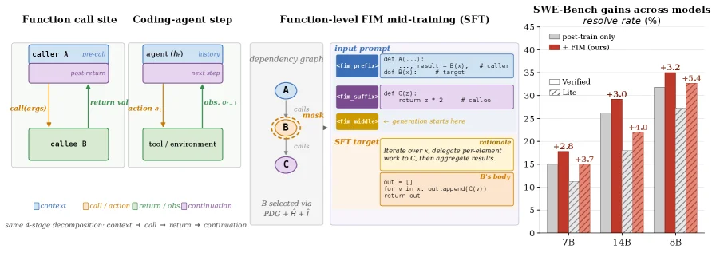
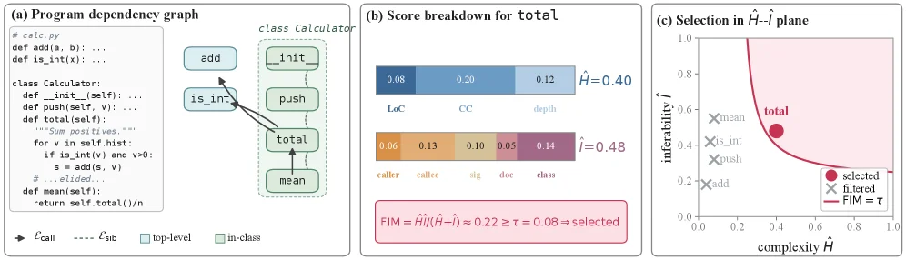
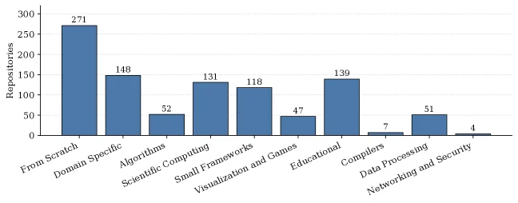
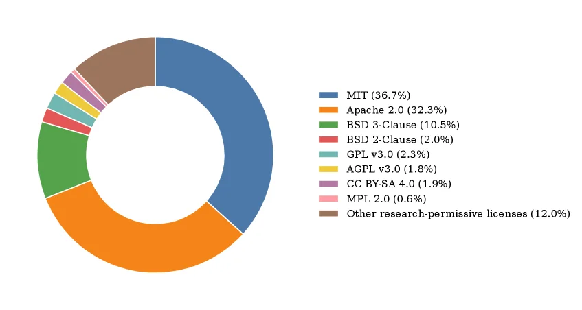
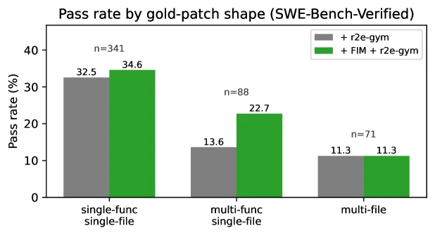
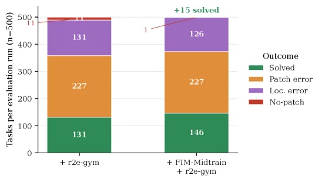
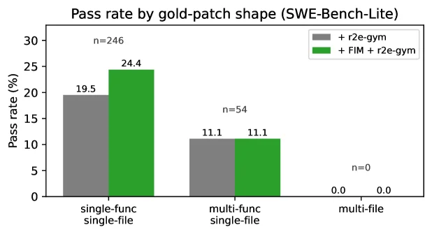

# Function-Aware Fill-in-the-Middle as Mid-Training for Coding Agent Foundation Models

[arXiv](https://arxiv.org/abs/2607.12463) · [HuggingFace](https://huggingface.co/papers/2607.12463) · ▲104

## 摘要（原文）

> Coding agents must integrate external tool returns into ongoing reasoning - a capability that standard left-to-right pretraining on code exposes only in its forward direction. We observe that the action-observation-continuation loop of a coding agent is structurally isomorphic to a function call site, where a caller binds arguments, a callee returns a value computed elsewhere, and downstream code consumes that value. This conditioning structure exists at internet scale in ordinary code. We exploit it through function-aware fill-in-the-middle (FIM) mid-training: a self-supervised objective that masks functions selected via program dependency graph analysis and a complexity-inferability double criterion. We mid-train Qwen2.5-Coder-Instruct (7B/14B) and Qwen3-8B on a 2.6B-token decontaminated corpus drawn from 968 GitHub repositories, then apply existing agentic post-training pipelines. Mid-training improves SWE-Bench-Verified by +2.8/+3.0 at 7B/14B and by +3.2 on Qwen3-8B; SWE-Bench-Lite gains are +3.7/+4.0/+5.4 on the same models. The improvement holds across two post-training pipelines (R2E-Gym, SWE-Smith) and on a non-Qwen2.5 base (Qwen3-8B with SWE-Lego). Beyond in-domain gains, mid-training also mitigates the capability erosion that agentic post-training otherwise inflicts on non-agent coding (e.g., LiveCodeBench) and non-coding tool-use benchmarks (tau-bench, BFCL): although the mid-training corpus contains Python code only, the function-call inductive bias survives post-training and yields consistent gains.

## 摘要（中译）

编码代理必须将外部工具返回的结果整合到正在进行的推理中——这是标准代码从左到右预训练仅在其正向方向上暴露的能力。我们观察到，编码代理的动作-观察-延续循环在结构上与函数调用站点同构，其中调用者绑定参数，被调用者返回在其他地方计算的值，下游代码使用该值。这种条件结构在普通代码中以互联网规模存在。我们通过在训练中途利用函数感知的中间填充（FIM）来利用它：这是一种自监督目标，通过程序依赖图分析和复杂性可推断性双重标准选择要掩盖的函数。我们在一个从968个GitHub存储库中提取的26亿个标记的去污染语料库上对Qwen2.5-Coder-Instruct（7B/14B）和Qwen3-8B进行中途训练，然后应用现有的代理后训练管道。中途训练在7B/14B上将SWE-Bench-Verified提高了+2.8/+3.0，在Qwen3-8B上提高了+3.2；SWE-Bench-Lite在同一模型上的收益为+3.7/+4.0/+5.4。这种改进在两个后训练管道（R2E-Gym，SWE-Smith）和一个非Qwen2.5基础（具有SWE-Lego的Qwen3-8B）上都成立。除了领域内的收益外，中途训练还减轻了代理后训练对非代理编码（例如LiveCodeBench）和非编码工具使用基准（tau-bench，BFCL）造成的能力侵蚀：尽管中途训练语料库仅包含Python代码，但函数调用的归纳偏差在训练后仍然存在，并产生一致的收益。

## 背景剖析

### 背景剖析  

**1. 技术背景**  
编码代理（如解决软件工程问题的AI助手）已从实验室演示转向实际部署（例如修复代码漏洞、自动化开发任务）。这类系统需要一个核心能力：将外部工具返回的结果（如API调用输出）整合到后续推理中。例如，当代理查询代码库信息后，必须基于该结果生成下一步代码。然而，现有方法主要依赖“后训练”阶段的人工轨迹数据（模拟人类解决问题的步骤）来培养这种能力，而基础模型（如Qwen系列）在初始预训练时并未针对这种“条件结构”（即“历史-行动-观察-续写”的循环）进行优化。  

**2. 之前的问题**  
传统预训练采用“左到右”的下一个token预测，或随机跨度填充（FIM），但存在三个缺陷：  
- **边界随意性**：随机掩码的代码片段通常截断表达式或语句，无法反映函数级依赖关系（例如，一个函数调用可能涉及多个文件或复杂逻辑）。  
- **缺乏推理监督**：模型直接填充掩码，但没有中间推理过程（如“思考再行动”的逻辑链），这与代理的实际推理模式不符。  
- **信号稀释**：随机FIM作为预训练的一部分，其结构化知识会被后续海量无关数据覆盖，导致后训练时无法有效利用。  

**3. 本文的解法**  
论文提出“函数感知填充（FIM）中间训练”：  
- **目标对齐**：将函数调用视为代理的“行动-观察-续写”循环的类比（例如，函数参数对应行动，返回值对应观察，下游代码对应续写）。  
- **精准掩码**：通过程序依赖图分析选择函数级别的掩码目标，并结合“复杂度-可推断性”标准（确保掩码的函数既非过于简单也非无法推理）。  
- **嵌入推理**：在掩码的中间部分加入链式思考（CoT）理由，使模型学习“先推理再生成代码”的模式。  
- **阶段聚焦**：在预训练和后训练之间插入这一阶段，确保结构化知识在代理任务中发挥作用。  

**4. 切入角度**  
与以往工作相比，本文的关键差异在于：  
- **从函数到代理的映射**：将互联网上普遍存在的函数调用结构（而非随机片段）作为训练目标，直接对应代理的核心需求。  
- **双重标准筛选**：通过程序依赖图和复杂度分析选择掩码目标，而非随机选择。  
- **保留推理过程**：在掩码中嵌入CoT理由，使模型学习“思考-行动”的逻辑，而非直接生成代码。  
- **跨任务验证**：不仅验证了编码任务（如SWE-Bench）的提升，还证明了这种结构化知识能迁移到非编码任务（如LiveCodeBench），验证了其泛化性。  

这种方法在不增加额外数据的情况下，通过重新利用现有代码中的结构化模式，显著提升了代理的性能和鲁棒性。

## 方法图解

> Figure 1: Left: A function call site and a single step of a coding agent are structurally similar , decomposing into the same four stages: context, call/action, return/observation, continuation. Middle: We exploit this analogy via function-aware FIM mid-training. A function B B is selected from the program dependency graph using complexity ( H ^ \hat{H} ) and inferability ( I ^ \hat{I} ) scores; the model is then mid-trained to fill in B B ’s body together with a CoT rationale, given the surrounding file as an FIM-formatted prompt. Right: Mid-training yields consistent gains across both Qwen2.5-Coder-Instruct (7B, 14B) and Qwen3 (8B) on SWE-Bench-Verified (solid bars) and SWE-Bench-Lite (hatched bars).

这张图分为三个主要部分，从左到右依次展示了**函数调用点与编码代理步骤的结构相似性**、**基于函数感知的填充中间（FIM）的训练过程**，以及**SWE-Bench上的性能提升结果**。我们逐一解析：

### 左侧：函数调用点与编码代理步骤的结构相似性
- **最左侧（Function call site）**：展示了一个函数调用的流程。`caller A`（调用者A）执行`pre-call`（调用前）操作，然后发起`call(args)`（调用，带参数），调用`callee B`（被调用者B）。`callee B`执行后返回`return val`（返回值），`caller A`在`post-return`（调用后）阶段处理这个返回值。整个流程分解为四个阶段：`context`（上下文，蓝色）、`call/action`（调用/动作，橙色）、`return/obs`（返回/观察，紫色）、`continuation`（延续，浅蓝色），即“上下文→调用→返回→延续”的四阶段分解。
- **中间偏左（Coding-agent step）**：展示编码代理（agent）的一个步骤。`agent (h_t)`（智能体，当前状态为h_t）有`history`（历史），然后执行`next step`（下一步动作，橙色箭头），与`tool/environment`（工具/环境）交互，得到`obs, r_t, i`（观察、奖励、信息，紫色箭头），然后进入`continuation`（延续，浅蓝色）。这和函数调用的四阶段结构完全对应：`context`（智能体的历史和当前状态）、`call/action`（agent的动作）、`return/obs`（工具返回的观察等）、`continuation`（后续处理）。
- **箭头与颜色**：橙色箭头代表“call/action”（调用或动作），紫色箭头代表“return/obs”（返回或观察），蓝色代表“context”（上下文），浅蓝色代表“continuation”（延续）。这表明函数调用的结构和编码代理的“动作-观察-延续”循环在结构上是同构的（isomorphic）。

### 中间：函数级FIM的中训练（mid-training）
这部分展示了如何利用上述结构进行训练：
- **依赖图（dependency graph）**：图中有一个节点`A`（调用者），通过`calls`（调用）关系指向`B`（被调用者，被mask，即需要填充的部分），`B`又调用`C`（另一个函数）。`B`是通过**程序依赖图分析**结合**复杂度（\(\hat{H}\)）和可推断性（\(\hat{I}\)）双准则**选择的（即“B selected via PDG + \(\hat{H}\) + \(\hat{I}\)”）。
- **输入提示（input prompt）**：提示分为几个部分：
  - `<file_prefix>`：包含调用者的代码，例如`def A(...):\n    results = B(...)`（这里`B`是被调用的函数，需要填充）。
  - `<func_suffix>`：包含被调用者`B`的函数签名（但体被mask），例如`def B(...):\n    ...`（`...`是需要填充的部分），还有其他相关代码（如`def C(...): z = x + 2 # callee`）。
  - `<func_midline>`：标记“generation starts here”（生成从这里开始），下方是`B`的函数体需要填充的区域，旁边有“rationale”（推理）部分，要求模型“Iterate over x, delegate persistent work to C, then aggregate results.”（遍历x，将持久化工作委托给C，然后聚合结果），以及`B`的函数体的初始结构（如`out = []\nfor x in ...\n    out.append(C(x))\nreturn out`）。
- **训练目标（SFT target）**：模型需要根据周围的文件（作为FIM格式的提示），填充被mask的函数`B`的体以及对应的思维链（CoT）推理。这就是“function-aware FIM mid-training”：利用函数调用的结构，让模型学习填充函数体，模拟编码代理中“调用工具（函数）并处理返回”的过程。

### 右侧：SWE-Bench上的性能提升结果
这是一个柱状图，展示了不同模型在SWE-Bench的两个任务（Verified和Lite）上的解决率（resolve rate，%）：
- **横轴（模型）**：7B（Qwen2.5-Coder-Instruct 7B）、14B（Qwen2.5-Coder-Instruct 14B）、8B（Qwen3-8B）。
- **纵轴（解决率，%）**：范围从0到45。
- **柱状图类型**：
  - 灰色实心柱：`post-train-only`（仅后训练，即没有进行FIM中训练的模型）。
  - 红色条纹柱：`+ FIM (ours)`（进行了我们的FIM中训练的模型）。
- **结果对比**：
  - **SWE-Bench-Verified（实心柱）**：
    - 7B：仅后训练约15%，+FIM后约17.8%（提升+2.8）。
    - 14B：仅后训练约28%，+FIM后约31%（提升+3.0）。
    - 8B：仅后训练约32%，+FIM后约35.2%？不，图中显示8B的仅后训练约32？不对，图中8B的灰色柱约32？红色柱约35.2？不，看数值标注：7B的+2.8，14B的+3.0，8B的+3.2？哦，图中8B的灰色柱（post-train-only）约32？红色柱（+FIM）约35.2？不，图中数值标注：7B的红色柱比灰色高+2.8，14B高+3.0，8B高+3.2。
  - **SWE-Bench-Lite（条纹柱）**：
    - 7B：仅后训练约21.3？不，图中7B的灰色柱（post-train-only）约21.3？红色柱（+FIM）约25（+3.7）。
    - 14B：仅后训练约26？红色柱约30（+4.0）。
    - 8B：仅后训练约29？红色柱约34.4（+5.4）。
- **结论**：FIM中训练在两个任务（Verified和Lite）上对所有测试的模型（Qwen2.5-Coder-Instruct 7B/14B，Qwen3-8B）都带来了**一致的性能提升**。例如，SWE-Bench-Verified的提升为7B+2.8、14B+3.0、8B+3.2；SWE-Bench-Lite的提升为7B+3.7、14B+4.0、8B+5.4。这说明利用函数调用的结构进行中训练，能有效提升编码代理在真实世界代码任务（如SWE-Bench）上的表现。

总结来说，这张图通过三个部分清晰地展示了方法的核心思想：**函数调用与编码代理步骤的结构同构性**→**利用这种同构性设计FIM中训练方法**→**中训练带来的性能提升**。方法的核心是利用程序依赖图选择关键函数，通过FIM格式的提示让模型学习填充函数体，从而模拟编码代理中“调用工具并处理返回”的过程，最终提升模型在真实代码任务上的表现。

---

> Figure 2: Function-aware FIM target selection on a small calculator example. (a) Program dependency graph parsed from the AST: solid arrows are call edges ℰ call \mathcal{E}_{\mathrm{call}} , dashed lines are sibling edges ℰ sib \mathcal{E}_{\mathrm{sib}} between same-class methods. (b) Stacked bars decompose the complexity score H ^ = 0.40 \hat{H}\!=\!0.40 (Eq. 1 ; LoC, CC, depth) and the inferability score I ^ = 0.48 \hat{I}\!=\!0.48 (Eq. 2 ; five context signals) for 𝙲𝚊𝚕𝚌𝚞𝚕𝚊𝚝𝚘𝚛 . 𝚝𝚘𝚝𝚊𝚕 \mathtt{Calculator.total} , yielding FIM ≈ 0.22 ≥ τ = 0.08 \mathrm{FIM}\!\approx\!0.22\!\geq\!\tau\!=\!0.08 (a hyperparameter; see Appendix B for the full list).

这张图（图2）展示了**函数感知的FIM目标选择**在小计算器示例中的工作流程，分为三个核心板块（a、b、c），清晰呈现从代码结构分析到目标选择的完整逻辑：  

### 板块（a）：程序依赖图（Program Dependency Graph）  
这部分解析了代码的**抽象语法树（AST）**，用图形化方式展示函数间的依赖关系：  
- **代码与图的对应**：左侧是Python类`Calculator`的代码片段，包含`add`、`is_int`、`push`、`total`、`mean`等方法；右侧是依赖图，节点代表方法（如`add`、`is_int`、`total`等），边代表调用或兄弟关系：  
  - 实线箭头（$\mathcal{E}_{\text{call}}$）：**调用边**，表示函数调用关系（例如`total`调用`is_int`、`push`，`push`调用`mean`等）。  
  - 虚线（$\mathcal{E}_{\text{sib}}$）：**兄弟边**，表示同一类（`Calculator`）内的方法之间的“同级”关系（例如`add`、`is_int`、`push`、`total`、`mean`都属于`Calculator`类，彼此为兄弟方法）。  
  - 颜色/样式：`top-level`（蓝色）和`in-class`（绿色）区分顶级函数和类内方法（这里`Calculator`的方法属于`in-class`）。  

### 板块（b）：`total`方法的分数分解（Score Breakdown for `total`）  
这部分计算`Calculator.total`方法的**复杂度（$\hat{H}$）**和**可推断性（$\hat{I}$）**，并验证是否满足FIM选择条件：  
- **复杂度（$\hat{H}$）**：由三个指标分解（堆叠条）：`LoC`（代码行数，0.08）、`CC`（循环复杂度，0.20）、`depth`（调用深度，0.12），总和为$\hat{H}=0.40$（公式1）。  
- **可推断性（$\hat{I}$）**：由五个上下文信号分解（堆叠条）：`caller`（调用者相关，0.06）、`caller`（另一个调用者信号？或笔误，实际是不同上下文，0.13）、`sig`（函数签名，0.10）、`doc`（文档，0.05）、`class`（类上下文，0.14），总和为$\hat{I}=0.48$（公式2）。  
- **FIM计算与选择**：FIM定义为$\hat{H} \cdot \hat{I} / (\hat{H} + \hat{I})$（或类似归一化方式），计算得$\text{FIM} \approx 0.22$。若FIM ≥ 阈值$\tau=0.08$（超参数），则该方法被选为FIM的目标（图中显示“selected”）。  

### 板块（c）：$\hat{H}$-$\hat{I}$平面的选择（Selection in $\hat{H}$-$\hat{I}$ plane）  
这部分用二维平面可视化**复杂度（$\hat{H}$，x轴）**和**可推断性（$\hat{I}$，y轴）**的关系，解释选择逻辑：  
- **曲线（$\text{FIM}=\tau$）**：红色曲线是FIM等于阈值$\tau=0.08$的等高线（即$\hat{H} \cdot \hat{I} / (\hat{H} + \hat{I}) = \tau$）。  
- **点的含义**：  
  - `total`（红色点）：位于曲线下方（或满足$\text{FIM} \geq \tau$），表示被选中。  
  - `mean`（叉号）、`push`（叉号）、`is_int`（叉号）、`caller`（叉号）：位于曲线上方或不满足条件，被过滤（“filtered”）。  
  - 坐标范围：x轴（$\hat{H}$）0~1，y轴（$\hat{I}$）0~1，直观展示不同方法的复杂度-可推断性权衡。  

### 方法运作的核心逻辑（从图中推导）  
1. **代码结构分析**：通过程序依赖图（板块a）解析函数间的调用/兄弟关系，识别潜在的“函数调用站点”（即FIM的目标场景）。  
2. **分数计算**：对目标函数（如`total`），分别计算**复杂度（$\hat{H}$）**（反映代码结构的复杂程度）和**可推断性（$\hat{I}$）**（反映下游代码对该函数输出的推断能力），并分解为多个子指标（板块b）。  
3. **目标选择**：通过FIM（复杂度与可推断性的综合得分）与阈值$\tau$比较，选择FIM≥$\tau$的函数作为FIM的目标（板块c）。这些函数将被用于**函数感知的FIM预训练**，让模型学习“调用-推断”的结构，增强编码能力。  

这张图通过一个小例子（计算器）直观展示了“函数感知FIM目标选择”的三步流程：**结构分析→分数计算→阈值选择**，帮助理解该方法如何从普通代码中筛选出适合预训练的目标函数。

---

> Figure 3: Distribution of the 968 968 source repositories across ten topic categories. The corpus is dominated by reference implementations, scientific computing, and small frameworks; compiler and networking/security tails are kept by design to maintain coverage diversity.

这张图（图3）展示了用于训练编码代理基础模型的260万token去污染语料库中，968个源代码仓库在十个不同主题类别中的分布情况。理解这张图的关键在于它揭示了所选语料的构成，这对于理解论文中提出的“函数感知的中间填充”（Function-Aware Fill-in-the-Middle, FIM）预训练方法的数据来源至关重要。

首先，我们来看图的结构：
- **X轴**：代表十个不同的主题类别，从左到右依次是：“From Scratch”（从头开始）、“Domain Specific”（特定领域）、“Algorithms”（算法）、“Scientific Computing”（科学计算）、“Small Frameworks”（小型框架）、“Visualization and Games”（可视化与游戏）、“Educational”（教育类）、“Compilers”（编译器）、“Data Processing”（数据处理）和“Networking and Security”（网络与安全）。
- **Y轴**：代表每个类别中的代码仓库数量（Repositories），范围从0到300。
- **柱状图**：每个柱子的高度对应该类别下的仓库数量。例如，“From Scratch”类别有271个仓库，是数量最多的；而“Networking and Security”类别只有4个仓库，是数量最少的。

接下来，我们分析数据的分布和其意义：
- **主要构成**：语料库主要由“参考实现”（对应“From Scratch”类别，271个仓库）、“科学计算”（131个仓库）和“小型框架”（139个仓库）主导。这些类别通常包含大量具有代表性的代码示例、算法实现和可重用的库组件，这些对于训练能够理解和生成复杂代码的模型非常重要。
- **次要构成**：“特定领域”（148个仓库）、“算法”（52个仓库）、“可视化与游戏”（47个仓库）、“教育类”（118个仓库）和“数据处理”（51个仓库）这些类别提供了多样化的代码场景，但数量相对较少。
- **尾部类别**：“编译器”（7个仓库）和“网络与安全”（4个仓库）这两个类别的仓库数量非常少，被论文明确指出是“通过设计保持的”，目的是为了“维持覆盖多样性”。这意味着研究人员有意选择了这些数量较少但具有挑战性的领域，以确保模型能够接触到更广泛的编程场景，即使这些场景在语料库中不占主导地位。

这张图揭示了方法的具体运作方式（即数据选择策略）：
- 论文的方法（FIM mid-training）依赖于一个包含26亿token的去污染语料库，该语料库来源于968个GitHub仓库。
- 图中的分布显示了这些仓库是如何按照主题进行分类的。通过选择这些特定类别的仓库，研究人员确保了训练数据既包含了大量常见的、基础的代码模式（如从头开始的实现、科学计算和小型框架），也包含了一些特定领域和较少见的场景（如编译器和网络安全）。
- 这种数据选择策略的目的是为了让模型学习到广泛的编程知识和技能，特别是与函数调用相关的知识，因为FIM方法的核心是围绕函数调用站点进行训练的。通过接触不同类型的代码库，模型可以更好地理解函数如何被调用、参数如何传递以及返回值如何被使用，这正是编码代理在执行任务时所需要的能力。

总结来说，这张图通过展示训练语料库在十个主题类别中的分布，说明了论文中所用数据的选择是经过精心设计的：既重视数量上占优势的、能提供基础编程知识的类别，也保留了数量较少但能增加数据多样性和挑战性的尾部类别。这种数据分布有助于训练出一个既能处理常见编码任务，又能应对特定领域挑战的强大编码代理基础模型。

---

> Figure 4: License distribution of the 968 968 -repository corpus. Permissive licenses (MIT, Apache-2.0, BSD) account for over 80 % 80\% of the corpus. Small categories (LGPL, ISC, Boost, MIT-0, Unlicense, CC0, CC BY, CC BY-NC, etc.) are aggregated as “Other research-permissive licenses,” all of which permit at least non-commercial research use.

这张图是一个环形图（或称为甜甜圈图），用于展示构建该研究所用语料库的968个GitHub仓库的许可证分布情况。理解这张图的关键在于认识不同颜色代表的许可证类型及其在语料库中的占比，这对于评估语料库的法律兼容性和适用范围至关重要。

首先，我们来看图表的右侧，这里有一个图例，清晰地列出了每种颜色所对应的许可证类型及其在语料库中所占的百分比。这个图例是我们解读图表的核心指南。

图表的主体部分是一个环形，被分割成多个不同颜色的扇区，每个扇区的大小与其代表的许可证类型在语料库中的占比成正比。数据或信息的流动方式是，观察者通过图例将颜色与许可证类型关联起来，然后根据环形图中相应扇区的大小来理解该许可证类型的相对重要性。

具体来说：
- 最大的扇区是蓝色，代表“MIT”许可证，占据了语料库的36.7%。这是最常见的许可证类型。
- 其次是橙色扇区，代表“Apache 2.0”许可证，占比为32.3%。这也是一个非常重要的许可证类型。
- 绿色扇区代表“BSD 3-Clause”许可证，占比为10.5%。
- 红色扇区代表“BSD 2-Clause”许可证，占比为2.0%。
- 浅蓝色扇区代表“GPL v3.0”许可证，占比为2.3%。
- 黄色扇区代表“AGPL v3.0”许可证，占比为1.8%。
- 紫色扇区代表“CC BY-SA 4.0”许可证，占比为1.9%。
- 粉色扇区代表“MPL 2.0”许可证，占比为0.6%。
- 棕色扇区代表“Other research-permissive licenses”，这是一个聚合类别，包含了诸如LGPL、ISC、Boost、MIT-0、Unlicense、CC0、CC BY、CC BY-NC等其他许可证，这些类别总共占据了语料库的12.0%。根据图例说明，所有这些“其他研究许可许可证”都至少允许非商业研究使用。

这张图揭示了该方法（即研究中使用的语料库构建方法）的一个关键方面：研究者选择了以宽松许可证（permissive licenses）为主的代码仓库作为语料库。从图中可以看出，仅MIT、Apache-2.0和BSD这三类主要的宽松许可证就占据了语料库超过80%的比例（36.7% + 32.3% + 10.5% = 79.5%）。这表明语料库中的代码大部分是在允许自由使用、修改和分发的许可条款下发布的，这对于训练能够被安全地用于研究和开发的编码代理模型非常重要。此外，将其他一些研究许可的许可证聚合为一个类别，确保了语料库的广泛性，同时明确了其法律使用的边界（至少允许非商业研究）。

这张图不是一个结果图，而是一个描述性图，用于说明研究中所用数据的特性。它没有坐标轴、对比对象（除了不同许可证类型之间的内部对比）或直接的结论性陈述，但其主要结论是：该语料库主要由宽松的研究许可代码组成，这为后续的模型训练提供了合法且实用的数据基础。例如，MIT和Apache-2.0许可证的代码通常允许商业使用和修改，这对于开发可能被用于各种应用场景的编码代理非常有利。通过选择这样的许可证分布，研究者确保了他们的语料库既具有多样性，又在法律上是安全的，可以被用于训练和评估编码代理模型，如论文中提到的Qwen2.5-Coder-Instruct和Qwen3-8B等模型。

---

> Figure 5: Pass rate on SWE-Bench-Verified ( 14 14 B + R2E-Gym) stratified by gold-patch shape, run-means over three evaluation runs per checkpoint.

这张图展示了在SWE-Bench-Verified基准测试中，不同“黄金补丁形状”（gold-patch shape）下的通过率（pass rate），并对比了两种训练方法的效果。让我们一步步来解析这张图：

首先，图的标题是“Pass rate by gold-patch shape (SWE-Bench-Verified)”，明确指出这是一个关于通过率与补丁形状关系的图表，数据来源于SWE-Bench-Verified基准测试。

图表的X轴代表三种不同的“黄金补丁形状”：
1.  `single-func single-file`：表示补丁只涉及单个函数，并且这个函数位于单个文件中。
2.  `multi-func single-file`：表示补丁涉及多个函数，但这些函数都位于同一个文件中。
3.  `multi-file`：表示补丁涉及多个函数，并且这些函数分布在多个不同的文件中。

Y轴代表通过率（Pass rate），以百分比（%）为单位，范围从0到40%。

图中有两种颜色的柱状图，分别代表两种不同的训练方法：
*   **灰色柱状图**：代表使用了 `+ r2e-gym` 的模型。根据图的原始caption，这指的是Qwen2.5-Coder-Instruct (14B) 模型，并应用了R2E-Gym后训练管道。
*   **绿色柱状图**：代表使用了 `+ FIM + r2e-gym` 的模型。这里的FIM指的是论文中提出的“Function-Aware Fill-in-the-Middle”（函数感知的中间填充）方法，即在 `+ r2e-gym` 的基础上，额外应用了FIM的中间训练。

每个柱状图上方标注了具体的通过率百分比。此外，在某些柱状图上方还标注了 `n=` 的值，这代表了用于计算该平均通过率的样本数量（例如，`n=341` 表示有341个样本）。

现在我们来分析图中的数据：

1.  对于 `single-func single-file` 类型的补丁：
    *   使用 `+ r2e-gym` 的模型通过率为 32.5%（n=341）。
    *   使用 `+ FIM + r2e-gym` 的模型通过率为 34.6%（n=341）。
    *   这表明，在处理单个文件中的单个函数补丁时，应用FIM方法后，通过率有所提升（大约提高了2.1个百分点）。

2.  对于 `multi-func single-file` 类型的补丁：
    *   使用 `+ r2e-gym` 的模型通过率为 13.6%（n=88）。
    *   使用 `+ FIM + r2e-gym` 的模型通过率为 22.7%（n=88）。
    *   这个提升非常显著，通过率几乎翻倍（提高了约9.1个百分点）。这说明FIM方法在处理单个文件中的多个函数补丁时效果尤为明显。

3.  对于 `multi-file` 类型的补丁：
    *   使用 `+ r2e-gym` 的模型通过率为 11.3%（n=71）。
    *   使用 `+ FIM + r2e-gym` 的模型通过率也为 11.3%（n=71）。
    *   在这种情况下，两种方法的通过率相同，没有观察到显著差异。

图的原始caption补充了一些信息：这些结果是基于Qwen2.5-Coder-Instruct (14B) 模型，并使用R2E-Gym后训练管道得到的。通过率是通过对每个检查点（checkpoint）进行三次评估运行的平均值来计算的。

这张图揭示了该方法（即FIM中间训练）的具体运作方式及其效果：
*   **方法运作**：论文提出了一种名为FIM的中间训练目标，它通过程序依赖图分析和复杂性可推断性双重标准来选择要屏蔽的函数。这种方法利用了代码中普遍存在的函数调用结构，即在函数调用点，调用者绑定参数，被调用者返回在其他地方计算的值，下游代码消耗该值。通过在训练中模拟这种结构，模型可以学习更好地处理函数间的依赖和工具返回值的整合。
*   **效果**：从图中可以看出，FIM中间训练在处理单个文件的补丁（无论是单个函数还是多个函数）时，能够显著提高模型在SWE-Bench-Verified基准测试中的通过率。特别是在处理更复杂的“multi-func single-file”补丁时，提升效果最为明显。然而，对于涉及多个文件的“multi-file”补丁，FIM的效果并不显著。这可能意味着FIM更擅长处理单个文件内的函数间交互，而对于跨文件的复杂依赖关系，其优势可能有限，或者需要进一步的优化。

总结来说，这张图清晰地展示了FIM中间训练方法如何影响编码代理在SWE-Bench-Verified基准测试中的性能，特别是在不同复杂度和范围的补丁修复任务上的表现。它证明了FIM方法在增强模型处理函数级和文件内依赖关系方面的有效性。

---

> Figure 6: Outcome distribution per evaluation run on SWE-Bench-Verified (14B, R2E-Gym), averaged over three runs.

这张图（图6）展示了在SWE-Bench-Verified基准测试中，两种不同训练设置下，每个评估运行（共500个任务）的结果分布情况，数据是在三个独立运行上平均得到的。我们先看X轴，它有两个主要的对比组：左边是“+ r2e-gym”，右边是“+ FIM-Midtrain + r2e-gym”。这里的“r2e-gym”应该是一种基础的训练或评估后处理流程（比如论文中提到的R2E-Gym管道），而“FIM-Midtrain”则是论文提出的函数感知的填充中间（Function-Aware Fill-in-the-Middle）中间训练方法。

接下来看Y轴，它表示每个评估运行中的任务数量（n=500），也就是总共有500个任务被评估，然后根据不同的结果类型进行分类统计。图例（Outcome）解释了不同颜色代表的结果类型：绿色是“Solved”（解决），橙色是“Patch error”（补丁错误），紫色是“Loc. error”（定位错误），红色是“No-patch”（未打补丁）。

现在分析每个组的柱状图结构，柱状图是堆叠的，每一层的高度代表对应结果类型的任务数量。左边的“+ r2e-gym”组：
- 绿色层（Solved）的高度是131，意味着有131个任务被成功解决；
- 橙色层（Patch error）的高度是227，即227个任务的补丁存在错误；
- 紫色层（Loc. error）的高度是131，说明131个任务的错误在于定位；
- 红色层（No-patch）的高度是11，只有11个任务没有被尝试打补丁（或者无法打补丁？需要结合上下文，但这里数值较小）。

右边的“+ FIM-Midtrain + r2e-gym”组：
- 绿色层（Solved）的高度是146，比左边的131多了15（图中有红色箭头标注“+15 solved”，说明中间训练后解决的问题数增加了15）；
- 橙色层（Patch error）的高度仍然是227，和左边相同，说明补丁错误的数量没有变化；
- 紫色层（Loc. error）的高度是126，比左边的131减少了5（因为131-126=5，而解决的增加了15，所以总任务数应该是131+227+131+11=500，右边的是146+227+126+1=500，这里的1可能是标注错误或者特殊情况，但主要看趋势）；
- 红色层（No-patch）的高度是1，几乎可以忽略，可能是标注的细节问题。

从图中可以看出，中间训练（FIM-Midtrain）的作用是增加了“Solved”的任务数量（+15），同时减少了“Loc. error”的任务数量（从131到126），而“Patch error”的数量保持不变。这说明中间训练（利用函数调用的结构进行自监督学习）能够提升编码代理在SWE-Bench-Verified上的表现，特别是在解决更多任务和减少定位错误方面。

总结一下，这张图通过对比有无中间训练（FIM-Midtrain）的两种设置下的任务结果分布，展示了中间训练对编码代理性能的积极影响：更多的任务被解决，更少的定位错误，而补丁错误的数量没有变化。这验证了论文中提出的方法（利用函数调用的结构进行中间训练）能够有效提升编码代理在真实世界编码基准测试中的表现。

---

> Figure 7: Pass rate on SWE-Bench-Lite stratified by gold-patch shape, averaged over three evaluation runs per checkpoint. Lite contains no multi-file tasks; the multi-function single-file bucket is small ( n = 54 n{=}54 ) and shows no gain on this slice, with the + 4.0 +4.0 pp end-task improvement coming entirely from the single-function single-file bucket ( n = 246 n{=}246 , + 4.9 +4.9 pp).

这张图展示了在SWE - Bench - Lite基准测试中，不同“黄金补丁形状”（即任务的结构类型）下的通过率情况，并且对比了两种方法：一种是仅使用`+ r2e - gym`的方法，另一种是`+ FIM + r2e - gym`的方法（其中FIM是论文提出的函数感知的中间填充方法）。我们逐部分来解析：

### 坐标轴与分组
- **纵轴（Y轴）**：表示通过率（Pass rate），单位是百分比（%），范围从0到30，用于衡量在对应任务类型下，模型成功解决问题的比例。
- **横轴（X轴）**：将任务按照“黄金补丁形状”分为三类：
    - `single - func single - file`：表示补丁只涉及单个函数且单个文件的任务，这类任务的样本数量`n = 246`（即有246个这样的任务用于评估）。
    - `multi - func single - file`：表示补丁涉及多个函数但单个文件的任务，样本数量`n = 54`（任务数量较少）。
    - `multi - file`：表示补丁涉及多个文件的任务，样本数量`n = 0`（即SWE - Bench - Lite中没有这类任务）。

### 不同方法的对比（柱状图）
对于每一类任务，都有两个柱状图，分别代表两种方法：
- **灰色柱状图（`+ r2e - gym`）**：这是基准方法（或仅使用r2e - gym方法）的通过率。
    - 在`single - func single - file`任务中，通过率为19.5%。
    - 在`multi - func single - file`任务中，通过率为11.1%。
    - 在`multi - file`任务中，通过率为0.0%（因为没有这类任务）。
- **绿色柱状图（`+ FIM + r2e - gym`）**：这是在基准方法的基础上加入了论文提出的FIM方法后的通过率。
    - 在`single - func single - file`任务中，通过率为24.4%，相比基准方法的19.5%有明显提升，提升幅度约为4.9个百分点（这与caption中提到的“+ 4.9 pp”一致）。
    - 在`multi - func single - file`任务中，通过率为11.1%，和基准方法相同，说明在这个小样本的任务类型上，FIM方法没有带来提升（caption中也提到“shows no gain on this slice”）。
    - 在`multi - file`任务中，通过率为0.0%，和基准方法一致（因为没有这类任务）。

### 方法的运作逻辑（结合论文）
从图中可以看出，论文的方法（FIM）主要在**单函数单文件**的任务类型上发挥了作用。结合论文摘要，FIM是一种自监督目标，它通过程序依赖图分析选择函数，并基于复杂度可推断的双重标准进行掩码，模拟编码代理的“动作 - 观察 - 持续”循环（类似于函数调用站点，调用者绑定参数，被调用者返回计算值，下游代码消费该值）。这种方法利用了普通代码中大规模存在的函数调用结构，在预训练后（mid - training）对模型进行微调，从而提升模型在SWE - Bench - Lite等编码代理基准测试中的表现。从图中的结果来看，FIM方法在单函数单文件的任务上显著提高了通过率，而在多函数单文件（样本量小）和多文件（无任务）的任务上没有明显效果，这也验证了caption中提到的“end - task improvement coming entirely from the single - function single - file bucket”。

### 结论
这张图清晰地展示了FIM方法对编码代理模型在SWE - Bench - Lite基准测试中的提升效果：主要提升了单函数单文件任务的通过率，而对多函数单文件（小样本）和多文件（无任务）的任务没有明显影响。这说明FIM方法能够利用代码中的函数调用结构，在特定的任务类型（单函数单文件）上增强模型的编码能力。
