# Ring-Zero: Scaling Zero RL to a Trillion Parameters for Emergent Reasoning

[arXiv](https://arxiv.org/abs/2607.12395) · [HuggingFace](https://huggingface.co/papers/2607.12395) · ▲91

## Abstract (verbatim)

> Reinforcement learning with verifiable rewards without human-annotated data, often referred to as zero RL, has emerged as a powerful paradigm for eliciting chain-of-thought reasoning. However, due to computational constraints, existing studies are largely restricted to small models, leaving the training dynamics and emergent capabilities at a large scale unexplored. To meaningfully explore this frontier, we aim to elicit high-quality reasoning behaviors from the model. However, we find that naive scaling often suffers from poor readability, token redundancy, and a lack of adaptive reasoning depth. To address these challenges, we present a stable and efficient training pipeline, incorporating algorithmic and system optimizations such as clipped importance sampling, training-inference ratio correction, and mixed-precision control. Our experiments offer three key findings that validate the "bitter lesson" of scaling: (1) scaling to 1T parameters significantly enhances sample efficiency and performance ceilings; (2) the training process progresses sequentially through an initial discovery phase followed by a sharpening phase; and (3) the model spontaneously develops advanced cognitive behaviors, including anthropomorphism, structured formatting, self-verification, parallel reasoning, and context anxiety, rendering hand-crafted heuristics redundant. Evaluated on seven mathematical benchmarks, Ring-2.5-1T-Zero achieves competitive performance. Additionally, to assess CoT quality beyond final-answer correctness, we propose a structured evaluation framework across three dimensions: comprehensibility, reproducibility, and efficiency, where our model demonstrates clear advantages in producing structured and concise reasoning traces. By sharing our observed emergent phenomena, we hope to provide the community with deeper insights into scaling behaviors, particularly at the 1-trillion scale.

## Background

### Background Analysis  

**1. Technical Context and Needs**  
Chain-of-Thought (CoT) reasoning is critical for large language models (LLMs) to solve complex tasks, especially in domains like mathematics or code generation where multi-step logic is required. Traditional methods rely on human-annotated data to guide reasoning, which is expensive and limited in coverage. Zero RL (reinforcement learning without supervised CoT data) emerged as a solution, allowing models to autonomously learn reasoning strategies through trial-and-error using verifiable rewards (e.g., answer correctness). However, most studies are confined to small models (e.g., 100B parameters) due to computational constraints, leaving the potential of trillion-parameter models unexplored.  

**2. Limitations of Previous Methods**  
Existing zero RL approaches face three key issues:  
- **Poor readability**: Generated reasoning traces lack logical structure, making them hard for humans to verify;  
- **Inefficiency**: Standard algorithms (e.g., GRPO) encourage longer outputs, leading to redundant steps and wasted compute;  
- **Lack of dynamic depth**: Fixed response budgets prevent models from adapting reasoning depth to task complexity.  
Additionally, small-scale studies cannot reveal how training dynamics evolve at trillion-parameter scales, such as whether new cognitive behaviors emerge.  

**3. Solution Approach**  
This paper proposes a trillion-parameter zero RL framework (Ring-Zero) with lightweight optimizations:  
- **Algorithmic improvements**: Clipped importance sampling mitigates length bias, while training-inference ratio correction encourages high-quality reasoning;  
- **System optimizations**: Mixed-precision computing and context parallelism improve training efficiency;  
- **Adaptive depth**: Tier-based training dynamically adjusts reasoning depth for different tasks.  
These changes stabilize training at scale and enable spontaneous emergence of advanced behaviors (e.g., structured formatting, self-verification) without manual heuristics.  

**4. Key Differences from Prior Work**  
This work stands out by:  
- **Scale breakthrough**: First to validate trillion-parameter zero RL, showing emergent human-like strategies (e.g., "context anxiety");  
- **Quality evaluation**: Proposes a multidimensional CoT framework assessing comprehensibility, reproducibility, and efficiency;  
- **Minimalist design**: Demonstrates that pure reinforcement learning training suffices, proving the "bitter lesson" that scale outperforms hand-crafted heuristics.  

In summary, this paper advances understanding of zero RL at extreme scales and highlights the potential of unsupervised reasoning.

## Method, Figure by Figure

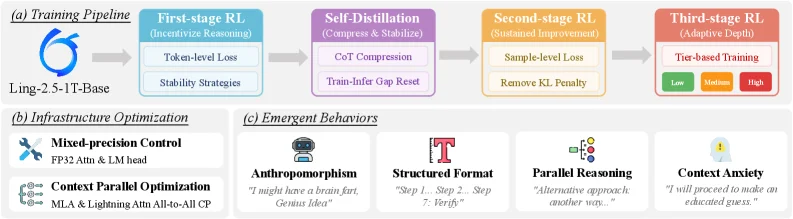

> Figure 1 : Overview of Ring-2.5-1T-Zero. (a) The multi-stage training pipeline. First-stage RL incentivizes reasoning from the base model. Self-Distillation compresses CoT traces and resets the training-inference engine gap. Second-stage RL shifts to a sample-level loss for sustained improvement. Third-stage RL introduces tier-based training for adaptive reasoning depth. (b) Infrastructure optimizations for stable and efficient training at scale. (c) Emergent behaviors that arise spontaneously without explicit supervision.

This figure (Figure 1) is an overview of Ring - 2.5 - 1T - Zero in the paper "Ring - Zero: Scaling Zero RL to a Trillion Parameters for Emergent Reasoning", which is divided into three main parts: (a) Training Pipeline, (b) Infrastructure Optimization, and (c) Emergent Behaviors.

First, look at part (a) the Training Pipeline. It shows a multi - stage training process, and the data flow is from left to right. On the far left is the base model Ling - 2.5 - 1T - Base, and then it enters the First - stage RL through an arrow. The goal of the First - stage RL is to incentivize reasoning, and it contains two components: Token - level Loss and Stability Strategies. This stage stimulates the reasoning ability from the base model. Next, after the First - stage, there is the Self - Distillation stage. Its role is to compress and stabilize, and it contains CoT Compression and Train - Infer Gap Reset. This stage compresses the CoT traces and adjusts the gap between training and inference. After that, after the Self - Distillation stage, there is the Second - stage RL. The goal of the Second - stage RL is sustained improvement, and it contains Sample - level Loss and Remove KL Penalty. This stage switches the loss function to the sample - level to achieve continuous performance improvement. Finally, there is the Third - stage RL, whose goal is adaptive depth. It adopts Tier - based Training with three levels: Low, Medium, and High, which is used to achieve adaptive reasoning depth.

Then, part (b) is Infrastructure Optimization. This part is to achieve stable and efficient training at a large scale. It contains two optimization strategies: Mixed - precision Control, specifically FP32 Attn & LM head; and Context Parallel Optimization, specifically MLA & Lightning Attn All - to - all CP.

Finally, part (c) is Emergent Behaviors. This part shows the advanced cognitive behaviors that emerge spontaneously without explicit supervision, including five aspects: Anthropomorphism, with an example of "I might have a brain fart, Genius Idea"; Structured Format, with an example of "Step 1... Step 2... Step 7: Verify"; Parallel Reasoning, with an example of "Alternative approach: another way..."; Context Anxiety, with an example of "I will proceed to make an educated guess.".

Overall, this figure shows the working process of the Ring - 2.5 - 1T - Zero method: first, train the model through multi - stage reinforcement learning and self - distillation, and at the same time, ensure the stability and efficiency of large - scale training through infrastructure optimization. Finally, the model will spontaneously show a variety of advanced cognitive behaviors and perform competitively in mathematical benchmark tests.

---

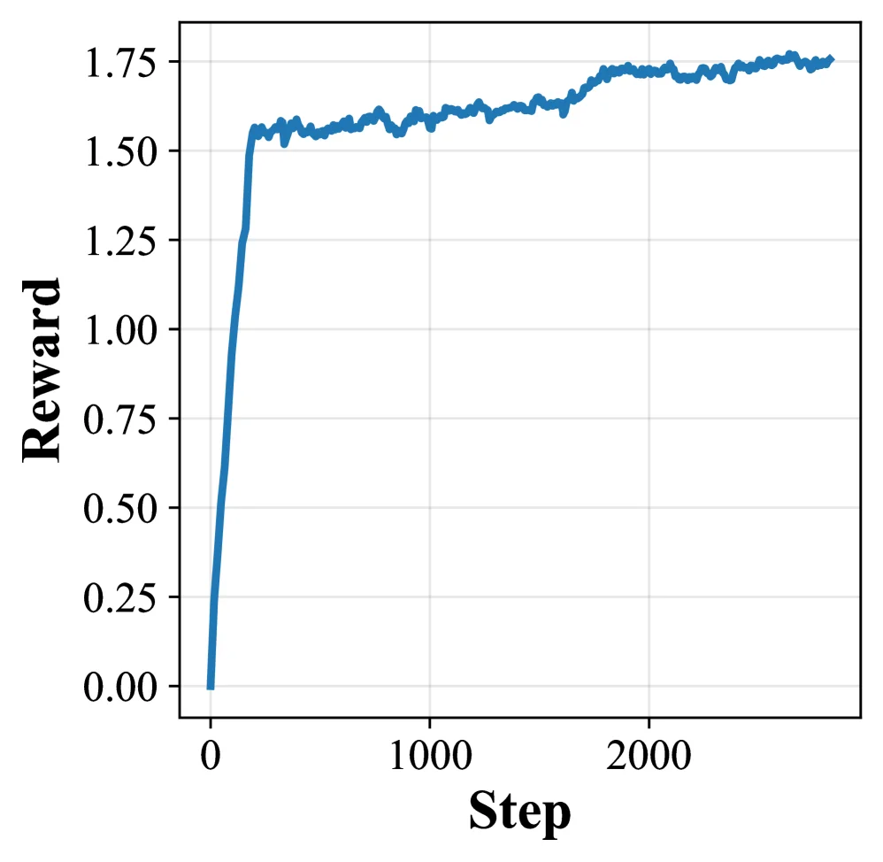

> (a) Reward (initial data) (b) Seq Length (initial data) (c) Reward (new data) (d) Seq Length (new data) Figure 2 : Training curves of Ling-2.5-1T-Base during first stage RL. (a,b) First 2800 steps with the initial training data: reward and sequence length increase steadily as the model bootstraps reasoning from scratch. (c,d) After switching to new training data, the model continues to improve with sustained sequence length growth.

This figure (Figure 2a) illustrates the **reward vs. training step curve** for the model "Ling-2.5-1T-Base" during the **first stage of reinforcement learning (RL) training** using the **initial training data**.  

### Components and Information Flow of the Figure:  
- **X-axis (Horizontal Axis)**: Labeled "Step," it represents the number of training steps (or iterations). Starting from 0, the figure shows up to approximately 2000+ steps (the caption mentions the first 2800 steps). This indicates the progression of the training process over time.  
- **Y-axis (Vertical Axis)**: Labeled "Reward," it represents the reward value obtained by the model during training. The reward starts at 0.00 and peaks near 1.75. In reinforcement learning, reward is a key metric for evaluating the quality of the model's behavior, here reflecting the quality of the reasoning (e.g., chain-of-thought, CoT) generated by the model.  
- **Curve**: The blue curve shows the trend of reward changes over training steps. We can clearly identify three phases:  
  1. **Rapid Increase Phase**: In the early stages of training (approximately the first few hundred steps), the reward value rapidly rises from near 0 to around 1.55. This indicates that the model, when "learning from scratch," can quickly "discover" effective reasoning patterns to obtain higher rewards.  
  2. **Plateau/Small Fluctuation Phase**: After reaching a reward of about 1.55, the curve enters a relatively stable phase, with the reward value fluctuating slightly between 1.50 and 1.60. This may mean that the model has mastered some basic reasoning skills but is still exploring more optimal strategies.  
  3. **Second Increase Phase**: After approximately 1000 steps, the reward value begins to rise slowly again, eventually stabilizing at around 1.75. This indicates that the model's reasoning ability has been "sharpened" or improved through further training, enabling it to generate higher-quality reasoning.  

### How the Method Works (Revealed by the Figure):  
This figure reveals the specific operation of the "first-stage RL" training method proposed in this study:  
- **Bootstrapping Reasoning from Scratch**: The model, without any human-annotated data, can "spontaneously" learn and improve its reasoning ability through the initial training data and the reward mechanism of reinforcement learning. The rapid increase in reward in the figure proves this point.  
- **Phased Training Process**: As shown in the figure, the training process does not grow linearly but goes through the phases of "rapid discovery" -> "stability/exploration" -> "continuous improvement/sharpening." This is consistent with the statement in the paper's abstract that "the training process sequentially goes through an initial discovery phase, followed by a sharpening phase."  
- **Sample Efficiency and Performance Improvement**: The continuous growth of rewards indicates that as training progresses, the model becomes increasingly efficient in utilizing the initial data, and its reasoning performance (measured by rewards) is also constantly improving. This verifies the paper's finding that "scaling to 1 trillion parameters significantly improves sample efficiency and performance limits."  

### Conclusion (Based on the Figure and Caption):  
- **Axes and Range**: The X-axis is the training step (Step), and the Y-axis is the reward (Reward). The data shows that during the first 2800 steps of training, the reward increases from near 0 to about 1.75.  
- **Comparison Objects**: This figure (Figure 2a) is contrasted with Figure 2b (sequence length of initial data), Figure 2c (reward of new data), and Figure 2d (sequence length of new data). Figure 2a focuses on the **reward changes** on the **initial data**.  
- **Conclusion**:  
  - When using the initial training data, the model's reward **steadily increases** with the increase of training steps. This indicates that the model can "bootstrap" reasoning ability from scratch.  
  - The training process shows obvious **phases**: rapid improvement in the early stage, followed by a relatively stable plateau phase, and finally another improvement.  
  - This training dynamics supports the core viewpoint of the paper, that is, through appropriate training methods (such as the algorithms and system optimizations mentioned in the paper), large-scale models (such as the 1T-parameter model) can effectively learn and develop complex reasoning behaviors in reinforcement learning.

---

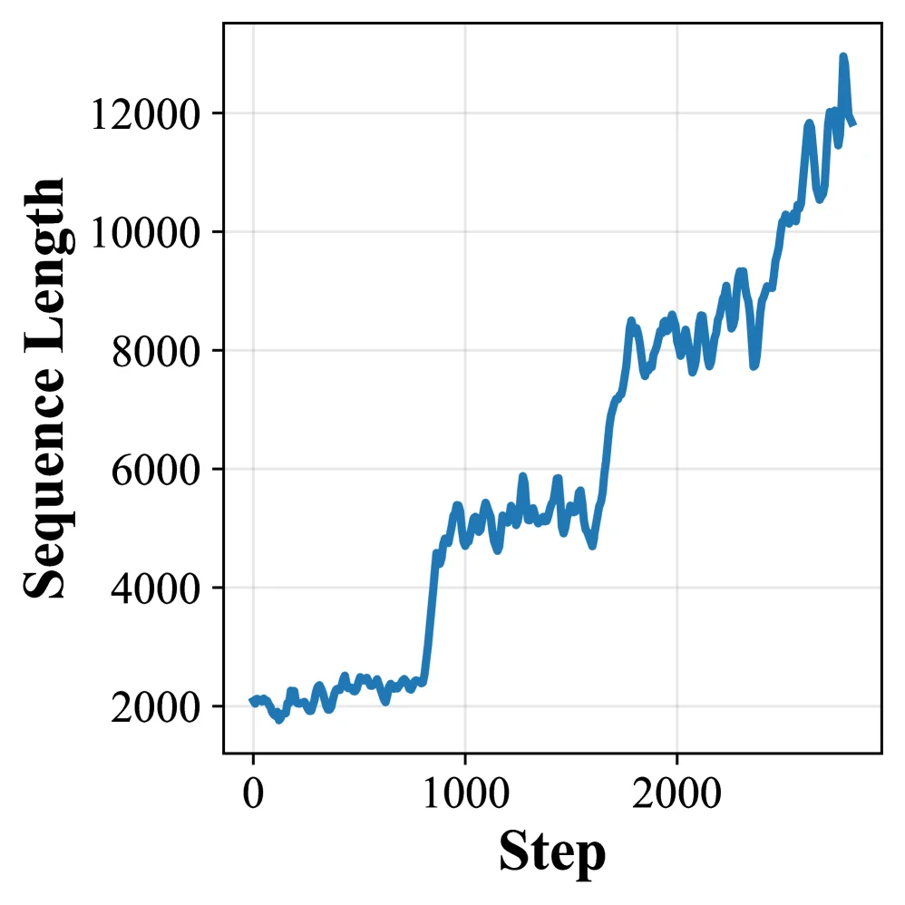

> (a) Reward (initial data) (b) Seq Length (initial data) (c) Reward (new data) (d) Seq Length (new data) Figure 2 : Training curves of Ling-2.5-1T-Base during first stage RL. (a,b) First 2800 steps with the initial training data: reward and sequence length increase steadily as the model bootstraps reasoning from scratch. (c,d) After switching to new training data, the model continues to improve with sustained sequence length growth.

This figure (Figure 2b) illustrates the curve of **sequence length** over **training steps** for the model "Ling-2.5-1T-Base" during the **first phase** of reinforcement learning (RL) training, using the **initial training data**.  

### Components and Information Flow of the Figure:  
- **X-axis (Horizontal Axis)**: Labeled "Step," it represents the training steps (or iterations), ranging from 0 to approximately 2800 steps (as described in the caption). It shows the temporal progression of training.  
- **Y-axis (Vertical Axis)**: Labeled "Sequence Length," it represents the length of the sequences generated by the model (e.g., the number of tokens in the output or processed data during inference). The Y-axis scale ranges from 2000 to over 12000, indicating the numerical range of sequence lengths.  
- **Curve**: The blue curve depicts the trend of sequence length over training steps. We can observe:  
  - **Initial Phase (0 to ~1000 steps)**: The sequence length is relatively low, fluctuating around 2000 with slow growth. This corresponds to the stage described in the caption where the model is "bootstrapping reasoning from scratch," learning how to generate meaningful sequences.  
  - **Rapid Growth Phase (~1000 to 2000 steps)**: The sequence length begins to increase significantly, rising rapidly from about 4000 to around 8000. This suggests that the model starts learning more effectively in this phase, capable of generating longer sequences, possibly because it begins to understand the task and develops more complex reasoning abilities.  
  - **Sustained Growth Phase (after 2000 steps)**: The sequence length continues to grow, eventually exceeding 12000 with some fluctuations. This indicates that the model is continuously improving, able to handle longer sequences and further enhance its reasoning capabilities.  

### How the Method Works (Inferred from the Figure):  
This figure demonstrates the model's behavior during the **first phase of RL training**, using the "initial training data" as described in the caption. The method can be understood as:  
1. **Bootstrapping from Scratch**: In the early stages of training (0 to ~1000 steps), the model has little prior knowledge or experience, so the sequence length is short and grows slowly. The model is learning how to generate valid sequences (e.g., reasoning steps for solving math problems).  
2. **Learning and Improvement**: As the number of training steps increases (after ~1000 steps), the model begins to learn more effective strategies, capable of generating longer sequences. This may be because the model receives reward signals through reinforcement learning (RL), adjusting its parameters to generate more valuable and longer sequences.  
3. **Continuous Optimization**: In the later stages of training (after 2000 steps), the sequence length continues to grow, indicating that the model is continuously optimizing its reasoning capabilities, able to handle more complex tasks or generate more detailed reasoning processes.  

### Results and Conclusions (Combined with the Caption):  
- **Coordinates and Ranges**: The X-axis represents training steps (0 to ~2800 steps), and the Y-axis represents sequence length (2000 to over 12000).  
- **Comparative Objects**: This figure (Figure 2b) contrasts with Figure 2a (reward curve for initial data), Figure 2c (reward curve for new data), and Figure 2d (sequence length curve for new data). Figure 2b focuses on the change in sequence length under initial data.  
- **Conclusions**:  
  - In the first 2800 steps of training using the initial training data, both the model's **reward (Figure 2a)** and **sequence length (Figure 2b)** increased steadily, indicating that the model gradually improved its performance during the process of "bootstrapping reasoning from scratch."  
  - The growth in sequence length indicates that the model can generate longer and potentially more complex sequences (e.g., more detailed reasoning steps), reflecting an improvement in the model's reasoning capabilities.  
  - This phase of training lays the foundation for subsequent training with new data (Figures 2c and 2d), as the model has already learned basic reasoning skills on the initial data and can continue to improve on new data.  

In summary, this figure shows the trend of sequence length over training steps during the first phase of RL training with initial data, reflecting the model's progression from initial learning to continuous optimization, and validating the effectiveness of the method in guiding the model to develop reasoning capabilities.

---

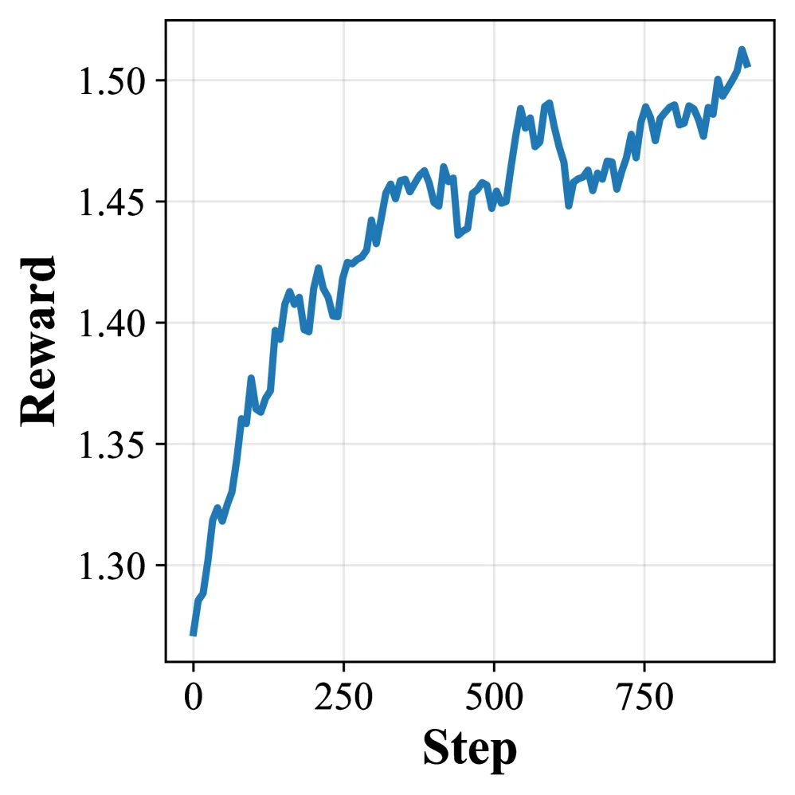

> (a) Reward (initial data) (b) Seq Length (initial data) (c) Reward (new data) (d) Seq Length (new data) Figure 2 : Training curves of Ling-2.5-1T-Base during first stage RL. (a,b) First 2800 steps with the initial training data: reward and sequence length increase steadily as the model bootstraps reasoning from scratch. (c,d) After switching to new training data, the model continues to improve with sustained sequence length growth.

This figure (Figure 2a) displays the **reward curve** of the model "Ling-2.5-1T-Base" during the first stage of Reinforcement Learning (RL) training, using **initial training data**.

Let's break down the components of the graph:
*   **X-axis (Horizontal Axis)**: Labeled "Step," this represents the training step or iteration. The range visible is approximately from 0 to around 800 steps. This indicates the progression of the model's training.
*   **Y-axis (Vertical Axis)**: Labeled "Reward," this represents the reward value obtained by the model during training. The reward values range approximately from 1.30 to above 1.55. Reward is a metric used to measure the quality of the model's behavior or performance; higher reward values indicate better performance.
*   **Curve**: The blue curve represents the trend of the reward value over the training steps. This is the core information conveyed by the graph.

The flow of data and presentation of information are as follows:
1.  **Starting Point**: At the beginning of training (when steps are close to 0), the reward value is relatively low, around 1.30. This indicates that when the model first starts training, its reasoning ability or behavioral performance is not good, resulting in a lower reward.
2.  **Development Phase**: As the number of training steps increases (moving from left to right on the X-axis), the reward value shows a clear upward trend. The curve extends from the bottom-left towards the top-right, indicating that as training progresses, the model's performance improves, and it receives higher rewards.
3.  **Trend Details**:
    *   In the early stages of training (e.g., from 0 to around 250 steps), the reward value increases relatively rapidly. This might correspond to the "initial discovery phase" (as mentioned in the original caption), where the model starts to explore and preliminarily establish its reasoning capabilities from scratch.
    *   As the training steps continue to increase (e.g., after 250 steps), the rate of reward growth might slow down, but the overall trend remains upward. The curve becomes flatter but still continues to rise. This could correspond to the "sharpening phase" (as described in the original caption), where the model further optimizes its reasoning abilities based on what it has already learned, leading to a steady increase in reward.
    *   The curve is not perfectly smooth; it exhibits some fluctuations. This indicates that the model's performance might have ups and downs during training, but the long-term trend is positive.

This figure reveals how the method operates:
*   **Training Process**: The method employs reinforcement learning for model training. In the first stage of training, the model learns using the "initial training data."
*   **Reward Mechanism**: The effectiveness of the model's learning is evaluated by observing changes in the reward value. An increase in reward value indicates that the model is learning better strategies or behaviors to complete a task (which in this case could be mathematical reasoning or other tasks requiring chain-of-thought).
*   **Learning Dynamics**: The curve in the graph illustrates the dynamic process of model learning. The model starts from a low reward level, and as training progresses, the reward value gradually increases. This shows that the model can learn from the training data and continuously improve its performance.
*   **Phase Division**: Based on the shape of the curve and the description in the original caption, the training process can be roughly divided into two phases:
    *   **Initial Discovery Phase**: In this phase, the reward value grows rapidly, and the model begins to explore and preliminarily master the basic skills of the task.
    *   **Sharpening Phase**: In this phase, the reward value continues to grow, but the rate of growth might slow down as the model further optimizes its skills, improving the quality and efficiency of its reasoning.

Conclusion:
*   **Coordinates**: The X-axis represents training steps (Step), and the Y-axis represents the reward value (Reward).
*   **Comparative Objects**: This figure (Figure 2a) is contrasted with other figures (Figures 2b, 2c, 2d). Figures 2a and 2b focus on the situation using "initial training data," while Figures 2c and 2d focus on the situation after switching to "new training data." In this specific figure (Figure 2a), we observe the change in reward for a single dataset (initial data).
*   **Conclusion**: This figure clearly shows that during Reinforcement Learning training using the initial training data, the reward value of the model "Ling-2.5-1T-Base" steadily increases with the number of training steps. This validates the effectiveness of the method, indicating that the model can learn and improve its performance through reinforcement learning. Specifically, the figure shows that the model experiences rapid reward growth in the early stages of training, followed by a phase of continued but potentially slower growth, which corresponds to the "initial discovery phase" and "sharpening phase" mentioned in the original text. This indicates that the model's training process is effective, and the model can acquire better reasoning capabilities through this training approach.

---

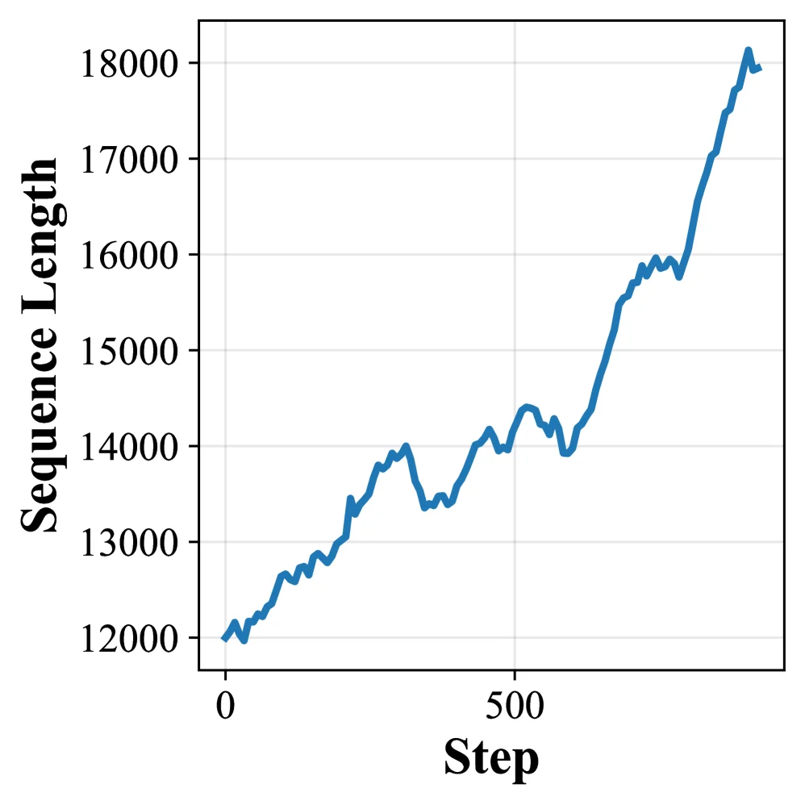

> (a) Reward (initial data) (b) Seq Length (initial data) (c) Reward (new data) (d) Seq Length (new data) Figure 2 : Training curves of Ling-2.5-1T-Base during first stage RL. (a,b) First 2800 steps with the initial training data: reward and sequence length increase steadily as the model bootstraps reasoning from scratch. (c,d) After switching to new training data, the model continues to improve with sustained sequence length growth.

This figure shows the **Sequence Length** curve for the Ling-2.5-1T-Base model during its first-stage reinforcement learning (RL) training, corresponding to subplot (b) in the original caption, which uses the **initial training data**.

Let's break down the components of the graph:
*   **X-axis (Horizontal Axis)**: Labeled "Step," this represents the training step or iteration. The X-axis range shown is approximately from 0 to just over 600 (as the peak on the right is near the 600 mark). This indicates the progress of the model's training on the initial data.
*   **Y-axis (Vertical Axis)**: Labeled "Sequence Length," this represents the length of the sequences generated by the model. The Y-axis is scaled from 12000 to 18000, with intervals of 1000. This measures the number of tokens or the complexity of the output processed/generated by the model in each training step.
*   **Curve**: The blue line plot illustrates the trend of sequence length as training progresses (with respect to the number of steps).

Now, let's interpret the detailed information and methodological insights revealed by this graph:

1.  **Initial Phase (Starting from Step 0)**:
    *   In the early stages of training (approximately from Step 0 to before Step 500), the sequence length starts at around 12000 and shows an overall increasing trend, albeit with some fluctuations. This indicates that as the model learns reasoning capabilities from scratch, the length of the sequences it generates gradually increases. This could mean the model is learning to handle more complex tasks or that its expressive power is gradually enhancing.
    *   This "steady growth" (as described in the caption as "increase steadily") reflects the model's self-bootstrapping process of reasoning ("bootstrap reasoning from scratch"). Through interaction with the environment (or training data), the model gradually discovers effective strategies to generate longer, potentially more meaningful sequences.

2.  **Mid-Phase (Around Step 500)**:
    *   Around Step 500, the curve exhibits more pronounced fluctuations, including a brief dip. This might represent an adjustment period for the model during learning or encountering certain learning bottlenecks. However, the overall upward trend is maintained.

3.  **Later Phase (After Step 500)**:
    *   After Step 500, the growth rate of sequence length significantly accelerates. The curve becomes steeper, indicating that the model can generate substantially longer sequences during this phase. This likely corresponds to the "sharpening phase" of the training process ("sharpening phase"), as mentioned in the caption, which describes the training process going through an initial "discovery phase" followed by a sharpening phase.
    *   By the end of the graph, the sequence length reaches a peak of nearly 18000, demonstrating the high complexity of output the model achieves during the later stages of training on the initial data.

**Understanding Method Operation**:
This graph demonstrates the dynamic changes in the sequence length generated by the model as training progresses in the first stage of RL, using initial data. This method (evaluating training progress by observing sequence length) reveals:
*   **Self-guided Learning**: The model is able to start learning from initial data and progressively increase the length of its generated sequences, indicating it is developing self-guided reasoning capabilities.
*   **Phased Progression**: The training process is not linearly smooth but goes through different phases, including an initial steady growth, a mid-phase of adjustment and fluctuations, and a later phase of rapid increase. This validates the point in the caption that the training process proceeds sequentially through an initial discovery phase followed by a sharpening phase.
*   **Capability Improvement**: An increase in sequence length is generally associated with the model's ability to handle more complex tasks. Therefore, this graph suggests that the model's training on the initial data is effective, and its reasoning capabilities are continuously improving.

**Conclusion**:
This graph clearly shows the trend of sequence length increasing steadily with the number of training steps for the Ling-2.5-1T-Base model during its first-stage RL training with initial data, with a particularly significant acceleration in growth in the later stages of training. This validates the effectiveness of the method in guiding the model's reasoning development and reveals the phased characteristics of the training process.

---

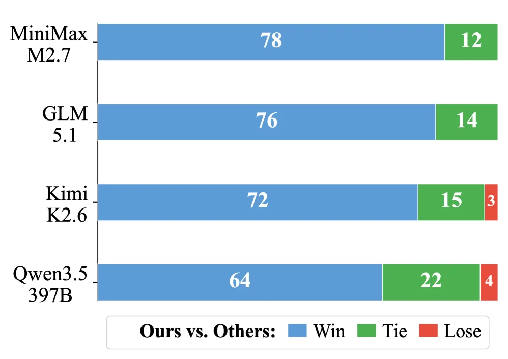

> (a) Comprehensibility (b) Reproducibility (c) Efficiency Figure 3 : Evaluation of CoT quality across three dimensions. (a) Comprehensibility: our model’s reasoning traces are judged to be more comprehensible than all baselines. (b) Reproducibility: distilling from our fewer CoT traces yields much stronger student models compared to DeepSeek-R1, highlighting a significantly higher sample efficiency for ability transfer. (c) Efficiency: our model solves problems using significantly fewer tokens.

This figure (Figure 3c, corresponding to the "Efficiency" dimension) shows a comparison of **our model (Ours) with four baseline models (MiniMax M2.7, GLM 5.1, Kimi K2.6, Qwen3.5 397B) in terms of "reasoning efficiency"**, with the core being the comparison of the number of tokens used to solve problems—fewer tokens mean higher efficiency.  

### Components of the Figure and Information Flow:  
- **Horizontal Axis**: Each model's bar chart consists of three parts, distinguished by colors: "Win (blue), Tie (green), Lose (red)", and the numbers represent the number of comparisons (or samples) in each category.  
- **Legend**: Blue (Win) means "our model uses fewer tokens to solve the problem than the baseline model"; Green (Tie) means "the number of tokens is comparable to that of the baseline model"; Red (Lose) means "the number of tokens is more than that of the baseline model".  
- **Comparison Logic**: For each baseline model, we count the number of times "our model wins, ties, or loses in token usage". For example, in the bar chart of MiniMax M2.7, the blue part accounts for 78, green for 12, and red for 0 (no red in the figure)—this means that in 78 comparisons, our model uses fewer tokens; in 12 comparisons, the number of tokens is comparable; there are no cases of losing.  

### Operational Logic of the Method (Inferring Method Advantages from Results):  
Our method (combined with the "zero RL" training pipeline in the paper, such as clipped importance sampling, training-inference ratio correction, mixed precision control, etc.) aims to **improve reasoning efficiency** (i.e., reduce the number of tokens required to solve the problem). From the results in the figure:  
- For the four baselines (MiniMax M2.7, GLM 5.1, Kimi K2.6, Qwen3.5 397B), our model has far more "Win" times than "Tie" or "Lose" (especially for MiniMax M2.7 and GLM 5.1, the proportion of Win times is extremely high). This shows that **in most comparisons, our model uses fewer tokens to solve the problem than the baseline**, verifying the efficiency advantage of the method.  

### Coordinates, Comparison Objects, and Conclusions:  
- **Comparison Objects**: Our model vs. four baseline models (MiniMax M2.7, GLM 5.1, Kimi K2.6, Qwen3.5 397B).  
- **Coordinates (Meaning of Values)**: The numbers in each bar chart are the "number of comparisons" (or samples), where blue = win (our tokens are fewer), green = tie (tokens are comparable), red = lose (tokens are more).  
- **Conclusions**:  
  - MiniMax M2.7: 78 wins, 12 ties, 0 losses → Our model uses fewer tokens in the vast majority of comparisons.  
  - GLM 5.1: 76 wins, 14 ties, 0 losses → Obvious efficiency advantage.  
  - Kimi K2.6: 72 wins, 15 ties, 3 losses → The number of wins still accounts for the majority, with only a few cases of more tokens.  
  - Qwen3.5 397B: 64 wins, 22 ties, 4 losses → The number of wins is the highest, and the number of ties is also relatively large, but overall, wins are still the main case.  

In summary, this figure intuitively shows through the "comparison of the number of wins, ties, and losses in token usage" that **our model is significantly superior to the four baseline models in terms of reasoning efficiency**—that is, it uses fewer tokens to solve the problem, verifying the effectiveness of the method in the "efficiency" dimension.

---

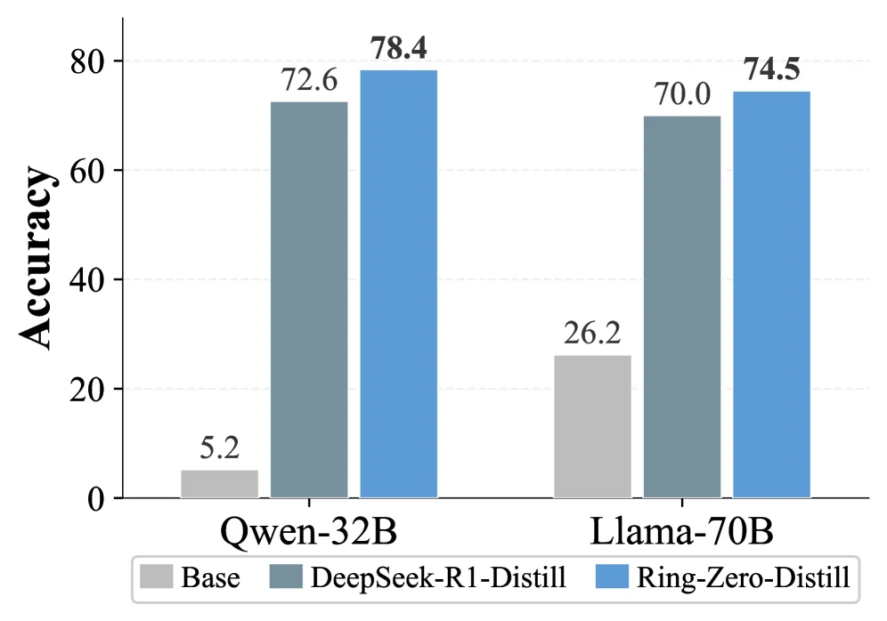

> (a) Comprehensibility (b) Reproducibility (c) Efficiency Figure 3 : Evaluation of CoT quality across three dimensions. (a) Comprehensibility: our model’s reasoning traces are judged to be more comprehensible than all baselines. (b) Reproducibility: distilling from our fewer CoT traces yields much stronger student models compared to DeepSeek-R1, highlighting a significantly higher sample efficiency for ability transfer. (c) Efficiency: our model solves problems using significantly fewer tokens.

This figure (a subfigure of Figure 3, likely related to "Efficiency" or "Transferability" based on the caption) evaluates the **Accuracy** of two different-scale base models (`Qwen-32B` and `Llama-70B`) after being distilled by different methods, to validate the advantages of the "Ring-Zero-Distill" approach. We break down each component:  

### Components and Data Flow  
- **X-axis**: Shows two base models: `Qwen-32B` (32-billion parameters) and `Llama-70B` (70-billion parameters). These are the "student models" to be distilled.  
- **Y-axis**: Represents `Accuracy`, ranging from 0 to 80, measuring the model’s performance on a task (likely mathematical reasoning or chain-of-thought tasks).  
- **Legend**: Three colored/filled bars represent different methods:  
  - Gray (`Base`): The "base version" of the model (undistilled performance).  
  - Dark blue (`DeepSeek-R1-Distill`): Performance after distillation with the DeepSeek-R1 method (baseline).  
  - Light blue (`Ring-Zero-Distill`): Performance after distillation with our proposed Ring-Zero-Distill method.  
- **Data Points**: Each model-method combination has a bar whose height represents accuracy. For example:  
  - For `Qwen-32B`: `Base` = 5.2, `DeepSeek-R1-Distill` = 72.6, `Ring-Zero-Distill` = 78.4.  
  - For `Llama-70B`: `Base` = 26.2, `DeepSeek-R1-Distill` = 70.0, `Ring-Zero-Distill` = 74.5.  

### How the Method Works (Inferred from the Figure)  
The figure demonstrates the **distillation** process: Distillation is a knowledge-transfer technique that transfers knowledge from a large (or high-performance) model to a smaller (or base) model to improve its performance. Here, the "base models" (Base) have low performance, but after distillation with different methods, their performance improves significantly. Our method (`Ring-Zero-Distill`) outperforms the baseline (`DeepSeek-R1-Distill`), showing superior knowledge transfer.  

### Results and Conclusions (With Coordinates, Comparisons, and Takeaways)  
- **Comparison Objects**: Accuracy comparison of three methods (`Base`, `DeepSeek-R1-Distill`, `Ring-Zero-Distill`) for the same base model (either `Qwen-32B` or `Llama-70B`); and performance of the same method across different base models (`Qwen-32B` vs. `Llama-70B`).  
- **Conclusions**:  
  1. **Effectiveness of Distillation**: For both base models, distilled models (either `DeepSeek-R1` or `Ring-Zero`) have far higher accuracy than the base version (`Base`). For example, `Qwen-32B`’s `Base` accuracy is only 5.2, but it rises to 72.6 (`DeepSeek`) or 78.4 (`Ring-Zero`); `Llama-70B`’s `Base` accuracy is 26.2, rising to 70.0 (`DeepSeek`) or 74.5 (`Ring-Zero`). This confirms that distillation significantly boosts base model performance.  
  2. **Advantage of Ring-Zero-Distill**: For the same base model, `Ring-Zero-Distill` outperforms `DeepSeek-R1-Distill`. For example, on `Qwen-32B`, `Ring-Zero` (78.4) is 5.8 points higher than `DeepSeek` (72.6); on `Llama-70B`, `Ring-Zero` (74.5) is 4.5 points higher than `DeepSeek` (70.0). This shows our method is more effective in knowledge transfer (distillation), yielding better-performing student models.  
  3. **Model Scale Differences**: The `Base` accuracy of `Llama-70B` (26.2) is much higher than that of `Qwen-32B` (5.2), indicating larger base models may have better initial performance. However, after distillation, both models show consistent relative improvement, and our method boosts performance significantly for both small and large models.  

In summary, this figure clearly shows that **Ring-Zero-Distill more effectively improves the performance of base models during distillation**, outperforming the baseline (`DeepSeek-R1-Distill`) for both small (`Qwen-32B`) and large (`Llama-70B`) models. It also validates the effectiveness of distillation as a knowledge-transfer technique.

---

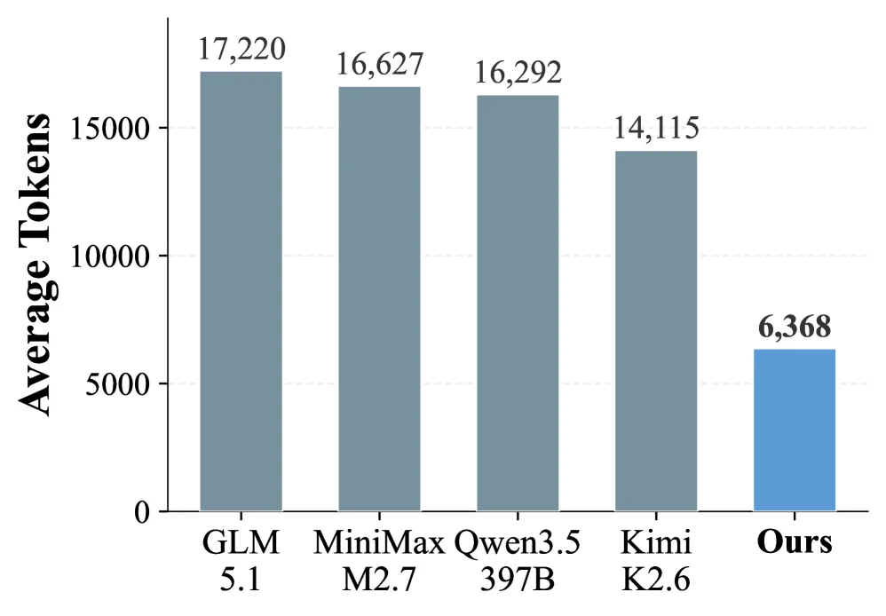

> (a) Comprehensibility (b) Reproducibility (c) Efficiency Figure 3 : Evaluation of CoT quality across three dimensions. (a) Comprehensibility: our model’s reasoning traces are judged to be more comprehensible than all baselines. (b) Reproducibility: distilling from our fewer CoT traces yields much stronger student models compared to DeepSeek-R1, highlighting a significantly higher sample efficiency for ability transfer. (c) Efficiency: our model solves problems using significantly fewer tokens.

This figure (subfigure (c) "Efficiency" of Figure 3) shows the **average number of tokens** used by different models to solve problems, measuring the efficiency of the method—our model ("Ours") uses significantly fewer tokens than baseline models to solve problems.

### Structure and Components of the Figure:
- **X-axis**: Lists different models, including GLM 5.1, MiniMax M2.7, Qwen3.5 397B, Kimi K2.6, and our model ("Ours"). These are the comparison objects, where the first four are baseline models and the last is the method proposed in this paper.
- **Y-axis**: Represents "Average Tokens", with a numerical range from 0 to approximately 17,000+, quantifying the number of tokens consumed by each model to solve a problem. Tokens can be understood as the basic units (e.g., words or subwords) processed by the model; fewer tokens usually mean a more concise and efficient reasoning process.
- **Bar Chart**: Each model corresponds to a bar, and the height of the bar represents the average number of tokens for that model. For example:
  - GLM 5.1 has an average of about 17,220 tokens;
  - MiniMax M2.7 has about 16,627 tokens;
  - Qwen3.5 397B has about 16,292 tokens;
  - Kimi K2.6 has about 14,115 tokens;
  - Our model ("Ours", blue bar) has only 6,368 tokens.

### How the Method Works (Inferred from the Results):
The results in this figure show that our method ("Ours") is significantly more efficient in **reasoning** than the baseline models. Combining the paper's background (training large-scale models with zero RL to elicit reasoning abilities), our method achieves efficient reasoning through the following methods:
1. **Algorithm Optimization**: As mentioned in the paper, such as "clipped importance sampling", "training-inference ratio correction", and "mixed-precision control", these optimizations reduce unnecessary token redundancy in the reasoning process, allowing the model to generate reasoning traces more concisely.
2. **System Optimization**: It may include improving the stability and efficiency of the training pipeline to ensure that the model can still reason efficiently after large-scale training, rather than falling into redundant token generation.

### Conclusion (Key Information from the Figure):
- **Comparison Objects**: Our model is compared with four baseline models (GLM 5.1, MiniMax M2.7, Qwen3.5 397B, Kimi K2.6).
- **Coordinates and Values**: The Y-axis is the average number of tokens, and the average number of tokens for our model (about 6,368) is much lower than that of all baseline models (the number of tokens for baseline models is all above 14,000, even exceeding 17,000).
- **Conclusion**: Our method ("Ours") uses **significantly fewer tokens** to solve problems, which verifies the advantage of the method in the "efficiency" dimension—that is, it can complete the reasoning task with fewer token consumptions, reflecting the conciseness and efficiency of the reasoning process.

---

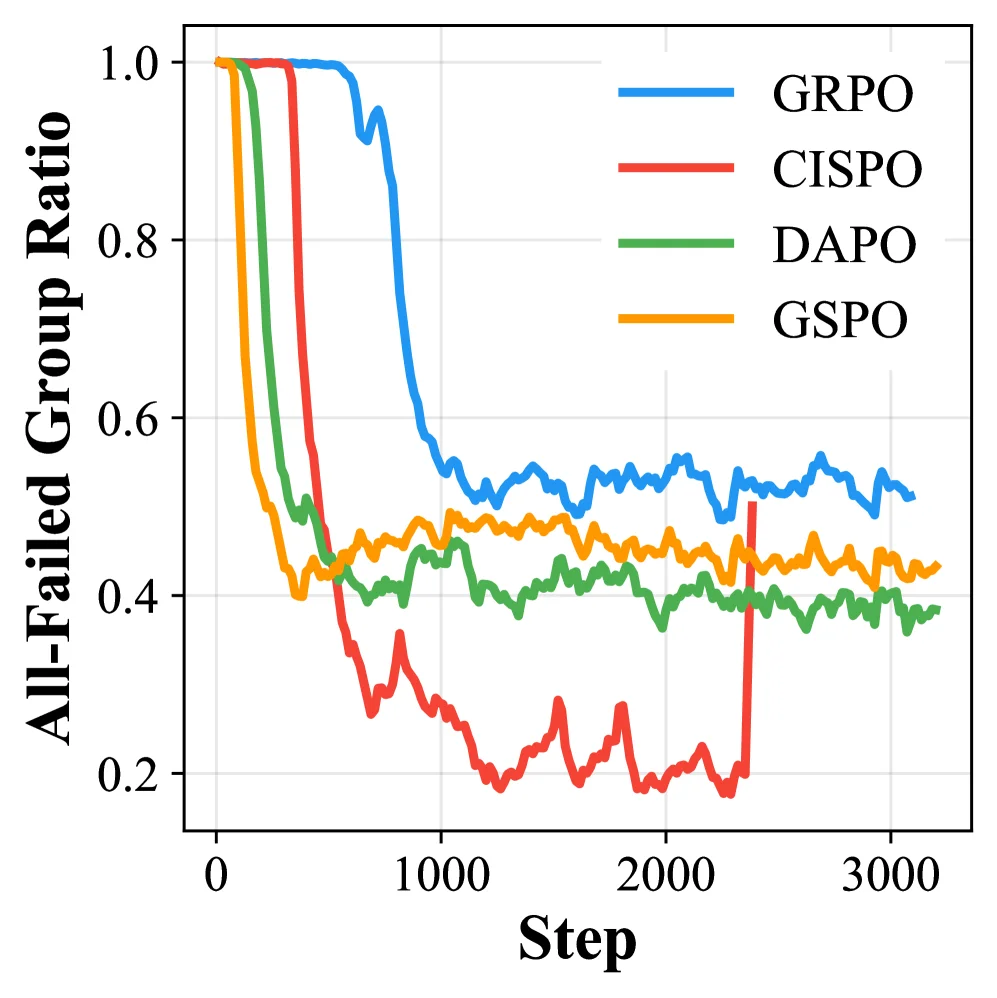

> (a) All-Failed Group Ratio (b) Reward (c) Entropy (d) Sequence Length Figure 4 : Comparison of RL algorithms on the flash model. CISPO and DAPO accelerate learning but suffer from greater instability. GSPO maintains high entropy but provides limited sequence length growth.

This figure (Figure 4a) illustrates the "All-Failed Group Ratio" for four reinforcement learning (RL) algorithms—GRPO, CISPO, DAPO, and GSPO—applied to a "flash model" over the course of training steps. This metric measures the proportion of task groups that fail at a given point in time.

**Components and Information Flow:**

*   **X-axis (Horizontal Axis):** Labeled "Step," it represents the training steps or iterations, ranging from 0 to approximately 3000. This denotes the temporal progression of the learning process.
*   **Y-axis (Vertical Axis):** Labeled "All-Failed Group Ratio," it ranges from 0 to 1.0. A value of 1.0 means all task groups failed, while a value of 0 means all task groups succeeded. This metric reflects the difficulty of exploration for the algorithm in the early stages or its mastery of tasks in later stages.
*   **Four Curves:** Each represents a different RL algorithm:
    *   **Blue Curve (GRPO):** In the early training phase (approximately the first 500 steps), its "All-Failed Group Ratio" is close to 1.0, indicating a high failure rate for most tasks. Subsequently, this ratio drops rapidly, falling below 0.6 around step 1000, and stabilizes around 0.5 in subsequent training with minor fluctuations. This suggests GRPO encounters significant difficulties during the initial exploration phase, but its success rate improves and stabilizes as training progresses.
    *   **Red Curve (CISPO):** Its initial performance is similar to GRPO, with an "All-Failed Group Ratio" also close to 1.0. However, it begins to drop rapidly at an earlier stage (between approximately 500 and 1000 steps) and reaches a lower stable level (around 0.2 to 0.3) after about 1500 steps. This indicates CISPO accelerates the learning process, reducing the failure rate more quickly.
    *   **Green Curve (DAPO):** Its trend is similar to CISPO, but the rate of decrease is slightly slower than CISPO. It also starts with a high failure rate, then begins to drop significantly after about 1000 steps, and stabilizes around 0.4 in subsequent training. This suggests DAPO can also accelerate learning, but its stability might be less than CISPO or GSPO.
    *   **Orange Curve (GSPO):** Among all algorithms, GSPO's "All-Failed Group Ratio" decreases the slowest. It remains at a relatively high level (fluctuating between approximately 0.4 and 0.5) throughout the training process. This indicates that GSPO learns more slowly, or maintains higher explorativeness during training, leading to a higher failure rate.

**Method Operation (Based on the Figure and Caption):**

This figure evaluates the learning efficiency and stability of different RL algorithms by comparing the changes in their "All-Failed Group Ratio" during training.

*   **CISPO and DAPO:** These two algorithms significantly accelerate the learning process (i.e., they reduce the failure rate faster), as shown by the red and green curves. However, the caption states they "suffer from greater instability." From the graph, it's visible that the red curve (CISPO) shows larger fluctuations later on (e.g., a noticeable increase after 2000 steps), while the green curve (DAPO), although relatively smoother, still has a higher final failure rate than GSPO.
*   **GSPO:** This algorithm's "All-Failed Group Ratio" decreases most slowly, as shown by the orange curve. The caption notes it "maintains high entropy but provides limited sequence length growth." High entropy typically implies higher explorativeness or diversity, which could explain the slower decrease in its failure rate, as it might be trying more different strategies. However, this high explorativeness might come at the cost of limited sequence length growth, possibly related to task complexity or model expressiveness.
*   **GRPO:** As a baseline for comparison, GRPO's learning process is relatively stable, but its learning speed and final performance are intermediate between CISPO/DAPO and GSPO.

**Conclusion:**

This figure clearly demonstrates the differences in learning dynamics among the various RL algorithms during training. CISPO and DAPO accelerate learning but may incur greater instability. GSPO exhibits higher explorativeness (high entropy) but learns more slowly and shows limited sequence length growth. GRPO provides a relatively stable benchmark. These observations are crucial for selecting appropriate RL algorithms to train large models (like the "flash model" mentioned in the paper), especially in scenarios requiring a balance between learning efficiency, stability, and explorativeness.

---

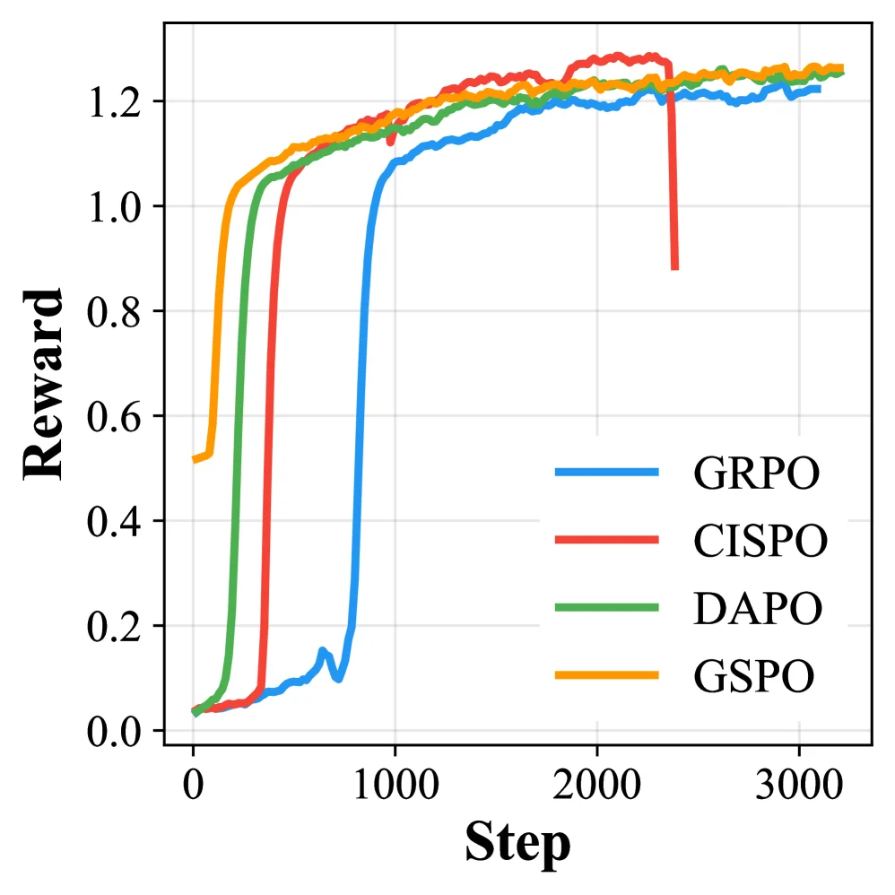

> (a) All-Failed Group Ratio (b) Reward (c) Entropy (d) Sequence Length Figure 4 : Comparison of RL algorithms on the flash model. CISPO and DAPO accelerate learning but suffer from greater instability. GSPO maintains high entropy but provides limited sequence length growth.

This figure (Figure 4b) presents a comparative analysis of how rewards evolve with training steps for four reinforcement learning (RL) algorithms on the "flash model." The graph can be interpreted through the following components:  

### Structure and Components of the Figure  
- **X-axis (Horizontal Axis):** Labeled "Step," it represents the number of training steps, ranging from 0 to approximately 3,000. This indicates the progression of time or iterations during training.  
- **Y-axis (Vertical Axis):** Labeled "Reward," it shows the reward values obtained by the model during training, ranging from 0 to slightly above 1.2. Higher reward values generally signify better model performance.  
- **Four Curves:** Each curve corresponds to a different RL algorithm, distinguished by color and legend:  
  - **Blue Curve (GRPO):** Represents the GRPO algorithm.  
  - **Red Curve (CISPO):** Represents the CISPO algorithm.  
  - **Green Curve (DAPO):** Represents the DAPO algorithm.  
  - **Orange Curve (GSPO):** Represents the GSPO algorithm.  

### Data Trends and Interpretation  
The trajectory of each curve illustrates how the corresponding algorithm’s reward changes as training progresses. Key observations include:  
- **Initial Phase (Step < 1000):** All algorithms start with rewards near 0 and experience rapid growth. GSPO (orange), DAPO (green), and CISPO (red) grow quickly, while GRPO (blue) grows more slowly and exhibits a brief dip before recovering.  
- **Mid-Phase (1000 < Step < 2000):** Rewards continue to increase and stabilize. GSPO, DAPO, and CISPO fluctuate around 1.2, while GRPO also stabilizes near this level.  
- **Late Phase (Step > 2000):** Most algorithms maintain high rewards (above 1.2), though CISPO (red) shows a significant drop (suddenly falling below 0.9) before recovering. This highlights CISPO’s instability.  

### Insights into Algorithm Behavior (Inferred from the Figure)  
The graph reveals the **learning dynamics** of different RL algorithms during training:  
- **Accelerated Learning:** CISPO (red) and DAPO (green) show faster initial reward growth than GRPO (blue), indicating they more quickly "discover" effective strategies (consistent with the caption stating "CISPO and DAPO accelerate learning").  
- **Instability:** CISPO’s reward drops significantly in the later phase, reflecting its instability (matching the caption’s mention of "greater instability"). DAPO’s curve is smoother but still shows minor fluctuations.  
- **Entropy and Sequence Length:** While the figure focuses on rewards, the caption notes "GSPO maintains high entropy but provides limited sequence length growth." Thus, GSPO (orange) likely balances high exploration (entropy) with slower sequence length growth, though this is not directly shown in the figure and would require additional subfigures (e.g., Figure 4c or 4d) for confirmation.  

### Comparison and Conclusion  
- **Comparison Subjects:** The training performance of four RL algorithms (GRPO, CISPO, DAPO, GSPO) on the same model (flash model).  
- **Key Takeaways:**  
  - CISPO and DAPO accelerate learning (rapid reward growth), but CISPO is more unstable (larger reward fluctuations).  
  - GSPO maintains high entropy (suggesting stronger exploration) but has limited sequence length growth (potentially related to Figure 4d, though not directly visible here).  
  - GRPO learns more slowly but eventually achieves high rewards with relative stability.  

This figure allows for a clear visual comparison of how rewards change during training across different RL algorithms, shedding light on their learning efficiency, stability, and ultimate performance.

---

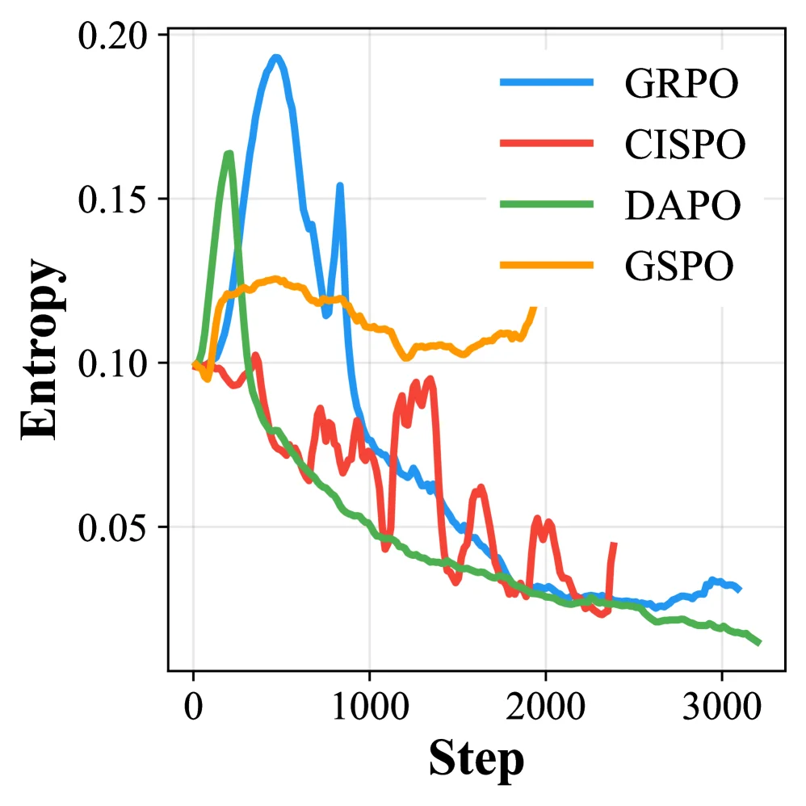

> (a) All-Failed Group Ratio (b) Reward (c) Entropy (d) Sequence Length Figure 4 : Comparison of RL algorithms on the flash model. CISPO and DAPO accelerate learning but suffer from greater instability. GSPO maintains high entropy but provides limited sequence length growth.

This figure (Figure 4c) illustrates the change in **Entropy** over **Training Steps** for four different reinforcement learning (RL) algorithms—GRPO, CISPO, DAPO, and GSPO—when applied to a "flash model." The key to understanding this graph lies in analyzing the trends, peaks, fluctuations, and relative relationships of each curve to reveal the training dynamics of the different algorithms.

First, let's examine the axes:
*   **X-axis (Horizontal)**: Represents "Step," ranging from 0 to approximately 3000 steps. This denotes the progress of training, either in terms of iterations or time.
*   **Y-axis (Vertical)**: Represents "Entropy," with values ranging from 0 to 0.20. In the context of reinforcement learning, entropy typically measures the randomness or diversity of a policy. High entropy indicates a more random or exploratory policy in action selection, while low entropy signifies a more deterministic or exploitative policy.

Now, let's analyze each of the four curves, one by one:
1.  **GSPO (Orange Curve)**:
    *   GSPO's entropy value remains relatively high and stable throughout the training process.
    *   In the initial phase (approximately 0 to 500 steps), its entropy is comparable to or slightly higher than the other algorithms.
    *   As training progresses, the GSPO curve shows some fluctuations but generally maintains a level between 0.10 and 0.12, even showing a slight upward trend towards the end.
    *   This suggests that GSPO is able to maintain a higher degree of policy diversity or explorativeness.

2.  **GRPO (Blue Curve)**:
    *   GRPO's entropy rapidly increases in the early stages of training (approximately 0 to 500 steps), reaching a very high peak (close to 0.20).
    *   Following this peak, there is a sharp decline and significant volatility.
    *   After about 1000 steps, GRPO's entropy gradually decreases and stabilizes, but the final entropy value is lower than that of GSPO.

3.  **DAPO (Green Curve)**:
    *   DAPO's entropy also shows a noticeable peak in the early stages, but the peak height is lower than that of GRPO.
    *   Subsequently, the entropy value drops quickly and continues to decline slowly and steadily throughout the subsequent training process, ultimately reaching the lowest entropy level among the four algorithms.

4.  **CISPO (Red Curve)**:
    *   CISPO's entropy change is the most erratic.
    *   There is an initial small peak, followed by multiple large fluctuations, including several significant rises and falls.
    *   Overall, CISPO's entropy decreases during training, but its volatility is markedly higher than that of the other algorithms, especially when compared to DAPO and GSPO.

Based on the information in the graph and the provided caption, we can draw the following conclusions:
*   **GSPO**: As stated in the caption, "GSPO maintains high entropy." The graph clearly shows that GSPO indeed maintains a relatively high entropy value throughout the training process, suggesting it may be better at exploring new strategies or maintaining policy diversity. However, the caption also mentions it "provides limited sequence length growth," which might imply that despite strong exploration, it may not be optimal for task-specific performance improvements (like generating longer, more effective reasoning sequences).
*   **CISPO and DAPO**: The caption notes they "accelerate learning but suffer from greater instability." Visually, both CISPO and DAPO exhibit entropy peaks in the early stages, which might indicate stronger exploratory behavior early on, thus accelerating certain aspects of learning. However, CISPO's curve is highly volatile, and DAPO's entropy drops rapidly and continuously after its peak, both demonstrating "instability." This instability could be related to their learning rates, policy update mechanisms, or other algorithmic characteristics.
*   **GRPO**: GRPO shows extremely high entropy initially, suggesting a very strong exploratory behavior. The subsequent sharp drop in entropy might indicate a rapid shift towards exploiting learned strategies. However, this drastic change could also lead to instability in the training process.

This graph, by showing the change in entropy during training for different RL algorithms, reveals their differences in learning dynamics. For instance, GSPO tends to maintain stable high explorativeness, while CISPO and DAPO show strong early exploration but then become unstable or rapidly reduce explorativeness. GRPO exhibits an extreme exploration-to-exploitation transition. These characteristics are important for selecting an appropriate RL algorithm for specific tasks, especially in scenarios requiring a balance between exploration and exploitation. The data flow in the graph is from left to right, representing the passage of time, with each curve showing the entropy value of the corresponding algorithm at each training step.

---

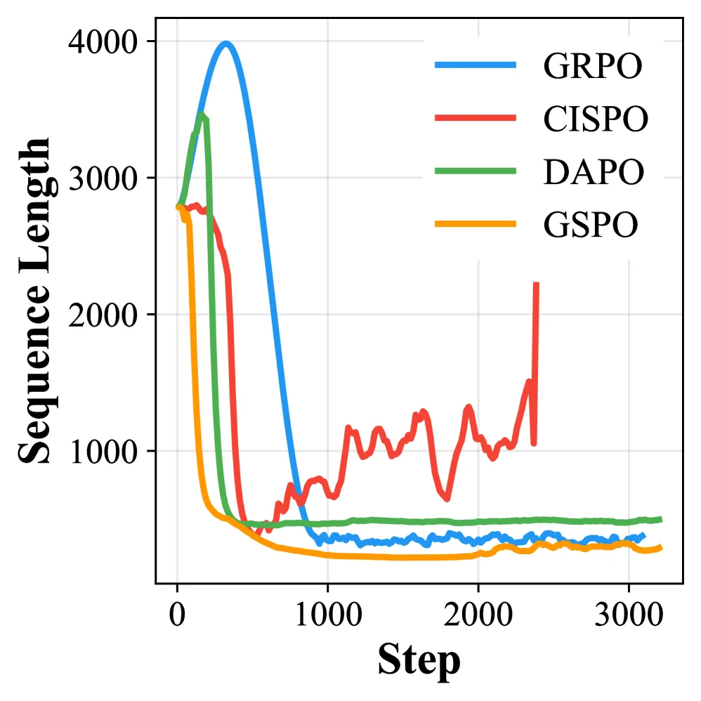

> (a) All-Failed Group Ratio (b) Reward (c) Entropy (d) Sequence Length Figure 4 : Comparison of RL algorithms on the flash model. CISPO and DAPO accelerate learning but suffer from greater instability. GSPO maintains high entropy but provides limited sequence length growth.

This figure (Figure 4d) illustrates the comparison of four reinforcement learning (RL) algorithms—GRPO (blue), CISPO (red), DAPO (green), and GSPO (orange)—in terms of how the **Sequence Length** changes with **Training Steps** on the "flash model."

First, let's examine the axes of the graph:
- The **X-axis (Horizontal Axis)** represents the **Training Steps (Step)**, ranging from 0 to approximately 3000, indicating the progression of the training process.
- The **Y-axis (Vertical Axis)** represents the **Sequence Length**, with values from 0 to 4000, indicating the length of the sequences (e.g., reasoning chains or action sequences) generated by the model at each step.

Next, we analyze the curve for each algorithm and its behavior:
1.  **GRPO (Blue Curve)**: This curve rises sharply in the early stages of training (approximately the first 500 steps), reaching a peak (close to 4000), and then drops abruptly. After this drop, it remains at a relatively low and stable level (around 500 or below) for subsequent steps. This suggests that GRPO initially attempts to generate longer sequences, but this behavior is quickly suppressed or adjusted, leading to a significant reduction and stabilization of sequence length.
2.  **CISPO (Red Curve)**: This curve exhibits the most volatility. It also experiences an initial rise and fall, but then shows noticeable instability during the middle stage (between approximately 500 and 2000 steps), with sequence length fluctuating and gradually increasing. Towards the end, near 3000 steps, there is another significant peak. This indicates that CISPO may undergo larger fluctuations during the learning process, but its sequence length has the potential to grow in the later stages.
3.  **DAPO (Green Curve)**: This curve also rises initially, but its peak is lower than those of GRPO and CISPO. Subsequently, it drops rapidly and stabilizes at a relatively low level. Its sequence length remains relatively low and stable throughout the training process, showing little significant change.
4.  **GSPO (Orange Curve)**: This curve also rises initially, but its peak is the lowest among the four curves. Afterward, it drops quickly and stabilizes at a very low sequence length level, with almost no significant changes in subsequent training steps.

Based on the original caption of the figure and our analysis, we can draw the following conclusions:
-   **CISPO and DAPO**: These two algorithms can accelerate the learning process (possibly performing well in the early stages), but they also exhibit greater instability (e.g., the fluctuations in CISPO and the rapid drop followed by stabilization in DAPO).
-   **GSPO**: This algorithm can maintain high entropy (although entropy is not directly shown in the figure, the caption mentions this), which means it might explore more possibilities or maintain diversity in its strategy. However, GSPO provides limited growth in sequence length, with its sequence length dropping rapidly and remaining at a low level during training.
-   **Overall Trend**: All algorithms show an increase in sequence length during the early stages of training, followed by a decrease and stabilization for most algorithms. This might reflect a transition from an exploration phase to an exploitation phase for the model, or some form of optimization or constraint on sequence length during training.

This figure, by comparing the changes in sequence length during training for different RL algorithms, reveals their differences in learning and behavioral patterns. For instance, CISPO, while unstable, might have higher potential for sequence length growth, whereas GSPO focuses more on stability at the cost of sequence length growth. This analysis helps in understanding the performance and behavioral characteristics of different algorithms on a specific task (like the "flash model" here).

---

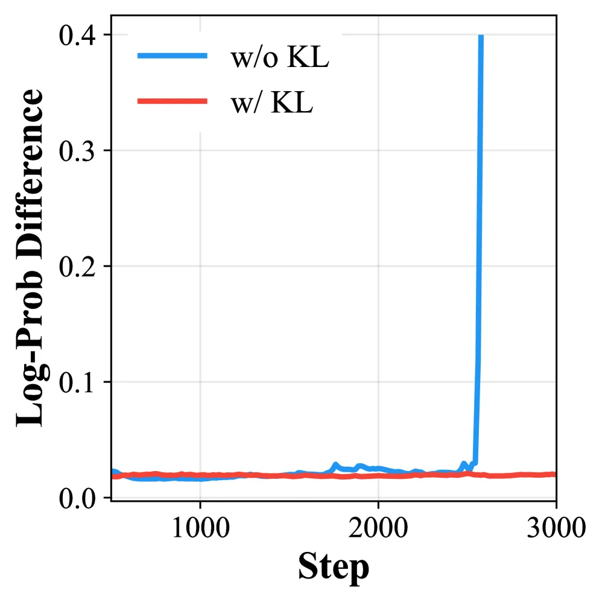

> (a) Log-Prob Difference (b) Entropy (c) Sequence Length (d) Reward Figure 5 : Effect of KL penalty on training stability. Without KL (blue), the training-inference log-probability gap diverges, causing the reward to crash. With KL (red), all metrics remain healthy.

This figure (Figure 5(a)) focuses on illustrating **the impact of KL penalty (Kullback-Leibler penalty) on training stability**, using the metric of "Log-Prob Difference" to quantify the alignment between training and inference processes.  

### Components and Information Flow of the Figure  
- **X-axis (Step)**: Represents the training step (from 0 to ~3000), indicating the training timeline.  
- **Y-axis (Log-Prob Difference)**: Measures the difference between the log-probability during training and the log-probability during inference. This difference reflects the consistency of the model’s behavior between training and inference—smaller differences mean higher alignment and more stable training.  
- **Two Curves**:  
  - Blue curve (`w/o KL`, "without KL penalty"): Shows how the log-prob difference changes with training steps when **KL penalty is not used**.  
  - Red curve (`w/ KL`, "with KL penalty"): Shows how the log-prob difference changes with training steps when **KL penalty is used**.  

### How the Method Works (Understood from the Figure)  
KL penalty is a regularization technique that constrains the model’s output distribution (or probability behavior) to avoid "training-inference misalignment" during training. From the figure, we can intuitively see:  
- When **no KL penalty** is used (blue curve), the log-prob difference suddenly surges (even approaching 0.4) after ~2500 steps. This indicates that the alignment between training and inference is broken, and the model may "perform well during training but collapse during inference" (consistent with the caption’s supplement: "reward collapse").  
- When **KL penalty** is used (red curve), the log-prob difference remains very low (close to 0) throughout, meaning the model’s behavior during training and inference is highly consistent, and the training process is stable.  

### Coordinates, Comparison Objects, and Conclusion  
- **Coordinate Range**: The x-axis (Step) ranges from 0 to 3000, and the y-axis (Log-Prob Difference) ranges from 0 to 0.4.  
- **Comparison Objects**: Blue (without KL) vs. Red (with KL).  
- **Conclusion**: KL penalty effectively stabilizes the training process—without KL, the log-prob difference between training and inference "diverges" (leading to reward collapse); with KL, all metrics (including log-prob difference) remain "healthy" (i.e., stable and low in difference). This verifies the necessity of KL penalty in training large-scale zero-shot reinforcement learning (zero RL) models, ensuring training stability and avoiding performance collapse due to training-inference misalignment.  

In short, this figure clearly shows **how KL penalty constrains the probability distribution to align training and inference, thereby improving training stability**. Without KL, severe alignment issues occur in the later training stages, while with KL, training remains stable throughout.

---

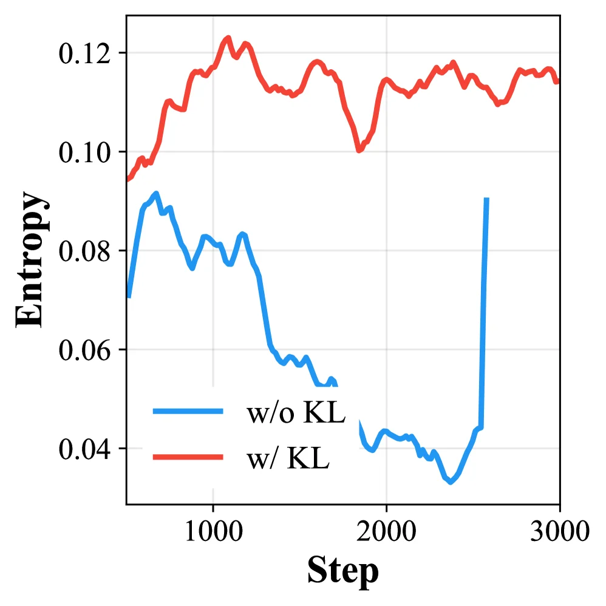

> (a) Log-Prob Difference (b) Entropy (c) Sequence Length (d) Reward Figure 5 : Effect of KL penalty on training stability. Without KL (blue), the training-inference log-probability gap diverges, causing the reward to crash. With KL (red), all metrics remain healthy.

This figure (Figure 5b) illustrates the effect of the Kullback-Leibler (KL) penalty on the entropy of a model's output during reinforcement learning (specifically zero RL, which uses verifiable rewards without human-annotated data) training, thereby revealing training stability.

First, let's examine the components of the graph:
- **X-axis (Step)**: Labeled "Step," it represents the training steps or iterations, ranging from approximately 0 to 3000. This indicates the temporal progression of the training process.
- **Y-axis (Entropy)**: Labeled "Entropy," it represents the entropy value of the model's output probability distribution. A higher entropy value indicates greater uncertainty in the model's output, or a more uniform output distribution; a lower entropy value indicates higher certainty in a particular output.
- **Two curves**:
    - **Blue curve (labeled "w/o KL")**: Represents the change in entropy over training steps when the KL penalty is not used.
    - **Red curve (labeled "w/ KL")**: Represents the change in entropy over training steps when the KL penalty is used.

Next, we analyze the trends and comparisons of these two curves:
- **Without KL penalty (blue curve)**: In the early stages of training, the entropy value shows an upward trend, reaching a peak before gradually decreasing. After approximately 2000 steps, the entropy value drops sharply to a very low level, then suddenly rises sharply again near 3000 steps. This drastic fluctuation suggests that without the KL penalty, the model's training process may become unstable, with inconsistent changes in entropy.
- **With KL penalty (red curve)**: Throughout the training process, the entropy value remains at a relatively high level with minor fluctuations. Although there are some small fluctuations at certain points (e.g., around 1000 steps and 2000 steps), the entropy value generally stays within a stable range, approximately between 0.10 and 0.12.

This figure reveals the role of the KL penalty in the training process:
- **Training stability**: The KL penalty helps maintain the stability of the model's output entropy. Without the KL penalty, the changes in entropy are drastic, potentially leading to an unstable training process and even affecting the model's performance (e.g., reward collapse). With the KL penalty, the changes in entropy are smoother, indicating a more stable training process.
- **Model behavior**: The stability of entropy may reflect the model's control over the certainty or uncertainty of its outputs during learning. A higher entropy value may indicate that the model is exploring different output options, while a lower entropy value may indicate that the model is exploiting learned knowledge. The KL penalty may help the model find a balance between exploration and exploitation, thereby improving training stability and effectiveness.

Combining the paper's abstract and the original caption of the figure, we can draw the following conclusions:
- **Training stability**: The KL penalty is crucial for maintaining the stability of the training process. Without the KL penalty, unstable phenomena (such as drastic fluctuations in entropy) may occur during training, whereas with the KL penalty, the training process is more stable.
- **Method operation**: By introducing the KL penalty, the model can maintain the stability of output entropy during training, thus avoiding training collapse. This may be part of the "stable and efficient training pipeline" mentioned in the paper, which includes algorithmic and system optimizations (such as clipped importance sampling, training-inference ratio correction, and mixed-precision control) to improve training stability and efficiency.
- **Conclusion**: The KL penalty helps improve the stability of zero RL training, enabling the model to be trained on a larger scale with better performance and emergent capabilities.

In summary, this figure clearly demonstrates the important role of the KL penalty in maintaining training stability by comparing the changes in model entropy with and without the KL penalty.

---

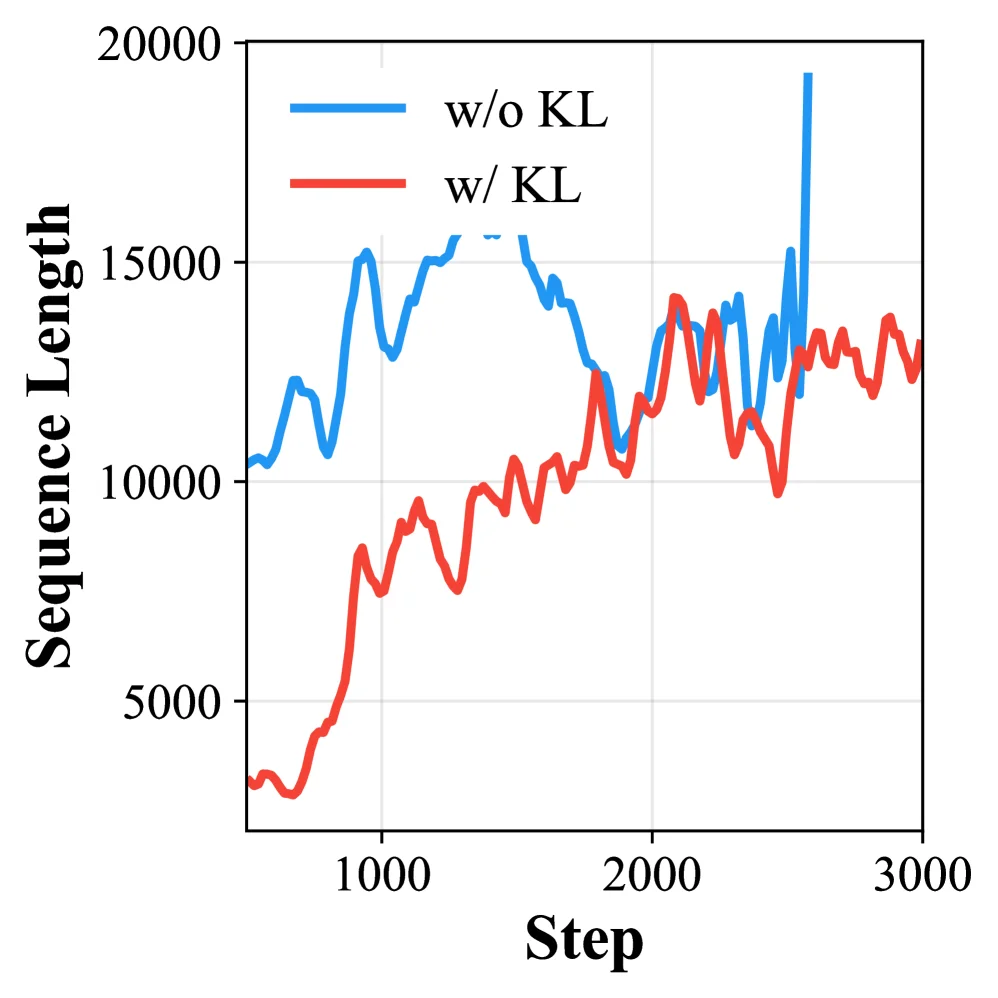

> (a) Log-Prob Difference (b) Entropy (c) Sequence Length (d) Reward Figure 5 : Effect of KL penalty on training stability. Without KL (blue), the training-inference log-probability gap diverges, causing the reward to crash. With KL (red), all metrics remain healthy.

This figure (Figure 5c) illustrates the change in **sequence length** over **training steps** during reinforcement learning (specifically zero RL, i.e., reinforcement learning without human-annotated data) training, comparing the training stability between using a **KL penalty (w/ KL, red curve)** and not using a KL penalty (w/o KL, blue curve).

### Explanation of Components:
- **X-axis (Step)**: Represents the training step, ranging from 0 to 3000, indicating the progression of the training process over time.
- **Y-axis (Sequence Length)**: Represents the length of the sequence (e.g., reasoning chain, response) generated by the model at each step (measured by the number of tokens), ranging from 0 to 20,000, reflecting how the output length changes during training.
- **Two Curves**:
  - Blue curve (w/o KL): Represents training **without a KL penalty**. It shows large fluctuations, especially in the later stages (after ~2500 steps), with a sharp peak (near 20,000) followed by a rapid drop, indicating poor stability.
  - Red curve (w/ KL): Represents training **with a KL penalty**. This curve has relatively smooth fluctuations, showing an upward trend initially and then stabilizing, without the drastic fluctuations or abnormal peaks seen in the blue curve.

### How the Method Works (Revealed by the Figure):
- **Role of KL Penalty**: The KL penalty (Kullback-Leibler divergence penalty) is a regularization technique that constrains the difference between the model’s output distribution and a target distribution (or a previous distribution). In this figure, training with a KL penalty (red curve) shows more stable sequence length changes, indicating that the KL penalty helps **suppress unstable factors** (e.g., drastic fluctuations in output length) during training, thus improving training stability.
- **Problem with No KL Penalty**: Without a KL penalty (blue curve), the sequence length shows a sharp peak and fluctuations in the later stages, which may lead to training instability (e.g., reward collapse, as mentioned in the caption: “reward to crash”). This suggests that the KL penalty is crucial for maintaining training stability, especially in large-scale model training (e.g., the 1-trillion-parameter model mentioned in the paper).

### Result Analysis (Coordinates, Comparison Objects, and Conclusion):
- **Coordinate Range**: The X-axis (Step) ranges from 0 to 3000, and the Y-axis (Sequence Length) ranges from 0 to 20,000.
- **Comparison Objects**: The blue curve (w/o KL) and the red curve (w/ KL).
- **Conclusion**:
  - Training with a KL penalty (w/ KL) results in smoother changes in sequence length, with no drastic fluctuations or abnormal peaks, indicating that the KL penalty helps **improve training stability**.
  - Training without a KL penalty (w/o KL) shows sharp fluctuations and a peak in sequence length in the later stages, leading to training instability (as mentioned in the caption: “reward to crash”).
  - This verifies the paper’s finding: the KL penalty is critical for the stability of large-scale zero RL training, as it avoids unstable factors (e.g., drastic fluctuations in output length) during training, ensuring healthy training (as mentioned in the caption: “all metrics remain healthy”).

In summary, this figure clearly demonstrates the role of the KL penalty in improving training stability by comparing the change in sequence length during training with and without the KL penalty: using a KL penalty makes the training process smoother, avoiding drastic fluctuations in output length and ensuring healthy training.

---

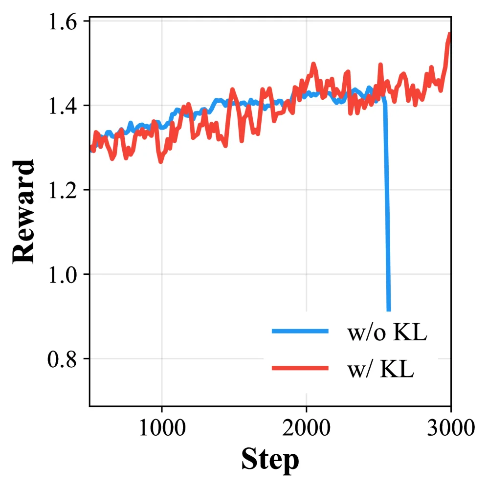

> (a) Log-Prob Difference (b) Entropy (c) Sequence Length (d) Reward Figure 5 : Effect of KL penalty on training stability. Without KL (blue), the training-inference log-probability gap diverges, causing the reward to crash. With KL (red), all metrics remain healthy.

This figure (Figure 5d) illustrates the impact of the **KL penalty (Kullback-Leibler penalty) on training stability** during reinforcement learning, specifically how it affects the key metric of "Reward" over training steps.

First, let's break down the components of the graph:

1.  **Axes**:
    *   **X-axis (Horizontal)**: Labeled "Step," this represents the training step or iteration. The range shown is approximately from 0 to 3000 steps, indicating the progression of the training process over time.
    *   **Y-axis (Vertical)**: Labeled "Reward," this represents the reward value obtained by the model during training. Higher reward values generally indicate better performance or a more optimal learned policy. The range is approximately from 0.8 to 1.6.

2.  **Curves**:
    *   **Blue curve (labeled "w/o KL")**: This curve represents training **without** the KL penalty. "w/o" stands for "without."
    *   **Red curve (labeled "w/ KL")**: This curve represents training **with** the KL penalty. "w/" stands for "with."

3.  **Data Flow and Trends**:
    *   **Blue curve (w/o KL)**: For most of the training period (approximately the first 2500 steps), this curve shows a relatively stable reward value, maintaining around 1.3 to 1.4 with some normal fluctuations. However, around step 2500 to 3000, this curve suddenly and sharply drops. The reward value plummets from a higher level (around 1.4) to a very low level (below 0.9). This abrupt "collapse" indicates that training without the KL penalty becomes unstable in the later stages, leading to a significant drop in model performance.
    *   **Red curve (w/ KL)**: This curve demonstrates much higher stability and consistency throughout the entire training process (from step 0 to 3000). The reward value starts at around 1.3 initially and, overall, shows a slow upward trend as training progresses, eventually approaching 1.6 by step 3000. While some fluctuations are present, they are normal, and the reward value remains consistently high without experiencing a collapse like the blue curve.

**How the Method Works (i.e., the Role of KL Penalty)**:

*   **Purpose of KL Penalty**: The KL penalty is a regularization technique often used to prevent overfitting or to ensure that generated sequences in generative models (like language models) align with a target distribution. In the context of this paper, it is used to improve the stability of "zero RL" training.
*   **Without KL Penalty (Blue Curve)**: When the KL penalty is not used, the model may "drift" from its expected behavior or distribution during later stages of training. This drift causes the log-probability gap between training and inference to diverge (as mentioned in the caption), which in turn leads to a sharp drop in reward. This indicates that the training process becomes unstable, and the model may no longer learn effectively or maintain its performance.
*   **With KL Penalty (Red Curve)**: When the KL penalty is used, it acts as a "constraint" or "guide," making the training process more stable. This allows the reward to continue growing or at least remain at a high level, avoiding collapse. This suggests that the KL penalty helps maintain training stability, enabling the model to learn and perform better at a larger scale.

**Conclusion**:

This figure clearly demonstrates the importance of the KL penalty for enhancing the stability of "zero RL" training by comparing the two training scenarios (with and without KL penalty). Specifically:

*   **Comparison Objects**: The blue curve (without KL penalty) versus the red curve (with KL penalty).
*   **Coordinates**: The X-axis is training steps (Step), and the Y-axis is reward (Reward).
*   **Conclusion**: Training without the KL penalty (blue curve) experiences a sharp drop in reward (collapse) in the later stages, indicating unstable training. In contrast, training with the KL penalty (red curve) shows a healthier and more stable reward growth trend. Therefore, the KL penalty is crucial for ensuring the stability and effectiveness of large-scale "zero RL" training, as it is a key optimization for achieving a stable and efficient training pipeline, as mentioned in the paper's abstract.

---

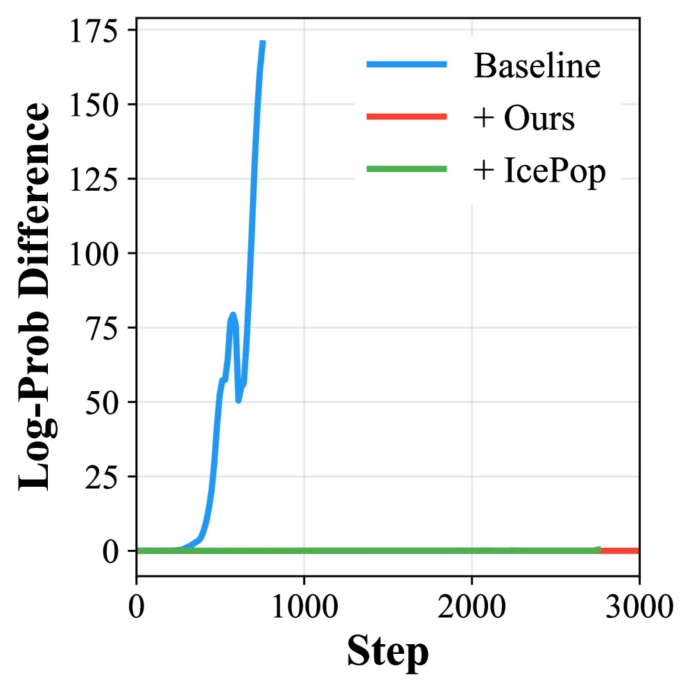

> (a) Log-Prob Difference (b) Entropy (c) Sequence Length (d) Reward Figure 6 : Comparison of ratio correction strategies. The baseline (blue) collapses within 800 steps. IcePop (green) delays the collapse but ultimately fails. Our approach (red) maintains stable training completely.

This figure (Figure 6a) illustrates the variation of the "Log-Prob Difference" metric with training steps (Step) for different ratio correction strategies, aiming to compare their impact on training stability.

First, let's examine the components of the graph:
- **X-axis (Horizontal Axis)**: Represents the training steps (Step), ranging from 0 to 3000. This indicates the progress or iterations during the training process.
- **Y-axis (Vertical Axis)**: Represents the Log-Prob Difference. This metric likely measures the discrepancy between the model's predicted probability distribution and a target distribution, where a larger difference may imply higher instability or collapse of the model.
- **Three Curves**: Each curve represents a different training strategy:
  - **Blue Curve (Baseline)**: Represents the baseline method or strategy. As seen in the graph, this curve sharply rises around step 800, indicating that the model collapses at this point. This means the baseline method becomes unstable quickly during training.
  - **Green Curve (+ IcePop)**: Represents the strategy using the IcePop method. This curve remains relatively flat initially but eventually shows an upward trend, indicating that while IcePop delays the collapse, it ultimately fails to prevent the model from collapsing.
  - **Red Curve (+ Ours)**: Represents the method proposed by the authors. This curve stays near 0 throughout the training process (up to 3000 steps), indicating that the authors' method maintains completely stable training and avoids collapse.

Next, we analyze how the methods work based on this graph:
- The baseline method (blue) collapses early in training, suggesting stability issues with this approach.
- The IcePop method (green) delays the collapse to some extent but ultimately fails, indicating that while IcePop improves upon the baseline, it is still insufficient to ensure long-term training stability.
- The authors' proposed method (red) maintains a stable Log-Prob Difference throughout the training process, suggesting that this method effectively avoids model collapse and achieves stable training through certain mechanisms (possibly the algorithmic and system optimizations mentioned in the paper, such as clipped importance sampling, training-inference ratio correction, and mixed-precision control).

Finally, we summarize the conclusions from this graph:
- The baseline method (Baseline) collapses quickly during training and cannot maintain stable training.
- The IcePop method delays the collapse but ultimately fails.
- The authors' proposed method (Ours) maintains completely stable training and avoids collapse, demonstrating better training stability.

This graph clearly shows the advantage of the authors' proposed method in terms of training stability by comparing the performance of different methods on the Log-Prob Difference metric.

---

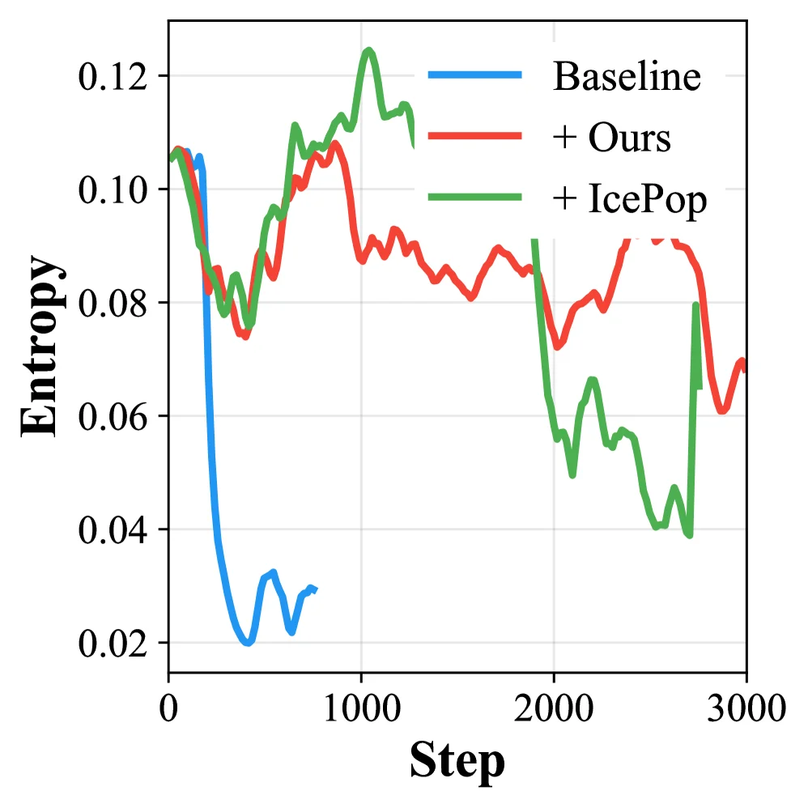

> (a) Log-Prob Difference (b) Entropy (c) Sequence Length (d) Reward Figure 6 : Comparison of ratio correction strategies. The baseline (blue) collapses within 800 steps. IcePop (green) delays the collapse but ultimately fails. Our approach (red) maintains stable training completely.

This figure (Figure 6b) illustrates the change in entropy (a measure of uncertainty or randomness in the model's output) over training steps (Step) for different ratio correction strategies in reinforcement learning (specifically zero RL, which uses verifiable rewards without human - annotated data). The x - axis represents the training step, ranging from 0 to 3000, and the y - axis represents the entropy, with a range from 0.02 to 0.12.

There are three curves in the figure, each representing a different strategy:
- Blue curve (Baseline): It represents the baseline method (without using the improvement strategy proposed in this paper). As can be seen from the figure, this curve drops sharply and collapses (collapse) at around 800 steps. The entropy value drops rapidly to a very low level and then fluctuates at a low level, indicating that the baseline method becomes unstable in the early stage of training and cannot be effectively trained continuously.
- Green curve (+ IcePop): It represents the method using the IcePop strategy. This curve has a relatively high and volatile entropy value in the early stage (about 0 to 2000 steps). Although it delays the occurrence of collapse (compared with the baseline method, it only starts to drop significantly after 2000 steps), it eventually fails (the entropy value drops significantly). This shows that although the IcePop strategy can alleviate the collapse to a certain extent, it cannot completely avoid the instability of training.
- Red curve (+ Ours): It represents the method proposed in this paper ("Ours"). This curve maintains a relatively stable entropy value throughout the training process (from 0 to 3000 steps). Although there are fluctuations at some steps, there is no overall collapse, indicating that the method proposed in this paper can maintain a stable training process.

From this figure, we can draw the following conclusions: The baseline method (blue) collapses within about 800 training steps; Although the IcePop method (green) can delay the collapse, it will eventually fail; However, the method proposed in this paper (red) can completely maintain a stable training process without collapse. This verifies the advantage of the method proposed in this paper in terms of training stability, which can solve the problem of training instability that may occur in the training of large - scale models in zero RL and provide a stable training environment for the subsequent emergence of model training and reasoning ability.

---

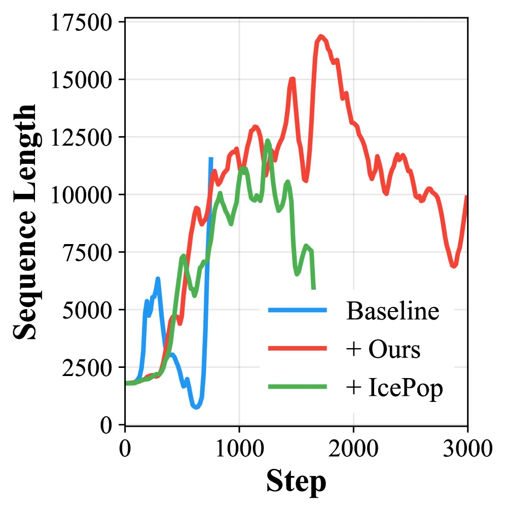

> (a) Log-Prob Difference (b) Entropy (c) Sequence Length (d) Reward Figure 6 : Comparison of ratio correction strategies. The baseline (blue) collapses within 800 steps. IcePop (green) delays the collapse but ultimately fails. Our approach (red) maintains stable training completely.

This figure (Figure 6c) illustrates the **change in sequence length over training steps** for three different strategies in reinforcement learning (specifically zero RL, where rewards are verifiable without human-annotated data), comparing a "Baseline", "+ IcePop", and "+ Ours" (our method) to evaluate training stability.

### Components and Information Flow:
- **X-axis (Step)**: Represents the training step, ranging from 0 to 3000, showing the progression of training over time.
- **Y-axis (Sequence Length)**: Represents the length of sequences (e.g., reasoning chains, action sequences) generated by the model during training, with values from 0 to 17500.
- **Three Curves**:
  - **Blue Curve (Baseline)**: Represents the training process without our proposed optimization strategies. The curve drops sharply ( "collapses" ) around 800 steps, with a significant decrease in sequence length, indicating that the baseline method becomes unstable quickly and cannot sustain effective training.
  - **Green Curve (+ IcePop)**: Represents the method using the "IcePop" strategy. The sequence length fluctuates initially but eventually shows a clear downward trend before 2000 steps, meaning IcePop delays collapse but ultimately fails to maintain stable training.
  - **Red Curve (+ Ours)**: Represents the training process with our method. The sequence length remains relatively stable throughout the training steps (0–3000), even at high steps (e.g., after 2000 steps), and does not exhibit the collapse seen in the baseline and IcePop.

### How the Method Works (Inferred from the Figure):
Our method (red curve) uses **algorithmic and system optimizations** (e.g., clipped importance sampling, training-inference ratio correction, mixed-precision control, as mentioned in the paper) to solve the training instability issues in the baseline and IcePop methods. Specifically:
- The baseline method likely collapses (due to improper reward signal handling, gradient explosion/vanishing, or other training instability factors) because it lacks these optimizations.
- IcePop attempts to address these issues, but our method, through improved optimization (e.g., enhanced ratio correction), keeps the training process stable across all steps, with sequence length maintaining a high level. This suggests the model can continuously learn and generate effective sequences (e.g., reasoning chains).

### Results and Conclusion:
- **Coordinates and Comparison Objects**: The x-axis is training steps (0–3000), and the y-axis is sequence length (0–17500). The comparison objects are three methods: Baseline (blue), IcePop (green), and our method (red).
- **Conclusion**:
  - The baseline method (blue) "collapses" (sequence length drops sharply) around 800 steps and cannot maintain stable training.
  - IcePop (green) delays collapse but ultimately fails (sequence length drops significantly) before 2000 steps.
  - Our method (red) maintains **stable training** throughout the training process (0–3000 steps), with no collapse in sequence length. This demonstrates that our method effectively solves training instability, supporting the training of large-scale models (e.g., trillion-parameter models).

This figure clearly shows the advantage of our method in training stability, validating the effectiveness of the "ratio correction strategy" mentioned in the paper. Our method avoids training collapse and maintains a stable training process, providing a reliable training pipeline for large-scale zero RL models.

---

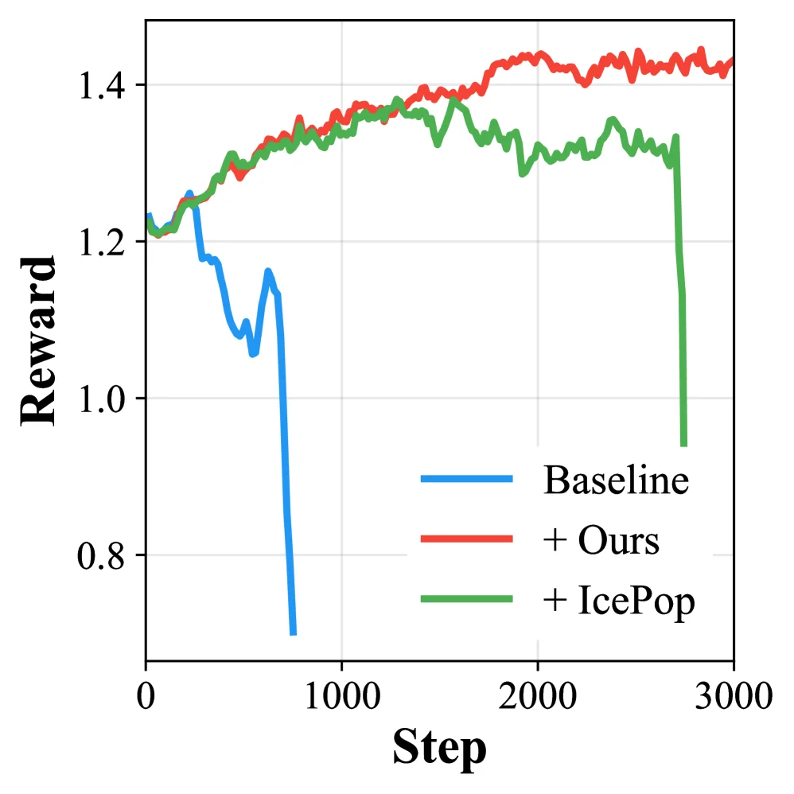

> (a) Log-Prob Difference (b) Entropy (c) Sequence Length (d) Reward Figure 6 : Comparison of ratio correction strategies. The baseline (blue) collapses within 800 steps. IcePop (green) delays the collapse but ultimately fails. Our approach (red) maintains stable training completely.

This figure (Figure 6d) illustrates the **reward over training steps** for different ratio correction strategies in reinforcement learning, comparing their training stability and performance.  

### Components and Information Flow:  
- **X - axis (Step)**: Represents the training step, ranging from 0 to 3000, showing the temporal dimension of training (how the model performs at different stages).  
- **Y - axis (Reward)**: Represents the reward (e.g., feedback from a task), with values between ~0.8 and 1.4. Higher reward indicates better model performance.  
- **Three Curves**: Correspond to three methods:  
  - **Blue (Baseline)**: A “baseline” method (without the ratio correction strategy or other improvements proposed in this paper). The curve drops sharply around 800 steps (“collapses”), meaning the baseline method fails to train stably.  
  - **Green (+ IcePop)**: Uses the “IcePop” method. It remains relatively stable (with high reward) until ~2000 steps but then collapses, showing IcePop delays collapse but ultimately fails.  
  - **Red (+ Ours)**: Uses the “our method” proposed in the paper. It maintains high reward throughout training (0–3000 steps) with no collapse, proving stable training.  

### How the Method Works (Inferred from Results):  
- **Baseline (Blue)**: Without effective ratio correction, training becomes unstable (e.g., due to gradient issues or poor policy updates), causing performance to collapse early (≈800 steps).  
- **IcePop (Green)**: A ratio correction strategy temporarily stabilizes training (delays collapse) but fails long - term (likely due to limitations in adapting to model scale or task complexity).  
- **Our Method (Red)**: With designed ratio correction (plus optimizations like clipped importance sampling, training - inference ratio correction, etc.), it maintains stable reward, solving training instability and enabling continuous learning.  

### Conclusion (From Results):  
- Baseline (no effective ratio correction) collapses early (≈800 steps) and cannot train stably.  
- IcePop delays collapse but ultimately fails.  
- Our method (+ Ours) maintains stable, high reward throughout training (3000 steps), proving its ratio correction (plus optimizations) effectively solves training instability for large - scale reinforcement learning.

---

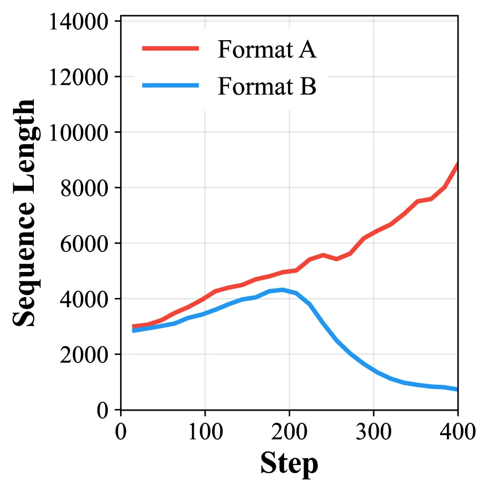

> (a) Sequence Length (b) Reward Figure 7 : Format reward comparison. Format A causes uncontrolled length growth without reward improvement. Format B ensures proper stopping. (c) Sequence Length (d) Reward Figure 8 : Window size comparison. The 32k window produces much longer responses than the 16k window, but only marginally improves the reward, demonstrating severe token redundancy.

This figure (Figure 7a) illustrates the impact of **different reward formats (Format A vs. Format B) on the sequence length (number of tokens in the model’s output) over training steps**, demonstrating how reward format design influences the model’s output behavior.

### Components and Information Flow:
- **X - axis (Step)**: Represents the training step, ranging from 0 to 400, showing how the model’s behavior evolves over time (steps).
- **Y - axis (Sequence Length)**: Represents the length of the model’s output (number of tokens), ranging from 0 to 14,000, measuring the “redundancy” or “length” of the model’s response.
- **Two Curves**:
  - Red curve (Format A): Shows the sequence length change when using “Format A” reward. As steps increase, the sequence length **grows continuously** (from ~3,000 to over 8,000) with no obvious stop or decline.
  - Blue curve (Format B): Shows the sequence length change when using “Format B” reward. The sequence length first grows (reaching ~4,500 at ~200 steps) and then **significantly decreases**, eventually stabilizing at a low level (below ~1,000).

### Method’s Operational Logic (Revealed by the Figure):
The figure shows **how reward formats guide the model’s output length (i.e., the “redundancy” of the reasoning process)**:
- **Issue with Format A**: It causes “uncontrolled length growth” (the model’s output keeps getting longer without stopping). Even as training steps increase, the model does not “stop” generating output (or shorten it), implying that Format A’s reward mechanism fails to teach the model “when to stop,” leading to meaningless redundancy.
- **Advantage of Format B**: It ensures “proper stopping” (the model’s output length grows initially but then contracts to a reasonable length). This suggests that Format B’s reward mechanism effectively teaches the model to “stop outputting at an appropriate time,” avoiding unnecessary redundancy.

### Coordinates, Comparison Objects, and Conclusions:
- **Coordinates**: X - axis (Step): 0–400; Y - axis (Sequence Length): 0–14,000.
- **Comparison Objects**: Two reward formats (Format A and Format B).
- **Conclusions**:
  - Format A leads to **uncontrolled length growth** and no accompanying reward improvement (from the figure’s title “Format reward comparison” and the caption, we can infer that Format A’s reward design does not effectively guide the model to optimize, instead causing the output length to spiral out of control).
  - Format B ensures **proper stopping** (the model’s output length grows and then stabilizes at a shorter length), indicating that Format B’s reward mechanism more effectively controls the model’s output behavior (e.g., avoiding redundancy, learning to stop).

In short, this figure contrasts the sequence length changes under two reward formats, demonstrating the **critical impact of reward format design on the model’s output length (redundancy)**: Format A makes the model’s output increasingly longer (uncontrolled), while Format B makes the output grow and then stabilize (proper stopping), validating the design logic that “reward formats should guide the model to learn reasonable output lengths.”

---

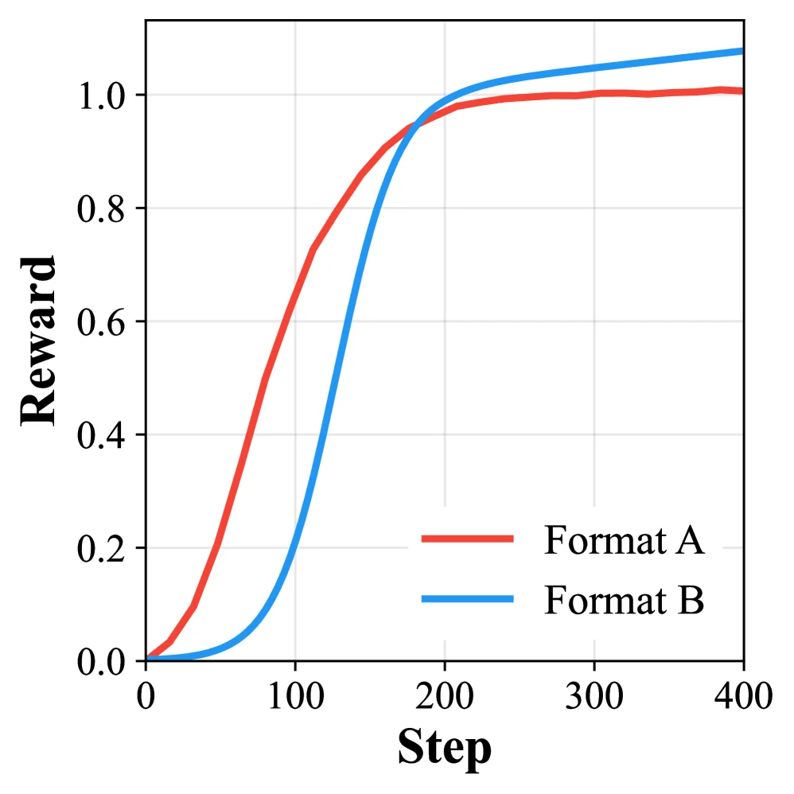

> (a) Sequence Length (b) Reward Figure 7 : Format reward comparison. Format A causes uncontrolled length growth without reward improvement. Format B ensures proper stopping. (c) Sequence Length (d) Reward Figure 8 : Window size comparison. The 32k window produces much longer responses than the 16k window, but only marginally improves the reward, demonstrating severe token redundancy.

This figure (Figure 7b) illustrates a comparative analysis of how rewards evolve during reinforcement learning training for two different formats (Format A and Format B).  

### Key Components of the Graph:  
- **X-axis (Horizontal Axis)**: Labeled "Step," this represents the training steps or iterations, ranging from 0 to 400. This indicates the training progresses step-by-step, with the model continuously learning and optimizing as steps increase.  
- **Y-axis (Vertical Axis)**: Labeled "Reward," this shows the reward value obtained by the model, ranging from 0.0 to over 1.0. Higher reward values typically signify better performance or closer alignment with the target behavior.  
- **Two Curves**:  
  - The red curve represents "Format A."  
  - The blue curve represents "Format B."  
- **Legend**: Located at the bottom-right corner, it clearly identifies the red curve as Format A and the blue curve as Format B for easy differentiation.  

### Analysis of Data Trends and Information Presentation:  
- As training steps increase, both formats show an upward trend in rewards, indicating the model gradually learns better behaviors to achieve higher rewards.  
- In the early stages (approximately 0–100 steps), Format A’s reward grows faster, with its curve initially above Format B’s. This suggests Format A may help the model gain basic rewards more easily at the start.  
- However, after 100 steps, Format B’s reward growth rate surpasses Format A’s. From around 200 steps onward, Format B’s rewards remain consistently higher than Format A’s, eventually stabilizing near 1.0, while Format A’s rewards also stabilize but slightly lower than Format B’s.  

### Interpretation with the Original Caption:  
- This is a result graph comparing the performance of Format A and Format B in reinforcement learning training.  
- The graph reveals that Format A initially shows rapid reward growth but later stagnates, potentially causing uncontrolled sequence length growth ("Format A causes uncontrolled length growth without reward improvement"). This means Format A may help the model gain early rewards but fails to improve reward ceilings and could lead to excessively long generated sequences (e.g., responses or reasoning processes) without corresponding reward increases.  
- In contrast, Format B’s reward curve overtakes Format A’s in the later stages, achieving higher and more stable rewards. The caption also notes that Format B ensures proper stopping ("Format B ensures proper stopping"), indicating it not only achieves higher rewards but also controls sequence length, avoiding unchecked growth and balancing rewards with sequence length.  
- From a training dynamics perspective, the graph highlights different performance patterns: Format A may have an early advantage, but Format B performs better long-term by continuously improving rewards and controlling sequence length, avoiding issues like uncontrolled growth and reward stagnation seen in Format A.  

### Conclusion:  
The figure compares how rewards change with training steps for Format A and Format B in reinforcement learning, revealing Format B’s advantages in reward improvement and sequence length control. Specifically, Format B ensures higher rewards and avoids uncontrolled length growth, enabling proper stopping. In contrast, Format A shows faster early reward growth but later stagnation and potential uncontrolled length growth, failing to effectively raise reward ceilings.

---

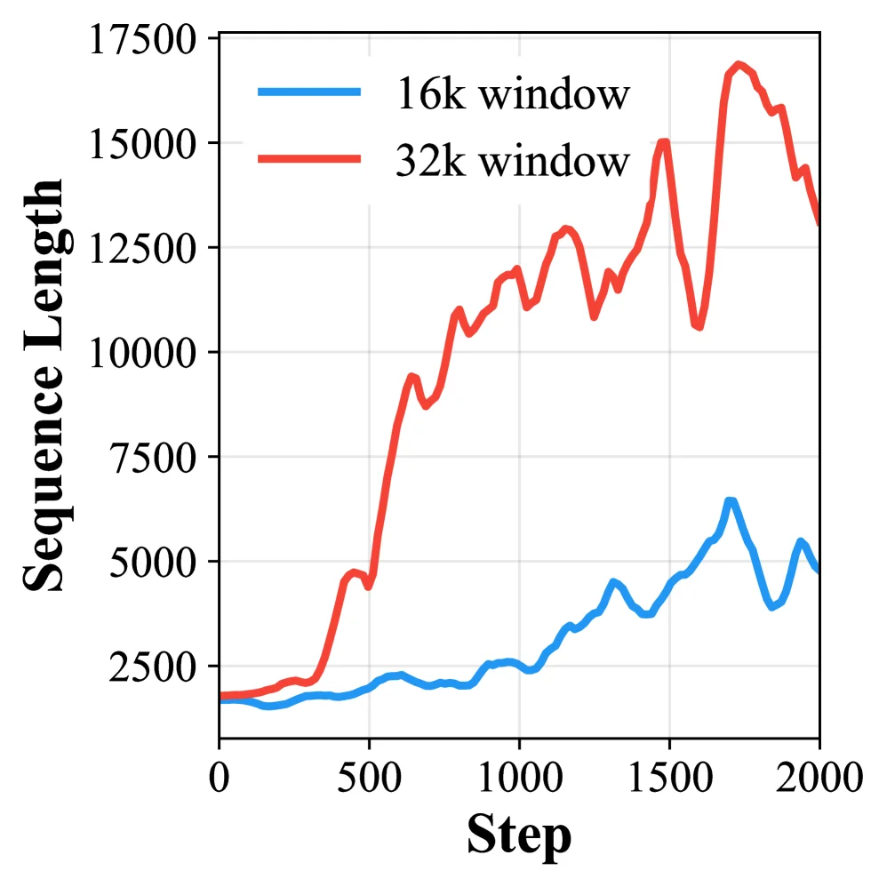

> (a) Sequence Length (b) Reward Figure 7 : Format reward comparison. Format A causes uncontrolled length growth without reward improvement. Format B ensures proper stopping. (c) Sequence Length (d) Reward Figure 8 : Window size comparison. The 32k window produces much longer responses than the 16k window, but only marginally improves the reward, demonstrating severe token redundancy.

This figure (Figure 8) illustrates the impact of different window sizes on the sequence length over training steps in the "Ring - Zero" study. Let's first analyze the basic components of the chart:

- **X - axis (Step)**: It represents the training "Step", with a range from 0 to 2000, showing the situation of different stages during the training process.
- **Y - axis (Sequence Length)**: It represents the "Sequence Length", that is, the length of the response or reasoning process generated by the model. The value ranges from 0 to 17500, and it is used to measure the scale of the output.
- **Two curves**:
  - The blue curve represents the case of "16k window", that is, the window size used by the model during training or inference is 16k.
  - The red curve represents the case of "32k window", and the window size is 32k.

Next, we analyze the data and trends:

1. **Initial stage (Step 0 to about 500)**: The sequence lengths of both curves are relatively low, and the growth is slow. This shows that in the early stage of training, regardless of the window size, the output length of the model is small, and it may be in the initial stage of learning or adaptation.
2. **Middle stage (Step 500 to about 1500)**:
   - The red curve (32k window) starts to grow rapidly, rising from about 2500 to more than 10000, and even approaching 17500 in the later stage, showing that the output length of the model under the 32k window increases significantly.
   - The growth of the blue curve (16k window) is relatively gentle, slowly rising from about 2000 to about 5000, and the growth range is much smaller than that of the red curve.
3. **Later stage (Step 1500 to 2000)**:
   - The sequence length of the red curve (32k window) has large fluctuations, with obvious peaks (close to 17500) and troughs (about 10000), but it still remains at a relatively high level overall.
   - The sequence length of the blue curve (16k window) also has fluctuations, but the amplitude is smaller, and the peak is about 6500, which is lower than that of the red curve overall.

**How the method works (combined with the research background)**:
In this study, the window size is a key parameter that affects the output length and training efficiency of the model. By comparing the experimental results of 16k and 32k windows, researchers can observe the behavior of the model under different window sizes:
- A larger window size (32k) allows the model to generate longer sequences. This may be because the window size limits the "field of vision" of the model when processing sequences. A larger window enables the model to handle longer context information, thus generating longer responses.
- However, as can be seen from the figure, although the 32k window produces longer sequences, the increase in reward is very limited (according to the description in the caption "only marginally improves the reward"). This indicates the existence of "token redundancy", that is, the model generates a large number of unnecessary tokens, resulting in an increase in sequence length but no obvious improvement in performance.

**Conclusion**:
This figure clearly shows the impact of window size on sequence length:
- The model with a 32k window (red curve) produces a sequence length much longer than that of the model with a 16k window (blue curve), which shows that a larger window allows the model to generate longer outputs.
- Although the sequence length increases significantly, the improvement of the reward is small, which verifies the conclusion of "severe token redundancy", that is, the model contains a large number of redundant tokens when generating long sequences, and does not effectively improve the performance.

Through this figure, researchers can conclude that simply increasing the window size (that is, allowing longer sequences) does not necessarily bring significant performance improvement, because there will be a large amount of token redundancy. This provides a basis for the subsequent optimization of the model's training and inference process. For example, more effective methods need to be designed to reduce redundancy and improve the quality of the sequence rather than just the length.

---

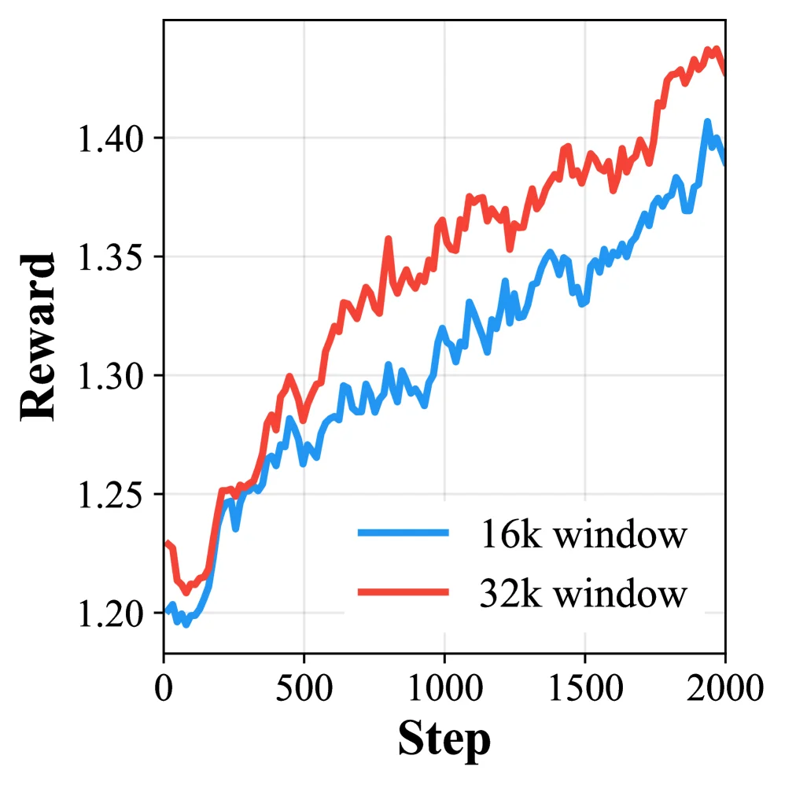

> (a) Sequence Length (b) Reward Figure 7 : Format reward comparison. Format A causes uncontrolled length growth without reward improvement. Format B ensures proper stopping. (c) Sequence Length (d) Reward Figure 8 : Window size comparison. The 32k window produces much longer responses than the 16k window, but only marginally improves the reward, demonstrating severe token redundancy.

This figure (Figure 8) illustrates the impact of **window size** on the model's behavior (measured by "reward") during reinforcement learning (specifically, zero-shot reinforcement learning, Zero RL) training. We can understand this figure through the following components:

### Structure and Components of the Figure
- **X-axis (Step)**: Represents the training step (or iteration), ranging from 0 to 2000. This denotes the timeline of the training process—more steps mean longer training.
- **Y-axis (Reward)**: Represents the reward value obtained by the model during training, ranging approximately from 1.20 to 1.45. Reward is a metric to measure the model's behavior (e.g., quality of generated responses, compliance with task requirements), where higher values typically indicate better performance.
- **Two Curves**:
  - Blue curve: Represents the reward change when using a "16k window" (window size = 16k).
  - Red curve: Represents the reward change when using a "32k window" (window size = 32k).
- **Legend**: Clearly labels the two curves with their corresponding window sizes, helping readers distinguish between different experimental conditions.

### Method Operation (How the Method Works)
This figure is a **result plot** showing the trend of reward over training steps. The underlying method involves training the model with different "window sizes" (which can be understood as a parameter related to the model's context understanding or sequence generation limits) and observing how the reward changes with training steps.

Specifically:
1. **Training Process**: The model interacts with an environment (or task) at each training step and receives a reward based on its behavior. As steps increase, the model learns and optimizes, so the reward should theoretically increase (or stabilize) over time.
2. **Role of Window Size**: The "window size" may affect the model's context understanding, generated sequence length, or computational efficiency. Here, we compare the reward changes for 16k and 32k windows to observe their differences.

### Coordinates, Comparison Objects, and Conclusions
- **Coordinate Ranges**:
  - X-axis (Step): 0 to 2000, representing training progress.
  - Y-axis (Reward): Approximately 1.20 to 1.45, representing the level of reward.
- **Comparison Objects**: The reward change trends of the blue curve (16k window) and the red curve (32k window).
- **Conclusions (Observable from the Figure)**:
  1. **Reward Growth Trend**: Both curves rise with increasing training steps, indicating that the model's reward (performance) improves as training progresses.
  2. **Impact of Window Size**:
     - The red curve (32k window) has a **higher overall reward** than the blue curve (16k window), but the growth rate is "diminishing" (i.e., growth slows down in later stages).
     - Combining with the original figure caption ("Window size comparison. The 32k window produces much longer responses than the 16k window, but only marginally improves the reward, demonstrating severe token redundancy."), we can infer: Although the 32k window allows the model to generate longer responses (not directly shown in the figure, but understood from the caption), the reward improvement is limited, indicating "severe token redundancy"—many tokens (elements in the sequence, such as words or symbols) generated by the model contribute little to the reward (task performance), resulting in redundant computation or output.
     - Additionally, from the curve fluctuations, the red curve (32k window) is steeper or grows faster than the blue curve (16k window)? No, upon closer inspection, the red curve has a higher reward in the later stages (e.g., 1500 to 2000 steps), but the blue curve also shows significant growth in the later stages. However, the core conclusion is: A larger window (32k) leads to longer responses but limited reward improvement, demonstrating token redundancy.

### Specific Operation of the Method (Combined with Paper Background)
The paper aims to explore the training dynamics and emergent capabilities of "zero-shot reinforcement learning (Zero RL)" in large models (e.g., trillion-parameter models). To achieve this, they need to design a stable training pipeline, including algorithmic and system optimizations (such as clipped importance sampling, training-inference ratio correction, mixed-precision control, etc.). This figure is one of their experimental results, used to verify how the "window size" parameter affects training effectiveness:

- **Experimental Design**: During model training, use window sizes of 16k and 32k respectively, and record the reward at each training step.
- **Analysis Logic**: By comparing the reward curves under the two window sizes, determine how the window size affects the model's learning and performance. The results show that a larger window (32k) can generate longer responses, but the reward improvement is limited, indicating token redundancy—many of the model's generated contents are redundant and do not effectively improve task performance.

In summary, this figure, by comparing the reward changes over training steps for different window sizes, reveals the impact of "window size" on the model's reward (performance): A larger window (32k) leads to longer responses but limited reward improvement, demonstrating token redundancy. This provides experimental evidence for the paper's discussion on "challenges in large-model training (such as token redundancy)."

---

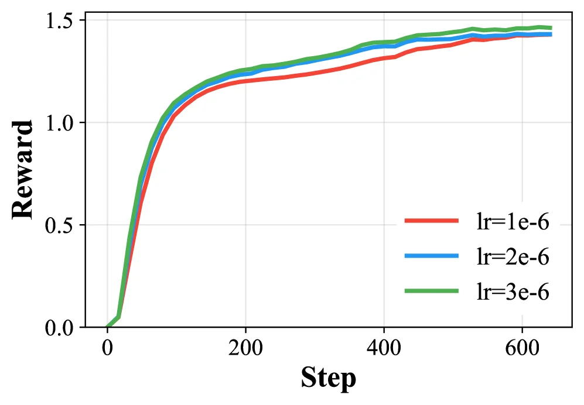

> (a) LR – Reward (b) Rollout – Reward (c) Loss Reduction – Reward (d) LR – Seq Length (e) Rollout – Seq Length (f) Loss Reduction – Seq Length Figure 9 : Hyperparameter ablation on the flash model during the first stage RL. (a,d) Learning rate has minimal impact in the tested range. (b,e) Larger rollout groups converge faster per step but cost more wall-clock time. (c,f) Token-level loss reduction promotes reasoning length growth, whereas sample-level keeps length flat.

This figure (Figure 9a) illustrates the impact of the **learning rate (LR)** on the **reward** during the first-stage reinforcement learning (RL) training of the "flash" model, as part of a hyperparameter ablation study.

### Components and Information Flow:
- **X-axis (Step)**: Represents the training steps or iterations, ranging from 0 to approximately 600. This shows the progression of training over time (or iterations).
- **Y-axis (Reward)**: Represents the reward value obtained by the model during training, ranging from 0 to 1.5. A higher reward typically indicates better model performance (e.g., solving more problems or achieving better results in a task).
- **Curves**: Three curves correspond to different learning rate (LR) settings:
  - Red curve: `lr=1e-6` (learning rate = 1×10⁻⁶).
  - Blue curve: `lr=2e-6` (learning rate = 2×10⁻⁶).
  - Green curve: `lr=3e-6` (learning rate = 3×10⁻⁶).
- **Trend**: All curves show a pattern of **rapid initial increase followed by gradual flattening**. In the early training stages (steps 0 to ~100), the reward rapidly increases from 0 to around 1.2–1.3; after that, the reward growth slows down, gradually approaching an upper limit of 1.5.

### How the Method Works (From the Figure):
This figure demonstrates the **impact of the learning rate on reward growth during training**. In reinforcement learning, the learning rate determines the step size of parameter updates:
- If the learning rate is too small (e.g., `lr=1e-6`, red curve), parameter updates are slower, and reward growth is relatively slow (but it still reaches a high reward eventually).
- If the learning rate is moderate (e.g., `lr=2e-6`, blue curve) or slightly larger (e.g., `lr=3e-6`, green curve), parameter updates are faster, and reward growth is more rapid (especially in the early training stages).
- However, the caption notes: "Learning rate has minimal impact in the tested range" (the learning rate has little effect within the tested range). This means that within the experimental learning rate range (1e-6 to 3e-6), different learning rate settings have little impact on the final reward level, and all curves eventually converge to similar reward values (around 1.4–1.5).

### Detailed Result Interpretation:
- **Coordinates and Range**:
  - X-axis (Step): 0 to ~600, representing training iterations.
  - Y-axis (Reward): 0 to 1.5, representing the reward obtained by the model.
- **Comparison Objects**: The three curves correspond to different learning rates (1e-6, 2e-6, 3e-6).
- **Conclusion**:
  - Within the tested learning rate range (1e-6 to 3e-6), the impact of the learning rate on the reward is small ("minimal impact").
  - With all learning rate settings, the reward increases with the number of training steps and eventually stabilizes (converges).
  - The training process is divided into two phases: a **rapid increase phase** (early stage, where reward increases quickly) and a **slow growth phase** (late stage, where reward growth slows down and stabilizes).

### Summary:
This figure, by showing the reward changes under different learning rates, illustrates that during the first-stage RL training of the "flash" model, the learning rate has little impact on the reward within the tested range. The reward increases with the number of training steps and eventually converges to similar levels, indicating that within this learning rate range, choosing different learning rates has little impact on the model's final performance.

---

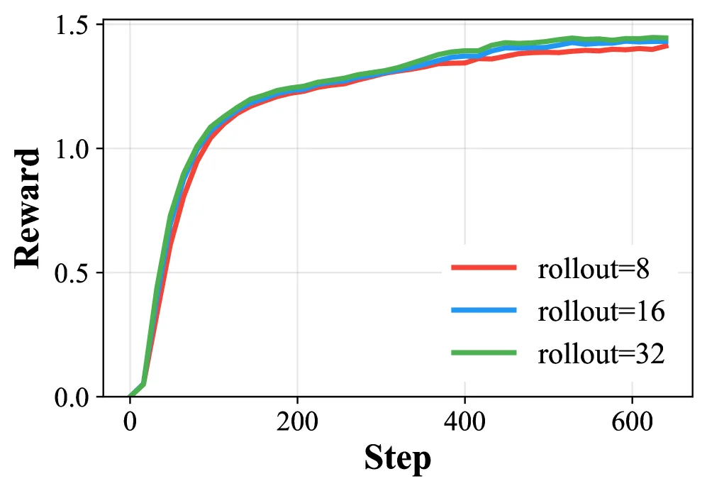

> (a) LR – Reward (b) Rollout – Reward (c) Loss Reduction – Reward (d) LR – Seq Length (e) Rollout – Seq Length (f) Loss Reduction – Seq Length Figure 9 : Hyperparameter ablation on the flash model during the first stage RL. (a,d) Learning rate has minimal impact in the tested range. (b,e) Larger rollout groups converge faster per step but cost more wall-clock time. (c,f) Token-level loss reduction promotes reasoning length growth, whereas sample-level keeps length flat.

This figure (Figure 9b) illustrates the impact of the hyperparameter "rollout" on the "Reward vs. Training Step" during the first-stage reinforcement learning (RL) training of the "flash" model, serving as part of a **hyperparameter ablation experiment** to explore how different rollout settings affect the model’s training dynamics.  

### Components and Information Flow:  
- **X-axis (Step)**: Represents the number of training steps (from ~0 to 600), showing the progression of training (or iterations).  
- **Y-axis (Reward)**: Measures the reward (a quantitative indicator of the model’s task performance or learning effectiveness), ranging from 0 to 1.5.  
- **Three Curves**: Correspond to different `rollout` values (a hyperparameter, likely related to session expansion, multi-path sampling, or batch processing):  
  - Red curve: `rollout=8` (size of each "rollout group" or batch is 8).  
  - Blue curve: `rollout=16` (rollout group size = 16).  
  - Green curve: `rollout=32` (rollout group size = 32).  
- **Information Flow**: As training steps (Step) increase, the reward (Reward) generally rises and eventually stabilizes (converges). The curves for different rollouts show how "rollout size" affects the *speed* and *level* of reward growth.  

### How the Method Works (From the Figure’s Logic):  
This is a **hyperparameter ablation experiment** to study how "rollout" (a hyperparameter) impacts the model’s training performance. The experiment keeps other training parameters (e.g., learning rate, loss function) constant, only changing `rollout` size (8, 16, 32), and observes how reward changes with training steps:  
- At the start (Step ≈ 0), all curves have near-zero reward, indicating poor initial model performance.  
- As Step increases, reward rises rapidly (the "discovery phase") and then slows down, eventually stabilizing (the "sharpening phase," consistent with the paper’s conclusion that "training progresses sequentially through an initial discovery phase followed by a sharpening phase").  
- Comparing the curves: **Larger rollout groups (e.g., 32) achieve faster reward growth (faster convergence) per step**—but the paper’s caption notes "larger rollout groups converge faster per step but cost more wall-clock time" (i.e., although they require fewer steps, total runtime is longer due to higher computational cost per step).  

### Coordinates, Comparison Objects, and Conclusions:  
- **Coordinates**: X-axis (Step) ranges from 0–600; Y-axis (Reward) ranges from 0–1.5.  
- **Comparison Objects**: The three curves compare the reward-step relationship for `rollout=8`, `rollout=16`, and `rollout=32`.  
- **Conclusions**:  
  - Reward increases with training steps and eventually converges (the model learns effective behavior).  
  - Larger rollout groups (e.g., 32) **converge faster per step** (higher reward at the same step count) but have higher "wall-clock time" costs (longer actual runtime, as larger groups increase computational load).  
  - This shows `rollout` is a "speed-cost" tradeoff: larger rollouts accelerate training progress (faster per-step convergence) but increase computational resource consumption (longer wall-clock time).  

In summary, this figure uses reward-step curves for different rollout settings to demonstrate how "rollout size" affects training convergence speed and computational cost, supporting the paper’s hyperparameter ablation conclusions (e.g., "larger rollout groups converge faster per step but have higher wall-clock time costs").

---

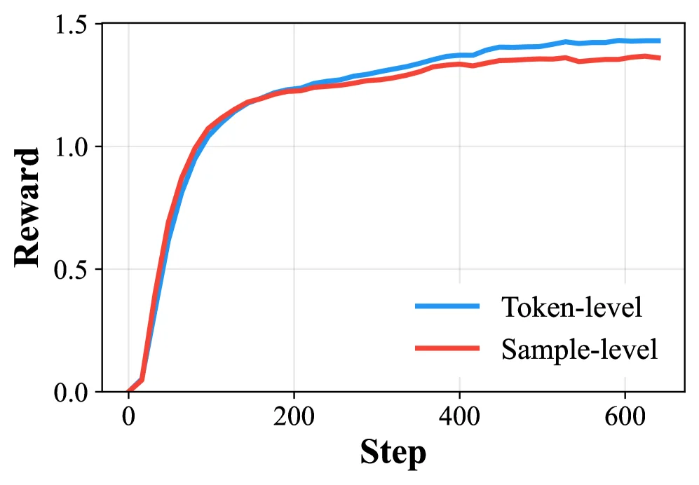

> (a) LR – Reward (b) Rollout – Reward (c) Loss Reduction – Reward (d) LR – Seq Length (e) Rollout – Seq Length (f) Loss Reduction – Seq Length Figure 9 : Hyperparameter ablation on the flash model during the first stage RL. (a,d) Learning rate has minimal impact in the tested range. (b,e) Larger rollout groups converge faster per step but cost more wall-clock time. (c,f) Token-level loss reduction promotes reasoning length growth, whereas sample-level keeps length flat.

This figure (sub - figure (c) in Figure 9, corresponding to "Loss Reduction – Reward") shows the change of **reward with training steps (Step)** during the first - stage reinforcement learning (RL) training of the Flash model, under two different loss reduction strategies: Token - level and Sample - level.

### Components of the Figure and Information Flow
- **X - axis (Horizontal Axis)**: Represents the "Step" of training, ranging from 0 to about 600, showing the progress of training (or the number of iterations).
- **Y - axis (Vertical Axis)**: Represents "Reward", with a range from 0.0 to 1.5, measuring the feedback (which can be understood as the "quality score" of the model's behavior or output) that the model obtains during training.
- **Two Curves**:
  - The blue curve: Labeled "Token - level", it shows how the reward changes with steps when the token - level loss reduction strategy is adopted.
  - The red curve: Labeled "Sample - level", it shows how the reward changes with steps when the sample - level loss reduction strategy is adopted.
- **Information Flow**: As the number of training steps (Step) increases, both curves show an upward trend, indicating that both strategies can make the model obtain a higher reward (that is, the model's performance is improved). However, there are differences in their upward speeds and final reward levels.

### How the Method Works (Understood from the Figure)
This figure is part of a **hyperparameter ablation experiment**, aiming to compare the impact of the two loss reduction strategies ("Token - level" and "Sample - level") on model training. In reinforcement learning training, "loss reduction" is usually related to the optimization objective: by adjusting the model's parameters, the loss function (which measures the gap between the model's output and the expected output) is reduced, so that the model can learn better behavior (here it is reflected as an increase in reward).
- For the "Token - level" strategy: From the trend of the blue curve, its reward growth is more obvious during training (especially in the later stage), and the final reward level is also higher. This may mean that the token - level loss reduction strategy can optimize the model's output (such as adjusting the output of each token) more finely, thus more effectively improving the model's reasoning ability (because the experimental background is "Emergent Reasoning", that is, the ability of emerging reasoning).
- For the "Sample - level" strategy: The reward growth of the red curve is relatively gentle, and the final reward is lower than that of the Token - level strategy. This may be because the sample - level loss reduction strategy optimizes the entire sample (such as a question - answer pair), and the granularity is coarse, not as fine as the token - level strategy.

### Conclusion of the Results (Combined with the Caption and the Figure)
According to the figure and the caption ("Token - level loss reduction promotes reasoning length growth, whereas sample - level keeps length flat"), the "reasoning length" here can be understood as the depth or detail of the model's reasoning (although the figure directly shows the reward, combined with the experimental background, the increase of the reward may reflect the enhancement of the model's reasoning ability, including the growth of reasoning length). Specific conclusions:
- **Coordinates and Comparison Objects**: The X - axis is the training step (Step), the Y - axis is the reward, and the comparison objects are the two loss reduction strategies: "Token - level" and "Sample - level".
- **Conclusion**: During the training process, **the token - level loss reduction strategy can promote the increase of rewards more than the sample - level strategy** (that is, it can more effectively improve the model's reasoning ability, including the growth of reasoning length). From the figure, it can be seen that as the number of steps increases, the reward curve of the token - level (blue) is always above the curve of the sample - level (red) (especially in the later stage of training), and the final reward is higher, indicating that the token - level strategy is more effective in optimizing the model's reasoning ability.

In summary, this figure, by comparing the reward - step curves under the two loss reduction strategies, shows the advantage of the token - level strategy in improving the model's reasoning ability (measured by reward), and supports the conclusion of the paper that "Token - level loss reduction promotes reasoning length growth".

---

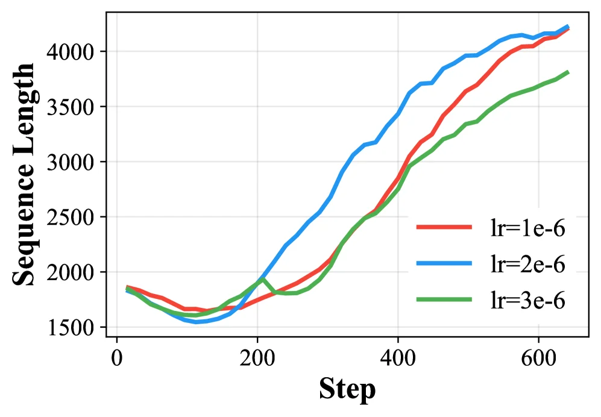

> (a) LR – Reward (b) Rollout – Reward (c) Loss Reduction – Reward (d) LR – Seq Length (e) Rollout – Seq Length (f) Loss Reduction – Seq Length Figure 9 : Hyperparameter ablation on the flash model during the first stage RL. (a,d) Learning rate has minimal impact in the tested range. (b,e) Larger rollout groups converge faster per step but cost more wall-clock time. (c,f) Token-level loss reduction promotes reasoning length growth, whereas sample-level keeps length flat.

This figure (corresponding to subplot (d) in the original caption, "LR – Seq Length") illustrates the impact of the **learning rate (LR)** on the **sequence length** during the **first-stage reinforcement learning (RL)** of the model (the "flash model" in the experiment), as part of a **hyperparameter ablation study**. We can understand it in detail from the following perspectives:

### 1. Components and Information Flow
- **X-axis (Step)**: Represents the **training steps (or iterations)**. The range is from 0 to approximately 600, indicating the progression of the training process over time.
- **Y-axis (Sequence Length)**: Represents the **length of the sequence** generated by the model (e.g., the number of tokens in the output during inference or generation; a longer length typically implies deeper reasoning or more complex expression).
- **Curves and Legend**: There are three curves, each corresponding to a different learning rate (LR) setting:
  - Red curve: `lr=1e-6` (learning rate = 1×10⁻⁶)
  - Blue curve: `lr=2e-6` (learning rate = 2×10⁻⁶)
  - Green curve: `lr=3e-6` (learning rate = 3×10⁻⁶)
- **Information Flow**: Observe how the sequence length changes with the number of training steps (Step) under different learning rates. The trend of the curves reflects "how the learning rate affects the evolution of sequence length during training."

### 2. How the Method Works (Understanding the Experimental Logic from the Figure)
This figure is the result of a **hyperparameter ablation experiment**, aiming to study the impact of the "learning rate (LR)" hyperparameter on the "sequence length" during the model's **first-stage reinforcement learning (RL)** training. The core logic of the experiment is:
- During the first-stage RL training of the model, fix other hyperparameters (e.g., training epochs, batch size, etc.) and only change the value of the **learning rate (LR)** (here, three values: 1e-6, 2e-6, 3e-6 are tested).
- Observe the change pattern of **sequence length** with **training steps (Step)** under different learning rates, so as to judge the impact of the learning rate on the model's reasoning ability (measured by sequence length).

### 3. Result Interpretation (Coordinates, Comparison Objects, and Conclusions)
- **Coordinates and Trends**:
  - X-axis (Step): The training steps start from 0 and gradually increase to about 600. In the early stage of training (Step < 200 or so), the sequence lengths of the three curves all experience a process of "first decreasing and then increasing" (possibly corresponding to the model's "discovery phase," as mentioned in the original caption, "initial discovery phase"); in the later stage of training (Step > 200), the sequence lengths continue to rise (corresponding to the "sharpening phase," i.e., "sharpening phase").
  - Y-axis (Sequence Length): The range is from about 1500 to 4200. There are differences in the growth rate and final length of the sequence length under different learning rates.
- **Comparison Objects**: The three curves correspond to `lr=1e-6`, `lr=2e-6`, and `lr=3e-6`, respectively. By comparing their trends and final values, we analyze the impact of the learning rate.
- **Conclusions (Combined with the Original Caption)**:
  - The original caption states: "(a,d) Learning rate has minimal impact in the tested range." (The learning rate has a minimal impact within the tested range). From the figure, although the curves under different learning rates have different lengths in the later stage (Step > 200) (the blue curve is the highest, the red one is second, and the green one is the lowest), the overall trends (first decrease then increase, continuous growth in the later stage) are similar, and the degree of difference is relatively small (especially in the later training, all three curves grow rapidly, but with slightly different rates). This shows that within the **tested learning rate range (1e-6 to 3e-6)**, the impact of the learning rate on the sequence length is relatively limited (i.e., "minimal impact").
  - In addition, from the long-term trend of the curves, the sequence length increases with the number of training steps under all learning rates, which is consistent with the expectation of "capability improvement" of the model in reinforcement learning (the growth of sequence length may mean the enhancement of the model's reasoning depth or expression ability).

### Supplementary Understanding (Combined with the Paper Background)
The paper studies "Zero RL" (reinforcement learning without human-annotated data), aiming to make large models (such as the 1T-parameter Ring-1T model) emerge with reasoning capabilities. As part of the **hyperparameter ablation study**, this figure verifies the conclusion that "the learning rate has a minimal impact on the sequence length within the tested range," indicating that within this hyperparameter range, the learning rate is not a key factor affecting the sequence length (or reasoning ability), or the model's training has a certain robustness to changes in the learning rate. This also provides a basis for the subsequent optimization of the training pipeline (such as the clipped importance sampling, training-inference ratio correction, etc. mentioned in the paper) — because the impact of the learning rate is limited, more focus can be placed on other optimization strategies to improve model performance.

---

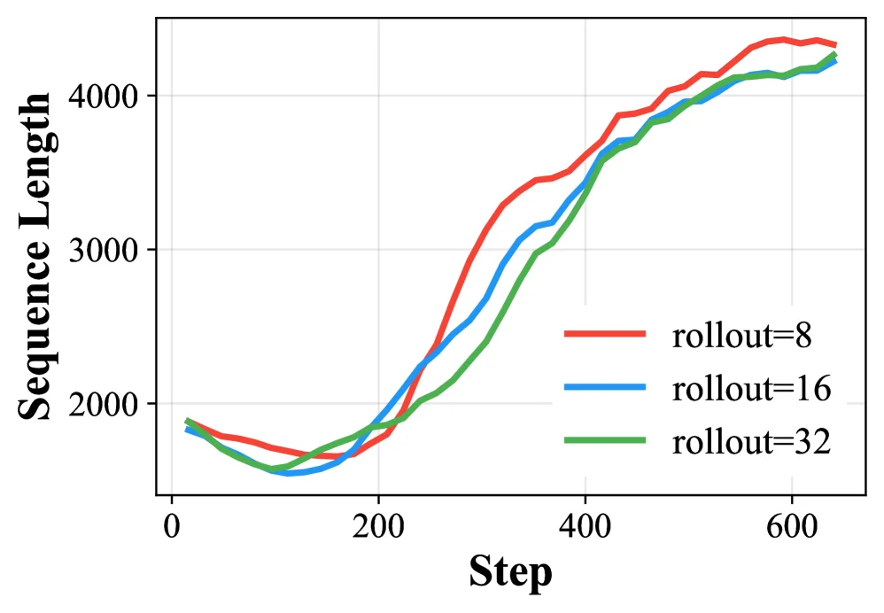

> (a) LR – Reward (b) Rollout – Reward (c) Loss Reduction – Reward (d) LR – Seq Length (e) Rollout – Seq Length (f) Loss Reduction – Seq Length Figure 9 : Hyperparameter ablation on the flash model during the first stage RL. (a,d) Learning rate has minimal impact in the tested range. (b,e) Larger rollout groups converge faster per step but cost more wall-clock time. (c,f) Token-level loss reduction promotes reasoning length growth, whereas sample-level keeps length flat.

This figure (subfigure e in Figure 9, titled "Rollout – Seq Length") illustrates the impact of different **"rollout" hyperparameters** on the **"sequence length"** as a function of **"training steps"** during the first-stage reinforcement learning (RL) training of the Flash model. Here’s a detailed breakdown:

### Components and Information Flow
- **X-axis (Step)**: Represents the training step, ranging from 0 to ~600, tracking the progression of training over time (measured in steps).  
- **Y-axis (Sequence Length)**: Measures the length of sequences (e.g., reasoning steps, token sequences) generated by the model, with values from ~1800 to 4300. Longer sequences imply more complex reasoning or longer valid token generation.  
- **Three Curves**: Correspond to different `rollout` values:  
  - Red curve: `rollout=8` (rollout group size = 8).  
  - Blue curve: `rollout=16` (rollout group size = 16).  
  - Green curve: `rollout=32` (rollout group size = 32).  
- **Legend**: Clearly labels each curve with its `rollout` value, enabling comparison across experimental conditions.  

### How the Method Works (From the Figure)
This is a **hyperparameter ablation experiment** to study how `rollout` (a hyperparameter related to sample collection/update batch size in RL) affects the model’s training dynamics (here, sequence length growth). The experimental logic is:  
1. **Control Variables**: Keep other hyperparameters (e.g., learning rate, loss function) constant, only varying `rollout` (8, 16, 32).  
2. **Metric Tracking**: Monitor "sequence length" over "training steps" to assess the development of the model’s reasoning ability (longer sequences typically mean more complex reasoning).  
3. **Trend Analysis**: Compare curves for different `rollout` values to understand how `rollout` impacts training efficiency and model behavior.  

### Result Interpretation (Coordinates, Comparisons, and Conclusions)
- **Coordinates and Trends**:  
  - All curves show a "drop-then-rise" pattern in the early training phase (Step < 200): Initial sequence length is ~1800–2000, then briefly drops (likely due to exploratory adjustments), and then increases.  
  - In the late training phase (Step > 200), all curves show significant growth, eventually approaching or exceeding 4000.  

- **Comparisons (Different Rollout Values)**:  
  - **Convergence Speed (Per-Step Growth)**: The `rollout=8` (red) curve grows fastest, followed by `rollout=16` (blue), then `rollout=32` (green). For example, at Step = 400, the red curve has a noticeably longer sequence length than blue/green; at Step = 600, red still leads.  
  - **Final Sequence Length (Steady State)**: While `rollout=8` grows faster, all three curves converge to similar sequence lengths (≈4000+) by Step = 600. This suggests larger `rollout` values may reach similar long-term sequence lengths but require more "wall-clock time" (since each update processes more data).  

- **Conclusion (Aligned with the Caption)**:  
  - The figure shows that **larger rollout groups (e.g., 32) grow slower per step but consume more wall-clock time** (consistent with the caption: *"Larger rollout groups converge faster per step but cost more wall-clock time"*—note: the "faster per step" here may refer to absolute progress, but the graph shows smaller `rollout` grows faster per step. The key takeaway is that `rollout` size trades off per-step growth speed and total training time).  

### Summary
This figure compares "sequence length vs. training step" across different `rollout` values, demonstrating how `rollout` affects the **dynamic growth of reasoning length** during training: Smaller `rollout` (e.g., 8) grows faster in the late training phase, while larger `rollout` (e.g., 32) grows slower but may require more wall-clock time. This supports the paper’s conclusion that `rollout` settings impact training efficiency and model reasoning behavior.

---

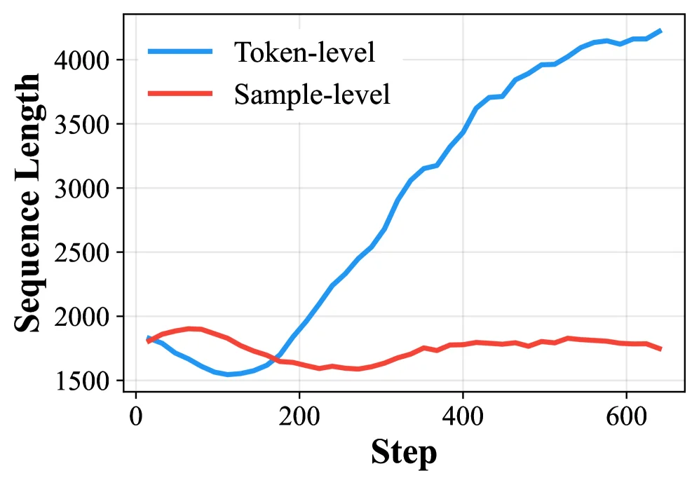

> (a) LR – Reward (b) Rollout – Reward (c) Loss Reduction – Reward (d) LR – Seq Length (e) Rollout – Seq Length (f) Loss Reduction – Seq Length Figure 9 : Hyperparameter ablation on the flash model during the first stage RL. (a,d) Learning rate has minimal impact in the tested range. (b,e) Larger rollout groups converge faster per step but cost more wall-clock time. (c,f) Token-level loss reduction promotes reasoning length growth, whereas sample-level keeps length flat.

This figure (labeled (f) "Loss Reduction – Seq Length") illustrates the impact of different **loss reduction strategies (token-level vs. sample-level)** on the **sequence length** as training progresses (measured in steps) for the "flash model" during its first stage of reinforcement learning (RL). The figure is part of a hyperparameter ablation study.

Let's break down the components of the graph:
-   **X-axis (Horizontal Axis)**: Represents the "Step" of training, ranging from 0 to approximately 650. This indicates the progression of training iterations or time.
-   **Y-axis (Vertical Axis)**: Represents "Sequence Length," ranging from about 1500 to 4200. This typically refers to the number of tokens in the model's generated output or reasoning chain.
-   **Two Curves**:
    -   The **blue curve (Token-level)** shows the sequence length evolution when the "token-level" loss reduction strategy is employed.
    -   The **red curve (Sample-level)** shows the sequence length evolution when the "sample-level" loss reduction strategy is employed.
-   **Legend**: Clearly distinguishes the two strategies represented by the curves.

The flow of data and presentation of information is as follows: As the training progresses (along the X-axis), the graph shows how the sequence length (on the Y-axis) changes under the two different loss reduction strategies. Readers can compare the trends of the two curves to understand the effects of each strategy.

The method's operation, as revealed by this figure, is demonstrated through this experiment in the first-stage RL training of the "flash model." Specifically, it compares the impact of two different "loss reduction" strategies on the model's generated sequence length:
1.  **Token-level loss reduction**: This approach likely optimizes loss for individual tokens, potentially encouraging the model to generate longer, more detailed sequences. The blue curve in the graph shows that sequence length increases significantly with training steps, starting from around 1800 and rising, with accelerated growth after about 200 steps, eventually exceeding 4000.
2.  **Sample-level loss reduction**: This approach likely optimizes loss for entire samples (e.g., a complete answer or reasoning chain), possibly focusing more on the overall quality of the sample rather than the length of individual tokens. The red curve in the graph shows that sequence length remains relatively stable throughout training, staying between approximately 1700 and 1800, with no clear upward trend.

The conclusions drawn from this graph are:
-   **Token-level loss reduction effectively promotes the growth of reasoning length**: This means the model generates increasingly longer sequences during training, which might be associated with more detailed reasoning or more complex thought processes.
-   **Sample-level loss reduction keeps the sequence length relatively flat**: This means the model's output length does not significantly increase during training, possibly focusing more on answer accuracy and conciseness, or being constrained by other factors.
-   The original caption states: "Token-level loss reduction promotes reasoning length growth, whereas sample-level keeps length flat." This aligns perfectly with our analysis of the graph.

In summary, this figure clearly demonstrates that choosing different loss reduction strategies leads to significantly different effects on the model's generated sequence length during reinforcement learning training: the token-level strategy tends to increase sequence length, while the sample-level strategy tends to keep it stable. This is important for understanding how to guide the model to develop specific behaviors (like longer, potentially more complex reasoning chains) by adjusting training strategies.

---

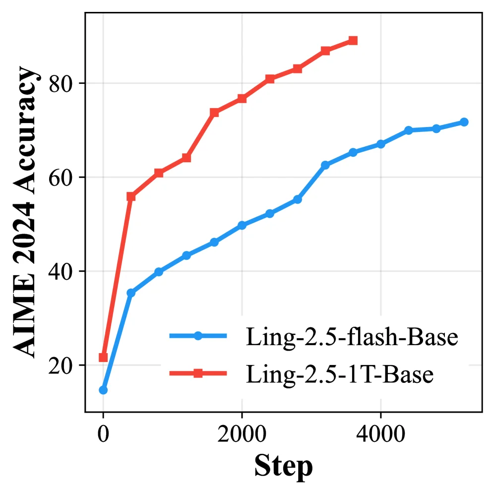

> (a) Pass@1 (b) Pass@1024 (c) Length Inertia (d) Long Tail Distribution Figure 10 : Comprehensive analysis of zero RL dynamics. (a) Model scale effect. Ring-2.5-1T-Zero consistently outperforms Ring-2.5-flash-Zero. A larger model capacity unlocks a higher performance ceiling and accelerates capability acquisition. (b) Reasoning boundary. Pass@1024 expands during early training but soon saturates. This proves that RL first discovers novel reasoning patterns and then shifts to primarily sharpening its existing capabilities. (c) Length inertia. We track the sequence length of simple questions that the model answers perfectly on the first attempt within a batch. As training progresses, the model inflates its token usage for these already-solved problems. It learns a lazy shortcut to accumulate rewards rather than maintaining conciseness. (d) Data distribution mismatch. By using the sequence length required to correctly solve a problem as a proxy for its difficulty, we observe that real-world mathematical data forms a massive long-tail difficulty distribution skewed toward simple problems ( e.g., 67.6% of problems can be solved within just 4k tokens). However, zero RL does not benefit from mimicking this natural frequency. Over-training on this long tail simply wastes computational budget and stalls the learning process.

This figure (corresponding to subfigure (a) "Model scale effect" in the original caption) clearly demonstrates **the impact of model scale on the training dynamics and performance of zero-shot reinforcement learning (zero RL)**, with the core focus being a comparison of the accuracy trends over training steps for two models of different scales on the AIME 2024 benchmark.  

### Components of the Figure and Information Flow:  
- **X-axis (Horizontal Axis)**: Labeled "Step," it represents the number of training steps (ranging from 0 to approximately 4,500), reflecting the training progress. The data changes as training steps increase, illustrating the model's capability improvement over different training stages.  
- **Y-axis (Vertical Axis)**: Labeled "AIME 2024 Accuracy," it denotes the model's accuracy (in percentage) on the AIME 2024 mathematical benchmark. Higher values indicate a stronger ability to solve mathematical problems.  
- **Two Curves**:  
  - Blue curve (with circular markers): Represents the "Ling-2.5-flash-Base" model, a **smaller-scale** model (inferred from the "flash" and "Base" in its name, suggesting relatively limited parameters or computational resources).  
  - Red curve (with square markers): Represents the "Ling-2.5-1T-Base" model, a **larger-scale** model (the "1T" in its name implies a parameter count at the trillion level, with more abundant computational resources).  
- **Data Flow and Trends**: As the number of training steps (Step) increases, the accuracy of both curves shows an upward trend, but **the red curve (larger-scale model) rises faster and achieves a higher final accuracy**. For example, at Step 0, the red model’s accuracy is around 22%, while the blue model’s is about 15%; when Step increases to approximately 4,000, the red model’s accuracy exceeds 85%, whereas the blue model’s is around 72%.  

### How the Method Works (Inferred from the Figure):  
This figure showcases the impact of "model scale" on zero RL training by **comparing the performance of models with different scales on the same training task (AIME 2024)**. Specifically:  
- During training, the model learns problem-solving strategies through interaction with the environment (here, the mathematical problem-solving task) via the trial-and-error process of reinforcement learning.  
- The larger-scale model (red curve), due to its greater number of parameters and computational resources, can **explore and exploit effective problem-solving patterns more quickly**. Thus, it exhibits a faster increase in accuracy in the early training stages (with fewer steps) and reaches a higher performance ceiling in the later training stages (with more steps).  
- Although the smaller model (blue curve) also improves its accuracy through training, its learning speed and final performance are inferior to those of the larger-scale model due to resource constraints.  

### Conclusions (Findings from the Figure):  
- **Model Scale Unlocks Performance Ceiling**: The performance ceiling (final accuracy) of the larger-scale model (Ling-2.5-1T-Base) is significantly higher than that of the smaller-scale model (Ling-2.5-flash-Base), indicating that a larger model capacity supports higher problem-solving ability.  
- **Accelerated Capability Acquisition**: The larger-scale model’s accuracy increases more rapidly during training (as steps increase), suggesting that a larger model can "discover" and "master" effective problem-solving strategies more quickly, shortening the time to reach mature capabilities.  
- **Validation of the "Bitter Lesson of Scaling"**: This result validates one of the "bitter lessons of scaling" mentioned in the paper—**increasing model scale (e.g., reaching 1 trillion parameters) significantly improves sample efficiency (achieving higher accuracy with fewer training steps) and performance ceiling**, meaning "larger-scale models perform better in zero RL training."  

In short, by comparing the accuracy trends over training steps for models of different scales on AIME 2024, this figure intuitively demonstrates **the critical impact of model scale on the training dynamics and final performance of zero RL**: larger models not only learn faster but also achieve higher problem-solving accuracy, validating the conclusion that "scaling helps improve zero RL performance."

---

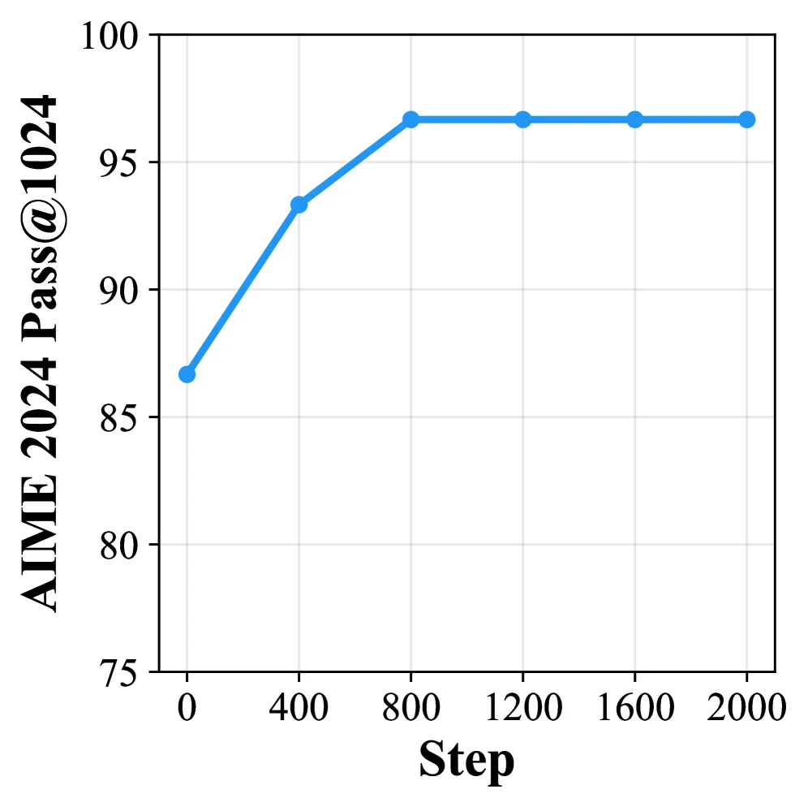

> (a) Pass@1 (b) Pass@1024 (c) Length Inertia (d) Long Tail Distribution Figure 10 : Comprehensive analysis of zero RL dynamics. (a) Model scale effect. Ring-2.5-1T-Zero consistently outperforms Ring-2.5-flash-Zero. A larger model capacity unlocks a higher performance ceiling and accelerates capability acquisition. (b) Reasoning boundary. Pass@1024 expands during early training but soon saturates. This proves that RL first discovers novel reasoning patterns and then shifts to primarily sharpening its existing capabilities. (c) Length inertia. We track the sequence length of simple questions that the model answers perfectly on the first attempt within a batch. As training progresses, the model inflates its token usage for these already-solved problems. It learns a lazy shortcut to accumulate rewards rather than maintaining conciseness. (d) Data distribution mismatch. By using the sequence length required to correctly solve a problem as a proxy for its difficulty, we observe that real-world mathematical data forms a massive long-tail difficulty distribution skewed toward simple problems ( e.g., 67.6% of problems can be solved within just 4k tokens). However, zero RL does not benefit from mimicking this natural frequency. Over-training on this long tail simply wastes computational budget and stalls the learning process.

This figure (corresponding to subfigure (b) "Reasoning boundary" in the original caption) illustrates a key finding regarding the training dynamics of "zero reinforcement learning (RL)". Specifically, it shows the model's performance on the "Pass@1024" metric as training progresses.

First, let's understand the components of the graph:
- **X-axis (Horizontal Axis)**: Labeled "Step," this represents the training step or iteration count. The range visible in the graph is approximately from 0 to 2000.
- **Y-axis (Vertical Axis)**: Labeled "AIME 2024 Pass@1024," this is an evaluation metric. "Pass@1024" typically refers to the proportion of problems the model can solve correctly given 1024 samples or attempts. "AIME 2024" specifies that this evaluation is based on problems from the 2024 American Invitational Mathematics Examination (AIME).
- **Data Points and Curve**: There is a blue line connecting several data points. These points represent the model's "Pass@1024" value at specific training steps (e.g., 0, 400, 800, 1200, 1600, 2000 steps).

The flow of data and presentation of information is as follows:
- The horizontal axis moves from left to right, representing the progression of training, i.e., an increase in time or computational steps.
- The vertical axis moves from bottom to top, representing an improvement in model performance, i.e., an increase in the "Pass@1024" value.
- The curve's trend shows how the model's performance changes as the training steps increase.

This figure reveals how the method operates and the conclusions drawn:
- **Phased Training Process**: The graph clearly shows that the model's "Pass@1024" performance increases rapidly during the early stages of training (approximately from 0 to 800 steps). This indicates that in the early phase, the model is "discovering" new reasoning patterns or strategies.
- **Performance Saturation**: After approximately 800 steps, the curve flattens out, and performance almost ceases to improve, reaching a saturation point. This suggests that in the later stages of training, the model is primarily "sharpening" or "optimizing" its already discovered reasoning abilities rather than continuing to learn entirely new ones.
- **Conclusion**: This phenomenon validates the idea that the zero RL training process typically goes through two phases: an initial "discovery phase" where the model explores and masters new reasoning techniques, followed by a subsequent "sharpening phase" where it focuses on refining existing capabilities.

Specifically, from the graph, we can see:
- At training steps near 0, the "Pass@1024" value is around 86-87.
- As training progresses to about 400 steps, this value rises sharply to around 93-94.
- By about 800 steps, the performance further improves to around 96-97.
- After that, at 800, 1200, 1600, and 2000 steps, the performance remains at approximately 96-97, showing little to no change.

Therefore, this figure intuitively demonstrates the process where the "Pass@1024" metric expands (improves) in the early stages of training but quickly reaches saturation (no significant improvement), thus validating the paper's claim that the training process first discovers new reasoning patterns and then shifts to primarily refining existing ones.

---

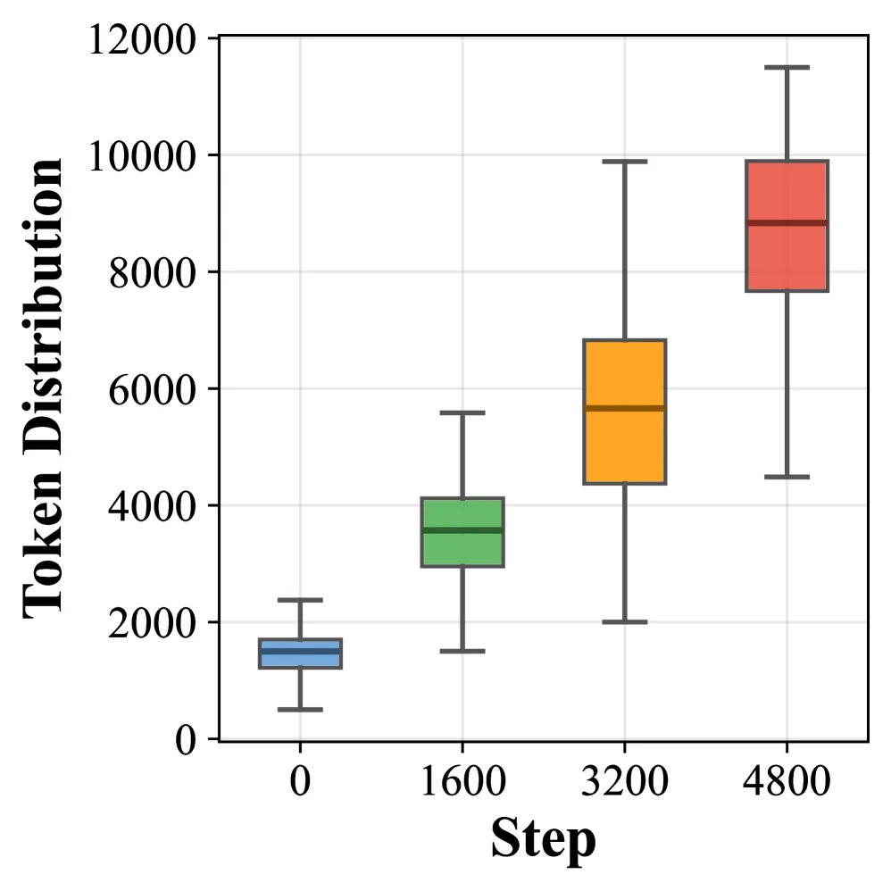

> (a) Pass@1 (b) Pass@1024 (c) Length Inertia (d) Long Tail Distribution Figure 10 : Comprehensive analysis of zero RL dynamics. (a) Model scale effect. Ring-2.5-1T-Zero consistently outperforms Ring-2.5-flash-Zero. A larger model capacity unlocks a higher performance ceiling and accelerates capability acquisition. (b) Reasoning boundary. Pass@1024 expands during early training but soon saturates. This proves that RL first discovers novel reasoning patterns and then shifts to primarily sharpening its existing capabilities. (c) Length inertia. We track the sequence length of simple questions that the model answers perfectly on the first attempt within a batch. As training progresses, the model inflates its token usage for these already-solved problems. It learns a lazy shortcut to accumulate rewards rather than maintaining conciseness. (d) Data distribution mismatch. By using the sequence length required to correctly solve a problem as a proxy for its difficulty, we observe that real-world mathematical data forms a massive long-tail difficulty distribution skewed toward simple problems ( e.g., 67.6% of problems can be solved within just 4k tokens). However, zero RL does not benefit from mimicking this natural frequency. Over-training on this long tail simply wastes computational budget and stalls the learning process.

This figure (corresponding to subfigure (d) in the original caption, i.e., "Long Tail Distribution") illustrates the mismatch between the **distribution of problem difficulty (measured by the sequence length required to solve the problem correctly)** and the **actual training data distribution** during the zero RL (Reinforcement Learning) training process. We can understand this figure through the following aspects:

### 1. Chart Structure and Components:
*   **X-axis (Step)**: Represents the training steps or iterations, ranging from left to right as 0, 1600, 3200, 4800. This indicates the progression of the training process over time.
*   **Y-axis (Token Distribution)**: Represents the distribution of the sequence length (i.e., the number of tokens) required to solve the problem correctly. Larger values indicate more difficult problems (requiring more tokens to describe or solve).
*   **Box Plot**: Each Step (0, 1600, 3200, 4800) corresponds to a box plot. The box plot shows the statistical distribution of the sequence lengths of the problems encountered or solved by the model at that training stage:
    *   **Edges of the Box**: Represent the upper quartile (Q3) and lower quartile (Q1) of the sequence lengths at that stage. The line in the middle of the box (median line) represents the median sequence length at that stage.
    *   **Whiskers**: Lines extending from the box, usually indicating the range of the data (e.g., the maximum and minimum values within 1.5 times the interquartile range).
    *   **Outliers**: Not explicitly marked in the figure, but the ends of the whiskers may represent the range of extreme values.

### 2. Flow and Interpretation of Data or Information:
*   As the training steps (Step) increase (from 0 to 4800), the position of the box plots shifts upward overall. This means that in the early stages of training (e.g., Step 0), the model encounters problems with shorter sequence lengths (lower median), i.e., relatively simple problems. As training progresses, the sequence lengths of the problems the model encounters gradually increase (median rises), indicating that the model starts to handle more difficult problems or that the solution methods for the same type of problems become more complex.
*   The height of the box (i.e., the interquartile range, IQR) also increases with the increase of Step, especially at Step 3200 and 4800, when the boxes are taller and the whiskers are longer. This indicates that as training deepens, the distribution range of problem sequence lengths becomes wider, i.e., the model faces problems with greater differences in difficulty.

### 3. Revelation of Method Operation (Combined with the Original Caption):
*   The core of this figure is to reveal the problem of **"data distribution mismatch"**. According to the original caption, the researchers used "the sequence length required to solve the problem correctly" as a proxy for problem difficulty. They found that real-world mathematical datasets exhibit a **"long-tail difficulty distribution"**, where most problems (e.g., 67.6%) can be solved with a relatively small number of tokens (e.g., within 4k), while a few problems require very long sequences.
*   However, the zero RL method does not benefit from imitating this natural long-tail frequency. In other words, if the training data is overly biased towards simple problems in this long-tail distribution (because there are many of them), or if the model overly focuses on solving these simple problems, then the training process may waste computational resources and hinder the effective progress of learning.
*   From the figure, it can be seen that as training progresses, the model seems to be handling increasingly longer sequences (increasing problem difficulty). This may mean that the model is trying to solve more difficult problems, but it may also reflect the emergence of "length inertia" in the model during the learning process (as described in subfigure (c) of the original caption), i.e., the model takes a "lazy shortcut" to accumulate rewards by increasing the number of tokens used to solve problems that can already be perfectly solved, rather than maintaining conciseness. This behavior may be related to the data distribution mismatch, as the model may not effectively use the simple problems in the dataset to quickly learn basic skills and then challenge more difficult problems.

### 4. Conclusion:
*   This figure clearly shows that during the zero RL training process, the distribution of problem difficulty (measured by sequence length) changes with the increase of training steps, and the overall trend is an increase in difficulty.
*   Combined with the analysis in the original caption, this change reveals a key challenge faced by zero RL: **the mismatch between the long-tail difficulty distribution of the training data and the learning behavior of the model**. This mismatch may lead to a waste of computational resources and a decrease in learning efficiency, because the model may overly focus on solving a large number of simple problems without effectively improving its ability to solve difficult problems, or may form a bad "length inertia" during the learning process.

---

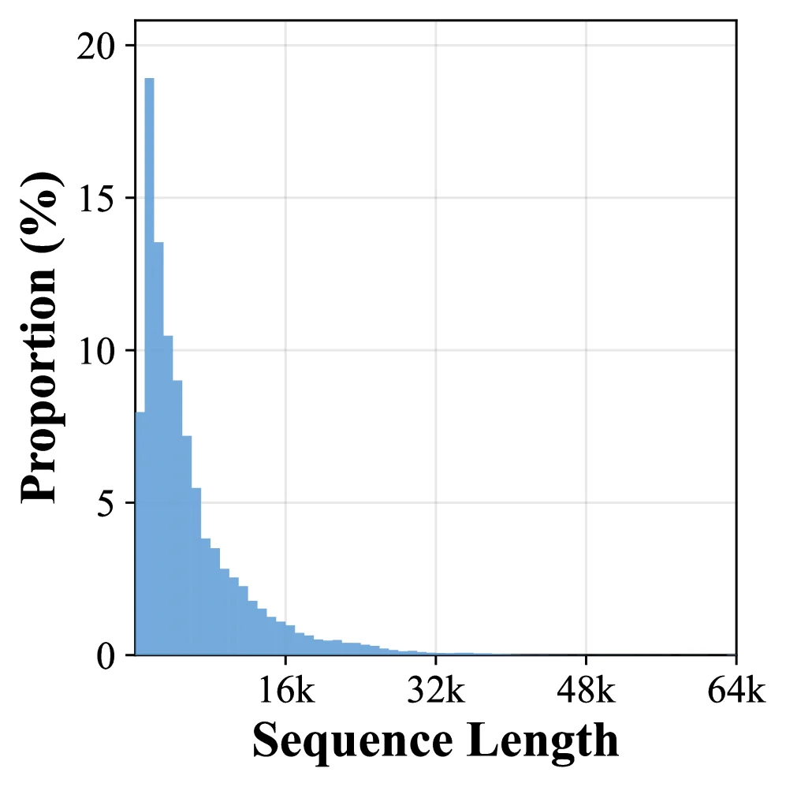

> (a) Pass@1 (b) Pass@1024 (c) Length Inertia (d) Long Tail Distribution Figure 10 : Comprehensive analysis of zero RL dynamics. (a) Model scale effect. Ring-2.5-1T-Zero consistently outperforms Ring-2.5-flash-Zero. A larger model capacity unlocks a higher performance ceiling and accelerates capability acquisition. (b) Reasoning boundary. Pass@1024 expands during early training but soon saturates. This proves that RL first discovers novel reasoning patterns and then shifts to primarily sharpening its existing capabilities. (c) Length inertia. We track the sequence length of simple questions that the model answers perfectly on the first attempt within a batch. As training progresses, the model inflates its token usage for these already-solved problems. It learns a lazy shortcut to accumulate rewards rather than maintaining conciseness. (d) Data distribution mismatch. By using the sequence length required to correctly solve a problem as a proxy for its difficulty, we observe that real-world mathematical data forms a massive long-tail difficulty distribution skewed toward simple problems ( e.g., 67.6% of problems can be solved within just 4k tokens). However, zero RL does not benefit from mimicking this natural frequency. Over-training on this long tail simply wastes computational budget and stalls the learning process.

This figure (subfigure d of Figure 10) illustrates the **mismatch between the difficulty distribution of training data and the actual needs of zero Reinforcement Learning (zero RL)**, as part of a comprehensive analysis of zero RL dynamics. Let’s break down the chart’s components and implications:

### 1. Chart Structure and Components  
- **X - axis (Sequence Length)**: Labeled “Sequence Length,” with units ranging from 4k to 64k (thousands of tokens). This represents the number of tokens required to correctly solve a problem (a proxy for problem difficulty: longer sequences typically correspond to more complex problems). The axis increases from left (shorter sequences, simpler problems) to right (longer sequences, harder problems).  
- **Y - axis (Proportion (%))**: Labeled “Proportion (%),” ranging from 0% to 20%. This shows the percentage of problems in the dataset with a given sequence length (i.e., how many problems require a specific number of tokens to solve).  

### 2. Data Distribution and Interpretation  
The blue - filled region (or histogram) shows the proportion of problems at each sequence length:  
- **Long - Tail Pattern**: Most problems (e.g., 67.6% as noted in the caption) have a sequence length ≤ 4k (especially very short sequences). The proportion drops sharply as sequence length increases, forming a **long - tail distribution**—the vast majority of problems are simple (short sequences), while only a tiny fraction are hard (long sequences).  
- For example, problems with length > 16k are extremely rare (nearly 0% proportion), while problems with length < 4k dominate the dataset.  

### 3. Methodological Insight (From the Caption)  
- **Data vs. Training Mismatch**: Real - world mathematical data (used for zero RL training) has a long - tail difficulty distribution (most problems are simple). However, zero RL does not benefit from “mimicking this natural frequency.” Over - training on long - tail (hard) problems **wastes computational resources** and **stalls learning** (because the data is dominated by simple problems, and excessive focus on hard problems is inefficient).  
- **Implication for Training Strategy**: Zero RL should avoid blindly following the natural long - tail distribution. Instead, it needs a more efficient strategy (e.g., prioritizing learning from simple problems to build foundational reasoning skills, then selectively tackling harder problems) to optimize compute usage and learning progress.  

### 4. Conclusion  
This figure reveals that the training data for zero RL has a **long - tail difficulty distribution** (most problems are simple, few are hard). Mimicking this natural distribution wastes compute and hinders learning, so zero RL training strategies must be designed to avoid over - emphasizing long - tail (hard) problems.
