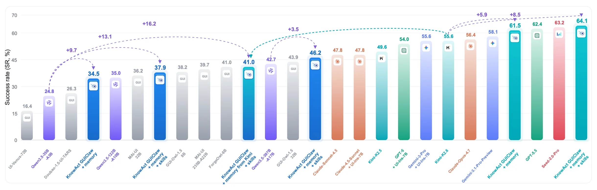
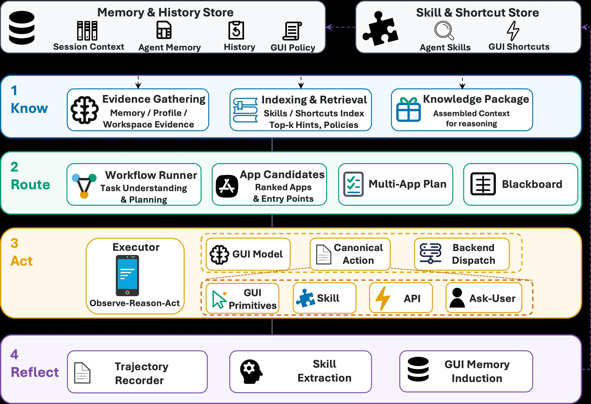
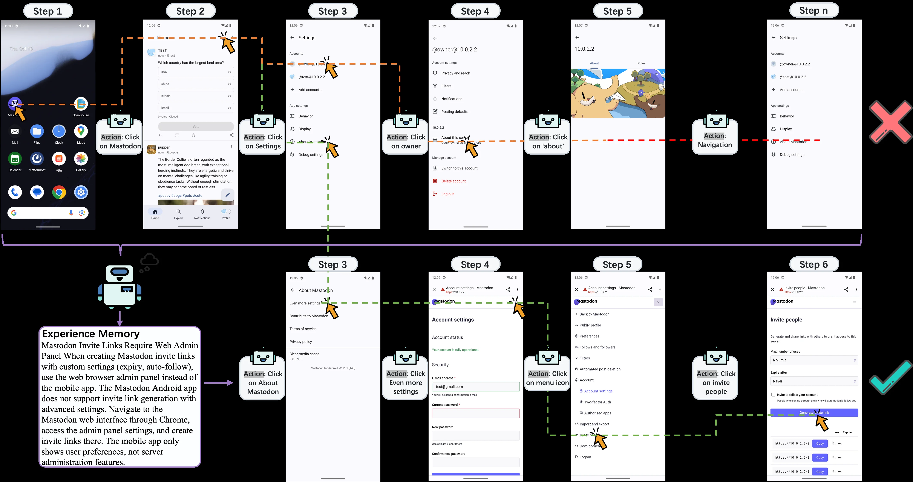
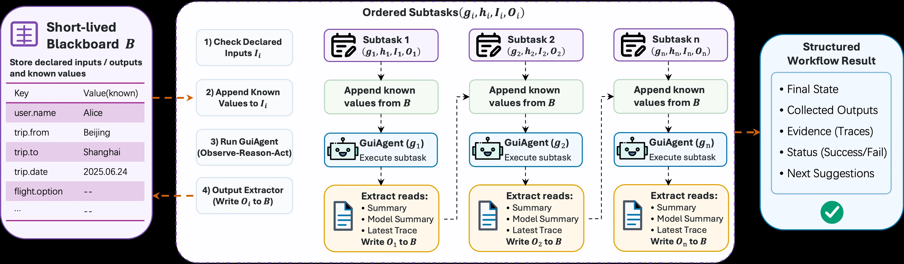
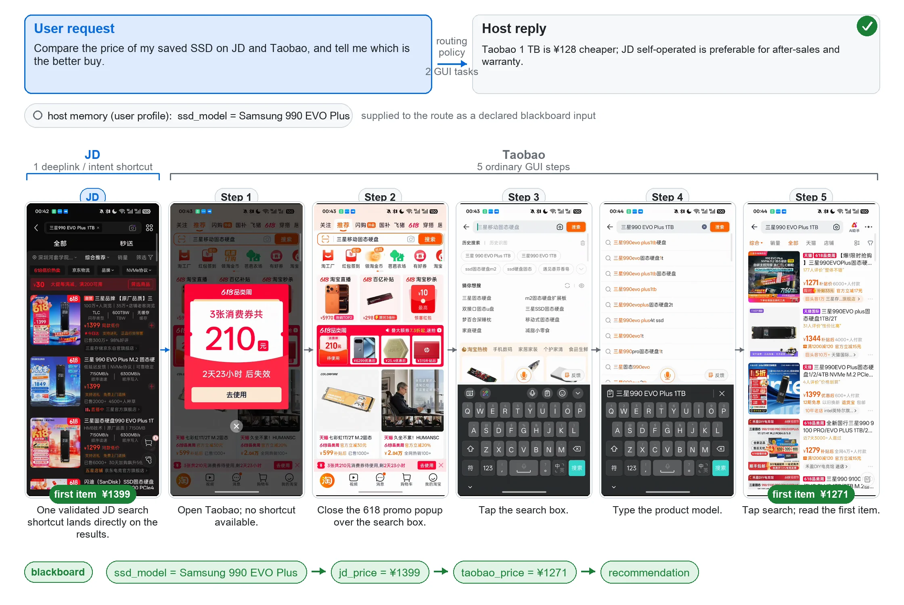
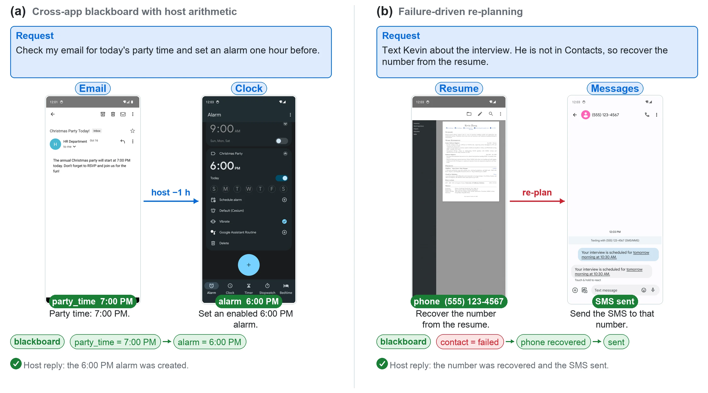
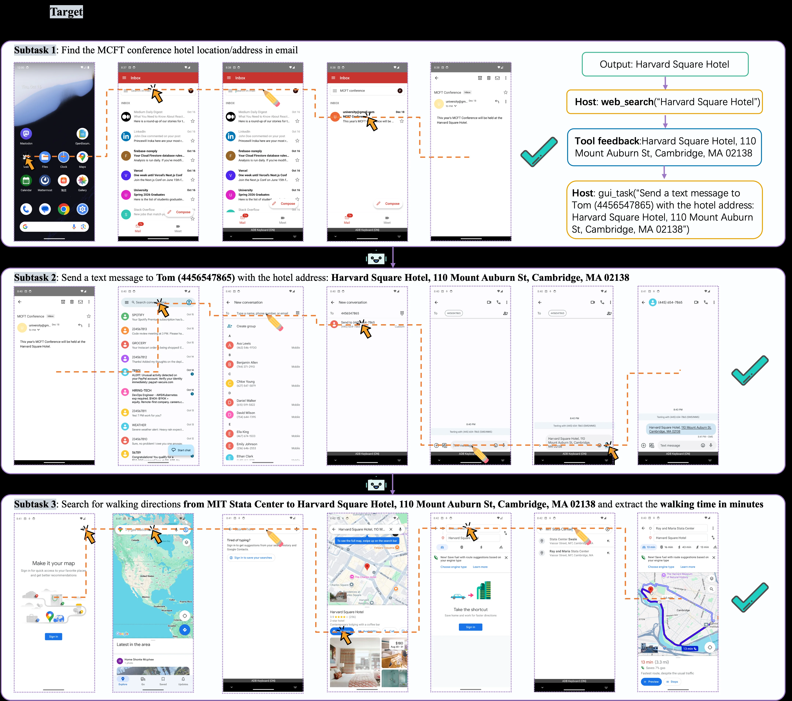
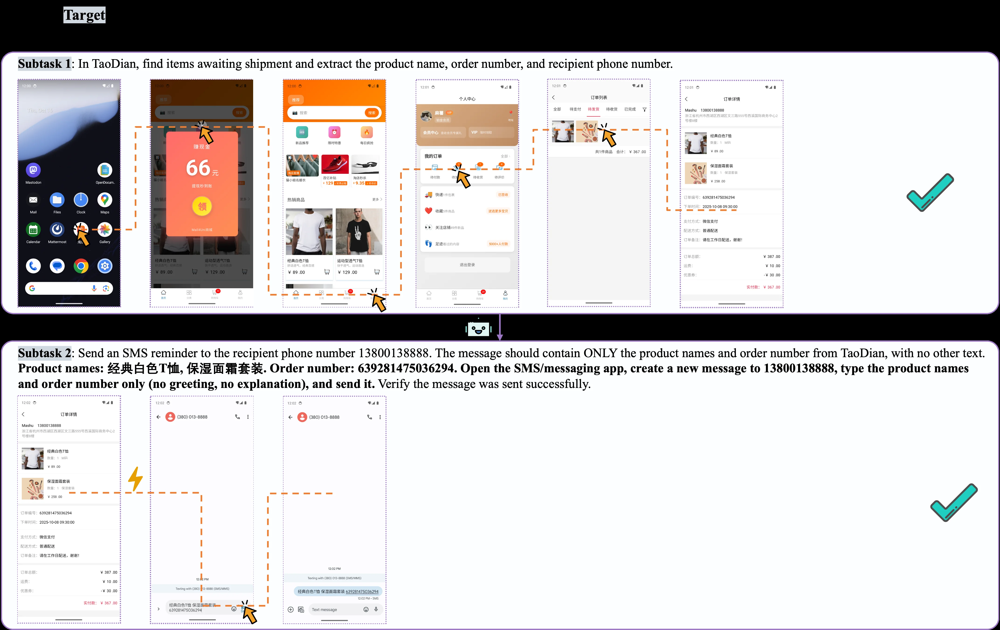
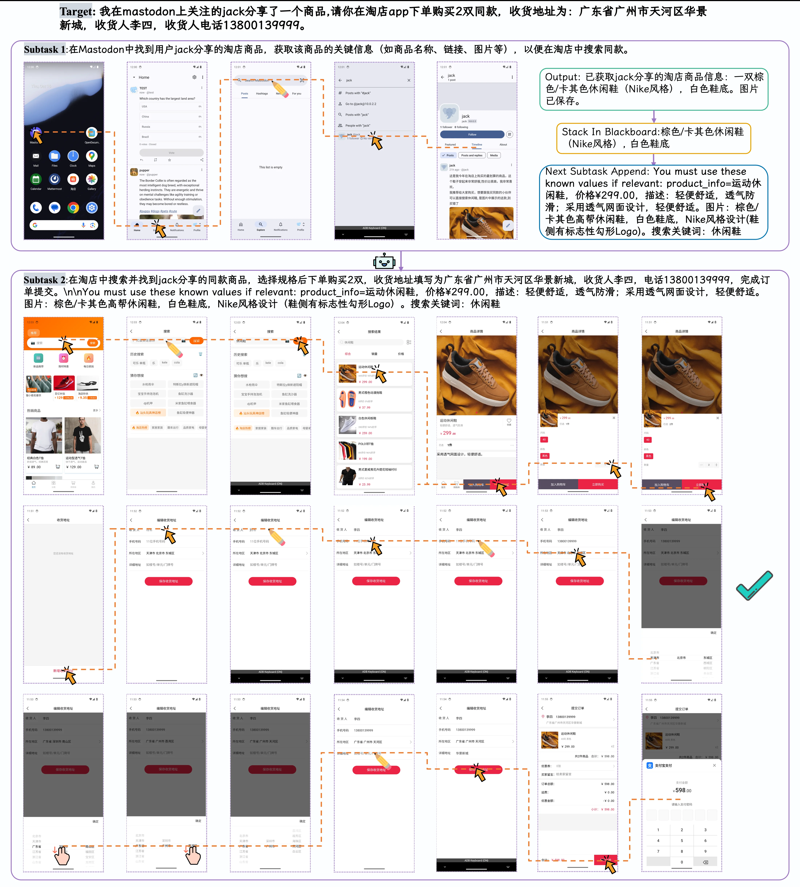

# KnowAct-GUIClaw: Know Deeply, Act Perfectly, Personal GUI Assistant with Self-Evolving Memory and Skill

[arXiv](https://arxiv.org/abs/2607.12625) · [HuggingFace](https://huggingface.co/papers/2607.12625) · ▲56

## Abstract (verbatim)

> OpenClaw has emerged as a leading agent framework for complex task automation, yet it faces insufficient cross-platform GUI interaction support and a well-built self-evolution mechanism. These flaws limit its adaptation to diverse device ecosystems and prevent performance improvements through continuous learning from execution experience. To resolve these issues, we propose the Know Deeply, Act Perfectly paradigm for personal assistants, which holds that accumulated user interaction and task-running experience directly improve execution accuracy and efficiency, unifying cognitive comprehension and operational execution. Based on this paradigm, we introduce KnowAct-GUIClaw, a novel Know-Route-Act-Reflect framework designed to address OpenClaw's GUI manipulation deficits and break through its cross-platform and recursive self-improvement constraints. First, the host agent leverages accumulated interaction experience and task-relevant knowledge for long-horizon task decomposition and allocation (Know). Second, a pluggable GUI subagent with an experience-attributable memory system (Know) and self-evolving skill library (Act), enabling seamless cross-platform migration and fast-path integration. Especially, this framework continuously stores user profiles and feedback to improve the accuracy of task decomposition and tool calls. Extensive experiments across Android, iOS, HarmonyOS and Windows show that KnowAct-GUIClaw achieves superior efficiency, accuracy and cross-platform adaptability. Especially, the GUIClaw with open-source Kimi-2.6 models achieves the best performance (64.1%) on the long-horizon MobileWorld benchmark, beating all agentical frameworks and closed-source agentical models, e.g., Seed-2.0-Pro and GPT-5.5. Additionally, the knowledgeable memory and execution skills supported by our framework are transferable across diverse base models, improving by 8.5% with Kimi-2.6.

## Background

### Background Analysis  

**1. Technical Context and Real-World Needs**  
As LLM agents evolve from simple dialogue tools to long-running personal assistants, users increasingly require capabilities beyond text interaction, such as graphical user interface (GUI) manipulation. For example, an assistant might need to migrate data between mobile apps, handle permission pop-ups, or execute multi-step workflows in login-protected environments. These tasks cannot be addressed through standardized APIs and demand dynamic GUI understanding. However, existing GUI agents (e.g., AppAgent, Mobile-Agent) struggle with cross-application and cross-device scenarios, and lack mechanisms to learn from historical experience for efficiency improvements.  

**2. Limitations of Previous Approaches**  
Traditional GUI agents face four key flaws: (1) High-level instructions often span multiple apps, but free-text descriptions fail to retain intermediate data needed for cross-app tasks; (2) GUI observations (e.g., screenshots, action trajectories) are fragmented, requiring additional recording by host agents to guide lightweight executors; (3) Trajectories are discarded after task completion, forcing relearning of known patterns in repeated executions; (4) Most workflows do not integrate non-visual shortcuts (e.g., system intents, deep links) and cannot safely reuse them as persistent skills.  

**3. Solution Approach**  
KnowAct-GUIClaw addresses these issues with the "Know Deeply, Act Perfectly" paradigm, dividing tasks into a collaborative "host agent-GUI executor" model. The host handles high-level decisions (e.g., task allocation, tool calls), while the executor focuses on visual interactions (e.g., screenshot parsing, action execution). Key innovations include:  
- **Hierarchical Collaboration**: Standardized interfaces enable task resumption and progress tracking, avoiding redundant exploration.  
- **Knowledge-Driven Routing**: Dynamic resource allocation based on task type (single/multi-app) and structured data sharing.  
- **Skill Library and Self-Evolution**: Successful trajectories are distilled into reusable parameterized skills (e.g., click-type patterns), optimized via reflection.  
- **Cross-Platform Adaptability**: Experience-attribution memory and skill validation support deployment across Android, iOS, etc.  

**4. Key Differences from Prior Work**  
Unlike traditional single GUI agents, KnowAct-GUIClaw emphasizes "cognition-execution" synergy: the host leverages global context (e.g., user profiles, history) for decisions, while the executor handles visual details. It also uniquely combines skill libraries with memory systems, enabling iterative optimization from experience. Experiments show SOTA performance on MobileWorld and cross-model transfer (e.g., Kimi-2.6), proving its generality and efficiency.

## Method, Figure by Figure

> Figure 1: The success rate (SR) comparison on MobileWorld GUI-Only tasks. The bars summarize Table 1 together with the additional Kimi-based KnowAct-GUIClaw runs; gray bars denote specialized GUI models, colored external bars denote general model families, and highlighted bars denote KnowAct-GUIClaw variants with memory and skills. The experimental results show that KnowAct-GUIClaw achieves SOTA performance and that the memory and skill are effective for different base models.

This figure (Figure 1) compares the **Success Rates (SR)** of different models on the **MobileWorld GUI-Only task**, with the core goal of verifying the performance advantages and effectiveness of `KnowAct-GUIClaw` (a variant combining memory and skills). The explanation is detailed below in terms of components, logic, and conclusions:  

### 1. Components of the Figure and Information Flow  
- **X-axis**: Different models/methods, arranged logically as "base model type → KnowAct-GUIClaw variant". This includes:  
  - Gray bars: **Dedicated GUI models** (e.g., "UI-Venue-72B", "Doubao-1.5-UI-TARS", etc.), optimized only for GUI tasks, without general capabilities or self-evolution mechanisms.  
  - Colored outer bars: **General model families** (e.g., "Qwen", "Claude", "GPT" series), with general task capabilities but insufficient original GUI interaction or self-evolution abilities.  
  - Highlighted bars (blue/cyan, etc.): **KnowAct-GUIClaw variants** (with "memory + skills"), the method proposed in the paper, which combines the "Cognition (Know)-Action (Act)-Reflection (Reflect)" framework to improve performance through experience accumulation and skill evolution.  

- **Y-axis**: Success rate (%), where higher values indicate better task completion.  

- **Arrows and increment labels**: Dashed purple/cyan arrows connect different models, with the labeled "+X" indicating the **performance improvement** (the success rate of the latter model is X% higher than that of the former). For example:  
  - From "Qwen3.5-32B-A10B" (34.5%) to "KnowAct GUIClaw + memory + skills" (37.9%), the improvement is +13.1%;  
  - From "KnowAct GUIClaw + memory + skills" (46.2%) to subsequent models, there are further improvements (e.g., +3.5%, +5.9%, +8.5%, etc.), reflecting the continuous optimization effect of "memory + skills".  

### 2. Operational Logic of the Method (Inferred from the Figure)  
The `KnowAct-GUIClaw` proposed in the paper follows the "**Know Deeply, Act Perfectly**" paradigm to address the deficiencies of OpenClaw (insufficient cross-platform GUI support, lack of self-evolution mechanisms) through the following steps:  

- **Know (Cognition) Phase**:  
  The main agent uses **accumulated user interaction experience** and **task-related knowledge** to perform **long-horizon task decomposition and allocation** (i.e., breaking down complex GUI tasks into executable sub-steps and assigning them to appropriate sub-agents). For example, the basis of "KnowAct GUIClaw + memory + skills" is "experience accumulation + knowledge-driven task planning".  

- **Act (Action) Phase**:  
  It adopts **pluggable GUI sub-agents**, combined with:  
  - **Experience-traceable memory system**: Stores user profiles, feedback, and execution experience to optimize task decomposition and tool calls (the "GUI" models in the gray bars lack this memory, while the highlighted bars of KnowAct-GUIClaw have it);  
  - **Self-evolving skill library**: Supports cross-platform migration (Android/iOS/HarmonyOS/Windows) and rapid path integration (i.e., quickly adapting to new GUI scenarios).  

- **Reflect (Reflection) Phase** (Implicit in "Continuous Learning"):  
  The framework **continuously stores user feedback and execution experience**, continuously improving the accuracy of task decomposition and the efficiency of tool calls (the "+X" increments in the figure reflect the performance improvement after reflection).  

### 3. Comparison Objects and Conclusions  
- **Comparison Objects**:  
  - Dedicated GUI models (gray bars): Generally low performance (e.g., "UI-Venue-72B" only 16.4%), due to the lack of general capabilities or self-evolution mechanisms.  
  - General model families (colored outer bars): Performance is better than dedicated GUI models, but the original versions (e.g., "Qwen3.5-122B-A10B" 34.5%, "GPT-3.5" 54.0%) are still lower than KnowAct-GUIClaw variants.  
  - KnowAct-GUIClaw variants (highlighted bars): Significantly improve performance through "memory + skills", ultimately reaching **64.1%** (the highest value), and the intermediate increments (e.g., +13.1%, +3.5%, +8.5%) prove the effectiveness of "memory + skills".  

- **Conclusion**:  
  `KnowAct-GUIClaw` achieves **SOTA (State-of-the-Art) performance** on the MobileWorld GUI-Only task, and the design of "memory + skills" is effective for different base models (e.g., Qwen, Claude, Kimi, etc.)—that is, regardless of the base model, adding "experience memory + self-evolving skills" can improve the success rate of GUI tasks.  

This figure, through "success rate comparison + increment arrows", intuitively shows how `KnowAct-GUIClaw` breaks through the limitations of traditional GUI models and achieves cross-platform and self-evolving task automation by combining memory and skills in a "cognition-action-reflection" closed loop.

---

> Figure 2: Overview of the KnowAct-GUIClaw execution loop . Two persistent stores—a memory and history store and a skill and shortcut store—supply advisory context to every stage. Know gathers evidence and assembles a reasoning context; Route ranks app candidates and turns the request into either a single GUI task or an ordered multi-app workflow whose subtasks exchange typed values through a blackboard; Act runs GUIClaw’s observe–reason–act loop over the hybrid action space of GUI primitives, skills, deeplink/intent shortcuts, and intervention actions; and Reflect distills each trajectory into updated skills and experience memory that feed back into the stores.

This figure presents an overview of the KnowAct - GUIClaw execution loop. We can understand its working process from four main phases (Know, Route, Act, Reflect) and two persistent stores (Memory & History Store and Skill & Shortcut Store):

### Persistent Stores (the top two modules)
- **Memory & History Store**: It contains Session Context, Agent Memory, History, and GUI Policy. It provides information related to user sessions, the agent's own memory, historical interactions, and GUI policies to the subsequent phases (Know, Route, Act, Reflect).
- **Skill & Shortcut Store**: It contains Agent Skills and GUI Shortcuts. It provides available agent skills and GUI shortcut information to the subsequent phases.
These two stores supply "advisory context" to the four phases below through arrows, meaning relevant information is passed to these phases to support their operations.

### Phase 1: Know (Cognition/Knowledge Acquisition)
The goal of this phase is to collect evidence and assemble a reasoning context, which is divided into three sub - modules:
- **Evidence Gathering**: It collects information from Memory / Profile and Workspace Evidence, that is, it obtains task - related evidence from the persistent store and other related workspace data.
- **Indexing & Retrieval**: It operates on the Skills / Shortcuts Index and provides Top - k Hints and Policies, that is, it retrieves the most relevant hints and policies from the skill and shortcut index.
- **Knowledge Package**: It assembles the above - collected and retrieved information into an Assembled Context for reasoning, and this context will support the subsequent Route phase.
The information flow order is: obtain input from the Memory & History Store and the Skill & Shortcut Store, go through the processing of Evidence Gathering and Indexing & Retrieval, and finally form the Knowledge Package.

### Phase 2: Route (Routing/Task Planning)
The goal of this phase is to understand the task, plan it, and convert the request into a single GUI task or a multi - application workflow. It contains four sub - modules:
- **Workflow Runner**: It is responsible for Task Understanding & Planning, that is, it understands the user's task and plans how to execute it.
- **App Candidates**: It processes the Ranked Apps & Entry Points, that is, it ranks the possible applications and their entry points to determine the candidate applications for executing the task.
- **Multi - App Plan**: If the task requires multiple applications, it generates a Multi - App Plan, and typed values are exchanged between subtasks through the Blackboard. The Blackboard serves as a shared space to传递 information.
- **Blackboard**: It acts as a medium for information exchange between subtasks to ensure the information transfer in the multi - application workflow.
The information flow order is: obtain input from the Knowledge Package of the Know phase, go through the processing of Workflow Runner and App Candidates, generate a Multi - App Plan, and exchange information through the Blackboard.

### Phase 3: Act (Action/Execution)
The goal of this phase is to run GUIClaw's observe - reason - act loop in the hybrid action space (GUI primitives, skills, deeplink/intent shortcuts, and intervention actions). It contains multiple sub - modules:
- **Executor**: It executes the Observe - Reason - Act loop, which is the core part of the execution and is responsible for the actual execution operations.
- **GUI Model**: It is a model related to the GUI, which may be used to understand the structure and elements of the GUI.
- **Canonical Action**: It is a canonical action, that is, it defines the standard form of actions.
- **Backend Dispatch**: It is responsible for dispatching actions to the backend for execution.
- **GUI Primitives**: They are basic GUI operations, such as clicking, inputting, etc.
- **Skill**: They are the agent's skills stored before, which are used to execute specific tasks.
- **API**: It is an application programming interface, and tasks are executed by calling APIs.
- **Ask - User**: When necessary, it asks the user for information as an intervention action.
The information flow order is: obtain input from the output of the Route phase (such as a Multi - App Plan or a single GUI task), and the Executor, through modules such as GUI Model, Canonical Action, and Backend Dispatch, combines the action spaces such as GUI Primitives, Skill, API, and Ask - User to execute the task.

### Phase 4: Reflect (Reflection/Learning)
The goal of this phase is to distill each trajectory into updated skills and experience memory and feed them back to the persistent stores. It contains three sub - modules:
- **Trajectory Recorder**: It records the execution trajectory of the task, that is, it records the information of the entire execution process.
- **Skill Extraction**: It extracts skills from the execution trajectory, that is, it learns new skills or improves existing skills from the existing execution experience.
- **GUI Memory Induction**: It induces GUI memory from the execution trajectory, that is, it learns about the GUI from the execution trajectory to improve future task decomposition and tool calls.
The information flow order is: obtain input from the execution result of the Act phase, go through the processing of Trajectory Recorder, Skill Extraction, and GUI Memory Induction, and feed the updated skills and memory back to the Memory & History Store and the Skill & Shortcut Store, thus achieving self - evolution and continuous learning.

In general, the working process of KnowAct - GUIClaw is as follows: first, obtain context information from the two persistent stores; in the Know phase, collect evidence and assemble a reasoning context; then, in the Route phase, plan the task and determine the candidate applications or workflows for execution; next, in the Act phase, execute the task by using the hybrid action space; finally, in the Reflect phase, reflect on the execution process, update the skills and memory, and feed them back to the persistent stores to achieve self - evolution and continuous improvement, thus solving the deficiencies of OpenClaw in cross - platform GUI interaction and self - evolution mechanism.

---

> Figure 3: Experience memory improves a GUI task by changing the task context before low-level control begins . Without the retrieved memory (Top), GUIClawinvites continues through Mastodon’s mobile settings and reaches a nonproductive path for invite-link creation. With the retrieved memory (bottom), the Know stage supplies an advisory lesson that invite links with advanced settings that require the web administration panel; GUIClaw then opens the web interface, navigates to account settings, and reaches the invite-people page. The example shows that experience memory guides app choice, decomposition, and recovery while live screen observations still ground each action.

This figure (Figure 3) is from the paper *"KnowAct-GUIClaw: Know Deeply, Act Perfectly, Personal GUI Assistant with Self-Evolving Memory and Skill"* and clearly illustrates how **"experiential memory"** improves the execution flow of a GUI task by modifying the task context before low-level control begins. The image uses a side-by-side comparison of two parallel processes to visually demonstrate the impact of having or lacking **"retrieved experiential memory"** on the task execution path.  

---

### **Overall Structure and Comparison Logic of the Figure:**  

- **Top Section (Labeled "Step 1" to "Step n"):**  
  Represents the **task execution path without retrieved experiential memory**. This path ultimately leads to a **"non-productive" result** (marked by a red "X"). Arrows (mostly orange dashed and solid lines) indicate the sequence of actions and interface transitions taken by the GUI agent (**GUIClawinvites**) without experiential memory guidance.  

- **Bottom Section (Labeled "Step 3" to "Step 6", with "Experience Memory" box):**  
  Represents the **task execution path with retrieved experiential memory**. This path successfully reaches the **target page** (marked by a green checkmark). Arrows (mostly green dashed and solid lines) indicate the sequence of actions and interface transitions guided by experiential memory.  

- **Left-Side "Experience Memory" Box:**  
  A core source of information in the figure. It provides key knowledge about creating Mastodon invitation links:  
  *"Mastodon Invite Links Require Web Admin Panel: When creating Mastodon invite links with custom settings (expiry, auto-follow), use the web or browser admin panel instead of the mobile app..."*  
  This knowledge is retrieved during the **"Know" phase** and used to guide the subsequent **"Act" phase**.  

---

### **Flow of Data or Information:**  

#### **1. Process Without Experiential Memory (Top Section):**  
- **Step 1:** Starts from the phone’s home screen; the agent clicks the "Mastodon" app icon.  
- **Step 2:** After opening Mastodon, the agent clicks the menu button (three dots) in the top-right corner.  
- **Step 3:** In the popup menu, the agent clicks "Settings".  
- **Step 4:** In the settings page, the agent clicks the current account (@owner@10.0.2.2).  
- **Step 5:** In the account settings page, the agent clicks "about".  
- **Step n:** The agent continues navigating settings, but the path is marked as non-productive (red "X"), implying it failed to find the correct method for creating advanced invitation links (e.g., getting stuck on an unrelated page like "About Mastodon").  

#### **2. Process With Experiential Memory (Bottom Section):**  
- **"Experience Memory" Box:** First, the agent retrieves the experiential knowledge during the **"Know" phase** (i.e., Mastodon invitation links with custom settings require the web admin panel).  
- **Step 3:** Based on this knowledge, the agent clicks "About Mastodon" (possibly to confirm the environment or redirect to the correct path).  
- **Step 4:** The agent then clicks "Even more settings" (likely searching for the web admin interface entrance).  
- **Step 5:** Next, the agent clicks the menu icon (typically three dots or a hamburger menu), which may open a menu containing the "Invite people" option.  
- **Step 6:** Finally, the agent clicks "invite people", successfully entering the invitation link creation page (with options like "Generate invite link" visible). This path is marked as successful (green checkmark).  

---

### **How the Method Works (KnowAct-GUIClaw Mechanism):**  

The figure reveals the core operational mechanism of **KnowAct-GUIClaw**:  

1. **"Know" Phase (Cognition):**  
   - The agent retrieves relevant historical experience/knowledge from its **"experiential memory"** system.  
   - Example: For Mastodon invitation links with custom settings (expiry, auto-follow), the web admin panel (not the mobile app) should be used.  

2. **"Act" Phase (Action):**  
   - Based on the knowledge from the "Know" phase, the agent adjusts its strategy.  
   - Instead of blindly navigating the mobile app’s settings, it follows the experiential guidance to reach the web admin interface (via Chrome).  

3. **Task Decomposition & Allocation:**  
   - Experiential memory helps the agent perform **long-term task decomposition** more effectively (e.g., knowing that creating advanced invitation links requires multiple steps, including opening the web admin panel).  

4. **Tool Invocation & Cross-Platform Adaptation:**  
   - The **"pluggable GUI subagent"** and **"self-evolving skill library"** enable adaptation across platforms (e.g., Android, iOS).  
   - Example: The agent knows to invoke a web browser to complete the task.  

5. **Continuous Learning & Improvement:**  
   - By storing user feedback and execution experience, the method improves task decomposition accuracy and tool invocation efficiency.  
   - The figure demonstrates how this mechanism avoids wrong paths and guides toward the correct one.  

6. **Real-Time Observation + Experiential Memory:**  
   - While experiential memory provides high-level guidance, each action (e.g., button click) is still **grounded in real-time screen observations** (i.e., the agent acts based on the current interface).  

---

### **Conclusion:**  

The figure clearly demonstrates the effectiveness of **KnowAct-GUIClaw**. By introducing **"experiential memory"**, the method significantly enhances GUI task automation.  

**Key Takeaway:**  
Experiential memory guides **application selection, task decomposition, and execution path recovery**, preventing non-productive paths and ensuring successful task completion.  

The contrast between the **failure path (top, no experiential memory)** and the **success path (bottom, with experiential memory)** highlights the method’s advantages over traditional GUI automation tools (e.g., OpenClaw), which lack cross-platform adaptability and continuous learning capabilities.

---

> Figure 4: Blackboard-mediated execution in the Route stage . The short-lived blackboard B B stores typed inputs and outputs known so far. Each subtask ( g i , h i , I i , O i ) (g_{i},h_{i},I_{i},O_{i}) checks its declared inputs I i I_{i} , reads their values from B B , runs GUIClaw’s observe–reason–act loop to produce a trajectory τ i \tau_{i} , and writes only its declared outputs O i O_{i} back to B B ( 2 ). A missing required input or output makes the workflow fail closed, so later subtasks consume observed typed values rather than free-form summaries.

This diagram illustrates the execution flow of the "Route Phase" in the KnowAct-GUIClaw framework based on a blackboard system, clearly presenting the process of task decomposition, subtask execution, and result output:

### Components and Information Flow
1. **Left: Short-lived Blackboard B**: This is a short-term blackboard used to store declared inputs/outputs and known values (e.g., `user.name` is Alice, `trip.from` is Beijing, etc.). Its role is to provide storage and reading support for known data for subsequent subtasks. Arrows indicate that data flows from the blackboard to the intermediate subtask processing flow (in step 2, "Append Known Values to Iᵢ" will read known values from here to supplement the input of subtasks), and at the same time, the output of subtasks (step 4) will be written back to the blackboard (for example, the final value of `flight.option` will be extracted from the subtask output and stored here).

2. **Middle: Ordered Subtask Execution Flow**:
    - **Step 1: Check Declared Inputs Iᵢ**: Each subtask (such as Subtask 1, Subtask 2, Subtask n, each subtask has `gᵢ` (GUI agent), `hᵢ` (may be a skill or strategy), `Iᵢ` (input), `Oᵢ` (output)) first checks its declared input `Iᵢ` to clarify which input data are needed to execute the task.
    - **Step 2: Append Known Values to Iᵢ**: Read known values from the left Short-lived Blackboard B and supplement them to the input `Iᵢ` of the subtask. For example, if a subtask needs the value of `trip.from`, it will obtain Beijing from the blackboard and add it to `Iᵢ` to ensure that the subtask has enough known data to execute.
    - **Step 3: Run GuiAgent (Observe-Reason-Act)**: The GuiAgent in each subtask (such as GuiAgent(g₁), GuiAgent(g₂), etc.) executes the "Observe-Reason-Act" cycle. This cycle is the core execution logic of KnowAct-GUIClaw. It completes the task by observing the interface, reasoning about task requirements, and performing operations, generating a trajectory τᵢ (the trajectory is not directly shown in the figure, but it is mentioned that the trajectory will be recorded for subsequent analysis or learning).
    - **Step 4: Output Extractor (Write Oᵢ to B)**: After the subtask is executed, the output extractor will extract the declared output `Oᵢ` (such as Summary, Model Summary, Latest Trace, etc.) from the output of the subtask and write it back to the left Short-lived Blackboard B. For example, the output `O₁` of Subtask 1 will be extracted and written to the blackboard for subsequent subtasks (such as Subtask 2) to read in step 2, or for the final "Structured Workflow Result" to use.

3. **Right: Structured Workflow Result**: This is the final result of the entire workflow, including Final State (final state), Collected Outputs (collected outputs), Evidence (Traces) (evidence/trajectories), Status (Success/Fail) (status/success/failure), Next Suggestions (next suggestions). These results are summarized from the outputs of each subtask. For example, the outputs of subtasks will be integrated here to show the final situation of the entire task execution.

### How the Method Works
The operation of KnowAct-GUIClaw in the "Route Phase" follows the following logic:
- **Task Decomposition and Input Processing**: First, complex tasks are decomposed into multiple ordered subtasks (from Subtask 1 to Subtask n). Each subtask clarifies its own input `Iᵢ`, output `Oᵢ`, the GUI agent `gᵢ` it executes, and the related strategy `hᵢ`. Then, the input/output data are managed through the blackboard B to ensure that subtasks can obtain the required known values (step 2), solving the problem of missing inputs (if inputs are missing, the workflow will "fail closed", that is, subsequent subtasks will use the observed typed values instead of free-form summaries to ensure the closure of execution).
- **Subtask Execution**: Each subtask executes the "Observe-Reason-Act" cycle through the GuiAgent, using the known data in the blackboard and its own capabilities (such as cross-platform GUI interaction, self-evolving skill library, etc. Although these capabilities are not directly shown in the figure, they can be known from the background of the paper) to complete the task and generate output.
- **Output Integration and Result Generation**: After the output of the subtask is extracted, it is written back to the blackboard. Finally, the outputs of all subtasks are integrated into the "Structured Workflow Result" to display information such as the final state, output, trajectory, status, and suggestions of the task.

### Results and Conclusions (Inferred from the Logic in the Diagram)
From the process in the diagram, it can be seen that KnowAct-GUIClaw, through the execution method mediated by the blackboard, realizes the decomposition of tasks, the orderly execution of subtasks, and the integration of outputs, ensuring the correct execution of tasks (if the inputs and outputs are correct). The advantages of this method are:
- **Data Management**: Manage input/output data centrally through the blackboard B to ensure that subtasks can obtain the required information, solve the problem of missing inputs, and ensure the closure of the workflow (fail closed).
- **Experience Accumulation and Self-Evolution**: The execution trajectory (Latest Trace) of the subtask will be recorded and written back to the blackboard, and can be used to improve task decomposition and tool calling later (according to the background of the paper) to realize self-evolution. For example, user feedback and interaction experience will be stored in the blackboard or related modules to continuously optimize the execution accuracy.
- **Cross-Platform Adaptability**: Through pluggable GUI sub-agents and self-evolving skill libraries (the design of the GuiAgent in the figure implies this), seamless cross-platform migration (such as Android, iOS, HarmonyOS, and Windows, etc., according to the background of the paper) can be realized to solve the cross-platform defects of OpenClaw.

In short, this diagram clearly shows how KnowAct-GUIClaw realizes the decomposition of tasks, the execution of subtasks, and the integration of results through the execution flow mediated by the blackboard in the "Route Phase", solving the problems of GUI interaction and self-evolution of OpenClaw, and improving the efficiency, accuracy, and cross-platform adaptability of task execution.

---

> Figure 5: KnowAct-GUIClaw execution of a cross-app price comparison . The host supplies the product model from the user profile and routes two GUI tasks. A validated JD search shortcut lands directly on the results page, whereas Taobao requires five ordinary GUI steps. The blackboard carries both observed prices into the host’s recommendation, illustrating the step and token savings in Table 3 .

This diagram illustrates the process of the KnowAct-GUIClaw framework executing a cross-application (JD and Taobao) price comparison task. We can understand its operating mechanism through the following parts:

### 1. Task Initiation and Information Input
- **User Request**: The user wants to compare the prices of a solid-state drive (SSD) they saved on JD and Taobao and find out which one is more worth buying. The task requirement is clearly stated here.
- **Host Memory/User Profile**: The host's user profile provides the SSD model (ssd_model = Samsung 990 EVO Plus), and this information is provided to the routing as "declared blackboard input". This reflects the "Know" stage of the framework, where it uses the user's accumulated interaction experience and task-related knowledge (here, the product model) to understand the task and identify the key information needed.

### 2. Routing and Task Allocation (Know Stage)
- **Routing Policy**: Based on the user request and the information in the user profile, the routing policy decomposes the task into two GUI tasks, each handling the price query for JD and Taobao respectively. This step is the long-horizon decomposition and allocation of the task, using accumulated experience and knowledge to determine how to execute the task, which belongs to the task allocation part of the "Know" stage.

### 3. Task Execution on JD (Act Stage - Shortcut Path)
- **JD Interface and Operations**: The JD task uses a "validated JD search shortcut", which directly takes the user to the search results page. As can be seen from the diagram, the JD interface displays the relevant products for Samsung 990 EVO Plus, and the price of the first item (first item ¥1399) is recorded. This step reflects the fast-path integration in the "Act" stage of the framework, using existing shortcuts (possibly learned experience) to reduce the number of operation steps and improve efficiency. Here, the "blackboard" system records jd_price = ¥1399, passing the observed price to the host's recommendation link.

### 4. Task Execution on Taobao (Act Stage - Normal GUI Steps)
- **Taobao Interface and Operations (5 Normal GUI Steps)**:
    - **Step 1**: Open Taobao, there is no available shortcut (no shortcut available), and the interface displays a 618 promotion pop-up.
    - **Step 2**: Close the 618 promotion pop-up over the search box to be able to perform subsequent search operations.
    - **Step 3**: Tap the search box to activate the search input area.
    - **Step 4**: Type the product model, that is, Samsung 990 EVO Plus 1TB, by entering the search keyword through the keyboard.
    - **Step 5**: Tap search and read the first item, the price of the first item on Taobao is ¥1271, and this price is recorded in the blackboard (taobao_price = ¥1271).
- This series of steps shows how the framework completes the "Act" stage of the task by simulating human GUI operations (clicking, entering, closing pop-ups, etc.) when there is no shortcut. At the same time, it uses a memory system attributable to experience (here, recording each step of the operation and the observed price) to ensure the accuracy of the operation, and these experiences will be stored to improve future task decomposition and tool calls.

### 5. Result Integration and Recommendation (Know Stage - Reflection and Recommendation)
- **Information Flow of the Blackboard**: The blackboard system carries both the JD price (jd_price = ¥1399) and the Taobao price (taobao_price = ¥1271) to the host's recommendation link (recommendation). The host gives the final purchase recommendation based on this price information and possible after-sales service and warranty factors (as shown in the host's reply in the diagram: "Taobao 1 TB is ¥128 cheaper; JD self-operated is preferable for after-sales and warranty.").
- **Efficiency and Step Savings**: As can be seen from the diagram, JD uses a shortcut and only needs a few steps (or a direct shortcut) to complete the price query, while Taobao requires 5 normal GUI steps. This will be reflected in the savings of steps and tokens in Table 3 (mentioned in the text), indicating that the framework improves execution efficiency and accuracy by using shortcuts and optimized task execution paths.

### Summary of the Overall Operating Mechanism
The KnowAct-GUIClaw framework completes tasks through the "Know - Route - Act - Reflect" process:
- **Know (Cognitive Understanding)**: Use the information in the user profile (such as the product model) and accumulated interaction experience to decompose the task and determine the operations to be performed (such as using shortcuts or simulating GUI operations).
- **Route (Routing Allocation)**: Assign the task to different applications (JD and Taobao) and determine the appropriate execution path (shortcut or normal GUI steps) for each application.
- **Act (Operation Execution)**: For JD, use a shortcut to quickly obtain the price; for Taobao, simulate human GUI operations (clicking, entering, closing pop-ups, etc.) to obtain the price, and at the same time, record the information and observed results (price) during the operation process in the blackboard.
- **Reflect (Reflection and Improvement)**: Integrate the price information from different applications into the blackboard, the host gives a recommendation based on this information and other factors (such as after-sales service), and store the experience of this task (such as the effectiveness of shortcuts, GUI operation steps, etc.) to improve future task decomposition and tool calls, achieving self-evolution and cross-platform adaptation.

Through this example, we can see how the KnowAct-GUIClaw framework solves the shortcomings of OpenClaw, that is, by accumulating experience and knowledge to improve the support for cross-platform GUI interaction and self-evolution ability, so as to achieve more efficient and accurate task automation.

---

> Figure 6: Cases of our workflow with attribution experience. (a) Email-to-alarm transfers the observed party time through the blackboard; the host subtracts one hour before the GUI subagent sets the alarm. (b) Failure-driven re-planning records a failed contact lookup, recovers the phone number from a resume, and delegates the final Messages GUI task.

This image (Figure 6) illustrates our workflow case study, which incorporates attribution experience. It is divided into two parts, (a) and (b), showcasing two distinct task processing flows to demonstrate how our method (KnowAct-GUIClaw) operates.

First, let's examine part (a), titled "Cross-app blackboard with host arithmetic" (跨应用黑板与主机算术). This section demonstrates a task of extracting information from an email and setting an alarm.
1.  **Request**: The blue box at the top displays the user's original request: "Check my email for today's party time and set an alarm one hour before." (检查我的电子邮件以获取今天的派对时间，并提前一小时设置闹钟。)
2.  **Email app interface**: The left phone interface simulates an email application. The email content shows the party time as 7:00 PM ("The annual Christmas party will start at 7:00 PM today."). Below the interface, a green label "party_time 7:00 PM" appears with the text "Party time: 7:00 PM.", indicating the system successfully extracted the party time from the email.
3.  **Data flow (arrow)**: A blue arrow points from the "Email" section to the "Clock" section, labeled "host -1 h". This signifies that the host agent, upon receiving the party time from the email, performed an operation: subtracting one hour from the time.
4.  **Clock app interface**: The right phone interface simulates a clock/alarm application. The interface displays an alarm set for 6:00 PM ("Christmas Party"). The green label "alarm 6:00 PM" and the text "Set an enabled 6:00 PM alarm." below confirm the alarm was successfully set.
5.  **Blackboard and data storage**: Below both app interfaces, there's a "blackboard" concept. This shows data storage and transfer: "party_time = 7:00 PM" followed by "→ alarm = 6:00 PM". This explains that the extracted party time was stored on the blackboard, and after the host's calculation (subtracting one hour), the alarm time was generated.
6.  **Host reply**: The green checkmark and text at the bottom, "Host reply: the 6:00 PM alarm was created," confirm the task's successful completion.

This case reveals a part of the method: the host agent uses information (shared via the "blackboard") extracted from a GUI (email), performs necessary calculations (like time adjustment), and then instructs another GUI sub-agent (alarm app) to execute the specific operation. Here, "host arithmetic" refers to the simple calculation performed by the host.

Next, let's look at part (b), titled "Failure-driven re-planning" (失败驱动的重新规划). This section demonstrates a task of sending an SMS, where a failure in contact lookup occurs, and how the system recovers.
1.  **Request**: The blue box at the top displays the user's original request: "Text Kevin about the interview. He is not in Contacts, so recover the number from the resume." (给Kevin发短信谈面试的事。他不在联系人中，所以从简历中恢复号码。)
2.  **Resume app interface**: The left phone interface simulates a resume application. The interface displays a resume containing the phone number "(555) 123-4567". The green label "phone (555) 123-4567" and the text "Recover the number from the resume." below indicate the system successfully recovered the phone number from the resume.
3.  **Data flow (arrow)**: A red arrow points from the "Resume" section to the "Messages" section, labeled "re-plan". This indicates that after a previous step (likely searching contacts) failed, the system replanned, adjusting the task flow to obtain the number from the resume and then send the SMS.
4.  **Messages app interface**: The right phone interface simulates an SMS application. The interface shows a sent SMS with content about interview scheduling. The green label "SMS sent" and the text "Send the SMS to that number." below confirm the SMS was successfully sent to the recovered phone number.
5.  **Blackboard and data storage/status update**: Below both app interfaces, there's a "blackboard" concept. This shows task status changes: "contact = failed" (indicating the contact lookup attempt failed), then "→ phone recovered" (indicating the phone number was successfully recovered from the resume), and finally "→ sent" (indicating the SMS was sent).
6.  **Host reply**: The green checkmark and text at the bottom, "Host reply: the number was recovered and the SMS sent," confirm the task's successful completion.

This case reveals another part of the method: when a task execution step fails (e.g., "contact = failed"), the system can perform failure-driven re-planning. It recovers the required data (phone number) from an alternative information source (resume) and then proceeds with the final task (sending the SMS). This demonstrates the system's robustness and adaptive capability.

In summary, this image clearly illustrates the workflow of the KnowAct-GUIClaw framework through two specific cases:
*   **(a) Cross-app collaboration and computation**: The system extracts information from one app (email), performs calculations via the host, and then passes the result to another app (alarm) to execute the operation. This relies on the "blackboard" for information sharing and transfer.
*   **(b) Failure recovery and re-planning**: When a task step fails (e.g., contact lookup), the system recovers necessary data from an alternative information source (resume) and continues with the final task (sending SMS). This demonstrates the system's fault tolerance and dynamic task planning adjustment capability.

Together, these cases explain how the method decomposes tasks, assigns them to appropriate sub-agents using accumulated experience and knowledge, and makes adaptive adjustments when problems arise, thereby achieving efficient and accurate personal assistant services.

---

> Figure 7: Host-mediated recovery in a conference-location task. The Email GUI task returns only the hotel name, so the host resolves the full address through web search before delegating the Messages and Maps GUI tasks. Maps reports a 13 13 -minute walk. The workflow combines partial GUI evidence with external tools while preserving typed subtask boundaries.

This diagram (Figure 7) illustrates the recovery process mediated by the Host in the "meeting location" task, clearly demonstrating how the KnowAct-GUIClaw framework operates.

First, let's look at **Subtask 1: Find the name/address of the MCFT conference hotel in the email**.
The workflow for this subtask unfolds from left to right:
1.  The leftmost phone screen displays a typical Android home screen with various app icons. An orange arrow points to the "Email" app icon, indicating that the user (or agent) first opened the email app.
2.  The next few screens show the email app interface: first, the "Inbox" view, displaying multiple emails. An orange arrow points to an email with the subject "MCFT conference".
3.  After clicking on that email, the email details page is entered. Another orange arrow points to a line of text in the email body that mentions the hotel name "Harvard Square Hotel".
4.  The output result of the process is shown on the right: "Output: Harvard Square Hotel". This indicates that by interacting with the email GUI, the agent successfully extracted the hotel name.
5.  Since the email only provided the hotel name, the Host intervened. The Host executed a tool call: "Host: web_search('Harvard Square Hotel')" (highlighted in an orange box). This means the Host used a web search to obtain the full address of the hotel.
6.  The tool feedback is displayed below: "Harvard Square Hotel, 110 Mount Auburn St, Cambridge, MA 02138" (highlighted in a blue box). This shows that the web search successfully returned the full address of the hotel.
7.  Subsequently, the Host delegated another GUI task: "Host: gui_task('Send a text message to Tom (4456547865) with the hotel address: Harvard Square Hotel, 110 Mount Auburn St, Cambridge, MA 02138')" (highlighted in an orange box). This means the Host assigned the subtask of "sending a text message containing the hotel address to Tom" to the Messages (Messages) GUI.

The flow of information is: open the email app -> find and click on the relevant email -> extract the hotel name -> Host performs a web search to get the full address -> Host delegates the messaging task.

Next is **Subtask 2: Send a text message containing the hotel address to Tom (4456547865)**.
The workflow for this subtask is also from left to right:
1.  The leftmost screen displays the interface of the messaging app, possibly a contact list or conversation list. An orange arrow points to a search bar or some operation area, indicating the start of finding the contact Tom.
2.  The next screen shows the contact list, which includes multiple contacts. An orange arrow points to the contact named "Tom" (or their phone number 4456547865).
3.  Then, the interface switches to the new message editing screen. An orange arrow points to the phone number input box, indicating that Tom's phone number is being entered.
4.  Next, the cursor appears in the message text input box, ready for text input. An orange arrow points to the input box.
5.  Then, the hotel address "Harvard Square Hotel, 110 Mount Auburn St, Cambridge, MA 02138" is entered into the message text.
6.  The last screen shows the status of the message being sent, with a green checkmark icon on the right, indicating that the text message was sent successfully.
The flow of information is: open the messaging app -> find and select the contact Tom -> enter the phone number -> enter the message containing the hotel address -> send the text message.

Finally, there is **Subtask 3: Search for the walking route from MIT Stata Center to Harvard Square Hotel and extract the walking time (in minutes)**.
The workflow for this subtask:
1.  The leftmost screen displays the initial interface of a map application, possibly a "Create Your Map" or similar function. An orange arrow points to an operation button, indicating the start of a new search.
2.  The next screen shows the search interface of the map application, possibly a world map view. An orange arrow points to the search box or some operation area, indicating the input of the destination.
3.  Then, the screen displays search results or suggestions, possibly a list or map markers. An orange arrow points to an option, possibly selecting the hotel or confirming the location.
4.  The next screen shows the specific location of the hotel marked on the map, along with some related information (such as pictures, ratings, etc.). An orange arrow points to the hotel marker on the map.
5.  Then, the interface switches to the route planning options, which may display different modes of transportation (such as walking, driving). An orange arrow points to the "Walking" option or the related route planning button.
6.  The next screen displays the detailed walking route map, including the starting point (MIT Stata Center) and the destination (Harvard Square Hotel), as well as the visualization of the route. An orange arrow points to the route or an operation button.
7.  The last screen displays the detailed information of the walking route, including the total walking time (shown as "13 min" in the figure) and distance ("3.3 mi"). There is a green checkmark icon on the right, indicating that the route search was successful and the time was extracted.
The flow of information is: open the map application -> search for the destination -> select the hotel -> view the hotel's location -> choose the walking route -> view the route details and get the walking time.

This diagram reveals the specific operation of the KnowAct-GUIClaw method:
1.  **Task Decomposition and Delegation (Know)**: The host agent first decomposes a complex task (finding the conference hotel and notifying Tom, then obtaining the route) into smaller subtasks. For example, in Subtask 1, it first obtains the hotel name through the email GUI, and then because the information is insufficient, the Host intervenes and calls an external tool (web search) to obtain the full address. Afterwards, the Host delegates the two subtasks of "sending a text message" and "searching for a route" to the corresponding GUI sub-agents (Messages and Maps) respectively.
2.  **Cross-Platform GUI Interaction and Skill Execution (Act)**: Each subtask involves interacting with a specific platform's GUI. For example, email applications, messaging applications, and map applications. The agent can understand GUI elements (such as buttons, input boxes, list items) and perform corresponding operations (clicking, inputting, selecting). The orange arrows in the figure indicate the agent's operation points and process direction on the GUI.
3.  **Experience and Tool Integration**: When the information provided by the email GUI is incomplete (only the hotel name), the Host uses an external tool (web search) to supplement the information. This reflects the method's ability to combine partial GUI evidence with external tools. The tool's feedback (full address) is used to further execute subsequent tasks (sending text messages, searching for routes).
4.  **Preservation of Subtask Boundaries**: Although external tools are used, the boundaries of each subtask remain clear. For example, email retrieval, web search, text message sending, and route search are four logically separate steps, but they together form a larger task.
5.  **Result Extraction and Verification**: In the last subtask, the agent can extract specific information (walking time of 13 minutes) from the output of the map application, and the green checkmark icon indicates that the task has been successfully completed.

In summary, this diagram, through a specific example (the meeting location task), details how the KnowAct-GUIClaw framework, mediated by the Host, decomposes a complex task into a series of subtasks, uses GUI interaction and external tools to solve the problem of insufficient information, and ultimately completes the task successfully. The flow of information is linear, from one subtask to the next, with each step having a clear input and output.

If it is a result diagram, we can see:
*   **Coordinates**: There is no explicit coordinate system in the figure, but the process is organized from left to right and from top to bottom.
*   **Comparison Object**: This diagram shows a successful task execution case. What it is compared to is that if there is no Host mediation or no external tool assistance, the task may not be completed or may require more manual intervention.
*   **Conclusion**: The KnowAct-GUIClaw framework can effectively handle complex tasks that require multiple GUI applications and external tools. It can achieve automation through task decomposition, tool integration, and result extraction. The green checkmark icons in the figure indicate that each subtask has been successfully completed, and the final required walking time (13 minutes) has been obtained. The "Maps reports a 13-minute walk" mentioned in the figure is consistent with the information in the caption.

---

> Figure 8: Cart-to-SMS cross-app execution. The TaoDian GUI task extracts the product names, order number, and recipient phone number and transfers them to the downstream messaging task. A validated messaging shortcut opens the SMS compose view with the recipient and message body already populated, illustrating both blackboard information transfer and navigation compression.

This figure (Figure 8) illustrates a typical cross-application task execution flow within the KnowAct-GUIClaw framework, specifically a "Cart-to-SMS" task chain. The image clearly reveals the core operational mechanism of the method, which involves task decomposition, information extraction and transfer, and downstream task execution to complete complex operations.

First, let's examine the upper part of the figure, which describes Subtask 1: finding items awaiting shipment in an application named "TaoDian" and extracting the product name, order number, and recipient phone number.

*   **Process Initiation**: The leftmost image shows a smartphone home screen with multiple app icons. An arrow points to one of the icons (appearing to be a shopping cart or store icon), representing the start of the task—launching the TaoDian app.
*   **In-app Navigation**: The subsequent images depict the operational steps within the TaoDian app. Arrows indicate the user's path of interaction, such as tapping on a specific area of the screen (possibly a menu or a specific button) and then navigating to the "Personal Center" or "My Orders" page.
*   **Information Localization and Extraction**: Following this, an arrow points to an "Order List" page, which displays specific order details. The next step involves an arrow pointing to an "Order Details" page, where the required key information is found: product names (e.g., "经典白色T恤" - Classic White T-shirt, "保湿面霜套装" - Moisturizing Cream Set), order number (e.g., "639281475036294"), and recipient phone number (e.g., "13800138888"). This information is necessary for the subsequent task.

The flow of data is sequential: starting from launching the TaoDian app, through a series of interface navigations and interactions, the target information is ultimately extracted from the order details page.

Next, we look at the lower part of the figure, which describes Subtask 2: sending an SMS reminder using the extracted information.

*   **Information Transfer**: From the "Order Details" page in the upper part, the information is transferred to the SMS/messaging app. The figure shows an arrow symbolizing the transfer of information (product names and order number) from the TaoDian app to the input fields of the SMS app.
*   **SMS App Operation**: The subsequent images display the interface of the SMS app. An arrow points to the "New Message" creation screen, where the recipient's phone number (13800138888) has been automatically populated.
*   **Message Content Population and Sending**: In the SMS editing field, the product names and order number (e.g., "经典白色T恤 保湿面霜套装 639281475036294") have been automatically filled in. The final image shows the confirmation status of the SMS being sent (e.g., a green checkmark or a "Sent" notification).

This figure reveals how the KnowAct-GUIClaw method operates:
1.  **Task Decomposition (Know)**: The host agent utilizes accumulated interaction experience and task-relevant knowledge to decompose a complex task (e.g., "send order reminder") into smaller, manageable subtasks (e.g., "extract information from TaoDian" and "send SMS").
2.  **Cross-platform GUI Interaction (Act)**: A pluggable GUI subagent is responsible for executing specific interface operations. It leverages an experience-attributable memory system for self-learning and improvement, enabling seamless cross-platform migration and fast-path integration. In this example, it can identify and locate the correct information within the TaoDian app and fill in and send the message in the SMS app.
3.  **Information Transfer and Navigation Compression**: The figure specifically highlights "blackboard information transfer" and "navigation compression." This means the extracted information (e.g., product names, order number, phone number) is stored in a shared "blackboard" for direct use by subsequent tasks, avoiding repetitive manual input. "Navigation compression" likely refers to optimizing the paths for switching and operating between different apps, enhancing efficiency.
4.  **Verification and Feedback**: The outcome of the entire process is verified (as indicated by the green checkmarks in the figure), ensuring the task is completed successfully. This verification and feedback mechanism is part of KnowAct-GUIClaw's self-evolution capability, used to continuously improve the accuracy of task decomposition and tool calls.

In summary, this figure, through a specific "Cart-to-SMS" task example, vividly demonstrates how the KnowAct-GUIClaw framework achieves complex automation tasks through intelligent task decomposition, efficient information extraction and transfer, and cross-platform application interaction. It emphasizes the importance of experience accumulation and utilization for improving execution efficiency and accuracy.

---

> Figure 9: Chinese annotated companion for the host-mediated recovery case in Figure 7 . The panel highlights the same control flow in which an underspecified GUI output is routed back to the host, grounded through web search, and then consumed by downstream Messages and Maps GUI tasks.

This diagram (Figure 9) is a detailed user interface interaction flowchart that illustrates how a personal GUI assistant framework named "KnowAct-GUIClaw" executes a specific multi-step task. The task involves placing an order for 2 pairs of the same product on the Taobao app based on merchandise information shared by the user "jack" on Mastodon.

We can divide the diagram into two main sections, corresponding to the two subtasks (Subtask) of the task. Each section consists of a series of mobile phone screenshots connected by arrows, clearly showing the sequence of operations and the flow of information:

1.  **Subtask 1: Obtaining Product Information on Mastodon**
    *   **Starting Point**: The leftmost mobile phone screenshot shows the home screen of an Android device with various app icons. This represents the starting point of the task, i.e., the user's device operating environment.
    *   **Information Flow**: Yellow arrows indicate the sequence of operations. First, the user opens the Mastodon app (starting by tapping the Mastodon icon on the home screen). Subsequent screenshots show the user's actions within the Mastodon app, including browsing posts, finding the product post shared by user "jack," and ultimately obtaining the key product information.
    *   **Output**: On the right side of Subtask 1, there is a box with a green border labeled "Output," which contains: "Product information from jack's shared Taobao store obtained: A pair of brown/khaki casual shoes (Nike style), white soles. Image saved." This indicates that Subtask 1 was successfully completed, and the core product description information was extracted.
    *   **Knowledge Transfer (Stack In Blackboard)**: Following this is a box with an orange border labeled "Stack In Blackboard," containing: "Brown/khaki casual shoes (Nike style), white soles." This signifies that the information obtained from Subtask 1 has been stored in a "blackboard" structure, which is likely a shared memory or context storage area for use by subsequent tasks.
    *   **Next Subtask Guidance (Next Subtask Append)**: Finally, a box with a blue border labeled "Next Subtask Append" provides the known values (known values) needed for Subtask 2, including product information (product_info), price, description, image, and search keywords. This clearly indicates the source of input data for Subtask 2.

2.  **Subtask 2: Searching for and Purchasing the Product in the Taobao App**
    *   **Starting Point**: The first screenshot on the left of Subtask 2 shows the interface of the Taobao app, possibly a search page or homepage. Yellow arrows indicate the subsequent operation process.
    *   **Information Flow**: The operation process includes searching for the product in Taobao (using keywords obtained from Subtask 1, such as "casual shoes"), browsing search results, selecting options that match the target product, entering the product details page, selecting specifications (e.g., purchasing 2 pairs), filling in the delivery address (Huajing New City, Tianhe District, Guangzhou City, Guangdong Province, recipient: Li Si, phone: 13800139999), confirming order information, and submitting payment.
    *   **Key Operation Points**: The yellow arrows and hand cursor icons in the diagram clearly indicate the specific UI elements that the user needs to click or interact with, such as the search bar, product images, specification selection buttons, address fill fields, and submit button.
    *   **Completion Indicator**: On the far right of the Subtask 2 process, there is a green checkmark (✔️) icon, indicating successful task completion. The final screenshot shows the payment success page, confirming the order amount as 598.00 yuan (2 pairs, 299.00 yuan each).

**Revealing the Framework's Operation**:
This diagram reveals the specific workings of the KnowAct-GUIClaw framework:
*   **Task Decomposition and Allocation (Know)**: The host agent first decomposes a complex task (such as obtaining information on Mastodon and making a purchase on Taobao) into smaller subtasks (Subtask 1 and Subtask 2). It uses accumulated interaction experience and task-related knowledge to guide the execution of these subtasks.
*   **Cross-Platform GUI Interaction (Act)**: A pluggable GUI sub-agent is responsible for executing specific GUI operations. It achieves seamless migration and rapid path integration across different platforms (such as Mastodon and Taobao) through an experience-attributable memory system and a self-evolving skill library.
*   **Information Passing and Feedback Loop**: The result of Subtask 1 (product information) is stored in the "blackboard" and used as input for Subtask 2. This demonstrates the unity of cognitive understanding (Know) and operational execution (Act). The framework improves the accuracy of task decomposition and tool calling through continuous storage of user profiles and feedback, forming a recursive self-improvement mechanism.
*   **Handling Underspecified GUI Outputs**: As stated in the original caption of the diagram, this framework can handle "underspecified GUI output," routing it back to the host agent for "grounding" (e.g., through web search) before using it for downstream GUI tasks (like Messages and Maps). While this diagram primarily shows a successful process, its design philosophy supports this flexibility.

In summary, this diagram, through a specific case, details how the KnowAct-GUIClaw framework automates complex personal GUI tasks through deep cognition (Know Deeply) and perfect execution (Act Perfectly), particularly how it migrates between different platforms and leverages experience for self-improvement.
