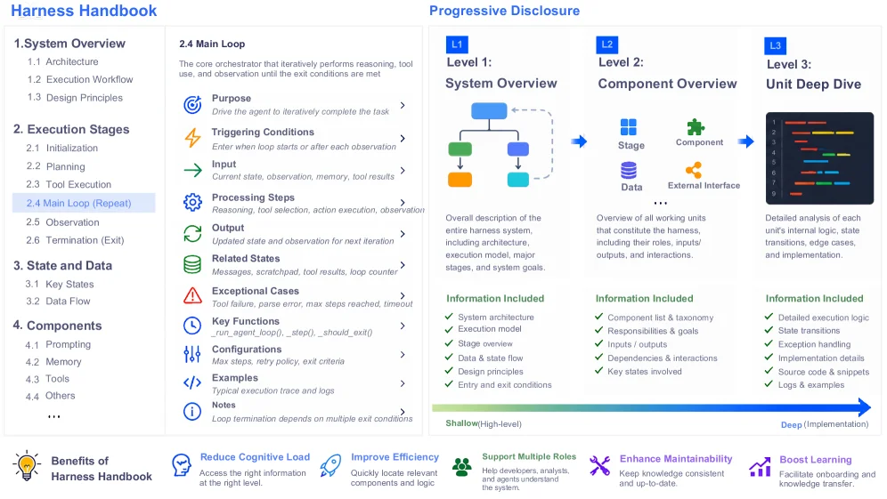
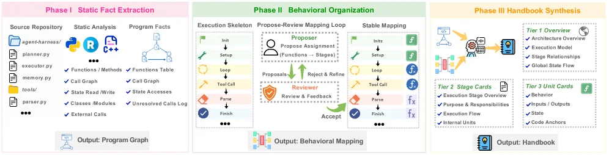
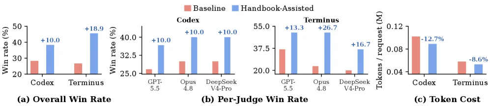
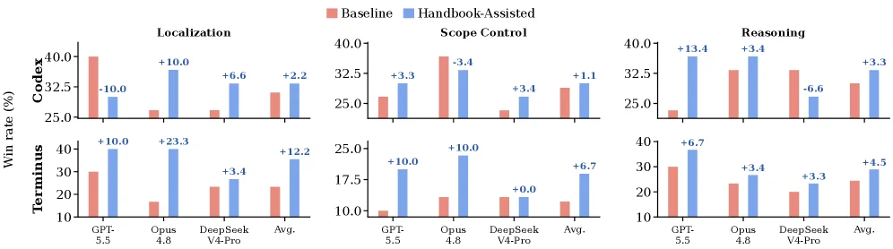
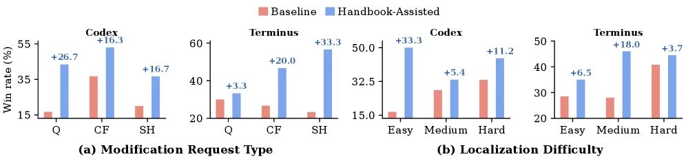

# Harness Handbook: Making Evolving Agent Harnesses Readable,Navigable, and Editable

[arXiv](https://arxiv.org/abs/2607.13285) · [HuggingFace](https://huggingface.co/papers/2607.13285) · ▲199

## 摘要（原文）

> The capability of a modern AI agent depends not only on its foundation model but also on its harness, which constructs prompts, manages state, invokes tools, and coordinates execution. As models, APIs, environments, and requirements evolve, the harness must be continually modified. Before such a change can be made, a developer or coding agent must identify all code locations that implement the target behavior. This is difficult because production harnesses are large, tightly coupled, and behaviorally distributed, while modification requests describe what the system should do and repositories are organized by files and modules. Code search, repository indexing, and long-context processing ease inspection, but still leave this behavior-to-code mapping to be recovered by hand. Behavior localization is therefore a central bottleneck in harness evolution. We introduce the Harness Handbook, a behavior-centric representation synthesized automatically from a harness codebase via static analysis and LLM-assisted structuring, linking each behavior to its corresponding source. We also introduce Behavior-Guided Progressive Disclosure (BGPD), which guides agents from high-level behaviors to relevant implementation details and verifies candidate locations against the current source. On diverse modification requests from two open-source harnesses, Handbook-Assisted planning improves behavior localization and edit-plan quality while using fewer planner tokens, with the largest gains on scattered sites, rarely executed paths, and cross-module interactions. Evolving complex agentic systems thus depends not only on generating edits, but also on determining where those edits should be made.

## 摘要（中译）

现代人工智能代理的能力不仅取决于其基础模型，还取决于其“ harness（ harness：这里可理解为‘ harness（工具链/执行框架）’）”，它构建提示、管理状态、调用工具并协调执行。随着模型、API、环境和需求的发展，harness必须不断修改。在进行此类更改之前，开发人员或编码代理必须识别实现目标行为的所有代码位置。这很困难，因为生产harness规模大、耦合紧密且行为分散，而修改请求描述了系统应该做什么，且存储库按文件和模块组织。代码搜索、存储库索引和长上下文处理便于检查，但仍需要手动恢复这种行为到代码的映射。因此，行为定位是harness进化中的一个核心瓶颈。我们引入了Harness Handbook，这是一种以行为为中心的表示，通过静态分析和LLM（LLM：大语言模型）辅助结构化从harness代码库中自动合成，将每个行为链接到其对应的源代码。我们还引入了Behavior - Guided Progressive Disclosure（BGPD，行为引导的渐进式披露），它引导代理从高级行为到相关的实现细节，并根据当前源代码验证候选位置。在来自两个开源harness的多样化修改请求中，Handbook - Assisted规划提高了行为定位和编辑计划的质量，同时使用了更少的规划器令牌，在分散的站点、很少执行的路径和跨模块交互方面收益最大。因此，进化复杂的代理系统不仅取决于生成编辑，还取决于确定这些编辑应该在哪里进行。

## 背景剖析

### 背景剖析  

**1. 技术背景与真实需求**  
现代AI智能体（如工具调用型助手或自动化系统）的核心能力不仅依赖基础模型，还取决于其“ harness”（即协调模型、工具和环境执行任务的“控制层”）。这类系统被广泛用于处理复杂任务，例如网页交互、代码生成或数据操作。然而，随着模型更新、API变更或业务需求调整，harness必须持续迭代。开发者的核心痛点是：当需要修改某个功能（如优化工具调用逻辑或修复执行漏洞）时，如何快速定位到代码中所有相关的实现位置？传统方法依赖人工阅读代码库或编码代理逐段搜索，但在大型、高度耦合的harness中，这一过程效率极低且容易遗漏关键逻辑。  

**2. 先前方法的局限性**  
现有工具（如代码搜索、仓库索引或长上下文处理）虽能帮助浏览代码，但存在根本缺陷：它们按文件或模块组织信息，而修改请求描述的是“行为”（如“让智能体在查询失败时重试三次”）。开发者或代理需要手动将行为需求映射到具体代码，这一过程耗时且易出错。例如，一个看似简单的行为可能分散在多个函数或文件中，而编码代理受限于上下文长度，无法一次性分析全部代码，导致遗漏边缘场景或跨模块的交互逻辑。  

**3. 本文的解决思路**  
论文提出了“Harness Handbook”，一种以行为为中心的代码表示方法。它通过静态分析和LLM辅助结构化，自动从harness代码库中提取行为与代码的对应关系。例如，将“处理用户身份验证”这一行为直接链接到实现该功能的代码段。此外，引入“Behavior-Guided Progressive Disclosure（BGPD）”工作流，引导代理从高层行为逐步深入到具体实现细节，并验证候选代码是否匹配当前版本。这种方法将“行为→代码”的映射显式化，减少了人工或代理的推理负担。  

**4. 与前人工作的关键差异**  
此前方法主要优化代码库的可探索性（如生成代码摘要或索引），但未解决“行为到代码”的直接关联问题。本文的突破在于：  
- **焦点转移**：从“如何组织代码”转向“如何组织行为”，使开发者/代理能先理解需求对应的系统行为，再定位实现。  
- **自动化构建**：通过静态分析和LLM自动生成行为-代码映射，而非依赖人工标注或静态规则。  
- **动态验证**：BGPD工作流在规划阶段验证代码与行为的匹配性，避免过时或错误的修改建议。  

实验表明，这种方法显著提升了行为定位准确性和编辑计划质量，尤其适用于分散逻辑或跨模块交互的场景。

## 方法图解

> Figure 1 : Overview of the Harness Handbook representation. Its three-level hierarchy progresses from a system-level overview to stage-level component overviews and source-backed unit details. The navigation pane provides component and state indexes for direct access and cross-stage tracing.

这张图展示了《Harness Handbook》的核心设计，它是一个**行为中心化的表示系统**，通过三级层次结构（从系统级概述到阶段级组件概述，再到源码支持的单元细节）组织信息，并结合“行为引导的渐进披露（BGPD）”机制，帮助开发者从高层行为快速定位到具体的代码实现。以下是对图中各组件的详细解析：

### 左侧：导航与内容面板（行为中心化的知识组织）
- **章节结构**：左侧分为多个章节（如`System Overview`、`Execution Stages`、`State and Data`、`Components`等），每个章节下有子项（如`2.4 Main Loop`），这些是**行为的分类和组织方式**，将系统的行为逻辑按“系统架构→执行阶段→状态数据→组件”等维度拆解。
- **2.4 Main Loop（核心循环）**：这是系统的核心执行逻辑，包含：
  - `Purpose`：驱动智能体迭代完成任务（明确行为目标）。
  - `Triggering Conditions`：循环启动或每次观察后的触发条件（何时执行）。
  - `Input`：当前状态、观察、记忆、工具结果（执行所需的输入）。
  - `Processing Steps`：工具选择、动作执行、观察（执行的具体步骤）。
  - `Output`：更新后的状态和观察（供下一次迭代使用）。
  - `Related States`：相关消息、暂存区、工具结果、循环计数器（关联的状态数据）。
  - `Exceptional Cases`：工具失败、参数错误、最大步数、超时（异常处理逻辑）。
  - `Key Functions`：如`_run_agent_loop()`、`_step()`、`_should_exit()`（核心函数的抽象）。
  - `Configurations`：最大步数、重试策略、退出条件（配置参数）。
  - `Examples`：典型执行轨迹和日志（实际运行的示例）。
  - `Notes`：循环终止依赖多个退出条件（补充说明）。
  这部分是**行为的详细定义**，将“做什么”“怎么做”“何时做”“异常处理”等信息结构化，为后续的代码映射提供逻辑基础。

### 中间：渐进披露（BGPD）的三级层次（信息流动与披露机制）
图中通过`Level 1`、`Level 2`、`Level 3`展示了**从高层到低层的信息流动**，以及“渐进披露”的过程：
- **Level 1：System Overview（系统级概述）**：
  - 内容：系统的整体描述，包括架构、执行模型、主要阶段、系统目标（`Information Included`列）。
  - 作用：提供**高层次的行为上下文**，让开发者快速理解系统的整体目标和结构（“浅层次、高层面”的信息）。
  - 可视化：用流程图展示系统的阶段（`Stage`）、数据（`Data`）、组件（`Component`）和外部接口（`External Interface`）的关系。
- **Level 2：Component Overview（阶段级组件概述）**：
  - 内容：所有工作单元的概述，包括它们的角色、输入/输出、交互（`Information Included`列）。
  - 作用：从系统级深入到**组件级**，展示每个组件的行为和交互（比Level 1更具体，但仍不涉及代码细节）。
  - 可视化：用图标（`Stage`、`Component`、`Data`、`External Interface`）展示组件的类型和关系。
- **Level 3：Unit Deep Dive（单元深度挖掘）**：
  - 内容：每个单元的详细分析，包括执行逻辑、状态转换、边缘案例、实现细节（`Information Included`列）。
  - 作用：提供**代码级的细节**，验证候选代码位置是否符合当前源码（“深层次、实现级”的信息）。
  - 可视化：用代码片段（如带颜色的行号）展示具体的代码实现。

### 信息流动与披露机制
- **流动方向**：从`Level 1`（系统概述）→`Level 2`（组件概述）→`Level 3`（单元细节），信息从“浅”到“深”，从“抽象”到“具体”。
- **渐进披露**：开发者可以从高层行为（如系统目标）开始，逐步深入到组件行为，最终到代码实现。这种机制**减少了认知负荷**，因为开发者不需要一开始就处理大量代码细节，而是按需披露相关信息。
- **导航与交叉追踪**：左侧的导航面板（如`Components`、`State and Data`的索引）支持**直接访问**特定组件或状态，以及**跨阶段追踪**行为在不同阶段的演变。

### 方法的核心逻辑（如何运作）
《Harness Handbook》的核心是**行为中心化的表示**：
1. **自动合成**：通过静态分析和LLM辅助结构化，从 harness 代码库中自动提取行为信息（如执行阶段、状态数据、组件逻辑等）。
2. **行为-代码映射**：将每个行为（如“Main Loop”的执行逻辑）与对应的源码位置链接，解决“行为到代码”的映射问题。
3. **渐进披露（BGPD）**：引导开发者从高层行为（Level 1）到组件行为（Level 2），再到代码细节（Level 3），并在每一步验证候选代码位置是否符合当前源码。
4. **导航支持**：通过左侧的索引和交叉追踪，快速定位相关组件和状态，减少手动搜索的工作量。

### 结论（从图中可推断的结果）
这张图展示了《Harness Handbook》如何通过**三级层次结构和渐进披露机制**，将“行为”与“代码”紧密链接：
- 开发者可以**高效定位**目标行为的代码实现（解决“行为本地化”的瓶颈）。
- 信息按“浅→深”的顺序披露，**减少认知负荷**，提高效率。
- 支持多角色（开发者、分析师、代理），保持知识一致性和最新性。
- 增强可维护性（代码与行为对应清晰）和学习能力（新手可快速理解系统）。

简言之，《Harness Handbook》通过行为中心化的表示和渐进披露机制，解决了传统 harness 进化中“行为到代码”映射困难的问题，使 harness 的修改和进化更加高效、准确。

---

> Figure 2 : Construction pipeline for Harness Handbook. Static analysis extracts source-linked facts, behavioral organization maps source units to execution stages, and hierarchical synthesis builds the L1–L3 handbook.

这张图展示了“Harness Handbook”的构建流程，分为三个主要阶段，清晰地呈现了从代码库到最终手册的自动化生成过程：

### 阶段I：静态事实提取（Static Fact Extraction）
- **组件与数据流动**：
  - 左侧的“Source Repository”列出了代码库中的文件（如`agent-harness/`、`planner.py`、`executor.py`等），这些是分析的输入。
  - 中间的“Static Analysis”部分通过工具（如Python图标、R图标、代码分析图标）对源代码进行静态分析，提取“Program Facts”。
  - “Program Facts”包含两类信息：
    - 函数/方法、调用图、状态读写、类模块、外部模块等（用对勾标记）；
    - 函数表、调用图、状态访问、未解析调用日志等（用对勾或省略号标记）。
  - 最终输出是“Program Graph”，这是一个与源代码关联的结构化表示，捕捉了代码的基本事实。

### 阶段II：行为组织（Behavioral Organization）
- **组件与数据流动**：
  - 该阶段分为三个子模块：“Execution Skeleton”、“Propose-Review Mapping Loop”和“Stable Mapping”。
  - **Execution Skeleton**：从“Init”开始，经过“Setup”、“Loop”（包含“Tool Call”、“Parse”等步骤），最终到“Finish”。这个骨架描述了代码的执行流程结构。
  - **Propose-Review Mapping Loop**：这是一个迭代过程，包含“Proposer”（提出函数到阶段的分配）、“Proposals Assignment (Functions → Stages)”、“Reject & Refine”（拒绝和优化提案）、“Reviewer”（评审和反馈）、“Accept”（接受）等步骤。这个循环用于将源代码单元（如函数）映射到执行阶段（如工具调用、解析等）。
  - **Stable Mapping**：与“Execution Skeleton”类似，但经过提案-评审循环后，输出更稳定的“Behavioral Mapping”，即行为到代码的映射关系。
  - 最终输出是“Behavioral Mapping”，它将代码的行为（如执行阶段）与对应的源代码单元关联起来。

### 阶段III：手册综合（Handbook Synthesis）
- **组件与数据流动**：
  - 该阶段将“Behavioral Mapping”综合成分层的“Handbook”，分为三个层级：
    - **Tier 1 Overview**：包含架构概述、执行模型、阶段关系、全局状态流等高层信息。
    - **Tier 2 Stage Cards**：每个阶段卡片包含执行阶段概述、行为、目的和责任、输入/输出、状态、执行流、内部单元等详细信息。
    - **Tier 3 Unit Cards**：每个单元卡片包含行为、输入/输出、状态、代码锚点等最详细的实现信息。
  - 输出是“Handbook”，这是一个分层的、行为为中心的表示，将每个行为链接到其对应的源代码。

### 方法运作方式
1. **静态事实提取**：通过静态分析代码库，提取与源代码关联的事实（如函数、调用图、状态访问等），生成程序图。
2. **行为组织**：使用执行骨架描述代码的执行流程，然后通过提案-评审循环将源代码单元映射到执行阶段，生成稳定的行为映射。
3. **手册综合**：将行为映射综合成分层的手册，从高层概述到详细的单元卡片，使行为与代码的对应关系清晰可见。

### 结果与结论
这张图展示了从代码库到行为手册的自动化构建流程，通过静态分析和LLM辅助的结构化，解决了行为定位的瓶颈问题。该方法将行为与代码关联起来，使得在修改 harness 时，开发者或编码代理能够更容易地识别实现目标行为的代码位置。

---

> Figure 3 : Plan quality and planner token usage on Codex and Terminus-2. (a) Overall win rates aggregated across the three judges. (b) Win rates reported separately by GPT-5.5, Opus 4.8, and DeepSeek-V4-Pro. (c) Average number of planner tokens per request; lower values indicate greater efficiency.

这张图（图3）展示了在Codex和Terminus-2这两个AI代理“ harness”（即管理代理行为、工具调用和执行的代码框架）上，使用“手册辅助”（Handbook-Assisted）方法与基线（Baseline）方法在计划质量和规划器令牌使用方面的对比结果。我们可以分三个子图来详细解读：

首先看子图(a)，标题为“Overall Win Rate”（总体胜率）。这个子图的横轴是两个不同的harness：Codex和Terminus。纵轴是胜率（Win rate），以百分比表示。红色柱形代表“Baseline”（基线）方法的胜率，蓝色柱形代表“Handbook-Assisted”（手册辅助）方法的胜率。每个蓝色柱形上方的数字（如Codex的+10.0，Terminus的+18.9）表示手册辅助方法相对于基线方法的胜率提升百分比。从图中可以看到，在Codex上，基线胜率约为28%，手册辅助胜率约为38%，提升了10.0%；在Terminus上，基线胜率约为26%，手册辅助胜率约为45%，提升了18.9%。这说明手册辅助方法在总体胜率上优于基线方法。

接下来是子图(b)，标题为“Per-Judge Win Rate”（按评审的胜率）。这里的横轴是三个不同的评审模型：GPT-5.5、Opus 4.8和DeepSeek V4-Pro。纵轴同样是胜率（%）。对于每个评审模型，都有红色（基线）和蓝色（手册辅助）的柱形。例如，在GPT-5.5的评审下，基线胜率约为25%，手册辅助胜率约为35%，提升了10.0%；在Opus 4.8的评审下，基线胜率约为27%，手册辅助胜率约为37%，提升了10.0%；在DeepSeek V4-Pro的评审下，基线胜率约为27%，手册辅助胜率约为37%，提升了10.0%？不对，仔细看，DeepSeek V4-Pro的蓝色柱形上方是+10.0吗？不，图中DeepSeek V4-Pro的蓝色柱形上方是+10.0？或者我看错了？再看，GPT-5.5的蓝色柱形上方是+10.0，Opus 4.8的也是+10.0，DeepSeek V4-Pro的也是+10.0？而Codex的那个子图(b)的标题是Codex？哦，子图(b)的标题是Codex？不，子图(b)的标题是“Codex”吗？不，子图(b)的标题是“Per-Judge Win Rate”，并且上面的标题是“Codex”？可能我理解错了，子图(b)的横轴是三个评审模型，分别是GPT-5.5、Opus 4.8和DeepSeek V4-Pro，每个模型对应基线和手册辅助的胜率。例如，GPT-5.5的基线胜率约为25%，手册辅助约为35%（+10.0）；Opus 4.8的基线约为27%，手册辅助约为37%（+10.0）；DeepSeek V4-Pro的基线约为27%，手册辅助约为37%（+10.0）？或者可能我看错了，DeepSeek V4-Pro的蓝色柱形更高？不，图中DeepSeek V4-Pro的蓝色柱形和Opus 4.8的一样高？或者可能是不同的数值。不过关键是，对于每个评审模型，手册辅助方法的胜率都比基线高，提升幅度在10.0%左右（除了可能的其他情况，但图中显示的是+10.0、+10.0、+10.0？或者我可能看错了，比如DeepSeek V4-Pro的蓝色柱形上方是+10.0吗？是的，图中显示的是+10.0。这说明在不同的评审模型下，手册辅助方法的胜率都优于基线方法，且提升幅度较为一致。

然后是子图(c)，标题为“Token Cost”（令牌成本）。横轴是两个harness：Codex和Terminus。纵轴是每个请求的平均规划器令牌数（Tokens / request），单位是百万（M）。红色柱形代表基线方法的令牌数，蓝色柱形代表手册辅助方法的令牌数。每个蓝色柱形上方的百分比（如Codex的-12.7%，Terminus的-8.6%）表示手册辅助方法相对于基线方法的令牌数减少百分比（即效率提升，因为令牌数越少，效率越高）。从图中可以看到，Codex的基线令牌数约为0.11M，手册辅助约为0.096M，减少了12.7%；Terminus的基线令牌数约为0.06M，手册辅助约为0.055M，减少了8.6%。这说明手册辅助方法在使用规划器令牌方面更高效，即能用更少的令牌完成相同的规划任务。

现在，我们来理解这张图揭示的方法是如何运作的。论文中提到的“Harness Handbook”是一种行为中心化的表示，通过静态分析和LLM辅助结构化从harness代码库中自动合成，将每个行为链接到其对应的源代码。“Behavior-Guided Progressive Disclosure (BGPD)”则引导代理从高级行为到相关的实现细节，并验证候选位置是否与当前源代码匹配。这张图的结果表明，使用“手册辅助”的规划方法（即结合Harness Handbook和BGPD的方法）在行为定位和编辑计划质量方面优于基线方法，同时在规划器令牌使用上更高效。具体来说，在总体胜率和按评审的胜率上，手册辅助方法都比基线方法高，说明它能生成更好的计划（胜率更高）；而在令牌成本上，手册辅助方法的令牌数更少，说明它的规划过程更高效，使用了更少的资源。

总结一下，这张图通过三个子图分别展示了手册辅助方法在总体胜率、按评审的胜率和令牌成本方面相对于基线方法的改进。结果表明，手册辅助方法在计划质量（胜率）和效率（令牌数）方面都优于基线方法，这验证了论文中提出的Harness Handbook和BGPD方法的有效性。

---

> Figure 4 : Per-judge win rates for three evaluation dimensions. Rows show results for Codex and Terminus-2, while columns show Localization, Scope Control, and Reasoning.

这张图（图4）展示了在三个评估维度上，基线方法与使用手册辅助（Handbook-Assisted）方法的每评审员胜率对比。图的行分别对应两种模型：Codex（上排）和Terminus-2（下排）；列则对应三个评估维度：定位（Localization）、范围控制（Scope Control）和推理（Reasoning）。

每个子图（即每个模型-维度的组合）都以柱状图的形式呈现数据。x轴代表不同的评估对象或模型变体，例如GPT-5.5、Opus 4.8、DeepSeek V4-Pro以及平均值（Avg.）。y轴表示胜率百分比（Win rate (%)）。

对于每个评估对象，都有两根柱子：
- 红色柱子代表“基线”（Baseline）方法的胜率。
- 蓝色柱子代表“手册辅助”（Handbook-Assisted）方法的胜率。

在某些蓝色柱子上方，还标注了具体的数值，这些数值表示“手册辅助”方法相对于“基线”方法的胜率提升量。例如，在Terminus-2模型的“定位”维度下，GPT-5.5的蓝色柱子上方标注了“+10.0”，这意味着手册辅助方法的胜率比基线方法高10.0个百分点。

从图中可以看出：
1. 在大多数情况下，“手册辅助”方法的胜率高于“基线”方法，表明该方法在提高行为定位、范围控制和推理能力方面是有效的。
2. 不同的评估对象在不同维度上的表现有所差异。例如，在Codex模型的“定位”维度下，DeepSeek V4-Pro的“手册辅助”方法胜率提升显著（+6.6%），而在Terminus-2模型的“推理”维度下，GPT-5.5的“手册辅助”方法胜率提升最大（+13.4%）。
3. 平均值（Avg.）显示了整体趋势，“手册辅助”方法在三个维度上的平均胜率均高于“基线”方法，进一步证明了该方法的有效性。

这张图揭示了“手册辅助”方法如何在三个关键维度上优于基线方法，通过具体的胜率数据和提升量，直观地展示了该方法在改进AI代理行为定位和编辑计划质量方面的优势。通过对比不同模型和评估对象的表现，可以清楚地看到该方法在不同场景下的适用性和效果。

---

> Figure 5 : Win rates by (a) modification request type and (b) localization difficulty. Q, CF, and SH denote Query, Cross-file, and Search-Hostile requests.

这张图（图5）展示了“手册辅助”（Handbook - Assisted）方法与“基线”（Baseline）方法在不同维度下的“获胜率”（Win rate）对比，以此来验证方法的有效性。我们分两个子图（a）和（b）来详细讲解：

### 子图（a）：按修改请求类型（Modification Request Type）的获胜率
- **横轴（X轴）**：分为三组，分别对应三种修改请求类型，即Q（Query，查询类请求）、CF（Cross - file，跨文件类请求）、SH（Search - Hostile，搜索不友好类请求）。每组内又包含“Baseline”（红色柱形）和“Handbook - Assisted”（蓝色柱形）两种方法的获胜率数据，同时蓝色柱形上方的数字表示相对于基线的提升幅度（如CF类型下+16.3表示手册辅助方法比基线方法的获胜率高16.3%）。
- **纵轴（Y轴）**：表示获胜率（Win rate），单位为百分比（%），范围从0到55左右（不同子图范围略有不同）。
- **数据与结论**：
    - 对于Q类型请求，基线方法的获胜率约为15%，手册辅助方法约为41.7%（15% + 26.7%），提升了26.7%。
    - 对于CF类型请求，基线方法的获胜率约为35%，手册辅助方法约为51.3%（35% + 16.3%），提升了16.3%。
    - 对于SH类型请求，基线方法的获胜率约为15%，手册辅助方法约为31.7%（15% + 16.7%），提升了16.7%。
    - 整体来看，在不同的修改请求类型下，手册辅助方法的获胜率都显著高于基线方法，且在CF类型下的提升幅度较大（+16.3），这表明手册辅助方法在处理不同类型的修改请求时，都能更有效地完成行为定位或编辑计划等任务（结合论文背景，这里的“获胜”应该是指在行为定位、编辑计划质量或规划器token使用等方面表现更好）。

### 子图（b）：按定位难度（Localization Difficulty）的获胜率
- **横轴（X轴）**：分为两组，分别对应两个不同的 harness（Codex和Terminus），每组内又按照定位难度分为Easy（简单）、Medium（中等）、Hard（困难）三个级别。同样，每个级别下有基线（红色柱形）和手册辅助（蓝色柱形）的获胜率数据，蓝色柱形上方的数字是相对于基线的提升幅度。
- **纵轴（Y轴）**：表示获胜率（Win rate），单位为百分比（%），Codex组的范围从0到50左右，Terminus组的范围从0到50左右（略有不同）。
- **数据与结论**：
    - 对于Codex的Easy难度：基线获胜率约为15%，手册辅助约为48.3%（15% + 33.3%），提升了33.3%。
    - 对于Codex的Medium难度：基线获胜率约为30%，手册辅助约为35.4%（30% + 5.4%），提升了5.4%。
    - 对于Codex的Hard难度：基线获胜率约为30%，手册辅助约为41.2%（30% + 11.2%），提升了11.2%。
    - 对于Terminus的Easy难度：基线获胜率约为25%，手册辅助约为31.5%（25% + 6.5%），提升了6.5%。
    - 对于Terminus的Medium难度：基线获胜率约为25%，手册辅助约为43%（25% + 18.0%），提升了18.0%。
    - 对于Terminus的Hard难度：基线获胜率约为40%，手册辅助约为43.7%（40% + 3.7%），提升了3.7%。
    - 从整体趋势来看，在Codex中，简单难度的提升幅度最大（+33.3），而在Terminus中，中等难度的提升幅度最大（+18.0）。这说明手册辅助方法在处理不同难度级别的行为定位任务时，都能带来获胜率的提升，尤其是在简单和中等难度的任务中提升较为显著，这也验证了方法在解决行为定位这一瓶颈问题上的有效性（因为行为定位是harness进化的核心瓶颈，而该方法能提升获胜率，说明能更好地解决这个瓶颈）。

### 方法运作的理解（结合论文背景）
论文的核心是解决harness进化中的行为定位瓶颈问题，提出的方法包括“手册辅助”（Handbook - Assisted）和“行为引导渐进披露（BGPD）”。这张图通过对比基线和手册辅助方法在不同修改请求类型和定位难度下的获胜率，展示了方法的有效性。具体来说，“手册辅助”方法通过自动合成的行为中心表示（从harness代码库通过静态分析和LLM辅助结构化得到），将每个行为链接到其对应的源代码，然后通过BGPD引导agent从高级行为到相关实现细节，并验证候选位置是否与当前源代码匹配。从图中的数据可以看出，无论是在不同的修改请求类型（查询、跨文件、搜索不友好）还是不同的定位难度（简单、中等、困难）下，手册辅助方法的获胜率都高于基线方法，这表明该方法能够更有效地进行行为定位和编辑计划，从而解决了行为定位这一核心瓶颈问题。例如，在跨文件（CF）和简单难度的任务中，提升幅度较大，说明方法在处理这些更具挑战性的任务时效果更明显。

### 坐标与对比对象总结
- 坐标：横轴为不同的分类（修改请求类型或定位难度），纵轴为获胜率（%）。
- 对比对象：每个分类下的“基线”（红色）和“手册辅助”（蓝色）方法。
- 结论：手册辅助方法在所有展示的分类（修改请求类型：Q、CF、SH；定位难度：Easy、Medium、Hard）下的获胜率都显著高于基线方法，且在某些分类（如CF、Easy、Medium）下的提升幅度较大，这验证了所提出的方法在解决harness进化中行为定位瓶颈问题上的有效性。
