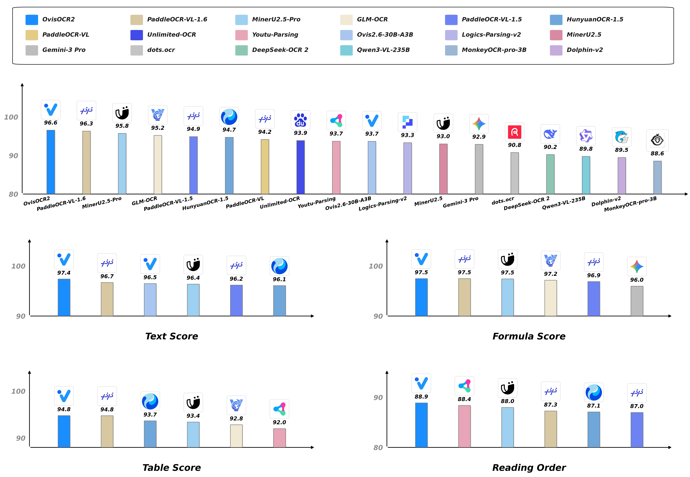
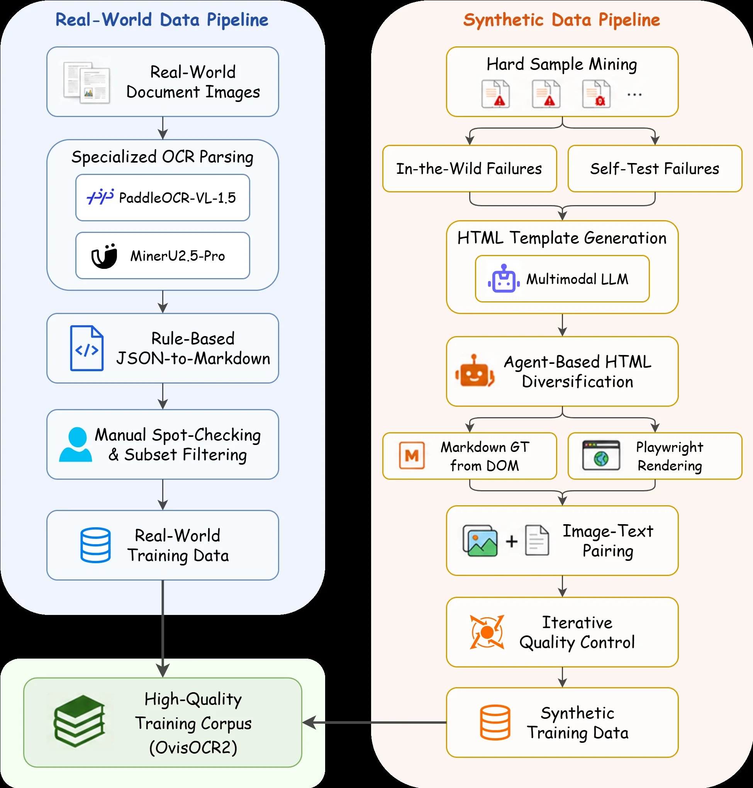
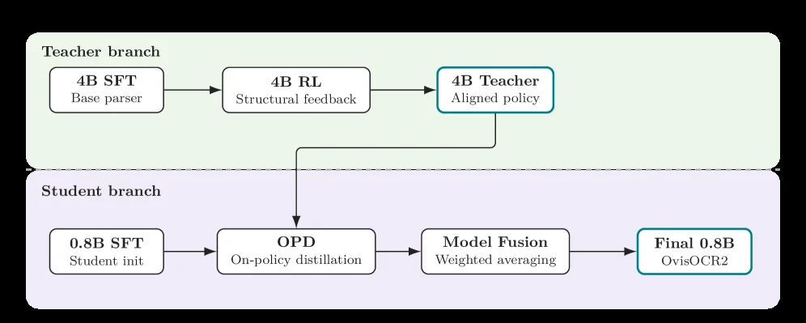
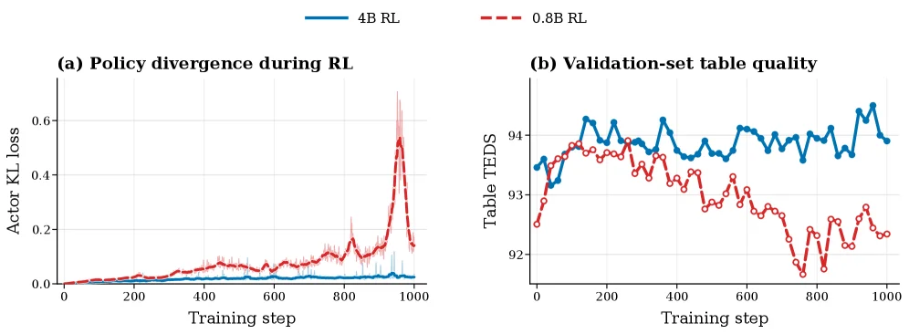
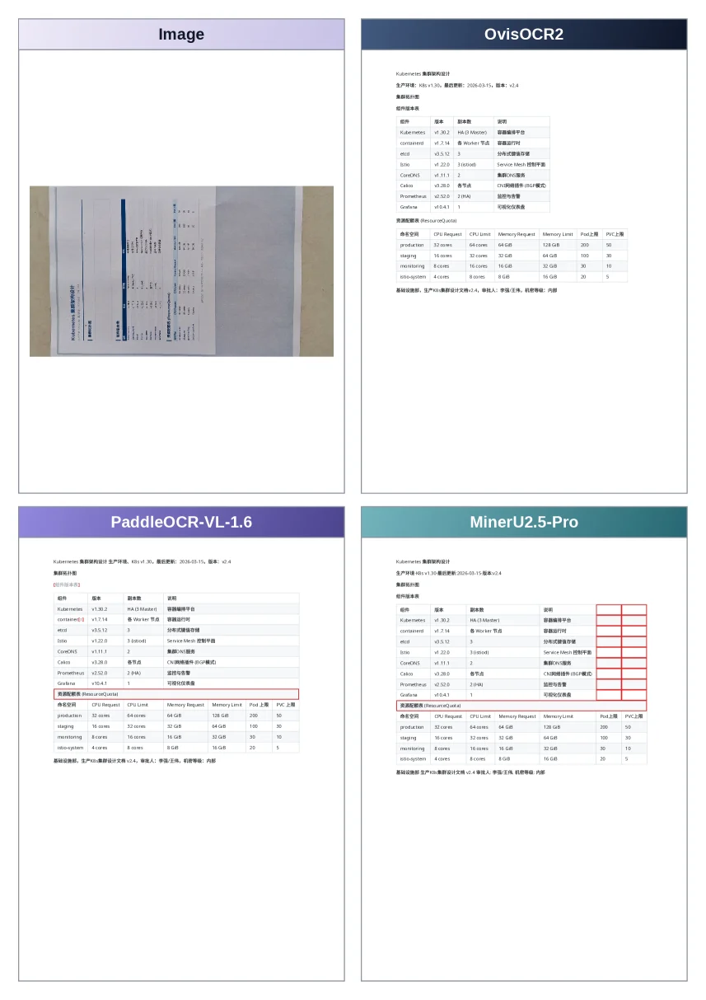
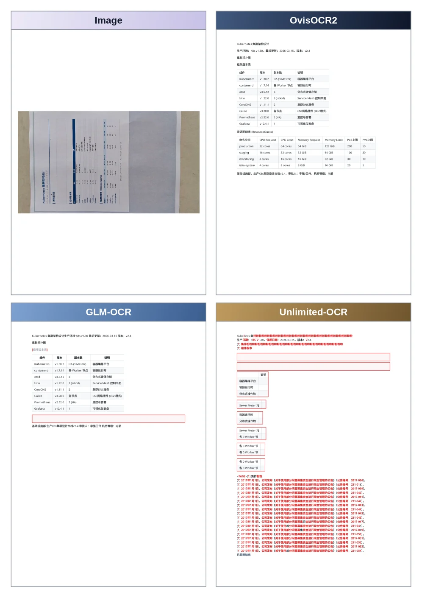
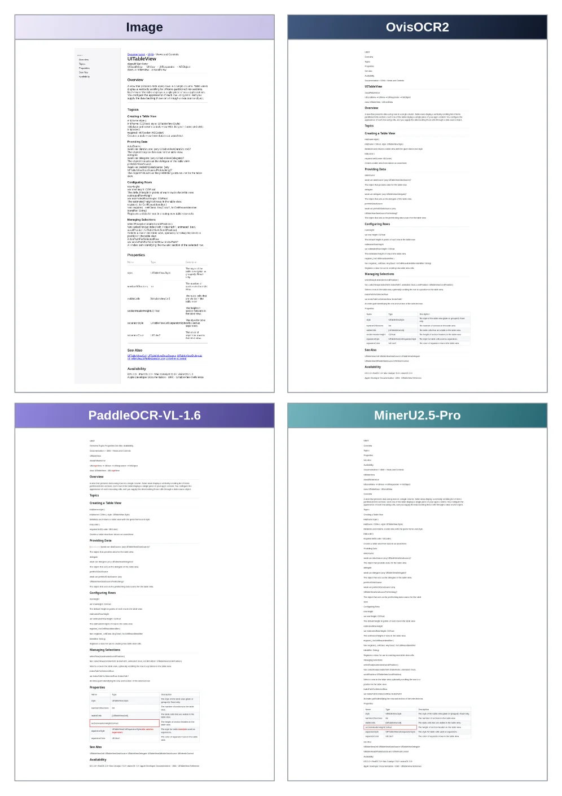
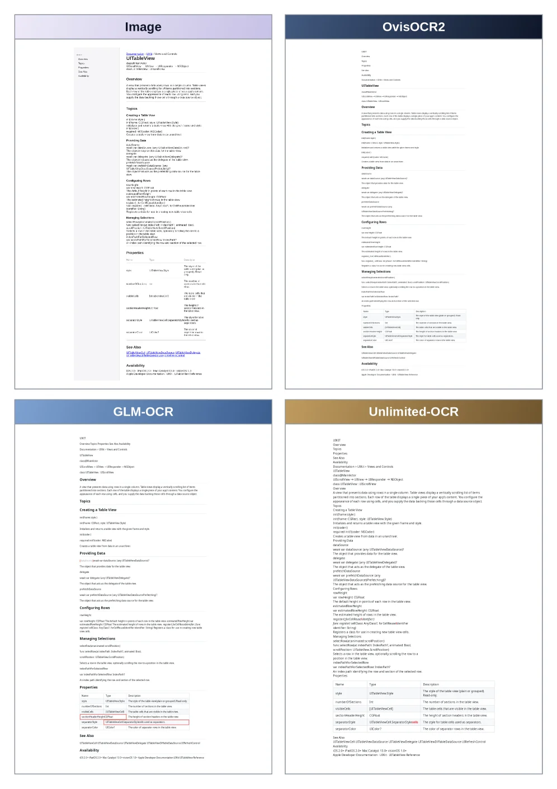
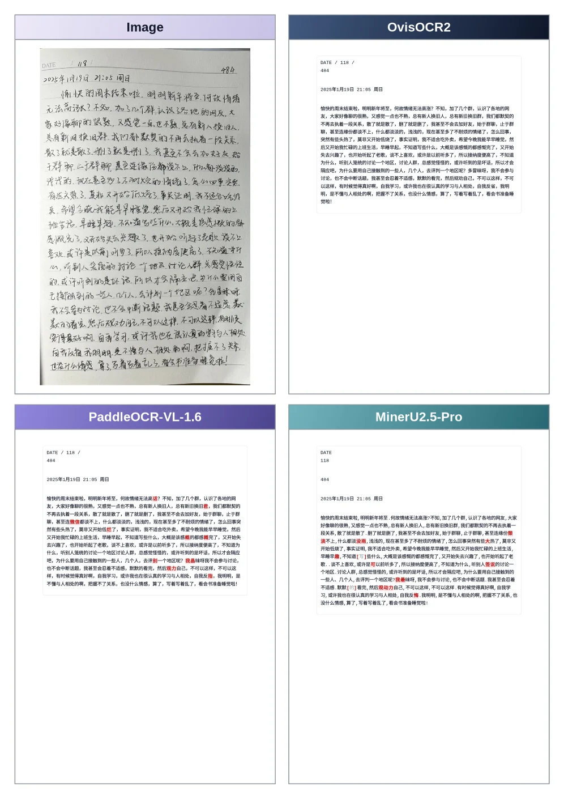
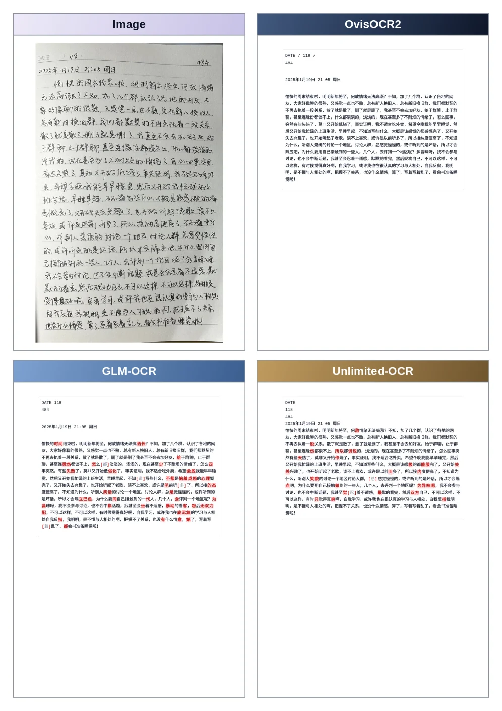

# OvisOCR2 Technical Report

[arXiv](https://arxiv.org/abs/2607.13639) · [HuggingFace](https://huggingface.co/papers/2607.13639) · ▲52

## Abstract (verbatim)

> We introduce OvisOCR2, a 0.8B document parsing model. OvisOCR2 is designed as an end-to-end parser: given a document page image, it generates a Markdown representation in natural reading order, covering text, formulas, tables, and visual regions. We build a data engine that combines filtered real-document annotations with synthetic pages whose rendered images and Markdown targets are derived from the same HTML source. The training recipe includes supervised fine-tuning, reinforcement learning on a 4B branch with a multi-component reward design, on-policy distillation into the 0.8B model, and model fusion. On OmniDocBench v1.6, OvisOCR2 achieves a state-of-the-art overall score of 96.58, placing an end-to-end model at the top of this leaderboard previously dominated by pipeline methods and highlighting the potential of end-to-end document parsing. On PureDocBench, OvisOCR2 also achieves the highest Avg3 score of 75.06. Beyond these two public benchmarks, we evaluate OvisOCR2 on an in-house benchmark designed to cover a broader set of long-tail and challenging scenarios. OvisOCR2 obtains the best overall performance among the compared methods, providing further evidence of its generalization and robustness. OvisOCR2 is available at https://huggingface.co/ATH-MaaS/OvisOCR2.

## Background

### Background Analysis  

**Technical Context**: Document parsing technology converts visually rich document images (e.g., scans, PDFs, or photos) into machine-readable structured formats like Markdown. It is critical for digital office workflows, knowledge management, and search engine indexing, where accurate extraction of text, tables, formulas, and their original layout/order is required. For example, enterprises need to digitize paper contracts into searchable electronic documents, while academic platforms extract structured data from paper-based research for retrieval.  

**Previous Limitations**: Existing approaches fall into two categories:  
1. **Pipeline Methods**: These process documents in sequential steps (layout analysis → content recognition → merging). While they perform well on benchmarks like OmniDocBench, they are complex to deploy and prone to error accumulation (e.g., misidentified table boundaries cannot be corrected downstream). Different modules also have uneven computational costs.  
2. **End-to-End Methods**: These use a single model to generate results directly, simplifying deployment but historically underperforming compared to pipelines. Prior end-to-end models struggled with long documents, complex layouts (e.g., nested tables), or handwritten content, leading to lower scores on public benchmarks.  

**OvisOCR2’s Solution**: This paper proposes an optimized end-to-end approach:  
- **Data Engine**: Combines real document annotations with synthetic data (generated from HTML templates to produce both images and corresponding Markdown), improving adaptability to diverse scenarios.  
- **Training Strategy**: Uses supervised fine-tuning, reinforcement learning (on a 4B-parameter model), on-policy distillation (compressed into 0.8B), and model fusion to balance performance and efficiency.  
- **Goal**: Achieve SOTA results with a lightweight model, surpassing current pipeline-based leaders.  

**Key Differences**: Compared to prior work, OvisOCR2 stands out by:  
1. **Performance Breakthrough in End-to-End Design**: For the first time, a single model outperforms pipelines on mainstream benchmarks like OmniDocBench.  
2. **Lightweight yet Efficient Training**: Achieves SOTA results using the small Qwen3.5-0.8B model, making it suitable for resource-constrained deployments.  
3. **Comprehensive Data Strategy**: Synthetic data augments real annotations, enhancing robustness.  

This work demonstrates the potential of end-to-end models in document parsing, offering a more efficient solution for practical applications.

## Method, Figure by Figure

> Figure 1: Performance of OvisOCR2 on OmniDocBench v1.6

This figure (Figure 1) from the paper "OvisOCR2 Technical Report" presents the performance of the OvisOCR2 model on the OmniDocBench v1.6 benchmark. We can break down this figure into several key components to understand it clearly:

First, the top section of the figure contains a legend that lists the various document parsing models being compared, along with their corresponding colors and icons. These models include OvisOCR2 (blue 'V' icon), PaddleOCR-VL-1.6 (light brown), MinerU2.5-Pro (light blue), GLM-OCR (beige), PaddleOCR-VL-1.5 (dark blue), HunyuanOCR-1.5 (dark cyan), and others like Unlimited-OCR, Youtu-Parsing, Qwen3-VL-235B, etc. This legend helps us identify which colored bar represents which model in the subsequent graphs.

The main body of the figure consists of four subplots, each corresponding to a different evaluation dimension: Overall Performance, Text Score, Formula Score, Table Score, and Reading Order. Each subplot is a bar chart where the x-axis represents different models, and the y-axis represents the score (in percentage).

1.  **Overall Performance (the topmost full bar chart)**:
    This chart shows the comprehensive scores of all models on OmniDocBench v1.6. OvisOCR2 (blue bar) achieves the highest score of 96.6, followed by PaddleOCR-VL-1.6 (96.3) and MinerU2.5-Pro (95.8). Other models like GLM-OCR (95.2) and PaddleOCR-VL-1.5 (94.9) follow with progressively lower scores. This chart clearly indicates that OvisOCR2 leads in overall performance compared to other compared models.

2.  **Text Score**:
    This subplot specifically evaluates the models' ability to recognize and parse textual content. OvisOCR2 (97.4) performs excellently again, slightly outperforming PaddleOCR-VL-1.6 (96.7) and MinerU2.5-Pro (96.5). This suggests that OvisOCR2 has strong capabilities in text processing.

3.  **Formula Score**:
    This chart measures the accuracy of models in parsing mathematical formulas. OvisOCR2 (97.5) ties for first place with PaddleOCR-VL-1.6 (97.5), demonstrating its excellent performance in formula parsing.

4.  **Table Score**:
    This chart assesses the models' ability to parse tabular data. OvisOCR2 (94.8) ties for first place with PaddleOCR-VL (94.8), indicating its strong performance in table handling.

5.  **Reading Order**:
    This subplot examines the models' ability to output content in a natural reading order. OvisOCR2 (88.9) performs the best in this evaluation, surpassing other models like Youtu-Parsing (88.4) and MinerU2.5-Pro (87.0). This shows that OvisOCR2 can effectively understand the document's layout and structure to output information in the correct order.

**Revealing How the Method Works**:
While this figure primarily displays results, combining it with the paper's abstract allows us to understand how OvisOCR2 achieves this high performance:
*   **End-to-End Design**: OvisOCR2 is an end-to-end document parser that takes a document page image as input and generates a Markdown representation in natural reading order, covering text, formulas, tables, and visual regions.
*   **Data Engine**: A data engine was built that combines filtered real-document annotations with synthetic pages. The rendered images and Markdown targets of these synthetic pages are derived from the same HTML source, which helps the model learn more realistic and diverse document representations.
*   **Training Strategy**: Advanced training techniques were employed, including supervised fine-tuning, reinforcement learning on a 4B-parameter branch with a multi-component reward design, on-policy distillation into the 0.8B model, and model fusion. These techniques collectively enhance the model's performance and generalization capabilities.

**Conclusion**:
From the figure, it is clear that OvisOCR2 achieves leading or co-leading scores across all evaluation dimensions on the OmniDocBench v1.6 benchmark. This demonstrates the strong performance and effectiveness of OvisOCR2 as an end-to-end document parsing model. It places an end-to-end model at the top of a leaderboard previously dominated by pipeline methods, highlighting the potential of end-to-end approaches in document parsing. For instance, in overall performance, OvisOCR2 (96.6) outperforms all other compared models; it also performs excellently in specific tasks like text, formula, table, and reading order parsing.

---

> Figure 2: Architecture of the data engine

This figure illustrates the architecture of OvisOCR2's data engine, which consists of two main parts: the **Real - World Data Pipeline** (left, light - blue background) and the **Synthetic Data Pipeline** (right, light - orange background). Ultimately, both pipelines contribute to building the High - Quality Training Corpus (OvisOCR2). Here's a detailed breakdown of each component and the data flow:

### Real - World Data Pipeline (Left, Light - Blue Background)
1. **Starting Point: Real - World Document Images**：This is the source of data, representing various document images obtained from the real world.
2. **Specialized OCR Parsing**：Two tools, `PaddleOCR - VL - 1.5` and `MinerU2.5 - Pro`, are used to parse the document images. The goal of this step is to extract preliminary text or structural information from the images.
3. **Rule - Based JSON - to - Markdown**：The JSON - formatted data obtained from the OCR parsing in the previous step is converted to Markdown format according to certain rules. Markdown is a lightweight markup language that is convenient for subsequent processing and reading.
4. **Manual Spot - Checking & Subset Filtering**：Through manual inspection, the Markdown data after conversion is spot - checked, and non - compliant data subsets are filtered out to ensure data quality.
5. **Real - World Training Data**：After the previous steps, the real - world training data is obtained.
6. **High - Quality Training Corpus (OvisOCR2)**：The real - world training data eventually flows into this corpus and becomes a part of it.

### Synthetic Data Pipeline (Right, Light - Orange Background)
1. **Starting Point: Hard Sample Mining**：This step is to mine samples that are difficult to handle. These samples will lead to two types of failures:
    - **In - the - Wild Failures**：Problematic samples that occur in actual application scenarios.
    - **Self - Test Failures**：Problematic samples discovered during the model's self - testing process.
2. **HTML Template Generation**：A **Multimodal LLM** is used to generate an HTML template. A multimodal large model can handle multiple modalities such as images and texts, thus generating a suitable HTML structure.
3. **Agent - Based HTML Diversification**：An Agent (intelligent agent) is used to diversify the generated HTML to increase data diversity.
4. **Two Parallel Outputs**：
    - **Markdown GT from DOM**：The ground - truth Markdown format is extracted from the Document Object Model (DOM).
    - **Playwright Rendering**：The Playwright tool is used to render the HTML to obtain the corresponding image.
5. **Image - Text Pairing**：The Markdown (text) obtained in the previous step and the rendered image are paired to form an image - text pair.
6. **Iterative Quality Control**：Iterative quality control is performed on the image - text pairs to ensure data quality.
7. **Synthetic Training Data**：After quality control, the synthetic training data is obtained.
8. **High - Quality Training Corpus (OvisOCR2)**：The synthetic training data eventually also flows into this corpus, and together with the real - world training data, it constitutes the high - quality training corpus.

### Data Flow and Method Operation
- The real - world data pipeline starts from real document images and goes through steps such as OCR parsing, format conversion, and manual filtering to obtain high - quality real - world training data.
- The synthetic data pipeline starts from hard - example mining and generates HTML templates through a multimodal large model. Then, through agent diversification, rendering, pairing, and quality control, high - quality synthetic training data is obtained.
- Finally, these two parts of data (real - world training data and synthetic training data) together form the high - quality training corpus of OvisOCR2. This corpus will be used for the training of the OvisOCR2 model (including steps such as supervised fine - tuning, reinforcement learning, policy distillation, and model fusion) to make OvisOCR2 an excellent model that can parse documents end - to - end (generating Markdown representations in natural reading order, covering text, formulas, tables, and visual regions).

### Summary
This figure clearly shows how OvisOCR2's data engine works: by combining the careful processing of real - world data and the innovative generation of synthetic data, a high - quality training corpus is built to provide data support for subsequent model training. Ultimately, OvisOCR2 achieves excellent results in multiple document parsing benchmark tests.

---

> Figure 3: Two-branch training of OvisOCR2. The 4B branch produces an RL-aligned teacher, while the 0.8B branch proceeds through SFT, OPD, and model fusion to obtain the final model.

This diagram illustrates the **dual-branch training pipeline** of the OvisOCR2 model, clearly presenting the design logic and data/information flow of the "Teacher branch" and "Student branch." It helps us understand how the model completes training and obtains the final model through the collaboration of the two branches:  

### 1. Teacher Branch (Light Green Area): Generating an RL-Aligned Teacher Model  
The goal of the teacher branch is to train a "policy-aligned" teacher model to provide guidance for the subsequent knowledge distillation in the student branch. The process is as follows:  
- **Step 1 (4B SFT - Base Parser)**: Starting with a "4B-parameter basic parser," the model is initialized through **Supervised Fine-Tuning (SFT)** to learn basic document parsing capabilities (such as recognizing text, formulas, tables, etc.).  
- **Step 2 (4B RL - Structural Feedback)**: Building on the basic parser, **Reinforcement Learning (RL)** is introduced, and the model is optimized through "structural feedback." Here, "structural feedback" may design rewards for the structural rationality of documents (such as reading order, element hierarchy, etc.), allowing the model to learn a parsing strategy that better aligns with human reading habits.  
- **Step 3 (4B Teacher - Aligned Policy)**: After RL training, the "4B Teacher Model (Aligned Policy)" is obtained. Its strategy (i.e., the way of parsing documents) is aligned to a more optimal state and will serve as the "teacher" for the subsequent student branch, providing distilled knowledge.  

### 2. Student Branch (Light Purple Area): From SFT to the Final Model (OvisOCR2)  
The goal of the student branch is to train a lighter (0.8B parameters) but high-performing final model based on the knowledge of the teacher model. The process is as follows:  
- **Step 1 (0.8B SFT - Student Init)**: Starting with a "0.8B-parameter student initialization model," it is also initialized through **Supervised Fine-Tuning (SFT)** to prepare for subsequent distillation.  
- **Step 2 (OPD - On-Policy Distillation)**: **On-Policy Distillation (OPD)** is introduced. The key here is to **obtain knowledge from the "4B Teacher Aligned Policy" in the teacher branch** (the arrow reflects the transfer of knowledge: the teacher model's strategy is used to guide the student model's distillation). Online policy distillation means that the student "imitates" the teacher's **real-time strategy** (rather than predefined static knowledge), thus learning a more flexible parsing capability.  
- **Step 3 (Model Fusion - Weighted Averaging)**: Model fusion is performed through **weighted averaging**. This step may involve weighted merging of the distilled student model with the initial model (or other intermediate models) to balance the training results of different stages and improve the model's stability and performance.  
- **Step 4 (Final 0.8B - OvisOCR2)**: After the above steps, the final "0.8B Model (OvisOCR2)" is obtained, which is the end-to-end document parsing model introduced in the paper.  

### Core Logic of the Method (Operational Mode Understood from the Diagram)  
The training of OvisOCR2 is divided into two core stages: **"Teacher Pretraining (RL Alignment)"** and **"Student Lightweight Distillation + Fusion"**:  
- The teacher branch learns a better document parsing strategy (structure-aligned strategy) through the method of "large parameters (4B) + Reinforcement Learning (RL)," solving the problem of "how to parse documents with reasonable structure and in line with human reading habits."  
- The student branch, through "small parameters (0.8B) + Online Policy Distillation (OPD) + Model Fusion," inherits the excellent parsing strategy of the teacher model while maintaining lightness, and further improves performance through fusion. This design of "large model as teacher, small model as student" not only utilizes the capabilities of the large model (structure understanding, reinforcement learning optimization) but also makes the student model more suitable for actual deployment through lightweighting, while ensuring performance (such as the SOTA performance mentioned in the paper on benchmarks like OmniDocBench, PureDocBench, etc.).  

### Supplementary Explanation (Handling "Unclear/Uncertain" Parts in the Diagram)  
The direction of the arrows in the diagram clearly shows the **direction of data/knowledge flow**: the output of the teacher branch (4B Teacher Aligned Policy) serves as the input for the "OPD" step in the student branch; inside the student branch, the order is "initialization → distillation → fusion → final model." The functions of all components (such as SFT, RL, OPD, Model Fusion) are clearly labeled, so the logic of the entire training process can be inferred: **first train a powerful teacher model (4B branch), then use this teacher model to guide the training of the lightweight student model (0.8B branch), and finally obtain a high-performance small model (OvisOCR2)**.

---

> Figure 4: Training stability comparison between 4B RL and 0.8B RL. Panel (a) reports actor KL loss, with faint traces showing raw per-step values and bold curves showing 15-step centered rolling means. Panel (b) reports table TEDS on the validation set.

This figure (Figure 4) from the paper "OvisOCR2 Technical Report" is used to compare the training stability and performance of reinforcement learning (RL) with 4B and 0.8B parameter scales. We analyze the two subplots in detail:

First, look at subplot (a), titled "Policy divergence during RL". This subplot shows the change of **Actor KL loss** with **Training step**. There are two curves: the blue solid line represents the "4B RL" model, and the red dashed line represents the "0.8B RL" model. The "faint traces" in the figure show the raw values of each step, while the "bold curves" are the results after 15 - step centered rolling averaging, which can more clearly show the trend. From the figure, we can see that in most of the training steps, the KL loss of the 4B RL model (blue) remains at a relatively low and stable level, while the KL loss of the 0.8B RL model (red) has significant fluctuations and peaks between about 800 and 1000 training steps. This may indicate that the 0.8B model has greater policy divergence during reinforcement learning and poorer training stability.

Next, look at subplot (b), titled "Validation - set table quality". This subplot shows the change of **Table TEDS** (a certain quality assessment indicator for tables, which may be Table Error Detection Score or other related indicators) with **Training step**. There are also two curves: the blue solid line represents the "4B RL" model, and the red dashed line represents the "0.8B RL" model. From the figure, we can see that the Table TEDS of the 4B RL model (blue) remains at a relatively high level (about 93 to 94) during the training process, and the fluctuation is relatively small; while the Table TEDS of the 0.8B RL model (red) gradually decreases after about 600 training steps, and there is an obvious trough after 800 steps. This indicates that the table quality of the 0.8B model on the validation set decreases with the increase of training steps, while the table quality of the 4B model is relatively stable and higher.

Combining these two subplots, we can draw the following conclusions: During the reinforcement learning training process, the 4B - parameter - scaled model (4B RL) has better training stability (manifested as lower and less variable KL loss) and higher validation - set table quality (manifested as higher and more stable Table TEDS) than the 0.8B - parameter - scaled model (0.8B RL). This may mean that larger models can learn more effective strategies better in the reinforcement learning stage, thus performing more stably and better in document parsing tasks (especially table processing).

It should be noted that the "Actor KL loss" in the figure is usually used to measure the difference between the distribution of the output of the policy network and the target distribution. The lower the KL loss, the more stable the strategy; while the "Table TEDS" is used to evaluate the quality of the tables generated by the model, and the higher the score, the better the table quality. By comparing these two indicators on the two models with different scales, we can clearly see that the 4B RL model is superior to the 0.8B RL model in terms of training stability and table quality.

---

> Figure A.1: Qualitative comparison on a table document.

This figure (Figure A.1) presents a qualitative comparison of OvisOCR2 on a table document, showcasing the output or related configuration information for the same document image containing a table, as processed by four different models or systems: Image, OvisOCR2, PaddleOCR-VL-1.6, and MinerU2.5-Pro.

First, let's examine the "Image" panel in the top-left corner. This panel displays an actual document image, which includes a table. This image serves as the input data for all models to be parsed. The table structure within the image is clear, with multiple rows and columns, designed to test the models' ability to recognize and parse table content.

Next is the "OvisOCR2" panel in the top-right corner. This panel provides detailed information about the OvisOCR2 model. At the top, there is basic model information, including its name "OvisOCR2," and some version and training-related metadata, such as "Kubernetes cluster deployment design," "Production environment: k8s v1.36, base image: 2024-03-15, version: v2.4." Below this is a "Component Version Table," listing various software packages and their versions that OvisOCR2 depends on, such as Kubernetes, containerd, etcd, CoreDNS, etc. These are the environmental configurations required to run OvisOCR2. Further down is the "Resource Quota Table (ResourceQuota)," which details the CPU and memory requests (Request) and limits (Limit) for different namespaces (e.g., production, staging, monitoring, kubo-system), as well as Pod and PVC upper limits. This indicates the specific resource demands for deploying OvisOCR2. At the bottom is the "Base Resource Quota," providing more macro-level resource limit information. This panel reveals the operating environment and resource configuration of OvisOCR2, which is fundamental for its correct document parsing.

Then, there is the "PaddleOCR-VL-1.6" panel in the bottom-left corner. The structure of this panel is similar to that of OvisOCR2, also including the model's basic information, component version table, and resource quota table. It shows the configuration and resource requirements of another OCR model, PaddleOCR-VL-1.6. By comparing the resource quota tables of OvisOCR2 and PaddleOCR-VL-1.6, differences in their resource allocation can be observed. For example, under the production namespace, the CPU Limit for OvisOCR2 is 32 cores, while for PaddleOCR-VL-1.6, it is 64 cores. This may affect the model's inference speed or its ability to handle complex documents.

Finally, there is the "MinerU2.5-Pro" panel in the bottom-right corner. This panel also follows a similar format, displaying the basic information, component version table, and resource quota table for the MinerU2.5-Pro model. The values in its resource quota table differ from those of the other models. For instance, under the production namespace, the CPU Request is 32 cores, and the Memory Request is 64 GiB. This indicates that each model has its specific resource configuration requirements.

This figure reveals the operational context of the OvisOCR2 method. Although the figure does not directly display the parsing process or result comparisons (such as specific text recognition or table structure reconstruction content), it provides a framework for understanding OvisOCR2's operating environment and comparison with other models by showing the configuration information and resource allocation of the four models. The "qualitative comparison" in the figure may be reflected in the parsing quality of these models on the same document image, which may be related to their resource allocation, model architecture, and training methods. By observing the configuration differences of these models, it can be speculated that OvisOCR2 may have optimized resource utilization efficiency or can achieve better parsing results under specific configurations. For example, OvisOCR2 may have more stringent resource limits than other models in some aspects but still achieve excellent performance, indicating the effectiveness of its model architecture or training strategy.

In summary, this figure provides a comprehensive view of the operating environment of OvisOCR2 and its comparison with other models by showcasing the configuration and resource requirements of four models (including OvisOCR2) for parsing the same table document image. Although the specific parsing results are not directly shown, this configuration information is crucial for evaluating the models' performance and feasibility in practical applications.

---

> Figure A.2: Qualitative comparison on a table document (continued).

This figure (Figure A.2) is a qualitative comparison figure in the paper "OvisOCR2 Technical Report," titled "Figure A.2: Qualitative comparison on a table document." It shows the performance comparison of different OCR models when processing table documents. The figure contains four main sections, corresponding to different OCR models or methods: Image, OvisOCR2, GLM-OCR, and Unlimited-OCR.

1. **Image Section**: This is the original table document image, serving as the input data. The image shows a table with multiple rows and columns, containing text and some visual elements. This part is the starting point for all OCR models to process, displaying the original document content that needs to be parsed.

2. **OvisOCR2 Section**: This part shows the parsing result of the OvisOCR2 model on the input image. The result is presented in a structured way, including the content and layout of each cell in the table. The output of OvisOCR2 looks very clear and accurately restores the structure and content of the original table. This part demonstrates the high precision and accuracy of OvisOCR2 in processing table documents.

3. **GLM-OCR Section**: This part shows the parsing result of the GLM-OCR model on the same input image. The result shows some table content and layout, but compared with OvisOCR2, there may be some differences or errors. This part is used to compare the performance differences between GLM-OCR and OvisOCR2 in processing table documents.

4. **Unlimited-OCR Section**: This part shows the parsing result of the Unlimited-OCR model on the input image. The result shows the table content and layout, but compared with OvisOCR2, there may be more differences or errors. This part is used to further compare the performance differences between Unlimited-OCR and OvisOCR2 in processing table documents.

Through this figure, we can clearly see the advantages of OvisOCR2 in processing table documents. OvisOCR2 can accurately parse the structure and content of the table, while other models may have some deficiencies in certain aspects. This indicates that OvisOCR2 has high performance and accuracy in document parsing tasks.

In summary, this figure, by comparing the performance of different OCR models when processing table documents, demonstrates the advantages and accuracy of OvisOCR2 in document parsing tasks. OvisOCR2 can accurately restore the structure and content of the original table, while other models may have some deficiencies in certain aspects. This provides strong evidence for the application of OvisOCR2 in document parsing tasks.

---

> Figure A.3: Qualitative comparison on a table document.

This figure (Figure A.3) presents a qualitative comparison of four different OCR or document parsing systems on a document containing a table. The title "Qualitative comparison on a table document" accurately summarizes its content. The core purpose of this figure is to visually demonstrate the performance differences of various systems in parsing complex table structures.

The structure of the figure is divided into four main sections, each representing a different system or method:
1.  **Top-left: "Image"**: This section displays the original input image, which is a document page containing a table. This is the raw data that all systems analyze. The image content is a typical table with multiple rows and columns, and some text and possibly numbers. This section serves as a baseline for comparison with the outputs of other systems.

2.  **Top-right: "OvisOCR2"**: This section shows the parsing result of the system named OvisOCR2 on the input image. OvisOCR2 is the 0.8B-parameter document parsing model introduced in this paper. Its output appears to be a structured text representation, possibly in Markdown format, attempting to reproduce the content and layout of the original table. We can see that the parsed result tries to clearly organize the table's row and column content, for example, using vertical bars (|) to separate columns or some form of indentation and line breaks to represent rows. This section demonstrates OvisOCR2's ability to understand table structure and extract content.

3.  **Bottom-left: "PaddleOCR-VL-1.6"**: This section displays the parsing result of another system, "PaddleOCR-VL-1.6" (version 1.6), on the same table image. Similar to OvisOCR2, this section presents the text representation of the table as processed by this system. By comparing the output in this section with that of OvisOCR2, one can observe differences in the accuracy of table content recognition and structural reconstruction. For instance, some cells' content might be correctly identified, while others might be missed, incorrectly recognized, or poorly formatted.

4.  **Bottom-right: "MinerU2.5-Pro"**: This section shows the parsing result of the third system, "MinerU2.5-Pro," on the input table image. Similarly, this section presents the output of this system's processing of the table image. By comparing the outputs of this system with the other two, one can evaluate MinerU2.5-Pro's performance in table parsing.

**Flow of data or information**:
This figure does not depict a dynamic process or data flow but rather a static comparison of results. The logical sequence is:
*   First, a common input is provided (the original table image in the "Image" section).
*   Then, the results of three different systems (OvisOCR2, PaddleOCR-VL-1.6, and MinerU2.5-Pro) for this input are shown side-by-side.
*   The viewer assesses the performance of these systems by visually comparing their outputs.

**What this figure reveals about how the method works (from a comparative perspective)**:
While this figure does not directly show the internal workings of OvisOCR2 (such as its model architecture or training process), it indirectly demonstrates its effectiveness through qualitative comparison with other systems. OvisOCR2 is designed as an end-to-end parser capable of generating a Markdown representation in natural reading order from a document image, covering text, formulas, tables, and visual regions. By showing OvisOCR2's parsing results alongside those of other systems (like PaddleOCR-VL-1.6 and MinerU2.5-Pro), the figure allows readers to intuitively judge the accuracy and clarity of OvisOCR2 in handling complex table structures. If OvisOCR2's output is more structurally complete, accurate in content, or more readable than others, it suggests that its design approach is effective.

**If this is a result figure, clarify coordinates, comparison objects, and conclusions**:
This figure is a result of a qualitative comparison. It does not have specific coordinate data but presents conclusions through visual comparison.
*   **Comparison objects**: The comparison objects are three different document parsing systems: OvisOCR2, PaddleOCR-VL-1.6, and MinerU2.5-Pro. They all process the same input image (the "Image" in the top-left).
*   **Conclusion**: By observing the outputs of each system in the figure, qualitative conclusions about their performance in the table parsing task can be drawn. For example, if OvisOCR2's output table has a clearer structure and more accurate content recognition, it can be concluded that OvisOCR2 performs better in this task. This figure aims to intuitively demonstrate the advantages or characteristics of OvisOCR2 relative to other systems, supporting the paper's claim that OvisOCR2 achieves state-of-the-art performance in document parsing. Specifically, viewers can compare whether the parsed tables from each system completely reproduce the rows and columns from the original image, whether the text is correctly identified, and whether the format is understandable. Although the figure does not explicitly label which output is the best, careful observation can infer that the authors intend to show OvisOCR2's parsed result as superior or at least comparable to other systems in some aspect.

---

> Figure A.4: Qualitative comparison on a table document (continued).

This figure (Figure A.4) from the paper "OvisOCR2 Technical Report," titled "Figure A.4: Qualitative comparison on a table document (continued)," provides a visual comparison of the performance of different OCR or document parsing systems on a table document. It shows the input image and the parsed outputs from four different systems or methods.

The layout is divided into four main sections, each representing a different system:

1.  **Top-Left: Image (Original Image)**
    *   This section displays the original table document image used as input. It contains a table with several rows and columns, with content related to "UITableView" and its properties and methods, such as "Overview," "Topics," "Creating a Table View," etc. This image serves as the basis for all subsequent processing.

2.  **Top-Right: OvisOCR2**
    *   This section shows the parsing result of the OvisOCR2 model on the original image. The result is presented in a structured text format, attempting to reproduce the content and structure of the original table.
    *   We can see that OvisOCR2's output includes headings (e.g., "UITableView"), subheadings (e.g., "Overview," "Topics"), and list items (e.g., "Creating a Table View," "Providing Data"). Its format attempts to mimic the hierarchical structure and content of the original table.
    *   Visually, OvisOCR2's output performs well in text recognition and structure restoration, clearly displaying the various sections and their content within the table.

3.  **Bottom-Left: GLM-OCR**
    *   This section shows the parsing result of the GLM-OCR model on the same original image.
    *   Its output is also structured text, containing headings, subheadings, and list items. For example, elements like "UITableView," "Overview," "Creating a Table View" can be seen.
    *   Compared to OvisOCR2, GLM-OCR's output might differ slightly in format and content completeness, but it similarly attempts to extract key information from the table.

4.  **Bottom-Right: Unlimited-OCR**
    *   This section shows the parsing result of the Unlimited-OCR model on the original image.
    *   Its output is also structured text, containing headings, subheadings, and list items. For example, "UITableView," "Overview," "Creating a Table View," etc.
    *   From the figure, it can be seen that Unlimited-OCR's output also attempts to restore the table's structure and content, but its organization of format and content might differ from OvisOCR2 and GLM-OCR.

**Methodology Revealed by the Figure:**

This figure does not directly show the specific operational mechanisms of the OvisOCR2 method (such as training process or model architecture). Instead, it demonstrates the **output results** of OvisOCR2 as a document parsing model when processing table documents through a **qualitative comparison**. It implies that OvisOCR2's approach can convert table images into structured text representations, such as Markdown or other formats, thereby preserving the layout and content information of the original document.

**Comparison Objects and Conclusions:**

*   **Comparison Objects:** The figure compares the output of OvisOCR2 with the outputs of two other OCR systems (GLM-OCR and Unlimited-OCR). The original input image is the common object of parsing for all.
*   **Conclusions (Based on Visual Comparison):** Although the figure does not provide explicit scores or quantitative metrics, the following preliminary conclusions can be drawn from visual inspection:
    *   OvisOCR2's output demonstrates good format clarity and content completeness, effectively restoring the hierarchical structure and content of the original table.
    *   Compared to the other two systems, OvisOCR2's output might have advantages in text recognition accuracy, list item formatting, or overall structure organization (this requires judgment based on specific visual details, but overall, OvisOCR2's output appears more regular and readable).
    *   This figure aims to support the paper's claim about OvisOCR2's excellent performance in document parsing tasks, particularly in handling structured documents like tables, through visual examples.

In summary, this figure provides a visual comparison of the performance of different systems on a table document by showing their parsed outputs. OvisOCR2's output performs well visually, indicating its high accuracy and readability in recognizing and structuring table content.

---

> Figure A.5: Qualitative comparison on a handwritten document.

This figure is **Figure A.5** from the paper *OvisOCR2 Technical Report*, titled "Qualitative Comparison of Handwritten Document Processing." It visually demonstrates the performance differences between various OCR (Optical Character Recognition) or document parsing models when processing the same handwritten document image, highlighting the advantages of OvisOCR2.

---

### Figure Structure and Components:
The figure is divided into four main sections, each corresponding to a different model or method, arranged from left to right and top to bottom as follows:

1. **Top-Left: Original Handwritten Document Image (Image)**  
   This is the input processed by all models, showing a document containing handwritten Chinese text. The top of the image is labeled "DATE / 118 / 484," and the content includes handwritten notes about weekend experiences, social interactions, and personal reflections. This section serves as the "input source" for all models, while the subsequent three sections display the "output results" generated by different models for this input.

2. **Top-Right: Output of OvisOCR2**  
   This section shows the parsing result of the OvisOCR2 model for the original handwritten document. The output is structured text (likely in Markdown format), closely matching the content of the original handwritten document. The formatting is clear, accurately identifying and reconstructing the content and structure of the handwritten text. This demonstrates OvisOCR2's capability as an end-to-end document parsing model: given a document image, it generates a Markdown representation with natural reading order (covering text, formulas, tables, and visual regions).

3. **Bottom-Left: Output of PaddleOCR-VL-1.6**  
   This section displays the parsing result of another OCR model, PaddleOCR-VL-1.6. Compared to OvisOCR2's output, the text formatting and recognition accuracy here may differ (e.g., some text may be less clear or accurate). This comparison highlights OvisOCR2's advantages in handling handwritten documents.

4. **Bottom-Right: Output of MinerU2.5-Pro**  
   This section shows the parsing result of a third model, MinerU2.5-Pro. Similar to the comparison with OvisOCR2's output, the text recognition or formatting here may have shortcomings, further emphasizing OvisOCR2's superior performance.

---

### Revealing the Method's Operation (Through Comparison):
This figure uses **qualitative comparison** to illustrate how OvisOCR2 works:
- **Input**: A handwritten document image (e.g., the "Image" section in the top-left).
- **Processing**: OvisOCR2 acts as an end-to-end parser, directly extracting text from the image and generating a structured Markdown representation in natural reading order (as shown in the top-right output).
- **Output**: Clear, accurate text that aligns with the original document's content, with reasonable formatting that reconstructs the handwritten text's content and structure.

Compared to the outputs of other models (PaddleOCR-VL-1.6 and MinerU2.5-Pro), OvisOCR2's output excels in **accuracy** (correct text recognition) and **readability** (clear formatting and natural reading order). This demonstrates that OvisOCR2's design—combining a data engine trained on filtered real document annotations and synthetic pages, supervised fine-tuning, reinforcement learning, policy distillation, and model fusion—enables it to better handle the complexity of handwritten documents.

---

### Conclusion (Derived from the Figure):
- **Comparison Subjects**: Three models—OvisOCR2, PaddleOCR-VL-1.6, and MinerU2.5-Pro.
- **Sections/Areas**: Four sections correspond to the input and outputs of the three models.
- **Conclusion**: When processing handwritten documents, OvisOCR2 generates more accurate and readable text outputs than the other compared models. This validates OvisOCR2's effectiveness and superiority as an end-to-end document parsing model, supporting the paper's claims about its state-of-the-art results on benchmarks like OmniDocBench v1.6 and PureDocBench.

This figure uses intuitive qualitative comparison to help readers quickly understand OvisOCR2's advantages in document parsing tasks—specifically, its ability to more accurately recognize handwritten text and generate structured outputs—highlighting the potential of end-to-end methods over traditional pipeline approaches.

---

> Figure A.6: Qualitative comparison on a handwritten document (continued).

This figure (Figure A.6) is a **qualitative comparison chart** from the paper "OvisOCR2 Technical Report," used to demonstrate the performance differences of various OCR (Optical Character Recognition) or document parsing models when processing **handwritten documents**. It is part of the "Continuation" section (likely a subplot in a series of comparisons). We analyze the four sections of the figure (from left to right, top to bottom):  

### 1. Top-left: Original Handwritten Document (Image)  
- **Content**: This is an image of a handwritten Chinese document containing a date (January 19, 2025, 21:05, Sunday), page number (118/484), and a paragraph of handwritten text. The text reflects personal thoughts on emotions, social interactions, and learning (e.g., "The pleasant weekend has ended...").  
- **Purpose**: Serves as the **input sample**, showcasing the appearance of the original handwritten document to be parsed, including writing style, layout (e.g., paragraphs, line breaks), and image quality (e.g., cursive handwriting, blurriness).  

### 2. Top-right: Output of OvisOCR2  
- **Content**: This is the parsing result of the OvisOCR2 model for the handwritten document, presented in **text form** (likely Markdown or another structured format, but here it is primarily plain text transcription). The text corresponds to the original handwritten document, attempting to restore the accuracy and format of the handwritten content (e.g., line breaks, paragraphs).  
- **Purpose**: Demonstrates the **parsing capability** of OvisOCR2, i.e., its accuracy in recognizing and transcribing text from handwritten images. By comparing the original image with OvisOCR2’s output, one can evaluate the model’s precision in recognizing handwritten text (e.g., correctly identifying cursive or blurry characters, maintaining paragraph structure).  

### 3. Bottom-left: Output of GLM-OCR  
- **Content**: This is the parsing result of another OCR model (GLM-OCR) for the handwritten document, also in text form. Some parts of the text may be **highlighted in red** (presumably indicating recognition errors or areas requiring special attention, such as incorrect characters or formatting issues).  
- **Purpose**: Acts as a **comparison object**, contrasting with OvisOCR2’s output to show GLM-OCR’s performance in parsing handwritten documents. The red-highlighted sections may reflect the model’s shortcomings (e.g., recognition errors, omissions, or formatting mistakes), thereby highlighting OvisOCR2’s advantages.  

### 4. Bottom-right: Output of Unlimited-OCR  
- **Content**: This is the parsing result of a third OCR model (Unlimited-OCR) for the handwritten document, presented in text form. The text’s formatting and content are compared with the original document and OvisOCR2’s output.  
- **Purpose**: Serves as another **comparison object**, displaying Unlimited-OCR’s parsing results and further comparing them with OvisOCR2 to assess performance differences among models in handwritten document parsing (e.g., accuracy, format restoration).  

### Revealing Methodology (Through Comparison):  
This figure uses **qualitative comparison** to highlight OvisOCR2’s strengths in handling handwritten documents:  
- **Input**: The original handwritten document (Image) provides a "real-world" sample requiring parsing, including the complexity of handwritten text (e.g., cursive writing, personal writing styles).  
- **Model Outputs**: OvisOCR2’s output (top-right) is compared with those of other models (GLM-OCR, Unlimited-OCR, bottom-left and bottom-right), focusing on:  
  - **Accuracy**: Whether OvisOCR2 more accurately recognizes handwritten text (e.g., correct characters, punctuation, paragraph structure).  
  - **Format Restoration**: Whether it maintains the original document’s paragraph and line break formatting.  
  - **Error Handling**: Whether errors (marked in red in other models like GLM-OCR) are corrected in OvisOCR2’s output.  

### Observable Conclusion:  
- OvisOCR2’s output (top-right) appears closer to the original handwritten document’s content and format, while GLM-OCR’s output (bottom-left) has red-highlighted errors, and Unlimited-OCR’s output (bottom-right) may also be slightly inferior to OvisOCR2 in accuracy or formatting.  
- This indicates that OvisOCR2 performs better in **handwritten document parsing**, more accurately recognizing handwritten text and restoring formatting. It validates the effectiveness of the end-to-end document parsing method proposed in the paper (i.e., OvisOCR2, as an end-to-end model, outperforms other compared models in complex scenarios like handwritten documents).  

Summary: This figure **qualitatively compares** the performance of three models (OvisOCR2, GLM-OCR, Unlimited-OCR) in handwritten document parsing by showing the original handwritten document and their parsing outputs. It emphasizes OvisOCR2’s accuracy and format restoration capabilities, supporting the paper’s conclusion about OvisOCR2’s superior performance in handwritten document parsing tasks.
