# SEED: Self-Evolving On-Policy Distillation for Agentic Reinforcement Learning

[arXiv](https://arxiv.org/abs/2607.14777) · [HuggingFace](https://huggingface.co/papers/2607.14777) · ▲90

## 摘要（原文）

> Large language models are increasingly trained as interactive agents for long-horizon tasks involving multi-turn interaction, tool use, and environment feedback. Outcome-based reinforcement learning (RL) provides a practical optimization paradigm, but its sparse trajectory-level rewards offer limited guidance on intermediate decisions, leaving a supervision gap between episode-level outcomes and token-level policy learning. We propose SEED (SElf-Evolving On-Policy Distillation), a self-evolving framework that converts completed on-policy trajectories into training-time hindsight skills and distills their behavioral effect back into the policy model. SEED first fine-tunes the policy to analyze completed trajectories and generate natural-language skills that capture reusable workflows, decisive observations, or failure-avoidance rules. During RL, the current policy both collects trajectories and serves as the analyzer that extracts hindsight skills from them. Policy updates therefore improve subsequent decision making and skill analysis together, allowing hindsight supervision to evolve with the policy. SEED then re-scores the sampled actions under ordinary and skill-augmented contexts, converting the skill-induced probability shift into a dense token-level on-policy distillation signal. This signal is jointly optimized with outcome-based RL, keeping the auxiliary supervision aligned with the current trajectory distribution. Extensive experiments on text-based and vision-based agentic tasks show that SEED consistently improves performance and sample efficiency, exhibiting robust generalization to unseen scenarios. Our code is available at https://github.com/jinyangwu/SEED.

## 摘要（中译）

大型语言模型越来越多地被训练为用于涉及多轮交互、工具使用和环境反馈的长周期任务的交互式智能体。基于结果的强化学习（Reinforcement Learning，RL）提供了一种实用的优化范式，但其稀疏的轨迹级奖励对中间决策的指导有限，在剧集级结果和标记级策略学习之间留下了监督空白。我们提出了SEED（Self - Evolving On - Policy Distillation，自进化同策略蒸馏），这是一个自进化框架，它将已完成的同策略轨迹转换为训练时的后见之明技能，并将其行为效果提炼回策略模型。SEED首先微调策略以分析已完成的轨迹，并生成捕捉可重用工作流、关键观察或避免失败规则的自然语言技能。在RL过程中，当前策略既收集轨迹，又作为从轨迹中提取后见之明技能的分析器。因此，策略更新会同时改进后续的决策制定和技能分析，使后见之明的监督能够随着策略的进化而进化。然后，SEED在普通情境和技能增强情境下重新评估采样动作，将技能引起的概率转移转换为密集的标记级同策略蒸馏信号。该信号与基于结果的RL共同优化，使辅助监督与当前轨迹分布保持一致。在基于文本和基于视觉的智能体任务上的大量实验表明，SEED持续提高了性能和样本效率，对未见过的场景表现出稳健的泛化能力。我们的代码可在https://github.com/jinyangwu/SEED获取。

## 背景剖析

### 背景剖析  

**1. 技术背景与真实需求**  
近年来，大型语言模型（LLM）逐渐从单轮对话转向多轮交互式代理任务，例如工具调用、环境反馈处理和长期规划。这类场景要求模型在多步决策中学习如何收集信息、调用工具、解释反馈并调整策略。强化学习（RL）成为优化这类代理行为的关键方法，因为它能直接根据环境反馈调整策略。然而，真实场景中奖励信号往往稀疏且延迟（例如仅在任务完成时给出成功或失败信号），导致模型难以从中间步骤中学习有效行为，从而限制了其决策能力和样本效率。  

**2. 先前方法的局限性**  
传统RL方法依赖轨迹级奖励，但无法指导中间决策（例如，一个失败的轨迹可能包含部分正确行为，而成功的轨迹可能隐藏可复用的策略）。尽管已有研究尝试通过“事后反思”（hindsight learning）提取轨迹中的经验（如总结成功模式或失败原因），但这些方法通常将反思视为静态数据或外部记忆，无法随模型能力的提升而动态调整。此外，现有方法要么依赖固定教师模型提供监督，要么需要额外的推理轨迹或提示，导致监督信号与模型当前行为脱节。  

**3. 本文的解决方案**  
论文提出的SEED框架通过“自演进在线策略蒸馏”解决了这一问题。其核心思路是让模型在强化学习过程中同时扮演“决策者”和“分析者”两个角色：  
- **分析者角色**：模型从已完成的轨迹中提取自然语言描述的可复用技能（如关键观察、决策规则或避错策略）。  
- **决策者角色**：模型根据这些技能改进后续决策，并通过蒸馏机制将技能中的行为指导转化为细粒度的token级监督信号。  
通过这种自演进的循环，模型能够动态优化其行为分析和决策能力，而无需外部记忆或静态数据。  

**4. 与前人工作的关键差异**  
SEED的独特之处在于：  
- **动态监督**：反思信号不是固定的，而是随模型策略的改进而演化。  
- **密集监督**：将轨迹级的反思转化为token级的蒸馏信号，直接指导中间决策。  
- **自洽性**：模型在强化学习中同时完成决策和反思，避免了传统方法中教师模型与环境脱节的问题。  
这种方法使得SEED在长 horizon 代理任务中表现出更高的样本效率和鲁棒性。

## 方法图解

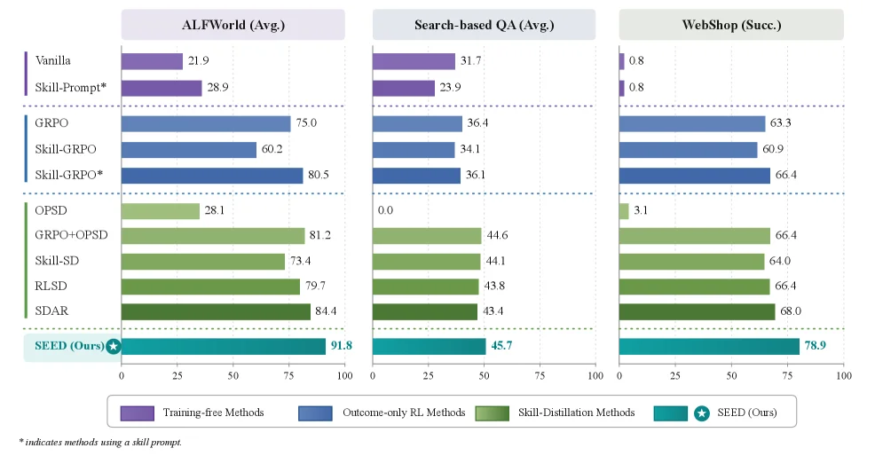

> Figure 1: Overall performance overview. Compared with powerful baseline methods, Seed achieves the strongest average performance across three representative agentic benchmarks.

这张图是论文《SEED: Self - Evolving On - Policy Distillation for Agentic Reinforcement Learning》中的结果图，用于展示不同方法在三个代表性智能体基准测试（ALFWorld、Search - based QA、WebShop）上的性能表现，以说明所提出的SEED方法的优越性。

### 图的组件与信息流动
- **横轴**：代表性能指标的数值，范围从0到100，不同基准测试的性能指标含义不同，ALFWorld和Search - based QA是平均得分（Avg.），WebShop是成功比例（Succ.）。
- **纵轴**：列出了不同的方法，这些方法被分为四类，通过不同的颜色和标签区分：
    - **Training - free Methods（无训练方法）**：用紫色表示，包括Vanilla、Skill - Prompt*。这类方法不需要额外的训练过程，直接基于现有模型或简单的技能提示进行操作。
    - **Outcome - only RL Methods（仅结果强化学习方法）**：用蓝色表示，包括GRPO、Skill - GRPO、Skill - GRPO*。这类方法主要基于轨迹级的结果奖励来优化策略，但这种稀疏的奖励对中间决策的指导有限。
    - **Skill - Distillation Methods（技能蒸馏方法）**：用绿色表示，包括OPSD、GRPO + OPSD、Skill - SD、RLSD、SDAR。这类方法试图通过蒸馏技能来弥补中间决策监督的不足，将完成的任务轨迹转化为可重用的技能并应用到策略中。
    - **SEED (Ours)**：用青绿色（带星标）表示，是我们提出的方法，它结合了自我进化的策略蒸馏，将已完成的自策略轨迹转化为训练时的后见之明技能，并将这些技能的行为效果蒸馏回策略模型中。
- **方法的分组与对比**：每一类方法在三个基准测试上都有对应的性能条，通过比较不同类别方法在同一基准测试上的性能条长度，可以看出不同方法的性能差异。例如，在ALFWorld基准测试中，SEED的性能条（91.8）比其他方法都长，说明它在ALFWorld上的平均性能最好；在Search - based QA基准测试中，SEED的性能（45.7）也优于其他方法；在WebShop基准测试中，SEED的成功比例（78.9）同样最高。

### 方法的运作方式（从图中结果推断）
- **SEED的核心思想**：SEED是一个自我进化的框架，它将已完成的自策略轨迹转化为训练时的后见之明技能，并将这些技能的行为效果蒸馏回策略模型中。从图中的结果可以看出，SEED在三个基准测试上的性能都优于其他方法，这说明它的方法有效。
- **与其他方法的对比**：
    - 无训练方法（如Vanilla、Skill - Prompt*）的性能相对较低，说明仅依靠无训练的方法难以在复杂任务上取得好的性能。
    - 仅结果强化学习方法（如GRPO、Skill - GRPO）的性能也不如SEED，这验证了论文中提到的“稀疏的轨迹级奖励对中间决策的指导有限”的问题，而SEED通过技能蒸馏弥补了这一不足。
    - 技能蒸馏方法（如OPSD、GRPO + OPSD等）的性能虽然比无训练方法和仅结果强化学习方法好，但仍然不如SEED，这说明SEED的自我进化策略蒸馏方法更有效，它能够更好地将后见之明技能应用到策略中，从而提高性能。

### 结论
从图中可以清楚地看到，与其他强大的基线方法相比，SEED在三个代表性的智能体基准测试（ALFWorld、Search - based QA、WebShop）上取得了最强的平均性能。这表明SEED的方法（自我进化的自策略蒸馏）能够有效地解决强化学习中中间决策监督不足的问题，从而在复杂任务上取得更好的性能。

---

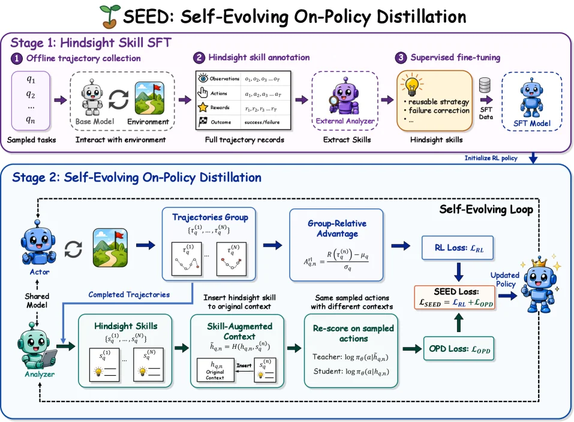

> Figure 2: Overview of Seed . Stage 1 (Hindsight Skill SFT) equips the policy to extract hindsight skills from completed trajectories. Stage 2 (Self-Evolving On-Policy Distillation) jointly optimizes outcome-based RL and skill-conditioned OPD in a self-evolving agentic loop.

这张图展示了SEED（Self - Evolving On - Policy Distillation）方法的两个核心阶段，清晰呈现了方法的整体运作流程。

### 阶段1：Hindsight Skill SFT（后见之明技能监督微调）
这个阶段的目标是让策略具备从已完成轨迹中提取后见之明技能的能力，数据或信息的流动顺序如下：
1. **离线轨迹收集（Offline trajectory collection）**：首先，使用基础模型（Base Model）与环境中的一系列采样任务（Sampled tasks，如\( q_1, q_2, \dots, q_n \)）进行交互，从而收集到完整的轨迹记录。这里的交互过程是模型在环境中执行动作，环境反馈观测、奖励等信息，最终形成轨迹。
2. **后见之明技能标注（Hindsight skill annotation）**：通过外部分析器（External Analyzer），对收集到的完整轨迹记录（包含观测、动作、奖励、结果等，即\( \text{Observations: } o_1, o_2, o_3, \dots, o_T \)；\( \text{Actions: } a_1, a_2, a_3, \dots, a_T \)；\( \text{Rewards: } r_1, r_2, r_3, \dots, r_T \)；\( \text{Outcome: success/failure} \)）进行分析，提取出技能（Skills）。这些技能可能是可重复的策略、失败修正方法等。
3. **监督微调（Supervised fine - tuning）**：利用提取到的后见之明技能（Hindsight skills）作为监督数据（SFT Data），对模型进行监督微调，得到SFT模型（SFT Model）。这个SFT模型会被用来初始化强化学习（RL）策略，为后续的强化学习阶段做准备。

### 阶段2：Self - Evolving On - Policy Distillation（自演化在线策略蒸馏）
这个阶段是一个自演化的循环（Self - Evolving Loop），在这个循环中，策略的更新会同时提升后续的决策制定和技能分析能力，使得后见之明的监督能够随着策略的演化而发展。具体的信息流动和操作如下：
1. **Actor与轨迹收集**：Actor（策略模型）与环境交互，生成完成的轨迹（Completed Trajectories）。这些轨迹被分组（Trajectories Group），每组包含多个轨迹\( \{ \tau_q^{(1)}, \dots, \tau_q^{(N)} \} \)，其中\( \tau_q^{(i)} \)表示第\( i \)个轨迹。
2. **技能增强上下文（Skill - Augmented Context）**：Analyzer（分析器，这里和Actor共享模型，即Shared Model）从已完成的轨迹中提取后见之明技能（Hindsight Skills，如\( \{ s_q^{(1)}, \dots, s_q^{(N)} \} \)），然后将这些技能插入到原始上下文（Original Context \( h_{q,n} \)）中，形成技能增强的上下文\( \hat{h}_{q,n} = H(h_{q,n}, s_q^{(n)}) \)。
3. **重新评分采样动作（Re - score on sampled actions）**：对于采样的动作，在普通上下文（original context）和技能增强上下文（skill - augmented context）下分别进行评分。教师模型（Teacher）的评分是\( \log \pi_\theta(a|\hat{h}_{q,n}) \)，学生模型（Student）的评分是\( \log \pi_\theta(a|h_{q,n}) \)。这部分操作用于计算OPD损失（OPD Loss：\( \mathcal{L}_{OPD} \)），该损失将技能引起的概率转移转化为密集的token级在线策略蒸馏信号。
4. **RL损失与SEED损失**：同时，还会计算RL损失（RL Loss：\( \mathcal{L}_{RL} \)），它基于组相对优势（Group - Relative Advantage），组相对优势的计算公式为\( A_{q,n}^t = \frac{R(\tau_q^{(n)}) - \mu_q}{\sigma_q} \)（其中\( R(\tau_q^{(n)}) \)是轨迹的奖励，\( \mu_q \)和\( \sigma_q \)是相关的统计量）。然后，SEED损失（SEED Loss：\( \mathcal{L}_{SEED} = \mathcal{L}_{RL} + \mathcal{L}_{OPD} \)）将结果导向策略的更新，得到更新后的策略（Updated Policy）。更新后的策略又会作为新的Actor和Analyzer，继续参与下一轮的自演化循环，使得整个过程能够不断优化，提升策略的性能。

总体来说，SEED方法分为两个阶段，第一阶段通过监督微调让策略学会提取后见之明技能，第二阶段通过自演化的在线策略蒸馏循环，将技能的影响蒸馏回策略模型，同时结合结果导向的强化学习，实现策略的持续优化和自演化。

---

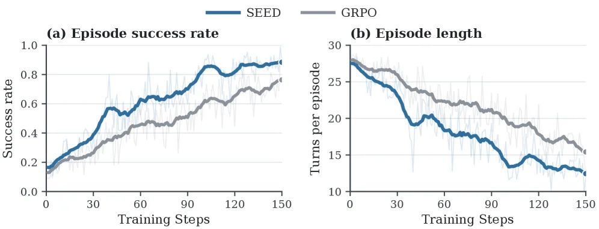

> Figure 3: Training dynamics on ALFWorld. We compare Seed and GRPO using Qwen2.5-3B-Instruct as the backbone. Translucent curves show raw measurements, while solid curves show 13-point centered moving averages.

这张图（图3）展示了在ALFWorld任务上，我们提出的SEED方法和基线GRPO方法的训练动态对比，使用Qwen2.5-3B-Instruct作为策略模型的骨干网络。

首先，我们来看这张图的两个子图：

*   **子图(a)：Episode success rate（回合成功率）**
    *   **X轴**：表示“Training Steps”（训练步数），范围从0到150。这代表了强化学习过程中的迭代次数或训练的进展。
    *   **Y轴**：表示“Success rate”（成功率），范围从0.0到1.0。这衡量了在每个训练步数时，策略模型成功完成任务的比例。
    *   **曲线**：
        *   蓝色实线代表“SEED”方法。
        *   灰色实线代表“GRPO”基线方法。
        *   图中还提到了“Translucent curves show raw measurements, while solid curves show 13-point centered moving averages.”（半透明曲线显示原始测量值，而实线显示13点中心移动平均值）。这意味着我们看到的平滑曲线是对原始数据进行了平滑处理后的结果，以便更清晰地观察趋势。
    *   **信息流动与解读**：
        *   随着训练步数的增加，我们观察到两条曲线都呈现出上升趋势，表明策略模型在不断学习并提高任务成功率。
        *   关键在于，SEED方法（蓝色曲线）的成功率在整个训练过程中始终高于GRPO方法（灰色曲线）。例如，在训练步数约为30时，SEED的成功率已经超过了0.4，而GRPO大约在0.3左右。到了训练步数约为90时，SEED的成功率接近0.8，而GRPO大约在0.6左右。在训练结束时（约150步），SEED的成功率接近0.9，而GRPO略低于0.8。
        *   这表明SEED方法能够更有效地利用强化学习信号，更快地收敛到一个高成功率的策略。

*   **子图(b)：Episode length（回合长度）**
    *   **X轴**：同样表示“Training Steps”（训练步数），范围从0到150。
    *   **Y轴**：表示“Turns per episode”（每个回合的步数/轮次）。这衡量了完成一个任务所需的平均步骤数。通常，一个更高效的策略会在更少的步骤内完成任务。
    *   **曲线**：
        *   蓝色实线代表“SEED”方法。
        *   灰色实线代表“GRPO”基线方法。
        *   同样，半透明曲线是原始数据，实线是13点中心移动平均值。
    *   **信息流动与解读**：
        *   随着训练的进行，两个方法的回合长度都呈现出下降趋势，这表明策略在不断优化，能够用更少的步骤完成任务。
        *   关键在于，SEED方法（蓝色曲线）的回合长度在整个训练过程中始终低于GRPO方法（灰色曲线）。例如，在训练步数约为30时，SEED的回合长度约为20，而GRPO约为23。到了训练步数约为90时，SEED的回合长度降至约13，而GRPO约为18。在训练结束时（约150步），SEED的回合长度稳定在约12-13，而GRPO则在约15-16。
        *   这表明SEED方法不仅成功率高，而且其学习的策略更高效，能够在更少的交互步骤内完成任务。

**这张图揭示了方法的具体运作方式及其优势：**

1.  **方法运作方式（从结果推断）：**
    *   SEED（Self-Evolving On-Policy Distillation）的核心思想是将已完成的“on-policy”（策略执行时的）轨迹转化为“hindsight skills”（事后技能）。这些技能是自然语言描述的，能够捕捉可重用的工作流程、关键决策点或避免失败的规则。
    *   在强化学习过程中，当前的策略模型不仅负责收集轨迹，还充当分析器，从这些轨迹中提取这些事后技能。
    *   策略的更新会同时改进后续的决策制定和技能分析能力，使得“事后监督”能够随着策略的进化而进化。
    *   SEED通过重新评估在普通上下文和技能增强上下文下的采样动作，将技能引起的概率转移转化为密集的“token-level on-policy distillation signal”（标记级别的策略内蒸馏信号）。这个信号与基于结果的RL目标一起被联合优化，确保辅助监督与当前的轨迹分布保持一致。
    *   从图中可以看出，SEED通过这种机制，能够更有效地利用中间步骤的监督（通过技能），从而在成功率和解题效率上都优于仅依赖稀疏轨迹级奖励的GRPO方法。

2.  **结论：**
    *   图中清晰地显示，在ALFWorld任务上，SEED方法相比GRPO基线方法，在训练过程中取得了更高的**回合成功率**（图a）和更短的**回合长度**（图b）。
    *   这表明SEED框架能够有效地弥合稀疏轨迹级奖励与标记级策略学习之间的监督差距，从而学习到更优、更高效的策略。
    *   具体来说，SEED方法在训练早期就展现出优势，并且这种优势随着训练的进行而持续扩大，最终在任务完成的质量和效率上都显著优于GRPO。

总而言之，这张图通过比较两种方法在训练过程中的关键性能指标（成功率和效率），直观地展示了SEED方法在解决需要多轮交互和环境反馈的长 horizon 任务时的优越性。

---

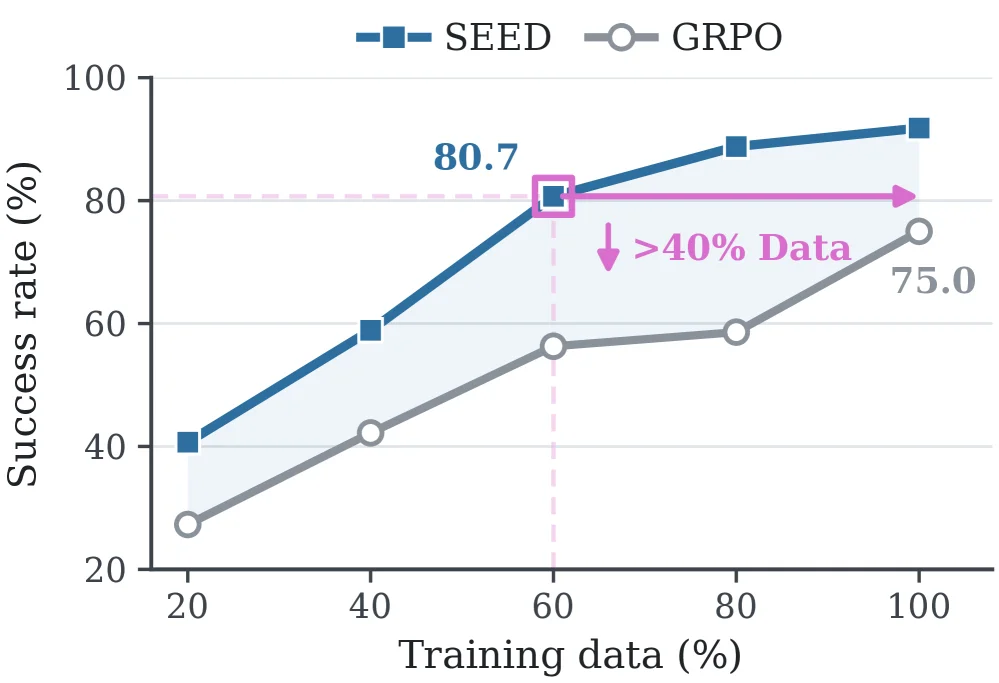

> Figure 4: Sample efficiency analysis. Seed consistently outperforms GRPO across different data fraction settings and surpasses full-data GRPO using only 60% of the training data. Figure 5: Cross-domain generalizability on ALFWorld Unseen. Seed generally outperforms GRPO across unseen task types, demonstrating stronger cross-domain generalizability.

这张图（图4）展示了**SEED方法在样本效率上的优势**，通过对比SEED和GRPO两种方法在不同训练数据比例下的成功完成任务率，来体现SEED的样本高效性。

### 图的组件与信息流动：
- **横轴（X轴）**：表示“Training data (%)”，即训练数据的比例，从20%到100%，展示了使用不同比例的训练数据时的情况。
- **纵轴（Y轴）**：表示“Success rate (%)”，即任务的成功完成率，范围从20%到100%，衡量方法在给定数据量下的表现。
- **两条曲线**：
  - 蓝色带方块的曲线代表**SEED方法**，灰色带圆圈的曲线代表**GRPO方法**（作为对比基线）。
  - 数据点的顺序是随着训练数据比例从20%增加到100%，方法的成功率逐步变化，体现了“数据比例增加→成功率变化”的逻辑，即随着训练数据的增多，两种方法的成功率都有提升，但SEED的提升更高效。

### 方法运作的揭示（从图中结果反推方法逻辑）：
从图中可以看出，SEED在**样本效率**上的优势体现在：
- 当训练数据比例为60%时，SEED的成功率达到80.7%，而此时GRPO的成功率约为56%（从图中灰色曲线在60%数据点的位置估算）。更重要的是，图中粉色箭头和文字“>40% Data”表明，SEED仅用60%的训练数据（即比GRPO的“全数据”少约40%的数据？不，这里的“full - data GRPO”应该是指用100%数据训练的GRPO？不对，仔细看：当SEED用60%数据时，其成功率（80.7%）超过了GRPO用100%数据时的成功率（75.0%）。这说明SEED能够在**更少的训练数据**下达到甚至超过基线方法（GRPO）在更多数据下的性能，体现了其样本高效性。
- 从数据比例20%开始，SEED的成功率（40%左右）就高于GRPO（约28%左右）；随着数据比例增加到40%，SEED的成功率（60%左右）远高于GRPO（约42%左右）；在60%数据时，SEED的成功率（80.7%）显著高于GRPO（约56%左右），并且超过了GRPO用100%数据时的成功率（75.0%）；之后在80%和100%数据时，SEED的成功率继续提升（约90%左右），而GRPO提升到约75%左右。

### 坐标、对比对象和结论：
- **坐标**：X轴是训练数据的比例（20%、40%、60%、80%、100%），Y轴是任务成功完成率（百分比）。
- **对比对象**：SEED（蓝色曲线）和GRPO（灰色曲线）两种方法。
- **结论**：
  - SEED在**所有测试的数据比例（20%、40%、60%、80%、100%）**下，其任务成功完成率都**一致性地超过GRPO**。
  - 特别地，当SEED仅使用**60%的训练数据**时，其成功完成率（80.7%）就**超过了GRPO使用100%训练数据时的成功完成率（75.0%）**，这表明SEED能够用**少于40%的额外数据**（相对于GRPO的100%数据，这里60%比100%少40%）达到甚至超越基线方法的性能，充分体现了SEED的**样本高效性**（即用更少的训练数据获得更好的或相当的性能）。

---

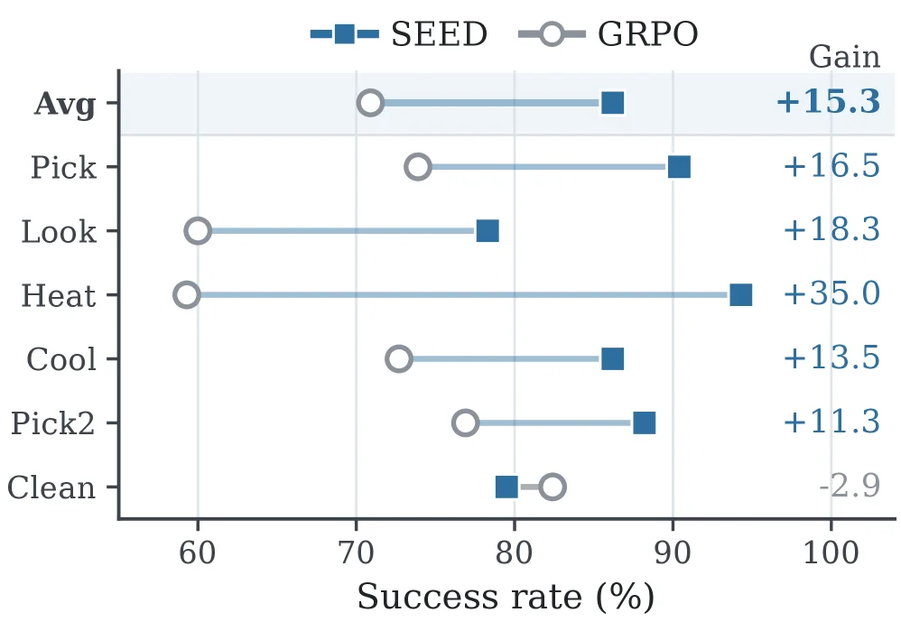

> Figure 4: Sample efficiency analysis. Seed consistently outperforms GRPO across different data fraction settings and surpasses full-data GRPO using only 60% of the training data. Figure 5: Cross-domain generalizability on ALFWorld Unseen. Seed generally outperforms GRPO across unseen task types, demonstrating stronger cross-domain generalizability.

这张图（图5）展示了SEED方法与GRPO方法在ALFWorld Unseen任务上的跨领域泛化能力对比。图中横轴表示成功率（百分比），纵轴列出了不同的任务类型，包括Avg（平均）、Pick、Look、Heat、Cool、Pick2和Clean。图例中，蓝色方块代表SEED方法，灰色圆圈代表GRPO方法。每对数据点（一个圆圈和一个方块）之间用线段连接，表示在同一任务上两种方法的性能差异。

从图中可以看出，在大多数任务上，SEED的成功率都高于GRPO。例如，在Heat任务中，SEED的成功率接近90%，而GRPO约为70%，增益为+35.0%；在Pick任务中，SEED约为90%，GRPO约为75%，增益为+16.5%。唯一的例外是Clean任务，SEED的成功率略低于GRPO，增益为-2.9%。

这张图揭示了SEED方法如何在跨领域任务中表现出更强的泛化能力。通过在多个未见过的任务类型上进行比较，SEED在大多数任务上取得了显著的性能提升，这表明SEED能够更好地适应新的环境和任务，从而证明了其强大的跨领域泛化能力。

---

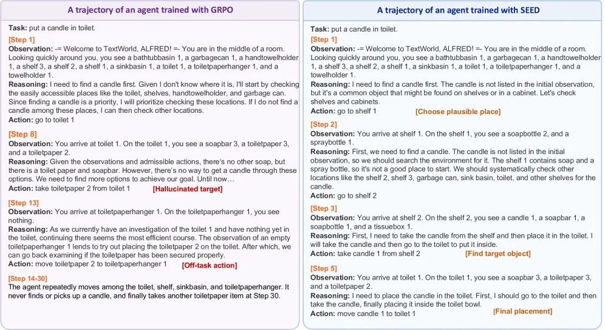

> Figure 6: Qualitative comparison on ALFWorld. For the task “put a candle in toilet,” the GRPO- trained agent searches the target receptacle before locating the candle, takes an irrelevant toilet-paper item, and then enters an off-task loop. In contrast, SEED systematically checks plausible shelves, finds the candle, and completes the required placement in five steps.

这张图通过对比两种不同训练方法（GRPO和SEED）下智能体在ALFWorld环境中执行“把蜡烛放进马桶”任务的轨迹，直观展示了SEED方法的优势。我们可以将图分为左右两个主要部分，分别对应两种方法的执行过程：

**左侧面板：GRPO训练的智能体轨迹**
这部分展示了一个使用GRPO（一种强化学习算法）训练的智能体在执行任务时的步骤和决策过程。
1.  **[Step 1]**: 智能体接收到环境观察，描述了房间的布局，包括浴缸、垃圾桶、毛巾架等。其推理认为需要先找到蜡烛，因此优先检查容易到达的地方，如架子、洗手池、毛巾架和垃圾桶。于是它采取了行动“go to toilet 1”（去马桶1）。
2.  **[Step 8]**: 智能体到达马桶1，观察到肥皂、卫生纸和卫生纸架。其推理指出，虽然找到了卫生纸和肥皂，但没有蜡烛，也没有其他肥皂。由于没有其他选择，它决定采取行动“take toiletpaper 2 from toilet 1”（从马桶1拿卫生纸2）。这一步被标记为“[Hallucinated target]”（幻觉目标），意味着它可能错误地将卫生纸当作了目标或相关物品。
3.  **[Step 13]**: 智能体到达卫生纸架1，但什么也没看到。其推理认为，既然已经调查了马桶1且没有进展，最有效的做法是尝试将之前拿到的卫生纸2放到卫生纸架1上。于是它采取了行动“move toiletpaper 2 to toiletpaperhanger 1”（将卫生纸2移到卫生纸架1）。这一步被标记为“[Off-task action]”（偏离任务的动作），因为它与主要任务“找蜡烛并放入马桶”无关。
4.  **[Step 14-30]**: 智能体在马桶、架子、水槽和卫生纸架之间反复移动，但始终没有找到或拿起蜡烛，最终在第30步又拿起了另一个卫生纸类物品。这个过程被描述为一个“off-task loop”（偏离任务的循环）。

**右侧面板：SEED训练的智能体轨迹**
这部分展示了一个使用SEED方法训练的智能体执行相同任务的步骤和决策过程。
1.  **[Step 1]**: 智能体同样接收到环境观察，并推理出需要在架子或柜子里寻找蜡烛，因为初始观察中没有列出蜡烛。它采取了行动“go to shelf 1”（去架子1），并被标注为“[Choose plausible place]”（选择合理的地方），表明其决策更具针对性。
2.  **[Step 2]**: 智能体到达架子1，观察到肥皂瓶和喷雾瓶。其推理指出，这些不是蜡烛，因此应该系统地搜索其他地方，如架子2、架子3、垃圾桶、水槽、马桶等。这表明SEED训练的智能体能够进行系统性搜索。
3.  **[Step 3]**: 智能体采取行动“go to shelf 2”（去架子2）。
4.  **[Step 4]**: 智能体到达架子2，观察到蜡烛、肥皂、喷雾瓶和纸巾。其推理明确指出需要从架子上拿起蜡烛，然后放入马桶。于是它采取了行动“take candle 1 from shelf 2”（从架子2拿蜡烛1），并被标注为“[Find target object]”（找到目标物体）。
5.  **[Step 5]**: 智能体到达马桶1，观察到所需的物品。其推理是需要将蜡烛放入马桶，因此采取了行动“move candle 1 to toilet 1”（将蜡烛1移到马桶1），并被标注为“[Final placement]”（最终放置）。整个任务在5个步骤内完成。

**方法运作的揭示**
这张图揭示了SEED方法如何运作：
*   **系统性搜索与目标识别**: SEED训练的智能体能够根据任务需求，系统地检查可能的目标位置（如架子），并准确识别出目标物体（蜡烛）。相比之下，GRPO训练的智能体可能会选择错误的目标或陷入无关的行动循环。
*   **有效决策与任务完成**: SEED的智能体在每一步都有明确的推理和目标导向的行动，能够高效地完成任务。而GRPO的智能体则表现出决策混乱，执行了与任务无关的动作，并陷入循环。
*   **监督信号的演化**: 虽然图中没有直接展示SEED的内部机制（如技能提取和蒸馏），但通过对比结果可以推断，SEED通过将完成的轨迹转化为“后见之明技能”（hindsight skills），并为策略模型提供更密集的监督信号，从而引导智能体做出更好的决策。这些技能可能包括“选择合理的地方搜索”、“系统搜索”、“找到目标物体”和“最终放置”等，这些都在SEED智能体的推理和行动中得到了体现。

**结论**
这张图清晰地表明，在执行“把蜡烛放进马桶”的任务时，SEED训练的智能体能够更有效地搜索目标、识别物体并完成任务，仅需5个步骤。而GRPO训练的智能体则表现出决策失误、执行无关动作并陷入偏离任务的循环。这直观地展示了SEED方法在解决长 horizon 任务和提高决策质量方面的优势。

---

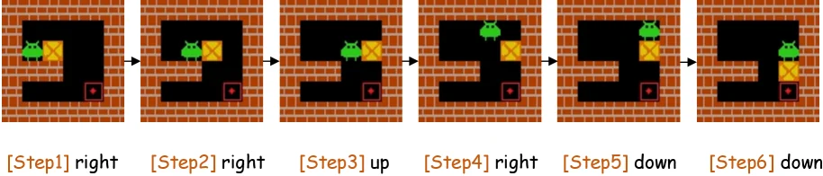

> Figure 7: A representative trajectory on Sokoban. The sequence shows six consecutive actions executed by the agent. Arrows indicate the temporal progression of the trajectory, and the action taken at each step is displayed below the corresponding observation.

这张图（图7）来自论文《SEED: Self-Evolving On-Policy Distillation for Agentic Reinforcement Learning》，展示了在推箱子游戏（Sokoban）环境中一个典型的智能体行为轨迹。它通过六个连续的步骤，清晰地演示了智能体如何在环境中执行一系列动作以达到目标（尽管目标本身在这个简化示例中可能未完全展示，但动作序列展示了决策过程）。

让我们逐步解析这个图：

1.  **整体结构**：图由六个并排的面板组成，从左到右依次排列，代表了时间上的先后顺序。每个面板包含一个游戏场景（观察状态）和一个对应的动作描述。
2.  **游戏场景（观察状态）**：
    *   每个面板的主体是一个典型的Sokoban游戏地图。地图由砖墙（棕色方块）、可移动的黑色空地、一个绿色的推箱子智能体（角色）、一个黄色的箱子以及一个红色的目标点（通常是箱子需要被推到的位置）组成。
    *   从左到右，我们可以观察到智能体和箱子的位置变化：
        *   **第一步 (Step1)**：智能体位于地图左侧，箱子在智能体的右边。红色目标点位于箱子下方的一个角落。
        *   **第二步 (Step2)**：智能体向右移动了一格，更靠近箱子。
        *   **第三步 (Step3)**：智能体向上移动了一格，现在位于箱子的上方。
        *   **第四步 (Step4)**：智能体向右移动了一格，此时它位于箱子的正上方，并且箱子也已经向右移动了一格，更接近目标点。
        *   **第五步 (Step5)**：智能体向下移动了一格，回到了与箱子在同一水平线的位置，但箱子继续保持向右移动的趋势。
        *   **第六步 (Step6)**：智能体再次向下移动了一格，而箱子则被推到了红色目标点的位置。
3.  **动作描述和时间流**：
    *   在每个游戏场景面板的下方，都有一个标签，如“[Step1] right”、“[Step2] right”等。这些标签明确指出了在该步骤中智能体所采取的动作。
    *   箭头（→）位于每个面板之间，从左指向右，直观地表示了时间的推移和动作序列的连续性。数据或信息的流动是从左到右，代表从一个状态到下一个状态的转变，这是由智能体的动作引起的。
4.  **揭示的方法运作方式**：
    *   虽然这张图本身是一个示例轨迹，但它与论文中提出的SEED方法密切相关。SEED方法的核心思想是利用完成的策略轨迹（如图中所示的这种动作序列）来提取“后见之明技能”（hindsight skills），并将这些技能的行为效果蒸馏回策略模型中。
    *   这张图可以看作是一个“完成的轨迹”的实例。在SEED框架中，这样的轨迹会被分析：
        *   **技能提取**：系统会分析这个轨迹，识别出其中的关键决策点、成功的模式或避免失败的规则，并将其表述为自然语言的技能。例如，从这张图中，可能提取出的技能包括“当箱子在目标附近时，调整其位置使其对齐目标”或“通过推动箱子而不是直接移动到目标来实现目标”。
        *   **策略更新**：这些提取的技能随后被用作辅助监督信号，与基于结果的强化学习（RL）目标一起优化策略模型。这样，策略不仅学习如何获得高回报，还学习如何执行那些能导致成功的中间步骤（即技能）。
        *   **蒸馏信号**：SEED通过在普通上下文和技能增强上下文中重新评估采样动作的概率差异，将技能引起的概率偏移转化为密集的token级在线策略蒸馏信号。这张图中的动作序列为这种评估提供了具体的例子。
    *   因此，这张图揭示了SEED方法的一个关键前提：智能体在环境中执行的轨迹包含了有价值的信息，这些信息可以被用来改进策略，而不仅仅是作为最终奖励的依据。通过分析和蒸馏这些轨迹中的行为，策略可以学习到更有效的决策策略，从而在类似任务中表现更好。

总结来说，这张图通过一个具体的Sokoban游戏轨迹示例，展示了智能体如何通过一系列动作与环境互动。更重要的是，它作为一个视觉化的例子，说明了SEED方法如何利用这类完成的轨迹来提取有用的行为模式（技能），并将其转化为监督信号以改进策略学习，从而弥合了基于结果的RL在中间决策指导方面的不足。

---

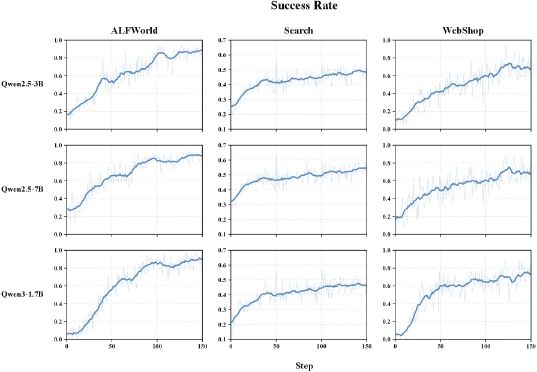

> Figure 8: Success rates across three backbones and three domains. Success rates increase over training in all nine settings, showing consistent learning across model scales and agentic tasks.

这张图（图8）展示了在三种不同模型（或称为“backbones”）和三个不同任务领域中，随着训练步骤的增加，策略的成功率变化情况。图的标题是“Success Rate”，表明其核心内容是展示学习过程中的成功表现。

首先，我们来看图的结构。这张图由九个子图组成，排列成3x3的网格。每一行代表一个特定的模型 backbone，从上到下分别是：
1.  第一行：Qwen2.5-3B 模型。
2.  第二行：Qwen2.5-7B 模型。
3.  第三行：Qwen3-1.7B 模型。

每一列则代表一个特定的任务领域，从左到右分别是：
1.  第一列：ALFWorld 领域。
2.  第二列：Search 领域。
3.  第三列：WebShop 领域。

每个子图都是一个折线图，横轴（X轴）表示“Step”（训练步骤），范围从0到大约150。纵轴（Y轴）表示“Success Rate”（成功率），范围因领域而异，但通常从0到1（或接近1）。例如，ALFWorld领域的Y轴范围是0到1.0，而Search领域的Y轴范围是0到0.7。

图中的蓝色折线代表了在特定模型和特定领域下，随着训练步骤的增加，策略的成功率是如何变化的。我们可以观察到以下几点：

*   **整体趋势**：在所有九个设置中（即每种模型-领域组合），成功率都随着训练步骤的增加而提高。这表明该方法在不同模型规模和不同代理任务中都能实现一致的学习效果。
*   **模型间的比较**：
    *   在ALFWorld领域，Qwen2.5-3B模型的成功率从接近0开始，逐渐上升到约0.9。
    *   Qwen2.5-7B模型的成功率曲线与Qwen2.5-3B类似，但最终的成功率略高一些，接近1.0。
    *   Qwen3-1.7B模型的成功率曲线也表现出上升趋势，最终接近0.9。
    *   这表明模型规模的增加可能对性能有一定提升，但不同规模的模型都能有效学习。
*   **领域间的比较**：
    *   ALFWorld领域的成功率普遍较高，最终接近或达到1.0。
    *   Search领域的成功率相对较低，最终在0.5到0.6之间。
    *   WebShop领域的成功率介于两者之间，最终在0.6到0.8之间。
    *   这说明不同任务领域的学习难度可能存在差异。

这张图揭示了SEED方法的具体运作方式吗？虽然这张图本身主要展示的是结果，但它间接支持了论文中提出的SEED方法的有效性。SEED方法的核心思想是通过自我进化的方式，将完成的策略轨迹转化为“后见之明”的技能，并将这些技能的行为效果蒸馏回策略模型中。图中的结果显示，随着训练的进行，策略的成功率不断提高，这表明SEED方法能够有效地利用这些技能来改进策略的决策能力。

具体来说，图中的每个子图都对应于一个特定的模型和任务领域组合。横轴的“Step”代表了训练的进度，纵轴的“Success Rate”则衡量了策略在该阶段的性能。蓝色折线的上升趋势表明，随着训练的进行，策略在完成任务时的成功率越来越高。这说明SEED方法能够在训练过程中不断优化策略，使其更好地适应任务要求。

总结来说，这张图通过展示不同模型和不同领域下策略成功率的提升趋势，证明了SEED方法在不同模型规模和不同代理任务中都能实现一致且有效的学习。所有九个设置中的成功率都随着训练步骤的增加而提高，这表明该方法具有良好的泛化能力和学习效率。

---

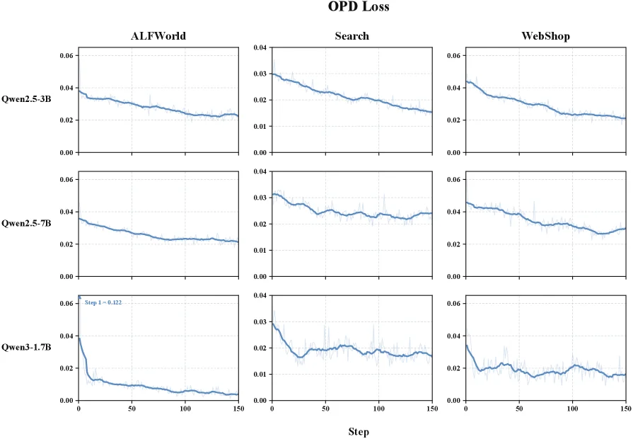

> Figure 9: OPD loss dynamics. The loss generally decreases and stabilizes during training, indicating that the policy progressively internalizes the behavioral guidance provided by hindsight skills.

这张图（图9）展示了论文中提出的SEED框架在训练过程中OPD（On-Policy Distillation）损失的动态变化情况。我们可以从以下几个方面来详细解读这张图：

1.  **图表结构与内容**：
    *   这是一个由多个子图组成的网格图。横轴（Step）代表训练的步数，从0到约150步。纵轴（Loss）代表OPD损失值，不同子图的纵轴刻度范围略有不同，但都显示了损失值随训练步数的变化趋势。
    *   图表分为三行，每行代表一个不同的基础模型：
        *   第一行：Qwen2.5-3B
        *   第二行：Qwen2.5-7B
        *   第三行：Qwen3-1.7B
    *   图表分为三列，每列代表一个不同的任务或环境：
        *   第一列：ALFWorld
        *   第二列：Search
        *   第三列：WebShop
    *   因此，总共有3（模型）x 3（任务）= 9个子图，每个子图展示特定模型在特定任务上的OPD损失曲线。

2.  **数据流动与解读**：
    *   每个子图中的蓝色曲线代表了在训练过程中，OPD损失值随着训练步数（Step）的增加而发生的变化。
    *   我们观察到，对于所有模型和所有任务，OPD损失值在训练初期通常较高，然后随着训练的进行逐渐下降，并最终趋于稳定。
    *   例如，在第一行第一列的“Qwen2.5-3B”模型在“ALFWorld”任务上，损失值从大约0.04开始，随着步数增加逐渐下降到接近0.02左右并保持稳定。
    *   类似地，其他子图也显示出类似的趋势：损失值随训练步数增加而降低，表明模型在学习过程中逐渐优化。

3.  **方法运作的揭示**：
    *   这张图揭示了SEED框架中OPD损失的优化过程。根据论文摘要，SEED框架通过将已完成的策略轨迹转化为“后见之明技能”（hindsight skills），并将这些技能的行为效果蒸馏回策略模型中。
    *   OPD损失是这个蒸馏过程中的一个关键信号。损失的下降表明策略模型正在有效地学习和内化这些“后见之明技能”所提供的行为指导。
    *   具体来说，策略模型在收集轨迹的同时，也作为分析器从这些轨迹中提取“后见之明技能”。策略更新不仅改善了后续的决策制定，也改善了技能分析能力，使得“后见之明”的监督能够随着策略的进化而进化。
    *   图中损失的稳定下降和最终稳定，说明策略模型正在逐步将这些技能转化为自身的行为模式，从而在不依赖稀疏的轨迹级奖励的情况下，提高了中间决策的质量。

4.  **对比对象与结论**：
    *   对比对象是不同的模型（Qwen2.5-3B, Qwen2.5-7B, Qwen3-1.7B）和不同的任务（ALFWorld, Search, WebShop）。
    *   尽管不同模型和任务的具体损失值和下降速率可能有所不同，但所有子图都显示出一致的趋势：OPD损失在训练过程中普遍下降并趋于稳定。
    *   结论是：OPD损失在训练期间通常会减少并稳定下来，这表明策略模型正在逐步内化“后见之明技能”所提供的行为指导。这说明SEED框架中的蒸馏机制是有效的，能够帮助策略模型学习到更好的决策策略。

总结来说，这张图通过展示不同模型在不同任务上OPD损失随训练步数的变化，直观地证明了SEED框架中基于策略的蒸馏过程的有效性。损失的下降和稳定表明策略模型正在成功地学习和利用“后见之明技能”，从而优化其决策能力。

---

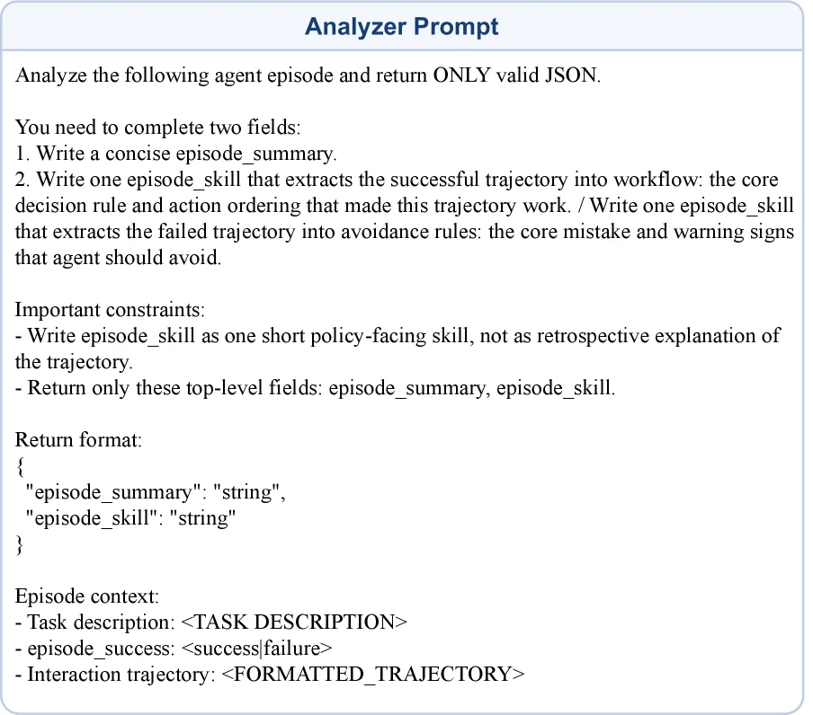

> Figure 10: Prompt of analyzer.

这张图展示了论文《SEED: Self - Evolving On - Policy Distillation for Agentic Reinforcement Learning》中**分析器（Analyzer）的提示（Prompt）**设计，它是SEED框架中“将已完成轨迹转化为经验技能（hindsight skills）”这一核心环节的关键输入模板，用于指导语言模型分析代理的交互轨迹并输出结构化的技能信息。我们可以从以下几个部分拆解其逻辑和运作方式：

### 1. 核心目标与约束
- **目标**：让分析器（通常由大语言模型担任）分析代理的“episode（一轮交互过程）”，并**仅返回有效的JSON格式数据**，包含两个关键字段：`episode_summary`（轨迹总结）和`episode_skill`（经验技能）。
- **约束**：
  - `episode_skill`必须是**面向策略（policy - facing）的简短规则**，而非对轨迹的事后解释（即要提炼出可指导后续决策的“行动逻辑”，而不是描述“发生了什么”）。
  - 只返回指定的顶级字段（`episode_summary`和`episode_skill`），保证输出结构清晰、可被后续流程解析。

### 2. 输入与输出结构
- **输入部分（Episode context）**：分析器需要接收三轮信息来生成输出：
  - `Task description`：任务的描述（用`<TASK DESCRIPTION>`占位，实际运行时替换为具体任务，比如“查询天气并整理成报告”）。
  - `episode_success`：该轮交互的结果（成功或失败，用`<success|failure>`占位，实际为`success`或`failure`）。
  - `Interaction trajectory`：代理在该轮中的交互轨迹（用`<FORMATTED_TRAJECTORY>`占位，实际是多轮对话、工具调用等交互的记录，比如“用户问‘北京天气？’→代理调用天气API→返回结果→用户确认”）。
- **输出部分（Return format）**：必须返回一个JSON对象，包含：
  - `episode_summary`：对轨迹的**简洁总结**（比如“代理成功查询北京天气并返回结果，过程中调用了天气API”）。
  - `episode_skill`：从轨迹中提取的**经验技能**。如果是成功轨迹，技能是“成功的决策规则和行动顺序”（比如“当用户询问天气时，先调用天气API，再返回结果”）；如果是失败轨迹，技能是“失败轨迹的避免规则”（比如“当用户需要实时天气时，避免使用缓存数据，必须调用实时API”）。

### 3. 方法运作的逻辑（结合论文背景）
SEED框架的核心是**“自演化的策略蒸馏”**：通过将“已完成的策略轨迹”转化为“经验技能”，并把这些技能的行为效果“蒸馏”回策略模型，解决强化学习中“轨迹级奖励稀疏，无法指导中间决策”的问题。而这张图中的“分析器提示”是这个过程的**第一步**：
- 分析器（大模型）根据输入的“任务描述、轨迹结果、交互轨迹”，按照约束生成`episode_summary`和`episode_skill`。
- 生成的`episode_skill`会被用于后续的策略更新：在强化学习（RL）过程中，当前策略既收集新轨迹，又作为“分析器”提取新轨迹的经验技能（实现“策略更新”和“技能分析”的协同演化）；之后，SEED会通过“技能增强上下文”和“普通上下文”的动作评分差异，将技能带来的概率偏移转化为**密集的token级策略蒸馏信号**，与“基于结果的RL”联合优化，确保辅助监督与当前轨迹分布对齐。

### 4. 信息流动与组件作用
- **信息流动顺序**：输入（任务描述→轨迹结果→交互轨迹）→ 分析器（根据提示生成输出）→ 输出（JSON格式的`episode_summary`和`episode_skill`）→ 后续流程（技能用于策略更新和蒸馏）。
- **组件作用**：
  - `Analyzer Prompt`：是给分析器的“指令模板”，规定了输入格式、输出格式、约束条件，确保分析器输出的信息能被SEED框架后续步骤利用。
  - `episode_summary`：提供轨迹的“宏观理解”，帮助快速把握该轮交互的核心内容。
  - `episode_skill`：提供“可复用的行为逻辑”，是SEED中“自演化蒸馏”的核心——将“轨迹级的经验”转化为“token级的策略指导”，填补了“episode级结果”和“token级策略学习”之间的监督鸿沟。

### 5. 结论（从图中能看出的方法运作方式）
这张图揭示了SEED框架中**“轨迹→技能→策略更新”**的关键环节：通过设计明确的分析器提示，让大模型从交互轨迹中提取结构化的“经验技能”，这些技能既指导当前策略的决策（在RL过程中），又被用来生成新的蒸馏信号（优化策略），从而实现“策略”和“技能分析”的协同演化，解决强化学习中中间决策监督不足的问题。分析器的提示通过约束输出格式和内容类型，确保提取的技能是“可行动、可复用”的，为后续的策略蒸馏提供了高质量的监督信号。

---

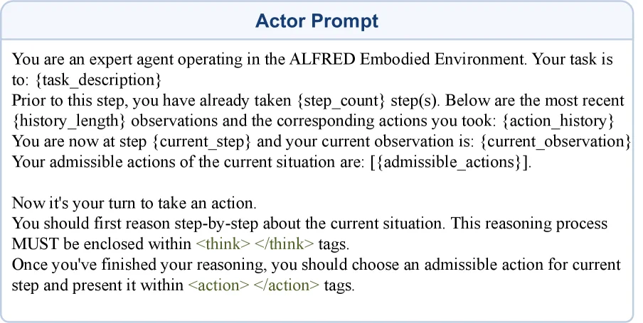

> Figure 11: Prompt of actor (the policy model) in ALFWorld.

这张图展示了ALFWorld环境中**策略模型（actor）的提示（prompt）结构**，它是论文《SEED: Self - Evolving On - Policy Distillation for Agentic Reinforcement Learning》中**基于策略的强化学习（RL）流程的核心交互界面**，用于指导策略模型在环境中如何决策。我们可以从以下几个部分来理解它的工作逻辑：

### 1. 输入信息部分（环境与任务上下文）
- **任务描述（{task_description}）**：这里会填入当前需要完成的长 horizon 任务的具体描述（比如“从厨房拿一杯水并放到餐桌上”）。这部分为策略模型提供了任务的目标方向，让模型知道要做什么。
- **历史步骤信息（{step_count}、{history_length}、{action_history}）**：
  - `{step_count}` 表示到目前为止策略模型已经执行的步骤数量，用于跟踪任务的进度。
  - `{history_length}` 是最近的历史观察和动作的数量，`{action_history}` 则是这些步骤中模型采取的动作序列（比如“移动到冰箱”“打开冰箱”等）。这部分提供了任务的**历史上下文**，让模型可以参考之前的行为和观察来做出当前决策，避免重复错误或利用之前的进展。
- **当前步骤与观察（{current_step}、{current_observation}）**：
  - `{current_step}` 是当前所处的步骤编号，明确当前的决策阶段。
  - `{current_observation}` 是环境返回的当前状态描述（比如“你在厨房，面前有一个冰箱和一个桌子，桌子上有一个杯子”）。这是模型的**当前感知输入**，决定了当前环境的状态。
- **可行动作（{admissible_actions}）**：这是一个列表，包含了当前状态下模型可以执行的所有合法动作（比如“移动到桌子”“检查杯子”“打开冰箱”等）。这为模型的决策提供了**动作空间约束**，确保模型只选择环境允许的动作。

### 2. 决策流程部分（推理与动作生成）
- **推理要求（）**：模型需要在这个标签内**逐步推理当前情况**。例如，分析当前观察、回顾历史动作、结合任务目标，思考下一步应该做什么。这一步是模型“思考”的过程，模拟人类的决策逻辑，比如“我需要拿一杯水，现在桌子上有一个杯子，但可能需要在冰箱里装水？或者桌子上的杯子是空的？我之前打开过冰箱，里面有没有水？”这种推理过程帮助模型做出更合理的决策，而不是随机选择动作。
- **动作输出（<action>...</action>）**：在推理完成后，模型需要在一个动作标签内输出一个**可行动作**（从`{admissible_actions}`中选择）。这个动作会被环境执行，然后环境会返回新的观察、奖励等信息，进入下一个步骤，形成**迭代决策循环**。

### 3. 与SEED方法的关联（理解其在RL流程中的作用）
在这篇论文中，SEED框架的核心是**将已完成的政策轨迹转化为“后见之明技能”（hindsight skills），并将这些技能的行为效果蒸馏回策略模型**。这张图中的策略模型（actor）在RL过程中有两个角色：
- **轨迹收集者**：通过与环境交互（根据提示选择动作），收集完成任务的经验轨迹（状态 - 动作 - 奖励序列）。
- **技能分析器**：在收集轨迹的同时，分析这些轨迹，生成自然语言的“后见之明技能”（比如“如果在桌子上看到杯子，且任务是拿水，那么检查杯子是否装水，若没装则从冰箱取水”）。这些技能捕捉了可重用的工作流程、关键观察或避免失败的规则。

在策略更新时，SEED会将**普通上下文和技能增强上下文下的动作概率偏移**转化为**密集的token级策略蒸馏信号**，并与基于结果的RL目标联合优化。这样，策略模型的更新不仅优化了最终的任务结果（基于结果的RL），还优化了对“后见之明技能”的理解和应用，使得后见之明的监督能够随着策略的进化而进化。

### 4. 数据/信息流动顺序
1. 环境提供任务描述、历史步骤、当前观察和可行动作作为输入（填充到提示的相应位置）。
2. 策略模型（actor）根据提示中的信息，在`<think>`标签内进行推理，分析当前情况、历史行为和任务目标。
3. 模型在`<action>`标签内输出一个可行动作，该动作被环境执行。
4. 环境返回新的观察、奖励等信息，更新`{step_count}`、`{history_length}`、`{action_history}`、`{current_observation}`和`{admissible_actions}`，然后重复步骤2 - 4，直到任务完成。

### 5. 方法运作的具体说明（通过这张图理解SEED的RL流程）
这张图展示了策略模型在每个决策步骤中的输入和输出要求，而SEED方法则在这个基础上增加了**技能提取和蒸馏**的环节：
- **技能提取**：当策略模型完成一个轨迹（一系列步骤）后，它会作为“分析器”分析这个轨迹中的观察、动作和奖励，生成自然语言的技能。例如，从一个“成功拿到水并放到餐桌”的轨迹中，提取出“先检查桌子上的杯子，若空则从冰箱取水，再倒水到杯子，最后放到餐桌”的技能。
- **技能蒸馏**：在策略更新时，SEED会比较普通上下文（仅考虑任务奖励）和技能增强上下文（考虑技能的指导）下的动作概率。如果一个动作在技能增强上下文下更有可能被选择（因为技能认为这个动作是实现目标的关键），那么策略模型会调整其参数，使得在类似情况下更倾向于选择这个动作。这种蒸馏信号是“密集的”（针对每个token级别的动作选择），因为它关注的是每个决策步骤的动作概率，而不是仅依赖于稀疏的轨迹级奖励。
- **联合优化**：策略模型的更新同时优化了两个目标：一是基于结果的RL目标（最大化任务奖励），二是技能蒸馏的目标（使策略更符合后见之明技能的指导）。这样，策略模型的决策不仅更有可能获得高奖励，还能遵循可重用的技能，从而提高长 horizon 任务的性能。

总结来说，这张图展示了策略模型在ALFWorld环境中的决策接口，而SEED方法则通过在这个接口的基础上添加技能提取和蒸馏，解决了基于结果的RL中中间决策监督不足的问题，使得策略模型能够更好地学习长 horizon 任务中的行为策略。

---

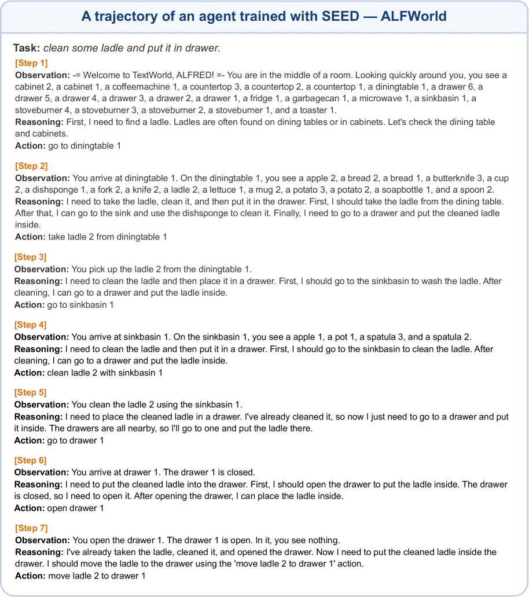

> Figure 12: ALFWorld Example 1. Seed locates and cleans the ladle, opens the closed drawer, and completes the placement in seven steps, demonstrating task decomposition and correct precondition handling.

这张图展示了使用SEED方法训练的智能体在ALFWorld环境中完成“清洗勺子并放入抽屉”任务的完整轨迹，清晰地呈现了智能体如何通过一系列步骤分解任务并处理前置条件。

图的结构是一个按步骤（Step）组织的表格，每个步骤包含三个关键部分：**观察（Observation）**、**推理（Reasoning）**和**动作（Action）**，这些部分按顺序排列，展示了智能体从任务开始到完成的决策过程。

1. **任务描述**：图的顶部明确了任务目标：“clean some ladle and put it in drawer”（清洗一个勺子并将其放入抽屉）。这是智能体需要完成的最终目标。

2. **步骤分解**：
    * **Step 1**：智能体首先观察到自己身处一个房间，周围有各种物体（如橱柜、咖啡机、台面、餐桌、抽屉等）。基于“勺子通常在餐桌或橱柜上”的推理，智能体决定“go to diningtable 1”（前往餐桌1）。这一步展示了智能体如何根据环境观察和常识推理来选择初始动作。
    * **Step 2**：智能体到达餐桌1，观察到桌上有苹果、面包、黄油刀、杯子、洗碗海绵、叉子、刀、勺子（ladle 2）等物体。推理部分明确指出需要从餐桌上拿起勺子，然后清洗并放入抽屉。因此，智能体执行“take ladle 2 from diningtable 1”（从餐桌1拿起勺子2）的动作。这一步展示了智能体如何识别目标物体并采取相应动作。
    * **Step 3**：智能体成功拿起勺子后，推理出需要前往水槽清洗勺子。于是执行“go to sinkbasin 1”（前往水槽1）的动作。这一步展示了智能体如何规划下一步的清洗动作。
    * **Step 4**：智能体到达水槽1，观察到水槽中有苹果、锅、铲子等物体。推理部分再次强调需要清洗勺子，因此执行“clean ladle 2 with sinkbasin 1”（用水槽1清洗勺子2）的动作。这一步展示了智能体如何执行清洗任务。
    * **Step 5**：勺子清洗完成后，智能体推理出需要将勺子放入抽屉。由于抽屉通常是关闭的，因此决定前往抽屉1，执行“go to drawer 1”（前往抽屉1）的动作。这一步展示了智能体如何规划放置勺子的动作。
    * **Step 6**：智能体到达抽屉1，观察到抽屉是关闭的。推理部分指出需要打开抽屉才能放入勺子，因此执行“open drawer 1”（打开抽屉1）的动作。这一步展示了智能体如何处理前置条件（打开抽屉）。
    * **Step 7**：智能体打开抽屉后，观察到抽屉内为空。推理部分明确指出需要将清洗后的勺子放入抽屉，因此执行“move ladle 2 to drawer 1”（将勺子2移动到抽屉1）的动作。这一步展示了智能体如何完成最终任务。

3. **方法运作的揭示**：
    * **任务分解**：通过每个步骤的推理部分，我们可以看到智能体如何将复杂任务（清洗勺子并放入抽屉）分解为一系列简单的子任务（找到勺子、拿起勺子、清洗勺子、找到抽屉、打开抽屉、放入勺子）。每个子任务都对应一个明确的观察和动作。
    * **前置条件处理**：智能体在每个步骤中都会考虑当前的前置条件（如抽屉是否关闭），并采取相应的动作来满足这些条件（如打开抽屉）。例如，在Step 6中，智能体意识到抽屉是关闭的，因此先执行打开抽屉的动作，然后再放入勺子。
    * **SEED方法的体现**：这张图展示了SEED方法如何通过将完成的任务轨迹转换为训练时的“后见之明技能”（hindsight skills），并将这些技能的行为效果蒸馏回策略模型中。在这个例子中，智能体通过分析完成的轨迹（即图中的步骤序列），生成了能够捕获可重用工作流程（如“找到勺子→拿起勺子→清洗勺子→找到抽屉→打开抽屉→放入勺子”）的自然语言技能。在强化学习（RL）过程中，当前策略既收集轨迹，又作为分析器从轨迹中提取这些后见之明技能，从而改进后续的决策制定和技能分析。

4. **结果展示**：
    * **坐标/对比对象**：图中没有明确的坐标或对比对象，但通过步骤序列展示了智能体在七个步骤内完成任务的过程。
    * **结论**：图中的结果表明，使用SEED方法训练的智能体能够成功地分解任务并处理前置条件，最终在七个步骤内完成“清洗勺子并放入抽屉”的任务。这验证了SEED方法在长 horizon 任务中的有效性，特别是在任务分解和前置条件处理方面的优势。

总之，这张图通过一个具体的例子展示了SEED方法如何使智能体在ALFWorld环境中完成复杂任务，揭示了方法的具体运作方式，并证明了其在任务分解和前置条件处理方面的有效性。

---

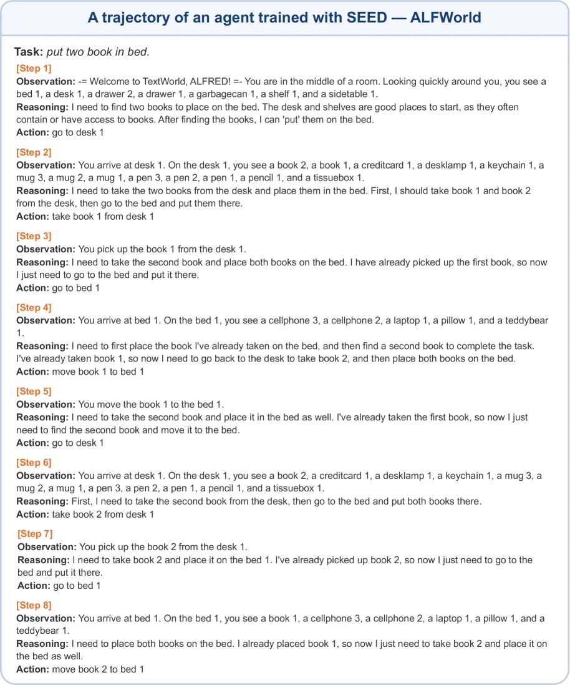

> Figure 13: ALFWorld Example 2. Seed places two books through repeated trips between the desk and bed while retaining the completed first placement, demonstrating progress tracking over an extended trajectory.

这张图来自论文《SEED: Self-Evolving On-Policy Distillation for Agentic Reinforcement Learning》，展示了在ALFWorld环境中，一个经过SEED方法训练的智能体执行“put two book in bed”任务的完整轨迹。它通过分步展示智能体的观察（Observation）、推理（Reasoning）和行动（Action），清晰地解释了SEED方法的工作原理。

首先，我们看到图的结构是按步骤（Step）组织的，从Step 1到Step 8，每个步骤都包含三个关键部分：观察、推理和行动。这些部分按时间顺序流动，展示了智能体如何与环境交互并完成任务。

在Task部分，明确给出了任务目标：“put two book in bed”，即把两本书放到床上。

Step 1：
- 观察（Observation）：智能体初始在房间中央，看到床、书桌、抽屉等物品。
- 推理（Reasoning）：智能体需要找到两本书并放到床上。它认为书桌和书架是可能找到书的地方。
- 行动（Action）：go to desk 1，即前往书桌1。

Step 2：
- 观察：智能体到达书桌1，看到书桌上有一本书1（book 1）和书2（book 2）以及其他物品。
- 推理：智能体计划先从书桌上拿起书1和书2，然后去床上放置。
- 行动：take book 1 from desk 1，即从书桌1拿起书1。

Step 3：
- 观察：智能体已经从书桌1上拿起了书1。
- 推理：智能体已经拿到了第一本书，现在需要去床上放置这本书，然后再回去拿第二本书。
- 行动：go to bed 1，即前往床1。

Step 4：
- 观察：智能体到达床1，看到床上有手机、笔记本电脑、枕头等物品。
- 推理：智能体需要先将已经拿到的书1放到床上，然后再回去拿书2。
- 行动：move book 1 to bed 1，即将书1放到床1上。

Step 5：
- 观察：智能体成功将书1放到了床1上。
- 推理：智能体现在需要回到书桌1去拿第二本书（书2）。
- 行动：go to desk 1，即再次前往书桌1。

Step 6：
- 观察：智能体再次到达书桌1，看到书2仍在那里。
- 推理：智能体计划从书桌1拿起书2，然后去床上放置。
- 行动：take book 2 from desk 1，即从书桌1拿起书2。

Step 7：
- 观察：智能体已经从书桌1上拿起了书2。
- 推理：智能体需要将书2放到床1上。
- 行动：go to bed 1，即前往床1。

Step 8：
- 观察：智能体到达床1，看到书1已经在床上了。
- 推理：智能体需要将书2也放到床上，以完成任务。
- 行动：move book 2 to bed 1，即将书2放到床1上。

这张图揭示了SEED方法的具体运作方式：智能体通过多次往返于书桌和床之间，逐步完成任务。在每一步中，智能体都会根据当前的观察进行推理，决定下一步的行动。这种方法展示了智能体如何在长时间的任务中跟踪进度，保留已完成的操作（如第一步放置书1），并继续执行后续步骤（如放置书2）。这正是SEED方法的核心思想之一：通过将完成的轨迹转化为可重用的技能（skills），并在策略学习中进行蒸馏（distillation），从而实现自我进化的策略改进。图中智能体的行为序列清晰地展示了这种逐步学习和决策的过程，证明了SEED方法能够有效地处理需要多步交互的长期任务。

这张图不是一个传统的结果图，没有坐标、对比对象或统计结论。它是一个示例图，用于说明SEED方法在ALFWorld环境中的应用和效果。结论是，通过SEED方法训练的智能体能够成功地完成复杂的、多步骤的任务，如将两本书放到床上，并且在过程中能够有效地跟踪进度和利用已有的知识。

---

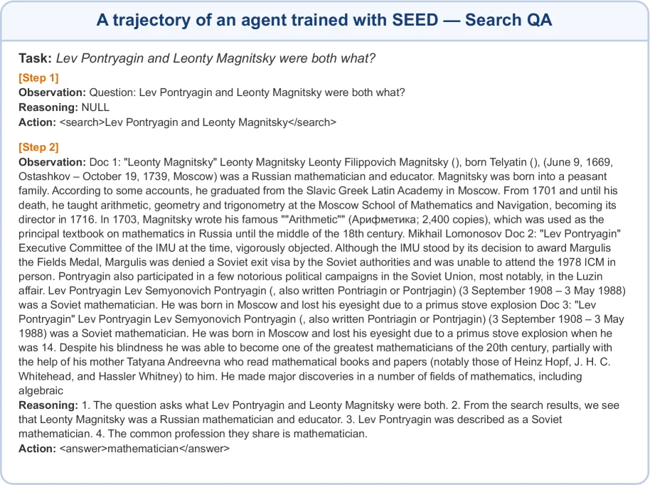

> Figure 14: Search-based QA Example 1. A single query retrieves evidence that both people are mathematicians, allowing Seed to answer without unnecessary searches.

数学家

---

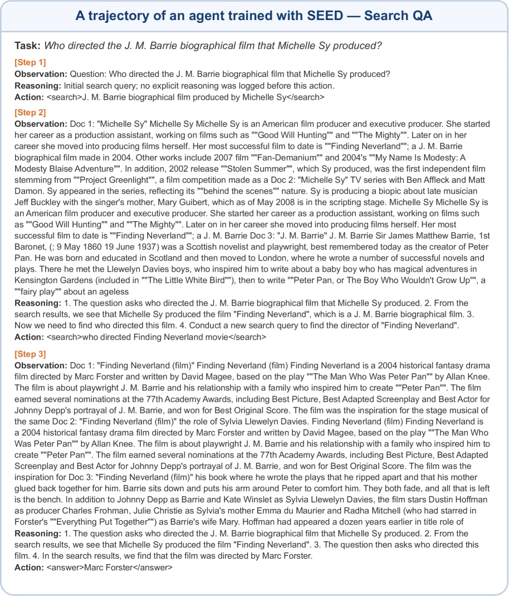

> Figure 15: Search-based QA Example 2. Seed first identifies Finding Neverland , then performs a targeted second search to verify that Marc Forster directed the film.

马克·福斯特

---

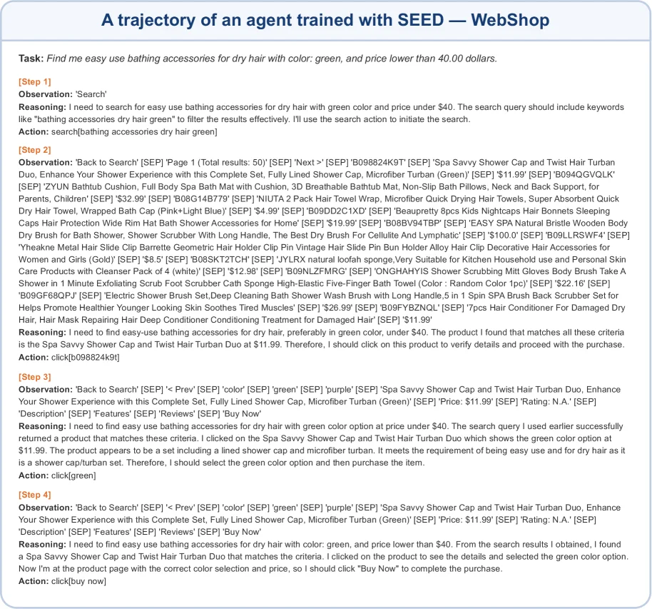

> Figure 16: WebShop Example 1. Seed identifies a green shower cap and hair turban set under $40, verifies the selected variant, and completes the purchase in four steps.

这张图展示了在WebShop环境中，使用SEED方法训练的智能体完成“寻找价格低于40美元的绿色干发沐浴配件”这一任务的具体步骤轨迹，清晰呈现了智能体如何通过多轮交互（搜索、点击、选择颜色、购买）完成任务，体现了SEED方法中策略与环境反馈交互并逐步优化决策的过程。

首先看**任务描述**：顶部明确任务是“Find me easy use bathing accessories for dry hair with color: green, and price lower than 40.00 dollars”，即寻找易用的绿色干发沐浴配件且价格低于40美元，这是智能体的目标。

然后是**步骤分解**，从Step 1到Step 4，每个步骤包含Observation（观察）、Reasoning（推理）、Action（动作）三个部分，数据/信息按“观察环境状态→基于目标和当前状态推理→执行动作改变环境”的顺序流动：

- **Step 1**：
  - Observation：显示“Search”，说明当前环境状态是搜索界面，需要发起搜索。
  - Reasoning：解释了搜索的必要性，即需要包含关键词“bathing accessories dry hair green”来有效过滤结果，因此决定执行搜索动作。
  - Action：执行“search[bathing accessories dry hair green]”，即发起针对目标配件的搜索，这是任务的起始交互，获取相关商品列表。

- **Step 2**：
  - Observation：展示了搜索结果页面，包含多个商品的名称、价格、描述等（如“Spa Savvy Shower Cap and Twist Hair Turban Duo”价格为$11.99，符合预算且颜色可能为绿色），总结果数50，还有分页信息（Page 1）。
  - Reasoning：分析搜索结果，找到符合“easy use、dry hair、green、price < $40”的商品（即Spa Savvy Shower Cap and Twist Hair Turban Duo，价格$11.99），因此决定点击该商品以验证细节并推进购买流程。
  - Action：执行“click[b098824k9t]”，即点击该商品进入详情页，这是对搜索结果的筛选和交互，聚焦到目标商品。

- **Step 3**：
  - Observation：展示商品详情页的部分信息，包括颜色选项（green、purple等）、价格$11.99、评分N.A.、描述和功能等，确认商品的颜色选项包含绿色，且价格符合要求。
  - Reasoning：再次验证商品是否符合所有条件（easy use、dry hair、green、price < $40），确认后决定选择绿色颜色选项，为购买做准备。
  - Action：执行“click[green]”，即选择绿色的颜色变体，这是对商品属性的选择，确保购买的是绿色款。

- **Step 4**：
  - Observation：再次展示商品详情页，确认颜色已选为绿色，价格仍为$11.99，符合所有条件。
  - Reasoning：总结任务完成情况，即已找到符合条件的商品并选择了绿色变体，现在需要执行购买动作（点击“Buy Now”）来完成整个任务。
  - Action：执行“click[buy now]”，即点击购买按钮，完成任务。

这张图揭示了SEED方法的运作方式：智能体通过与WebShop环境的多轮交互（搜索、点击商品、选择颜色、购买），每一步都基于当前观察（环境状态）进行推理（结合任务目标和当前信息判断下一步动作），然后执行动作（改变环境状态）。这种“观察-推理-动作”的循环体现了强化学习中策略与环境反馈的交互，而SEED方法通过将完成的轨迹转化为“后见之明技能”（如这里的搜索关键词选择、商品筛选、颜色选择等可复用的工作流程），并将这些技能的行为效果蒸馏回策略模型，使得策略在后续决策中能更好地利用这些技能，同时策略更新又反过来提升技能分析的能力，形成自进化的闭环。例如，在Step 1中智能体学习如何发起有效搜索，在Step 2中学习如何筛选符合条件的商品，在Step 3中学习如何选择正确的颜色变体，最终在Step 4中完成任务，整个过程中策略通过与环境的交互不断优化，而SEED的蒸馏机制确保了这些中间决策（技能）被有效学习和利用，弥补了传统强化学习中稀疏奖励在中间决策指导上的不足。

从结果来看，智能体在四个步骤内成功完成了任务：从搜索到筛选商品、选择颜色，最后购买，验证了SEED方法在长 horizon 任务（多轮交互、工具使用、环境反馈）中的有效性，即能够通过自进化的策略蒸馏，让智能体学会完成复杂的交互任务，每一步的决策都有明确的推理依据，且最终达成任务目标（找到并购买符合条件的商品）。

---

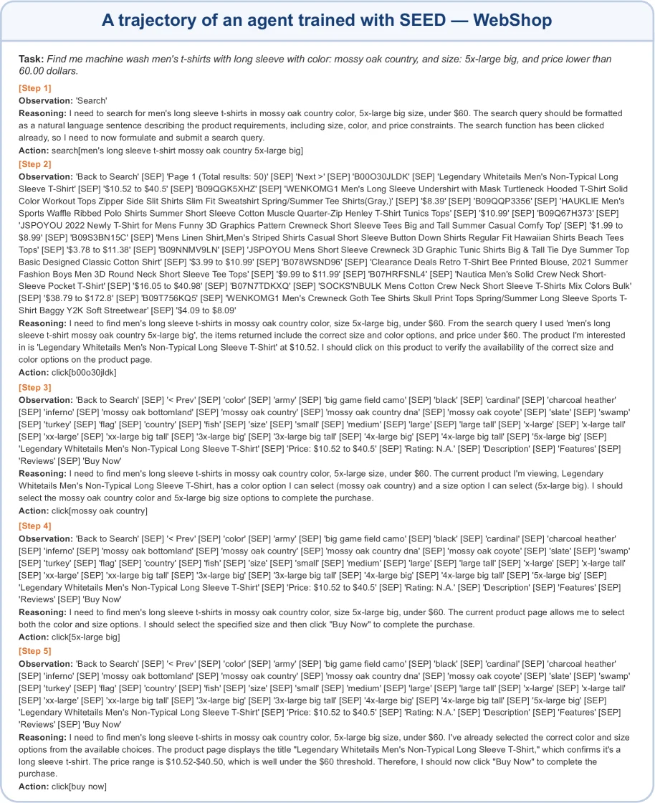

> Figure 17: WebShop Example 2. Seed preserves the requested product constraints and selects mossy oak country and 5x-large big before purchasing a matching long-sleeve shirt under $60.

这张图展示了在WebShop环境中，一个通过SEED方法训练的智能体完成特定购物任务的完整轨迹，清晰地呈现了智能体如何一步步处理任务、与环境交互并最终达成目标的过程。

首先，图的顶部明确了任务目标：找到价格低于60美元的、颜色为“mossy oak country”、尺码为“5x-large big”的男士长袖T恤。这为整个轨迹设定了清晰的终点。

接下来，图按步骤（Step）顺序展示了智能体的行为和思考过程：

*   **Step 1 (搜索)**:
    *   **观察 (Observation)**: 智能体需要搜索符合要求的男士长袖T恤。
    *   **推理 (Reasoning)**: 智能体分析了任务需求，明确了需要搜索的关键词应包含颜色、尺码和价格约束。
    *   **行动 (Action)**: 智能体执行了搜索操作，输入了搜索查询：“men's long sleeve t-shirt mossy oak country 5x-large big”。这一步是任务的起点，智能体根据理解生成了初始的搜索指令。

*   **Step 2 (浏览搜索结果)**:
    *   **观察 (Observation)**: 智能体回到了搜索页面，显示了搜索结果（共50个结果），并列出了多个商品及其价格。
    *   **推理 (Reasoning)**: 智能体需要从搜索结果中筛选出符合条件的商品。它识别出第一个商品“Legendary Whitetails Men's Non-Typical Long Sleeve T-Shirt”价格为$10.52，符合价格要求，并决定点击该商品以查看详细信息。
    *   **行动 (Action)**: 智能体点击了该商品的链接（`click[b00030jldk]`）。这一步展示了智能体如何根据观察结果进行决策，并与环境进行交互。

*   **Step 3 (选择颜色)**:
    *   **观察 (Observation)**: 智能体现在在商品详情页面，看到了颜色选项列表，其中包括“mossy oak country”。
    *   **推理 (Reasoning)**: 智能体需要选择指定的颜色“mossy oak country”，并继续选择尺码。
    *   **行动 (Action)**: 智能体点击了“mossy oak country”颜色选项（`click[mossy oak country]`）。这一步显示了智能体如何处理商品的具体属性选择。

*   **Step 4 (选择尺码)**:
    *   **观察 (Observation)**: 智能体现在在颜色选择后的页面，看到了尺码选项列表，其中包括“5x-large big”。
    *   **推理 (Reasoning)**: 智能体需要选择指定的尺码“5x-large big”，然后进行购买。
    *   **行动 (Action)**: 智能体点击了“5x-large big”尺码选项（`click[5x-large big]`）。这一步进一步推进了购买流程。

*   **Step 5 (确认购买)**:
    *   **观察 (Observation)**: 智能体现在在尺码选择后的页面，再次确认了商品信息：颜色是“mossy oak country”，尺码是“5x-large big”，价格在$10.52到$40.50之间，符合预算。
    *   **推理 (Reasoning)**: 智能体确认所有约束条件都已满足，现在是时候完成购买了。
    *   **行动 (Action)**: 智能体点击了“Buy Now”按钮（`click[buy now]`）。这标志着任务的完成。

这张图揭示了SEED方法的具体运作方式：
1.  **任务分解与执行**: 智能体将一个复杂的长期任务（购物）分解为一系列具体的、可执行的步骤（搜索、浏览、选择属性、购买）。
2.  **观察-推理-行动循环**: 在每个步骤中，智能体首先观察当前环境状态，然后进行推理分析以确定下一步行动，最后执行该行动。这个循环是强化学习智能体与环境交互的核心。
3.  **利用反馈进行决策**: 智能体根据环境提供的反馈（如搜索结果、商品属性选项）来调整其行为，确保每一步都朝着完成任务的目标前进。
4.  **技能的隐式学习与应用**: 虽然图中没有直接展示SEED的内部机制，但可以推断，智能体在执行这些步骤时，可能已经学习到了如何处理此类任务的“技能”（如如何根据约束条件筛选商品、如何进行多步骤交互）。SEED方法通过将这些完成的轨迹转化为“后见之明”的技能，并将其蒸馏回策略模型，从而增强了智能体的决策能力。这张图中的智能体行为正是这种经过优化的策略的体现，它能够有效地处理多步骤、带约束的交互任务。

总结来说，这张图通过一个具体的WebShop购物示例，生动地展示了通过SEED方法训练的智能体如何理解任务、与环境交互、并最终成功完成目标。它清晰地呈现了智能体的决策过程和行为序列，证明了该方法在处理长周期、多步骤交互任务中的有效性。
