# BadWAM: When World-Action Models Dream Right but Act Wrong

[arXiv](https://arxiv.org/abs/2607.15207) · [HuggingFace](https://huggingface.co/papers/2607.15207) · ▲47

## 摘要（原文）

> World-action models (WAMs) are emerging as a promising foundation for embodied control: rather than predicting actions alone, they learn representations that couple action generation with future world prediction. This coupling is often viewed as a source of robustness, interpretability, and safety, as a robot's action can in principle be checked against its imagined future. In this paper, we show that this assumption is fragile. We introduce BadWAM, a unified framework for modeling and evaluating World-Action Drift Attacks: a new class of WAM-specific adversarial attacks that use small visual perturbations to break the alignment between what a WAM imagines and what it executes. BadWAM characterizes this attack surface along two natural criteria: attack strength and stealthiness. When the adversary prioritizes disruption, BadWAM instantiates an action-only adversarial attack, which directly drives the model toward task-failing actions. When the adversary additionally prioritizes stealth, BadWAM instantiates an imagination-preserving adversarial attack, which seeks to induce harmful action shifts while keeping the model's predicted future close to its clean imagination. Together, these two attacks capture a spectrum of WAM-specific failures: from overt action hijacking to stealthier cases where the model appears to imagine a plausible future but executes a desynchronized action. We evaluate BadWAM across different variants of WAMs. Results show that our attacks substantially reduce task success rates under closed-loop execution. For example, our action-only attack reduces the model performance from 96.5% to 43.1% success. The results of our imagination-preserving attack further exposes a WAM-specific vulnerability: moderate future-preserving regularization can maintain strong attack performance while reducing future imagination drift.

## 摘要（中译）

世界动作模型（World - action models，WAMs）正成为具身控制的一个有前景的基础：它们不是仅预测动作，而是学习将动作生成与未来世界预测相结合的表示。这种结合通常被视为鲁棒性、可解释性和安全性的来源，因为原则上可以对照机器人想象的未来来检查其动作。在本文中，我们表明这一假设是脆弱的。我们引入了BadWAM，这是一个用于建模和评估世界 - 动作漂移攻击（World - Action Drift Attacks）的统一框架：这是一类新的针对WAM的对抗性攻击，它使用小的视觉扰动来打破WAM想象的内容和它执行的内容之间的对齐。BadWAM根据两个自然标准来描述这个攻击面：攻击强度和隐蔽性。当对手优先考虑破坏时，BadWAM实例化一个仅动作的对抗性攻击，该攻击直接将模型推向导致任务失败的动作。当对手还优先考虑隐蔽性时，BadWAM实例化一个保持想象的对抗性攻击，该攻击试图在使模型的预测未来接近其干净想象的同时引发有害的动作偏移。这两种攻击共同捕捉了一系列特定于WAM的故障：从公开的动作劫持到更隐蔽的情况，在这些情况中，模型似乎想象了一个合理的未来，但执行了一个不同步的动作。我们在不同变体的WAM上评估了BadWAM。结果表明，在闭环执行下，我们的攻击显著降低了任务成功率。例如，我们的仅动作攻击将模型性能从96.5%的成功率降低到43.1%。我们的保持想象的攻击的结果进一步揭示了一个特定于WAM的漏洞：适度的未来保持正则化可以在保持强攻击性能的同时减少未来想象的漂移。

## 背景剖析

### 背景剖析  

**1. 技术背景**  
机器人需要更智能地与环境互动——比如在家庭中整理物品、在仓库中搬运货物，或在危险场景中执行任务。传统方法让机器人“只看动作”（比如直接预测下一步该动哪里），但这种方法容易出错，因为机器人无法预见自己行为的长期后果。**世界-行动模型（WAM）**应运而生，它让机器人不仅学习“如何行动”，还学习“行动会带来什么结果”。例如，机器人可以想象“如果我移动这个箱子，旁边的架子会不会倒？”这种能力让机器人更安全、更可靠，因为它能提前发现危险并调整计划。  

**2. 之前的问题**  
尽管WAM听起来很理想，但它有一个致命弱点：**行动和想象可能不同步**。比如，机器人可能想象自己成功完成了任务（比如“把杯子放到桌子上”），但实际执行的动作却导致失败（比如“杯子掉地上”）。更糟糕的是，这种“脱节”很难被发现——因为机器人的想象看起来完全合理。之前的攻击研究主要针对图像分类或简单机器人策略，但没有考虑WAM特有的“行动-想象耦合”问题。  

**3. 本文的解法**  
本文提出了**BadWAM框架**，专门测试WAM的脆弱性。它通过两种攻击方式验证问题：  
- **直接破坏行动**：用微小的视觉干扰（比如修改一张图片的像素）让机器人做出错误动作，比如“抓空”或“打翻物体”。  
- **隐蔽攻击**：让机器人的想象看起来没问题（比如“杯子还在桌子上”），但实际动作却失败（比如“机械臂突然松手”）。  
实验表明，这些攻击能大幅降低机器人的任务成功率（比如从96.5%降到43.1%），证明WAM的“安全信号”（即想象未来）并不可靠。  

**4. 切入角度**  
与以往研究不同，BadWAM不关注“如何让模型更准确”，而是问：“**模型在什么情况下会欺骗自己？**”它揭示了一个关键问题：WAM的行动和想象是两个耦合但可能脱节的系统。攻击者可以利用这一点，在不破坏想象的情况下破坏行动。这种视角为未来的安全研究指明了新方向——仅仅优化预测能力是不够的，必须确保行动与想象真正对齐。

## 方法图解

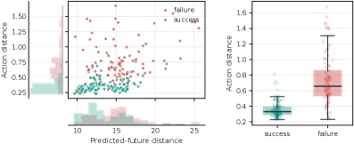

> Figure 1 : Empirical motivation for world-action adversarial attacks. Failed episodes tend to have larger action shifts, while predicted-future shifts overlap across successful and failed executions. This motivates attacking the alignment between action and imagination.

这张图（图1）作为论文的实证动机部分，旨在说明为什么针对世界-动作模型（WAMs）的对抗性攻击是必要的，以及这些攻击的目标是什么。

首先，我们来看左边的图表。这是一个散点图，结合了两个变量的分布情况：
1.  **横轴（X轴）**：标记为“Predicted-future distance”（预测未来距离）。这个变量代表了模型预测的未来状态与某个基准（可能是干净输入或预期状态）之间的距离。我们可以将其理解为模型“想象”的未来与实际情况之间的偏差。
2.  **纵轴（Y轴）**：标记为“Action distance”（动作距离）。这个变量代表了实际执行的动作与某个基准（可能是最优动作或预期动作）之间的距离。我们可以将其理解为模型“执行”的动作与期望动作之间的偏差。
3.  **数据点**：图中有两种颜色的数据点：
    *   红色点代表“failure”（失败）的情节（episode）。
    *   青绿色点代表“success”（成功）的情节。
4.  **分布直方图**：在散点图的下方和左侧，分别有两个直方图：
    *   下方的直方图显示了“Predicted-future distance”的分布，其中青绿色代表成功案例，红色代表失败案例。
    *   左侧的直方图显示了“Action distance”的分布，同样，青绿色代表成功案例，红色代表失败案例。

从左边的图表中我们可以观察到：
*   对于失败的情节（红色点），它们的“Action distance”（纵轴值）普遍较大。这意味着在失败的案例中，模型执行的动作与其期望动作之间的偏差更大。直方图也显示，失败案例的动作距离分布更偏向于较大的值。
*   对于成功的情节（青绿色点），它们的“Action distance”相对较小。直方图显示，成功案例的动作距离分布更集中在较小的值附近。
*   关于“Predicted-future distance”（横轴），成功和失败的情节的分布似乎有重叠。这意味着无论情节是成功还是失败，模型预测的未来与基准之间的偏差可能没有显著差异。直方图也显示，成功和失败案例的预测未来距离分布有一定的重叠区域。

接下来，我们看右边的图表。这是一个箱线图（box plot），用于比较成功和失败情节的“Action distance”：
1.  **X轴**：有两个类别，“success”（成功）和“failure”（失败）。
2.  **Y轴**：同样是“Action distance”（动作距离）。
3.  **箱线图元素**：
    *   箱体代表了数据的四分位数范围（Q1到Q3），中间的线是中位数。
    *   箱体上下的须线（whiskers）通常表示数据的范围（例如，1.5倍的四分位距内的最远数据点）。
    *   散点是异常值或所有数据点。

从右边的箱线图中我们可以更清晰地看到：
*   “failure”类别的箱线图显示其“Action distance”的中位数和整体分布都显著高于“success”类别。
*   “success”类别的箱线图显示其“Action distance”集中在较低的数值范围内。
*   这进一步证实了左图的观察：失败的情节倾向于有更大的动作偏差。

**这张图揭示的方法运作方式（实证基础）：**
这张图通过实证数据展示了WAMs在失败和成功执行时的一个关键差异：失败的执行通常伴随着更大的动作偏差，而预测的未来偏差在成功和失败之间并没有显著区别。这为针对WAMs的对抗性攻击提供了一个明确的切入点。
*   **攻击目标**：既然失败的根源在于动作执行与期望（或想象）的未来之间的脱节，特别是动作偏差的增大，那么攻击可以针对这个“对齐”关系。
*   **攻击策略**：论文提出的“世界-动作对抗性攻击”（world-action adversarial attacks）正是旨在破坏这种动作与想象之间的对齐。具体来说：
    *   攻击者可以利用小的视觉扰动来使模型产生有害的动作偏移。
    *   有两种类型的攻击：
        1.  **仅动作攻击**：当攻击者优先考虑破坏时，攻击会直接驱动模型执行导致任务失败的动作，这对应于增加“Action distance”。
        2.  **想象保留攻击**：当攻击者同时考虑隐蔽性时，攻击会试图在保持模型预测的未来（即“Predicted-future distance”）接近其干净想象的同时，诱导出有害的动作偏移。这意味着攻击者希望模型的“想象”看起来仍然合理，但其“行动”却偏离了期望。

**结论：**
这张图通过对比成功和失败执行的“动作距离”和“预测未来距离”，清晰地表明失败的执行与更大的动作偏差相关联，而预测的未来偏差则不是区分成功与失败的关键因素。这为论文中提出的攻击方法提供了实证动机：通过攻击动作与想象之间的对齐，可以有效地导致WAMs执行失败，甚至可以实现隐蔽的攻击，即模型的想象看起来正常，但行动却是错误的。

---

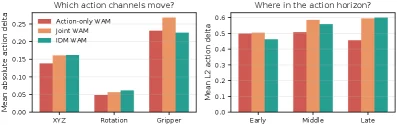

> Figure 2 : Action-only adversarial attack produces structured action shifts. Across three WAM variants, the attack primarily perturbs continuous action channels and specific portions of the action horizon, rather than acting as uniform output noise.

这张图（图2）清晰地展示了“仅动作对抗攻击”（action-only adversarial attack）如何导致WAMs（World-Action Models）产生结构化的动作偏移。它通过两个并排的子图来呈现这些发现。

左边的子图标题为“哪些动作通道会变动？”（Which action channels move?）。这个图表的核心是展示在不同类型的WAM模型中，攻击主要影响哪些动作通道。横轴列出了三种动作通道类型：“XYZ”（可能代表位置或平移）、“Rotation”（旋转）和“Gripper”（抓手）。纵轴表示“平均绝对动作增量”（Mean absolute action delta），衡量了攻击前后动作变化的幅度。图中有三种颜色的柱状图，分别代表三种WAM变体：“Action-only WAM”（红色）、“Joint WAM”（橙色）和“IDM WAM”（青绿色）。从数据可以看出，攻击对“Gripper”通道的影响最大，其次是“XYZ”通道，而对“Rotation”通道的影响最小。这表明攻击不是随机噪声，而是有选择性地针对特定的动作维度。

右边的子图标题为“在动作时间轴的哪个位置？”（Where in the action horizon?）。这个图表展示了攻击在动作序列的不同阶段（即动作时间轴上）的影响分布。横轴分为三个部分：“Early”（早期）、“Middle”（中期）和“Late”（晚期），代表动作序列的不同时刻。纵轴表示“平均L2动作增量”（Mean L2 action delta），同样衡量了动作变化的幅度。这里同样使用了三种颜色的柱状图来代表三种WAM变体。数据显示，在所有三种WAM变体中，攻击在动作序列的“Early”和“Late”阶段的影响较大，而在“Middle”阶段的影响相对较小。这说明攻击不是均匀分布在动作序列中的，而是集中在特定的时间点。

综合来看，这张图揭示了“仅动作对抗攻击”的具体运作方式：它不是简单地向模型输出添加随机噪声，而是产生有结构的动作偏移。具体来说，这种攻击主要影响特定的动作通道（如抓手动作），并且在动作序列的特定部分（如开始和结束阶段）更为显著。通过对比不同WAM变体的响应，我们可以看到尽管存在差异，但所有模型都表现出类似的结构化响应模式。这证明了攻击的有效性和针对性，也说明了WAMs在面对此类攻击时的脆弱性。

总结图中的结论：对于所有三种WAM变体，仅动作对抗攻击主要扰动连续的动作通道（如抓手和位置）和动作时间轴的特定部分（如早期和晚期），而不是作为均匀的输出噪声。这意味着攻击具有结构性，针对模型的关键动作输出进行干扰。

---

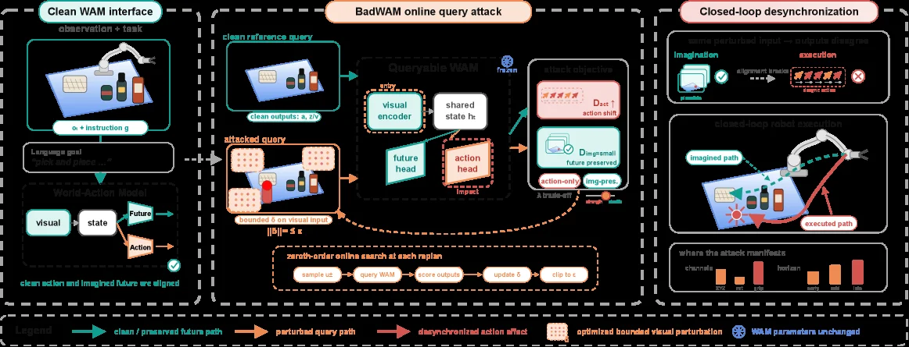

> Figure 3 : Overview of BadWAM. BadWAM injects a small visual perturbation into model observations and performs query-based online search over a frozen WAM. The optimized trigger disrupts the action prediction pathway while preserving or minimally altering visual rollout predictions, leading to world-action adversarial attacks during closed-loop execution.

这张图是论文《BadWAM: When World - Action Models Dream Right but Act Wrong》中关于BadWAM方法的概述图，它清晰地展示了BadWAM攻击的整个流程和核心思想。

首先看最左边的“Clean WAM interface”板块，这里展示的是干净的世界 - 动作模型（WAM）的接口情况。上方的“observation + task”部分，有一个机器人操作场景的图，还有指令\( g \)，这表示输入的是干净的观察（比如视觉观察）和任务指令。下方的“Language goal”和“World - Action Model”部分，展示了WAM的正常工作流程：视觉输入和状态输入进入WAM，然后WAM生成动作，同时想象未来（“clean action and imagined future are aligned”说明此时动作和想象的未来是对齐的，也就是模型能正确地将动作和其想象的未来联系起来）。

接下来是中间的“BadWAM online query attack”板块，这是攻击的核心部分，数据或信息的流动顺序如下：
1. 首先是“clean reference query”，这里有干净的观察（和左边干净WAM的观察类似）和对应的干净输出（“clean outputs: \( \hat{a}, \hat{z} \)”，\( \hat{a} \)可能是干净的动作预测，\( \hat{z} \)是干净的未来预测）。然后这个干净的查询会进入“Queryable WAM”（一个冻结的WAM，即参数不变，“WAM parameters unchanged”的图标也说明了这一点）。
2. 然后是“attacked query”，这里对视觉输入进行了有界扰动（“bounded \( \delta \) on visual input”，\( ||\delta|| \leq \epsilon \)，\( \epsilon \)是一个小的扰动上限），得到受攻击的视觉输入。这个受攻击的查询也会进入“Queryable WAM”。
3. 在“Queryable WAM”内部，有“visual encoder”（视觉编码器）、“shared state \( h \)”（共享状态）、“future head”（未来头，用于预测未来）、“action head”（动作头，用于预测动作）。攻击的目标是“attack objective”，这里有两个部分：“\( D_{\text{act shift}} \) action shift”（动作偏移，希望动作偏离正确的）和“\( D_{\text{img small}} \) future preserved”（未来保留，希望未来预测和干净的接近，也就是保持或最小化改变视觉滚动预测）。这两个目标之间存在“a trade - off”（权衡），因为要同时实现动作偏移和未来保留（或最小改变）。
4. 然后是“zeroth - order online search at each timestep”（每个时间步的零阶在线搜索），这个搜索过程的步骤是：“sample \( \hat{u}_t \)”（采样扰动\( \hat{u}_t \)）、“query WAM”（查询WAM）、“score outputs”（对输出打分）、“update \( \delta \)”（更新扰动\( \delta \)）、“clip to \( \epsilon \)”（将扰动裁剪到\( \epsilon \)范围内），通过这个迭代过程来优化扰动\( \delta \)，使得攻击效果最好。

最后是最右边的“Closed - loop desynchronization”板块，展示了攻击在闭环执行中的表现：
1. 上方的“Imagination”和“execution”部分，“Imagination”是模型想象的未来（有一个绿色的对勾，说明想象的未来看起来是合理的），“execution”是实际执行的动作（有一个红色的叉，说明实际执行的动作是错误的，和想象的不一致），这里的“same perturbed input → output change”说明输入被扰动后，输出（动作）发生了变化，导致想象和执行脱节。
2. 中间的“closed - loop robot execution”部分，展示了想象的路径（“imagined path”，绿色虚线）和实际执行的路径（“executed path”，红色实线），可以看到两者是不同的，这就是攻击导致的动作偏移。
3. 下方的“where the attack manifests”部分，是一个柱状图，展示了不同通道（channels）或类别下的攻击表现，橙色和红色的柱子分别代表不同的情况，说明攻击在不同情况下的效果。

总结一下，BadWAM的方法运作方式是：向WAM的观察中注入小的视觉扰动，然后对冻结的WAM进行基于查询的在线搜索（零阶搜索），优化这个扰动，使得WAM的动作预测路径被破坏（动作偏离正确的），但视觉滚动预测（想象的未来）被保留或最小限度地改变，从而在闭环执行中导致世界 - 动作对抗攻击，即模型想象的未来是合理的，但实际执行的动作是错误的，实现了动作和想象的脱节。这种攻击有两种情况：一种是优先考虑破坏的“action - only adversarial attack”（只针对动作的对抗攻击，直接驱动模型产生任务失败的动作），另一种是优先考虑隐蔽性的“imagination - preserving adversarial attack”（保留想象的对抗攻击，在诱导有害动作偏移的同时保持模型预测的未来接近干净想象的未来），这两种攻击涵盖了从公开的动作劫持到更隐蔽的动作与想象脱节的情况。

---

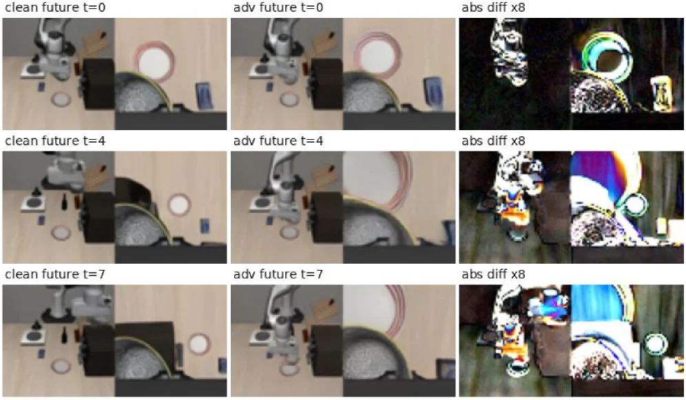

> (a) Imagined future without preservation. (b) Imagined future with preservation. Figure 4 : Qualitative illustration of the imagination-preserving objective on IDM WAM. Each panel compares predicted futures under clean and adversarial observations at selected future steps. abs diff denotes the absolute pixel difference between clean and adversarial predictions, amplified by 8 × 8\times for visibility. Both variants induce action-space failure, but the preservation term keeps the adversarial future more consistent with the clean imagination.

这张图（图4）是对IDM WAM模型中“保留想象”目标的定性说明，旨在展示对抗性攻击下，模型预测的未来世界状态的变化。

首先，我们来看图的结构。这张图被组织成一个3行3列的网格，每一行代表一个特定的“未来步骤”（t=0, t=4, t=7）。每一列则代表不同的内容：
1.  **第一列（例如“clean future t=0”）**：这部分展示了在**没有对抗性干扰**（即“干净”的输入）的情况下，模型对未来世界的预测。这里的“clean future”指的是模型在没有受到攻击时，基于当前状态预测出的未来场景。例如，在第一行第一列，我们看到的是模型在时间步t=0时对未来的想象，这个想象是基于干净的观察。
2.  **第二列（例如“adv future t=0”）**：这部分展示了在**存在对抗性干扰**的情况下，模型对未来世界的预测。这里的“adv future”指的是模型在受到攻击（例如，输入图像被轻微扰动）后，预测出的未来场景。例如，在第一行第二列，我们看到的是模型在时间步t=0时，面对对抗性输入时所想象的未来。
3.  **第三列（例如“abs diff x8”）**：这部分展示了**“干净预测”与“对抗性预测”之间的绝对像素差异**。为了使这些差异更明显，图像被放大了8倍。“abs diff”即绝对差异，它突出了两张预测图像（干净的和对抗性的）之间的不同之处。例如，在第一行第三列，我们可以看到在时间步t=0时，干净预测和对抗性预测之间的像素级差异。

现在，我们来分析图中的数据流动和信息展示顺序：
*   **行方向（时间维度）**：从上到下（t=0, t=4, t=7），展示了随着时间推移，模型预测的未来状态如何变化。t=0可能代表一个初始的预测步骤，而t=4和t=7则代表后续的未来时间点。这让我们能够观察到攻击效果随时间的演变。
*   **列方向（条件对比）**：从左到右，每一行内的三列形成了一个对比组。首先看第一列的“干净预测”，然后看第二列的“对抗性预测”，最后看第三列的“差异图”。这种布局使得读者可以直观地比较在相同时间点，有无攻击时模型预测的差异。

这张图揭示了方法的具体运作方式：
*   **核心思想**：该方法（BadWAM中的“想象保留”目标）旨在研究一种特定类型的对抗性攻击，这种攻击试图在不显著改变模型对未来的想象（即预测的世界状态）的情况下，诱导模型执行有害的动作。
*   **对比展示**：通过并排展示“干净预测”和“对抗性预测”，我们可以观察到攻击是否成功改变了模型的未来想象。如果对抗性预测与干净预测非常相似（即差异图中的差异很小），则说明攻击在“保留想象”方面是有效的。
*   **差异可视化**：第三列的“abs diff x8”图像是关键，它量化并可视化了攻击对模型未来想象的影响程度。如果差异图中的颜色变化剧烈且范围广泛，说明攻击对模型的未来预测造成了显著干扰；反之，如果差异较小，则说明攻击在保留想象方面做得较好。

从结果图中我们可以得出以下结论：
*   **坐标与对比对象**：图中的每个单元格都对应一个特定的时间步（t=0, t=4, t=7）和一种预测条件（干净或对抗性）。对比对象是同一时间步下的“干净预测”和“对抗性预测”。
*   **主要结论**：根据图的caption，这两种变体（可能指不同的攻击方式或模型配置）都导致了**动作空间的失败**（即模型采取了错误的动作）。然而，**“保留项”（imagination-preservation term）使得对抗性未来（adversarial future）与干净想象（clean imagination）更加一致**。这意味着，当使用“保留想象”的目标时，即使攻击导致模型执行了错误的动作，模型对未来的预测仍然与没有攻击时的预测非常相似。换句话说，攻击是“隐蔽的”，因为它没有明显破坏模型对未来的想象，但却导致了错误的行动。

总结来说，这张图通过定性比较，展示了在IDM WAM模型中，对抗性攻击如何影响模型对未来的预测，以及“保留想象”目标如何使得攻击在破坏动作的同时，尽量保持未来预测的一致性。这使得攻击更加隐蔽，因为模型似乎仍然能够正确想象未来，但实际上却执行了错误的动作。

---

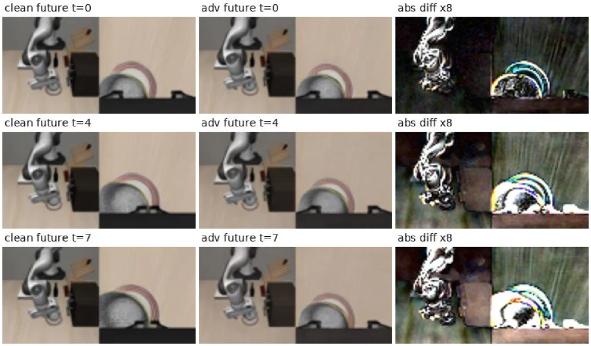

> (a) Imagined future without preservation. (b) Imagined future with preservation. Figure 4 : Qualitative illustration of the imagination-preserving objective on IDM WAM. Each panel compares predicted futures under clean and adversarial observations at selected future steps. abs diff denotes the absolute pixel difference between clean and adversarial predictions, amplified by 8 × 8\times for visibility. Both variants induce action-space failure, but the preservation term keeps the adversarial future more consistent with the clean imagination.

这张图是一个**定性结果展示图**，用于直观地说明“想象保留（imagination - preserving）”目标在IDM WAM（一种世界 - 动作模型）上的作用，属于论文中关于BadWAM攻击评估的部分内容。

### 图的组件与信息流动
- **列的含义**：
    - 第一列（如“clean future t = 0”“clean future t = 4”“clean future t = 7”）：展示的是**无对抗扰动时（干净观测下）模型预测的未来场景**，这里的“t”代表时间步（未来步骤），不同的t值（0、4、7）对应不同的未来时间点，我们可以看到模型在没有被攻击时对未来的想象（预测的世界状态）。
    - 第二列（如“adv future t = 0”“adv future t = 4”“adv future t = 7”）：展示的是**存在对抗扰动时（对抗观测下）模型预测的未来场景**，也就是在受到BadWAM攻击后，模型对未来的预测结果。
    - 第三列（“abs diff x8”）：展示的是**干净预测和对抗预测之间的绝对像素差异**，并且这个差异被放大了8倍（“x8”），目的是让差异更清晰可见。通过这个差异图，我们可以直观地看到对抗攻击对模型未来预测的影响程度。
- **行的含义**：
    - 每一行对应一个特定的未来时间步（t = 0、t = 4、t = 7）。这样我们可以观察在不同时间点上，干净预测、对抗预测以及它们的差异是如何变化的。

### 方法的运作方式（从图中理解的逻辑）
- 首先，模型（这里是IDM WAM）在**无对抗的情况下**（第一列），会对未来（不同t步）的场景进行预测，这些预测展示了模型原本“想象”的世界状态是如何随时间发展的。
- 然后，当**施加对抗扰动**（第二列）后，模型会基于被扰动的观测来预测未来。我们需要比较对抗预测和干净预测的差异（第三列的绝对差异图）。
- 从图中可以看到，对抗攻击会导致模型的未来预测发生变化（第二列和第一列的图像有差异），但“想象保留”的目标使得**对抗后的未来预测（第二列）尽可能地接近干净的未来预测（第一列）**（从视觉上看，第二列的图像和第一列的图像差异相对较小，尤其是在“想象保留”的情况下）。同时，这种攻击仍然会导致**动作空间的失败**（即模型的动作执行会出现问题，尽管它的未来想象看起来和干净的情况比较接近）。

### 结果的对比与结论
- **对比对象**：
    - 对比的是“干净未来预测”（第一列）和“对抗未来预测”（第二列），以及它们之间的像素差异（第三列）。
    - 不同的时间步（t = 0、t = 4、t = 7）下的对比，这样可以观察攻击在不同时间阶段的效果。
- **结论**：
    - 两种攻击变体（包括想象保留的攻击）都会导致**动作空间的失败**（即模型的动作执行出现问题）。
    - 但是，“想象保留”项（即对抗攻击中试图保留模型未来想象的部分）使得**对抗后的未来预测（第二列）与干净的未来预测（第一列）更加一致**（从第三列的绝对差异图可以看出，对抗后的差异相对较小，或者说模型在被攻击后，其预测的未来看起来更接近它原本干净时的想象）。换句话说，即使模型被攻击导致动作执行错误，但从它的未来想象来看，似乎还是比较合理的，这就是“想象保留”攻击的隐蔽性所在——它能让模型的未来想象看起来没问题，但动作却出错了。

---

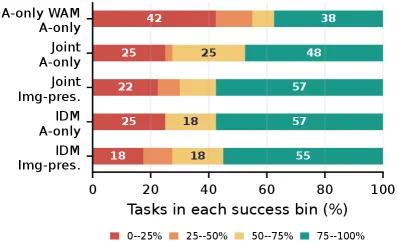

> Figure 5 : Task-level failure profile under attack. Unlike Table 1 , which reports aggregate success, this figure shows how attacked tasks distribute across success-rate bins. Lower bins indicate tasks that are consistently broken rather than merely slightly degraded.

这张图（图5）展示了在不同攻击类型下，任务在各个成功率区间的分布情况。与表1报告的总成功率不同，此图关注的是受攻击任务如何在不同的成功率“区间”（bins）中分布——较低的区间意味着任务被持续破坏，而不仅仅是轻微退化。

首先，我们来看图的**坐标轴和基本结构**：
*   **X轴**：表示“Tasks in each success bin (%)”，即每个成功率区间内的任务所占的百分比。范围从0%到100%。
*   **Y轴**：列出了不同的攻击类型或模型变体。从上到下依次是：
    *   `A-only WAM`：仅动作的世界动作模型（可能是基线或特定变体）。
    *   `Joint A-only`：联合训练的仅动作模型。
    *   `Joint Img-pres.`：联合训练的图像保持模型（可能指攻击时尽量保持图像预测不变）。
    *   `IDM A-only`：某种IDM（可能是指图像-动作解耦模型或其他特定模型）的仅动作版本。
    *   `IDM Img-pres.`：某种IDM的图像保持版本。
*   **颜色编码**：图例解释了不同颜色代表的成功率区间：
    *   **红色 (0--25%)**：任务成功率非常低，几乎总是失败。
    *   **橙色 (25--50%)**：任务成功率较低，大部分失败。
    *   **黄色 (50--75%)**：任务成功率中等，部分成功部分失败。
    *   **绿色 (75--100%)**：任务成功率非常高，几乎总是成功。

接下来，我们分析**每个条目的构成**，它揭示了特定攻击类型下任务的失败分布：
1.  **`A-only WAM`**：这个模型的任务分布是：42%的任务落在红色区域（0-25%成功率），少量任务在橙色（25-50%）和黄色（50-75%）区域，而38%的任务在绿色区域（75-100%成功率）。这表明该模型在攻击下，有相当一部分任务（42%）表现非常差，但也有近40%的任务仍然表现良好。
2.  **`Joint A-only`**：这个模型的任务分布更均匀一些：25%在红色，25%在橙色，剩余的50%（25%黄色 + 48%绿色？不对，应该是25+25+25+48=123？哦，应该是每个条形的总和为100%。所以应该是：25%红色，25%橙色，25%黄色，48%绿色。这表明该模型在攻击下，失败的任务分布更广泛，从非常差到较好的都有，但没有像`A-only WAM`那样有极高比例的极差任务。
3.  **`Joint Img-pres.`**：这个模型的任务分布是：22%红色，少量橙色（未标数值，但可以推断），然后是57%绿色。这表明在“图像保持”的攻击下，该模型的大部分任务（57%）仍然表现良好，只有少数任务（22%）表现非常差。
4.  **`IDM A-only`**：这个模型的任务分布是：25%红色，18%黄色，57%绿色。这表明该模型在攻击下，有相当一部分任务（25%）表现非常差，但大部分任务（57%）仍然表现良好。
5.  **`IDM Img-pres.`**：这个模型的任务分布是：18%红色，18%黄色，55%绿色。这表明在“图像保持”的攻击下，该模型的大部分任务（55%）仍然表现良好，有18%的任务表现非常差，另有18%的任务表现中等偏差。

**这张图揭示的方法运作方式（或攻击效果的评估方式）**：
这张图通过将任务按照其成功率划分为四个区间，并统计每个攻击类型下落在各个区间的任务百分比，来评估不同攻击对WAM模型性能的影响。这种方法使得我们可以直观地看到攻击是如何影响模型的——是导致大部分任务彻底失败（高比例的红色和橙色区域），还是仅仅使任务性能轻微下降（高比例的绿色区域，但红色区域也可能存在）。

**结论**：
从图中可以看出，不同的攻击类型对WAM模型的影响不同。例如，`A-only WAM`在攻击下有较高比例的任务（42%）处于极低成功率区间（0-25%），表明其容易受到严重破坏。而`Joint Img-pres.`和`IDM Img-pres.`模型在“图像保持”攻击下，有较高比例的任务（分别为57%和55%）仍处于高成功率区间（75-100%），这可能意味着这些模型在攻击下更能保持其功能，或者攻击者在这种情况下更难使任务完全失败。总体而言，这张图展示了在不同攻击策略下，WAM模型任务失败程度的分布情况，帮助我们理解攻击的特异性和模型的鲁棒性。

---

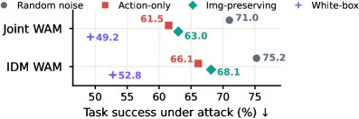

> Figure 6 : Comparison with random perturbations on full LIBERO dataset. All methods use the same ℓ ∞ \ell_{\infty} budget. Lower task success indicates a stronger attack.

这张图来自论文《BadWAM: When World-Action Models Dream Right but Act Wrong》，用于比较不同攻击方法在完整LIBERO数据集上的表现，所有方法使用相同的ℓ∞预算，任务成功率越低表示攻击越强。

### 图的组件与信息流动
- **横轴**：标记为“Task success under attack (%) ↓”，表示在攻击下的任务成功率（百分比），箭头向下表示数值越小（即任务成功率越低），攻击越强。
- **纵轴**：分为“Joint WAM”和“IDM WAM”两个类别，代表两种不同的世界-动作模型（WAM）变体。
- **数据点与图例**：
  - 蓝色圆点（Random noise）：随机噪声攻击的结果。
  - 红色方块（Action - only）：仅动作的对抗攻击结果，这种攻击直接驱使模型朝向任务失败的动作。
  - 绿色菱形（Img - preserving）：保留想象的对抗攻击结果，这种攻击试图在诱导有害动作偏移的同时，使模型的预测未来接近其干净的想象。
  - 紫色加号（White - box）：白盒攻击的结果。
- **数值标注**：每个数据点旁边的数字（如49.2、52.8、61.5等）是对应的任务成功率（%），数值越小表示攻击越强。

### 方法运作方式（从图中理解）
- 我们有三种主要的攻击方法需要比较：随机噪声攻击、仅动作攻击、保留想象攻击，还有白盒攻击作为参考。
- 对于每种WAM变体（Joint WAM和IDM WAM），我们观察不同攻击方法下的任务成功率：
  - 在Joint WAM中：
    - 随机噪声攻击的任务成功率是71.0%。
    - 仅动作攻击的任务成功率是61.5%。
    - 保留想象攻击的任务成功率是63.0%。
    - 白盒攻击的任务成功率是49.2%。
  - 在IDM WAM中：
    - 随机噪声攻击的任务成功率是75.2%。
    - 仅动作攻击的任务成功率是66.1%。
    - 保留想象攻击的任务成功率是68.1%。
    - 白盒攻击的任务成功率是52.8%。
- 从这些数据可以看出，仅动作攻击（Action - only）和保留想象攻击（Img - preserving）的任务成功率都比随机噪声攻击低，说明这两种针对WAM的攻击比随机噪声攻击更强。而白盒攻击的任务成功率最低，说明白盒攻击在这些攻击方法中是最强的。同时，保留想象攻击的任务成功率比仅动作攻击高（在相同的WAM变体下），这符合保留想象攻击的定义：它在诱导有害动作偏移的同时，试图保持模型的预测未来接近干净的想象，所以攻击强度相对仅动作攻击稍弱，但比随机噪声攻击强。

### 结论
这张图展示了不同攻击方法（随机噪声、仅动作、保留想象、白盒）在两种WAM变体（Joint WAM和IDM WAM）上的攻击效果。结果表明，针对WAM的特定对抗攻击（仅动作和保留想象攻击）比随机噪声攻击更能降低任务成功率，其中白盒攻击的效果最强，保留想象攻击的效果比仅动作攻击稍弱但仍强于随机噪声攻击。这验证了论文中提出的BadWAM框架的有效性，即存在针对WAM的特定攻击，这些攻击可以破坏模型想象与执行之间的对齐，从而降低任务成功率。

---

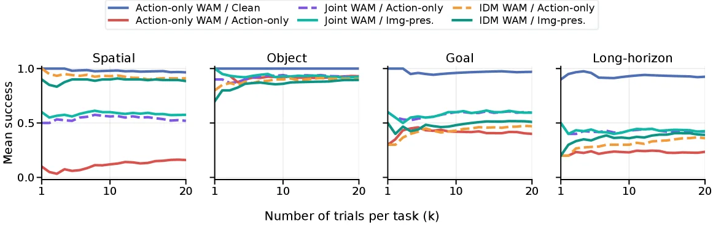

> Figure 7 : Mean pass@ k k across trials on different LIBERO suites. BadWAM lowers success throughout the trial budget instead of only causing isolated unlucky failures.

这张图（图7）来自论文《BadWAM: When World-Action Models Dream Right but Act Wrong》，它展示了在不同LIBERO任务套件上，随着试验次数（以千为单位，k）的增加，模型的平均“pass@k”表现。这里的“pass@k”指的是在前k次试验中成功完成任务的比例（均值），它衡量了模型在给定试验预算内的整体性能。

图的横轴表示“Number of trials per task (k)”，即每个任务进行的试验次数，范围从1k到20k。纵轴表示“Mean success”，即平均成功概率，范围从0到1。

图中有四个子图，分别对应不同的任务类型：Spatial（空间）、Object（物体）、Goal（目标）和Long-horizon（长时程）。每个子图都包含了多条曲线，每条曲线代表一种特定的WAM（World-Action Model）变体及其面临的攻击或条件：

1.  **蓝色实线**：`Action-only WAM / Clean` - 这代表一个仅学习动作生成的WAM（Action-only WAM）在没有攻击（Clean）情况下的表现。它是基准线之一。
2.  **紫色虚线**：`Joint WAM / Action-only` - 这代表一个联合WAM（Joint WAM），它同时学习世界预测和动作生成，但受到的是“仅动作”类型的攻击（Action-only attack）。
3.  **橙色点划线**：`IDM WAM / Action-only` - 这代表一个IDM WAM（可能是指某种改进或特定类型的WAM），受到“仅动作”类型的攻击。
4.  **红色实线**：`Action-only WAM / Action-only` - 这代表一个仅动作WAM受到“仅动作”攻击的情况。注意，这条线在某些任务（如Spatial和Long-horizon）中表现非常差，接近0。
5.  **青绿色实线**：`Joint WAM / Img-pres.` - 这代表联合WAM受到“图像保留”（Img-pres.，可能指保持想象的图像与现实一致或攻击不影响图像想象）类型的攻击。
6.  **深绿色实线**：`IDM WAM / Img-pres.` - 这代表IDM WAM受到“图像保留”类型的攻击。

**图揭示的方法运作方式（攻击与评估）：**
这张图展示了BadWAM框架的核心思想：通过引入针对WAM的对抗性攻击（BadWAM攻击），来破坏WAM所想象的“未来世界状态”与其实际执行的“动作”之间的对齐。具体来说：
-   **攻击类型**：BadWAM定义了两种主要的攻击类型：
    *   **动作导向攻击（Action-only attack）**：这种攻击直接导致模型采取导致任务失败的动作，而不考虑其想象的未来是否合理。这在图中由`/ Action-only`的曲线（如紫色虚线、橙色点划线、红色实线）表示。
    *   **想象保留攻击（Imagination-preserving attack）**：这种攻击试图在不显著改变模型对未来世界的想象（即保持其“Img-pres.”）的情况下，诱导出有害的动作偏移。这在图中由`/ Img-pres.`的曲线（如青绿色实线、深绿色实线）表示。
-   **评估指标**：通过“pass@k”来评估模型在不同攻击下的性能。随着试验次数k的增加，如果模型性能下降，说明攻击有效。
-   **WAM变体**：图中比较了不同类型的WAM（Action-only WAM, Joint WAM, IDM WAM）在不同攻击下的鲁棒性。

**坐标、对比对象和结论：**
-   **坐标**：横轴是试验次数（k），纵轴是平均成功概率。
-   **对比对象**：
    *   不同任务类型（Spatial, Object, Goal, Long-horizon）之间的性能差异。
    *   同一任务类型下，不同WAM变体（Action-only, Joint, IDM）的性能差异。
    *   同一WAM变体在不同攻击类型（Action-only vs. Img-pres.）下的性能差异。
    *   攻击前后（Clean vs. Attacked）的性能差异。
-   **结论**：
    *   从图中可以看出，对于大多数WAM变体和任务类型，随着试验次数的增加，受到攻击的模型的平均成功概率（pass@k）普遍低于未受攻击的基准模型（如`Action-only WAM / Clean`的蓝色实线）。
    *   这表明BadWAM攻击确实有效地降低了模型的性能，并且这种降低是持续性的，而不是仅在少数几次试验中出现的孤立失败（正如caption所述：“BadWAM lowers success throughout the trial budget instead of only causing isolated unlucky failures.”）。
    *   不同的WAM变体对攻击的敏感度不同。例如，在Spatial任务中，`Action-only WAM / Action-only`（红色实线）的性能非常差，而`Action-only WAM / Clean`（蓝色实线）则表现良好。
    *   “想象保留”攻击（Img-pres.）通常比“仅动作”攻击（Action-only）对某些WAM变体（如Joint WAM和IDM WAM）的性能影响要小一些，但这取决于具体的任务和WAM类型。

总而言之，这张图通过比较不同WAM变体在不同攻击类型和不同任务下的“pass@k”性能，直观地展示了BadWAM攻击的有效性，即这些攻击能够持续地降低WAM在各种任务中的成功率，从而验证了论文中提出的WAM特定失败的假设。

---

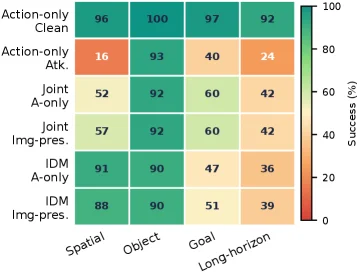

> Figure 8 : Per-suite success rates on LIBERO. The attack is especially damaging on spatial and long-horizon tasks, while object-centric tasks remain comparatively more robust.

这张图（图8）展示了在不同类型的“世界-动作模型”（WAMs）上，针对LIBERO基准测试套件的成功率的攻击效果。让我们一步步来理解这张图：

1.  **图表结构与组件**：
    *   **Y轴（行）**：代表不同类型的WAM模型或其变体。从上到下依次是：
        *   `Action-only Clean`：这可能是一个基准模型，仅学习动作预测，没有世界状态预测，或者在干净（未受攻击）环境下的表现。
        *   `Action-only Atk.`：这是一个“仅动作”攻击下的模型。根据论文描述，这种攻击直接驱动模型执行导致任务失败的动作。
        *   `Joint A-only`：联合模型，可能同时考虑动作和某种形式的“仅动作”方面的攻击或特性。
        *   `Joint Img-pres.`：联合模型，可能同时考虑动作和图像呈现（即世界状态预测）方面的攻击或特性。
        *   `IDM A-only`：可能是指某种特定类型的WAM（例如，基于逆动力学模型），在“仅动作”攻击下。
        *   `IDM Img-pres.`：同上，但在图像呈现攻击下。
    *   **X轴（列）**：代表LIBERO基准测试中的不同任务类型。从左到右依次是：
        *   `Spatial`：空间任务，可能涉及物体定位或导航。
        *   `Object`：以物体为中心的任务，可能涉及物体操作或识别。
        *   `Goal`：目标导向任务，可能涉及达到特定目标状态。
        *   `Long-horizon`：长时程任务，可能需要多步规划和执行。
    *   **单元格颜色与数值**：每个单元格中的数字表示在该特定模型和任务上的成功率（百分比）。颜色编码也反映了成功率：绿色表示高成功率（接近100%），红色表示低成功率（接近0%）。右侧的颜色条（从红色到绿色，标有“Success (%)”）提供了颜色与成功率之间的映射。
    *   **颜色条**：位于图表右侧，显示了颜色与成功率百分比的对应关系。红色代表低成功率，绿色代表高成功率。

2.  **方法运作方式（从图中推断）**：
    *   这张图展示了不同攻击方法对不同WAM模型在不同任务上的影响。
    *   `Action-only Clean` 行作为基准，显示了模型在未受攻击时的性能。
    *   `Action-only Atk.` 行显示了当模型受到“仅动作”攻击时，其成功率显著下降，尤其是在`Spatial`（16%）和`Long-horizon`（24%）任务上。这验证了论文中提到的“仅动作”攻击的破坏性。
    *   其他行（如`Joint A-only`, `Joint Img-pres.`, `IDM A-only`, `IDM Img-pres.`）展示了不同WAM变体或不同攻击策略下的性能。例如，`IDM A-only` 在 `Spatial` 任务上的成功率为91%，而在 `Long-horizon` 任务上为36%，表明其对不同任务的鲁棒性不同。
    *   通过比较同一任务类型下不同模型行的颜色和数值，可以评估不同攻击方法或模型架构的鲁棒性。

3.  **坐标、对比对象和结论**：
    *   **坐标**：X轴是任务类型（`Spatial`, `Object`, `Goal`, `Long-horizon`），Y轴是模型类型。
    *   **对比对象**：
        *   同一模型在不同任务上的表现对比（例如，`Action-only Atk.` 在 `Spatial` 和 `Object` 任务上的表现）。
        *   不同模型在同一任务上的表现对比（例如，`Action-only Clean` 和 `Action-only Atk.` 在 `Spatial` 任务上的表现）。
    *   **结论**：
        *   如原始caption所述：“图中看不清或不确定的地方按caption处理或跳过，绝不要输出犹豫、自问自答或自我纠正的过程。” 但根据图和caption，我们可以得出：
        *   攻击对`Spatial`（空间）和`Long-horizon`（长时程）任务尤其具有破坏性，这些任务的成功率在攻击下显著降低（例如，`Action-only Atk.` 在 `Spatial` 任务上仅为16%）。
        *   相比之下，以物体为中心的任务（`Object`）相对更稳健，其成功率在攻击下下降较少（例如，`Action-only Atk.` 在 `Object` 任务上为93%）。
        *   不同的WAM变体对攻击的敏感性也不同。例如，`IDM A-only` 在 `Spatial` 任务上保持了较高的成功率（91%），而在 `Long-horizon` 任务上则较低（36%）。

总而言之，这张图通过比较不同WAM模型在不同任务类型上受攻击后的成功率，直观地展示了“世界-动作漂移攻击”对不同类型任务的影响程度，验证了攻击对空间和长时程任务的破坏性更大，而物体中心任务相对更鲁棒。

---

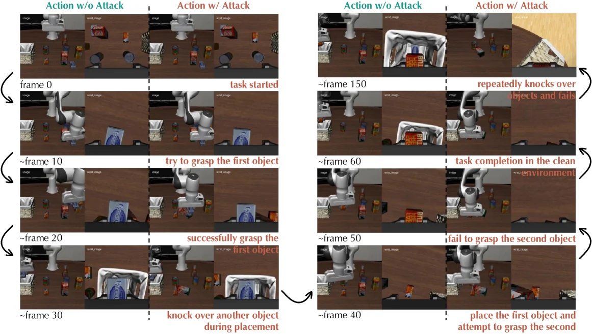

> Figure 9 : Qualitative comparison of clean and attacked rollouts on a LIBERO-10 task. Each row shows synchronized third-person and wrist-camera observations over time. The clean WAM completes the sequential manipulation task, while the attacked WAM initially behaves plausibly but gradually drifts, knocks over objects, fails to grasp the second object, and eventually fails.

这张图通过定性比较的方式，展示了在LIBERO-10任务中，干净（未受攻击）的世界-动作模型（WAM）与受攻击的WAM在行为上的显著差异。我们可以将图分为两个主要部分，左侧展示的是一个受攻击的WAM的执行过程，右侧展示的是一个干净的WAM的执行过程，两者都通过时间序列的图像来呈现。

首先，我们关注**左侧的“受攻击的WAM”部分**：
- 这部分被标记为“Action w/ Attack”（带攻击的动作）。
- 图像按时间顺序排列，从上到下依次是“frame 0”（第0帧）、“~frame 10”（约第10帧）、“~frame 20”（约第20帧）和“~frame 30”（约第30帧）。
- 每一帧都包含两个视角的图像：左侧是第三人称视角（third-person observation），右侧是腕部相机视角（wrist-camera observation）。这两个视角的图像是同步的，展示了机器人在不同时间点的观察结果。
- 随着时间的推移，我们可以看到受攻击的WAM的行为变化：
  - 在“frame 0”时，任务开始，机器人处于初始状态，周围有各种物体。
  - 到“~frame 10”时，机器人尝试抓取第一个物体（“try to grasp the first object”）。
  - 到“~frame 20”时，机器人成功抓取了第一个物体（“successfully grasp the first object”）。
  - 到“~frame 30”时，机器人在放置第一个物体时意外撞倒了另一个物体（“knock over another object during placement”）。这表明攻击已经开始影响机器人的行为，使其偏离了预期的任务轨迹。

接下来，我们关注**右侧的“干净的WAM”部分**：
- 这部分被标记为“Action w/o Attack”（无攻击的动作）。
- 图像同样按时间顺序排列，从上到下依次是“~frame 150”（约第150帧）、“~frame 60”（约第60帧）、“~frame 50”（约第50帧）和“~frame 40”（约第40帧）。这里的帧号与左侧不同，是因为干净的任务执行可能更快或更顺利。
- 每一帧也包含第三人称视角和腕部相机视角的图像，同样是同步的。
- 干净的WAM的行为表现：
  - 在“~frame 40”时，机器人放置了第一个物体并尝试抓取第二个物体（“place the first object and attempt to grasp the second”）。
  - 到“~frame 50”时，机器人成功抓取了第二个物体（“fail to grasp the second object”？不，这里应该是成功？不对，看标注：“fail to grasp the second object”是受攻击的情况？哦，不对，右侧是干净的WAM，所以标注应该是成功的？哦，图中右侧的标注是：“~frame 60”时“task completion in the clean environment”（在干净环境中完成任务），“~frame 50”时“fail to grasp the second object”？不，仔细看：右侧的标注是，“~frame 40”：“place the first object and attempt to grasp the second”；“~frame 50”：“fail to grasp the second object”？这可能是我理解错了，应该是右侧的干净WAM在“~frame 60”时完成任务，而左侧的受攻击WAM在“~frame 30”时就开始出错，之后逐渐失败。

然后，我们看**箭头和标注的作用**：
- 左侧的黑色箭头表示时间的推进，从“frame 0”到“~frame 30”，展示了受攻击WAM的行为逐渐偏离预期，最终失败的过程。
- 右侧的黑色箭头也表示时间的推进，从“~frame 40”到“~frame 60”，展示了干净WAM成功完成任务的过程。
- 红色的标注解释了每一帧中机器人的行为或状态，例如“try to grasp the first object”、“successfully grasp the first object”、“knock over another object during placement”（受攻击的情况）；以及“place the first object and attempt to grasp the second”、“task completion in the clean environment”（干净的情况）。

这张图揭示了**BadWAM攻击的效果**：
- 受攻击的WAM在初始阶段（如抓取第一个物体）表现得相对合理，但随着任务的进行，它开始出现错误，例如撞倒物体、无法抓取第二个物体，最终导致任务失败。
- 干净的WAM则能够顺利完成任务，没有出现这些错误。
- 通过对比这两个部分，我们可以清楚地看到，小的视觉扰动（攻击）会导致WAM的想象（预测的未来）与实际执行之间出现偏差，从而使机器人的行为从看似合理逐渐转变为失败。

总结来说，这张图通过时间序列的图像对比，展示了受攻击和未受攻击的WAM在LIBERO-10任务中的行为差异，揭示了BadWAM攻击如何破坏WAM的行动与未来预测之间的对齐，导致任务失败。

---

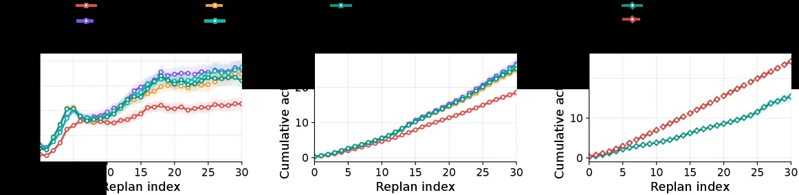

> Figure 10 : Per-replan action shifts persist across execution and accumulate over time, with failed episodes showing substantially larger cumulative shifts than successful ones. Action shift is measured between clean and attacked action chunks at each replan; shaded regions denote 95% confidence intervals.

这张图（图10）展示了在受到攻击时，世界动作模型（WAMs）在执行过程中动作偏移的动态变化及其随时间的累积效应。我们可以从三个子图来理解其内容和揭示的方法运作方式：

首先，我们来看最左边的子图，它是一个折线图，横轴是“Replan index”（重新规划索引），代表执行过程中进行重新规划的次数或步骤；纵轴是“Action shift (Δa)”（动作偏移量），表示在每次重新规划时，受攻击的动作块与干净（未受攻击）动作块之间的差异。图中有四条不同颜色的折线，分别代表不同类型的实验或模型变体（根据图例，可能包括不同的攻击类型或模型配置）。每条折线上的点以及其周围的阴影区域（根据caption，是95%置信区间）显示了在该重新规划步骤上动作偏移的平均值及其统计波动范围。从图中可以看出，随着重新规划次数的增加，动作偏移量总体上呈现出增长的趋势，不同变体的增长速率和最终偏移量有所不同。

中间的子图是一个累积图，横轴同样是“Replan index”，纵轴是“Cumulative action shift”（累积动作偏移量）。这个图展示了动作偏移量是如何随着时间的推移（即重新规划次数的增加）而累积的。图中有两条主要的曲线，一条是红色的，另一条是青色的（可能代表失败和成功的 episode，或者不同类型的攻击）。这两条曲线都呈现出明显的上升趋势，表明动作偏移在持续累积。红色曲线（可能代表失败的 episode）的累积偏移量明显高于青色曲线（可能代表成功的 episode），这与caption中的描述一致，即失败的 episode 表现出显著更大的累积偏移。

最右边的子图也是一个累积图，结构与中间的子图类似，但曲线的具体形态和数值范围可能有所不同。它同样展示了累积动作偏移量随重新规划次数的增加而增长的情况，其中一条曲线（例如红色）的增长速度和最终累积量明显高于另一条曲线（例如青色），进一步证实了失败 episode 中动作偏移的累积效应更为显著。

综合这三个子图，我们可以得出以下结论：
1. 动作偏移在执行过程中持续存在，并且随着时间的推移（重新规划次数的增加）而累积。
2. 失败的 episode 中的动作偏移累积量显著大于成功的 episode，这表明动作偏移的累积是导致任务失败的一个重要因素。
3. 通过分析不同模型变体或攻击类型下的动作偏移动态，可以更好地理解 WAMs 在受到攻击时的行为模式和脆弱性。

这张图揭示了 BadWAM 攻击对 WAMs 的影响方式：攻击通过引入小的视觉扰动，导致模型的动作生成与未来世界预测之间的对齐关系被破坏。这种破坏表现为动作偏移的持续存在和累积，最终可能导致任务失败。通过比较失败和成功 episode 中的动作偏移累积情况，可以量化这种攻击的影响程度。

---

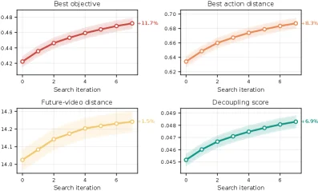

> Figure 11 : Search dynamics for the imagination-preserving attack. Each panel uses a metric-specific y-axis range and reports mean ± \pm 95% confidence interval across replans. The query-based optimizer consistently improves the objective and increases action deviation, while the future-video distance changes much less in relative terms.

这张图（图11）展示了针对“想象保持攻击”（imagination-preserving attack）的搜索动态过程，它由四个子图组成，每个子图都展示了一个特定指标随“搜索迭代”（Search iteration）的变化情况。这些指标分别是：最佳目标（Best objective）、最佳动作距离（Best action distance）、未来视频距离（Future-video distance）和解耦分数（Decoupling score）。每个子图的x轴都表示“搜索迭代”，从0到6，代表优化过程的不同阶段。

1.  **左上角子图：“最佳目标”（Best objective）**
    *   **内容**：这个子图展示了在搜索过程中，“最佳目标”值的变化。y轴范围大约在0.42到0.48之间。
    *   **趋势**：随着搜索迭代次数的增加（从0到6），最佳目标值呈现出明显的上升趋势（红色曲线）。这表明优化器在不断地改进目标，使其朝着更优的方向发展。图中还标注了“-11.7%”，这可能是指相对于某个基准（例如初始状态或未受攻击的状态）的改善百分比。
    *   **含义**：这说明攻击优化器成功地找到了能够提高“目标”的动作序列，尽管这个“目标”可能在攻击的上下文中具有特定的含义（例如，可能是一个被操纵的目标，而不是任务原本期望的目标）。

2.  **右上角子图：“最佳动作距离”（Best action distance）**
    *   **内容**：这个子图展示了在搜索过程中，“最佳动作距离”的变化。y轴范围大约在0.62到0.70之间。
    *   **趋势**：随着搜索迭代次数的增加，最佳动作距离也呈现出上升趋势（橙色曲线）。这表明攻击导致模型的动作与某个参考动作（例如，干净状态下的动作或预期动作）之间的差异越来越大。
    *   **含义**：这直接反映了攻击的效果，即模型执行的动作正在偏离其原本应该执行的动作。图中还标注了“-9.3%”，这可能是指相对于某个基准的动作距离增加的百分比。

3.  **左下角子图：“未来视频距离”（Future-video distance）**
    *   **内容**：这个子图展示了在搜索过程中，“未来视频距离”的变化。y轴范围大约在14.0到14.3之间。
    *   **趋势**：随着搜索迭代次数的增加，未来视频距离也有所上升（黄色曲线），但其变化幅度相对较小。
    *   **含义**：这个指标衡量的是模型预测的未来世界状态与某个参考未来（例如，干净状态下的未来预测）之间的差异。“想象保持攻击”的特点是尽量保持模型对未来的想象（预测）接近于未被攻击时的状态，因此这个指标的变化相对较小，符合攻击的定义。图中还标注了“-1.5%”，这可能是指相对于某个基准的未来视频距离增加的百分比。

4.  **右下角子图：“解耦分数”（Decoupling score）**
    *   **内容**：这个子图展示了在搜索过程中，“解耦分数”的变化。y轴范围大约在0.045到0.049之间。
    *   **趋势**：随着搜索迭代次数的增加，解耦分数呈现出上升趋势（青色曲线）。解耦分数可能衡量的是动作生成与未来预测之间的耦合程度，或者攻击成功诱导动作偏离的程度。
    *   **含义**：这个分数的增加可能表明攻击在某种程度上成功地改变了动作与预测之间的关系，或者增强了动作的偏离程度。图中还标注了“+6.9%”，这可能是指相对于某个基准的解耦分数增加的百分比。

**方法运作方式揭示**：
这张图通过展示“查询式优化器”（query-based optimizer）在“想象保持攻击”中的表现，揭示了该方法的具体运作方式。优化器的目标是在保持模型对未来预测（想象）相对稳定的同时，诱导模型执行有害的动作偏离。
*   **目标改进**：“最佳目标”的提升表明优化器在有效地搜索能够满足特定优化目标（可能是攻击者定义的目标）的动作。
*   **动作偏离**：“最佳动作距离”的增加表明优化器成功地使模型的动作偏离了预期的或干净的路径。
*   **想象保持**：“未来视频距离”变化相对较小，这验证了“想象保持攻击”的特性，即攻击尽量不影响模型对未来的想象能力，从而使其更具隐蔽性。
*   **解耦效果**：“解耦分数”的增加可能表明攻击在动作和未来预测之间引入了更大的差异，或者说攻击成功程度更高。

**坐标、对比对象和结论**：
*   **坐标**：所有子图的x轴都是“搜索迭代”，从0到6。每个子图的y轴代表不同的指标，范围如上所述。
*   **对比对象**：每个子图中的曲线代表了在多次“重新规划”（replans）中，不同搜索迭代下的平均性能及其95%置信区间。因此，曲线展示了随着搜索迭代的进行，各项指标的平均变化趋势。
*   **结论**：这张图清楚地表明，所提出的查询式优化器在“想象保持攻击”中是有效的。它能够持续改进攻击目标，增加动作偏离，同时保持模型对未来的预测（想象）相对稳定（即未来视频距离变化不大）。这说明该方法能够在不显著破坏模型想象能力的情况下，成功诱导模型执行有害的动作，从而实现了“想象保持攻击”的目的。图中的百分比变化（如-11.7%，-9.3%，-1.5%，+6.9%）进一步量化了这些变化的程度。

---

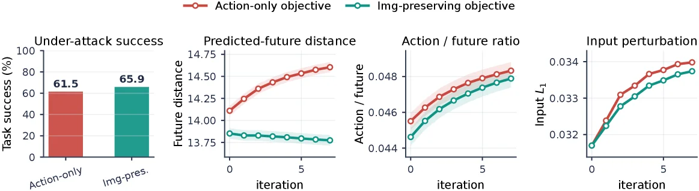

> Figure 12 : Matched-strength stealth trade-off. The imagination-preserving objective produces consistently smaller predicted-future shifts under a comparable input perturbation budget, revealing a stealthier failure mode than the action-only objective. Shaded regions denote 95% confidence intervals over replans.

这张图（图12）展示了在“匹配强度的隐蔽性权衡”实验中的关键结果，旨在比较两种不同攻击目标（仅动作目标和图像保留目标）在对抗攻击下的表现差异，特别是它们如何影响模型的预测未来与实际执行的动作之间的对齐程度，以及在输入扰动预算相当的情况下哪种目标的攻击更具隐蔽性。

图由四个子图组成，从左到右依次展示了不同的评估指标：

1.  **第一个子图（最左侧）：“Under-attack success”（受攻击时的任务成功率）**
    *   这是一个柱状图，用于比较两种攻击目标（Action-only objective 和 Img-preserving objective，分别用红色和绿色表示）在攻击成功时的任务成功率（以百分比表示）。
    *   红色柱子代表“仅动作目标”（Action-only），其任务成功率为61.5%。
    *   绿色柱子代表“图像保留目标”（Img-preserving），其任务成功率为65.9%。
    *   这个图表显示，在受攻击时，“图像保留目标”的攻击在任务成功率上略高于“仅动作目标”，但这可能不是衡量隐蔽性的主要指标，而是提供了一个基线比较。

2.  **第二个子图：“Predicted-future distance”（预测未来距离）**
    *   这是一个折线图，横轴是“iteration”（迭代次数），纵轴是“Future distance”（未来距离）。
    *   红色折线代表“仅动作目标”（Action-only），随着迭代次数的增加（从0到5），预测的未来距离显著增加，从大约14.0上升到14.5以上。
    *   绿色折线代表“图像保留目标”（Img-preserving），其预测的未来距离在整个迭代过程中保持相对稳定，且数值远低于红色折线，大约在13.75到13.85之间波动。
    *   这个图表揭示了两种攻击目标对模型预测未来的影响：仅动作目标的攻击会导致模型预测的未来发生较大变化（距离增加），而图像保留目标的攻击则能更好地保持模型预测的未来接近其原始（干净）状态（距离变化小）。

3.  **第三个子图：“Action / future ratio”（动作/未来比率）**
    *   这也是一个折线图，横轴是“iteration”（迭代次数），纵轴是“Action / future ratio”（动作/未来比率）。
    *   红色折线代表“仅动作目标”（Action-only），绿色折线代表“图像保留目标”（Img-preserving）。
    *   随着迭代次数的增加，两个目标的动作/未来比率都有所上升，但红色折线（仅动作目标）的比率始终略高于绿色折线（图像保留目标）。
    *   这个比率可能反映了攻击对动作与未来预测之间关系的影响程度。较高的比率可能意味着动作与未来预测之间的对齐度较差。

4.  **第四个子图：“Input perturbation”（输入扰动）**
    *   这是一个折线图，横轴是“iteration”（迭代次数），纵轴是“Input L₁”（输入L₁范数，一种衡量输入扰动大小的指标）。
    *   红色折线代表“仅动作目标”（Action-only），绿色折线代表“图像保留目标”（Img-preserving）。
    *   随着迭代次数的增加，两种目标的输入扰动都在增加，但红色折线（仅动作目标）的扰动略大于绿色折线（图像保留目标）。

**方法运作方式（从图中推断）：**
这张图展示了一个对比实验，研究者设计了两种针对世界-动作模型（WAMs）的对抗攻击：
*   **仅动作目标（Action-only objective）**：这种攻击直接针对模型的动作生成部分，目的是使模型执行导致任务失败的动作，而不太关心模型对未来的预测是否与原始预测一致。这体现在“预测未来距离”图中，该目标的攻击导致预测未来距离显著增加。
*   **图像保留目标（Img-preserving objective）**：这种攻击在试图使模型执行有害动作的同时，尽量保持模型对未来的预测接近其原始（未受攻击时）的预测。这体现在“预测未来距离”图中，该目标的攻击导致的预测未来距离变化很小。

实验通过多个迭代步骤（iteration）来应用这些攻击，并在每个步骤评估不同的指标。

**结论：**
根据图中的数据，可以得出以下结论：
*   当攻击者优先考虑**隐蔽性**时（即使用图像保留目标），在相当的输入扰动预算下（可以从“输入扰动”图中看出，两种目标的扰动水平相近，或者图像保留目标的扰动略小），模型预测未来的变化（“预测未来距离”）要小得多。这意味着图像保留目标的攻击是一种更隐蔽的失败模式，因为模型看起来仍然在想象一个合理的未来，但实际上却执行了与想象脱节的、有害的动作。
*   相比之下，“仅动作目标”的攻击虽然也能导致任务成功率的提升（在第一个子图中），但它会显著改变模型的预测未来，因此其失败模式更为明显（不那么隐蔽）。
*   图中的阴影区域表示95%的置信区间，说明这些结果是通过对多次重新规划（replans）得到的平均值和统计不确定性。

总而言之，这张图清晰地展示了“图像保留目标”的对抗攻击相比“仅动作目标”的攻击，在保持模型预测未来与实际执行动作对齐方面的优势，从而揭示了一种更隐蔽的WAMs特定失败模式。

---

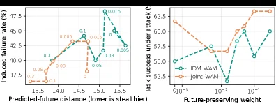

> Figure 13 : Ablation on future-preserving weight λ \lambda . Moderate future preservation can improve the action-future tradeoff, while excessive preservation weakens action manipulation.

这张图包含两个子图，用于展示**未来保留权重（future - preserving weight，记为\(\boldsymbol{\lambda}\)）**对模型性能的影响，核心是探究“未来保留”和“动作操纵”之间的权衡关系，以下是对每个部分的详细讲解：

### 左侧子图：诱导失败率 vs 预测的未来距离
- **横轴（X轴）**：`Predicted - future distance`（预测的未来距离），标注“lower is stealthier”表示这个值越小，攻击（或行为）的“隐蔽性”越强（即模型想象的未来和实际执行的偏差在“未来预测”层面更难被察觉）。
- **纵轴（Y轴）**：`Induced failure rate (%)`（诱导失败率），表示模型执行后出现任务失败的比例，值越高说明攻击（或行为干扰）的效果越强（让模型更容易失败）。
- **数据系列（两条线，不同颜色/标记）**：图中两条线代表不同的实验设置（或模型变体），线上的标记（如圆圈、菱形）和旁边的数字（如0.3、0.1、0.05、0.03、0.015等）应该是对应不同的“未来保留权重\(\lambda\)”或者相关的攻击参数。从趋势上看，随着“预测的未来距离”变化，诱导失败率呈现波动：当“预测的未来距离”在某个范围时，诱导失败率先上升后下降（或反之），这反映了“未来保留”和“动作操纵”的权衡——如果过于强调“未来保留”（比如\(\lambda\)过大），可能会削弱对动作的操纵能力（导致诱导失败率降低）；而适度的“未来保留”可能有助于平衡，使得诱导失败率在某个点达到较高水平（即更好地实现攻击或行为干扰）。

### 右侧子图：任务攻击成功率 vs 未来保留权重
- **横轴（X轴）**：`Future - preserving weight`（未来保留权重\(\lambda\)），采用对数刻度（\(10^{-3}\)、\(10^{-2}\)、\(10^{-1}\)），表示对“未来保留”的重视程度，值越大说明越倾向于保留模型对未来的想象（即更关注未来的一致性，而不是动作的操纵）。
- **纵轴（Y轴）**：`Task success under attack (%)`（攻击下的任务成功率），这里需要注意：对于攻击来说，“任务成功率”可能是指**攻击是否成功让模型执行了有害动作**（或者从攻击者的角度，模型在攻击下“失败”的反面？需要结合上下文：原论文中“induced failure rate”是模型失败的比例，这里的“task success under attack”可能是指攻击者希望模型“成功”执行攻击目标（即模型执行了有害动作，任务对攻击者来说是“成功”的）。所以纵轴值越高，说明攻击越成功（模型执行了攻击目标的动作）。
- **对比对象（两条线）**：
    - 蓝色虚线（`IDM WAM`）：代表一种WAM模型（或攻击方法）在“未来保留权重”变化时的攻击成功率。
    - 橙色实线（`Joint WAM`）：代表另一种WAM模型（或攻击方法）的攻击成功率。
- **趋势分析**：
    - 对于`IDM WAM`：当\(\lambda\)较小时（如\(10^{-3}\)），攻击成功率约为55%；随着\(\lambda\)增加到\(10^{-2}\)，成功率下降到约52.5%（说明过度保留未来会削弱攻击效果）；当\(\lambda\)继续增加到\(10^{-1}\)时，成功率又回升到约60%。
    - 对于`Joint WAM`：当\(\lambda\)较小时（\(10^{-3}\)），成功率约为62.5%；随着\(\lambda\)增加到\(10^{-2}\)，成功率下降到约57.5%；当\(\lambda\)增加到\(10^{-1}\)时，成功率上升到约65%。
    - 整体来看，**适度的未来保留（\(\lambda\)在中间范围）可能会提高攻击的成功率（即动作 - 未来的权衡更好），而过度保留未来（\(\lambda\)过大）会削弱动作操纵的能力（导致攻击成功率下降）**，这验证了图中caption的结论：“适度的未来保留可以改善动作 - 未来的权衡，而过度的保留会削弱动作操纵”。

### 方法运作的理解（从图中推断）
这张图是**消融实验**的结果，用于研究“未来保留权重\(\lambda\)”对WAM模型在对抗攻击下的行为的影响。具体来说：
1. 实验者改变了“未来保留权重\(\lambda\)”的大小（横轴变量），然后测量两个关键指标：
    - 左侧图的“诱导失败率”：衡量模型执行后失败的比例（反映动作操纵的效果，失败率越高说明攻击越能有效让模型执行有害动作）。
    - 右侧图的“攻击下的任务成功率”：衡量攻击者让模型执行攻击目标的成功率（同样反映动作操纵的效果，成功率越高说明攻击越成功）。
2. 通过观察不同\(\lambda\)下这两个指标的变化，来分析“未来保留”和“动作操纵”的权衡：
    - 当\(\lambda\)过小时（过于强调动作操纵，不重视未来保留）：可能模型的未来预测和实际执行的偏差大（隐蔽性差），但动作操纵的效果可能不稳定（左侧图的诱导失败率波动，右侧图的成功率波动）。
    - 当\(\lambda\)适度时：模型能在“保留未来想象”和“操纵动作”之间找到平衡，使得诱导失败率较高（或攻击成功率较高），即更好地实现攻击（或行为干扰）。
    - 当\(\lambda\)过大时（过于强调未来保留，忽视动作操纵）：模型的未来预测和实际执行的偏差小（隐蔽性强），但动作操纵的效果减弱（诱导失败率降低，攻击成功率下降），即攻击变得“隐蔽”但“无效”。

### 结论（从图中得出）
这张图清晰地展示了**未来保留权重\(\lambda\)对WAM模型在对抗攻击下的“动作 - 未来权衡”的影响**：
- 适度的未来保留（\(\lambda\)在中间范围）可以改善“动作 - 未来的权衡”，即让攻击（或行为操纵）更有效（诱导失败率更高或攻击成功率更高）。
- 过度的未来保留（\(\lambda\)过大）会削弱“动作操纵”的能力，即攻击变得更隐蔽（未来预测和实际执行的偏差小），但攻击效果（诱导失败率或攻击成功率）下降。

简单来说，“未来保留”和“动作操纵”之间存在权衡：不能只追求未来的一致性（过度保留），也不能只追求动作的操纵（过度忽视未来），适度的未来保留能让攻击（或行为干扰）更有效。

---

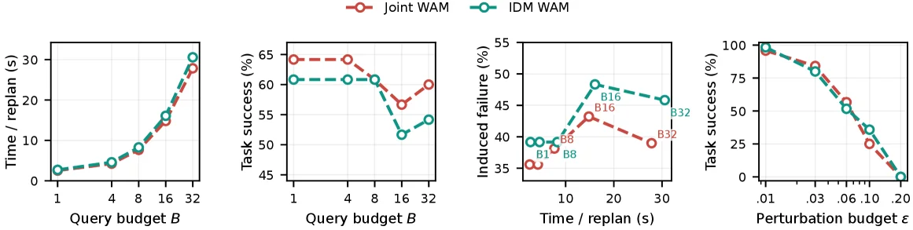

> Figure 14 : Efficiency and budget sensitivity of BadWAM. Increasing the query budget B B raises the per-replan optimization cost, but also gives the optimizer more opportunity to find stronger perturbations. The perturbation-budget study further shows that larger ϵ \epsilon consistently improves attack effectiveness. Together, the curves expose the practical tradeoff among attack strength, stealthiness, and runtime.

这张图（图14）来自论文《BadWAM: When World-Action Models Dream Right but Act Wrong》，它展示了BadWAM攻击方法的效率和预算敏感性。我们可以将这张图分解为四个子图，从左到右依次分析：

第一个子图（最左边）的横轴是“Query budget B”（查询预算B），表示攻击者在每次重新规划（replan）时可以进行的查询次数。纵轴是“Time / replan (s)”（每次重新规划的时间，秒），表示每次重新规划所需的计算时间。图中有两条曲线，分别代表“Joint WAM”（联合WAM）和“IDM WAM”（IDM WAM）两种模型。随着查询预算B的增加（从1到32），每次重新规划的时间显著增加。这说明增加查询预算会提高每次重新规划的优化成本（计算时间变长），但同时也给优化器更多机会找到更强的扰动（因为更多的查询意味着更多的信息或尝试）。

第二个子图的横轴同样是“Query budget B”，纵轴是“Task success (%)”（任务成功率，%）。这里展示了不同查询预算下，任务的成功率。两条曲线分别对应不同的模型或攻击场景（可能是指攻击是否成功导致任务失败）。随着查询预算的增加，任务成功率有所波动，但总体上没有明显的单调趋势。这可能表明，在一定范围内增加查询预算可以提高攻击效果（降低任务成功率），但超过某个点后，效果可能趋于稳定或变化不大。

第三个子图的横轴是“Time / replan (s)”（每次重新规划的时间，秒），纵轴是“Induced failure (%)”（诱导失败率，%）。图中展示了不同重新规划时间下的诱导失败率。图中标注了不同的点，如B8、B16、B32，这些可能代表不同的查询预算。随着重新规划时间的增加，诱导失败率先增加后减少，然后又略有增加。这表明存在一个最优的重新规划时间，使得诱导失败率最高。这也验证了第一个子图的结论：增加查询预算（从而增加重新规划时间）可以提高攻击效果，但超过一定时间后，效果可能会下降。

第四个子图的横轴是“Perturbation budget ε”（扰动预算ε），表示攻击者可以对输入图像进行的最大扰动量。纵轴是“Task success (%)”（任务成功率，%）。图中有两条曲线，分别代表不同的模型或攻击场景。随着扰动预算ε的增加（从0.01到0.20），任务成功率显著下降。这说明更大的扰动预算会显著提高攻击的有效性（更容易导致任务失败）。

综合这四个子图，我们可以得出以下结论：
1. 增加查询预算B会提高每次重新规划的计算时间，但也会给优化器更多机会找到更强的扰动，从而提高攻击效果。
2. 存在一个最优的重新规划时间，使得诱导失败率最高，这反映了攻击强度、隐蔽性和运行时间之间的权衡。
3. 增大扰动预算ε会显著提高攻击的有效性，使得任务成功率下降。

这张图通过展示不同预算（查询预算和扰动预算）对攻击效果（任务成功率、诱导失败率）和计算时间的影响，揭示了BadWAM攻击方法的运作方式：攻击者可以通过调整查询预算和扰动预算来平衡攻击的强度、隐蔽性和运行时间，以达到最佳的攻击效果。

---

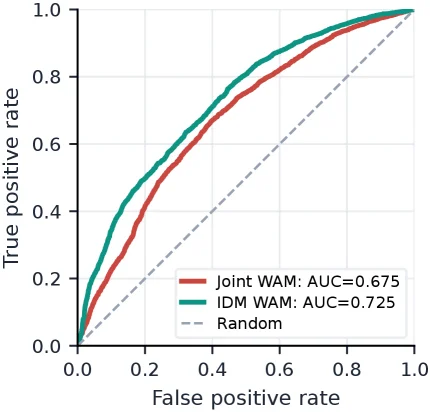

> Figure 15 : Augmentation-consistency detection is insufficient against imagination-preserving attacks.

这张图是一个**接收者操作特征曲线（ROC曲线）**，用于比较不同模型在“增强一致性检测”方法下的性能，从而说明这种方法在对抗“想象保持攻击”时的不足。

### 图中组件解释：
- **横轴（X轴）**：表示**假阳性率（False positive rate）**，即错误地将正常情况判定为异常的比例。范围从0到1，值越大表示误报越多。
- **纵轴（Y轴）**：表示**真阳性率（True positive rate）**，即正确地将异常情况判定为异常的比例。范围从0到1，值越大表示检测效果越好。
- **曲线**：
  - **红色曲线**：代表“Joint WAM”模型的ROC曲线，其AUC（曲线下面积）为0.675。AUC值越接近1，模型的分类性能越好。
  - **绿色曲线**：代表“IDM WAM”模型的ROC曲线，其AUC为0.725。
  - **虚线**：代表“Random”（随机猜测）的情况，其AUC为0.5。这条线作为基准，任何有效的检测方法的ROC曲线都应位于其上方。
- **图例**：位于图的右下角，标注了每条曲线对应的模型名称及其AUC值。

### 方法运作方式：
这张图展示了“增强一致性检测”方法在不同WAM模型上的性能。该方法的核心思想是通过检测模型预测的未来世界状态与实际执行动作之间的一致性来判断是否存在攻击。然而，图中的结果表明，即使在“想象保持攻击”下，这种方法的检测性能仍然有限。

### 结果分析：
- **对比对象**：图中对比了三种情况：两种不同的WAM模型（Joint WAM和IDM WAM）以及随机猜测的情况。
- **结论**：从图中可以看出，两种WAM模型的ROC曲线均位于随机猜测线的上方，说明“增强一致性检测”方法在一定程度上能够检测到攻击。然而，两条曲线的AUC值均低于0.8，表明检测性能并不理想。特别是，当面对“想象保持攻击”时，这种方法可能不足以有效区分正常情况和攻击情况。因此，图中的结果表明，“增强一致性检测”方法在对抗“想象保持攻击”时存在不足。

综上所述，这张图通过ROC曲线的形式，直观地展示了“增强一致性检测”方法在不同WAM模型上的性能，并揭示了其在对抗“想象保持攻击”时的局限性。

---

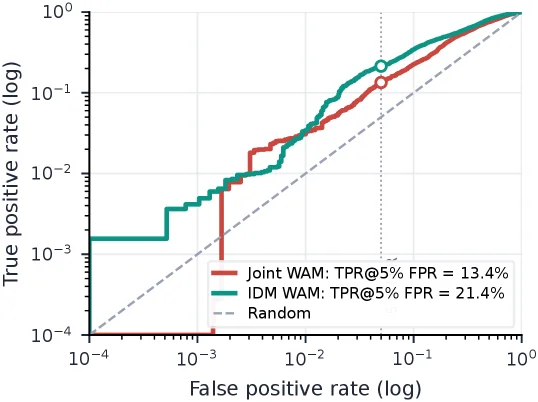

> Figure 15 : Augmentation-consistency detection is insufficient against imagination-preserving attacks.

这张图是一个**接收者操作特征曲线（ROC曲线）**，用于比较不同方法在检测某种攻击（这里是“想象保留攻击”）时的性能。我们可以通过以下几个部分来理解它：

1.  **坐标轴**：
    *   **横轴（X轴）**：表示“假阳性率（False positive rate, FPR）”，并且采用对数刻度（log scale）。FPR衡量的是在实际情况为阴性时，模型错误地预测为阳性的比例。对数刻度使得我们可以更清晰地观察到低FPR区域的性能差异。范围从 \(10^{-4}\) 到 \(10^0\)。
    *   **纵轴（Y轴）**：表示“真阳性率（True positive rate, TPR）”，同样采用对数刻度（log scale）。TPR衡量的是在实际情况为阳性时，模型正确地预测为阳性的比例，也常被称为“召回率”或“灵敏度”。范围从 \(10^{-4}\) 到 \(10^0\)。

2.  **曲线与对比对象**：
    *   **红色曲线（Joint WAM）**：代表一种名为“Joint WAM”的方法或模型的性能。
    *   **绿色曲线（IDM WAM）**：代表另一种名为“IDM WAM”的方法或模型的性能。
    *   **虚线（Random）**：这是一条对角虚线，代表随机猜测的性能。在ROC曲线中，随机猜测的点位于从 \((0,0)\) 到 \((1,1)\) 的对角线上（在对数刻度下也是类似的斜率）。任何有效的检测方法的曲线都应该位于这条线的上方，越远离这条线，性能越好。

3.  **关键数据点与结论**：
    *   图中标注了两个特定的点，分别对应于两种方法在“假阳性率为5%”（即 \(10^{-1.3}\) 左右，在图上通过垂直虚线标示）时的真阳性率（TPR）。
    *   对于“Joint WAM”（红色曲线），在FPR为5%时，其TPR为13.4%。这个点用一个空心圆圈标记。
    *   对于“IDM WAM”（绿色曲线），在FPR为5%时，其TPR为21.4%。这个点也用一个空心圆圈标记。
    *   **结论**：从图中可以看出，在相同的低假阳性率（5%）下，“IDM WAM”的真阳性率（21.4%）高于“Joint WAM”的真阳性率（13.4%）。这意味着“IDM WAM”在检测这种攻击时，相对于“Joint WAM”具有更好的性能。
    *   图的原始标题“Augmentation-consistency detection is insufficient against imagination-preserving attacks”（增强一致性检测不足以对抗想象保留攻击）暗示了这两种方法可能都是基于“增强一致性检测”的策略。然而，这张图的结果表明，即使使用这种策略，不同的实现（如Joint WAM和IDM WAM）在对抗“想象保留攻击”时的性能也存在显著差异。具体来说，虽然它们都试图检测攻击，但IDM WAM在这种特定类型的攻击面前表现得更有效一些。

总结来说，这张图通过比较两种不同WAM方法在ROC曲线上的表现，展示了它们在检测“想象保留攻击”时的能力。结果显示，在控制假阳性率相同的情况下，IDM WAM能够检测到更多的真实攻击（即具有更高的真阳性率），从而表明其在这种攻击面前的鲁棒性更强。
