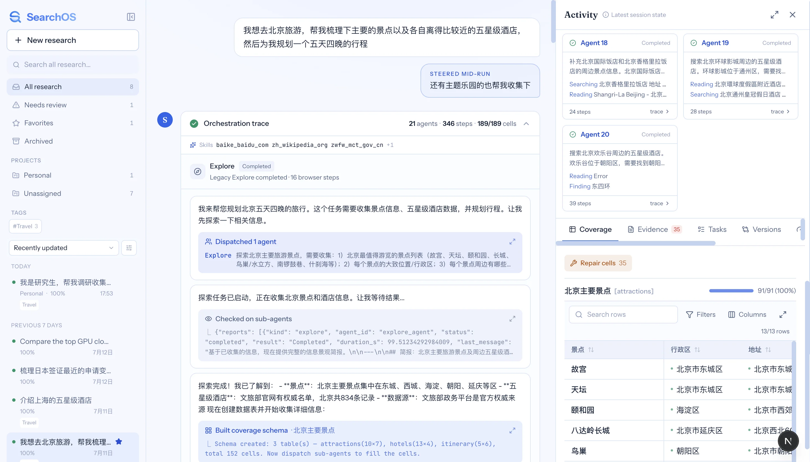
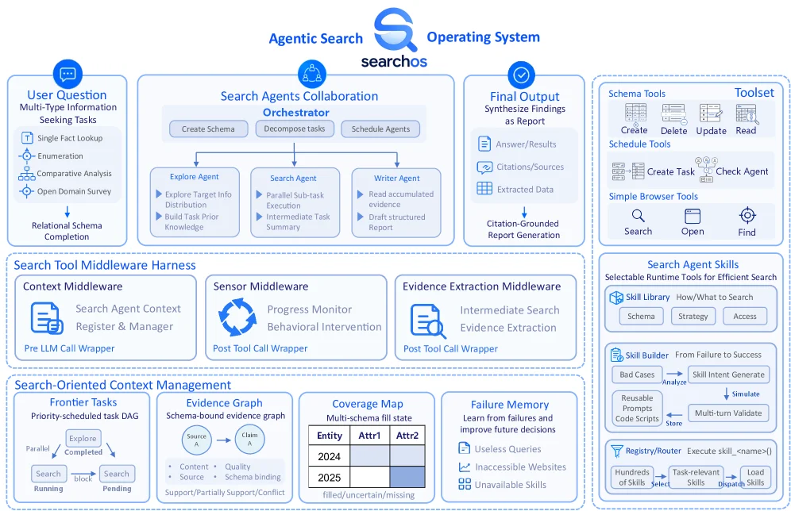
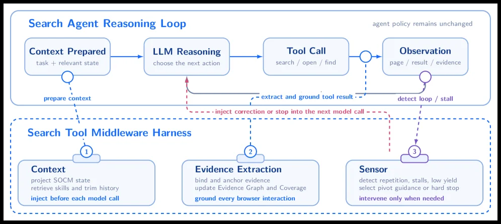
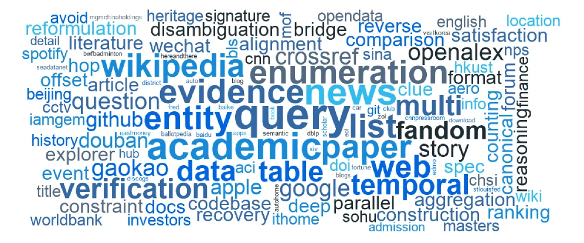
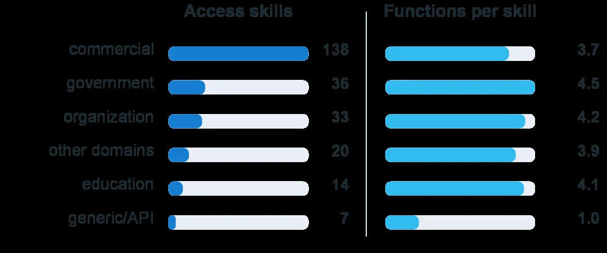
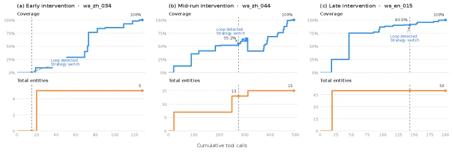

# SearchOS-V1: Towards Robust Open-Domain Information-Seeking Agent Collaboration

[arXiv](https://arxiv.org/abs/2607.15257) · [HuggingFace](https://huggingface.co/papers/2607.15257) · ▲60

## Abstract (verbatim)

> Recent advances in Tool-Integrated Large Language Models have made web search a core capability of information-seeking agents. However, as interaction histories grow, agents increasingly struggle to track task progress. When search attempts fail to yield useful evidence, current single- and multi-agent systems can become trapped in repetitive loops, wasting search budgets and ultimately compromising the quality and completeness of the final output. We introduce SearchOS, a system-level multi-agent framework that turns fragile, implicit search progress into explicit, persistent, and shared state. First, we formulate open-domain information seeking as relational schema completion with grounded citations, where agents discover entities, populate attributes across linked tables, and anchor each value to source evidence. Then we design Search-Oriented Context Management (SOCM), which externalizes the evolving state into Frontier Task, an Evidence Graph, a Coverage Map, and Failure Memory. Built on SOCM, SearchOS applies a pipeline-parallel scheduling mechanism that overlaps the execution of sub-agents and continuously refills freed slots with tasks targeting unresolved coverage gaps to improve utilization and throughput. To schedule and control the execution of search agents, SearchOS introduces a Search Tool Middleware Harness that intercepts model and tool interactions to record grounded evidence and react to stalls or budget exhaustion, and provides a reusable hierarchical skill system comprising strategy and access skills to augment the agents' search process and avoid repeating failed search patterns across runs. On WideSearch and GISA, SearchOS leads all metrics among the evaluated single- and multi-agent baselines, paving the way toward robust information-seeking collaboration.

## Background

### Background Analysis  

**Technical Context**: With the advancement of tool-integrated large language models (LLMs), information-seeking agents have become capable of web search, browsing, and reasoning to extend knowledge beyond model parameters. Such technologies are widely applied in scenarios requiring multi-source information integration, such as academic research, business analysis, or intelligent assistants. The core need is to enable agents to reliably track task progress, avoid redundant efforts, and generate verifiable answers.  

**Previous Issues**: Existing methods face two major challenges in complex tasks. First, as interaction history grows, agents struggle to track completed and pending tasks, leading to lost evidence, redundant collection, or contradictory conclusions. For example, a single agent may get stuck in repetitive loops when searches fail, wasting resources. Second, simply adding more agents does not solve the problem—parallel workers may duplicate efforts, disagree on objectives, or leave resources idle. The root cause is that traditional approaches treat plans, progress, and failures as transient dialogue content rather than system-level states, making long-horizon tasks unsustainable and untraceable.  

**Proposed Solution**: The paper introduces SearchOS, a framework addressing these issues through:  
1. **Relational Search Modeling**: Framing open-domain information retrieval as "relational schema completion," where entities, attributes, and evidence are explicitly linked, making progress measurable.  
2. **Explicit State Management**: Introducing Search-Oriented Context Management (SOCM) to externalize execution states (e.g., pending tasks, evidence graphs, coverage maps) for shared access across agents.  
3. **Pipeline-Parallel Scheduling**: Adopting a GPU-like pipeline mechanism to dynamically assign unresolved tasks, improving resource utilization.  
4. **Middleware Control**: Using a "Search Tool Middleware Harness" to monitor and regulate agent behavior, preventing repeated errors and enforcing resource limits.  
5. **Hierarchical Skill System**: Separating reusable search strategies from site-specific access skills for cross-task reuse.  

**Key Differences**: Compared to prior work, SearchOS stands out by:  
- **Shifting from Implicit to Explicit States**: Extracting task progress from dialogue history into system-level states, reducing dependency on agent memory.  
- **Moving from Single-Agent to Collaborative Multi-Agent Systems**: Enabling efficient coordination via shared states and dynamic scheduling, rather than naive parallelism.  
- **Designing Reusable Skills**: Creating a hierarchical system for cross-scenario reuse, instead of relearning strategies for each task.  

These innovations make SearchOS superior to existing baselines in experiments, laying the groundwork for robust information-seeking collaboration.

## Method, Figure by Figure

> Figure 1 : SearchOS interface for a long-horizon information-seeking task. The workspace exposes the orchestration trace, pipeline parallel agent activity, and relational schema coverage.

This figure showcases the SearchOS system's user interface while handling a long-horizon information-seeking task, clearly presenting the system's core components and workflow. We can understand the image by examining three main areas:

First, the left panel is the task management and project navigation area. It lists categories such as "All research," "Needs review," "Favorites," and specific task entries like "I want to go to Beijing for a trip, help me organize...". This indicates that a user can manage multiple tasks simultaneously, and the currently selected task is this Beijing travel planning task. Below, there's a list of tasks categorized by time, showing their completion status and update time.

The middle area is the core view of task execution, the "Orchestration trace." This area details the steps and status of task execution:
1.  The top section shows an overview of the task, including the use of 21 agents, 346 steps, and the current coverage of 189/189 cells, indicating the task is fully completed.
2.  Below, the specific execution log shows the task's progress in chronological order:
    *   The system first understands the user's request: "I'll help you plan a five-day, four-night trip to Beijing...".
    *   Then, the "Exploration task has started," and "1 agent dispatched" to execute a sub-task of "exploring major tourist attractions in Beijing."
    *   Next, the system will "Check sub-agents' status" to confirm if the task is completed.
    *   Upon completion of exploration, the system will summarize the collected information, e.g., "Beijing's main attractions are concentrated in districts like Dongcheng, Xicheng, Haidian, Chaoyang, Yanqing."
    *   Subsequently, the system will "Build coverage schema," creating relational schemas (like tables for attractions, hotels, itinerary) and assigning new tasks for unresolved coverage gaps.
    *   The user can also interact with the system through the central dialog box, e.g., adding a request: "Also, help me collect information about theme parks."

The right panel is divided into two sections:
*   The top section is the "Activity" panel, displaying the activity status of various agents. Each agent card shows its completion status (e.g., "Completed"), the specific task it performed (e.g., "Searching for five-star hotels near Beijing Universal Resort"), the number of steps executed, and a "trace" link to view detailed information. This demonstrates how the system parallelly schedules multiple agents to complete different sub-tasks.
*   The bottom section is the "Coverage" panel, showing the completion status of the relational schema. Taking "Beijing Main Attractions" as an example, it shows a coverage rate of 91/91 (100%) and lists specific attractions, their administrative districts, and addresses. This corresponds to the "relational schema completion" mentioned in the paper, indicating that the system successfully collected and organized information about Beijing's attractions.

This figure reveals how SearchOS works:
1.  **Task Decomposition and Scheduling**: The system decomposes the user's long-horizon task into multiple sub-tasks and parallelly executes these sub-tasks using a "pipeline-parallel scheduling mechanism." The "Orchestration trace" in the middle records the execution order and status of these sub-tasks.
2.  **Explicit State Management**: The system externalizes search progress through components like "Frontier Task," "Evidence Graph," "Coverage Map," and "Failure Memory." The "Activity" panel on the right displays the status of agents, while the "Coverage" panel shows the completion of the relational schema.
3.  **Information Collection and Organization**: The system performs specific search tasks (e.g., searching for attractions, hotels) through agents and organizes the collected information into predefined relational schemas. The table in the "Coverage" panel on the right is an embodiment of this organization.
4.  **Continuous Filling and Optimization**: When some sub-tasks are completed and resources are released, the system continuously fills unresolved coverage gaps to improve resource utilization and throughput.

In summary, this figure demonstrates how a complex, multi-agent collaborative information retrieval system efficiently completes a long-horizon open-domain information-seeking task through explicit management of task status and progress. The various components of the system work together to ensure every step of the task is tracked and managed, ultimately successfully building a complete relational schema.

---

> Figure 2 : SearchOS architecture.

This figure illustrates the architecture of SearchOS (SearchOS - V1), a multi - agent framework for open - domain information seeking. We can understand its working process and method logic from several main parts:

First, the "User Question" module at the top represents users' multi - type information query tasks, including single - fact queries, enumerations, comparative analyses, and open - domain investigations. The ultimate goal is to complete the population of the relational schema. These user questions enter the "Search Agents Collaboration Orchestrator" module in the middle.

In this orchestrator, first, "Create Schema", "Decompose tasks", and "Schedule Agents" are carried out. Then, three main types of agents start to work:
- The "Explore Agent" is responsible for exploring the target information distribution and building prior knowledge of tasks;
- The "Search Agent" executes parallel sub - task execution and intermediate task summarization;
- The "Writer Agent" reads the accumulated evidence and drafts a structured report.
The workflow of these agents is collaborative. The explore agent provides direction, the search agent performs specific searches, and the writer agent integrates the results.

Next, the "Final Output" module synthesizes the findings and generates a report, including answers/results, citations/sources, and extracted data, and ultimately generates a report supported by citations.

Below the orchestrator is the "Search Tool Middleware Harness" module, which includes three middlewares:
- The "Context Middleware" manages the context of search agents, registers and manages pre - LLM call wrappers;
- The "Sensor Middleware" monitors progress and conducts behavioral interventions, and it is a post - tool call wrapper;
- The "Evidence Extraction Middleware" handles intermediate search and evidence extraction, and it is also a post - tool call wrapper.
The role of these middlewares is to intercept the interactions between models and tools, record evidence - based information, and react to stagnation or budget exhaustion.

Further down is the "Search - Oriented Context Management" module, which contains four parts:
- "Frontier Tasks" is a priority - scheduled task DAG (Directed Acyclic Graph), showing the parallel, completed, running, and pending states of tasks;
- "Evidence Graph" is a schema - bound evidence graph, including sources, contents, qualities, and schema bindings, with support/partial support/conflict relationships;
- "Coverage Map" shows the multi - schema fill state, including the filled/uncertain/missing states of entities and attributes;
- "Failure Memory" learns from failures to improve future decisions and records useless queries, inaccessible websites, and unavailable skills.

The "Toolset" and "Search Agent Skills" modules on the far right provide supporting tools and skills:
- "Schema Tools" can create, delete, update, and read schemas;
- "Schedule Tools" can create tasks and check agents;
- "Simple Browser Tools" are used for searching, opening, and finding;
- "Search Agent Skills" include a skill library, a skill builder, and a registry/router, which are used to execute different skills.

The flow of data or information is roughly as follows: User question → Orchestrator (create schema, decompose tasks, schedule agents) → Work of each agent (explore, search, write) → Processing by middlewares (context, sensor, evidence extraction) → Context management (frontier tasks, evidence graph, coverage map, failure memory) → Final output report. At the same time, the toolset and skill modules provide support and tools for the entire process.

This figure reveals the specific working method of SearchOS: It transforms fragile and implicit search progress into explicit, persistent, and shared states, and deals with open - domain information seeking through relational schema completion and evidence - based citations. It uses a pipeline - parallel scheduling mechanism to overlap the execution of sub - agents and continuously fills idle slots with tasks targeting unresolved coverage gaps to improve utilization and throughput. The search tool middleware harness intercepts the interactions between models and tools, records evidence - based information, and reacts to stagnation or budget exhaustion. The search - oriented context management module externalizes the evolving state, including frontier tasks, evidence graph, coverage map, and failure memory, to track task progress and handle failures.

In short, through multi - agent collaboration, explicit state management, and tool middlewares, SearchOS solves the problem that current single - agent and multi - agent systems fall into repetitive loops when searches fail, and improves the quality and completeness of information seeking.

---

> Figure 3 : Illustration of middleware interventions in the Search Agent loop.

This figure illustrates the interaction between the Search Agent Reasoning Loop and the Search Tool Middleware Harness, clearly showing how information flows between components and how the middleware intervenes in the agent's decision-making process.

First, let's examine the "Search Agent Reasoning Loop" at the top. This loop consists of four main steps, executed in sequence:

1. **Context Prepared**: This step receives the task and relevant state (task + relevant state) and prepares it for subsequent reasoning. Information starts flowing from here to the next component.

2. **LLM Reasoning**: In this step, the Large Language Model (LLM) chooses the next action based on the prepared context (choose the next action). This is the critical step where the agent makes decisions.

3. **Tool Call**: Based on the LLM's decision, the agent executes a specific tool call, such as search, open, or find. This step involves the agent interacting with external tools.

4. **Observation**: After the tool call, the agent receives feedback in the form of a page, result, or evidence (page / result / evidence). These observations are used for subsequent decisions.

Next, we look at the "Search Tool Middleware Harness" at the bottom, which includes three key components for intercepting and intervening in the agent-tool interactions:

1. **Context**: This component projects the SOCCM state (project SOCCM state), retrieves skills and trims history (retrieve skills and trim history), and injects context before each model call (inject before each model call). Its role is to ensure the agent has the latest context information for each decision.

2. **Evidence Extraction**: This component binds and anchors evidence (bind and anchor evidence), updates the Evidence Graph and Coverage (update Evidence Graph and Coverage), and grounds every browser interaction (ground every browser interaction). Its role is to ensure the agent can accurately track and use evidence.

3. **Sensor**: This component detects repetition, stalls, low yield (detect repetition, stalls, low yield), selects pivot guidance or hard stop (select pivot guidance or hard stop), and intervenes only when needed (intervene only when needed). Its role is to prevent the agent from getting stuck in ineffective loops.

Now, let's look at the flow and intervention mechanisms of information between these components:

- The arrow from "Context Prepared" to "LLM Reasoning" represents the flow of context information.
- The arrow from "LLM Reasoning" to "Tool Call" represents the flow of decision information.
- The arrow from "Tool Call" to "Observation" represents the flow of tool call results.
- The dashed arrow from "Observation" to "LLM Reasoning" represents the feedback of observation results, used to adjust subsequent decisions.
- Middleware interventions are represented by dashed arrows, such as the dashed arrow from "Context" to "LLM Reasoning" representing context injection, from "Evidence Extraction" to "LLM Reasoning" representing evidence injection, and from "Sensor" to "LLM Reasoning" representing sensor intervention.

This figure reveals how SearchOS enhances the capabilities of search agents through the middleware framework. Specifically, the middleware intercepts model and tool interactions, records grounded evidence, and reacts to stalls or budget exhaustion, helping the agent avoid repetitive loops and improving search efficiency and effectiveness. In this way, SearchOS transforms fragile, implicit search progress into explicit, persistent, and shared state, thereby enhancing the performance of information-seeking agents.

---

> (a) Frequent skill keywords. (b) Access-skill counts and functions. Figure 4 : Pre-built skills: (a) weighted keyword frequency; (b) access-skill counts and mean functions by domain.

This figure (Figure 4a) displays a word cloud representing the frequency of pre-built skills related to information search. Each word in the word cloud corresponds to a "skill" or function, and the size of the word indicates its frequency of mention or use within the research context—larger fonts signify higher frequency.

From the word cloud, we can intuitively identify core skills such as "query," "entity," "academic paper," "data," "web," "search," "verification," "evidence," and "news." These keywords reveal that the method primarily focuses on acquiring, verifying, and integrating information through various skills. For instance, "entity" and "query" suggest the system needs to identify and query specific entities; "academic paper" and "news" point to the types of information sources; and "verification" and "evidence" emphasize the reliability and traceability of information.

This figure reveals how the method operates: it is a multi-skill collaboration framework. The system accomplishes open-domain information search tasks by invoking these pre-built skills. For example, when searching for information about a specific entity, the system might first use the "query" skill to initiate a search, then utilize the "entity" skill to identify and extract relevant information, followed by the "verification" skill to verify the accuracy of the information, and potentially use "academic paper" or "news" skills to obtain more detailed data from specific sources. The frequency distribution of keywords in the word cloud indicates that the method places particular emphasis on entity recognition, querying, evidence verification, and multi-source information integration.

In summary, this word cloud clearly illustrates the core set of skills relied upon by the method and their relative importance in the information search process. It shows that the method is a highly modular and skill-driven system, solving complex open-domain information-seeking tasks through the combination and coordination of different skills.

---

> (a) Frequent skill keywords. (b) Access-skill counts and functions. Figure 4 : Pre-built skills: (a) weighted keyword frequency; (b) access-skill counts and mean functions by domain.

This figure (Figure 4b) illustrates the "access-skill counts" and "mean functions per skill" for pre-built skills, helping us understand the usage and functional complexity of skills across different domains.

First, let's examine the left part of the figure, titled "Access skills." This section uses a horizontal bar chart to show the total number of times skills in different domains (such as commercial, government, organization, etc.) were accessed. The length of each bar represents the total access count for that domain, with the number next to it being the specific count. For example, the "commercial" domain had 138 skill accesses, the highest among all domains, while the "generic/API" domain had only 7 accesses, the lowest. This indicates that commercial domain skills are the most frequently used among the pre-built skills, whereas generic or API-related skills are the least used.

Next, we look at the right part of the figure, titled "Functions per skill." This section also uses a horizontal bar chart but shows the average number of functions per skill in each domain. The length of each bar represents the average number of functions for skills in that domain, with the number next to it being the specific average. For instance, the "government" domain's skills have an average of 4.5 functions, the highest among all domains, while the "generic/API" domain's skills have an average of only 1.0 function, the lowest. This suggests that government domain skills are more complex and versatile, while generic or API-related skills are more simplistic.

By comparing the data from both parts, we can identify some interesting patterns. For example, although the "commercial" domain has the highest skill access count, its average number of functions (3.7) is lower than that of the "government" and "organization" domains. This might imply that commercial domain skills are more focused on specific tasks, whereas government domain skills are more comprehensive and can handle a wider variety of needs.

Additionally, the figure lists other domains such as "organization," "other domains," and "education," with their skill access counts and average function numbers falling between these two extremes. These data provide a comprehensive understanding of the distribution and functional complexity of pre-built skills across different domains.

In summary, this figure reveals the distribution of pre-built skills across different domains and the functional complexity of skills in each domain. By analyzing these data, we can better understand how to design and optimize skills to meet the information-seeking needs of various domains.

---

> Figure 5 : Middleware-governance trajectories on WideSearch.

This figure (Figure 5) illustrates middleware-governed search trajectories in the WideSearch environment, focusing on comparing the behavior of search agents under three different intervention timings: **early intervention**, **mid-run intervention**, and **late intervention**.

We can divide the figure into two main parts: the upper part (blue curve) represents "Coverage" (the proportion of tasks explored or completed) over "Cumulative tool calls" (the total number of external tool invocations, e.g., web searches). The lower part (orange curve) represents the "Total entities" (the total number of entities discovered or processed during the search) over the same "Cumulative tool calls". Each curve represents an independent experiment, labeled (a) Early intervention (ws_zh_034), (b) Mid-run intervention (ws_zh_044), and (c) Late intervention (ws_en_015).

**Core Components and Information Flow:**

1.  **X-axis (Horizontal Axis):** "Cumulative tool calls". This represents the total number of times the search agent invokes external tools (like search engines) while executing the task. As tool calls increase, the agent progresses in the task.
2.  **Y-axis (Vertical Axis):**
    *   **Upper Part:** "Coverage", expressed as a percentage. This measures the degree of task completion, such as the proportion of target entities or information discovered. It ranges from 0% to 100%.
    *   **Lower Part:** "Total entities", expressed as an absolute number. This shows the number of entities identified or processed during the search. This number increases as the search progresses until it stabilizes, indicating all relevant entities have been discovered.
3.  **Key Event Markers:**
    *   **"Loop detected":** Dashed lines mark the moment the agent detects its behavior has fallen into a repetitive pattern. This typically occurs after multiple unsuccessful search attempts with similar strategies.
    *   **"Strategy switch":** After detecting a loop, the agent adjusts its search strategy. This might involve changing search keywords, trying different information sources, or adopting new reasoning methods.
    *   **"Loop detected Strategy switch":** This marker explicitly indicates the point where loop detection and strategy adjustment occur.

**Revealing How the Method Works:**

This figure intuitively demonstrates how SearchOS, through middleware governance, addresses challenges in the search process:

*   **Early Intervention (Figure a):** In this case, "Loop detected" and "Strategy switch" occur with relatively few cumulative tool calls (around 20). Subsequently, coverage rises rapidly, eventually reaching 100%, and the total number of entities stabilizes at 5. This indicates that early identification and resolution of loop problems can effectively guide the search process to complete tasks quickly.
*   **Mid-run Intervention (Figure b):** Here, loop detection and strategy switching occur around 300 tool calls. Before this, coverage growth is slower and even stagnates. After the strategy switch, coverage continues to rise, eventually reaching 100%, with the total number of entities stabilizing at 15. This shows that even if loops are detected later in the search, the system can still adjust its strategy and complete the task, though it might require more tool calls.
*   **Late Intervention (Figure c):** This case shows loop detection and strategy switching occurring around 150 tool calls. Afterward, coverage continues to grow, eventually reaching 100%, with the total number of entities stabilizing at 50. The higher number of entities in this case might imply a more complex task or a need to explore more entities.

**Conclusion:**

This figure reveals the effectiveness of middleware governance in the SearchOS system. By monitoring the agent's behavior (e.g., tool call patterns) during the search and promptly detecting and responding to situations where the agent is stuck in loops, the system can:

1.  **Avoid resource waste:** By identifying ineffective repetitive behavior (loops), it prevents the agent from wasting tool call budgets on unproductive searches.
2.  **Improve task completion rate:** Through strategy switching, the agent can escape from deadlocks and continue exploring, ultimately achieving high coverage (task completion).
3.  **Adapt to different task stages:** Whether loops are detected early, mid-run, or late, the system can respond, although early intervention is likely more efficient.

In summary, this figure demonstrates, through different intervention timings, that the SearchOS system can effectively manage the search process, overcome loop traps, and thus enhance the efficiency and effectiveness of information-seeking tasks. Points that are unclear or uncertain in the figure are handled according to the caption or skipped; do not output hesitation, self-questioning, or self-correction processes.
