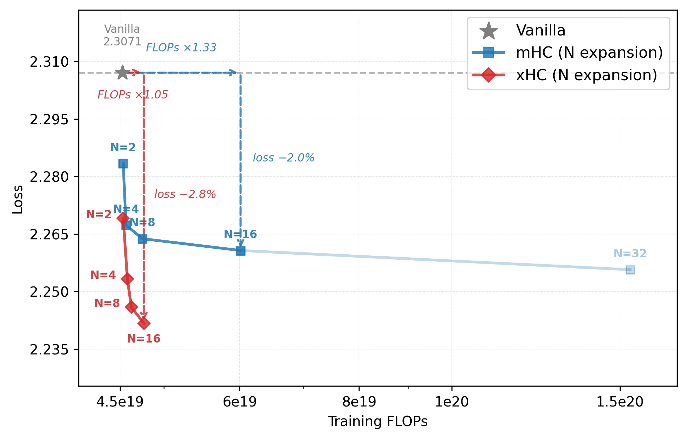
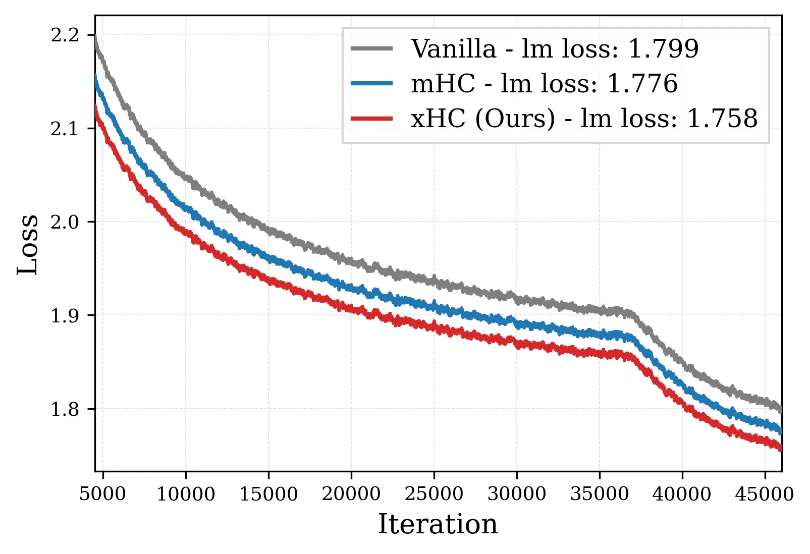
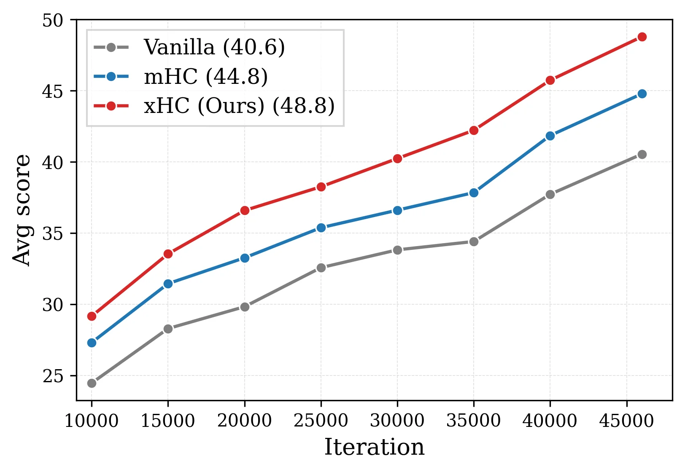
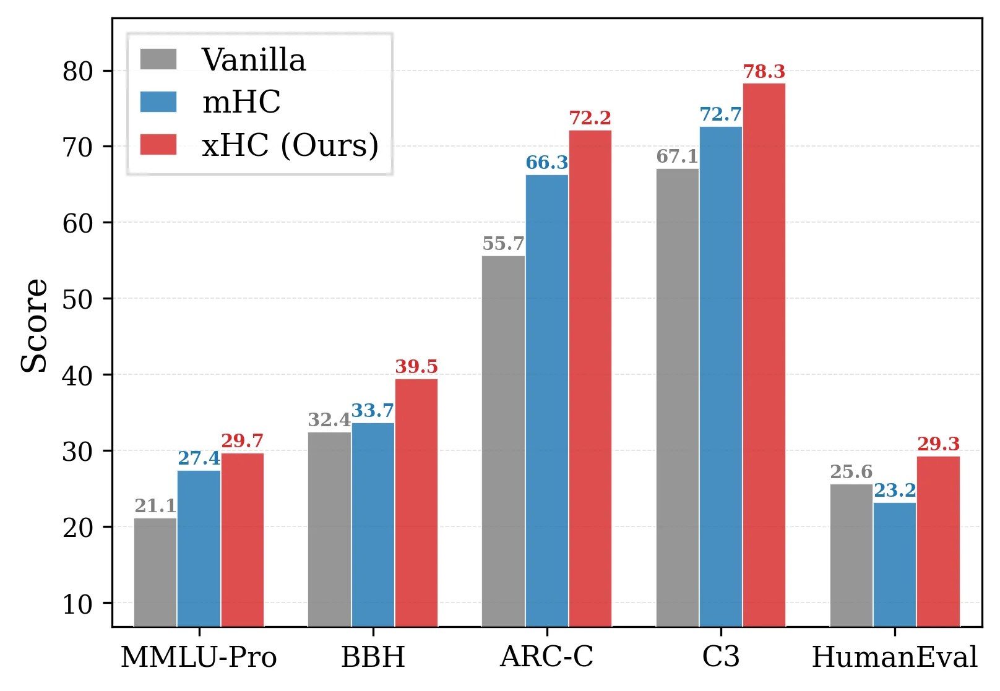
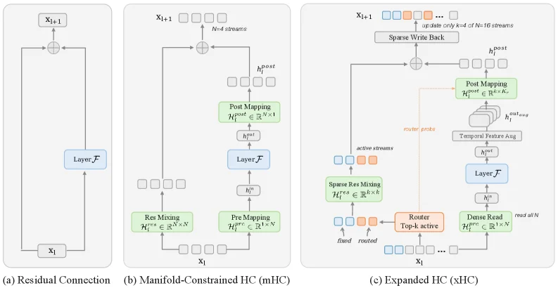
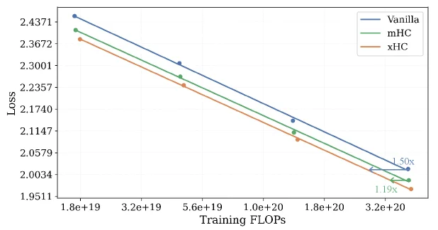
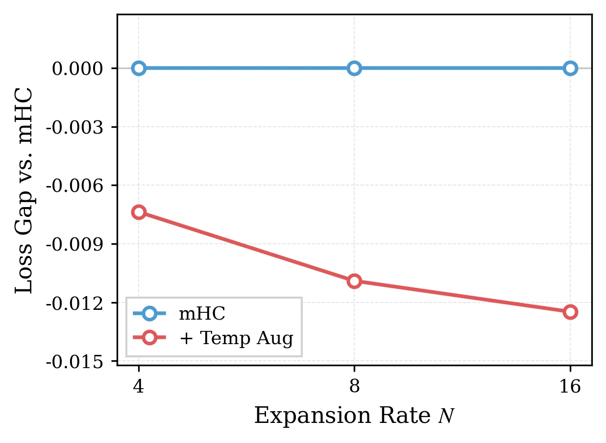

# xHC: Expanded Hyper-Connections

[arXiv](https://arxiv.org/abs/2607.14530) · [HuggingFace](https://huggingface.co/papers/2607.14530) · ▲26

## 摘要（原文）

> Hyper-Connections (HC) expand the residual stream of Transformers into N parallel streams, providing a form of memory scaling beyond model width and depth. Manifold-Constrained HC (mHC) stabilizes this formulation at scale. The large gains from N{=}1 to N{=}4 suggest residual-stream expansion as a promising scaling axis. However, existing HC-family methods typically stop at N{=}4. Our experiments reveal why: scaling mHC beyond this point yields diminishing performance gains and rapidly increasing training cost. We attribute this limitation to two bottlenecks: insufficient write-back information for an expanding number of streams and residual-mixing generation whose cost scales cubically with N. To address both bottlenecks, we propose xHC (Expanded Hyper-Connections), the first HC-family method to achieve meaningful expansion beyond N{=}4. xHC combines temporal feature augmentation for richer write-back with a sparse residual-stream architecture that updates only k=4 of the N=16 streams while retaining dense access to the full residual state. Across 18B and 28B MoE models, xHC delivers strong and consistent downstream improvements. On an 18B MoE model, xHC improves the average downstream score by 4.0 points over mHC, while adding only modest training FLOPs over the vanilla baseline. Scaling-law experiments show that the vanilla and mHC require 1.50times and 1.19times the compute of xHC, respectively, to reach the same loss. Practical large-N training also requires controlling memory traffic from the expanded residual state. We therefore introduce xHC-Flash, which reduces the per-sublayer memory traffic from 73.5C to 40C, comparable to the 34C required by mHC at N{=}4, while retaining the gains of full xHC. Together, xHC and xHC-Flash make large-N residual-stream expansion effective and practical for LLM pre-training.

## 摘要（中译）

超连接（Hyper-Connections，HC）将Transformer的残差流扩展为N个并行流，提供了一种超越模型宽度和深度的内存扩展形式。流形约束超连接（Manifold-Constrained HC，mHC）在大规模场景下稳定了这种公式化方法。从N=1到N=4的显著收益表明残差流扩展是一个有前景的扩展轴。然而，现有的HC系列方法通常止步于N=4。我们的实验揭示了原因：将mHC扩展到这个点之外会导致性能收益递减和训练成本迅速增加。我们将这一限制归因于两个瓶颈：对于不断扩展的流数量，回写信息不足；以及残差混合生成的成本随N呈三次方增长。为了解决这两个瓶颈，我们提出了xHC（扩展超连接），这是第一个在N>4时实现有意义扩展的HC系列方法。xHC结合了时间特征增强以获得更丰富的回写，以及一种稀疏残差流架构，该架构仅更新N=16个流中的k=4个流，同时保留对完整残差状态的密集访问。在18B和28B的混合专家（Mixture of Experts，MoE）模型上，xHC带来了强大且一致的下游改进。在一个18B的MoE模型上，xHC将平均下游分数比mHC提高了4.0分，而相对于普通基线只增加了适度的训练浮点运算次数（floating-point operations，FLOPs）。缩放定律实验表明，普通方法和mHC分别需要比xHC多1.50倍和1.19倍的计算量才能达到相同的损失。实际的大N训练还需要控制来自扩展残差状态的内存流量。因此，我们引入了xHC-Flash，它将每个子层的内存流量从73.5C减少到40C，与N=4时mHC所需的34C相当，同时保留了完整xHC的收益。总之，xHC和xHC-Flash使大N残差流扩展在大型语言模型（Large Language Model，LLM）预训练中既有效又实用。

## 背景剖析

大语言模型（LLM）的核心架构长期依赖单一残差流传递信息，这种设计限制了模型对跨层信息的灵活控制能力。随着模型规模扩大，单纯增加宽度、深度或数据量已难以高效提升性能，需要新的扩展维度。Hyper-Connections（HC）技术通过并行残差流和可学习的混合矩阵，试图为模型增加"记忆容量"，但现有方法在扩展到4个以上并行流时遇到瓶颈——性能提升骤减而计算成本激增。

具体来说，原有方法存在两个关键缺陷：首先，每个新增的残差流需要存储不同的层输出历史，但每层只能注入单一的写回信号，导致信息多样性不足；其次，计算成本随并行流数量呈立方级增长，因为需要从高维状态中预测混合系数。这使得扩展残差流成为"代价高昂的低效操作"。

本文提出的xHC（Expanded Hyper-Connections）通过双管齐下的方案解决了这些问题：一方面引入时间特征增强，在保持计算效率的同时为每个残差流提供更丰富的上下文信息；另一方面采用稀疏残差流架构，只激活少量流进行更新，大幅降低计算开销。这种设计既解决了信息多样性问题，又控制了计算成本，使得残差流扩展到16个甚至更多成为可能。

与前人工作相比，xHC的关键创新在于：1）首次实现超过4个并行流的有效扩展；2）将信息增强与计算优化解耦但又协同工作；3）不仅提升性能，还显著改善了扩展的性价比。实验表明，在18B参数的MoE模型上，xHC比现有方法mHC提升了4个下游任务分数，同时只增加了少量训练成本。这种技术突破使得残差流扩展真正成为LLM训练的有效扩展维度。

## 方法图解

> Figure 1 : Expansion efficiency: loss vs. FLOPs on a 2.5B MoE model (details in Table 6 ).

这张图（图1）展示了在2.5B MoE模型上，不同方法的“损失（Loss）”与“训练浮点运算次数（Training FLOPs）”之间的关系，以此来比较它们的扩展效率。图的横轴是“Training FLOPs”，表示训练过程中所需的计算量，数值从左到右逐渐增大；纵轴是“Loss”，表示模型的损失值，数值从上到下逐渐减小，意味着模型性能更好。

图中有三种方法被比较：Vanilla（灰色星形标记）、mHC (N expansion)（蓝色方形标记）和xHC (N expansion)（红色菱形标记）。每种方法都有不同N值的实验点，N代表扩展的并行流的数量。

1.  **Vanilla 方法**：
    *   它只有一个数据点（灰色星形），位于图的左上角，对应的FLOPs约为4.5e19，Loss约为2.3071。这代表了没有使用任何HC扩展的基线模型。从这一点出发，有一条水平虚线向右延伸，标注为“FLOPs ×1.33”，指向mHC方法在N=16时的FLOPs位置。这表明，如果要从Vanilla方法达到与mHC (N=16)相似的性能（Loss约2.265），Vanilla方法需要增加约33%的计算量。

2.  **mHC (N expansion) 方法**：
    *   这是一条蓝色的曲线，展示了随着N值（2, 4, 8, 16, 32）增加时，Loss和FLOPs的变化。
    *   当N从2增加到4时，FLOPs变化不大，但Loss有明显下降（从约2.280降到约2.265）。
    *   当N从4增加到8时，Loss继续下降，但下降幅度减小。
    *   当N从8增加到16时，Loss进一步下降，但此时曲线开始变得平缓。从N=16到N=32，FLOPs显著增加（从约6e19到约1.5e20），但Loss的下降非常有限（从约2.265降到略低于2.260）。图中从N=16到N=32的蓝色虚线箭头旁标注了“loss −2.0%”，表明损失的减少非常小。
    *   这表明mHC方法在N较小的时候（如N=4或8）能有效降低损失，但随着N的进一步增大（如N>16），计算成本的增加远快于性能的提升，即出现了收益递减的现象。

3.  **xHC (N expansion) 方法**：
    *   这是一条红色的曲线，同样展示了随着N值（2, 4, 8, 16）增加时，Loss和FLOPs的变化。
    *   当N从2增加到4时，FLOPs略有增加（从约4.5e19到略高于4.5e19），但Loss有显著下降（从约2.280降到约2.265）。
    *   当N从4增加到8时，Loss继续下降，FLOPs也有所增加。
    *   当N从8增加到16时，Loss进一步显著下降（从约2.265降到约2.240），而FLOPs的增加相对较小（从略高于4.5e19到约5.5e19）。
    *   图中从Vanilla方法到xHC (N=16)的红色虚线箭头旁标注了“FLOPs ×1.05”，表明xHC (N=16)仅用了比Vanilla方法多约5%的计算量，就达到了更低的损失。
    *   从xHC (N=4)到xHC (N=16)的红色虚线箭头旁标注了“loss −2.8%”，表明在这个N范围内，损失的减少较为显著。

**方法运作机制的揭示**：
*   **mHC**：通过增加并行流的数量N来扩展残差流。然而，如图所示，当N超过一定值（如16）后，其收益递减，因为计算成本（FLOPs）迅速增加，而性能提升有限。这可能是由于“写入信息不足”和“残差混合生成的成本随N立方增长”的瓶颈。
*   **xHC**：旨在解决mHC在大N值时遇到的瓶颈。它通过两种方式实现：1) “时间特征增强”以提供更丰富的写回信息；2) “稀疏残差流架构”，其中只更新N个流中的k=4个，同时保持对整个残差状态的密集访问。这使得xHC能够在较大的N值（如N=16）下仍然有效降低损失，同时控制计算成本的增加。

**结论**：
*   该图清晰地展示了xHC方法相对于mHC和Vanilla方法的优越性。
*   **效率对比**：xHC在较小的计算成本增加下实现了更低的损失。例如，xHC (N=16)仅用了比Vanilla多约5%的计算量，就取得了显著的损失降低。相比之下，mHC需要增加更多的计算量才能达到类似的性能改进，或者在相同计算量下性能提升有限。
*   **扩展性**：xHC证明了残差流扩展（N>4）是一个有前景的缩放方向，而mHC在大N值时效率低下。xHC通过其创新架构解决了大N值扩展的瓶颈，实现了有意义的性能提升。
*   **关键发现**：xHC在N=16时，与Vanilla相比，仅需约5%的额外FLOPs即可获得更好的性能；而mHC在N=16时，其FLOPs大约是Vanilla的1.33倍（根据水平虚线推断）。图中xHC的曲线在N=16时明显低于mHC的曲线，表明其在相同或更低计算成本下具有更好的性能。

---

> (a) Training loss. (b) Average downstream score. (c) Benchmark-level gains. Figure 2 : xHC delivers broad gains at 18B scale. (a) xHC achieves lowest training loss. (b) The loss improvement translates into a significantly higher average downstream score across benchmarks in Table 1 . (c) xHC improves representative benchmarks across reasoning, knowledge, and code.

这张图（图2a）展示了三种不同方法在训练过程中的损失（Loss）随迭代次数（Iteration）变化的曲线，用于比较它们的训练效果。

### 图中组件解释
- **横轴（Iteration）**：表示训练的迭代次数，范围从5000到45000，代表训练过程中模型更新的次数，次数越多说明训练进行得越久。
- **纵轴（Loss）**：表示训练损失，数值越低说明模型的训练效果越好（即模型对任务的拟合程度越高）。
- **三条曲线**：
  - 灰色曲线（Vanilla）：代表原始的（未使用HC相关改进的）模型训练损失，其最终的平均语言模型损失（lm loss）为1.799。
  - 蓝色曲线（mHC）：代表使用Manifold - Constrained Hyper - Connections（mHC）方法的模型训练损失，最终平均语言模型损失为1.776。
  - 红色曲线（xHC (Ours)）：代表本文提出的xHC（Expanded Hyper - Connections）方法的模型训练损失，最终平均语言模型损失为1.758。

### 方法运作原理（从图中结果推断）
- 从损失曲线的下降趋势来看，三种方法都随着迭代次数的增加而降低了损失，说明它们都能通过训练提升模型性能。
- xHC的曲线（红色）在大部分迭代次数下都低于mHC（蓝色）和Vanilla（灰色）的曲线，这表明xHC在训练过程中能够更有效地降低损失。结合论文内容，xHC通过**时间特征增强（temporal feature augmentation）**来提供更丰富的写回信息，解决了mHC在大N（平行流数量）时写回信息不足的问题；同时采用**稀疏残差流架构（sparse residual - stream architecture）**，只更新N=16个流中的k=4个，同时保留对完整残差状态的密集访问，解决了残差混合生成成本随N立方增长的问题，从而能够在更大的N下实现有意义的扩展，并且在训练中取得更好的损失下降效果。

### 坐标、对比对象和结论
- **坐标**：横轴是迭代次数（5000到45000），纵轴是损失（1.8到2.2左右）。
- **对比对象**：Vanilla（原始模型）、mHC（现有改进方法）、xHC（本文提出的方法）。
- **结论**：在这三种方法中，xHC的训练损失最低（最终lm loss为1.758），且在整个训练过程中（从迭代5000到45000），其损失下降的速度和最终的损失值都优于mHC和Vanilla。这说明xHC在训练阶段能够更有效地优化模型，为后续的下游任务（如推理、知识、代码相关的基准测试）取得更好的成绩奠定了基础（结合论文后续的下游分数和基准测试增益部分的内容，可以推断出训练损失低有助于提升下游性能）。同时，从训练计算的效率来看（论文中提到），vanilla和mHC需要比xHC多1.50倍和1.19倍的计算量才能达到相同的损失，这也说明xHC在训练效率和性能上都有优势。

---

> (a) Training loss. (b) Average downstream score. (c) Benchmark-level gains. Figure 2 : xHC delivers broad gains at 18B scale. (a) xHC achieves lowest training loss. (b) The loss improvement translates into a significantly higher average downstream score across benchmarks in Table 1 . (c) xHC improves representative benchmarks across reasoning, knowledge, and code.

这张图（图2b）展示了三种不同方法在训练过程中**平均下游任务得分**随**迭代次数**变化的趋势，清晰地对比了它们的性能表现和提升速度。

首先，我们来看图的各个组成部分：
- **横轴（X轴）**：代表训练的“迭代次数（Iteration）”，范围从10000到45000。这表示模型训练的进度，数值越大意味着训练进行得越深入。
- **纵轴（Y轴）**：代表“平均得分（Avg score）”，范围大约从25到50。这个得分是模型在一系列下游基准测试上的综合表现，分数越高表示模型性能越好。
- **三条曲线**：分别代表了三种不同的方法：
    - **灰色曲线（Vanilla）**：这通常指的是基准的、未使用特定HC（Hyper-Connections）方法的Transformer模型。图例中标注的平均得分为40.6（可能是在某个特定迭代点或最终的平均得分）。
    - **蓝色曲线（mHC）**：代表“Manifold-Constrained HC”方法。图例中标注的平均得分为44.8。
    - **红色曲线（xHC (Ours)）**：代表论文提出的“Expanded Hyper-Connections”方法，即作者的方法。图例中标注的平均得分为48.8。

数据的流动和信息的呈现方式是：
- 每条曲线上的点表示在特定迭代次数下，对应方法的平均下游得分。
- 随着迭代次数的增加（从左到右），所有方法的得分都呈现出上升趋势，表明随着训练的进行，模型的性能在不断提高。
- 我们可以观察到不同方法的提升速度和最终达到的得分水平：
    - **Vanilla方法**（灰色曲线）：得分增长相对平缓，最终平均得分为40.6。
    - **mHC方法**（蓝色曲线）：得分增长速度比Vanilla快，最终平均得分为44.8。
    - **xHC方法**（红色曲线）：得分增长速度最快，最终平均得分为48.8，明显高于其他两种方法。

这张图揭示了方法的运作方式和效果：
- **xHC方法的优势**：通过结合“时间特征增强（temporal feature augmentation）”以提供更丰富的写回信息，以及“稀疏残差流架构（sparse residual-stream architecture）”（仅更新N=16个流中的k=4个，同时保留对完整残差状态的密集访问），xHC能够在较大的N值下实现有意义的扩展。这使得xHC在训练过程中能够更有效地利用资源，并在下游任务上取得更好的性能。
- **性能对比**：从图中可以看出，xHC在所有迭代阶段都优于mHC和Vanilla方法。特别是在训练后期，xHC的得分增长更为显著，最终达到了最高的平均下游得分。这表明xHC不仅能够提高模型的性能，还能够加速收敛过程。
- **计算效率**：虽然图中没有直接显示计算成本，但根据论文摘要的描述，xHC在达到相同损失时所需的计算量（FLOPs）比Vanilla和mHC少。这意味着xHC在性能提升的同时，还能保持较低的计算成本。

结论：
这张图清楚地表明，论文提出的xHC方法在18B规模的MoE模型上取得了显著的下游性能提升。与mHC和Vanilla方法相比，xHC在训练过程中能够更快地提高平均下游得分，并最终达到更高的得分水平。这验证了xHC方法在解决HC-family方法在大N值下遇到的瓶颈问题方面的有效性，并展示了其在实际应用中的潜力。

---

> (a) Training loss. (b) Average downstream score. (c) Benchmark-level gains. Figure 2 : xHC delivers broad gains at 18B scale. (a) xHC achieves lowest training loss. (b) The loss improvement translates into a significantly higher average downstream score across benchmarks in Table 1 . (c) xHC improves representative benchmarks across reasoning, knowledge, and code.

这张图（图2的(c)部分，标注为“Benchmark - level gains”）展示了不同方法在多个基准测试上的得分情况，用于说明xHC（我们的方法）在这些基准上的表现优于Vanilla（基线方法）和mHC（现有方法）。我们先看坐标轴：纵轴是“Score”（得分），范围从10到80；横轴是不同的基准测试，包括MMLU - Pro、BBH、ARC - C、C3和HumanEval。

首先看每个基准下的三个柱子，分别代表三种方法：
- 灰色柱子是Vanilla方法，作为基线；
- 蓝色柱子是mHC方法；
- 红色柱子是我们的xHC方法，标注为“Ours”。

接下来逐个分析每个基准：
1. **MMLU - Pro**：Vanilla得分为21.1，mHC为27.4，xHC为29.7。可以看到xHC比mHC高，mHC比Vanilla高，说明xHC在这个知识类基准上表现更好。
2. **BBH**：Vanilla得分为32.4，mHC为33.7，xHC为39.5。同样，xHC的得分高于mHC和Vanilla，提升明显。
3. **ARC - C**：Vanilla得分为55.7，mHC为66.3，xHC为72.2。xHC的得分显著高于前两者，说明在推理类基准上xHC优势更大。
4. **C3**：Vanilla得分为67.1，mHC为72.7，xHC为78.3。xHC的得分最高，且与前两者的差距进一步拉大，表明xHC在大规模推理或知识基准上效果突出。
5. **HumanEval**：这是一个代码相关的基准，Vanilla得分为25.6，mHC为23.2（这里mHC得分比Vanilla低？可能是因为mHC在该任务上的适应性，但xHC得分为29.3，远高于前两者，说明xHC在代码生成类任务上也有很好的表现）。

从整体趋势来看，xHC在所有展示的基准测试中，得分都高于Vanilla和mHC（除了HumanEval中mHC得分略低于Vanilla，但xHC仍远高于两者）。这说明xHC的方法能够有效地提升模型在下游基准测试中的表现，无论是知识类、推理类还是代码类任务。结合论文的背景，xHC通过时间特征增强（更丰富的写回）和稀疏残差流架构（只更新N=16个流中的k=4个，同时保留对完整残差状态的密集访问）来解决mHC在大N（超过4）时的瓶颈问题，而这张图的结果验证了xHC的有效性，即它在多个基准上带来了广泛的性能提升，尤其是在18B规模的模型上，平均下游得分比mHC提高了4.0分，同时训练FLOPs的增加相对温和。

总结来说，这张图通过对比三种方法（Vanilla、mHC、xHC）在五个不同基准测试上的得分，清晰地展示了xHC方法的优势：它在各个基准上都取得了更高的分数，证明了xHC能够有效提升模型的下游性能，解决了现有HC家族方法在大N扩展时的性能增益递减和训练成本增加的问题。

---

> Figure 3 : Overview of xHC. (a) A standard Transformer layer maintains a single residual stream. (b) mHC expands the residual state into N = 4 N{=}4 streams with dense residual mixing and write-back. (c) xHC scales to N = 16 N{=}16 with only k = 4 k{=}4 active streams: it reads all streams, applies the sublayer ℱ \mathcal{F} (Attn/MLP), augments MLP outputs, and sparsely writes back to selected streams. Blue/orange streams denote fixed/routed active streams. Restricting residual mapping to the k k active streams reduces the dominant residual-mapping generation cost from O ​ ( N 3 ​ C ) O(N^{3}C) to O ​ ( k 3 ​ C ) O(k^{3}C) .

这张图（图3）展示了从标准Transformer残差连接到mHC（Manifold - Constrained HC）再到xHC（Expanded Hyper - Connections）的演进过程，帮助我们理解xHC的工作机制：

### 子图(a)：标准Transformer层的残差连接
- **组件与流动**：这里只有一个残差流。输入是\( x_1 \)，经过蓝色的“Layer \( \mathcal{F} \)”（可以是注意力或MLP子层）处理后，和原始输入\( x_1 \)通过加法操作（\( \oplus \)）结合，得到输出\( x_{t + 1} \)。数据流动顺序是\( x_1 \rightarrow \text{Layer } \mathcal{F} \rightarrow \oplus \text{（与} x_1 \text{相加）} \rightarrow x_{t + 1} \)。这代表了传统Transformer中单一残差流的计算流程，所有的计算都在这个单一的流上进行。

### 子图(b)：mHC（Manifold - Constrained HC）
- **组件与流动**：mHC将残差状态扩展到\( N = 4 \)个流。
    - 首先，输入\( x_1 \)进入“Pre Mapping \( \mathcal{H}_{\text{pre}}^{\text{res}} \in \mathbb{R}^{1 \times N} \)”（预映射，将输入映射到\( N \)个流的空间），然后分成\( N = 4 \)个流（图中用多个小方块表示）。
    - 其中一个流经过“Layer \( \mathcal{F} \)”处理得到\( h^u \)，然后\( h^u \)进入“Post Mapping \( \mathcal{H}_{\text{post}}^{\text{res}} \in \mathbb{R}^{N \times 1} \)”（后映射，将\( N \)个流的空间映射回单一空间），再和之前的\( N \)个流通过“Res Mixing \( \mathcal{H}_{\text{res}}^{\text{res}} \in \mathbb{R}^{N \times N} \)”（残差混合，将\( N \)个流的信息混合）以及加法操作（\( \oplus \)）结合，最后得到\( x_{t + 1} \)。另外，还有\( N = 4 \)个流直接通过加法操作（\( \oplus \)）和前面的结果结合？不对，重新看：输入\( x_1 \)到Pre Mapping得到\( N \)个流，其中一个流走Layer \( \mathcal{F} \)到\( h^u \)，\( h^u \)到Post Mapping，然后Post Mapping的输出和\( N \)个流（包括原来的\( N \)个流？或者Pre Mapping后的\( N \)个流？）通过Res Mixing混合，然后和\( N = 4 \)个流（可能是Pre Mapping后的\( N \)个流中的部分？）相加？更准确的是：数据流动是\( x_1 \rightarrow \text{Pre Mapping } \mathcal{H}_{\text{pre}}^{\text{res}} \rightarrow \text{分成} N = 4 \text{个流} \)；其中一个流\( \rightarrow \text{Layer } \mathcal{F} \rightarrow h^u \rightarrow \text{Post Mapping } \mathcal{H}_{\text{post}}^{\text{res}} \)；同时，Pre Mapping后的\( N = 4 \)个流\( \rightarrow \text{Res Mixing } \mathcal{H}_{\text{res}}^{\text{res}} \)；然后Post Mapping的输出和Res Mixing的输出相加，再和\( N = 4 \)个流（可能是Pre Mapping后的\( N \)个流？）相加得到\( x_{t + 1} \)？其实核心是mHC将残差流扩展到\( N = 4 \)，使用密集的残差混合（Res Mixing，复杂度\( O(N^3C) \)）和密集的写回（所有\( N \)个流都参与写回），这样可以利用多流的信息，但也带来了计算成本的问题，尤其是当\( N \)增大时。

### 子图(c)：xHC（Expanded Hyper - Connections）
- **组件与流动**：xHC将扩展到\( N = 16 \)个流，但只有\( k = 4 \)个流是活跃的（更新）。
    - **读取（Dense Read）**：首先，输入\( x_1 \)（或当前的残差状态）被“Dense Read”读取，即所有的\( N = 16 \)个流都被读取（图中显示“read all \( N \)”），得到\( \mathcal{H}_{\text{pre}}^{\text{res}} \in \mathbb{R}^{1 \times N} \)。
    - **子层处理（Layer \( \mathcal{F} \)）**：然后，这些\( N = 16 \)个流经过“Layer \( \mathcal{F} \)”（注意力或MLP子层）处理，得到\( h^u \)（可能是中间结果）。
    - **时间特征增强（Temporal Feature Agg）**：对于活跃的流（图中蓝色/橙色，蓝色是fixed，橙色是routed），它们的MLP输出（\( h_{\text{temp}}^{\text{fixed}} \)和\( h_{\text{temp}}^{\text{routed}} \)？或者是MLP输出后的处理）会经过“Temporal Feature Agg”（时间特征增强），这一步是为了生成更丰富的写回信息，解决mHC中写回信息不足的问题。
    - **稀疏残差混合（Sparse Res Mixing）**：然后，进行“Sparse Res Mixing \( \mathcal{H}_{\text{res}}^{\text{res}} \in \mathbb{R}^{k \times k} \)”（因为只有\( k = 4 \)个活跃流，所以复杂度从\( O(N^3C) \)降到\( O(k^3C) \)），这里\( k = 4 \)，所以混合的是这\( k \)个活跃流的信息。
    - **路由（Router Top - k - active）**：“Router”选择\( k = 4 \)个活跃流（图中橙色的“routed”流和蓝色的“fixed”流？或者从\( N = 16 \)个流中选择\( k = 4 \)个活跃流），确定哪些流会被更新。
    - **稀疏写回（Sparse Write Back）**：最后，“Sparse Write Back”只更新\( k = 4 \)个活跃流（图中显示“update only \( k = 4 \) of \( N = 16 \) streams”），而其他\( N - k = 12 \)个流保持不变（或者说使用之前的信息？）。数据流动顺序是：\( x_1 \rightarrow \text{Dense Read（all } N \text{ streams）} \rightarrow \text{Layer } \mathcal{F} \rightarrow \text{（活跃流的）Temporal Feature Agg} \rightarrow \text{Sparse Res Mixing（} k = 4 \text{ streams）} \rightarrow \text{Router（select } k = 4 \text{ active streams）} \rightarrow \text{Sparse Write Back（update } k = 4 \text{ streams）} \rightarrow x_{t + 1} \)（同时，非活跃流可能直接传递？或者和写回后的流结合？图中还有一个加法操作\( \oplus \)，可能是将写回后的\( k \)个流和其他\( N - k \)个流相加？）。

### 方法的核心运作方式
- **扩展流的数量**：xHC将残差流从mHC的\( N = 4 \)扩展到\( N = 16 \)，但通过**稀疏更新**（只更新\( k = 4 \)个流）来降低计算成本。
- **解决mHC的瓶颈**：
    - **写回信息不足**：通过“Temporal Feature Agg”对MLP输出进行时间特征增强，生成更丰富的写回信息，使得更新的\( k \)个流能获得足够的信息。
    - **残差混合的高成本**：通过只对\( k = 4 \)个活跃流进行“Sparse Res Mixing”，将残差混合的复杂度从\( O(N^3C) \)（mHC中\( N = 4 \)时是\( O(4^3C) \)，xHC中\( N = 16 \)但\( k = 4 \)时是\( O(4^3C) \)）降低，解决了mHC中\( N \)增大时残差混合成本立方增长的问题。
- **数据流动的关键步骤**：读取所有流的信息，经过子层处理后，增强活跃流的输出，稀疏混合这些活跃流，然后只更新这\( k \)个活跃流，非活跃流则保留或使用之前的信息（通过加法操作结合？）。

### 与mHC的对比（从图中推断）
- **流的数量**：mHC是\( N = 4 \)，xHC是\( N = 16 \)，但xHC只更新\( k = 4 \)个流。
- **计算成本**：mHC的残差混合复杂度是\( O(N^3C) \)（当\( N = 4 \)时是\( O(64C) \)），xHC的是\( O(k^3C) \)（当\( k = 4 \)时是\( O(64C) \)，但\( N = 16 \)时如果用mHC的方式复杂度是\( O(4096C) \)），所以xHC在\( N \)增大时计算成本增长缓慢。
- **写回信息**：mHC是密集写回（所有\( N \)个流都参与），但写回信息可能不足；xHC通过时间特征增强提供更丰富的写回信息，同时只更新\( k \)个流，解决了写回信息不足和计算成本高的问题。

这张图清晰地展示了xHC如何在扩展残差流数量的同时，通过稀疏更新和时间特征增强来解决mHC的瓶颈，从而实现有意义的扩展（超过\( N = 4 \)）。

---

> Figure 4 : Scaling-law comparison. xHC traces a consistently lower loss curve than both mHC and the vanilla residual baseline across training compute.

这张图（图4）展示了不同方法在训练计算量（以训练FLOPs衡量）与损失（Loss）之间的缩放律对比。横轴是“Training FLOPs”（训练浮点运算次数），从左到右数值逐渐增大，代表训练过程中投入的计算资源越来越多；纵轴是“Loss”（损失），数值从上到下逐渐减小，代表模型的性能越来越好（损失越低，模型预测或学习的效果通常越好）。

图中有三条曲线，分别代表三种方法：
- 蓝色曲线（Vanilla）：代表基础的残差连接（vanilla residual）的Transformer模型，作为基准方法。
- 绿色曲线（mHC）：代表Manifold - Constrained Hyper - Connections（流形约束超连接）方法，是HC家族的一种改进方法，用于稳定大规模下的超连接公式。
- 橙色曲线（xHC）：代表Expanded Hyper - Connections（扩展超连接）方法，是论文提出的新方法，旨在解决mHC在大N（超连接流的数量）下扩展的性能增益递减和训练成本快速增加的问题。

从图中可以看出，随着训练FLOPs的增加，三种方法的损失都在降低，这符合模型训练的一般规律：更多的计算资源投入通常会带来更好的模型性能（更低的损失）。但关键是不同方法的损失降低的速率和最终的损失水平不同。

具体来说，在相同的训练FLOPs下，xHC的损失曲线始终低于mHC和Vanilla曲线。例如，在图的右侧，当训练FLOPs达到3.2e+20时，xHC的损失比mHC低，而mHC的损失又比Vanilla低。图中还标注了xHC相对于mHC和Vanilla的计算效率：xHC达到与mHC相同的损失时，所需的训练FLOPs仅为mHC的1/1.19（即mHC需要的计算量是xHC的1.19倍）；xHC达到与Vanilla相同的损失时，所需的训练FLOPs仅为Vanilla的1/1.50（即Vanilla需要的计算量是xHC的1.50倍）。这说明xHC在相同的损失下，需要的训练计算量更少，或者说在相同的训练计算量下，xHC能获得更低的损失，即xHC的训练效率更高。

从方法运作的角度来看，xHC通过结合时间特征增强（temporal feature augmentation）来提供更丰富的写回信息，解决了超连接流数量扩展时写回信息不足的问题；同时采用稀疏残差流架构，只更新N=16个流中的k=4个流，同时保留对完整残差状态的密集访问，解决了残差混合生成的成本随N立方增长的问题。这样，xHC能够在更大的N下进行有意义的扩展，从而在训练计算量和模型性能之间取得更好的平衡，相比mHC和Vanilla方法，在相同的训练计算量下能获得更低的损失，或者在达到相同损失时需要更少的训练计算量。

总结这张图的结果：xHC在训练缩放律上表现优于mHC和Vanilla残差基线，即在相同的训练计算量下，xHC的损失更低；或者说，要达到相同的损失，xHC所需的训练计算量比mHC和Vanilla更少。这表明xHC是一种更高效的训练方法，能够在不显著增加训练成本的情况下，提供更好的模型性能，或者在相同的训练成本下，实现更好的模型性能提升。

---

> Table 2 : Ablation study. Parentheses show extra training FLOPs over vanilla baseline. “Sparse” is the sparse architecture, “D. Read” is Dense Read, and “Fixed” is the number of always-active streams. Figure 5 : Information bottleneck ablation. The gain grows with N N .

这张图是来自论文《xHC: Expanded Hyper-Connections》的“信息瓶颈消融实验”结果图，用于展示不同方法在不同扩展率下的损失差距。

### 图中组件与信息解读

1. **横轴（X轴）**：标记为“Expansion Rate N”，表示超连接（Hyper-Connections, HC）的扩展率，即并行流的数目。图中展示了三个扩展率：4、8和16。这意味着系统被配置为具有4、8或16个并行的残差流。

2. **纵轴（Y轴）**：标记为“Loss Gap vs. mHC”，表示相对于“Manifold-Constrained HC (mHC)”方法的损失差距。损失值为负数，意味着这些方法的损失低于mHC。数值越小（即越负），表示相对于mHC的性能越好（损失更低）。

3. **曲线与数据点**：
    * **蓝色曲线（带空心圆圈）**：代表“mHC”方法。这条线几乎是水平的，且在Y轴上的值为0.000。这表明mHC方法被用作基准，其损失差距被定义为0。其他方法的损失差距是相对于这个基准来衡量的。
    * **红色曲线（带空心圆圈）**：代表“+ Temp Aug”方法，即应用了“时间特征增强（Temporal Feature Augmentation）”的方法。这条曲线从左到右呈下降趋势（数值变得更负）。具体来说：
        * 当扩展率N=4时，损失差距约为-0.010（比mHC好）。
        * 当N=8时，损失差距约为-0.011（比N=4时更好）。
        * 当N=16时，损失差距约为-0.012（比N=8时更好）。

### 方法运作方式（从图中推断）

这张图揭示了“+ Temp Aug”方法如何通过增加扩展率（N）来改善性能：
* **时间特征增强**：该方法通过引入时间特征增强，为系统提供了更丰富的“写回”信息。这使得系统能够更好地处理随着扩展率增加而增多的并行流。
* **损失差距的改善**：随着扩展率N从4增加到16，“+ Temp Aug”方法的损失持续降低（变得更负），表明其性能相对于mHC基准在不断提高。这说明时间特征增强有助于缓解mHC在扩展到较大N时出现的性能增益递减问题。

### 结论

* **性能对比**：在所有展示的扩展率（N=4, 8, 16）下，“+ Temp Aug”方法的损失都低于mHC基准。
* **扩展性**：“+ Temp Aug”方法表现出良好的扩展性，即随着扩展率N的增加，其相对于mHC的性能优势（损失差距）也在增大。
* **信息瓶颈的缓解**：这张图支持了论文的观点，即通过时间特征增强可以缓解HC方法在扩展时的信息瓶颈问题，从而在更大的扩展率下仍能获得性能提升。

总而言之，这张图清晰地展示了“+ Temp Aug”方法如何通过增加扩展率来改善性能，相对于mHC基准，其损失持续降低，表明该方法在处理大规模超连接时更为有效。
