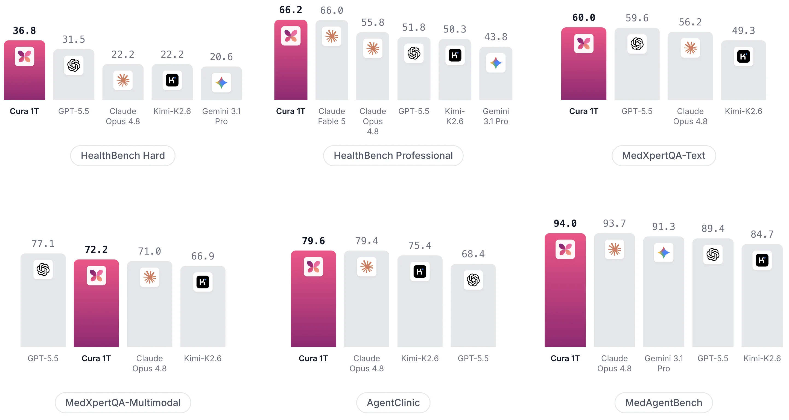
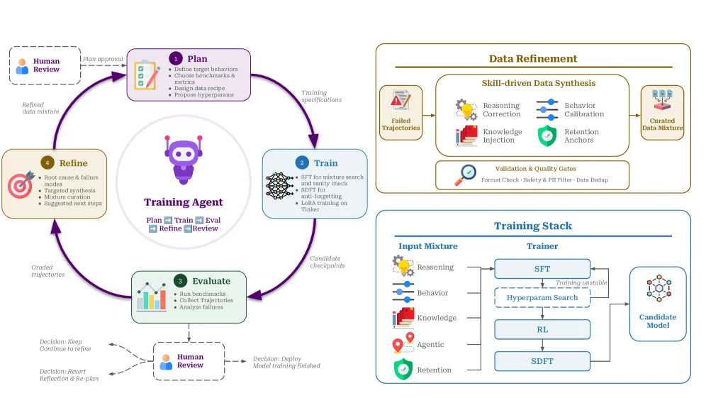
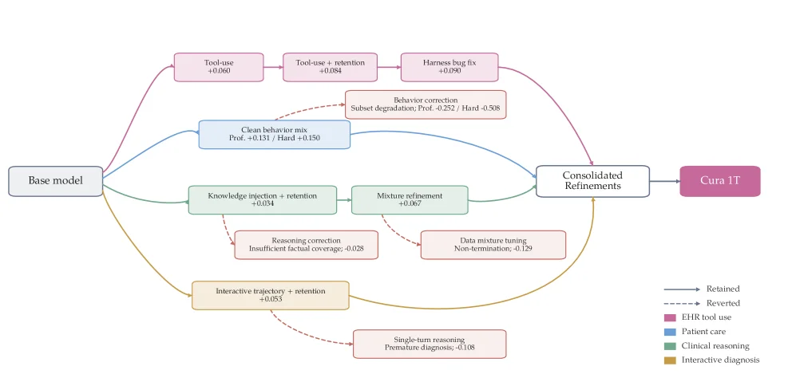
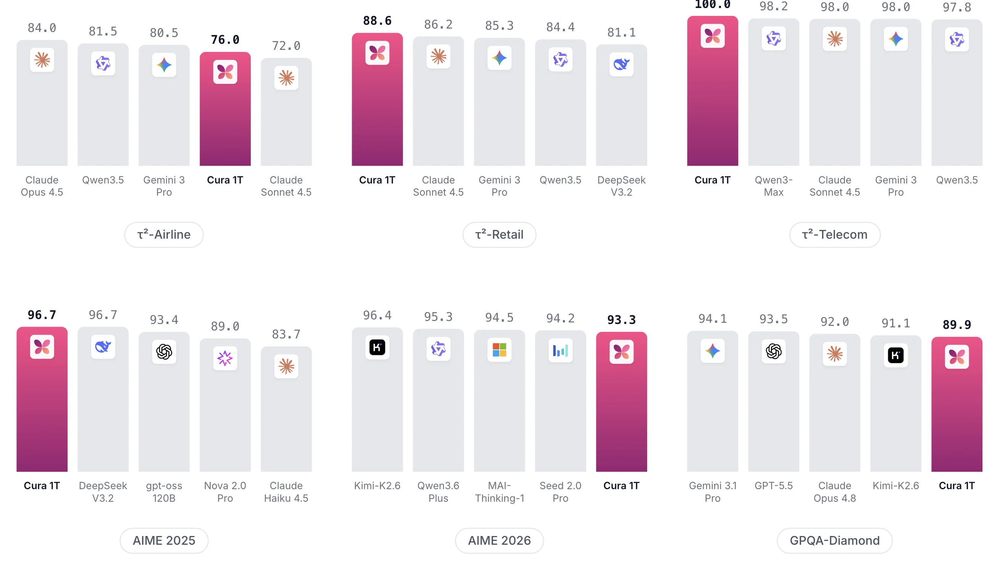

# Cura 1T: Specialized Model for Agentic Healthcare

[arXiv](https://arxiv.org/abs/2607.15314) · [HuggingFace](https://huggingface.co/papers/2607.15314) · ▲28

## Abstract (verbatim)

> Healthcare spans high-stakes communication, expert reasoning, and workflow execution, yet specialized LLMs that cover these use cases together remain limited. A healthcare model must handle patient consultation, clinical reasoning over text and images, interactive diagnosis, and electronic health record (EHR) tool use. These capabilities fail in different ways, and a narrow update for one task can degrade another. We present Cura 1T, a healthcare-specialized LLM trained through a human-gated self-evolution loop. In each evolution round, a training agent plans a target capability, trains the model, evaluates benchmark trajectories, and refines the data mixture from observed failures. This data-centered loop improves the model through targeted synthetic and curated examples rather than a single generic medical-data update. Across the healthcare evaluation suite, Cura 1T ranks at or near the top among frontier baselines, while remaining competitive on out-of-domain reasoning and agentic benchmarks.

## Background

### Background Analysis  

**1. Technical Context and Real-World Needs**  
Healthcare requires capabilities for high-stakes communication, expert reasoning, and workflow execution, such as adhering to clinical guidelines during patient interactions, analyzing text and images for diagnosis, and using electronic health records (EHR) for long-term care. These scenarios demand models that balance accuracy, consistency, and error avoidance. However, existing models often excel in one task but fail in others, creating gaps in real-world deployment.  

**2. Previous Limitations**  
Despite progress in isolated medical tasks (e.g., QA or imaging analysis), three challenges persist:  
- **Task Interference**: Optimizing for one task (e.g., diagnosis) may degrade performance in others (e.g., tool usage).  
- **Data Fragmentation**: Medical data is scattered across guidelines, patient records, and images, with limited high-quality supervision (e.g., some outcomes cannot be easily verified).  
- **Diverse Failure Modes**: Different tasks require distinct fixes (e.g., missing information vs. brittle reasoning), making generic updates ineffective.  

**3. Proposed Solution**  
The paper introduces Cura 1T, which uses a **"human-gated self-evolution loop"** to address these issues. An AI agent autonomously plans improvements (e.g., enhancing multi-round diagnosis), trains the model, evaluates results, and refines data based on failures. For example, if the model misses a detail in imaging, the agent adds targeted data instead of overhauling the entire system. This avoids the pitfalls of one-size-fits-all training by iteratively balancing task-specific and general capabilities.  

**4. Key Differences from Prior Work**  
Cura 1T stands out by:  
- **Coordinated Task Optimization**: Simultaneously improving patient interaction, clinical reasoning, and EHR tool usage, rather than isolating tasks.  
- **Automated Iteration**: Using an AI agent to analyze failures and generate improvements, reducing manual effort.  
- **Generalization Preservation**: Maintaining strong performance in non-medical benchmarks (e.g., math), proving its training strategy avoids compromising broader capabilities.  

This approach positions Cura 1T as a leader in healthcare AI while offering a blueprint for developing "specialized yet generalizable" models.

## Method, Figure by Figure

> Figure 1 : Performance of Cura 1T, frontier models, and the Kimi-K2.6 base across six healthcare benchmark panels: MedAgentBench (Jiang et al., 2025 ) , HealthBench Professional and Hard (Arora et al., 2025 ; OpenAI, 2026 ) , MedXpertQA (Zuo et al., 2025 ) , and AgentClinic (Schmidgall et al., 2024 ) .

This figure (Figure 1) presents the performance of the Cura 1T model, along with several frontier baseline models, across six healthcare benchmark panels. We can divide the figure into six main sections, each corresponding to a specific benchmark test, arranged in a two-row, three-column layout.

First, let's look at the three benchmark tests in the first row:

1.  **HealthBench Hard**:
    *   **Coordinates and Comparison Objects**: This is a bar chart where the x-axis represents different models, and the y-axis represents performance scores (values labeled above the bars). From left to right, the models are: Cura 1T, GPT-5.5, Claude Opus 4.8, Kimi-K2.6, and Gemini 3.1 Pro. Cura 1T scores 36.8, GPT-5.5 scores 31.5, Claude Opus 4.8 scores 22.2, Kimi-K2.6 scores 22.2, and Gemini 3.1 Pro scores 20.6.
    *   **Interpretation**: In this benchmark, Cura 1T outperforms all other compared models.

2.  **HealthBench Professional**:
    *   **Coordinates and Comparison Objects**: Also a bar chart. From left to right, the models are: Cura 1T, Claude Fable 5, Claude Opus 4.8, GPT-5.5, Kimi-K2.6, and Gemini 3.1 Pro. Cura 1T scores 66.2, Claude Fable 5 scores 66.0, Claude Opus 4.8 scores 55.8, GPT-5.5 scores 51.8, Kimi-K2.6 scores 50.3, and Gemini 3.1 Pro scores 43.8.
    *   **Interpretation**: Cura 1T performs the best in this benchmark, slightly outperforming Claude Fable 5.

3.  **MedXpertQA-Text**:
    *   **Coordinates and Comparison Objects**: Bar chart. From left to right, the models are: Cura 1T, GPT-5.5, Claude Opus 4.8, and Kimi-K2.6. Cura 1T scores 60.0, GPT-5.5 scores 59.6, Claude Opus 4.8 scores 56.2, and Kimi-K2.6 scores 49.3.
    *   **Interpretation**: Cura 1T performs the best in this text-based medical question-answering benchmark.

Next, the three benchmark tests in the second row:

4.  **MedXpertQA-Multimodal**:
    *   **Coordinates and Comparison Objects**: Bar chart. From left to right, the models are: GPT-5.5, Cura 1T, Claude Opus 4.8, and Kimi-K2.6. GPT-5.5 scores 77.1, Cura 1T scores 72.2, Claude Opus 4.8 scores 71.0, and Kimi-K2.6 scores 66.9.
    *   **Interpretation**: Although Cura 1T's score (72.2) in this multimodal medical question-answering benchmark is lower than GPT-5.5's (77.1), it still outperforms Claude Opus 4.8 and Kimi-K2.6. This indicates that Cura 1T is competitive in multimodal tasks but may not rank first in all scenarios.

5.  **AgentClinic**:
    *   **Coordinates and Comparison Objects**: Bar chart. From left to right, the models are: Cura 1T, Claude Opus 4.8, Kimi-K2.6, and GPT-5.5. Cura 1T scores 79.6, Claude Opus 4.8 scores 79.4, Kimi-K2.6 scores 75.4, and GPT-5.5 scores 68.4.
    *   **Interpretation**: Cura 1T performs the best in this agent-clinic-related benchmark, with a score slightly higher than Claude Opus 4.8.

6.  **MedAgentBench**:
    *   **Coordinates and Comparison Objects**: Bar chart. From left to right, the models are: Cura 1T, Claude Opus 4.8, Gemini 3.1 Pro, GPT-5.5, and Kimi-K2.6. Cura 1T scores 94.0, Claude Opus 4.8 scores 93.7, Gemini 3.1 Pro scores 91.3, GPT-5.5 scores 89.4, and Kimi-K2.6 scores 84.7.
    *   **Interpretation**: Cura 1T performs the most outstandingly in this comprehensive healthcare agent benchmark, with a score significantly higher than other models.

This figure reveals how the Cura 1T method works and its effectiveness:
*   **Method Background**: According to the paper abstract, healthcare requires models to handle high-stakes communication, expert reasoning, and workflow execution, including patient consultation, clinical reasoning over text and images, interactive diagnosis, and EHR tool use. Traditional single-task updates can degrade other capabilities.
*   **Cura 1T's Method**: Cura 1T is a healthcare-specialized LLM trained through a "human-gated self-evolution loop." In each evolution round, a training agent plans a target capability, trains the model, evaluates benchmark trajectories, and refines the data mixture from observed failures. This method improves the model through targeted synthetic and curated examples rather than a single generic medical data update.
*   **Result Presentation**: Each benchmark panel in the figure shows Cura 1T's performance compared to several frontier models (e.g., GPT-5.5, Claude Opus 4.8, Kimi-K2.6) on specific healthcare tasks. The results show that Cura 1T achieves top or near-top rankings in most benchmarks, validating the effectiveness of its "data-centered loop" improvement method. It can cover multiple healthcare use cases while maintaining competitiveness in out-of-domain reasoning and agent benchmarks.

In summary, this figure clearly demonstrates the excellent performance of Cura 1T as a specialized healthcare LLM across various healthcare-related tasks through six different medical benchmarks, thus supporting the effectiveness of the methodology proposed in the paper.

---

> Figure 2 : Left: Agent-managed self-evolution loop for Cura 1T. Human review gates the plan before training and the keep, revert, or deploy decision after evaluation. Right: Data refinement pipeline and training stack.

This figure illustrates the core training framework of Cura 1T, divided into two main parts: the left side shows the **agent-managed self-evolution loop**, and the right side presents the **data refinement pipeline and training stack**.

### Left: Self-evolution Loop (Agent-managed Self-evolution Loop)
This loop describes how Cura 1T continuously optimizes through an iterative process of "Plan - Train - Evaluate - Refine", with human review involved at each key node:

1. **Plan**:
   - Content: Define target behaviors, select benchmarks and metrics, design a data recipe, and propose hyperparameters.
   - Flow: The plan needs to be approved (Plan approval) by "Human Review" before entering the training phase. Human review plays a gatekeeping role here to ensure the rationality of the plan.

2. **Train**:
   - Content: Use SFT (Supervised Fine-Tuning) for mixture search and sanity check, and use SDFT (a possible specific fine-tuning) for anti-forgetting and LoRA training (SDFT for anti - forgetting & LoRA training on Tinker).
   - Input: "Training specifications" from the "Refine" phase.
   - Output: Generate "Candidate checkpoints" and enter the evaluation phase.

3. **Evaluate**:
   - Content: Run benchmarks, collect trajectories, and analyze failure cases.
   - Output: Generate "Graded trajectories" and enter the "Refine" phase; at the same time, submit the results to "Human Review" for decision - making (Decision: Keep / Continue to refine / Revert / Deploy / Reflect and Re - plan).

4. **Refine**:
   - Content: Root cause analysis and failure mode analysis, targeted synthesis, mixture curation, and suggesting the next steps.
   - Input: "Graded trajectories" from the "Evaluate" phase and "Failed Trajectories" (fed back from the data refinement part).
   - Output: Generate "Refined data mixture" and return to the "Plan" phase to form a loop. At the same time, "Human Review" will decide whether to "Keep", "Continue to refine", "Revert", "Deploy", or "Reflect and Re - plan" according to the evaluation results.

### Right: Data Refinement Pipeline and Training Stack
This part shows how data is processed to support model training and the specific technical stack of training:

#### Data Refinement
- **Skill - driven Data Synthesis**:
  - Input: "Failed Trajectories".
  - Processing steps: Reasoning Correction, Knowledge Injection, Behavior Calibration, and Retention Anchors.
  - Output: "Curated Data Mixture" for subsequent training.
- **Validation & Quality Gates**:
  - Processing steps: Format Check, Safety & PII Filter, and Data Depep (possibly data deepening or data augmentation).
  - Role: Ensure the quality and security of data, and filter out data that does not meet the requirements.

#### Training Stack
- **Input Mixture**: Contains different types of inputs, such as Reasoning, Behavior, Knowledge, Agentic, and Retention.
- **Trainer**:
  - Steps: First, perform SFT (Supervised Fine - Tuning), then perform Hyperparam Search, followed by RL (Reinforcement Learning), and finally SDFT (Specific Fine - Tuning).
  - Output: "Candidate Model" which enters the evaluation phase.

### How the Method Works
The core of Cura 1T is the **human - gated self - evolution loop**:
1. First, the training agent formulates a training plan, and training starts after human review.
2. After training, the model is evaluated, and its performance and failure cases in benchmark tests are analyzed.
3. According to the evaluation results, the data mixture is refined (including targeted synthesis and data curation), and then human review is used to decide whether to continue training, revert, or deploy.
4. The data refinement part generates high - quality data for training through skill - driven data synthesis and quality gate processing, while the training stack gradually optimizes the model through techniques such as SFT, hyperparameter search, RL, and SDFT.

The advantage of this method is that it does not simply update general medical data, but improves the specific capabilities of the model through **targeted synthesis and curated data**, while avoiding negative impacts on the performance of other tasks. Through its performance in multiple medical evaluation suites, Cura 1T ranks at or near the top among frontier baselines, while remaining competitive in out - of - domain reasoning and agentic benchmarks.

---

> Figure 3 : Evolution map from the base model to Cura 1T. Values are changes from benchmark-specific bases; solid and dashed red arrows mark retained and reverted interventions.

This figure illustrates the evolutionary path from the Base model to the final Cura 1T model, effectively demonstrating the method's implementation. It can be understood as an iterative optimization process, where targeted interventions are applied sequentially to enhance the model's performance.

The process begins with the "Base model." From this starting point, there are four main optimization paths, each representing a specific intervention or optimization objective. These paths are indicated by differently colored arrows, corresponding to different capability domains in the legend:

1.  **Purple Path (EHR tool use)**:
    *   `Tool-use +0.060`: The first intervention step aims to improve the model's tool-using capability, with a performance gain of +0.060.
    *   `Tool-use + retention +0.084`: Building upon tool use, "retention" (maintenance) is considered, further improving performance to +0.084.
    *   `Harness bug fix +0.090`: Bug fixes from previous steps are applied, leading to another performance increase to +0.090.
    *   This path ultimately converges into `Consolidated Refinements`.

2.  **Blue Path (Patient care)**:
    *   `Clean behavior mix Prof. +0.131 / Hard +0.150`: This intervention optimizes the model's behavioral patterns, with performance gains of +0.131 for "Professional" scenarios and +0.150 for "Hard" scenarios.
    *   A dashed red arrow originates from this step, pointing to `Behavior correction Subset degradation: Prof. -0.252 / Hard -0.508`. This indicates a "reverted" intervention because the behavior correction led to performance degradation in specific subsets.
    *   This path also converges into `Consolidated Refinements`.

3.  **Green Path (Clinical reasoning)**:
    *   `Knowledge injection + retention +0.034`: This intervention involves injecting knowledge into the model while considering retention, resulting in a performance gain of +0.034.
    *   `Mixture refinement +0.067`: The data mixture is optimized, further improving performance by +0.067.
    *   A dashed red arrow from `Knowledge injection + retention` points to `Reasoning correction Insufficient factual coverage: -0.028`, indicating a reverted intervention due to insufficient factual coverage from reasoning corrections.
    *   A dashed red arrow from `Mixture refinement` points to `Data mixture tuning Non-termination: -0.129`, indicating another reverted intervention due to non-termination issues from data mixture adjustments.
    *   This path converges into `Consolidated Refinements`.

4.  **Yellow Path (Interactive diagnosis)**:
    *   `Interactive trajectory + retention +0.053`: This intervention focuses on interactive trajectories while considering retention, leading to a performance gain of +0.053.
    *   A dashed red arrow from this step points to `Single-turn reasoning Premature diagnosis: -0.108`, indicating a reverted intervention because single-turn reasoning led to premature diagnoses.
    *   This path also converges into `Consolidated Refinements`.

All optimized paths eventually converge into the `Consolidated Refinements` stage. From this stage, a solid arrow leads to the final model, `Cura 1T`.

The types of arrows are significant:
*   **Solid arrows (Retained)**: Indicate that the intervention was retained and effectively improved the model's performance.
*   **Dashed red arrows (Reverted)**: Indicate that the intervention, although attempted, was found to cause performance degradation or other issues and was therefore reverted or withdrawn.

The legend explains the capability domains represented by different colored paths:
*   Purple: EHR tool use
*   Blue: Patient care
*   Green: Clinical reasoning
*   Yellow: Interactive diagnosis

This figure reveals that the Cura 1T training method is a "human-gated self-evolution loop." Specifically, in each evolution round:
1.  A training agent plans a target capability (e.g., EHR tool use, clinical reasoning).
2.  The model is trained towards this target capability.
3.  Benchmark trajectories are evaluated to observe the model's performance and potential problems.
4.  The data mixture is refined based on observed failures. This process involves targeted synthetic and curated examples rather than a single generic medical data update.

The various intervention steps and their performance changes (e.g., +0.060, -0.252) shown in the figure are manifestations of this evaluation and refinement process. The reverted interventions (dashed red arrows) indicate that the method can identify and correct harmful updates, thus avoiding trade-offs where improvement in one area comes at the expense of another. Ultimately, through the integration of all effective optimization measures, the model evolves into Cura 1T.

In summary, this figure clearly demonstrates how Cura 1T is developed from a base model into a specialized healthcare LLM through an iterative, multi-faceted, data-driven optimization process. It emphasizes the importance of targeted interventions, continuous evaluation, and rollback mechanisms for adverse effects in model development.

---

> Figure 4 : Out-of-domain evaluation results for Cura 1T.

This figure (Figure 4) presents the out-of-domain evaluation results for the Cura 1T model. These benchmarks are not specifically focused on healthcare but are used to measure the model's capabilities in general or other specialized domains, thereby verifying if Cura 1T maintains competitiveness outside its primary healthcare specialization.

The structure of the graph is clearly divided into six main benchmark sections, each labeled (e.g., τ²-Airline, τ²-Retail, τ²-Telecom, AIME 2025, AIME 2026, GPQA-Diamond). Each benchmark section contains a set of vertical bar charts comparing the performance of Cura 1T with several frontier baseline models.

1.  **Benchmark Sections and Comparison Objects**:
    *   **τ²-Airline**: This benchmark compares five models: Claude Opus 4.5, Qwen3.5, Gemini 3 Pro, Cura 1T, and Claude Sonnet 4.5. Cura 1T scores 76.0, which is lower than Claude Opus 4.5 (84.0) and Qwen3.5 (81.5), but higher than Gemini 3 Pro (80.5) and Claude Sonnet 4.5 (72.0).
    *   **τ²-Retail**: This benchmark compares five models: Cura 1T, Claude Sonnet 4.5, Gemini 3 Pro, Qwen3.5, and DeepSeek V3.2. Cura 1T scores 88.6, the highest among all compared models, indicating its best performance in this benchmark.
    *   **τ²-Telecom**: This benchmark compares five models: Cura 1T, Qwen3-Max, Claude Sonnet 4.5, Gemini 3 Pro, and Qwen3.5. Cura 1T scores 100.0, significantly higher than other models, showing a clear advantage.
    *   **AIME 2025**: This benchmark compares five models: Cura 1T, DeepSeek V3.2, gpt-oss 120B, Nova 2.0 Pro, and Claude Haiku 4.5. Cura 1T scores 96.7, tied for first place (with DeepSeek V3.2), demonstrating its excellent performance.
    *   **AIME 2026**: This benchmark compares five models: Kimi-K2.6, Qwen3.6 Plus, MAI-Thinking-1, Seed 2.0 Pro, and Cura 1T. Cura 1T scores 93.3, the highest among all compared models, again proving its competitiveness.
    *   **GPQA-Diamond**: This benchmark compares five models: Gemini 3.1 Pro, GPT-5.5, Claude Opus 4.8, Kimi-K2.6, and Cura 1T. Cura 1T scores 89.9. Although not the highest (Gemini 3.1 Pro scores 94.1), it remains at a high level, showing its capability in more challenging benchmarks.

2.  **Revealing How the Method Works**:
    While this figure itself is a result display, it indirectly reveals the core concept of the Cura 1T method. According to the paper's abstract, Cura 1T is trained through a "human-gated self-evolution loop." This loop includes: planning target capabilities, training the model, evaluating benchmark trajectories, and refining the data mixture from observed failures. The multiple benchmarks in this figure (like AIME series, GPQA-Diamond) and cross-task evaluations (like τ² series) are precisely used to assess the model's performance in different capabilities. Cura 1T's leading or near-leading rankings in multiple benchmarks indicate that this method effectively enhances the model's comprehensive abilities, not just in a single medical task. The comparison objects in the figure (various frontier LLMs) also show that Cura 1T is compared with current state-of-the-art models to validate its effectiveness.

3.  **Coordinates, Comparison Objects, and Conclusion**:
    *   **Coordinates**: The Y-axis of each bar chart represents the model's score (typically a percentage or some standardized score), and the X-axis lists the different models participating in the comparison.
    *   **Comparison Objects**: The comparison objects include various current frontier large language models (LLMs), such as the Claude series (Opus, Sonnet, Haiku), Qwen series (Qwen3.5, Qwen3.6 Plus), Gemini series (Gemini 3 Pro, Gemini 3.1 Pro), and other models like DeepSeek V3.2, gpt-oss 120B, Kimi-K2.6, MAI-Thinking-1, Seed 2.0 Pro, etc.
    *   **Conclusion**: This figure clearly shows that Cura 1T, as an LLM specialized in healthcare, performs excellently in multiple out-of-domain benchmarks, competing with or even surpassing current state-of-the-art models in some cases. This supports the paper's argument that Cura 1T is not only proficient in medical tasks but also maintains a high level of general and other specialized domain reasoning abilities, proving the effectiveness of its training method. The data flow in the figure starts from the names of each benchmark, moves to the score comparison of various models, and finally arrives at Cura 1T's relative ranking and performance in these tests.
