# Xiaomi-Robotics-1: Scaling Vision-Language-Action Models with over 100K Hours of Real-World Trajectories

[arXiv](https://arxiv.org/abs/2607.15330) · [HuggingFace](https://huggingface.co/papers/2607.15330) · ▲25

## 摘要（原文）

> We present Xiaomi-Robotics-1, a foundational vision-language-action (VLA) model capable of (1) following diverse language instructions to perform a wide range of mobile manipulation tasks in unseen environments out-of-the-box, and (2) efficiently adapting to novel downstream tasks with minimal fine-tuning data. We propose a two-stage training recipe consisting of pre-training and post-training. During pre-training, we imbue the model with broad and generalizable action-generation capabilities by training on over 100k hours of real-world manipulation trajectories collected via UMI devices. Crucially, we develop a scalable auto-labeling pipeline that annotates trajectory clips with natural languages describing scene state transitions, providing rich and precise conditioning for action learning. During post-training, we aim to align these capabilities with robot embodiments and imperative instructions that humans naturally use to prompt robots. Extensive experiments demonstrate strong scaling behavior. Xiaomi-Robotics-1 consistently improves with increased data scales and model sizes during pre-training. This scaling behavior directly transfers to post-training, where a stronger pre-training model yields better out-of-the-box real-robot performance in unseen environments. Furthermore, Xiaomi-Robotics-1 serves as a strong robot foundation policy that can be efficiently fine-tuned on complex, dexterous tasks with high data efficiency. Across multiple simulation benchmarks, Xiaomi-Robotics-1 outperforms state-of-the-art methods. Notably, it establishes a new state-of-the-art with a 57.6% success rate on RoboCasa365, surpassing the previous best of 46.6%. Furthermore, it achieves an average score of 20.07 on RoboDojo, significantly outperforming the prior state-of-the-art (13.07). Code and model checkpoints will be released. Project page: https://robotics.xiaomi.com/xiaomi-robotics-1.html

## 摘要（中译）

我们提出了Xiaomi-Robotics-1，这是一个基础的视觉-语言-动作（vision-language-action，VLA）模型，能够（1）开箱即用地遵循多样化的语言指令，在未见过的环境中执行广泛的移动操作任务，以及（2）通过最少的微调数据高效地适应新的下游任务。我们提出了一个包括预训练和后训练的两阶段训练方案。在预训练阶段，我们通过在超过10万小时的真实世界操作轨迹上进行训练，赋予模型广泛且可推广的动作生成能力，这些轨迹是通过UMI设备收集的。关键的是，我们开发了一个可扩展的自动标记流水线，该流水线使用描述场景状态转换的自然语言对轨迹片段进行标注，为动作学习提供了丰富而精确的条件。在后训练阶段，我们的目标是将这些能力与机器人实体以及人类自然用来提示机器人的命令式指令对齐。大量的实验表明了强大的扩展行为。Xiaomi-Robotics-1在预训练期间随着数据规模和模型大小的增加而持续改进。这种扩展行为直接转移到后训练阶段，其中更强的预训练模型在未见过的环境中开箱即用的真实机器人性能更好。此外，Xiaomi-Robotics-1作为一个强大的机器人基础策略，可以在复杂、灵巧的任务上高效地进行微调，具有高数据效率。在多个模拟基准测试中，Xiaomi-Robotics-1超越了最先进的方法。值得注意的是，它在RoboCasa365上以57.6%的成功率建立了新的最佳水平，超过了之前最好的46.6%。此外，它在RoboDojo上取得了平均20.07的分数，显著优于之前的最佳水平（13.07）。代码和模型检查点将被发布。项目页面：https://robotics.xiaomi.com/xiaomi-robotics-1.html。

## 背景剖析

要理解这篇论文的背景，我们可以从四个维度展开：  

**1. 技术背景与真实需求**  
视觉-语言-动作（VLA）模型是机器人领域的核心技术，目标是让机器人通过理解人类语言指令（如“把水杯放到桌子上”），结合视觉感知环境，自主执行复杂的操作任务。这类技术直接服务于家庭服务、工业自动化等场景，例如让扫地机器人避开障碍物、仓储机器人分拣货物，或家庭助手完成家务。其核心需求是让机器人在未见过的新环境中灵活应对多样化任务，而无需针对每个场景重新编程。  

**2. 之前的瓶颈**  
传统方法的局限在于数据获取的高成本和低效率。机器人操作的数据通常依赖人工远程操控（teleoperation）收集，这需要耗费大量时间和硬件资源，且数据往往集中在少数任务和环境中（比如只在实验室里训练开门动作）。这种数据稀缺性导致模型难以泛化到新场景，例如换一个房间或换成不同类型的机械臂时，性能会显著下降。此外，手动标注数据（如给视频片段加上文字说明“拿起红色杯子并移动到右侧”）耗时巨大，无法支撑大规模训练。  

**3. 本文的解决方案**  
论文提出了“两阶段训练”策略：  
- **第一阶段（预训练）**：利用小米自主研发的UMI设备（类似机械臂）收集了超过10万小时的真实操作数据，并开发了一套自动化标注工具。该工具通过预训练的视觉-语言模型（如CLIP）自动生成场景变化的文字描述（例如“从混乱的桌面变为整洁状态”），从而高效地为数据打标签。模型通过这些数据学习“如何根据语言指令改变环境状态”。  
- **第二阶段（后训练）**：用额外的1万小时跨机器人数据微调模型，使其适应不同硬件（如从UMI机械臂转到家用机器人），并学会理解人类的直接指令（如“帮我拿杯水”）。实验表明，这种大规模预训练显著提升了模型在新环境中的零样本性能（无需额外训练即可完成任务）。  

**4. 与前人的关键差异**  
- **数据规模与自动化**：以往研究难以获得如此大规模的真实世界数据，且依赖手动标注；本文通过自动化工具解决了这一难题。  
- **训练范式**：借鉴大语言模型的“预训练-微调”模式，首次将这一思路系统性地应用于机器人VLA模型，证明了“数据越多、模型越强”的规律同样适用于机器人领域。  
- **实用性**：模型不仅能在模拟环境中表现优异（如在RoboCasa365基准测试中超越前代40%），还能直接部署到真实机器人上执行复杂任务（如整理行李箱）。  

简而言之，这篇论文的核心突破是通过大规模自动化数据训练，让机器人真正具备了“听懂指令、灵活操作、适应新环境”的能力，为通用机器人助手的实现铺平了道路。

## 方法图解

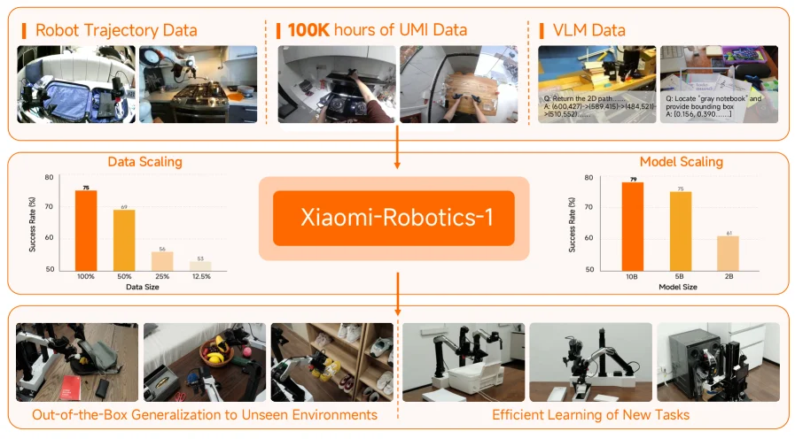

> Figure 1 : Overview. Xiaomi-Robotics-1 is pre-trained on over 100k hours of real-world UMI trajectories with auto-labeled state-transition language prompts. It is then aligned to robot embodiments and imperative instruction prompts via cross-embodiment post-training. Xiaomi-Robotics-1 scales effectively with data and model size. It is able to perform multiple tasks in unseen environment out-of-the-box and learn new tasks efficiently.

这张图是论文《Xiaomi-Robotics-1: Scaling Vision-Language-Action Models with over 100K Hours of Real-World Trajectories》中的Figure 1，标题为“Overview”，它清晰地展示了Xiaomi-Robotics-1模型的整体架构、训练流程、关键数据以及性能表现。

首先，我们来看图的最上方，这里展示了三种主要的数据源，它们是构建这个模型的基础：

1.  **Robot Trajectory Data (机器人轨迹数据)**：这部分数据通过图像展示，可能代表了机器人实际执行任务时记录的运动路径和环境交互信息。这些数据是模型学习如何进行物理操作的基础。
2.  **100K hours of UMI Data (10万小时的UMI数据)**：UMI设备可能是指某种特定的数据采集装置或平台。这部分数据量非常大，达到了10万小时，是模型预训练的主要数据来源。图像显示了人类或机器人在不同场景下进行操作的场景，比如操作物体、使用工具等。这些轨迹数据会被一个“可扩展的自动标注管道”处理，生成描述场景状态转换的自然语言提示，为动作学习提供丰富而精确的条件。
3.  **VLM Data (视觉-语言模型数据)**：这部分数据展示了带有语言指令和对应场景的图像对。例如，图像中可能包含“返回2D路径”或“定位‘灰色笔记本’并提供其边界框”这样的指令，以及相应的场景图像。这些数据用于将视觉信息与语言指令对齐，使模型能够理解人类的自然语言指令并执行相应的任务。

接下来，图的中间部分是核心模型“**Xiaomi-Robotics-1**”。这是一个基础的视觉-语言-动作（VLA）模型。数据从上方的三个来源流向这个核心模型，表明模型是通过整合这些多样化的数据进行训练的。

在核心模型的左侧，有一个“**Data Scaling (数据缩放)**”的分析图表。这个图表展示了模型在不同数据规模下的性能表现。横轴是“Data Size (数据大小)”，分别标有100%、50%、25%和12.5%。纵轴是“Success Rate (%) (成功率%)”。橙色柱状图显示，当数据量为100%时，成功率最高（约75%），随着数据量的减少，成功率也随之下降（50%时约69%，25%时约66%，12.5%时约53%）。这表明模型的性能与训练数据的规模呈正相关。

在核心模型的右侧，有一个“**Model Scaling (模型缩放)**”的分析图表。这个图表展示了模型在不同大小下的性能表现。横轴是“Model Size (模型大小)”，分别标有10B、5B和2B（可能指参数数量，单位为十亿）。纵轴同样是“Success Rate (%) (成功率%)”。橙色柱状图显示，当模型大小为10B时，成功率最高（约79%），随着模型大小的减小，成功率也随之下降（5B时约75%，2B时约61%）。这表明更大的模型通常具有更好的性能。

图的下方展示了两个主要的应用场景，这些场景展示了Xiaomi-Robotics-1模型的能力：

1.  **Out-of-the-Box Generalization to Unseen Environments (开箱即用地对未见环境进行泛化)**：这部分展示了机器人在不同的真实环境中执行任务的图像。例如，机器人在地板上操作物体、在杂乱的桌面上处理水果、在储物架上取物等。这表明模型经过训练后，能够在没有特定微调的情况下，在新的、未见过的环境中执行任务。
2.  **Efficient Learning of New Tasks (高效学习新任务)**：这部分展示了机器人在更结构化的环境中执行任务的图像，可能涉及更复杂的操作。例如，机器人在实验室环境中操作机械臂、在干净的环境中进行精确操作等。这表明模型能够利用其预训练的知识，通过少量的微调数据快速适应新的、具体的任务。

数据流动的顺序是：多种数据源（机器人轨迹数据、UMI数据、VLM数据）被用来训练核心模型Xiaomi-Robotics-1。通过数据缩放和模型缩放的分析，验证了模型在数据和模型大小增加时的有效性。最终，这个经过良好训练的模型能够实现对未见环境的泛化能力和对新任务的高效学习能力。

总结来说，这张图揭示了Xiaomi-Robotics-1方法的具体运作方式：
*   **数据收集与预训练**：首先，收集大量的真实世界机器人轨迹数据（10万小时的UMI数据），并通过自动标注管道生成自然语言描述的状态转换信息。同时，可能结合VLM数据。然后，使用这些数据对VLA模型进行预训练，使其获得广泛且可推广的动作生成能力。
*   **对齐与后训练**：在预训练之后，模型会进行后训练，以使其能力与特定的机器人实体以及对人类自然的命令式指令对齐。
*   **性能展示**：通过数据缩放和模型缩放实验，证明了模型在数据和模型大小增加时性能会提升。最终，模型展现出强大的开箱即用的泛化能力和高效学习新任务的能力。

图中的两个图表（数据缩放和模型缩放）定量地展示了模型的缩放行为：数据量越大，模型性能越好；模型越大，性能也越好。并且这种缩放行为在后训练阶段也得到了体现，即预训练更强的模型在未见环境中的表现更好。

---

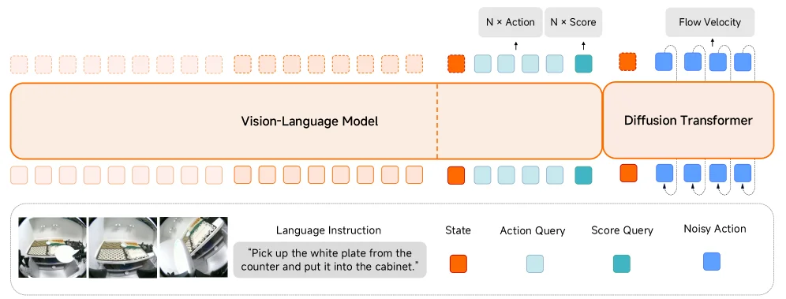

> Figure 2 : Model Architecture. Xiaomi-Robotics-1 adopts a Mixture-of-Transformers [ 44 ] architecture that couples a pre-trained VLM with a DiT. The VLM encodes the observation and language instruction, and additionally predicts action chunks via Choice Policies [ 59 ] to accelerate training convergence. Conditioned on the robot state and the VLM’s KV cache of the observation and language tokens, the DiT generates the action chunk via flow matching. Note that the action-related tokens from the VLM are excluded from the DiT’s attention computation.

这张图展示了Xiaomi - Robotics - 1模型的架构，我们可以从下往上、从左往右来理解信息的流动和各个组件的作用：

首先看最下方的输入部分：
- 左侧是**视觉输入**，这里展示了机器人的摄像头拍摄的图像（比如厨房场景中的操作画面），这些图像提供了机器人所处环境的视觉信息。
- 中间是**语言指令（Language Instruction）**，例如图中的“Pick up the white plate from the counter and put it into the cabinet.”，这是人类给机器人的任务指令，告诉机器人需要执行的操作。
- 然后是几个与动作相关的查询和噪声输入：
  - **State（状态）**：用橙色方块表示，应该是机器人的当前状态信息，比如机器人的位置、姿态、是否持有物体等状态参数。
  - **Action Query（动作查询）**：用浅蓝色方块表示，这是对动作的查询请求，用于询问模型应该执行什么动作。
  - **Score Query（分数查询）**：用青绿色方块表示，可能是用于评估动作的分数或者质量的查询。
  - **Noisy Action（带噪声的动作）**：用蓝色方块表示，这是扩散模型（DiT）处理时的输入，通常是带有噪声的动作序列，用于通过流匹配（flow matching）生成更准确的动作。

接下来是中间的两个主要模型组件：

1. **Vision - Language Model（视觉 - 语言模型，VLM）**：
   - 它的输入包括最下方的视觉图像和语言指令。VLM的作用是编码这些视觉和语言信息，并且还会通过Choice Policies来预测动作块（action chunks），这样可以加速训练的收敛。
   - 从图中可以看到，VLM的输出部分（上方的虚线框内）包含了与状态、动作查询、分数查询相关的输出（橙色、浅蓝色、青绿色方块），这些输出会被传递给下一个组件（Diffusion Transformer）。同时，VLM还会输出N个动作（N×Action）和N个分数（N×Score），这可能是对不同动作候选的预测和评分。

2. **Diffusion Transformer（扩散变换器，DiT）**：
   - 它的条件输入包括机器人的状态（State）、VLM对观察和语言标记的KV缓存（Key - Value cache）。这意味着DiT在生成动作时，会利用VLM已经处理过的视觉和语言信息，以及机器人的当前状态。
   - 它的输入还包括带噪声的动作（Noisy Action），然后通过流匹配（flow matching）来生成动作块。图中显示DiT的输出是Flow Velocity（流速度），这可能用于更新动作序列，使其更接近真实需要的动作。另外，需要注意的是，VLM中与动作相关的标记会被排除在DiT的注意力计算之外，这样可以避免信息的冗余或干扰。

信息流动的顺序总结：
- 视觉图像和语言指令首先输入到Vision - Language Model中，VLM编码这些信息并预测动作块、动作和分数等。
- 然后，状态、VLM的KV缓存和带噪声的动作被输入到Diffusion Transformer中，DiT通过流匹配生成动作块（以流速度的形式体现），从而完成从视觉 - 语言指令到动作生成的整个过程。

这张图揭示的方法运作方式：
- 首先，模型通过视觉 - 语言模型（VLM）处理视觉和语言信息，利用Choice Policies加速动作块的预测，同时输出动作和分数的候选。
- 然后，扩散变换器（DiT）在VLM处理的基础上，结合机器人的状态和带噪声的动作，通过流匹配生成更准确的动作。这种方法将视觉 - 语言理解和动作生成结合起来，使得机器人能够根据语言指令和视觉环境执行任务。
- 另外，VLM中与动作相关的标记被排除在DiT的注意力计算之外，这是一种优化，避免了不必要的注意力计算，提高了效率。

整体来看，这个架构结合了视觉 - 语言模型的理解能力和扩散模型的动作生成能力，使得机器人能够在未见过的环境中根据自然语言指令执行移动操作任务，并且能够高效地适应新的下游任务。

---

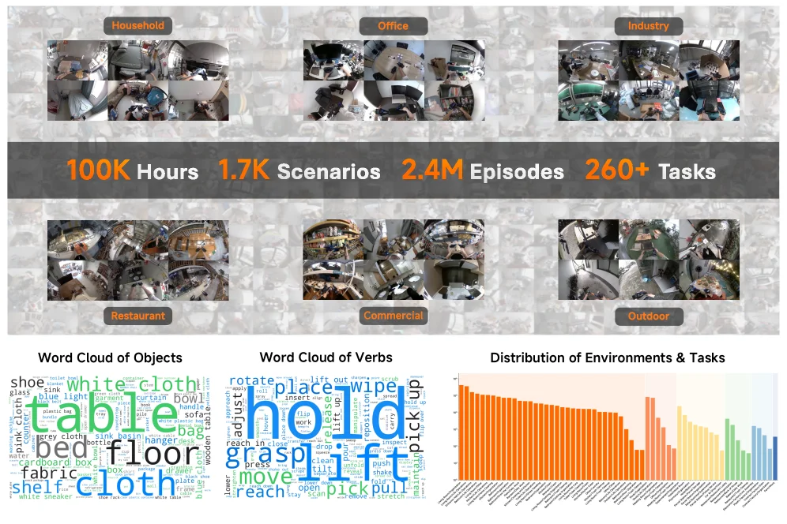

> Figure 3 : Pre-training Dataset. The pre-training dataset of Xiaomi-Robotics-1 contains over 100k hours of real-world manipulation trajectories collected with UMI devices.

这张图展示了小米机器人1号（Xiaomi-Robotics-1）的预训练数据集，该数据集包含了超过10万小时的真实世界操作轨迹，这些轨迹是通过UMI设备收集的。

图的上半部分通过六个小图块展示了数据收集的不同环境场景。从左到右，从上到下依次是：家庭（Household）、办公室（Office）、工业（Industry）、餐厅（Restaurant）、商业（Commercial）和户外（Outdoor）。每个图块内包含多个鱼眼镜头拍摄的视角，展示了机器人可能遇到的各种真实环境。这些环境图片直观地表明了数据集的多样性和广泛性，覆盖了日常生活和工作的多个方面。

在这些环境图片下方，有一条深灰色的信息栏，用醒目的橙色字体标注了数据集的关键统计数据：100K小时（总时长）、1.7K个场景（Scenarios）、2.4M个片段（Episodes）和260+个任务（Tasks）。这些数字量化了数据集的规模，强调了其用于训练大规模视觉-语言-动作（VLA）模型的潜力。

图的中间部分展示了两个词云图，分别代表“物体词云”（Word Cloud of Objects）和“动词词云”（Word Cloud of Verbs）。物体词云中，较大的单词如“table”（桌子）、“cloth”（布）、“floor”（地板）、“bed”（床）等，表明这些是在数据集中频繁出现的物体。动词词云中，较大的单词如“hold”（握住）、“lift”（举起）、“grasp”（抓取）、“move”（移动）、“pick”（拾取）等，揭示了数据集中常见的动作类型。这些词云图提供了对数据集中语义内容的洞察，说明了模型学习到的动作和与之相关的物体。

图的右下角是一个条形图，标题为“环境与任务分布”（Distribution of Environments & Tasks）。这个图表展示了不同环境或任务类别的数据分布情况。虽然具体的类别标签不清晰，但条形的长度代表了每个类别的数据量。从图中可以看出，数据分布可能不是均匀的，某些类别可能包含更多的数据。这个图表有助于理解数据集在不同类别间的平衡情况。

整体来看，这张图通过视觉化的方式展示了小米机器人1号预训练数据集的规模、多样性、内容以及数据分布。它揭示了该方法的具体运作方式：首先，通过UMI设备在多种真实环境中收集大量的操作轨迹；然后，对这些轨迹进行自动标注，提取出与场景状态转换相关的自然语言描述，作为动作学习的条件；最后，利用这些丰富的数据训练一个具有广泛泛化能力的VLA模型。这种方法的核心在于利用大规模的真实世界数据来赋予模型强大的动作生成能力，并为后续的微调和对人类指令的对齐打下基础。

---

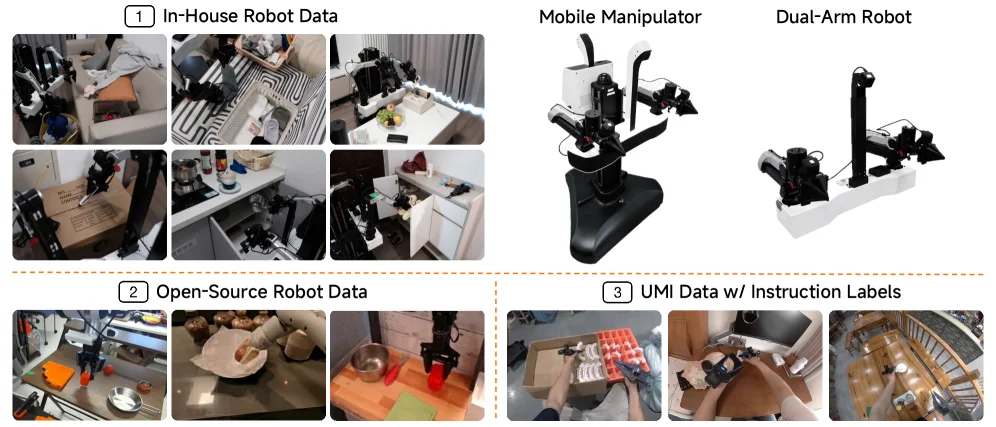

> Figure 4 : Post-training Dataset. The post-training dataset of Xiaomi-Robotics-1 comprises about 10k hours of cross-embodiment trajectories, including over 7.2k hours of in-house robot data collected with mobile manipulators and dual-arm robots, over 1k hours of instruction-labeled UMI data, and open-source robot datasets.

这张图展示了Xiaomi - Robotics - 1模型后训练阶段的数据集组成，我们可以从三个主要板块来理解其内容和数据的组织逻辑：

首先看板块1“ In - House Robot Data（自有机器人数据）”，这里包含了多个场景下的机器人操作图像，比如在客厅、厨房等环境中，移动操作臂（Mobile Manipulator）和双臂机器人（Dual - Arm Robot）执行任务的画面。这些数据是通过自有机器人收集的，时长超过7.2千小时，主要用于提供真实世界中机器人在不同环境下的操作轨迹，让模型学习到多样化的机器人操作行为。

然后是板块2“ Open - Source Robot Data（开源机器人数据）”，展示的是一些开源的机器人操作场景图像，例如在实验室环境中操作工具、处理物品等。这部分数据时长约1千小时，作用是补充更多样化的机器人操作场景，尤其是那些可能在自有数据集中未覆盖到的操作类型，进一步丰富模型的训练数据多样性。

接下来是板块3“ UMI Data w/ Instruction Labels（带指令标签的UMI数据）”，这里的图像展示了人类操作或机器人在特定场景下的操作，同时带有指令标签。这些数据时长约1.1千小时（因为总后训练数据约1万小时，7.2千+1千+1.1千≈1万），其关键作用是通过自动标注管道为轨迹片段添加描述场景状态转换的自然语言指令，为动作学习提供丰富且精确的条件，帮助模型理解人类如何用自然语言提示机器人执行任务，从而更好地对齐模型的能力与人类的指令需求。

从数据的流动和作用来看，后训练阶段的目标是对齐模型的能力与机器人实体以及人类自然使用的指令。自有机器人数据提供了真实世界中机器人的操作轨迹，开源数据补充了更多样的操作场景，而带指令标签的UMI数据则提供了自然语言指令与场景状态转换的关联，让模型学习到如何根据自然语言指令执行任务。这三个部分的数据共同构成了约1万小时的多实体轨迹数据集，用于后训练，使模型在预训练获得广泛通用动作生成能力的基础上，进一步增强对人类指令的响应能力和在不同机器人实体上的适应能力，最终提升模型在未见过的环境中的开箱即用性能以及对复杂灵巧任务的高效微调能力。

简单来说，这张图通过展示三种不同类型的数据集（自有机器人数据、开源机器人数据、带指令标签的UMI数据），说明了Xiaomi - Robotics - 1模型后训练阶段是如何利用这些数据来增强模型的指令遵循能力和任务适应能力的：自有数据提供真实机器人操作轨迹，开源数据丰富场景多样性，UMI数据提供指令与状态转换的关联，三者结合用于后训练，使模型能更好地响应人类指令并在不同环境中执行任务。

---

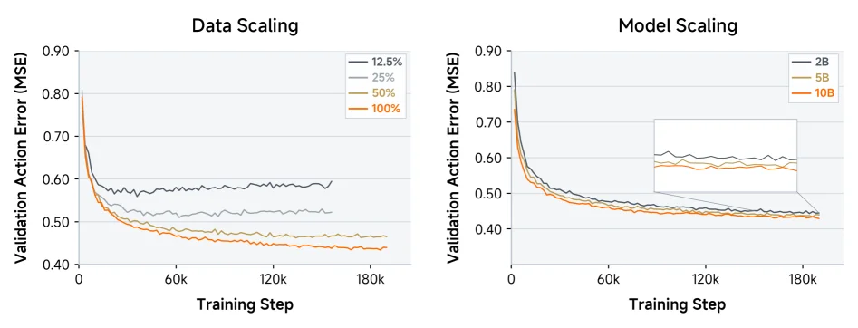

> Figure 5 : Scaling of Pre-training. We show the validation action errors (MSE) from the data-scaling and model-scaling pre-training experiments. We terminate the training for 12.5% and 25% data in the data-scaling experiment early as the validation loss indicates overfitting.

这张图（图5）展示了预训练阶段的**缩放行为**，分为左右两个子图，分别对应“数据缩放”和“模型缩放”实验，核心是展示**验证动作误差（均方误差MSE）**随**训练步数（Training Step）**的变化，以说明数据量或模型大小对预训练效果的影响。

### 左图：数据缩放（Data Scaling）
- **横轴（Training Step）**：训练的步数，从0到180k，代表训练的进度。
- **纵轴（Validation Action Error (MSE)）**：验证集上的动作预测误差，值越低表示模型对动作的预测越准确。
- **曲线与图例**：四条曲线分别对应不同的**数据比例**（12.5%、25%、50%、100%），即使用不同规模的数据集进行预训练：
  - 12.5%和25%数据的曲线（灰色系）：根据caption，这两个数据量的实验被**提前终止**（因为验证损失显示过拟合）。可以看到它们的误差在训练后期（约60k步后）高于50%和100%数据的曲线，且波动较大。
  - 50%和100%数据的曲线（黄色、橙色）：随着训练步数增加，误差持续下降并趋于稳定，且100%数据的曲线（橙色）最终误差最低，50%次之。这说明**更多的训练数据能带来更低的验证误差**，模型从更大规模的数据中学习到更泛化的动作生成能力。

### 右图：模型缩放（Model Scaling）
- **横轴（Training Step）**：同样表示训练步数，范围与左图一致。
- **纵轴（Validation Action Error (MSE)）**：同左图，衡量动作预测的准确性。
- **曲线与图例**：三条曲线对应不同的**模型大小**（2B、5B、10B参数，B代表十亿）：
  - 2B模型的曲线（黑色）：误差下降速度相对较慢，最终误差最高。
  - 5B模型的曲线（灰色）：误差下降速度和最终误差介于2B和10B之间。
  - 10B模型的曲线（橙色）：误差下降最快，最终误差最低。右上角的放大图（inset）更清晰地展示了后期（约120k步后）的误差差异，10B模型的误差明显低于5B和2B模型。这说明**更大的模型能带来更低的验证误差**，模型规模的增加提升了预训练的效果。

### 方法运作的逻辑（从图中推导）
预训练阶段的目标是通过大量数据训练模型，使其获得**通用的动作生成能力**（为后续的机器人任务适配和微调做准备）。图中的两个实验分别验证了“数据缩放”和“模型缩放”的效果：
- **数据缩放**：增加训练数据量（从12.5%到100%），模型在验证集上的动作误差降低，说明更多的真实世界轨迹数据能帮助模型学习到更泛化的动作模式（避免过拟合，提升泛化能力）。
- **模型缩放**：增加模型参数（从2B到10B），模型的动作误差降低，说明更大的模型容量能容纳更复杂的动作生成逻辑，提升预训练的效果。

### 结论（从图中得出）
- 数据缩放实验：**更多的训练数据（100% > 50% > 25% > 12.5%）能显著降低验证动作误差**，且提前终止的小数据量实验（12.5%、25%）因过拟合导致后期误差更高。
- 模型缩放实验：**更大的模型（10B > 5B > 2B）能显著降低验证动作误差**，模型规模的增加提升了预训练的效果。
- 整体来看，预训练阶段的**数据量和模型大小的增加都能提升模型的动作生成能力**（表现为验证误差降低），这为后续的机器人任务适配（post-training）提供了更强的基础模型。

---

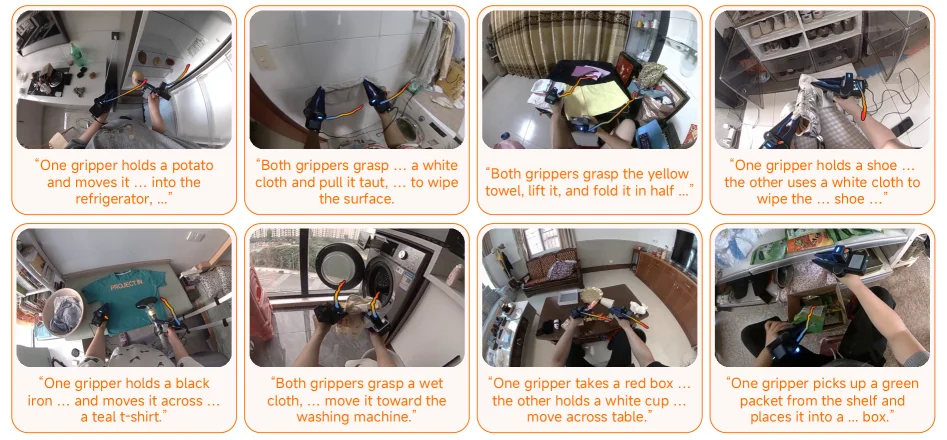

> Figure 6 : Qualitative Results of Pre-training. After pre-training, Xiaomi-Robotics-1 is able to predict action trajectories for UMI grippers on a held-out validation set according to the language description of state transitions.

这张图（图6）展示了小米机器人1号（Xiaomi-Robotics-1）模型在预训练阶段后的定性结果。它通过一系列的图像和对应的文字描述，直观地呈现了模型根据语言指令执行操作的能力。

首先，我们来看这张图的整体结构。它由八个独立的面板组成，排列成两行四列。每个面板都包含一个机器人操作的场景图像和一段描述该操作的文字。这些面板共同构成了一个验证集上的示例集合，用于展示模型在未见过的新环境中的表现。

每个面板的组成部分如下：
1.  **图像部分**：位于每个面板的上半部分，显示了一个机器人（具体来说是UMI夹具）正在执行某项任务的场景。这些场景都是真实世界的环境，例如厨房、洗衣房、客厅等。图像捕捉了操作过程中的一个瞬间，展示了夹具与物体的互动。
2.  **文字描述部分**：位于每个面板的下半部分，用引号括起来。这段文字是对图像中所示操作的描述，通常是一个语言指令或对状态转换的描述。例如，“一个夹具拿着土豆并将其移入冰箱...”或者“两个夹具抓住一块白布并拉紧...以擦拭表面。”

这些面板按照一定的顺序排列，但更重要的是它们共同揭示了模型的核心能力：
*   **语言理解与动作执行**：每个面板都展示了一个从语言指令到具体动作的映射。模型接收自然语言描述的任务（如“擦拭表面”或“将黄色毛巾对折”），然后生成相应的机器人动作轨迹，使夹具能够完成该任务。
*   **多样性任务处理**：图中展示了多种不同类型的任务，包括物体搬运（如拿鞋子、铁盒）、表面清洁（如擦表面）、物体折叠（如折毛巾）、物品整理（如移动杯子、放置包裹）等。这表明模型能够处理多样化的移动操作任务。
*   **未见环境适应性**：这些场景都是在“held-out validation set”（保留的验证集）上进行的，意味着这些环境是模型在预训练阶段没有见过的。模型能够根据新的语言指令在这些新环境中正确执行动作，证明了其强大的泛化能力。
*   **状态转换描述**：文字描述不仅包含了要执行的动作，还隐含了场景的状态转换。例如，“将黄色毛巾对折”描述了毛巾从展开状态变为对折状态的变化。这与论文中提到的“auto-labeling pipeline that annotates trajectory clips with natural languages describing scene state transitions”相吻合，即模型学习了如何根据状态转换的描述来生成动作。

这张图揭示了方法的具体运作方式：
1.  **预训练阶段**：模型在超过10万小时的真实世界操作轨迹数据上进行预训练。这些数据通过UMI设备收集，并使用可扩展的自动标注管道为轨迹片段标注描述状态转换的自然语言。这个过程赋予了模型广泛的、可泛化的动作生成能力。
2.  **验证阶段（此图展示的内容）**：在预训练之后，模型被要求根据新的语言描述（即状态转换的描述）预测UMI夹具的动作轨迹。这些预测在“held-out validation set”上进行评估，该集合包含模型未见过的环境和任务。
3.  **结果展示**：图中的每个面板都是一个成功案例，展示了模型如何将语言指令转化为具体的机器人动作。例如，当指令是“两个夹具抓住黄色毛巾并将其对折”时，图像显示了夹具确实执行了这个对折动作。

结论是，这张图通过具体的示例证明了小米机器人1号在预训练后具备以下能力：
*   能够理解自然语言指令。
*   能够根据语言指令生成正确的机器人动作轨迹。
*   能够在未见过的环境中泛化这些能力。
*   能够处理各种不同类型的移动操作任务。

这些定性结果表明，模型的预训练是成功的，为后续的微调以及在真实世界中的部署奠定了坚实的基础。

---

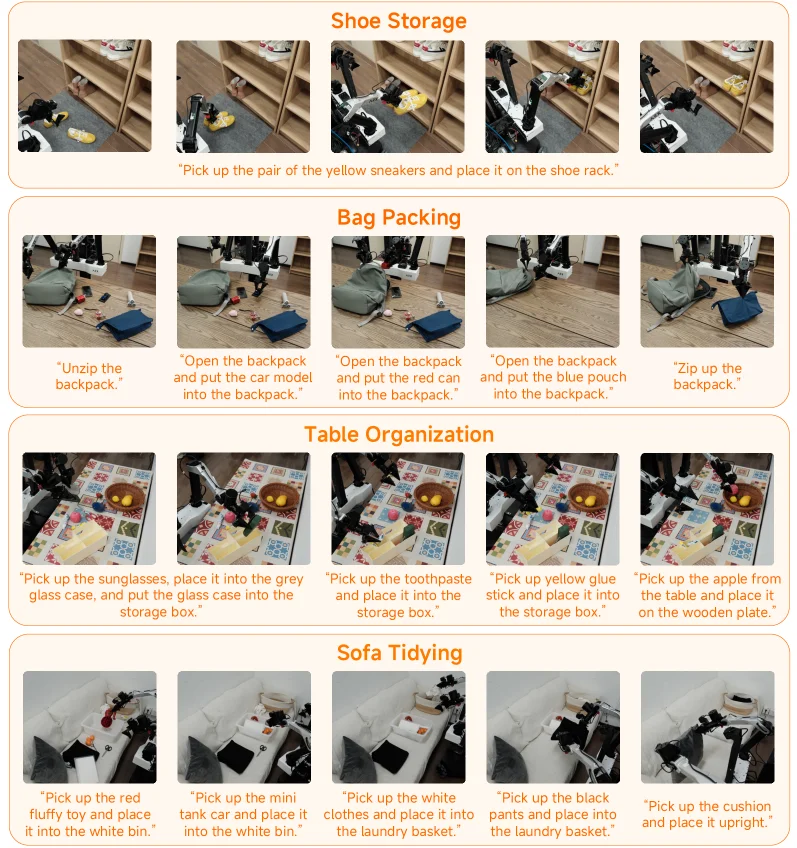

> Figure 7 : Post-training Evaluation. We evaluate the post-trained model out-of-the-box across four tasks in novel environments. Crucially, both the environments and object instances are unseen during training.

这张图属于论文《Xiaomi - Robotics - 1: Scaling Vision - Language - Action Models with over 100K Hours of Real - World Trajectories》的“Figure 7 : Post - training Evaluation”部分，用于展示模型在训练后（post - training）的评估情况。

### 各个板块（任务）的组成与信息流动
图被划分为四个主要任务板块，分别是**Shoe Storage（鞋子收纳）**、**Bag Packing（背包打包）**、**Table Organization（桌面整理）**和**Sofa Tidying（沙发整理）**。每个任务板块的结构相似：
- **图像序列**：每个任务下有一组（通常5张）连续的图像，这些图像按时间顺序排列，展示了机器人执行任务的步骤。例如，在“Shoe Storage”中，从左到右的图像依次呈现机器人从初始状态（可能是在地面附近，周围有黄色运动鞋）到逐步将黄色运动鞋放置到鞋架上的过程。
- **文字指令**：每个图像下方（或对应位置）有一段自然语言指令，描述了该步骤中机器人需要执行的操作。这些指令是模型需要理解和执行的“人类提示”，例如“Shoe Storage”中的指令“Pick up the pair of the yellow sneakers and place it on the shoe rack.”（拿起那双黄色运动鞋并将其放在鞋架上），后续图像的指令则是该任务的分解步骤（不过在这个任务中，可能主要指令是最终的放置，而图像序列展示了执行过程）。

### 方法运作的揭示（从图中理解方法如何工作）
这张图展示了**训练后模型的“开箱即用”（out - of - the - box）评估**：
- **环境与对象的未知性**：根据caption，这些任务的环境（如房间的布局、家具的位置）和对象实例（如特定的黄色运动鞋、特定的背包）在训练期间是“unseen（未被见过）”的。这意味着模型在训练时没有接触过这些具体的场景和对象，但仍然需要执行任务。
- **任务执行流程**：对于每个任务，模型需要理解自然语言指令（如图中的文字），然后在未见过的环境中识别相关对象（如黄色运动鞋、背包、太阳镜等），并执行一系列动作（如拿起、放置、打包、整理等），这些动作通过图像序列可视化出来。例如，在“Bag Packing”任务中，指令依次是“Unzip the backpack.”（拉开背包拉链）、“Open the backpack and put the car model into the backpack.”（打开背包并将汽车模型放入背包）等，图像序列展示了机器人按照这些指令逐步操作的过程，从拉开背包到放入不同物品，最后拉上拉链。
- **方法的验证目标**：这张图用于验证论文中提出的VLA（Vision - Language - Action）模型在**训练后**的能力：(1) 能够遵循多样的语言指令，在未见过的环境中执行广泛的移动操作任务；(2) 能够用最少的微调数据高效适应新的下游任务。通过展示模型在四个未见过的任务（环境和对象都未见过的任务）中的执行过程，证明了模型的泛化能力和对人类指令的响应能力。

### 结果相关的结论（从图中可推断的结论）
从图中可以推断出：
- **模型的泛化能力**：模型能够在未见过的环境（如不同的房间布局、不同的家具）和未见过的对象实例（如特定的鞋子、背包、桌面物品）上执行任务，说明模型具有良好的泛化能力，这得益于训练阶段的大量真实世界操作轨迹（超过10万小时）和自动标注管道（为轨迹片段标注描述场景状态转换的自然语言，为动作学习提供丰富精确的条件）。
- **指令遵循能力**：模型能够理解自然语言指令（如图中的文字指令）并执行相应的动作，图像序列展示了动作的执行过程，说明模型能够将语言指令映射到实际的机器人操作中，验证了模型在“后训练”阶段对人类指令的对齐能力（align these capabilities with robot embodiments and imperative instructions that humans naturally use to prompt robots）。
- **任务的多样性**：四个任务（鞋子收纳、背包打包、桌面整理、沙发整理）涵盖了不同的操作类型（拿起、放置、打包、整理）和不同的场景（鞋架、背包、桌面、沙发），说明模型能够处理多种类型的移动操作任务，进一步验证了模型的通用性和扩展性。

总结来说，这张图通过展示模型在四个未见过的任务（环境和对象都未见过的任务）中的执行过程，直观地验证了Xiaomi - Robotics - 1模型在训练后的“开箱即用”能力，即能够在未见过的环境中遵循人类指令执行多种移动操作任务，展示了模型的泛化能力、指令遵循能力和对多样化任务的处理能力。

---

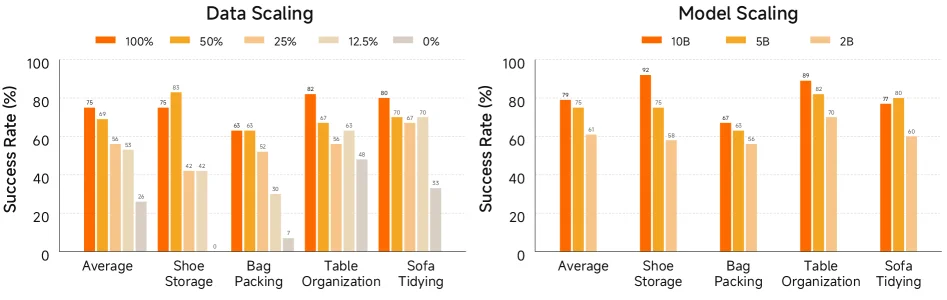

> Figure 8 : Quantitative Results of Post-training. We showcase the success rates of post-trained models across different pre-training data scales and model sizes.

这张图（图8）展示了**后训练阶段**的定量结果，核心是呈现“不同预训练数据规模”和“不同模型大小”对模型性能的影响。我们可以将图分为左右两个子图，分别对应“数据缩放（Data Scaling）”和“模型缩放（Model Scaling）”，来逐步解析：

### 左侧：数据缩放（Data Scaling）子图
- **横轴（X轴）**：代表不同的任务类型，包括Average（平均）、Shoe Storage（鞋子收纳）、Bag Packing（打包行李）、Table Organization（桌面整理）、Sofa Tidying（沙发整理）。这些任务是评估模型后训练性能的具体场景。
- **纵轴（Y轴）**：代表“成功速率（Success Rate）”，以百分比（%）为单位，衡量模型在对应任务中成功完成指令的比例。
- **颜色/图例**：不同颜色的柱形代表**预训练数据的规模**，图例中：
  - 橙色（100%）：使用完整的预训练数据集；
  - 浅橙色（50%）：使用50%的预训练数据；
  - 更浅的橙色（25%）：使用25%的预训练数据；
  - 米色（12.5%）：使用12.5%的预训练数据；
  - 灰色（0%）：几乎无预训练数据（或基准线）。
- **数据流动与逻辑**：每个任务下，不同颜色的柱形展示了“随着预训练数据规模减少，模型成功速率的变化”。例如，在“Shoe Storage”任务中，100%数据规模的柱形（橙色）高度最高（约83%），而0%数据规模的柱形（灰色）高度最低（接近0%）。这表明**预训练数据规模越大，模型在该任务的后训练性能越好**。

### 右侧：模型缩放（Model Scaling）子图
- **横轴（X轴）**：同样代表不同的任务类型（与左侧一致：Average、Shoe Storage、Bag Packing、Table Organization、Sofa Tidying）。
- **纵轴（Y轴）**：同样是“成功速率（Success Rate）”，单位为百分比（%）。
- **颜色/图例**：不同颜色的柱形代表**模型的大小（参数量）**，图例中：
  - 橙色（10B）：模型参数量为100亿（10B）；
  - 浅橙色（5B）：模型参数量为50亿（5B）；
  - 更浅的橙色（2B）：模型参数量为20亿（2B）。
- **数据流动与逻辑**：每个任务下，不同颜色的柱形展示了“随着模型参数量增加，模型成功速率的变化”。例如，在“Shoe Storage”任务中，10B参数量的柱形（橙色）高度最高（约92%），而2B参数量的柱形（浅橙色）高度较低（约64%）。这表明**模型参数量越大（模型越大），其在后训练任务中的成功速率越高**。

### 整体结论（结合两个子图）
这张图揭示了**“数据规模”和“模型大小”对后训练性能的正向影响**：
1. **数据缩放的影响**：对于每个任务，预训练数据规模越大（从0%到100%），模型的成功速率越高。这说明预训练时使用更多的真实世界操作轨迹数据，能显著提升模型后训练的性能（即模型在未见过的环境中执行任务的能力）。
2. **模型缩放的影响**：对于每个任务，模型参数量越大（从2B到10B），模型的成功速率越高。这说明更大的模型（更多的参数）在后训练阶段能更好地利用预训练学到的能力，从而在任务中表现更优。
3. **任务的普遍性**：这种“数据/模型缩放提升性能”的趋势在所有评估的任务（如鞋子收纳、打包行李等）中都存在，说明该方法具有良好的通用性——无论任务类型如何，增加数据规模或模型大小都能带来性能提升。

简言之，这张图通过对比不同数据规模和模型大小下的任务成功速率，直观地展示了“数据越多、模型越大，后训练的机器人视觉-语言-动作模型性能越好”的核心结论，验证了论文中提出的“缩放行为（scaling behavior）”：预训练时的数据/模型缩放会直接转移到后训练的机器人任务性能中。

---

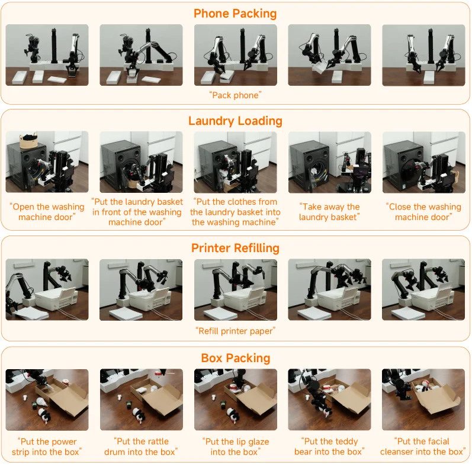

> Figure 9 : Downstream Fine-tuning Evaluation. We fine-tune the post-trained model on four new challenging tasks with a minimal amount of data.

这张图（图9）展示了**下游微调评估**的过程，核心是验证预训练后的模型在仅用少量数据微调后，能否快速适应四个全新的具有挑战性的任务。

图的结构清晰地分为四个主要部分（行），每个部分对应一个具体的任务，从左到右展示了任务执行的步骤顺序：

1.  **任务一：Phone Packing（手机打包）**
    *   这一行包含五个图像帧，展示了机器人执行“Pack phone”（打包手机）任务的连续动作。
    *   图像从左到右依次呈现了机器人操作的不同阶段，可能包括拿起手机、放置到包装材料中、然后完成打包的动作。
    *   底部的文字“Pack phone”是对这个任务的简要说明。

2.  **任务二：Laundry Loading（洗衣物装载）**
    *   这一行同样包含五个图像帧，展示了机器人执行一系列与装载洗衣物相关的指令。
    *   每个图像帧下方都有对应的自然语言指令，按顺序是：“Open the washing machine door”（打开洗衣机门）、“Put the laundry basket in front of the washing machine door”（将洗衣篮放在洗衣机门前）、“Put the clothes from the laundry basket into the washing machine”（将衣物从洗衣篮放入洗衣机）、“Take away the laundry basket”（拿走洗衣篮）、“Close the washing machine door”（关闭洗衣机门）。
    *   这些图像和指令共同展示了一个多步骤任务的执行流程，说明了模型能够理解和执行由多个子任务组成的复杂指令。

3.  **任务三：Printer Refilling（打印机加纸）**
    *   这一行包含五个图像帧，展示了机器人执行“Refill printer paper”（给打印机加纸）的任务。
    *   图像序列显示了机器人如何与打印机互动，可能包括拿起纸盒、打开打印机、放入纸张、然后关闭打印机的过程。
    *   底部的文字“Refill printer paper”是对这个任务的说明。

4.  **任务四：Box Packing（盒子打包）**
    *   这一行包含五个图像帧，展示了机器人执行一系列将不同物品放入盒子中的指令。
    *   每个图像帧下方都有对应的自然语言指令，按顺序是：“Put the power strip into the box”（将电源插排放入盒子）、“Put the rattle drum into the box”（将摇铃鼓放入盒子）、“Put the lip glaze into the box”（将唇釉放入盒子）、“Put the teddy bear into the box”（将泰迪熊放入盒子）、“Put the facial cleanser into the box”（将洁面乳放入盒子）。
    *   这些图像和指令展示了模型在处理多样化物体和多步骤指令时的能力。

**方法运作的揭示：**
这张图揭示了该研究方法（Xiaomi-Robotics-1）的下游应用方式：
*   **预训练阶段**：模型首先通过超过10万小时的真实世界操作轨迹进行预训练，获得了广泛且可推广的动作生成能力。
*   **后训练/微调阶段**：预训练后的模型被用于执行新的、未见过的任务。在这个评估中，模型仅在少量数据上进行微调，就能适应这四个全新的任务（手机打包、洗衣物装载、打印机加纸、盒子打包）。
*   **任务执行**：每个任务都通过一系列图像帧展示了模型的实际操作过程，表明模型能够理解自然语言指令，并将其转化为具体的机器人动作序列。
*   **结论暗示**：通过展示这些成功的任务执行案例，图中暗示了该方法的有效性——即预训练模型具有良好的泛化能力，并且可以通过少量微调数据快速适应新的下游任务，这验证了论文摘要中提到的“strong scaling behavior”和“efficiently adapting to novel downstream tasks with minimal fine-tuning data”的特点。

总而言之，这张图通过四个具体的任务示例，直观地展示了Xiaomi-Robotics-1模型在下游微调后的实际操作能力和任务适应性。它表明，即使面对新的、具有挑战性的任务，该模型也能在少量数据的支持下，准确地执行复杂的操作序列。

---

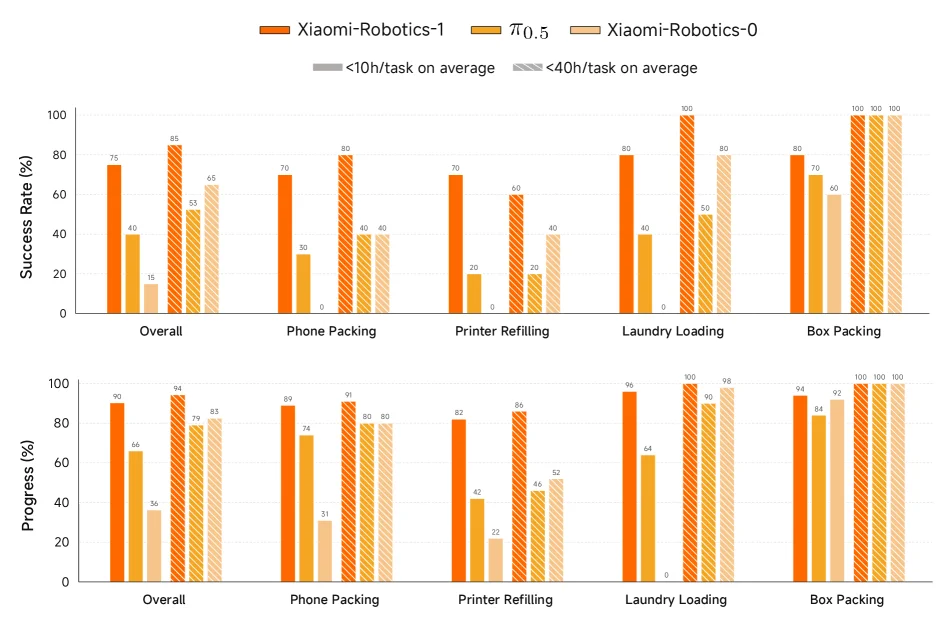

> Figure 10 : Quantitative Results of Downstream Fine-tuning. We report the success rates and progresses of different models across the four different tasks.

这张图（图10）展示了不同模型在下游微调任务中的定量结果，具体包括成功率和进度两个关键指标。我们可以从以下几个方面来详细解读这张图：

首先，图的**整体结构**分为上下两个子图。上半部分是“Success Rate (%)”（成功率，百分比），下半部分是“Progress (%)”（进度，百分比）。这两个子图都使用了相同的x轴（任务类型）和不同的y轴（成功率或进度），并且都采用了柱状图的形式来展示数据。

**x轴（横轴）**代表了不同的下游任务，从左到右依次是：
1.  **Overall**（总体）：可能表示所有任务的平均表现或一个综合任务。
2.  **Phone Packing**（手机包装）：一个具体的移动操作任务。
3.  **Printer Refilling**（打印机加墨）：另一个具体的移动操作任务。
4.  **Laundry Loading**（装载衣物）：一个具体的移动操作任务。
5.  **Box Packing**（箱子包装）：一个具体的移动操作任务。
这些任务是评估模型性能的具体场景。

**y轴（纵轴）**：
*   上半部分的y轴表示“Success Rate (%)”，即任务成功的比例，范围从0%到100%。
*   下半部分的y轴表示“Progress (%)”，即任务完成的进度比例，范围同样从0%到100%。

**图例（Legend）**解释了不同颜色和图案的柱状图代表的含义：
*   **橙色实心柱**：代表模型“Xiaomi-Robotics-1”。
*   **黄色实心柱**：代表模型“π₀.₅”（Pi_0.5）。
*   **浅橙色实心柱**：代表模型“Xiaomi-Robotics-0”。
*   **橙色斜线填充柱**：代表“<10h/task on average”（平均每个任务训练时间少于10小时）的情况，这可能是指微调阶段的数据量或训练时长。
*   **灰色斜线填充柱**：代表“<40h/task on average”（平均每个任务训练时间少于40小时）的情况，同样可能指微调阶段的数据量或训练时长。

**数据解读与方法揭示**：
这张图揭示了所提出的方法（特别是Xiaomi-Robotics-1模型）在不同下游任务上的性能表现。通过对比不同模型的柱状图高度，我们可以得出以下结论：

1.  **模型性能对比**：
    *   在大多数任务中，“Xiaomi-Robotics-1”（橙色柱）的成功率和进度都高于其他两个模型（“π₀.₅”和“Xiaomi-Robotics-0”）。例如，在“Overall”的成功率中，Xiaomi-Robotics-1约为75%，而π₀.₅约为40%，Xiaomi-Robotics-0约为15%。在“Box Packing”的成功率中，Xiaomi-Robotics-1达到了100%。
    *   这表明“Xiaomi-Robotics-1”作为一个基础VLA模型，在下游微调任务中表现更优，验证了其在预训练阶段通过大量真实世界轨迹学习到的通用性和可迁移性。

2.  **微调数据量的影响**：
    *   对于某些任务，如图例所示的“<10h/task on average”和“<40h/task on average”，柱状图的高度通常低于主要模型（如Xiaomi-Robotics-1）的柱状图。这可能意味着，尽管模型本身能力强，但微调阶段的数据量或训练时长对最终性能也有影响。然而，由于图中没有明确说明这些斜线柱具体对应哪个模型的微调结果，这需要结合论文的其他部分来理解。但可以推测，这些可能代表了使用较少微调数据的场景，或者是不同微调策略的结果。

3.  **任务特异性**：
    *   不同任务对模型的挑战不同。例如，“Laundry Loading”任务中，所有模型的成功率普遍较低，尤其是在“<10h/task on average”的情况下，成功率接近0%。这表明某些任务可能更难学习或需要更特定的微调。

**结论**：
这张图通过比较不同模型在多个下游任务上的成功率和进度，清晰地展示了“Xiaomi-Robotics-1”模型在微调阶段的优越性能。这支持了论文摘要中的观点，即该模型能够有效地适应新的下游任务，并且在预训练阶段获得的能力可以直接转移到实际机器人操作中。图中的数据表明，数据规模（无论是预训练还是微调阶段）和模型设计对于实现高性能的视觉-语言-动作模型至关重要。

总而言之，这张图通过直观的柱状图形式，量化了不同模型在特定任务上的表现，从而验证了所提出的VLA模型（特别是Xiaomi-Robotics-1）的有效性和优越性。

---

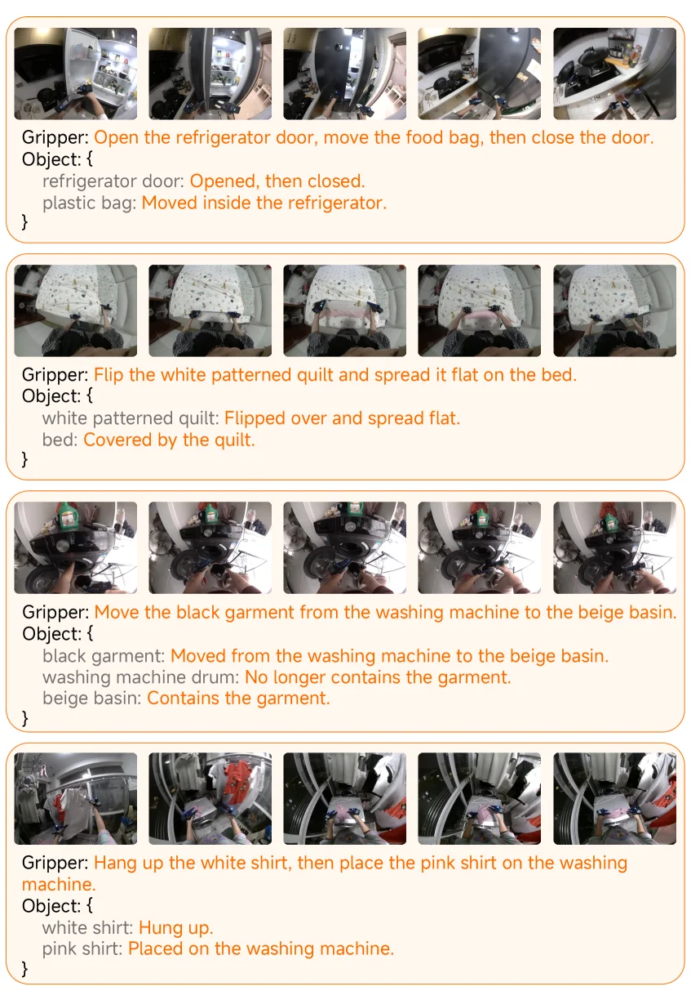

> Figure 11 : Examples of UMI data in the Pre-training Dataset.

这张图（图11）展示了“Xiaomi-Robotics-1”模型预训练数据集（UMI数据）中的几个典型示例，旨在说明该模型如何通过大规模真实世界操作轨迹进行训练。我们可以将图中的每个板块视为一个独立的“数据样本”，每个样本都包含视觉信息和语言信息的配对，这是视觉-语言-动作（VLA）模型训练的核心。

首先，我们来看图中每个板块的结构和内容：

1.  **视觉部分（图像序列）**：
    每个板块的顶部都有一行连续的图像。这些图像代表了机器人执行某个任务时的不同时间帧或视角。例如，在第一个板块中，图像显示了机器人打开冰箱门、移动食物袋、然后关闭冰箱门的过程。这些图像提供了任务的视觉上下文，是模型学习的“视觉输入”。

2.  **语言指令部分（Gripper: ...）**：
    在每个图像序列下方，有一个以“Gripper:”开头的句子。这个句子是一个自然语言指令，描述了机器人需要执行的操作。例如，“Open the refrigerator door, move the food bag, then close the door.” 这个指令是模型的“动作目标”或“任务描述”。它告诉模型应该做什么。

3.  **对象状态变化部分（Object: { ... }）**：
    在语言指令下方，有一个“Object:”标签，后面跟着一个JSON格式的对象。这个对象详细描述了任务执行前后，相关物体的状态变化。例如：
    ```
    Object: {
        refrigerator door: Opened, then closed.
        plastic bag: Moved inside the refrigerator.
    }
    ```
    这部分是模型的“场景状态条件”。它为模型提供了关于环境如何因动作而改变的精确描述。这种标注方式非常关键，因为它将视觉观察与语言描述的状态变化联系起来，帮助模型理解动作的效果和环境的动态。

这张图的运作方式揭示了“Xiaomi-Robotics-1”模型预训练阶段的核心思想：

*   **数据收集与标注**：通过UMI设备收集了超过10万小时的真实世界操作轨迹。然后，使用一个可扩展的自动标注管道对这些轨迹片段进行标注，生成上述的自然语言指令和对象状态变化描述。
*   **配对学习**：模型学习的不是孤立的图像或孤立的文本，而是图像序列（视觉输入）、语言指令（动作目标）和对象状态变化（场景反馈）三者之间的关联。这种多模态配对数据使得模型能够理解语言指令如何对应到视觉场景中的具体操作，并预测或生成导致特定状态变化的动作。
*   **能力培养**：通过这种方式，模型在预训练阶段就获得了广泛且可推广的动作生成能力。它学会了根据自然语言指令来操作物体，并理解这些操作如何改变场景状态。这种能力是模型能够“开箱即用”地在未见过的环境中执行各种移动操作任务的基础。

图中的信息流动顺序是：首先，机器人通过其传感器（如摄像头）获取视觉输入（图像序列）；然后，它接收到一个自然语言指令（Gripper部分的文本）；接着，它执行动作，并观察到场景中对象的状态发生了变化（Object部分的描述）。在训练过程中，模型学习从视觉输入和语言指令预测或生成导致这些状态变化的动作。

这张图不是传统意义上的结果图，而是方法论的示意图。它展示了用于训练模型的“UMI数据”的结构和内容。每个板块都是一个训练样本，展示了如何将视觉观察、语言指令和状态变化信息组织在一起，供模型学习。通过这种方式，论文作者强调了他们方法的关键创新点之一：利用大规模、精细标注的真实世界数据来训练一个强大的VLA基础模型。这种方法使得模型能够有效地适应新的下游任务，并在真实机器人上表现出色。

总结来说，这张图清晰地展示了“Xiaomi-Robotics-1”模型预训练数据的结构和内容，以及模型如何通过学习视觉-语言-动作三元组来获得泛化能力。每个板块中的图像序列、语言指令和对象状态变化描述共同构成了一个完整的训练样本，用于教导模型理解指令并执行相应的操作，同时感知环境状态的变化。

---

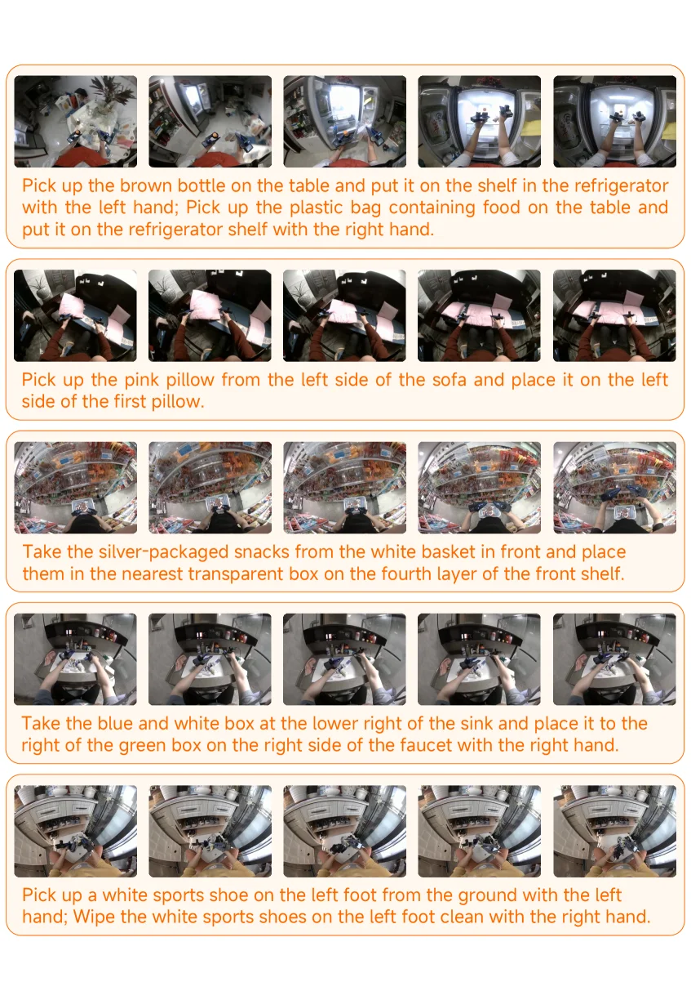

> Figure 12 : Examples of UMI data in the Post-training Dataset.

这张图（图12）展示了“后训练数据集”中的UMI数据示例，旨在说明用于训练Xiaomi-Robotics-1模型的真实世界操作轨迹数据的结构和内容。

图的整体布局是一个垂直排列的序列，包含五个主要部分，每个部分代表一个独立的任务示例。每个任务示例都由两部分组成：上方是一系列连续的图像帧，下方是对应的自然语言指令。

1.  **任务示例的结构**：
    *   **图像序列**：每个任务示例的顶部都有5张连续的图像。这些图像是从机器人的视角（第一人称视角）拍摄的，展示了执行特定任务时的场景变化。图像从左到右按时间顺序排列，显示了任务执行的步骤。例如，第一行的图像显示了机器人从桌子上拿起一个棕色瓶子并将其放入冰箱的过程。
    *   **自然语言指令**：每组图像下方都有一段橙色的文字，这是一个自然语言指令。这个指令描述了需要执行的任务，例如“拿起桌子上的棕色瓶子，用左手将其放在冰箱的架子上；拿起桌子上装有食物的塑料袋，用右手将其放在冰箱架子上。” 这些指令是模型学习的目标，即根据视觉输入和语言指令来生成相应的动作。

2.  **数据的流动和意义**：
    *   数据的流动是从图像序列到自然语言指令，再反过来，模型需要理解图像中的场景并根据自然语言指令执行动作。
    *   图像序列提供了任务的视觉上下文和动态过程，而自然语言指令提供了任务的语义描述和目标。
    *   这种配对方式表明，模型在学习过程中是将视觉观察（图像）与语言指令（文本）相关联，以学习如何根据语言指令执行正确的操作。

3.  **方法的具体运作方式**：
    *   这张图揭示了Xiaomi-Robotics-1模型的训练数据是如何构建的。模型通过大量的真实世界操作轨迹（如图中所示的UMI数据）进行预训练。
    *   预训练阶段的目标是让模型获得广泛且可推广的动作生成能力。通过分析这些图像序列和对应的自然语言指令，模型学习到不同场景下如何根据语言指令执行相应的动作。
    *   图中的每个示例都展示了模型需要理解的视觉场景（图像）和需要执行的语言指令（文本）之间的对应关系。这种大规模的、多样化的训练数据使得模型能够学习到通用的视觉-语言-动作映射关系。
    *   例如，在第二行的任务中，图像显示了机器人从沙发上拿起一个粉色枕头并将其放在另一个枕头旁边，而下方的指令精确地描述了这个动作。
    *   这种数据驱动的方法允许模型在没有明确编程的情况下，通过观察和学习大量的真实世界例子来掌握各种任务。

4.  **结论**：
    *   这张图清晰地展示了Xiaomi-Robotics-1模型所使用的训练数据的格式和内容。每个任务示例都包含视觉信息和语言指令的配对，这使得模型能够学习如何根据自然语言指令在真实世界中执行复杂的操作任务。
    *   图中的多个任务示例（如整理冰箱、摆放枕头、放置零食、移动盒子、擦拭鞋子）展示了模型的多功能性和泛化能力，能够处理不同类型的操作任务。
    *   这种大规模的真实世界数据是模型能够实现“开箱即用”的零样本学习和高效微调的关键。
