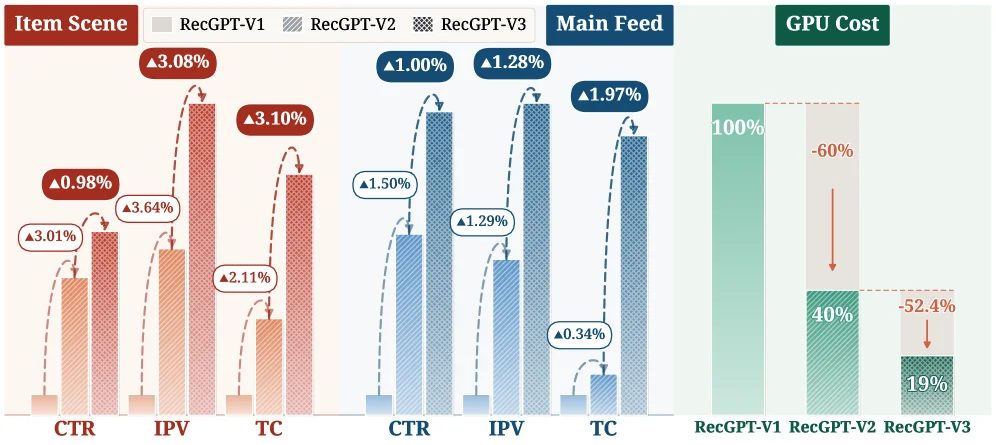
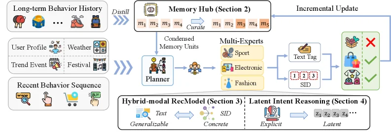
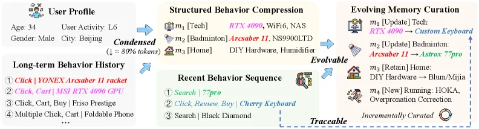
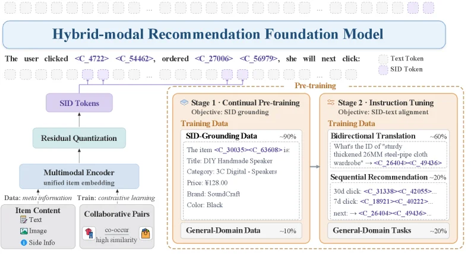
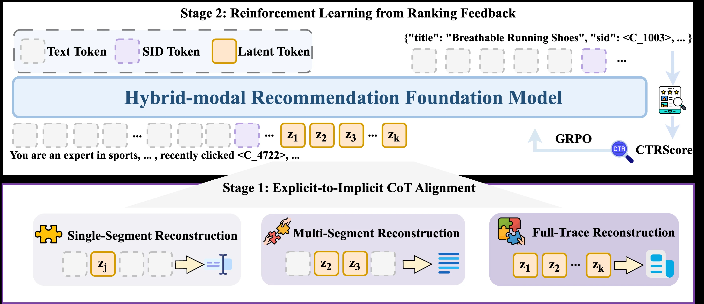
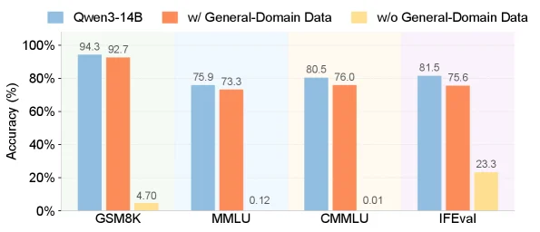
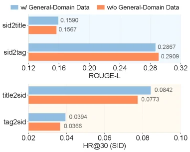
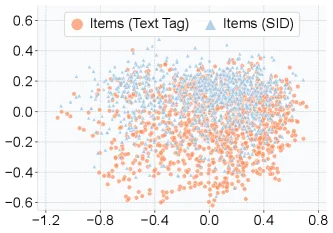
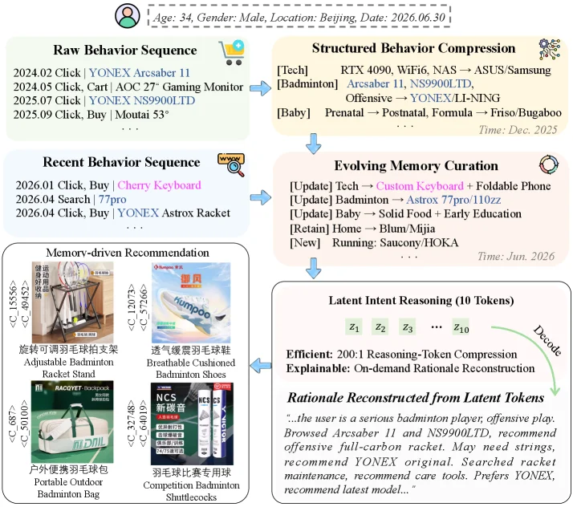

# RecGPT-V3 Technical Report

[arXiv](https://arxiv.org/abs/2607.15591) · [HuggingFace](https://huggingface.co/papers/2607.15591) · ▲19

## Abstract (verbatim)

> Large language models (LLMs) are transforming recommender systems from matching co-occurrence patterns in historical behavior toward reasoning about the intent that drives it. RecGPT-V1 pioneered this paradigm on Taobao by centering user understanding, and RecGPT-V2 scaled it via coordinated multi-agent reasoning; both are deployed in production with consistent gains in user experience and commercial outcomes. However, operating RecGPT at scale reveals three challenges: (1) stateless behavior modeling, where each request reprocesses full user history, wasting computation and discarding prior analysis; (2) a tag-to-item information bottleneck, where natural-language tags form a lossy channel between user understanding and item grounding; and (3) inefficient explicit reasoning, whose lengthy chain-of-thought incurs untenable latency and compute overhead.
  We present RecGPT-V3, a stateful, hybrid-modal recommender that reasons over natural language for open-world knowledge and Semantic IDs (SIDs) for concrete item grounding. A Memory Hub maintains structured, continually evolving user memory that distills long-horizon behavior into condensed units, cutting user-modeling computation by 55.8%. A Hybrid-modal Foundation Model allows the LLM jointly reason over text tags and SIDs, opening a high-bandwidth channel into the item space. Latent Intent Reasoning internalizes verbose rationales into compact learnable latent tokens that remain decodable into readable explanations, lowering output token cost by 200x. Deployed in Taobao's "Guess What You Like" feed, RecGPT-V3 achieves consistent gains in large-scale online A/B tests: IPV +1.28%, CTR +1.00%, TC +1.97%, GMV +3.97%, while cutting end-to-end serving resource consumption by 52.4%.

## Background

### Background Analysis  

#### 1. Technical Context and Real-World Needs  
Recommender systems are the backbone of internet services like e-commerce and content platforms, aiming to understand user needs and match them with relevant items. Traditional methods rely on statistical patterns in historical behavior (e.g., collaborative filtering, sequential models) to predict "the next likely interaction." However, this "correlation-based" approach has fundamental limitations: it cannot interpret the underlying intent behind user actions (e.g., a user buying a badminton racket may reflect a "sports need" rather than mere historical preference). As users demand more personalized experiences, recommendation systems must shift from "mechanical matching" to "intent reasoning"—not just predicting behavior but understanding the motivations (interests, needs, contexts) driving it.  

#### 2. Limitations of Previous Approaches  
While large language models (LLMs) enable intent reasoning, existing LLM-based recommenders face three key challenges:  
- **Stateless behavior modeling**: Each request reprocesses the entire user history, causing redundant computation and failing to accumulate long-term insights (e.g., a user’s interest from six months ago is reanalyzed repeatedly, while recent actions are underweighted).  
- **Tag-to-item bottleneck**: LLMs infer intent via natural-language tags (e.g., "badminton racket"), but tags lack fine-grained alignment with specific items (e.g., a tag like "badminton racket" maps to millions of products, making precise matching impossible).  
- **Inefficient explicit reasoning**: Long Chain-of-Thought (CoT) explanations improve interpretability but incur high latency and computational costs, making them impractical for large-scale real-time services.  

#### 3. Proposed Solutions  
RecGPT-V3 addresses these issues with three innovations:  
- **Memory-Augmented User Modeling**: A "Memory Hub" compresses long-term user behavior into structured memory units (e.g., "sports enthusiast," "recently interested in photography"), avoiding redundant computation while preserving critical context.  
- **Hybrid-Modal Reasoning**: Combines natural language (for open-ended intent) with Semantic IDs (SIDs, encoding item semantics), enabling LLMs to reason directly over item semantics and eliminate the gap between text and concrete items.  
- **Latent Intent Reasoning**: Collapses lengthy CoT into compact "latent tokens," reducing token costs by 200x while retaining interpretability (rationales can be decoded on demand).  

#### 4. Key Differences from Prior Work  
RecGPT-V3’s breakthrough lies in shifting from "stateless, unimodal, explicit reasoning" to "stateful, hybrid-modal, latent reasoning":  
- Unlike RecGPT-V1/V2, it avoids reprocessing full histories by accumulating user knowledge in a structured memory.  
- Unlike pure-text LLM systems, it introduces SIDs as a second modality for precise item alignment.  
- Unlike traditional explicit CoT, it balances efficiency and interpretability by compressing reasoning into learnable latent tokens.  

Deployed on Taobao’s "Guess What You Like" scenario, RecGPT-V3 improved user engagement (e.g., CTR +1.00%) and business metrics (e.g., GMV +3.97%) while reducing compute costs by 52.4%, marking a critical step toward scalable, cost-effective LLM-driven recommendation systems.

## Method, Figure by Figure

> Figure 1 : Performance and efficiency of the RecGPT series on Taobao. Each generation brings further gains on CTR, IPV, TC, and GMV in both the Item Scene and Main Feed, while GPU cost drops steadily: RecGPT-V3 uses only 19% of RecGPT-V1 ’s compute, a 52.4% reduction over RecGPT-V2 .

This figure (Figure 1) from the paper "RecGPT-V3 Technical Report" illustrates the performance improvements and efficiency gains of the RecGPT series models on the Taobao platform. We can understand this figure by dividing it into three main sections: the left "Item Scene," the middle "Main Feed," and the right "GPU Cost."

First, let's look at the "Item Scene" section on the left. This part uses bar charts and arrows to show the performance of the three models—RecGPT-V1, RecGPT-V2, and RecGPT-V3—on three key metrics: Click-Through Rate (CTR), Item Page Views (IPV), and Transaction Count (TC). Each model is represented by a different colored bar: RecGPT-V1 is light orange, RecGPT-V2 is dark orange, and RecGPT-V3 is red. The arrows and percentage labels indicate the improvement of each model compared to the previous one. For example, on the CTR metric, RecGPT-V2 improved by 0.98% compared to RecGPT-V1, while RecGPT-V3 improved by 3.08% compared to RecGPT-V2. Similarly, on the IPV and TC metrics, we can see a similar upward trend, with RecGPT-V3 achieving the largest improvements across all metrics.

Next is the "Main Feed" section in the middle. The structure of this part is similar to the "Item Scene" section, using bar charts and arrows to show the performance of the three models on the CTR, IPV, and TC metrics. The difference here is that the bar colors are in shades of blue, with RecGPT-V1 being light blue, RecGPT-V2 being medium blue, and RecGPT-V3 being dark blue. The arrows and percentage labels also indicate the improvement of each model compared to the previous one. For example, on the CTR metric, RecGPT-V2 improved by 1.50% compared to RecGPT-V1, while RecGPT-V3 improved by 1.00% compared to RecGPT-V2. On the IPV and TC metrics, we also see a similar upward trend, with RecGPT-V3 achieving significant improvements across all metrics.

Finally, the "GPU Cost" section on the right shows the GPU computational cost of the three models using a bar chart. The GPU cost of RecGPT-V1 is set as 100% as a baseline. The GPU cost of RecGPT-V2 is reduced to 40%, a 60% decrease compared to RecGPT-V1. The GPU cost of RecGPT-V3 is further reduced to 19%, a 52.4% decrease compared to RecGPT-V2. This indicates that RecGPT-V3 significantly reduces computational costs while maintaining high performance.

Overall, this figure clearly demonstrates the performance improvements and efficiency gains of the RecGPT series models on the Taobao platform. Each new generation of the model achieves significant improvements in key metrics while reducing computational costs. This is due to several innovations introduced in RecGPT-V3: the Memory Hub for reducing the computational cost of user behavior modeling, the Hybrid-modal Foundation Model for improving the high-bandwidth channel to item grounding, and Latent Intent Reasoning for reducing the latency and computational overhead caused by lengthy reasoning chains.

---

> Figure 2 : Overview of RecGPT-V3 . A Memory Hub distills a user’s long-term behavior into incrementally curated memory units; conditioned on these units and recent behaviors, a planner and its multi-expert modules reason with the Hybrid-modal Foundation Model (natural language and Semantic IDs) and Latent Intent Reasoning (compact latent tokens) to predict the next item to interact with.

This diagram illustrates the overall architecture of RecGPT-V3, which we can break down by the flow of data or information through its components and modules:

### Input Section
- **Long-term Behavior History**: This section contains the user's long-term behavior history, such as the behavioral icons shown in the figure (e.g., shopping, using different devices). These are records of the user's behavior over an extended period and serve as the long-term behavioral input for the entire system.
- **User Profile, Weather, Trend Event, Festival**: This part consists of the user's static or dynamic contextual information. The User Profile describes the user's basic characteristics, while Weather, Trend Event, and Festival are external or internal contextual factors influencing user behavior. Together with the long-term behavior history, they form the input for subsequent processing.
- **Recent Behavior Sequence**: This section includes the user's recent behavior sequence, such as browsing (magnifying glass icon), clicking, adding to cart, and purchasing, as shown in the figure. These are records of the user's recent behavior, used to capture the user's current immediate behavioral tendencies.

### Memory Processing Section (Memory Hub)
- **Distill (Refine)**: The long-term behavior history first enters the "Distill" stage of the Memory Hub. The role of this stage is to refine the user's long-term behavior into condensed memory units (Condensed Memory Units). As can be seen from the figure, after the icons of the long-term behavior history go through "Distill," memory units like \(m_1, m_2, m_3, m_4\) are generated. And with time (Incremental Update), the memory units will continue to increase (e.g., from \(m_1 - m_4\) to \(m_1 - m_5\)), which reflects the continuous evolution of memory.
- **Curate (Manage)**: The Memory Hub also "Curates" (manages) the memory units to ensure that they are orderly and effective, providing structured user memory for subsequent reasoning.

### Reasoning and Planning Section (Planner and Multi-Experts)
- **Planner**: The condensed memory units (from the Memory Hub), the recent behavior sequence (Recent Behavior Sequence), and contextual information (such as User Profile) are input into the Planner together. The role of the Planner is to make plans based on these inputs, preparing for the subsequent multi-expert reasoning.
- **Multi-Experts**: The output of the Planner enters the Multi-Experts module, which contains different experts, such as Sport, Electronic, and Fashion experts in the figure. Each expert is responsible for handling user behavior and intent reasoning in a specific domain. These experts will use the Hybrid-modal Foundation Model to reason, and this model can process both natural language (Text) and semantic IDs (SID) simultaneously.

### Output and Reasoning Section (Text Tag, SID, Latent Intent Reasoning, Hybrid-modal RecModel)
- **Text Tag and SID**: The output of the Multi-Experts will generate Text Tags and SIDs. The Text Tag is a label in natural language form, used to describe the user's intent or behavior; the SID is a semantic ID, used for specific item grounding. The figure shows the output of Text Tags and SIDs, among which the SIDs also have specific numerical identifiers (such as 1, 2, 3).
- **Hybrid-modal RecModel**: This model is a hybrid-modal recommendation model that can handle both natural language (Generalizable) and SIDs (Concrete) simultaneously, achieving the mapping between natural language and specific items, thus supporting the prediction of the next interacted item.
- **Latent Intent Reasoning**: This module is used to internalize the lengthy reasoning process, transforming it into compact learnable latent tokens. These tokens can still be decoded into readable explanations (Explicit). It transforms the latent intent into interpretable content and outputs latent tokens (\(z_1, z_2, z_3, z_4\cdots\)) for further reasoning or prediction.

### Incremental Update and Decision Section
- **Incremental Update**: The incremental update mechanism of the Memory Hub ensures that with the generation of new behaviors, the memory units will be continuously updated, maintaining the timeliness and integrity of user memory.
- **Decision (Correct/Incorrect Marking)**: The final output will be used to predict the next item that the user will interact with. In the figure, the shopping bag icon and correct (√), incorrect (×) marks are used to represent the prediction results. The correct predictions will be selected, and the incorrect ones will be excluded.

### Summary of the Method's Operation Process
1. First, the system collects the user's long-term behavior history, contextual information (user profile, weather, trend event, festival), and recent behavior sequence as input.
2. Then, the Memory Hub refines and manages the long-term behavior history in these inputs, generating condensed memory units and keeping the memory updated through incremental updates.
3. Next, the Planner combines the condensed memory units, recent behavior sequence, and contextual information to make plans. After that, the Multi-Experts module uses the hybrid-modal foundation model (natural language and semantic ID) to perform multi-domain reasoning, generating text tags and semantic IDs.
4. After that, the Hybrid-modal RecModel processes the mixed-modal information of natural language and semantic IDs. The Latent Intent Reasoning transforms the lengthy reasoning into compact latent tokens, which are used to clarify the intent and support prediction.
5. Finally, the memory is continuously optimized through incremental updates, and the next item that the user will interact with is predicted based on the reasoning results, and the correct prediction result is selected.

This diagram clearly shows how RecGPT-V3 addresses challenges in large-scale recommendation systems, such as stateless behavior modeling, the information bottleneck from tags to items, and inefficient explicit reasoning, through memory management, multi-expert reasoning, hybrid-modal models, and latent intent reasoning. Through the collaborative work of these components, it realizes the reasoning of user intent and the prediction of the next interacted item.

---

> Figure 3 : Overview of the Memory Hub. Structured Behavior Compression distills a user’s long-term behavioral history into a compact set of structured memory units, reducing token usage by 94.5 % 94.5\% . Evolving Memory Curation then keeps this memory current by selectively updating existing units and extracting new patterns from unmatched behaviors, yielding a condensed, traceable, and evolvable user representation for downstream recommendation.

This figure presents an overview of the Memory Hub in RecGPT - V3. It mainly consists of three core components, and the flow of data or information as well as the working mechanism of the method are as follows:

First, look at the "User Profile" and "Long - term Behavior History" sections on the far left. The "User Profile" provides basic user information, such as age 34, gender male, city Beijing, user activity level L6, etc. The "Long - term Behavior History" is the user's historical behavior records, for example, clicking on the YONEX Arcsaber II racket, clicking and adding the MSI RTX 4090 GPU to the cart, etc. This information will flow to the "Structured Behavior Compression" module in the middle.

The role of the "Structured Behavior Compression" module is to compress the user's long - term behavior history into a compact set of structured memory units. From the figure, we can see that it compresses the long - term behavior history into three structured memory units: m₁ (technology category, including RTX 4090, WiFi6, NAS), m₂ (badminton category, including Arcsaber 11, NS9900LTD), and m₃ (home category, including DIY Hardware, Humidifier). It is marked that the token usage can be reduced by about 80% (combined with 94.5% in the caption, this may be a reduction at different levels). This compression process is a refinement of the user's long - term behavior, obtaining a more compact memory representation.

Next, the output of "Structured Behavior Compression" and the "Recent Behavior Sequence" flow to the "Evolving Memory Curation" module together. The "Recent Behavior Sequence" shows the user's recent behaviors, such as searching for 77pro, clicking, reviewing and buying Cherry Keyboard, searching for Black Diamond, etc. The function of the "Evolving Memory Curation" module is to keep this memory up - to - date. It will selectively update existing memory units and extract new patterns from unmatched behaviors. From the figure, we can see that m₁ is updated (technology category, RTX 4090 is changed to Custom Keyboard), m₂ is updated (badminton category, Arcsaber 11 is changed to Astrox 77pro), m₃ is retained (home category, DIY Hardware is changed to Blum/Mijia), and a new memory unit m₄ is created (running category, HOKA, Overpronation Correction). This process makes the user representation compact, traceable, and evolvable, so as to be used for downstream recommendation tasks.

Overall, the working process of this Memory Hub is: first, use the user profile and long - term behavior history, and compress the long - term behavior into a compact structured memory unit through structured behavior compression; then, combined with the recent behavior sequence, maintain and update these memory units through evolving memory management, so that it can reflect the user's current intention and behavior pattern, and finally obtain an efficient user representation for recommendation. This method solves the problems faced by the previous RecGPT. For example, through structured behavior compression, the computational cost of user modeling is reduced (55.8% reduction is mentioned in the caption). Through the hybrid - modal foundation model (although not directly shown in the figure, combined with the paper abstract), a high - bandwidth channel can be established between text tags and specific items. Through latent intent reasoning (not directly shown in the figure), verbose rationales can be internalized into compact learnable latent tokens while remaining decodable into readable explanations.

---

> Figure 4 : Overview of the Hybrid-modal Foundation Model. Multimodal item features are quantized into 65 , 536 65{,}536 SID tokens via CN-CLIP and a two-level RQ-VAE, extending the Qwen3-14B vocabulary. Continual pre-training (Stage 1) and instruction tuning (Stage 2) then align these tokens with language, with general-domain data mixed into both stages.

This figure illustrates the overall architecture and workflow of the Hybrid - modal Recommendation Foundation Model. We can understand its operation by analyzing the data input, processing, and pre - training phases step by step:

### Data Input and Initial Processing
- **Data Sources**: The "Item Content" on the left includes text (Text), image (Image), and side information (Side Info), which are the original multimodal data of commodities; "Collaborative Pairs" is constructed through "co - occur" (co - occurrence) and "high similarity" (high similarity) and is used for subsequent collaborative learning.
- **Processing Modules**:
    - The "Multimodal Encoder" is responsible for generating a unified item embedding for commodity content. It is trained through contrastive learning, converting multimodal commodity information into a unified vector representation.
    - Next is the "Residual Quantization" module, which is associated with "SID Tokens". According to the figure description, multimodal commodity features are quantized into 65,536 SID tokens through CN - CLIP and a two - level RQ - VAE, and the vocabulary of Qwen3 - 14B is extended. Here, SID tokens are a discrete representation of commodity features, which is convenient for subsequent alignment with the language modality.

### Pre - training Phase (Pre - training)
Pre - training is divided into two stages, namely "Stage 1 - Continual Pre - training" and "Stage 2 - Instruction Tuning". These two stages mix general - domain data (General - Domain Data) in the training data and have different objectives and data distributions:

#### Stage 1: Continual Pre - training
- **Objective**: "SID grounding", that is, let the model learn to associate SID tokens with the actual information of commodities.
- **Training Data**:
    - "SID - Grounding Data" accounts for about 90%. This type of data contains specific information about commodities. For example, the example given in the figure: the SID of the commodity (<C_30035><C_63608>), title (Title: DIY Handmade Speaker), category (Category: 3C Digital - Speakers), price (Price: ¥128.00), brand (Brand: SoundCraft), color (Color: Black), etc. These data help the model establish the connection between SID and commodity attributes.
    - "General - Domain Data" accounts for about 10%. General - domain data is used to supplement the model's knowledge, enabling it to have a broader background knowledge and be able to reason in different scenarios.

#### Stage 2: Instruction Tuning
- **Objective**: "SID - text alignment", that is, let the model learn to align SID tokens with natural language text, so as to be able to understand the user's intent expressed in natural language and associate it with specific commodities (represented by SID).
- **Training Data**:
    - "Bidirectional Translation" accounts for about 60%. This type of data includes questions and answers to questions, which involve the corresponding relationship between SID and text. For example, the example given in the figure: "What's the ID of 'vandy thickened 26MM steel - pipe cloth wardrobe'?" and the corresponding SID (<C_26404><C_49436>). Through this bidirectional translation task, the model learns how to convert natural language questions into the corresponding SID representation or vice versa.
    - "Sequential Recommendation" accounts for about 20%. This type of data includes the user's click sequence, such as "30d click <C_31338><C_42055>... 7d click <C_18921><C_40222>... next: <C_26404><C_49436>". The model understands the user's click behavior pattern by learning these sequence data, so as to be able to make sequential recommendations.
    - "General - Domain Tasks" account for about 20%. General - domain tasks are used to further optimize the model's instruction - following ability, enabling it to better understand various types of instructions and align with SID.

### Overall Workflow and Information Flow
- Data starts from "Item Content" and "Collaborative Pairs", goes through the unified embedding of "Multimodal Encoder" and the quantization of "Residual Quantization", and generates SID tokens.
- Then, these SID tokens enter the pre - training stage. In "Stage 1", they undergo continual pre - training through "SID - Grounding Data" and "General - Domain Data" with the objective of SID grounding; then in "Stage 2", they undergo instruction tuning through "Bidirectional Translation", "Sequential Recommendation", and "General - Domain Tasks" with the objective of SID - text alignment.
- Finally, this hybrid - modal foundation model can process both natural language (text) and SID (semantic ID) at the same time, thus realizing the understanding of user intent and the accurate positioning of commodities in the recommendation system, and solving the problems of stateless behavior modeling, information bottleneck from tag to item, and inefficient explicit reasoning existing in previous methods.

This figure clearly shows the working mechanism of the hybrid - modal foundation model in RecGPT - V3, from the source of data processing to the two stages of pre - training and then to the final model ability, allowing us to understand how it aligns multimodal commodity features with the language modality to achieve a more effective recommendation system.

---

> Figure 5 : Overview of Latent Intent Reasoning. Three reconstruction-based alignment tasks compress an explicit chain-of-thought trace into a short sequence of learnable latent tokens z z that faithfully encode it. A two-stage post-training pipeline then internalizes this reasoning into the model: Explicit-to-Implicit CoT Alignment first distills teacher traces into the latent tokens, and Reinforcement Learning from Ranking Feedback then refines the policy against online business rewards.

This figure illustrates the "Latent Intent Reasoning" module in RecGPT-V3, designed to address the inefficiency of explicit reasoning in large language models (LLMs) for recommendation systems. The diagram can be understood in two main stages:

**Stage 1: Explicit-to-Implicit CoT Alignment**
The goal of this stage is to compress a lengthy explicit Chain-of-Thought (CoT) into a compact sequence of learnable latent tokens.
*   **Three Reconstruction Tasks**: The image shows three reconstruction tasks of varying granularity, which collectively transform explicit reasoning processes into latent tokens:
    *   **Single-Segment Reconstruction**: Takes a single latent token `z_j` (represented by a yellow box) as input and produces a simplified representation (depicted by an equals sign and a vertical line). This likely represents reconstructing local information from a single latent token.
    *   **Multi-Segment Reconstruction**: Takes multiple consecutive latent tokens (e.g., `z_2`, `z_3` in the figure) as input and produces a more structured representation (depicted by three horizontal lines). This likely represents reconstructing more complex local context from a set of related latent tokens.
    *   **Full-Trace Reconstruction**: Takes a complete explicit CoT, represented as a sequence of latent tokens (`z_1`, `z_2`, ..., `z_k`), as input and produces a complete, structured representation (depicted by three horizontal lines and a blue vertical line). This represents reconstructing global information from the entire reasoning trace.
*   **Information Flow**: The core of these tasks is to transform explicit, potentially text-based reasoning steps (understood as the original CoT input to these reconstruction tasks) into a sequence of latent tokens. Through these reconstruction tasks, the model learns to accurately represent and reconstruct the original explicit reasoning with fewer latent tokens.

**Stage 2: Reinforcement Learning from Ranking Feedback**
The goal of this stage is to internalize the latent intent reasoning strategy learned in Stage 1 into the foundation model and optimize it using actual online business rewards (e.g., click-through rate).
*   **Hybrid-modal Recommendation Foundation Model**: This is the core recommendation model that processes multiple types of input:
    *   **Text Tokens** (gray dashed boxes): Represent natural language descriptions, such as user profiles or item tags.
    *   **SID Tokens** (purple dashed boxes): Represent Semantic IDs (SIDs), used for concrete item grounding.
    *   **Latent Tokens** (orange solid boxes: `z_1`, `z_2`, ..., `z_k`): These are the compact representations learned in Stage 1, containing user intent information.
    *   **User History/Prompt** (text below the model: "You are an expert in sports, ..., recently clicked <C_4722>, ..."): Represents user background information or the context of the current query.
*   **Information Flow and Optimization**:
    1.  The hybrid-modal model processes the above inputs and generates recommendation results (an example item with a star rating is shown in the top-right, with its JSON representation including "title" and "sid").
    2.  The recommendation results generate an online business reward, represented by "CTRScore" (Click-Through Rate Score) in the figure.
    3.  This reward is fed back to the model through "GRPO" (a reinforcement learning algorithm, possibly Guided Relative Policy Optimization) to adjust the model's parameters, particularly the representation of latent tokens, to optimize future recommendation strategies.
    4.  The arrow from the CTRScore to the model (via GRPO) indicates that feedback based on the CTRScore guides the model's learning, thereby improving its recommendation performance.

**Overall Methodology Revealed**:
This figure clearly demonstrates the operational mechanism of "Latent Intent Reasoning" in RecGPT-V3:
1.  First, three reconstruction tasks of different granularities (single-segment, multi-segment, full-trace) compress a lengthy explicit CoT into a compact set of latent intent tokens. These tokens can faithfully encode the original reasoning information.
2.  Then, these latent tokens are integrated into a hybrid-modal recommendation foundation model, which combines natural language text and semantic IDs to understand user intent and item features.
3.  Finally, through reinforcement learning (GRPO), the model optimizes its strategy based on actual online business rewards (e.g., CTR), making the latent intent reasoning more effective and thus enhancing the performance of the recommendation system.

In summary, this method addresses the inefficiency of explicit reasoning through a "compression - internalization - optimization" process, enabling the recommendation system to reason and recommend more efficiently and intelligently.

---

> Table 4 : The three alignment tasks on a running example (a badminton-equipment expert), each a choice of the masked set 𝒥 \mathcal{J} . Latent tokens <cot> replace the segments they encode, and the model reconstructs the masked segments R 𝒥 R_{\mathcal{J}} from the surrounding context. The gray anchors x x and y y mark the input and output, whose specific content is omitted here. Table 5 : Training data mixture in Stage 1. Table 6 : Online A/B test results comparing RecGPT-V3 against RecGPT-V2 baseline across item and feed scenarios. All metrics show relative percentage improvements (% omitted). Table 7 : Human evaluation of memory unit quality. “Behavior Pattern” measures whether the assigned pattern identifier correctly categorizes the user’s behavioral cluster; “Behavior Index” measures whether the representative indices correctly point to interactions belonging to the identified pattern. Table 8: User-modeling compute cost with and without the memory hub, expressed relative to the RecGPT-V2 baseline. Figure 6 : General capability evaluation across four benchmarks. The hybrid-modal foundation model ( w/ General-Domain Data ) preserves most of the backbone’s capabilities, while removing general-domain data ( w/o General-Domain Data ) leads to catastrophic collapse. Figure 7 : SID–text semantic alignment across four bidirectional translation tasks. Table 9 : Downstream recommendation quality comparison. Table 10 : Post-training effectiveness comparison. The upper group evaluates reasoning on the base language model; the lower group evaluates on the hybrid-modal foundation model. “–” indicates metrics not applicable to configurations outside the online feedback pipeline. Table 11 : Inference efficiency comparison between explicit CoT and latent reasoning on 1,000 samples under identical hardware. “Output Length” denotes the average number of tokens generated per sample, including reasoning and final output; “Input/Output TPM” denotes the tokens-per-minute throughput during prefill and decoding, respectively; “Total Time” denotes the wall-clock time to process all samples. Table 12 : Comparison between text tags and SIDs on category-level statistics. Figure 8 : PCA visualization of item embeddings retrieved by text tags and SIDs. Table 13 : Item-level hit rate under text tag, SID, and hybrid retrieval configurations. Figure 9 : Case study. The memory hub compresses a user’s raw behavior sequence into structured preference units and incrementally updates them with recent behaviors. Based on the curated memory, RecGPT-V3 performs latent intent reasoning with only 10 tokens, reconstructs an explainable rationale on demand, and generates memory-driven badminton recommendations grounded by SIDs.

This figure is Figure 6 from the paper "RecGPT-V3 Technical Report," titled "General capability evaluation across four benchmarks." It demonstrates the performance of RecGPT-V3's foundation model across different data configurations on four distinct benchmark tasks.

The key components of the figure are:

1.  **X-axis (Horizontal Axis)**: This represents four different benchmark tasks:
    *   **GSM8K**: A mathematical reasoning benchmark typically involving elementary-level math problems that require multi-step reasoning.
    *   **MMLU**: A large-scale multi-task language understanding benchmark that assesses a model's knowledge and reasoning ability across multiple academic subjects.
    *   **CMMLU**: Another multi-task language understanding benchmark, possibly focusing on specific domains or culturally relevant knowledge.
    *   **IFEval**: This likely refers to an information retrieval or evaluation-related benchmark; specific details are available in the paper, but from the figure's results, it evaluates the model's accuracy on particular tasks.

2.  **Y-axis (Vertical Axis)**: This represents "Accuracy (%)," measuring the percentage of correct answers or task completions by the model on each benchmark.

3.  **Legend**: This explains the meaning of the different colored bars:
    *   **Blue bar (Qwen3-14B)**: This likely represents a baseline model or an early version/core model of RecGPT-V3, trained without specific data augmentation. It shows high accuracy across all four benchmarks.
    *   **Orange bar (w/ General-Domain Data)**: This represents a model trained or enhanced with "general-domain data." "General-domain data" refers to broad knowledge data, not specific to the recommendation system domain. The figure shows that this version of the model has accuracy levels very close to the blue bar (Qwen3-14B) across all benchmarks, with slight decreases in some tasks (e.g., GSM8K, MMLU).
    *   **Yellow bar (w/o General-Domain Data)**: This represents a model without "general-domain data." The figure clearly shows a drastic drop in accuracy for this model across all four benchmarks, even approaching zero (e.g., in MMLU, CMMLU, and IFEval). This indicates that general-domain data is crucial for maintaining the model's general capabilities.

**Data Flow and Interpretation**:

The figure evaluates the impact of general-domain data on the model's general capabilities by comparing its performance across four independent benchmarks with different data configurations. Readers can examine the results sequentially from left to right for each benchmark:

*   **GSM8K Task**: The Qwen3-14B model achieves 94.3% accuracy, while the model with general-domain data achieves 92.7%, which are very close. However, the model without general-domain data sees its accuracy plummet to 4.70%. This suggests that general-domain data helps maintain high performance in mathematical reasoning tasks.
*   **MMLU Task**: The Qwen3-14B model scores 75.9%, and the model with general-domain data scores 73.3%, a slight decrease but still high. The model without general-domain data has an accuracy of almost zero (0.12%). This strongly indicates that general-domain data is essential for the model's multi-task language understanding capability.
*   **CMMLU Task**: The Qwen3-14B model scores 80.5%, and the model with general-domain data scores 76.0%, again a slight decrease. The model without general-domain data has an accuracy of almost zero (0.01%). Similar to MMLU, this confirms the importance of general-domain data.
*   **IFEval Task**: The Qwen3-14B model scores 81.5%, and the model with general-domain data scores 75.6%. The model without general-domain data scores only 23.3%, which is higher than in the previous two tasks but still significantly lower than the model with general-domain data.

**Conclusion**:

This figure clearly illustrates the importance of general-domain data for maintaining the general capabilities of RecGPT-V3's foundation model. Specifically:

*   **Capability Preservation**: When the model uses general-domain data (w/ General-Domain Data), its performance is very close to the baseline model (Qwen3-14B), indicating that adding general-domain data does not significantly harm the model's existing capabilities or that the model can effectively utilize this data for general reasoning.
*   **Catastrophic Collapse**: When general-domain data is removed (w/o General-Domain Data), the model's performance across all four benchmarks catastrophically collapses, with accuracy dropping sharply to near-zero levels. This demonstrates that general-domain data is a key factor in maintaining the model's general knowledge and reasoning abilities.

Therefore, the figure proves that RecGPT-V3's hybrid-modal foundation model can effectively retain its core general capabilities when trained with general-domain data, whereas lacking such data leads to a severe degradation in performance. This is important for ensuring that the recommendation system is not only good at recommending items but also possesses certain general understanding and reasoning abilities.

---

> Table 4 : The three alignment tasks on a running example (a badminton-equipment expert), each a choice of the masked set 𝒥 \mathcal{J} . Latent tokens <cot> replace the segments they encode, and the model reconstructs the masked segments R 𝒥 R_{\mathcal{J}} from the surrounding context. The gray anchors x x and y y mark the input and output, whose specific content is omitted here. Table 5 : Training data mixture in Stage 1. Table 6 : Online A/B test results comparing RecGPT-V3 against RecGPT-V2 baseline across item and feed scenarios. All metrics show relative percentage improvements (% omitted). Table 7 : Human evaluation of memory unit quality. “Behavior Pattern” measures whether the assigned pattern identifier correctly categorizes the user’s behavioral cluster; “Behavior Index” measures whether the representative indices correctly point to interactions belonging to the identified pattern. Table 8: User-modeling compute cost with and without the memory hub, expressed relative to the RecGPT-V2 baseline. Figure 6 : General capability evaluation across four benchmarks. The hybrid-modal foundation model ( w/ General-Domain Data ) preserves most of the backbone’s capabilities, while removing general-domain data ( w/o General-Domain Data ) leads to catastrophic collapse. Figure 7 : SID–text semantic alignment across four bidirectional translation tasks. Table 9 : Downstream recommendation quality comparison. Table 10 : Post-training effectiveness comparison. The upper group evaluates reasoning on the base language model; the lower group evaluates on the hybrid-modal foundation model. “–” indicates metrics not applicable to configurations outside the online feedback pipeline. Table 11 : Inference efficiency comparison between explicit CoT and latent reasoning on 1,000 samples under identical hardware. “Output Length” denotes the average number of tokens generated per sample, including reasoning and final output; “Input/Output TPM” denotes the tokens-per-minute throughput during prefill and decoding, respectively; “Total Time” denotes the wall-clock time to process all samples. Table 12 : Comparison between text tags and SIDs on category-level statistics. Figure 8 : PCA visualization of item embeddings retrieved by text tags and SIDs. Table 13 : Item-level hit rate under text tag, SID, and hybrid retrieval configurations. Figure 9 : Case study. The memory hub compresses a user’s raw behavior sequence into structured preference units and incrementally updates them with recent behaviors. Based on the curated memory, RecGPT-V3 performs latent intent reasoning with only 10 tokens, reconstructs an explainable rationale on demand, and generates memory-driven badminton recommendations grounded by SIDs.

This figure (Figure 8) shows the **PCA visualization of item embeddings retrieved by text tags and Semantic IDs (SIDs)**, core to comparing the performance of a "hybrid - modal foundation model trained with general - domain data (w/ General - Domain Data, blue bars)" and a "model trained without general - domain data (w/o General - Domain Data, orange bars)" across four bidirectional translation tasks (corresponding to four alignment tasks: sid2title, sid2tag, title2sid, tag2sid). It aims to verify the capability retention of the hybrid - modal model.

### Component and Data Flow/Comparison Logic:
- **X - axis (Metric)**: Divided into two parts. The upper part is `ROUGE - L` (a text - generation similarity metric measuring the overlap between generated text and reference text), and the lower part is `HR@30 (SID)` (Hit Rate at 30, measuring the proportion of hits in the top 30 results of SID - based retrieval, reflecting the accuracy of recommendation/retrieval).
- **Y - axis (Task)**: The four tasks are `sid2title` (generating a title from a semantic ID), `sid2tag` (generating a tag from a semantic ID), `title2sid` (generating a semantic ID from a title), and `tag2sid` (generating a semantic ID from a tag), representing the **bidirectional translation capability between text (tags/titles) and SIDs**, which is the core embodiment of the hybrid - modal model's "natural language understanding + item grounding (SID)" capability.
- **Comparison Objects**: For each task, there are two bars. The blue bar represents the model "trained with general - domain data", and the orange bar represents the model "trained without general - domain data". By comparing the heights (metric values) of the bars, we can observe the impact of general - domain data on the model's capability.

### Method Operation Reflection (Inferring Method Logic from Results):
The design goal of the hybrid - modal foundation model (w/ General - Domain Data) is to **simultaneously have the ability of natural language reasoning (processing text tags/titles) and item grounding (processing SIDs)**. From the results in the figure:
- For `sid2title` and `sid2tag` (generating text from SID): The `ROUGE - L` of the model with general - domain data (blue) is slightly lower than that without (orange), but the gap is small (e.g., sid2title: 0.1590 vs 0.1567; sid2tag: 0.2867 vs 0.2909). This shows that the model's ability to "generate text from SID" is less affected by general - domain data, or the model itself has well - retained this ability.
- For `title2sid` and `tag2sid` (generating SID from text): The `HR@30 (SID)` of the model with general - domain data (blue) is significantly higher than that without (orange): 0.0842 vs 0.0773 for title2sid; 0.0394 vs 0.0366 for tag2sid. This shows that **general - domain data helps the model improve the ability to "map from text (title/tag) to SID (item grounding)"**, while the ability to "generate text from SID" is less affected (or the model's ability in this direction is already strong) by general - domain data.

### Conclusion:
The hybrid - modal foundation model (trained with general - domain data) has a significant performance improvement in the "text → SID" retrieval tasks (title2sid, tag2sid) compared with the model without general - domain data; while in the "SID → text" generation tasks (sid2title, sid2tag), the performance of the two is close. This verifies the design logic of the hybrid - modal model: **General - domain data helps enhance the model's grounding ability from natural language (text) to items (SIDs) while retaining (or slightly affecting) the generation ability from SID to natural language**, thus supporting the recommendation reasoning paradigm of "natural language understanding + item grounding".

---

> Table 4 : The three alignment tasks on a running example (a badminton-equipment expert), each a choice of the masked set 𝒥 \mathcal{J} . Latent tokens <cot> replace the segments they encode, and the model reconstructs the masked segments R 𝒥 R_{\mathcal{J}} from the surrounding context. The gray anchors x x and y y mark the input and output, whose specific content is omitted here. Table 5 : Training data mixture in Stage 1. Table 6 : Online A/B test results comparing RecGPT-V3 against RecGPT-V2 baseline across item and feed scenarios. All metrics show relative percentage improvements (% omitted). Table 7 : Human evaluation of memory unit quality. “Behavior Pattern” measures whether the assigned pattern identifier correctly categorizes the user’s behavioral cluster; “Behavior Index” measures whether the representative indices correctly point to interactions belonging to the identified pattern. Table 8: User-modeling compute cost with and without the memory hub, expressed relative to the RecGPT-V2 baseline. Figure 6 : General capability evaluation across four benchmarks. The hybrid-modal foundation model ( w/ General-Domain Data ) preserves most of the backbone’s capabilities, while removing general-domain data ( w/o General-Domain Data ) leads to catastrophic collapse. Figure 7 : SID–text semantic alignment across four bidirectional translation tasks. Table 9 : Downstream recommendation quality comparison. Table 10 : Post-training effectiveness comparison. The upper group evaluates reasoning on the base language model; the lower group evaluates on the hybrid-modal foundation model. “–” indicates metrics not applicable to configurations outside the online feedback pipeline. Table 11 : Inference efficiency comparison between explicit CoT and latent reasoning on 1,000 samples under identical hardware. “Output Length” denotes the average number of tokens generated per sample, including reasoning and final output; “Input/Output TPM” denotes the tokens-per-minute throughput during prefill and decoding, respectively; “Total Time” denotes the wall-clock time to process all samples. Table 12 : Comparison between text tags and SIDs on category-level statistics. Figure 8 : PCA visualization of item embeddings retrieved by text tags and SIDs. Table 13 : Item-level hit rate under text tag, SID, and hybrid retrieval configurations. Figure 9 : Case study. The memory hub compresses a user’s raw behavior sequence into structured preference units and incrementally updates them with recent behaviors. Based on the curated memory, RecGPT-V3 performs latent intent reasoning with only 10 tokens, reconstructs an explainable rationale on demand, and generates memory-driven badminton recommendations grounded by SIDs.

This figure (Figure 8) is a **PCA (Principal Component Analysis) visualization** that compares the item embeddings retrieved by "Text Tags" and "Semantic IDs (SIDs)" in the feature space, aiming to reveal the similarity and distinction of item representations under different retrieval methods.  

### Components and Data Flow Logic  
- **X-axis and Y-axis**: These are two principal components after PCA dimensionality reduction, with value ranges approximately from -1.2 to 0.8 (X-axis) and -0.6 to 0.6 (Y-axis). They map high-dimensional item embeddings to a 2D space for visualization.  
- **Data Points**:  
  - Orange dots (`Items (Text Tag)`): Represent the projections of item embeddings retrieved by **text tags** in the PCA space.  
  - Blue triangles (`Items (SID)`): Represent the projections of item embeddings retrieved by **Semantic IDs (SIDs)** in the PCA space.  
- **Distribution Trend**: From the figure, there is obvious **spatial overlap** between the item embeddings of the two retrieval methods, but also their own concentrated areas. This means:  
  - The items retrieved by text tags and SIDs have certain "semantic relevance" (the overlapping part) in the feature space, indicating that both methods can capture some common features of items;  
  - At the same time, the embedding distributions of the two methods are different (the concentrated areas of orange dots and blue dots are different), reflecting that text tags (natural language descriptions) and SIDs (structured identifiers) represent items from different perspectives (text is more inclined to semantic description, while SID is more inclined to structured indexing).  

### Revelation of Method Operation (Combined with Paper Background)  
One of the core challenges of RecGPT-V3 is the "text-to-item information bottleneck": natural language tags have information loss between user understanding and item matching. This figure intuitively shows the embedding differences between the two retrieval methods ("text tags" and "SIDs") by **visualizing item embeddings via PCA**:  
- If the embedding distributions of the two methods are too scattered (no overlap), it means that the representations of items by text tags and SIDs are very different, which may lead to difficulties in "tag → item" matching;  
- The obvious overlapping area in the figure indicates that the embeddings of text tags and SIDs have **semantic alignment** in the feature space, which supports the "hybrid-modal reasoning" design of RecGPT-V3 (simultaneously using text tags for semantic reasoning and SIDs for item grounding) — because the embeddings of the two methods have sufficient correlation, they can interact in a unified semantic space.  

### Results and Conclusions (Comparison and Findings)  
- **Comparison Objects**: Item embeddings retrieved by text tags (orange dots) vs. item embeddings retrieved by SIDs (blue dots).  
- **Coordinates and Distribution**: Both embeddings have their own concentrated areas in the 2D PCA space, but there is a significant overlap.  
- **Conclusion**: The item embeddings of text tags and SIDs have **semantic alignment** (the overlapping part) in the feature space, indicating that the two retrieval methods can interact in a unified semantic space. This provides a basis for the "hybrid-modal reasoning" of RecGPT-V3 (simultaneously processing text tags and SIDs) — leveraging both the semantic understanding ability of text tags and the item grounding ability of SIDs, and solving the "text-to-item information bottleneck" problem.  

(Note: For unclear or uncertain parts in the figure, handle them according to the caption. The key is to explain the core logic of the visualization: use PCA to show the embedding distributions of the two retrieval methods, reveal semantic alignment, and support the design of hybrid-modal reasoning.)

---

> Table 4 : The three alignment tasks on a running example (a badminton-equipment expert), each a choice of the masked set 𝒥 \mathcal{J} . Latent tokens <cot> replace the segments they encode, and the model reconstructs the masked segments R 𝒥 R_{\mathcal{J}} from the surrounding context. The gray anchors x x and y y mark the input and output, whose specific content is omitted here. Table 5 : Training data mixture in Stage 1. Table 6 : Online A/B test results comparing RecGPT-V3 against RecGPT-V2 baseline across item and feed scenarios. All metrics show relative percentage improvements (% omitted). Table 7 : Human evaluation of memory unit quality. “Behavior Pattern” measures whether the assigned pattern identifier correctly categorizes the user’s behavioral cluster; “Behavior Index” measures whether the representative indices correctly point to interactions belonging to the identified pattern. Table 8: User-modeling compute cost with and without the memory hub, expressed relative to the RecGPT-V2 baseline. Figure 6 : General capability evaluation across four benchmarks. The hybrid-modal foundation model ( w/ General-Domain Data ) preserves most of the backbone’s capabilities, while removing general-domain data ( w/o General-Domain Data ) leads to catastrophic collapse. Figure 7 : SID–text semantic alignment across four bidirectional translation tasks. Table 9 : Downstream recommendation quality comparison. Table 10 : Post-training effectiveness comparison. The upper group evaluates reasoning on the base language model; the lower group evaluates on the hybrid-modal foundation model. “–” indicates metrics not applicable to configurations outside the online feedback pipeline. Table 11 : Inference efficiency comparison between explicit CoT and latent reasoning on 1,000 samples under identical hardware. “Output Length” denotes the average number of tokens generated per sample, including reasoning and final output; “Input/Output TPM” denotes the tokens-per-minute throughput during prefill and decoding, respectively; “Total Time” denotes the wall-clock time to process all samples. Table 12 : Comparison between text tags and SIDs on category-level statistics. Figure 8 : PCA visualization of item embeddings retrieved by text tags and SIDs. Table 13 : Item-level hit rate under text tag, SID, and hybrid retrieval configurations. Figure 9 : Case study. The memory hub compresses a user’s raw behavior sequence into structured preference units and incrementally updates them with recent behaviors. Based on the curated memory, RecGPT-V3 performs latent intent reasoning with only 10 tokens, reconstructs an explainable rationale on demand, and generates memory-driven badminton recommendations grounded by SIDs.

This diagram illustrates the workflow of RecGPT-V3 in the badminton equipment recommendation scenario, clearly presenting the complete logic from user behavior processing to recommendation generation:

### 1. Behavior Input and Processing Flow
- **Raw Behavior Sequence**: Displays the user's historical behaviors, such as clicks and purchase operations at different times (for example, clicking YONEX Arcsaber 11 in February 2024, clicking the shopping cart and purchasing an AOC 27 Gaming Monitor in May 2024, etc.). These are the initial behavior records of the user and are the raw data for subsequent processing.
- **Structured Behavior Compression**: Processes the raw behavior sequence, structures the behaviors by categories (such as [Tech], [Badminton], [Baby]), and extracts the user's preference patterns (for example, preferring RTX 4090, WiFi6, etc. in the Tech category; preferring YONEX NS9900LTD, etc. in the Badminton category). This process is a preliminary compression and organization of the raw behaviors, with a time stamp of December 2025, indicating the result after phased processing.
- **Recent Behavior Sequence**: Focuses on the user's recent behaviors, such as clicking to purchase a Cherry Keyboard in January 2026, searching for 77pro and purchasing a YONEX Astrox Racket in April 2026, etc. These are the user's latest behaviors, used to update the user's memory.
- **Evolving Memory Curation**: Updates the user's memory incrementally by combining the results of structured behavior compression and recent behaviors. For example, the Tech category is updated to Custom Keyboard + Foldable Phone; the Badminton category is updated to Astrox 77pro/110zz, etc.; at the same time, there are retained (Retain) and new (New) behavior categories. With a time stamp of June 2026, it reflects the dynamic update process of memory.

### 2. Recommendation Generation and Intent Reasoning
- **Memory - driven Recommendation**: Generates recommended products based on the evolved user memory, such as the adjustable badminton racket stand, breathable cushioned badminton shoes, portable outdoor badminton bag, badminton competition ball, etc. shown in the figure. These recommendations are generated based on the user's behavioral memory and preferences.
- **Latent Intent Reasoning**: Uses 10 learnable latent tokens (\(z_1,z_2,\dots,z_{10}\)) to internalize the lengthy reasoning process. These latent tokens can be decoded into readable explanations (Rationale Reconstructed from Latent Tokens), for example, explaining that the user is a serious badminton player, prefers an offensive playing style, after browsing a specific racket, recommends an offensive racket, maintenance tools, prefers original YONEX products and recommends the latest models, etc. This process realizes efficient intent reasoning while maintaining interpretability.

### 3. Data Flow and Method Logic
The data flow order is: Raw Behavior Sequence → Structured Behavior Compression → Recent Behavior Sequence → Evolving Memory Curation → Memory - driven Recommendation and Latent Intent Reasoning. The entire process shows how RecGPT - V3 extracts preferences from the user's historical and recent behaviors, dynamically updates the user model through memory management, and then uses latent intent reasoning to generate interpretable recommendation reasons and specific product recommendations. This method solves the problems of previous versions, such as reducing computational effort through a memory hub (the text mentions a 55.8% reduction in user modeling computation), achieving efficient item grounding through a hybrid modal model (text labels and SIDs), and realizing efficient intent reasoning through latent tokens.
